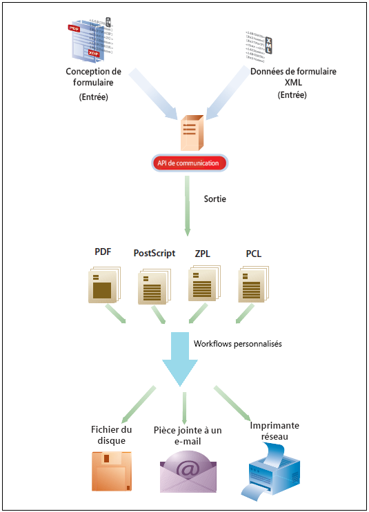
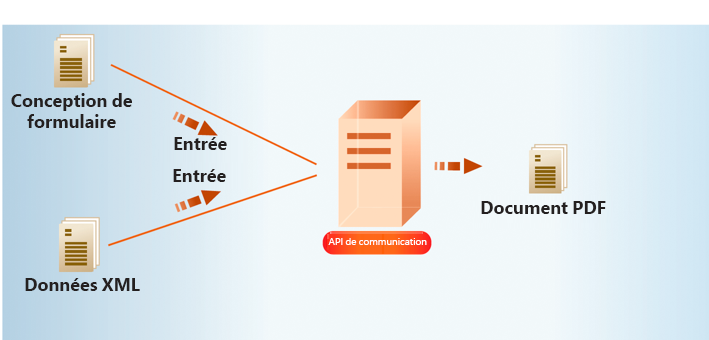
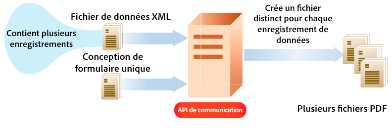
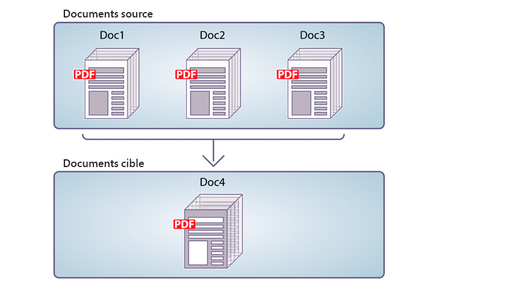
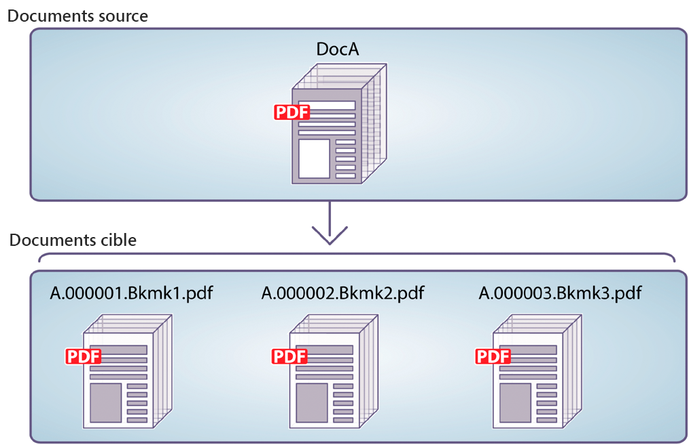

# API de communication d’AEM Forms as a Cloud Service {#communications-apis-overview}

> **Disponibilité de la version**
>
> * **AEM 6.5** : [Présentation d’AEM Document Services](https://experienceleague.adobe.com/docs/experience-manager-65/forms/use-document-services/overview-aem-document-services.html?lang=fr)
> * **AEM as a Cloud Service** : cet article

## Présentation

Les API de communication d’AEM Forms as a Cloud Service vous permettent de créer des documents personnalisés, normalisés et approuvés par la marque, adaptés aux besoins de votre entreprise. Ces puissantes API vous permettent de générer, manipuler et sécuriser des documents par programmation, que ce soit à la demande ou dans les processus par lots à volume élevé.

### Principaux avantages

* **Génération de documents rationalisée** - Créez des documents personnalisés en fusionnant des modèles avec les données du client
* **Puissante manipulation de documents** - Combinez, réorganisez et validez les documents PDF par programmation
* **Options de déploiement flexibles** - Utilisez des API à la demande pour les besoins de faible latence ou des API par lots pour les opérations à débit élevé.
* **Sécurité renforcée** - Appliquez les signatures numériques, la certification et le chiffrement pour protéger les documents sensibles
* **Architecture native dans le cloud** - Tirez parti d’une infrastructure cloud évolutive et sécurisée sans frais de maintenance.

## Présentation des fonctionnalités de l’API

Les API Communications fournissent un ensemble complet de fonctionnalités de traitement des documents organisées en fonction des domaines fonctionnels suivants :

| Génération de documents | Manipulation de documents | Extraction de documents | Conversion de document | Document Assurance |
|---------------------|----------------------|---------------------|---------------------|-------------------|
| Générez des documents personnalisés en fusionnant des modèles avec des données dans divers formats, y compris les formats PDF et d’impression. | Combinez, réorganisez et validez des documents PDF par programmation pour créer de nouveaux packages de documents. | Extrayez des propriétés, des métadonnées et du contenu des documents PDF pour un traitement ultérieur. | convertir des documents entre différents formats, y compris la validation de conformité PDF/A pour les besoins d’archivage ; | Appliquez les signatures numériques, la certification et le chiffrement pour sécuriser et protéger les documents. |

La [documentation de référence sur les API](https://developer.adobe.com/experience-cloud/experience-manager-apis/api/experimental/document/) fournit des informations détaillées sur tous les paramètres, les méthodes d’authentification et les différents services fournis par les API. La documentation de référence de l’API est également disponible au format .yaml. Vous pouvez télécharger le fichier .yaml et le charger dans Postman pour vérifier les fonctionnalités des API.

## Génération de documents

Les API de génération de documents de communication permettent de combiner un modèle (XFA ou PDF) avec des données client (XML) pour générer des documents aux formats PDF et d’impression tels que PS, PCL, DPL, IPL et ZPL. Ces API utilisent des modèles PDF et XFA avec des [données XML](communications-known-issues-limitations.md#form-data) pour générer un seul document à la demande ou plusieurs documents à l’aide d’un traitement par lots.

En règle générale, vous créez un modèle à l’aide de [Designer](use-forms-designer.md) et utilisez les API Communications pour fusionner les données avec le modèle. Votre application peut envoyer le document de sortie à une imprimante réseau, à une imprimante locale ou à un système de stockage pour archivage. Les workflows standard et personnalisés se présentent comme suit :

En fonction du cas d’utilisation, vous pouvez également rendre ces documents disponibles au téléchargement via votre site Web ou un serveur de stockage.

### Fonctionnalités clés de génération de documents

#### Création de documents PDF {#create-pdf-documents}

Vous pouvez utiliser les API de génération de documents pour créer un document PDF basé sur un design de formulaire et des données de formulaire XML. La sortie est un document PDF non interactif. En d’autres termes, les utilisateurs ne peuvent pas saisir ni modifier les données de formulaire. Un processus de base consiste à fusionner les données de formulaire XML avec un design de formulaire pour créer un document PDF. L’illustration suivante présente la fusion d’un design de formulaire et de données de formulaire XML pour produire un document PDF.

Schéma : workflow standard de création d’un document PDF

L’API de génération de documents renvoie le document PDF généré. Vous pouvez également charger les PDF générés dans Azure Blob Storage.

 Le téléchargement des PDF générés à l’aide de l’API de génération de documents vers la fonctionnalité de stockage Blob Azure se trouve sous [Programme des utilisateurs précoces](/help/forms/early-access-ea-features.md). Vous pouvez écrire à aem-forms-ea@adobe.com à partir de votre identifiant e-mail officiel pour rejoindre le programme d’adoption précoce et demander l’accès à la fonctionnalité. 

#### Créer un document PostScript (PS), Printer Command Language (PCL), Zebra Printing Language (ZPL) {#create-PS-PCL-ZPL-documents}

Vous pouvez utiliser des API de génération de documents pour créer des documents PostScript (PS), PCL (Printer Command Language) et Zebra Printing Language (ZPL) basés sur une conception de formulaire XDP ou sur un document PDF. Ces API permettent de fusionner un design de formulaire avec des données de formulaire pour générer un document. Vous pouvez enregistrer le document dans un fichier et développer un processus personnalisé pour l’envoyer à une imprimante.

#### Traitement des données par lots pour créer plusieurs documents {#processing-batch-data-to-create-multiple-documents}

Vous pouvez utiliser des API de génération de documents pour créer des documents distincts pour chaque enregistrement au sein d’une source de données par lots XML. Vous pouvez générer des documents en mode massif et asynchrone. Vous pouvez configurer différents paramètres pour la conversion, puis lancer le traitement par lots.

## Manipulation de documents

Les API de manipulation de documents Communications (transformation de documents) permettent d’associer et de réorganiser les documents PDF. En règle générale, vous créez un DDX et l’envoyez aux API de manipulation de document pour assembler ou réorganiser un document. Le [document DDX](https://helpx.adobe.com/content/dam/help/en/experience-manager/forms-cloud-service/ddxRef.pdf) décrit comment utiliser les documents source pour générer un ensemble de documents désirés. La documentation de référence DDX fournit des informations détaillées sur toutes les opérations prises en charge.

### Fonctionnalités clés de manipulation de documents

#### Assembler des documents PDF

Vous pouvez utiliser les API de manipulation de documents pour assembler deux documents PDF ou XDP ou plus dans un seul document PDF ou portfolio PDF. Voici quelques-unes des façons d’assembler des documents PDF :

* Assemblage d’un document PDF unique
* Création d’un portfolio PDF
* Assemblage de documents chiffrés
* Assemblage de documents à l’aide de la numérotation Bates
* Aplatissement et assemblage de documents

Schéma : assemblage d’un document PDF unique à partir de plusieurs documents PDF

#### Désassemblage de documents PDF

Vous pouvez utiliser les API de manipulation de documents pour désassembler un document PDF. Ces API peuvent extraire des pages du document source ou diviser un document source en fonction de signets. Cette tâche est particulièrement utile lorsque le document PDF d’origine a été créé à partir de plusieurs documents séparés, par exemple un ensemble d’instructions.

* Extraire des pages d’un document source
* Division d’un document source en fonction de signets

Schéma : division d’un document source en plusieurs documents en fonction de signets

>[!NOTE]
>
> AEM Forms propose toute une gamme de polices intégrées qui s’intègrent de manière transparente aux fichiers PDF. Pour afficher la liste des polices prises en charge, [cliquez ici](/help/forms/supported-out-of-the-box-fonts.md).

## Extraction de documents

 La fonctionnalité d’extraction de documents fait partie du programme des utilisateurs et utilisatrices précoces. Vous pouvez écrire à aem-forms-ea@adobe.com à partir de votre identifiant e-mail officiel pour rejoindre le programme d’adoption précoce et demander l’accès à la fonctionnalité. 

Le service d’extraction de documents vous permet d’obtenir les propriétés d’un document PDF, telles que ses droits d’utilisation, ses propriétés PDF et ses métadonnées. Les fonctionnalités d’extraction de documents sont les suivantes :

* Obtient les propriétés d’un document PDF, par exemple si le PDF comporte des pièces jointes, des commentaires, sa version Acrobat, etc.
* Extrayez les droits d’utilisation activés dans un document PDF. Les utilisateurs récupèrent les droits d’utilisation activés ou désactivés dans un document PDF pour permettre l’extensibilité de Adobe Acrobat Reader.
* Obtenez les informations de métadonnées présentes dans un document PDF. Les métadonnées sont des informations sur le document (à la différence du contenu du document, tel que le texte et les graphiques). La plateforme de métadonnées extensible Adobe (XMP) est un standard de gestion des métadonnées de document. Le service XMP Utilities peut récupérer des métadonnées XMP à partir de documents PDF et exporter des métadonnées XMP vers des documents PDF.

La [documentation de référence sur les API](https://developer.adobe.com/experience-cloud/experience-manager-apis/api/experimental/document/) fournit des informations détaillées sur tous les paramètres, les méthodes d’authentification et les services fournis par les API. La documentation de référence de l’API est également disponible au format .yaml. Vous pouvez télécharger le fichier .yaml et le charger dans Postman pour vérifier les fonctionnalités des API.

## Conversion de document

### Conversion et validation de documents conformes à la norme PDF/A

Les API de conversion de documents Communications vous aident à convertir un document PDF en PDF/A. Vous pouvez utiliser les API pour convertir un document PDF en document compatible PDF/A et également pour déterminer si un document PDF est compatible PDF/A. PDF/A est un format d’archivage destiné à la conservation à long terme du contenu du document. Les polices sont incorporées dans le document et le fichier est décompressé. Par conséquent, un document PDF/A est généralement plus volumineux qu’un document PDF standard. De plus, un document PDF/A ne contient aucune donnée audio et vidéo. Les normes de conformité PDF/A prises en charge comprennent les suivantes : PDF/A-1a, 1b, 2a, 2b, 3a et 3b.

### Convertir PDF en XDP {#convert-pdf-to-xdp}

 La fonctionnalité Convertir PDF en XDP est disponible dans le cadre du programme des utilisateurs et utilisatrices précoces. Vous pouvez écrire à aem-forms-ea@adobe.com à partir de votre identifiant e-mail officiel pour rejoindre le programme d’adoption précoce et demander l’accès à la fonctionnalité. 

Convertit un document PDF en fichier XDP. Pour réussir la conversion d’un document PDF en fichier XDP, le document PDF doit contenir un flux XFA dans le dictionnaire.

## Document Assurance {#doc-assurance}

Le service DocAssurance comprend les API Signature et Encryption :

### API Signature

Les API Signature permettent à votre entreprise de garantir la sécurité et la confidentialité des documents Adobe PDF qu’elle diffuse et reçoit. <!--This service uses digital signatures and certification to ensure that only intended recipients can alter documents. --> Les fonctions de sécurité sont appliquées au document lui-même. Le document reste sécurisé et contrôlé pendant tout son cycle de vie. Le document reste sécurisé au-delà du pare-feu lorsqu’il est téléchargé hors ligne et lorsqu’il est renvoyé à votre entreprise. Vous pouvez accomplir les tâches suivantes à l’aide des API Signature :

* Ajoutez un champ de signature visible à un document PDF.
* Ajoutez un champ de signature invisible à un document PDF.
* Signez le champ de signature spécifié dans un document PDF.
* Certifier un document PDF
* Supprimer la signature du champ de signature spécifié dans un document PDF
* Supprimer le champ de signature spécifié d’un document PDF

 Supprimer la signature du champ de signature spécifié et supprimer le champ de signature spécifié d’un document PDF sont disponibles sous le programme des utilisateurs et utilisatrices précoces. Vous pouvez écrire à aem-forms-ea@adobe.com à partir de votre identifiant e-mail officiel pour rejoindre le programme d’adoption précoce et demander l’accès à la fonctionnalité. 

### API Encryption

Les API Encryption vous permettent de chiffrer et de déchiffrer des documents. Lorsqu’un document est chiffré, son contenu devient illisible. Une personne autorisée peut déchiffrer le document pour pouvoir accéder à son contenu. Si un document PDF est chiffré avec un mot de passe, l’utilisateur doit spécifier le mot de passe d’ouverture pour que le document puisse être affiché dans Adobe Reader ou Adobe Acrobat. <!-- Likewise, if a PDF document is encrypted with a certificate, the user must decrypt the PDF document with the public key that corresponds to the certificate (private key) that was used to encrypt the PDF document.-->

Vous pouvez accomplir les tâches suivantes à l’aide des API Encryption :

* Chiffrez un document PDF avec un mot de passe.
* Supprimez le chiffrement par mot de passe d’un document PDF.
* Récupérez le type de sécurité appliqué à un document PDF.
* Renvoyer le type de sécurité appliqué à un document PDF.

Les API Signature et les API Encryption sont des [API synchrones](#types-of-communications-apis-types).

### Utilitaires de document {#doc-utility}

Les utilitaires de document avec API synchrones vous permettent de convertir des documents entre des formats de fichiers PDF et XDP. Appliquez des droits d’utilisation à un document et extrayez les droits d’utilisation activés d’un document. Demandez des informations sur un document PDF. <!-- determines whether a PDF document contains comments or attachments and more, and use document transformation services for XMP utilities--> détails sur les API des droits d’utilisation sont donnés ci-dessous :

#### API des droits d’utilisation (extension Reader)

 La fonctionnalité Droits d’utilisation (extension Reader) fait partie du programme des utilisateurs et utilisatrices précoces. Vous pouvez écrire à aem-forms-ea@adobe.com à partir de votre identifiant e-mail officiel pour rejoindre le programme d’adoption précoce et demander l’accès à la fonctionnalité. 

La fonctionnalité Droits d’utilisation permet à votre entreprise de partager facilement des documents PDF interactifs en étendant la fonctionnalité d’Adobe Reader avec des droits d’utilisation supplémentaires. Le service fonctionne avec Adobe Reader 7.0 ou une version ultérieure et ajoute des droits d’utilisation à un document PDF. Cette action active des fonctionnalités généralement indisponibles à l’ouverture d’un document PDF dans Adobe Reader, comme l’ajout de commentaires dans un document, le remplissage de formulaires et l’enregistrement du document.

Lorsque les droits d’utilisation appropriés sont ajoutés aux documents PDF, les destinataires peuvent effectuer les activités suivantes depuis Adobe Reader :

* Remplir des documents et des formulaires PDF en ligne ou hors ligne, ce qui permet aux destinataires d’enregistrer des copies localement pour leurs enregistrements tout en conservant les informations ajoutées intactes.
* Enregistrez les documents PDF sur un disque dur local pour conserver le document d’origine et les commentaires, données ou pièces jointes supplémentaires.
* Joignez des fichiers et des clips multimédias aux documents PDF.
* Signez, certifiez et authentifiez des documents PDF en appliquant des signatures numériques à l’aide des technologies d’infrastructure à clé publique (PKI) standard.
* Envoyez électroniquement des documents PDF remplis ou annotés.
* Utilisez les documents et formulaires PDF comme front-end de développement intuitif pour les bases de données internes et les services web.
* Partage de documents PDF pour que les réviseurs puissent ajouter des commentaires à l’aide d’outils intuitifs d’insertion de commentaires et d’annotations, tels que notes autocollantes, tampons, texte surligné et texte barré. Les mêmes fonctions sont disponibles dans Acrobat.
* Prise en charge du décodage Barcoded Forms.

Ces fonctionnalités spéciales de droits d’utilisation sont automatiquement activées à l’ouverture d’un document PDF défini avec des droits d’utilisation dans Adobe Reader. Lorsque l’utilisateur a fini de travailler sur un document défini avec des droits d’utilisation, ces fonctions sont à nouveau désactivées dans Adobe Reader. Elles restent désactivées jusqu’à ce que l’utilisateur ou l’utilisatrice reçoive un autre document PDF dont les droits sont activés.

#### Activer ou désactiver les droits d’utilisation

Les différentes fonctionnalités de droits d’utilisation permettant d’étendre les services PDF Reader sont les suivantes :

* **Décodage des codes à barres** : pour décoder les codes à barres dans le document PDF.

* **Comments** : pour commenter hors ligne le document PDF.

* **Commentaires en ligne** : pour commenter en ligne le document PDF.

* **Signature numérique** : pour ajouter des signatures numériques à un document PDF.

* **Champs de formulaire dynamiques** : pour ajouter des champs de formulaire à un document PDF.

* **Pages de formulaire dynamiques** : ajout de pages de formulaire à un document PDF.

* **Fichiers incorporés** : pour incorporer des fichiers dans un document PDF.

* **Import de données de formulaire** : pour importer des données de formulaire dans un document PDF.

* **Exportation des données de formulaire** : pour importer des données de formulaire dans un document PDF.

* **Remplir le formulaire** : pour remplir des champs de formulaire dans un document PDF.

* **Online Forms** : accès à un service web ou à une base de données à partir d’un document PDF.

* **Envoyer autonome** : pour envoyer des données de formulaire hors ligne à partir d’un document PDF.

#### Autres fonctionnalités

* **Message** : message affiché dans Adobe Acrobat Reader à l’ouverture d’un document PDF auquel un ou plusieurs droits d’utilisation sont appliqués.
* **Déverrouiller le mot de passe** : mot de passe requis pour ouvrir un document PDF chiffré. En règle générale, il s’agit du mot de passe d’ouverture du document, mais si le document PDF est protégé en outre par un mot de passe d’autorisation, il peut être utilisé pour l’ouvrir.

## Types d’API de communication {#types}

Communications fournit des API HTTP pour la génération de documents à la demande et par lots :

* Les **[API synchrones](https://developer.adobe.com/experience-manager-forms-cloud-service-developer-reference/)** sont adaptées aux scénarios de génération de documents à la demande, à faible latence et à enregistrement unique. Ces API sont plus adaptées aux cas d’utilisation basés sur une action de l’utilisateur. Par exemple, la génération d’un document une fois qu’un utilisateur a rempli un formulaire.

* Les **[API par lot (API asynchrones)](https://developer.adobe.com/experience-manager-forms-cloud-service-developer-reference/)** sont adaptées aux scénarios de génération de documents multiples, à débit élevé et planifiés. Ces API génèrent des documents par lots. Par exemple, les factures de téléphone, les relevés de carte de crédit et les relevés d’avantages sociaux sont générés tous les mois.

## Intégration

La fonctionnalité Communications est disponible sous la forme d’un module autonome et d’un module complémentaire pour les utilisateurs de Forms as a Cloud Service. Vous pouvez contacter l’équipe des ventes d’Adobe ou votre représentant Adobe pour demander l’accès. Adobe autorise l’accès de votre entreprise et fournit les privilèges requis à la personne désignée comme administrateur au sein de votre entreprise. L’administrateur peut accorder l’accès aux développeurs (utilisateurs) Forms as a Cloud Service de votre entreprise pour utiliser les API.

Après l’intégration, pour activer la fonctionnalité Communications pour votre environnement Forms as a Cloud Service :

1. Connectez-vous à Cloud Manager et ouvrez votre instance AEM Forms as a Cloud Service.

1. Ouvrez l’option Modifier le programme, accédez à l’onglet Solutions et modules complémentaires, puis sélectionnez l’option **[!UICONTROL Formulaires - Communications]**.

   

   Si vous avez déjà activé l’option **[!UICONTROL Forms - Inscription numérique]**, sélectionnez l’option **[!UICONTROL Forms - Module complémentaire Communications]**.

   

1. Cliquez sur **[!UICONTROL Mettre à jour]**.

1. Exécutez le pipeline de build. Une fois que le pipeline de build a réussi, les API Communications sont activées pour votre environnement.

>[!NOTE]
>
> Pour activer et configurer les API de manipulation de documents, ajoutez la règle suivante à la configuration [Dispatcher ](setup-local-development-environment.md#forms-specific-rules-to-dispatcher) :
>
> `# Allow Forms Doc Generation requests`
> `/0062 { /type "allow" /method "POST" /url "/adobe/forms/assembler/*" }`

## Ressources supplémentaires {#see-also}

* [Traitement des communications - API synchrones](/help/forms/aem-forms-cloud-service-communications.md)
* [Traitement des communications - API par lots](/help/forms/aem-forms-cloud-service-communications-batch-processing.md)
* [Architecture d’AEM Forms as a Cloud Service](/help/forms/aem-forms-cloud-service-architecture.md)
* [Documentation de référence sur les API](https://developer.adobe.com/experience-cloud/experience-manager-apis/api/experimental/document/)
* [Fonctionnalités du programme des utilisateurs et utilisatrices précoces](/help/forms/early-access-ea-features.md)
