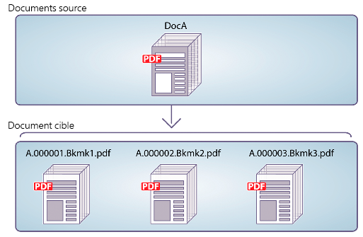

# API de communication as a Cloud Service d’AEM Forms {#frequently-asked-questions}

| Version | Lien de l’article |
| -------- | ---------------------------- |
| AEM 6.5 | [Cliquez ici](https://experienceleague.adobe.com/docs/experience-manager-65/forms/use-document-services/overview-aem-document-services.html) |
| AEM as a Cloud Service | Cet article |

La fonctionnalité Communications vous permet de créer des documents personnalisés, normalisés et approuvés par la marque, tels que des correspondances commerciales, des récapitulatifs, des lettres de traitement des demandes, des avis de prestations, des factures mensuelles ou des kits de bienvenue.

Cette fonctionnalité fournit des API pour générer et manipuler les documents. Vous pouvez générer ou manipuler un document à la demande ou créer une tâche par lots pour générer plusieurs documents à des intervalles définis. Les API Communications fournissent les éléments suivants :

* Des fonctionnalités simplifiées de génération de documentation par lots et à la demande

* La possibilité de combiner, réorganiser et valider des documents PDF à la demande

* Des API HTTP pour une intégration plus facile aux systèmes existants Des API distinctes pour les opérations à la demande (faible latence) et par lots (opérations à débit élevé) sont incluses.

* un accès sécurisé aux données. Les API de communication se connectent aux données et n’y accèdent que depuis des référentiels de données désignés par les client(e)s, ce qui rend les communications hautement sécurisées.

La [documentation de référence sur les API](https://developer.adobe.com/experience-cloud/experience-manager-apis/api/experimental/document/) fournit des informations détaillées sur tous les paramètres, les méthodes d’authentification et les différents services fournis par les API. La documentation de référence de l’API est également disponible au format .yaml. Vous pouvez télécharger le fichier .yaml et le charger dans Postman pour vérifier les fonctionnalités des API.

<!-- 

A credit card statement can be created using Communications APIs. This sample statement uses same template but separate data for each customer depending on their usage of credit card.

-->

## Génération de documents

Les API de génération de documents de communication permettent de combiner un modèle (XFA ou PDF) avec des données client (XML) pour générer des documents aux formats PDF et d’impression tels que PS, PCL, DPL, IPL et ZPL. Ces API utilisent des modèles PDF et XFA avec des [données XML](communications-known-issues-limitations.md#form-data) pour générer un seul document à la demande ou plusieurs documents à l’aide d’un traitement par lots.

En règle générale, vous créez un modèle à l’aide de [Designer](use-forms-designer.md) et utilisez les API Communications pour fusionner les données avec le modèle. Votre application peut envoyer le document de sortie à une imprimante réseau, à une imprimante locale ou à un système de stockage pour archivage. Les workflows standard et personnalisés se présentent comme suit :

En fonction du cas d’utilisation, vous pouvez également rendre ces documents disponibles au téléchargement via votre site Web ou un serveur de stockage.

Voici quelques exemples d’API de génération de documents :

### Création de documents PDF {#create-pdf-documents}

Vous pouvez utiliser les API de génération de documents pour créer un document PDF basé sur un design de formulaire et des données de formulaire XML. La sortie est un document PDF non interactif. En d’autres termes, les utilisateurs ne peuvent pas saisir ni modifier les données de formulaire. Un processus de base consiste à fusionner les données de formulaire XML avec un design de formulaire pour créer un document PDF. L’illustration suivante présente la fusion d’un design de formulaire et de données de formulaire XML pour produire un document PDF.

Schéma : workflow standard de création d’un document PDF

### Créer un document PostScript (PS), Printer Command Language (PCL), Zebra Printing Language (ZPL) {#create-PS-PCL-ZPL-documents}

Vous pouvez utiliser des API de génération de documents pour créer des documents PostScript (PS), PCL (Printer Command Language) et Zebra Printing Language (ZPL) reposant sur une conception de formulaire XDP ou un document de PDF. Ces API permettent de fusionner un design de formulaire avec des données de formulaire pour générer un document. Vous pouvez enregistrer le document dans un fichier et développer un processus personnalisé pour l’envoyer à une imprimante.

<!-- ### Processing batch data to create multiple documents

Communications APIs can create separate documents for each record within an XML batch data source. The APIs can also create a single document that contains all records (this functionality is the default). Assume that an XML data source contains ten records and you instruct the APIs to create a separate document for each record (for example, PDF documents). As a result, the APIs generate ten PDF documents.

The following illustration also shows Communications APIs processing an XML data file that contains multiple records. However, assume that you instruct the APIs to create a single PDF document that contains all data records. In this situation, the APIs generate one document that contains all the records.

The following illustration shows Communications APIs processing an XML data file that con tains multiple records. Assume that you instruct the Communications APIs to create a separate PDF document for each data record. In this situation, the APIs generates a separate PDF document for each data record.

 -->

### Traitement des données par lots pour créer plusieurs documents {#processing-batch-data-to-create-multiple-documents}

Vous pouvez utiliser des API de génération de documents pour créer des documents distincts pour chaque enregistrement au sein d’une source de données par lots XML. Vous pouvez générer des documents en mode massif et asynchrone. Vous pouvez configurer différents paramètres pour la conversion, puis lancer le traitement par lots.

<!-- You can can also create a single document that contains all records (this functionality is the default).  Assume that an XML data source contains ten records and you have a requirement to create a separate document for each record (for example, PDF documents). You can use the Communication APIs to generate ten PDF documents. -->

<!-- The following illustration shows the Communication APIs processing an XML data file that contains multiple records. However, assume that you instruct the Communication APIs to create a single PDF document that contains all data records. In this situation, the Communication APIs generate one document that contains all the records.

The following illustration shows the Communication APIs processing an XML data file that contains multiple records. Assume that you instruct the Communication APIs to create a separate PDF document for each data record. In this situation, the Communication APIs generates a separate PDF document for each data record.

For detailed information on using Batch APIs, see Communication APIs: Processing batch data to create multiple documents. 

### Flatten interactive PDF documents {#flatten-interactive-pdf-documents}

You can use document generation APIs to transform an interactive PDF document (for example, a form) to a non-interactive PDF document. An interactive PDF document lets users enter or modify data located in the PDF document fields. The process of transforming an interactive PDF document to a non-interactive PDF document is called flattening. When a PDF document is flattened, a user cannot modify the data located in the document's fields. One reason to flatten a PDF document is to ensure that data cannot be modified.

You can flatten the following types of PDF documents:

* Interactive PDF documents created in Designer (that contain XFA streams).

* Acrobat PDF forms

If you attempt to flatten a non-interactive PDF document, an exception occurs.

### Retain Form State {#retain-form-state}

An interactive PDF document contains various elements that constitute a form. These elements may include fields (to accept or display data), buttons (to trigger events), and scripts (commands to perform a specific action). Clicking a button may trigger an event that changes the state of a field. For example, choosing a gender option may change the color of a field or the appearance of the form. This is an example of a manual event causing the form state to change.

When such an interactive PDF document is flattened using the Communications APIs, the state of the form is not retained. To ensure that the state of the form is retained even after the form is flattened, set the Boolean value _retainFormState_ to True to save and retain the state of the form. -->

## Manipulation de documents

Les API de manipulation de documents de communication (Document Transformation) permettent de combiner et de réorganiser des documents de PDF. En règle générale, vous créez un DDX et l’envoyez aux API de manipulation de document pour assembler ou réorganiser un document. Le [document DDX](https://helpx.adobe.com/content/dam/help/en/experience-manager/forms-cloud-service/ddxRef.pdf) décrit comment utiliser les documents source pour générer un ensemble de documents désirés. La documentation de référence DDX fournit des informations détaillées sur toutes les opérations prises en charge. Voici quelques exemples de manipulation de documents :

### Assemblage de documents PDF

Vous pouvez utiliser les API de manipulation de documents pour assembler deux documents PDF ou XDP ou plus dans un seul document PDF ou portfolio PDF. Vous trouverez ci-dessous quelques-unes des méthodes d’assemblage de documents PDF :

* Assemblage d’un document PDF unique
* Création d’un portfolio PDF
* Assemblage de documents chiffrés
* Assemblage de documents à l’aide de la numérotation Bates
* Aplatissement et assemblage de documents

Schéma : assemblage d’un document PDF unique à partir de plusieurs documents PDF

### Désassemblage de documents PDF

Vous pouvez utiliser les API de manipulation de documents pour désassembler un document PDF. Ces API peuvent extraire des pages du document source ou diviser un document source en fonction de signets. Cette tâche est particulièrement utile lorsque le document PDF d’origine a été créé à partir de plusieurs documents séparés, par exemple un ensemble d’instructions.

* Extraire des pages d’un document source
* Division d’un document source en fonction de signets

Schéma : division d’un document source en plusieurs documents en fonction de signets

>[!NOTE]
>
> AEM Forms offre une variété de polices intégrées qui s’intègrent facilement aux fichiers PDF. Pour afficher la liste des polices prises en charge, [cliquez ici](/help/forms/supported-out-of-the-box-fonts.md).

<!-- 

## Document utilities

Document utilities synchronous APIs helps you convert documents between PDF and XDP file formats, and query information about a PDF document. For example, you can determine whether a PDF document contains comments or attachments.

### Retrieve PDF document properties

You can [query a PDF document](https://developer.adobe.com/experience-manager-forms-cloud-service-developer-reference/references/pdf-utility-sync/#tag/Document-Extraction/) for the following information:

* Is a PDF Document: Check whether the source document is a PDF document.
* Is a fillable form: Check whether the source PDF document is a fillable form.
* Form Type: Retrieve the form type of the document.
* Check for Attachments: Check whether the source PDF document has any attachments.
* Check for Comments: Check whether the source PDF document has any review comments.
* Is a PDF Package: Check whether the document is a PDF package.
* Get the PDF Version: Retrieve the [version of the PDF document](https://en.wikipedia.org/wiki/History_of_PDF).
* Recommended Acrobat Version: Retrieve the required version of Acrobat (Reader) to open the PDF document.
* Is an XFA Document: Check whether the source PDF document is an XFA-based PDF document.
* Is Shell PDF: Check whether the source PDF document is shell PDF. A shell PDF contains only an XFA stream, font and image resources, and one page that is either blank or contains a warning that the document must be opened using Acrobat or Adobe Reader. The shell PDF is used with PDF transformation to optimize delivery of PDFForm transformations only.
* Get the XFA Version: Retrieve the [XFA Version for an XFA-based PDF document](https://en.wikipedia.org/wiki/XFA#XFA_versions).

### Convert PDF Documents into XDP Documents

The [PDF to XDP API](https://developer.adobe.com/experience-manager-forms-cloud-service-developer-reference/references/pdf-utility-sync/#tag/Document-Conversion) converts a PDF document to an XDP file. For a PDF document to be successfully converted to an XDP file, the PDF document must contain an XFA stream in the dictionary. -->

## Extraction de document

 La fonctionnalité Extraction de documents est inscrite dans le Programme des premiers adopteurs. Vous pouvez écrire à aem-forms-ea@adobe.com à partir de votre identifiant e-mail officiel pour rejoindre le programme d’adoption précoce et demander l’accès à la fonctionnalité. 

Le service Extraction de documents vous permet d’obtenir les propriétés d’un document de PDF, telles que ses droits d’utilisation, ses propriétés de PDF et ses métadonnées. Les fonctionnalités d’extraction de document sont les suivantes :

* Obtient les propriétés d’un document de PDF, telles que si le PDF comporte des pièces jointes, des commentaires, sa version Acrobat, etc.
* Extrayez les droits d’utilisation activés dans un document de PDF. Les utilisateurs récupèrent les droits d’utilisation activés ou désactivés dans un document de PDF pour l’extensibilité Adobe Acrobat Reader.
* Pour obtenir les informations de métadonnées présentes dans un document de PDF, les métadonnées sont des informations sur le document (qui se distinguent du contenu du document, telles que le texte et les graphiques). La plateforme de métadonnées extensibles (XMP) Adobe est une norme de gestion des métadonnées de document. Le service XMP Utilities peut récupérer XMP métadonnées de documents PDF et exporter des métadonnées dans des documents PDF.

La [ documentation de référence sur les API](https://developer.adobe.com/experience-cloud/experience-manager-apis/api/experimental/document/) fournit des informations détaillées sur tous les paramètres, les méthodes d’authentification et les services fournis par les API. La documentation de référence de l’API est également disponible au format .yaml. Vous pouvez télécharger le fichier .yaml et le charger dans Postman pour vérifier les fonctionnalités des API.

<!--

 The XMP Utilities Service capability is under Early Adopter Program. You can write to aem-forms-ea@adobe.com from your official email id to join the early adopter program and request access to the capability. 

### XMP Utilities {#XMP-utilities}

 The XMP Utilities Service capability is under Early Adopter Program. You can write to aem-forms-ea@adobe.com from your official email id to join the early adopter program and request access to the capability. 

PDF documents contain metadata, which is information about the document (as distinguished from the contents of the document, such as text and graphics). The Adobe Extensible Metadata Platform (XMP) is a standard for handling document metadata. The XMP Utilities service can retrieve and save XMP metadata from PDF documents and import XMP metadata into PDF documents.

-->

## Conversion de document

### Conversion et validation de documents conformes à la norme PDF/A

Les API de conversion de document de communication aident à convertir un document de PDF en PDF/A. Vous pouvez utiliser les API pour convertir un document de PDF en document compatible avec le PDF/A, ainsi que pour déterminer si un document de PDF est compatible avec le PDF/A. PDF/A est un format d’archivage destiné à la conservation à long terme du contenu du document. Les polices sont incorporées dans le document et le fichier est décompressé. Par conséquent, un document PDF/A est généralement plus volumineux qu’un document PDF standard. De plus, un document PDF/A ne contient aucune donnée audio et vidéo. Les normes de conformité PDF/A prises en charge sont les suivantes : PDF/A-1a, 1b, 2a, 2b, 3a et 3b.

### Convertir le PDF en XDP {#convert-pdf-to-xdp}

 La fonctionnalité Convertir le PDF en XDP fait partie du Programme des premiers adopteurs. Vous pouvez écrire à aem-forms-ea@adobe.com à partir de votre identifiant e-mail officiel pour rejoindre le programme d’adoption précoce et demander l’accès à la fonctionnalité. 

Convertit un document de PDF en fichier XDP. Pour qu’un document de PDF soit converti en fichier XDP, le document de PDF doit contenir un flux XFA dans le dictionnaire.

## Document Assurance {#doc-assurance}

Le service DocAssurance comprend les API Signature et Encryption :

### API de signature

Les API Signature permettent à votre entreprise de garantir la sécurité et la confidentialité des documents Adobe PDF qu’elle diffuse et reçoit. <!--This service uses digital signatures and certification to ensure that only intended recipients can alter documents. --> Les fonctions de sécurité sont appliquées au document lui-même, le document reste sécurisé et contrôlé pendant tout son cycle de vie. Le document reste sécurisé au-delà du pare-feu, lorsqu’il est téléchargé hors ligne et lorsqu’il est renvoyé à votre entreprise. Vous pouvez accomplir les tâches suivantes à l’aide des API de signature :

* Ajoutez un champ de signature visible à un document de PDF.
* Ajoutez un champ de signature invisible à un document de PDF.
* Signez le champ de signature spécifié dans un document de PDF.
* Certifier un document de PDF
* Supprimer la signature du champ de signature spécifié dans un document de PDF
* Supprimer le champ de signature spécifié d’un document de PDF

 Supprimez la signature du champ de signature spécifié et supprimez le champ de signature spécifié d’un document de PDF disponible sous le programme des premiers adopteurs. Vous pouvez écrire à aem-forms-ea@adobe.com à partir de votre identifiant e-mail officiel pour rejoindre le programme d’adoption précoce et demander l’accès à la fonctionnalité. 

<!--

### Remove Signature APIs

The Remove Signature API helps to remove an existing digital signatures from a PDF document. This API is useful when you need to update or revise a signed document and reapply signatures. It maintains document integrity while effectively clearing signatures from specific pages or the entire file. Use cases include re-signing documents with updated data or clearing previous approvals for revised versions.

### Remove Signature Field APIs

The Remove Signature Field API is tailored for removing signature fields from a PDF document. This is ideal when you need to delete empty or unused signature fields to streamline document presentation. It enables users to eliminate signature fields without impacting other form fields or the document structure, making it easier to create cleaner, final versions of a document that no longer require signatures.

-->

### API de chiffrement

Les API Encryption vous permettent de chiffrer et de déchiffrer des documents. Lorsqu’un document est chiffré, son contenu devient illisible. Une personne autorisée peut déchiffrer le document pour pouvoir accéder à son contenu. Si un document PDF est chiffré avec un mot de passe, l’utilisateur doit spécifier le mot de passe d’ouverture pour pouvoir visualiser le document dans Adobe Reader ou Adobe Acrobat. <!-- Likewise, if a PDF document is encrypted with a certificate, the user must decrypt the PDF document with the public key that corresponds to the certificate (private key) that was used to encrypt the PDF document.-->

Vous pouvez accomplir ces tâches à l’aide des API Encryption :

* Chiffrez un document de PDF avec un mot de passe.
* Supprimez le chiffrement avec mot de passe d’un document de PDF.
* Récupérez le type de sécurité appliqué à un document de PDF.
* Renvoyer le type de sécurité appliqué à un document PDF.

Les API Signature et les API Encryption sont [API synchrones](#types-of-communications-apis-types).

### Utilitaires de document {#doc-utility}

Les utilitaires de document avec les API synchrones vous aident à convertir des documents entre les formats de fichiers PDF et XDP. Appliquez des droits d’utilisation à un document et extrayez les droits d’utilisation activés à partir d’un document. Requête d’informations sur un document PDF. <!-- determines whether a PDF document contains comments or attachments and more, and use document transformation services for XMP utilities--> Vous trouverez ci-dessous les détails des API de droits d’utilisation :

#### API de droits d’utilisation (extension de Reader)

 La fonctionnalité Droits d’utilisation (extension de Reader) figure dans le Programme des Adopteurs Anticipés. Vous pouvez écrire à aem-forms-ea@adobe.com à partir de votre identifiant e-mail officiel pour rejoindre le programme d’adoption précoce et demander l’accès à la fonctionnalité. 

La fonctionnalité Droits d’utilisation permet à votre entreprise de partager facilement des documents de PDF interactifs en étendant la fonctionnalité d’Adobe Reader avec des droits d’utilisation supplémentaires. Le service fonctionne avec Adobe Reader 7.0 ou version ultérieure et ajoute des droits d’utilisation à un document PDF. Cette action active des fonctionnalités qui ne sont généralement pas disponibles lors de l’ouverture d’un document de PDF à l’aide d’Adobe Reader, comme l’ajout de commentaires à un document, le remplissage de formulaires et l’enregistrement du document.

Lorsque les droits d’utilisation appropriés sont ajoutés aux documents PDF, les destinataires peuvent effectuer les activités suivantes depuis Adobe Reader :

* Remplissez des documents et des formulaires PDF en ligne ou hors ligne, ce qui permet aux destinataires d’enregistrer des copies localement pour leurs enregistrements tout en préservant les informations ajoutées.
* Enregistrez les documents du PDF sur un disque dur local afin de conserver le document d’origine ainsi que tous les commentaires, données ou pièces jointes supplémentaires.
* Joindre des fichiers et des clips multimédia à des documents PDF.
* Signez, certifiez et authentifiez des documents PDF en appliquant des signatures numériques à l’aide des technologies PKI (Public Key Infrastructure, infrastructure à clé publique) standard.
* Envoyez les documents PDF complétés ou annotés par voie électronique.
* Utilisez des documents et des formulaires PDF comme interface de développement intuitive pour les bases de données internes et les services Web.
* Partage de documents PDF pour que les réviseurs puissent ajouter des commentaires à l’aide d’outils intuitifs d’insertion de commentaires et d’annotations, tels que notes autocollantes, tampons, texte surligné et texte barré. Les mêmes fonctions sont disponibles dans Acrobat.
* Prise en charge du décodage Forms à code à barres.

Ces fonctionnalités de droits d’utilisation spéciaux sont automatiquement activées lorsqu’un document de PDF dont les droits sont activés est ouvert dans Adobe Reader. Lorsque l’utilisateur a fini de travailler avec un document dont les droits sont activés, ces fonctions sont à nouveau désactivées dans Adobe Reader. Elles restent désactivées jusqu’à ce que l’utilisateur ou l’utilisatrice reçoive un autre document PDF dont les droits sont activés.

#### Activation ou désactivation des droits d’utilisation

Les différentes fonctionnalités de droits d’utilisation pour étendre les services de Reader de PDF sont les suivantes :

* **Décodage des codes à barres** : pour décoder les codes à barres dans le document du PDF.

* **Comments** : pour ajouter des commentaires hors ligne sur le document du PDF.

* **Comments Online** : pour commenter en ligne le document du PDF.

* **Signature numérique** : pour ajouter des signatures numériques à un document de PDF.

* **Champs de formulaire dynamique** : pour ajouter des champs de formulaire à un document de PDF.

* **Pages de formulaire dynamiques** : pour ajouter des pages de formulaire à un document de PDF.

* **Fichiers incorporés** : pour incorporer des fichiers dans un document de PDF.

* **Importation de données de formulaire** : pour importer des données de formulaire dans un document de PDF.

* **Exportation de données de formulaire** : pour importer des données de formulaire dans un document de PDF.

* **Form Fill In** : pour remplir les champs de formulaire dans un document de PDF.

* **Forms en ligne** : pour accéder à un service Web ou à une base de données à partir d’un document de PDF.

* **Submit Standalone** : pour envoyer des données de formulaire hors ligne à partir d’un document de PDF.

#### Autres fonctionnalités

* **Message** : message affiché dans Adobe Acrobat Reader lors de l’ouverture d’un document de PDF avec un ou plusieurs droits d’utilisation appliqués.
* **Déverrouiller le mot de passe** : mot de passe requis pour ouvrir un document de PDF chiffré. En règle générale, il s’agit du mot de passe d’ouverture du document, mais si le document du PDF est en outre protégé par un mot de passe d’accès, vous pouvez l’utiliser pour l’ouvrir.

## Types d’API de communication {#types}

Communications fournit des API HTTP pour la génération de documents à la demande et par lots :

* Les **[API synchrones](https://developer.adobe.com/experience-manager-forms-cloud-service-developer-reference/)** sont adaptées aux scénarios de génération de documents à la demande, à faible latence et à enregistrement unique. Ces API sont plus adaptées aux cas d’utilisation basés sur une action de l’utilisateur. Par exemple, la génération d’un document une fois qu’un utilisateur a rempli un formulaire.

* Les **[API par lot (API asynchrones)](https://developer.adobe.com/experience-manager-forms-cloud-service-developer-reference/)** sont adaptées aux scénarios de génération de documents multiples, à débit élevé et planifiés. Ces API génèrent des documents par lots. Par exemple, des factures de téléphone, des relevés de carte de crédit et des relevés d’avantages sont générés tous les mois.

## Intégration

La fonctionnalité Communications est disponible sous la forme d’un module autonome et d’un module complémentaire pour les utilisateurs de Forms as a Cloud Service. Vous pouvez contacter l’équipe des ventes d’Adobe ou votre représentant d’Adobe pour demander l’accès. Adobe autorise l’accès de votre entreprise et fournit les privilèges requis à la personne désignée comme administrateur au sein de votre entreprise. L’administrateur peut accorder l’accès à vos développeurs (utilisateurs) as a Cloud Service Forms de votre entreprise pour utiliser les API.

Après l’intégration, pour activer la fonctionnalité de communications pour votre environnement Forms as a Cloud Service :

1. Connectez-vous à Cloud Manager et ouvrez votre instance AEM Forms as a Cloud Service.

1. Ouvrez l’option Modifier le programme, accédez à l’onglet Solutions et modules complémentaires, puis sélectionnez l’option **[!UICONTROL Formulaires - Communications]**.

   

   Si vous avez déjà activé l’option **[!UICONTROL Forms - Inscription numérique]**, sélectionnez l’option **[!UICONTROL Forms - Module complémentaire Communications]**.

   

1. Cliquez sur **[!UICONTROL Mettre à jour]**.

1. Exécutez le pipeline de build. Une fois que le pipeline de build a réussi, les API Communications sont activées pour votre environnement.

>[!NOTE]
>
> Pour activer et configurer les API de manipulation de documents, ajoutez la règle suivante à la [configuration Dispatcher](setup-local-development-environment.md#forms-specific-rules-to-dispatcher) :
>
> `# Allow Forms Doc Generation requests`
> `/0062 { /type "allow" /method "POST" /url "/adobe/forms/assembler/*" }`

<!--

Communication help you combine a template and XML data to generate print documents in various formats. The service lets you generate documents in synchronous and batch modes. The APIs enables you to create applications that let you:

  * Generate documents by populating template files (PDF and XDP) with XML data.
  * Generate output forms in various formats, including non-interactive PDF print streams.

Consider a scenario where you have one or more templates and multiple records of XML data for each template. You can use Communications APIs to generate a print document for each record.  You can also combine the records into a single document.  The result is a non-interactive PDF document. A non-interactive PDF document does not let users enter data into its fields.

 There are two main Communications APIs. The _generatePDFOutput_ generates PDFs, while the _generatePrintedOutput_ generates PostScript, ZPL, and PCL formats. These APIs are available as REST endpoints on your environment, both on author and publish instances. Since the publish instances are configured to scale faster than the author instances, it is recommended use these APIs via publish instances.

The first parameter of both the operations accept the path and name of the template file (for example, ExpenseClaim.xdp). You can specify a fully qualified path, reference path of your AEM Repository, or path of a binary file. The second parameter accepts an XML document that is merged with the template while generating the output document.  

The [API reference documentation](https://documentcloud.adobe.com/link/track?uri=urn:aaid:scds:US:b1223732-ae0f-4921-bdc0-c31e48b56044) provides detailed information about all the parameters, authentication methods, and various services provided by APIs. The API reference documentation is also available in the .yaml format. You can download the .yaml for [Batch APIs](assets/batch-api.yaml) or [non-Batch API.yaml](assets/non-batch-api.yaml) file and upload it to postman to check functionality of APIs.

>[!VIDEO](https://video.tv.adobe.com/v/335771)

Uploading Communication APIs .yaml file to postman to check functionality of APIs.

## Using the Communications APIs {#workflows}

Typically, you create a template using [Designer](use-forms-designer.md) and use communications APIs ( generatePDFOutput and generatePrintedOutput) to:

* Convert these templates to various formats, including PDF, PostScript, ZPL, and PCL.
* Merge XML form data with a form design to generate a document.
* Generate a document without merging XML form data into the document. However, the primary workflow is merging data into the document.

Then, the output document is stored to a file. You can design custom workflows to send the file to a network printer, a local printer, or to a storage system for archival. A typical out of the box and custom workflows look like the following:

### Create PDF documents {#create-pdf-documents}

You can use the _generatePDFOutput_ API to create PDF document that is based on a form design and XML form data. The output is a non-interactive PDF document. That is, users cannot enter or modify form data. A basic workflow is to merge XML form data with a form design to create a PDF document. The following illustration shows the merging of a form design and XML form data to produce a PDF document.

### Create PostScript (PS), Printer Command Language (PCL), Zebra Printing Language (ZPL) document {#create-PS-PCL-ZPL-documents}

You can use Communications APIs to create PostScript (PS), Printer Command Language (PCL), and Zebra Printing Language (ZPL) document that are based on an XDP form design or PDF document. The _generatePrintedOutput_ API merges a form design with form data to generate a document. You can save the document to a file and develop a custom process to send it to a printer.

 ### Processing batch data to create multiple documents

Communications APIs can create separate documents for each record within an XML batch data source. The APIs can also create a single document that contains all records (this functionality is the default). Assume that an XML data source contains ten records and you instruct the APIs to create a separate document for each record (for example, PDF documents). As a result, the APIs generate ten PDF documents.

The following illustration also shows Communications APIs processing an XML data file that contains multiple records. However, assume that you instruct the APIs to create a single PDF document that contains all data records. In this situation, the APIs generate one document that contains all the records.

The following illustration shows Communications APIs processing an XML data file that contains multiple records. Assume that you instruct the Communications APIs to create a separate PDF document for each data record. In this situation, the APIs generates a separate PDF document for each data record.

### Processing batch data to create multiple documents {#processing-batch-data-to-create-multiple-documents}

You create separate documents for each record within an XML batch data source. You can can also create a single document that contains all records (this functionality is the default). Assume that an XML data source contains ten records and you have a requirement to create a separate document for each record (for example, PDF documents). You can use the Communication APIs to generate ten PDF documents.

The following illustration shows the Communication APIs processing an XML data file that contains multiple records. However, assume that you instruct the Communication APIs to create a single PDF document that contains all data records. In this situation, the Communication APIs generate one document that contains all the records.

The following illustration shows the Communication APIs processing an XML data file that contains multiple records. Assume that you instruct the Communication APIs to create a separate PDF document for each data record. In this situation, the Communication APIs generates a separate PDF document for each data record.

For detailed information on using Batch APIs, see Communication APIs: Processing batch data to create multiple documents.

### Flatten interactive PDF documents {#flatten-interactive-pdf-documents}

You can use the Communications APIs to transform an interactive PDF document (for example, a form) to a non-interactive PDF document. An interactive PDF document lets users enter or modify data located in the PDF document fields. The process of transforming an interactive PDF document to a non-interactive PDF document is called flattening. When a PDF document is flattened, a user cannot modify the data located in the document's fields. One reason to flatten a PDF document is to ensure that data cannot be modified.

You can flatten the following types of PDF documents:

* Interactive PDF documents created in Designer (that contain XFA streams).

* Acrobat PDF forms

If you attempt to flatten a non-interactive PDF document, an exception occurs.

### Retain Form State {#retain-form-state}

An interactive PDF document contains various elements that constitute a form. These elements may include fields (to accept or display data), buttons (to trigger events), and scripts (commands to perform a specific action). Clicking a button may trigger an event that changes the state of a field. For example, choosing a gender option may change the color of a field or the appearance of the form. This is an example of a manual event causing the form state to change.

When such an interactive PDF document is flattened using the Communications APIs, the state of the form is not retained. To ensure that the state of the form is retained even after the form is flattened, set the Boolean value _retainFormState_ to True to save and retain the state of the form.  -->

## Voir également {#see-also}

* [Traitement des communications - API synchrones](/help/forms/aem-forms-cloud-service-communications.md)
* [Traitement des communications - API par lots](/help/forms/aem-forms-cloud-service-communications-batch-processing.md)
* [Architecture as a Cloud Service d’AEM Forms pour les API de communication et de Forms adaptatifs](/help/forms/aem-forms-cloud-service-architecture.md)
