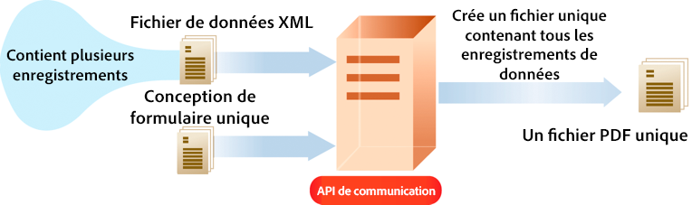

# Utilisation des API de communications as a Cloud Service d’AEM Forms {#frequently-asked-questions}

**La fonctionnalité Communications est en version bêta.**

Les API Communications vous aident à combiner des modèles XDP, des documents PDF basés sur XDP et des formulaires Acrobat (AcroForm) avec des données XML pour générer des documents d’impression dans divers formats et vous aider à créer des applications qui vous permettent :

- de générer des documents en complétant des fichiers de modèle avec des données XML ;

- de générer des formulaires dans divers formats, y compris les flux d’impression PDF non interactifs ;

- de générer des fichiers PDF d’impression à partir de fichiers PDF de formulaire XFA ;

- de générer des documents PDF, PostScript, PCL et ZPL en blocs en fusionnant plusieurs jeux de données avec les modèles sources.

Supposons que vous ayez un ou plusieurs modèles et plusieurs enregistrements de données XML pour chaque modèle. Vous pouvez utiliser les API Communications pour générer un document d’impression pour chaque enregistrement. <!-- You can also combine the records into a single document. --> Le résultat est un document PDF non interactif. Dans ce type de document, les utilisateurs n’ont pas la possibilité de saisir des données dans les champs.

La [documentation de référence sur les API](https://documentcloud.adobe.com/link/track?uri=urn:aaid:scds:US:b1223732-ae0f-4921-bdc0-c31e48b56044) fournit des informations détaillées sur les API, les paramètres, les méthodes d’authentification et les différents services fournis par les API. La documentation de référence de l’API est également disponible au format .yaml. Vous pouvez télécharger le fichier [Batch-API.yaml](assets/batch-api.yaml) ou [non-Batch-API.yaml](assets/non-batch-api.yaml) et le charger dans Postman pour vérifier les fonctionnalités des API.

>[!VIDEO](https://video.tv.adobe.com/v/335771)

Chargement du fichier .yaml des API Communications dans Postman pour vérifier les fonctionnalités des API.

>[!NOTE]
>
>Seuls les membres du groupe des utilisateurs de formulaires peuvent accéder aux API Communications.

## Activation des communications

Pour activer les communications pour votre environnement Forms as a Cloud Service :

1. Connectez-vous à Cloud Manager et ouvrez votre instance AEM Forms as a Cloud Service.

1. Ouvrez l’option Modifier le programme, accédez à l’onglet Solutions et modules complémentaires, puis sélectionnez l’option **[!UICONTROL Formulaires - Communications]**.

   <!-- 

    If you have already enabled the **[!UICONTROL Forms - Digital Enrollment]** option, then select the **[!UICONTROL Forms - Communications Add-On]** option.  

    <!--  -->

1. Cliquez sur **[!UICONTROL Mettre à jour]**.

1. Exécutez le pipeline de build.

Une fois que le pipeline de build a réussi, les API Communications sont activées pour votre environnement.

## Utilisation des API Communications {#workflows}

En règle générale, vous créez un modèle à l’aide de [Designer](use-forms-designer.md) et utilisez les API Communications pour :

- convertir ces modèles en divers formats, y compris PDF, PostScript, ZPL et PCL ;
- fusionner les données de formulaire XML avec un design de formulaire pour générer un document ;
- générer un document sans fusionner les données de formulaire XML dans celui-ci. Toutefois, le processus principal fusionne les données dans le document.

Ensuite, le document de sortie est stocké dans un fichier. Vous pouvez concevoir des workflows personnalisés pour envoyer le fichier vers une imprimante réseau, une imprimante locale ou un système de stockage à des fins d’archivage. Les workflows standard et personnalisés se présentent comme suit :


### Création de documents PDF {#create-pdf-documents}

Vous pouvez utiliser l’API _generatePDFOutput_ pour créer un document PDF basé sur un design de formulaire et des données de formulaire XML. La sortie est un document PDF non interactif. En d’autres termes, les utilisateurs ne peuvent pas saisir ni modifier les données de formulaire. Un processus de base consiste à fusionner les données de formulaire XML avec un design de formulaire pour créer un document PDF. L’illustration suivante présente la fusion d’un design de formulaire et de données de formulaire XML pour produire un document PDF.


### Créer un document PostScript (PS), Printer Command Language (PCL), Zebra Printing Language (ZPL) {#create-PS-PCL-ZPL-documents}

Vous pouvez utiliser des API Communications pour créer des documents PostScript (PS), PCL (Printer Command Language) et Zebra Printing Language (ZPL) basés sur un design de formulaire XDP ou sur un document PDF. L’API _generatePrintedOutput_ fusionne un design de formulaire avec des données de formulaire pour générer un document. Vous pouvez enregistrer le document dans un fichier et développer un processus personnalisé pour l’envoyer à une imprimante.

<!-- ### Processing batch data to create multiple documents

Communications APIs can create separate documents for each record within an XML batch data source. The APIs can also create a single document that contains all records (this functionality is the default). Assume that an XML data source contains ten records and you instruct the APIs to create a separate document for each record (for example, PDF documents). As a result, the APIs generate ten PDF documents.

The following illustration also shows Communications APIs processing an XML data file that contains multiple records. However, assume that you instruct the APIs to create a single PDF document that contains all data records. In this situation, the APIs generate one document that contains all of the records.

The following illustration shows Communications APIs processing an XML data file that contains multiple records. Assume that you instruct the Communications APIs to create a separate PDF document for each data record. In this situation, the APIs generates a separate PDF document for each data record.

 -->

### Traitement des données par lots pour créer plusieurs documents {#processing-batch-data-to-create-multiple-documents}

Vous pouvez créer des documents distincts pour chaque enregistrement dans une source de données par lots XML. Vous pouvez générer des documents en mode massif et asynchrone. Vous pouvez configurer différents paramètres pour la conversion, puis lancer le traitement par lots. <!-- You can can also create a single document that contains all records (this functionality is the default).  Assume that an XML data source contains ten records and you have a requirement to create a separate document for each record (for example, PDF documents). You can use the Communication APIs to generate ten PDF documents. -->

<!-- The following illustration shows the Communication APIs processing an XML data file that contains multiple records. However, assume that you instruct the Communication APIs to create a single PDF document that contains all data records. In this situation, the Communication APIs generate one document that contains all of the records.



The following illustration shows the Communication APIs processing an XML data file that contains multiple records. Assume that you instruct the Communication APIs to create a separate PDF document for each data record. In this situation, the Communication APIs generates a separate PDF document for each data record.


For detailed information on using Batch APIs, see Communication APIs: Processing batch data to create multiple documents. -->

### Aplatissement de documents PDF interactifs {#flatten-interactive-pdf-documents}

Vous pouvez utiliser des API Communications pour transformer un document PDF interactif (par exemple, un formulaire) en document PDF non interactif. Un document PDF interactif permet aux utilisateurs de saisir ou de modifier des données contenues dans les champs de ce document. Le processus de transformation d’un document PDF interactif à un document PDF non interactif est appelé aplatissement. Lorsqu’un document PDF est aplati, un utilisateur ne peut pas modifier les données contenues dans les champs du document. S’assurer que les données ne peuvent être modifiées est l’une des raisons de l’aplatissement d’un document PDF.

Vous pouvez aplatir les types de documents PDF suivants :

- Documents PDF interactifs créés dans Designer (qui contiennent des flux XFA).

- Formulaires PDF Acrobat

Si vous tentez d’aplatir un document PDF non interactif, une exception se produit.

### Conserver l’état du formulaire {#retain-form-state}

Un document PDF interactif contient différents éléments qui constituent un formulaire. Ces éléments peuvent inclure des champs (pour accepter ou afficher des données), des boutons (pour déclencher des événements) et des scripts (des commandes pour exécuter une action spécifique). Un clic sur un bouton peut déclencher un événement qui modifie l’état d’un champ. Par exemple, le choix d’une option de genre peut modifier la couleur d’un champ ou l’aspect du formulaire. Il s’agit d’un exemple d’événement manuel qui entraîne la modification de l’état du formulaire.

Lorsqu’un document PDF interactif est aplati à l’aide des API Communications, l’état du formulaire n’est pas conservé. Pour vous assurer que l’état du formulaire est conservé même après l’aplatissement du formulaire, définissez la valeur booléenne _retainFormState_ sur True pour enregistrer et conserver l’état du formulaire.

### Considérations relatives aux API Communications {#considerations-for-communications-apis}

#### Données de formulaire {#form-data}

Les API Communications acceptent à la fois un design de formulaire généralement créé dans Designer et les données de formulaire XML en tant qu’entrée. Pour remplir un document avec des données, un élément XML doit exister dans les données de formulaire XML pour chaque champ de formulaire à remplir. Le nom de l’élément XML doit correspondre au nom du champ. Un élément XML est ignoré s’il ne correspond pas à un champ de formulaire ou si le nom de l’élément XML ne correspond pas au nom du champ. Il n’est pas nécessaire de correspondre à l’ordre dans lequel les éléments XML sont affichés. Le facteur important est que les éléments XML sont spécifiés avec les valeurs correspondantes.

Examinez l’exemple de formulaire de demande de prêt suivant :


Pour fusionner les données dans ce design de formulaire, créez une source de données XML correspondant au formulaire. Le code XML suivant représente une source de données XML correspondant à l’exemple de formulaire de demande de prêt immobilier.

```XML
<?xml version="1.0" encoding="UTF-8" ?>
- <xfa:datasets xmlns:xfa="http://www.xfa.org/schema/xfa-data/1.0/">
- <xfa:data>
- <data>
    - <Layer>
        <closeDate>1/26/2007</closeDate>
        <lastName>Johnson</lastName>
        <firstName>Jerry</firstName>
        <mailingAddress>JJohnson@NoMailServer.com</mailingAddress>
        <city>New York</city>
        <zipCode>00501</zipCode>
        <state>NY</state>
        <dateBirth>26/08/1973</dateBirth>
        <middleInitials>D</middleInitials>
        <socialSecurityNumber>(555) 555-5555</socialSecurityNumber>
        <phoneNumber>5555550000</phoneNumber>
    </Layer>
    - <Mortgage>
        <mortgageAmount>295000.00</mortgageAmount>
        <monthlyMortgagePayment>1724.54</monthlyMortgagePayment>
        <purchasePrice>300000</purchasePrice>
        <downPayment>5000</downPayment>
        <term>25</term>
        <interestRate>5.00</interestRate>
    </Mortgage>
</data>
</xfa:data>
</xfa:datasets>
```

#### Types de documents pris en charge {#supported-document-types}

Pour un accès complet aux fonctionnalités de rendu des API Communications, il est recommandé d’utiliser un fichier XDP comme entrée. Dans certains cas, un fichier PDF peut être utilisé. Toutefois, l’utilisation d’un fichier PDF en entrée présente les restrictions suivantes :

- Un document PDF qui ne contient pas de flux XFA ne peut pas être rendu au format PostScript, PCL ou ZPL. Les API Communications peuvent générer des documents PDF avec des flux XFA (c’est-à-dire des formulaires créés dans Designer) au format laser et d’étiquettes. Si le document PDF est signé, certifié ou contient des droits d’utilisation (appliqués à l’aide du service AEM Forms Reader Extensions), il ne peut pas être rendu dans ces formats d’impression.

<!-- * Run-time options such as PDF version and tagged PDF are not supported for Acrobat forms. They are valid for PDF forms that contain XFA streams; however, these forms cannot be signed or certified. 

#### Email support {#email-support}

For email functionality, you can create a process in AEM Workflows that uses the Email Step. A workflow represents a business process that you are automating. -->

#### Zones imprimables {#printable-areas}

La marge non imprimable de 0,25 pouce par défaut n’est pas exacte pour les imprimantes d’étiquettes et varie d’une imprimante à l’autre et de la taille de l’étiquette à la taille de l’étiquette. Il est recommandé de conserver la marge de 0,25 pouce ou de la réduire. Il est toutefois recommandé de ne pas augmenter la marge non imprimable. Dans le cas contraire, les informations de la zone imprimable ne s’impriment pas correctement.

Assurez-vous toujours d’utiliser le fichier XDC approprié pour l’imprimante. Par exemple, évitez de choisir un fichier XDC pour une imprimante 300 dpi et d’envoyer le document vers une imprimante 200 dpi.

#### Scripts {#scripts}

Un design de formulaire utilisé avec les API Communications peut contenir des scripts qui s’exécutent sur le serveur. Assurez-vous qu’un design de formulaire ne contient pas de scripts exécutés sur le client. Pour plus d’informations sur la création de scripts de design de formulaire, voir l’aide de Designer.

<!-- #### Working with Fonts
 Document Considerations for Working with Fonts>> -->

#### Mappage de polices {#font-mapping}

Si une police est installée sur un ordinateur client, elle est disponible dans la liste déroulante de Designer. Si la police n’est pas installée, il est nécessaire de la spécifier manuellement. L’option « Remplacer définitivement les polices non disponibles » dans Designer peut être désactivée. Dans le cas contraire, lorsque le fichier XDP est enregistré dans Designer, le nom de la police de substitution est écrit dans le fichier XDP. Cela signifie que la police installée sur l’imprimante n’est pas utilisée.

Pour concevoir un formulaire qui utilise des polices installées sur l’imprimante, choisissez dans Designer un nom de police correspondant aux polices disponibles sur l’imprimante. La liste des polices prises en charge pour PCL ou PostScript se trouve dans les profils d’appareils correspondants (fichiers XDC). Vous pouvez également créer un mappage des polices pour mapper les polices non installées sur l’imprimante aux polices installées sur l’imprimante d’un autre nom de police. Par exemple, dans un scénario PostScript, les références à la police Arial® peuvent être mappées à la police Helvetica® installée sur l’imprimante.

Il existe deux types de polices OpenType®. Un type est une police OpenType® TrueType prise en charge par PCL. L’autre est l’OpenType CFF®. Les sorties PDF et PostScript prennent en charge les polices Type-1, TrueType et OpenType® incorporées. La sortie PCL prend en charge les polices TrueType incorporées.

Les polices Type-1 et OpenType® ne sont pas incorporées dans la sortie PCL. Le contenu formaté avec les polices Type-1 et OpenType® est pixellisé et généré sous la forme d’une image bitmap pouvant être grande et plus lente à générer.

Les polices téléchargées ou incorporées sont automatiquement remplacées lors de la génération d’une sortie PostScript, PCL ou PDF. Cela signifie que seul le sous-ensemble des glyphes de police requis pour effectuer correctement le rendu du document généré est inclus dans la sortie générée.

#### Utilisation des fichiers de profil de l’appareil (fichier XDC) {#working-with-xdc-files}

Un profil de périphérique (fichier XDC) est un fichier de description d’imprimante au format XML. Ce fichier permet aux API Communications de produire des documents sous la forme de formats d’imprimantes laser ou d’imprimantes d’étiquettes. Les API Communications utilisent les fichiers XDC, notamment :

- hppcl5c.xdc

- hppcl5e.xdc

- ps_plain_level3.xdc

- ps_plain.xdc

- zpl300.xdc

- zpl600.xdc

- zpl300.xdc

- ipl300.xdc

- ipl400.xdc

- tpcl600.xdc

- dpl300.xdc

- dpl406.xdc

- dpl600.xdc

Il n’est pas nécessaire de modifier ces fichiers pour créer des documents. Vous pouvez toutefois les modifier pour répondre aux besoins de votre entreprise.

Ces fichiers sont des exemples de fichiers XDC prenant en charge des fonctions d’imprimantes spécifiques, telles que les polices installées sur l’imprimante, les bacs d’alimentation papier et les agrafeuses. Ces exemples ont pour objectif de vous aider à comprendre comment configurer vos propres imprimantes en utilisant des profils de périphérique. Ces exemples constituent également un point de départ pour des imprimantes similaires dans la même gamme de produits.

#### Utilisation du fichier de configuration XCI {#working-with-xci-files}

Les API Communications utilisent un fichier de configuration XCI pour effectuer des tâches, comme contrôler si la sortie est un panneau unique ou si elle est paginée. Bien que ce fichier contienne des paramètres qui peuvent être définis, il n’est pas courant de modifier cette valeur. <!-- The default.xci file is located in the svcdata\XMLFormService folder. -->

Vous pouvez transmettre un fichier XCI modifié en utilisant une API Communications. Pour ce faire, créez une copie du fichier par défaut, modifiez uniquement les valeurs qui doivent être modifiées pour répondre aux besoins de votre entreprise et utilisez le fichier XCI modifié.

Les API Communications commencent par le fichier XCI par défaut (ou le fichier modifié). Ensuite, elles appliquent les valeurs spécifiées à l’aide des API Communications. Ces valeurs remplacent les paramètres XCI.

Le tableau suivant indique les options XCI.

| Option XCI | Description |
| ------------------------------------- | ----------------------------------------------------------------------------------------------------------------------------------------------------------------------------------------------------------------------------------------------------------------------------------------------------------------------------------------------------------------------------------------------------------------------------------------------------------------------------------------------------------- |
| config/present/pdf/creator | Identifie le créateur du document à l’aide de l’entrée Créateur du dictionnaire d’informations sur le document. Pour plus d’informations sur ce dictionnaire, consultez le guide de référence PDF. |
| config/present/pdf/producer | Identifie le producteur du document à l’aide de l’entrée Producteur du dictionnaire d’informations sur le document. Pour plus d’informations sur ce dictionnaire, consultez le guide de référence PDF. |
| config/present/layout | Contrôle si la sortie est un panneau unique ou si elle est paginée. |
| config/present/pdf/compression/level | Indique le degré de compression à utiliser lors de la génération d’un document PDF. |
| config/present/pdf/scriptModel | Contrôle si des informations spécifiques à XFA sont incluses dans le document PDF de sortie. |
| config/present/common/data/adjustData | Contrôle si l’application XFA ajuste les données après la fusion. |
| config/present/pdf/renderPolicy | Contrôle si la génération du contenu de la page est effectuée sur le serveur ou différée au client. |
| config/present/common/locale | Spécifie le paramètre régional par défaut utilisé dans le document de sortie. |
| config/present/destination | Lorsque contenu par un élément présent, indique le format de sortie. Lorsqu’il est contenu par un élément openAction, spécifie l’action à effectuer lors de l’ouverture du document dans un client interactif. |
| config/present/output/type | Spécifie le type de compression à appliquer à un fichier ou le type de sortie à produire. |
| config/present/common/temp/uri | Spécifie l’URI du formulaire. |
| config/present/common/template/base | Fournit un emplacement de base pour les URI dans le design de formulaire. Lorsque cet élément est absent ou vide, l’emplacement du design de formulaire est utilisé comme base. |
| config/present/common/log/to | Contrôle l’emplacement dans lequel les données du journal ou les données de sortie sont écrites. |
| config/present/output/to | Contrôle l’emplacement dans lequel les données du journal ou les données de sortie sont écrites. |
| config/present/script/currentPage | Indique la page initiale à l’ouverture du document. |
| config/present/script/exclude | Informe le serveur AEM Forms et les API Communications des événements à ignorer. |
| config/present/pdf/linearized | Contrôle si le document PDF de sortie est linéarisé. |
| config/present/script/runScripts | Contrôle l’ensemble de scripts qu’AEM Forms exécute. |
| config/present/pdf/tagged | Contrôle l’inclusion de balises dans le document PDF de sortie. Les balises, dans le contexte d’un PDF, sont des informations supplémentaires incluses dans un document afin d’exposer la structure logique du document. Les balises aident à l’accessibilité et au reformatage. Par exemple, un numéro de page peut être balisé en tant qu’artefact afin qu’un lecteur d’écran ne l’indique pas au milieu du texte. Bien que les balises rendent un document plus utile, elles augmentent également sa taille et le temps de traitement pour le créer. |
| config/present/pdf/version | Spécifie la version du document PDF à générer. |

<!-- Using API

 There are two main Communications APIs. The _generatePDFOutput_ generates PDFs, while the _generatePrintedOutput_ generates PostScript, ZPL, and PCL formats. These APIs are available as HTTP endpoints on your environment, both on author and publish instances. Since the publish instances are configured to scale faster than the author instances, it is recommended use these APIs via publish instances.

The first parameter of both the operations accept the path and name of the template file (for example ExpenseClaim.xdp). You can specify a fully qualified path, reference path of your AEM Repository, or path of a binary file. The second parameter accepts an XML document that is merged with the template while generating the output document. -->
