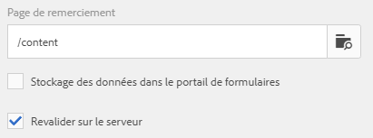

# Actions Envoyer prises en charge par Adaptive Forms

Les formulaires adaptatifs vous permettent de créer des formulaires attrayants, réactifs, dynamiques et adaptatifs. Ils fournissent une interface utilisateur intuitive et un ensemble de composants prêts à l’emploi pour une conception et une gestion efficaces des formulaires. Vous pouvez configurer différentes actions d’envoi pour envoyer des données de formulaire à des services tels que OneDrive, SharePoint, Workfront Fusion, etc.

Une action d’envoi est déclenchée lorsqu’un utilisateur clique sur le bouton **[!UICONTROL Envoyer]** d’un formulaire adaptatif. Forms as a Cloud Service fournit plusieurs actions d’envoi prêtes à l’emploi. Les actions d’envoi intégrées vous permettent :

* Envoyer facilement des données de formulaire par e-mail
* Lancez les flux Microsoft® Power Automate ou les workflows AEM lors de la transmission des données.
* Transmettez directement les données de formulaire à Microsoft® SharePoint Server, Microsoft® Azure Blob Storage ou Microsoft® OneDrive.
* Envoyez facilement les données à une source de données configurée à l’aide du modèle de données de formulaire (FDM).
* Envoyez facilement les données à un point d’entrée REST.

## Actions Envoyer prises en charge par Adaptive Forms

AEM forms propose les actions d’envoi prêtes à l’emploi suivantes :

* [Envoyer un e-mail](/help/forms/configure-submit-action-send-email.md)
* [Appeler un flux Power Automate](/help/forms/forms-microsoft-power-automate-integration.md)
* [Envoyer à SharePoint](/help/forms/configure-submit-action-sharepoint.md)
* [Appeler une Workfront Fusion](/help/forms/submit-adaptive-form-to-workfront-fusion.md)
* [Envoyer à l’aide du modèle de données de formulaire (FDM)](/help/forms/using-form-data-model.md)
* [Envoyer au stockage Blob Azure](/help/forms/configure-submit-action-azure-blob-storage.md)
* [Envoyer vers le point d’entrée REST](/help/forms/configure-submit-action-restpoint.md)
* [Envoyer à OneDrive](/help/forms/configure-submit-action-onedrive.md)
* [Appeler un workflow AEM](/help/forms/configure-submit-action-workflow.md)
* [Envoyer à Marketo Engage](/help/forms/submit-adaptive-form-to-marketo-engage.md)
* [Envoyer à Adobe Experience Platform (AEP)](/help/forms/aem-forms-aep-connector.md)
* [Envoyer à la feuille de calcul](/help/forms/forms-submission-service.md)

Vous pouvez également envoyer un formulaire adaptatif à d’autres configurations de stockage :

* [Connecter un formulaire adaptatif à l’application Salesforce](/help/forms/aem-forms-salesforce-integration.md)
* [Connexion d’un formulaire adaptatif à Microsoft](/help/forms/ms-dynamics-odata-configuration.md)

## Prise En Charge Des Actions Envoyer Sur Plusieurs Types De Création

Le tableau ci-dessous indique les actions d’envoi prises en charge en fonction de la méthode de création de formulaire utilisée dans AEM Forms :

| Action Envoyer | [Composants de base](/help/forms/configuring-submit-actions.md) | [Composants principaux](/help/forms/configure-submit-actions-core-components.md) | [Éditeur universel](/help/forms/configure-submit-action-eds-forms.md#submit-actions-supported-by-adaptive-forms-created-in-universal-editor) | [Forms basé sur les documents](/help/forms/configure-submit-action-eds-forms.md#supported-submit-actions-for-document-based-forms) |
|----------------------------|------------------------|------------------|------------------|------------------------|
| Envoyer un e-mail | ✅ pris en charge | ✅ pris en charge | ✅ pris en charge |                        |
| Flux Power Automate | ✅ pris en charge | ✅ pris en charge | ✅ pris en charge |                        |
| Envoyer à SharePoint | ✅ pris en charge | ✅ pris en charge | ✅ pris en charge |                        |
| Workfront Fusion | ✅ pris en charge | ✅ pris en charge | ✅ pris en charge |                        |
| Envoyer à l’aide de FDM | ✅ pris en charge | ✅ pris en charge | ✅ pris en charge |                        |
| Envoyer à AEP | ✅ pris en charge | ✅ pris en charge | ✅ pris en charge |                        |
| Stockage Azure Blob | ✅ pris en charge | ✅ pris en charge | ✅ pris en charge |                        |
| Envoyer vers le point d’entrée REST | ✅ pris en charge | ✅ pris en charge | ✅ pris en charge |                        |
| Envoyer à Marketo Engage | ✅ pris en charge | ✅ pris en charge | ✅ pris en charge |                        |
| Envoyer à OneDrive | ✅ pris en charge | ✅ pris en charge | ✅ pris en charge |                        |
| Appeler le processus AEM | ✅ pris en charge | ✅ pris en charge | ✅ pris en charge |                        |
| Envoyer à la feuille de calcul |                        |                  | ✅ pris en charge | ✅ pris en charge |

## Revalidation côté serveur dans un formulaire adaptatif

En règle générale, dans n’importe quel système de capture de données en ligne, les développeurs placent des validations JavaScript côté client pour appliquer des règles métier. Mais dans les navigateurs modernes, les utilisateurs finaux peuvent contourner ces validations et effectuer les envois manuellement à l’aide de différentes méthodes, comme la console Web Browser DevTools. Ces méthodes sont également valables pour les formulaires adaptatifs. Un développeur de formulaires peut créer différentes logiques de validation, mais techniquement, les utilisateurs finaux peuvent contourner ces logiques de validation et soumettre des données non valides au serveur. Les données non valides enfreindraient les règles métier appliquées par un créateur ou une créatrice de formulaires.

La fonction de revalidation côté serveur permet également d’exécuter les validations fournies par un auteur de formulaires adaptatifs lors de la conception d’un formulaire adaptatif sur le serveur. Elle empêche toute erreur lors des envois de données et toute violation des règles de fonctionnement représentées en termes de validations de formulaire.

### Quels éléments valider sur le serveur ? 

Les champs de validation en standard d’un formulaire adaptatif réexécutés sur le serveur sont les suivants :

* Requis
* Clause d’image de validation
* Expression de validation

Utilisez **[!UICONTROL Revalider sur le serveur]** sous le conteneur de formulaires adaptatifs dans la zone latérale pour activer ou désactiver la validation côté serveur pour le formulaire actif.

**Activation de la validation côté serveur**

Si l’utilisateur final ou l’utilisatrice finale contourne ces validations et soumet les formulaires, le serveur effectue à nouveau la validation. Si la validation échoue du côté du serveur, la transaction d’envoi est arrêtée. L’utilisateur voit à nouveau s’afficher le formulaire d’origine. Pour l’utilisateur, les données capturées et les données envoyées s’affichent en tant qu’erreurs.

>[!NOTE]
>
>La validation côté serveur permet de valider le modèle de formulaire. Il est recommandé de créer une bibliothèque client séparée pour les validations et de ne pas la mélanger à d’autres éléments. Par exemple, ne placez pas le style HTML et la manipulation DOM HTML dans la même bibliothèque client.

<!--### Supporting Custom functions in Validation Expressions {#supporting-custom-functions-in-validation-expressions-br}

At times, if there are **complex validation rules**, the exact validation script reside in custom functions and author calls these custom functions from field validation expression. To make this custom function library known and available while performing server-side validations, the form author can configure the name of AEM client library under the **[!UICONTROL Basic]** tab of Adaptive Form Container properties as shown below.

Supporting Custom functions in Validation Expressions

Author can configure customJavaScript library per Adaptive Form. In the library, only keep the reusable functions, which have dependency on jquery and underscore.js third-party libraries.

Refer to the following articles to learn how to create custom functions for:

* [Adaptive Forms based on Foundation Components](/help/forms/rule-editor.md#custom-functions-in-rule-editor)
* [Adaptive Forms based on Core Components](/help/forms/create-and-use-custom-functions.md)
* [Adaptive Forms authored using Document-Based Authoring](/help/edge/docs/forms/rules-forms.md#create-a-custom-function)
* [Adaptive Forms created using the Universal Editor](/help/edge/docs/forms/universal-editor/rule-editor-universal-editor.md#create-a-custom-function)

## Error handling on Submit Action {#error-handling-on-submit-action}

As a part of AEM security and hardening guidelines, configure custom error pages such as 400.jsp, 404.jsp, and 500.jsp. These handlers are called, when on submitting a form 400, 404, or 500 errors appear. The handlers are also called when these error codes are triggered on the Publish node. You can also create JSP pages for other HTTP error codes.

When you prefill a form data model (FDM), or schema based Adaptive Form with XML or JSON data complaint to a schema that is data does not contain `<afData>`, `<afBoundData>`, and `</afUnboundData>` tags, then the data of unbounded fields of the Adaptive Form is lost. The schema can be an XML schema, JSON schema, or a Form Data Model (FDM). Unbounded fields are Adaptive Form fields without the `bindref` property.-->

## Voir également

{{af-submit-action}}

