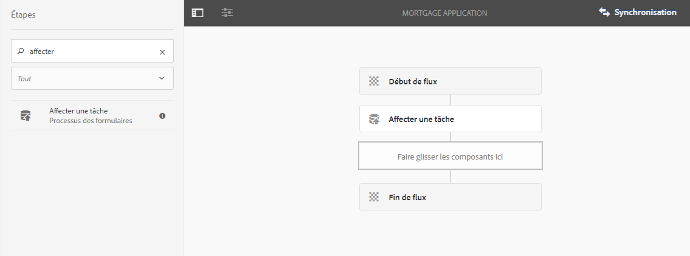
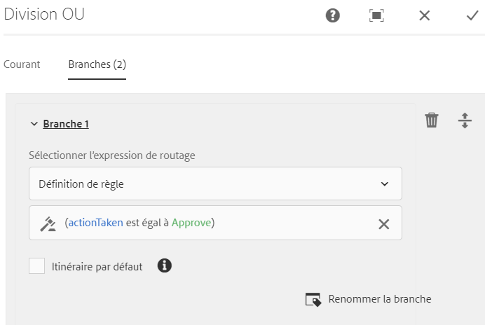
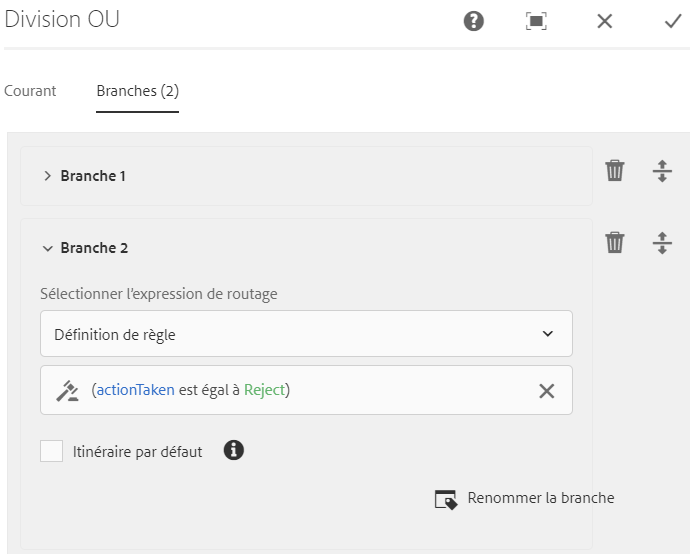
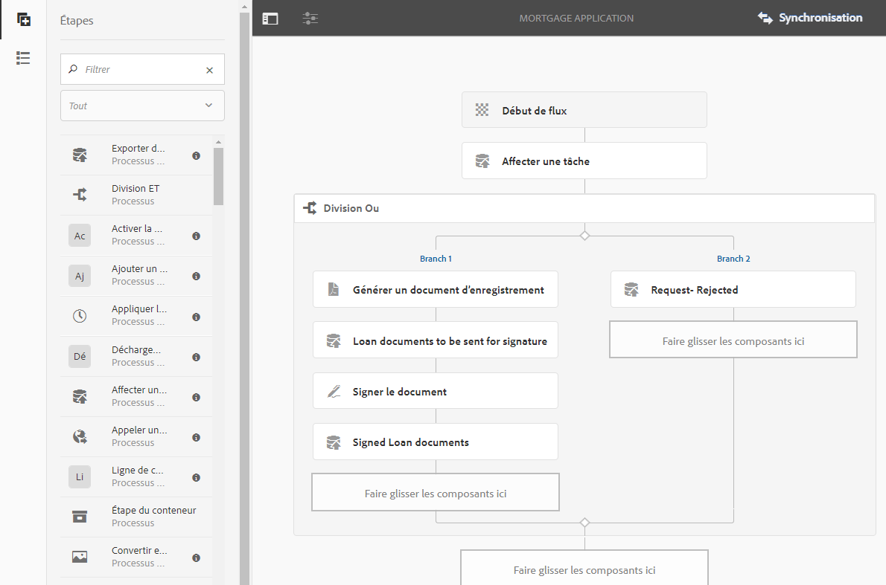

# Processus basé sur l’utilisation de Forms sur OSGi {#forms-centric-workflow-on-osgi}

Les entreprises collectent des données à partir de centaines, de milliers de formulaires, de divers systèmes principaux et de sources de données en ligne ou hors ligne. Ils disposent également d’un ensemble dynamique d’utilisateurs pour prendre des décisions sur les données, ce qui implique des processus itératifs de révision et d’approbation.

Outre les workflows de révision et d’approbation pour les audiences internes et externes, les grandes entreprises et entreprises ont des tâches répétitives. Par exemple, la conversion d’un document de PDF dans un autre format. Lorsque ces tâches sont effectuées manuellement, elles nécessitent beaucoup de temps et de ressources. Les entreprises ont également des exigences légales pour signer numériquement un document et archiver les données de formulaire en vue d’une utilisation ultérieure dans des formats prédéfinis.

## Présentation du workflow basé sur l’utilisation de Forms sur OSGi {#introduction-to-forms-centric-workflow-on-osgi}

Vous pouvez utiliser des processus AEM pour créer rapidement des processus basés sur des formulaires adaptatifs. Ces processus peuvent être utilisés pour la révision et l’approbation, les flux de processus d’entreprise, pour démarrer les services de document, pour intégrer le processus de signature Adobe Sign et d’autres opérations similaires. Par exemple, le traitement d’une demande de carte de crédit, les processus d’approbation de congés des employés et l’enregistrement d’un formulaire en tant que document de PDF. De plus, ces workflows peuvent être utilisés au sein d’une organisation ou par un pare-feu réseau.

Avec le processus basé sur l’utilisation de Forms on OSGi, vous pouvez rapidement créer et déployer des processus pour différentes tâches sur la pile OSGi, sans avoir à installer la fonctionnalité Process Management complète sur la pile JEE. Le développement et la gestion des workflows utilisent les fonctionnalités familières de workflow AEM et de boîte de réception AEM. Les processus forment la base de l’automatisation des processus réels d’entreprise, qui s’étendent sur plusieurs systèmes logiciels, réseaux, services et même organisations.

Une fois configurés, ces processus peuvent être déclenchés manuellement pour terminer une exécution ou exécutés par programmation lorsque les utilisateurs envoient un formulaire <!-- or [correspondence management](cm-overview.md) letter-->. <!-- With this enhanced AEM Workflow capabilities, [!DNL AEM Forms] offers two distinct, yet similar, capabilities. As part of your deployment strategy, you need to decide which one works for you. See a [comparison](capabilities-osgi-jee-workflows.md) of the Forms-centric AEM Workflows on OSGi and Process Management on JEE. Moreover, for the deployment topology see, [Architecture and deployment topologies for [!DNL AEM Forms]]((aem-forms-architecture-deployment.md). -->

Le processus basé sur l’utilisation de Forms sur OSGi étend la [boîte de réception AEM](https://experienceleague.adobe.com/docs/experience-manager-cloud-service/sites/authoring/getting-started/inbox.html?lang=fr#authoring) et fournit des composants supplémentaires (étapes) pour que l’éditeur AEM Workflow ajoute la prise en charge des workflows basés sur l’utilisation d’[!DNL AEM Forms]. <!-- The extended AEM Inbox has functionalities similar to [[!DNL AEM Forms] Workspace](introduction-html-workspace.md). Along with managing human-centric workflows (Approval, Review, and so on), you can use AEM workflows to automate [document services](https://experienceleague.adobe.com/docs/experience-manager-65/developing/extending-aem/extending-workflows/workflows-step-ref.html#extending-aem)-related operations (for example, Generate PDF) and electronically signing (Adobe Sign) documents. -->

Toutes les étapes des workflows [!DNL AEM Forms] prennent en charge l’utilisation de variables. Les variables permettent aux étapes de processus de contenir et de transmettre des métadonnées entre les étapes au moment de l’exécution. Vous pouvez créer différents types de variables pour stocker différents types de données. Vous pouvez également créer des collections de variables pour stocker plusieurs instances de données associées et du même type. En règle générale, vous utilisez une variable ou une collection de variables lorsque vous devez prendre une décision en fonction de la valeur qu’elle contient ou pour stocker des informations dont vous aurez besoin ultérieurement dans un processus. Pour plus d’informations sur l’utilisation de variables dans ces composants (étapes) de processus basés sur Forms, voir [Processus basé sur l’utilisation de Forms sur OSGi - Guide de référence des étapes](aem-forms-workflow-step-reference.md). Pour plus d’informations sur la création et la gestion des variables, voir [Variables dans les processus AEM](variable-in-aem-workflows.md).

Le diagramme suivant illustre le processus complet de création, d’exécution et contrôle d’un processus basé sur l’utilisation de Forms sur OSGi.

## Avant de commencer {#before-you-start}

* Un workflow est une représentation d’un processus d’entreprise réel. Préparez votre processus d’entreprise réel et la liste des participants au processus d’entreprise. Par ailleurs, préparez les éléments associés (formulaires adaptatifs, documents PDF, etc.) avant de créer un processus.
* Un workflow peut comporter plusieurs étapes. Ces étapes sont affichées dans la boîte de réception AEM et permettent de signaler la progression du workflow. Divisez votre processus d’entreprise en étapes logiques.
* Vous pouvez configurer l’étape Affecter une tâche de AEM Workflows pour envoyer des notifications par e-mail aux utilisateurs ou aux personnes désignées. Donc, [activer les notifications par e-mail](#configure-email-service).
* Un workflow peut également utiliser Adobe Sign pour les signatures numériques. Si vous envisagez d’utiliser Adobe Sign dans un workflow, [configure Adobe Sign pour [!DNL AEM Forms]](adobe-sign-integration-adaptive-forms.md) avant de l’utiliser dans un workflow.

## Créer un modèle de workflow {#create-a-workflow-model}

Un modèle de workflow est constitué de la logique et du flux d’un processus d’entreprise. Il est composé d&#39;une série d&#39;étapes. Ces étapes sont des composants AEM. Vous pouvez étendre les étapes de workflow avec des paramètres et des scripts pour proposer davantage de fonctionnalités et de contrôle, selon les besoins. [!DNL AEM Forms] fournit quelques étapes supplémentaires par rapport aux étapes AEM prêtes à l’emploi. Pour obtenir la liste détaillée des étapes AEM et [!DNL AEM Forms], consultez [Référence sur les étapes de processus AEM](https://experienceleague.adobe.com/docs/experience-manager-65/developing/extending-aem/extending-workflows/workflows-step-ref.html?lang=fr#extending-aem) et [Référence sur les étapes du processus basé sur l’utilisation de Forms on OSGi](aem-forms-workflow.md).

AEM fournit une interface utilisateur intuitive pour créer un modèle de workflow à l’aide des étapes de workflow fournies. Pour obtenir des instructions détaillées sur la création d’un modèle de processus, voir [Création de modèles de processus](https://experienceleague.adobe.com/docs/experience-manager-cloud-service/sites/authoring/workflows/overview.html?lang=fr#workflows). L’exemple suivant fournit des instructions étape par étape pour créer un modèle de processus pour un processus d’approbation et de révision :

>[!NOTE]
>
>Vous devez être membre du groupe d’éditeurs de processus pour créer ou modifier un modèle de processus.

### Création d’un modèle pour un processus d’approbation et de révision {#create-a-model-for-an-approval-and-review-workflow}

Les processus d’approbation et de révision concernent les tâches qui nécessitent une intervention humaine pour prendre des décisions. L’exemple suivant crée un modèle de processus pour une demande de prêt immobilier à remplir par un agent bancaire du bureau principal. Une fois la demande remplie, elle est envoyée pour approbation. Par la suite, la demande approuvée est envoyée au demandeur pour les signatures électroniques à l’aide d’Adobe Sign.

L’exemple est disponible en tant que package joint ci-dessous. Importez et installez l’exemple à l’aide du gestionnaire de packages. Vous pouvez également effectuer les étapes suivantes pour créer manuellement le modèle de workflow de l’application :

L’exemple crée un modèle de workflow dans lequel une demande de prêt immobilier doit être remplie par un agent bancaire de première ligne. Une fois remplie, la demande est envoyée pour approbation. Par la suite, la demande approuvée est envoyée au client pour signature électronique à l’aide d’Adobe Sign. Vous pouvez importer et installer l’exemple à l’aide du gestionnaire de packages.

[Obtenir le fichier](assets/example-mortgage-loan-application.zip)

1. Ouvrez la console Modèles de processus. L’URL par défaut est `https://[server]:[port]/libs/cq/workflow/admin/console/content/models.html/etc/workflow/models`
1. Sélectionnez **Créer**, puis **Créer un modèle**. La boîte de dialogue Ajouter un modèle de processus s’ouvre.
1. Saisissez **Titre** et **Nom** (facultatif). par exemple, une demande de prêt immobilier. Appuyez sur **Terminé**.
1. Sélectionnez le modèle de workflow nouvellement créé et appuyez sur **Modifier**. Désormais, vous pouvez ajouter des étapes de processus pour créer une logique d’entreprise. Lorsque vous créez un modèle de processus pour la première fois, il contient :

   * Les étapes : Début du flux et Fin du flux. Ces étapes représentent le début et la fin du workflow. Ces étapes sont requises et ne peuvent pas être modifiées ni supprimées.
   * Un exemple d’étape Participant, dont le nom est Étape 1. Cette étape est configurée pour affecter un élément de travail à l’utilisateur administrateur. Supprimez cette étape.

1. Activez les notifications électroniques. Vous pouvez configurer le processus basé sur l’utilisation de Forms sur OSGi pour qu’il envoie des notifications électroniques aux utilisateurs ou personnes désignées. Effectuez les configurations suivantes pour activer les notifications électroniques :

   1. Accédez au gestionnaire de configuration AEM à l’adresse `https://[server]:[port]/system/console/configMgr`.
   1. Ouvrez la configuration du **[!UICONTROL Service de messagerie Day CQ]**. Spécifiez une valeur pour les champs **[!UICONTROL Nom d’hôte du serveur SMTP]**, **[!UICONTROL Port du serveur SMTP]** et **[!UICONTROL Adresse de l’expéditeur]**. Cliquez sur **[!UICONTROL Enregistrer]**.
   1. Ouvrez la configuration de **[!UICONTROL Day CQ Link Externalizer]**. Dans le champ **[!UICONTROL Domaines]**, spécifiez le nom de hôte /l’adresse IP et le numéro de port réels pour les instances locale, de l’auteur et de publication. Cliquez sur **[!UICONTROL Enregistrer]**.

1. Créez des étapes de workflow. Un workflow peut comporter plusieurs étapes. Ces étapes sont affichées dans la boîte de réception AEM et signalent la progression du workflow.

   Pour définir une étape, appuyez sur l’icône  pour ouvrir les propriétés de modèle de processus, ouvrez l’onglet **Étapes**, ajoutez des étapes au modèle de processus et appuyez sur **Enregistrer et fermer**. Pour l’exemple de demande de prêt immobilier, créez des étapes : demande de prêt, état de la demande de prêt, documents à signer et document de prêt signé.

1. Glissez-déposez l’explorateur d’étapes **Affecter une tâche** dans le modèle de processus. Faites-en la première étape du modèle.

   Le composant Affecter une tâche affecte la tâche, créée par le workflow, à un utilisateur ou à un groupe. Lors de l’affectation de la tâche, vous pouvez utiliser le composant pour spécifier un formulaire adaptatif ou un fichier PDF non interactif pour la tâche. Le formulaire adaptatif est requis pour accepter une saisie des utilisateurs et un fichier PDF non interactif ou un formulaire adaptatif en lecture seule est utilisé pour les processus de révision uniquement.

   Vous pouvez également utiliser l’étape pour contrôler le comportement de la tâche. Par exemple, lors de la création d’un document d’enregistrement automatique, affectez la tâche à un utilisateur ou un groupe spécifique, le chemin des données envoyées, le chemin des données pré-renseignées et les actions par défaut. Pour obtenir des informations détaillées sur les options de l’étape d’affectation de tâche, consultez le document [Référence sur les étapes du processus basé sur l’utilisation de Forms sur OSGi](aem-forms-workflow.md).

   

   Pour l’exemple de demande de prêt immobilier, configurez l’étape Affecter une tâche pour utiliser un formulaire adaptatif en lecture seule et afficher le document PDF une fois la tâche terminée. Par ailleurs, sélectionnez le groupe d’utilisateurs autorisé à approuver la demande de prêt. Dans l’onglet **Actions**, désactivez l’option **Envoyer**. Créez une variable **actionTaken** de type de données de chaîne et spécifiez la variable en tant que **Variable d’itinéraire**. Par exemple, actionTaken. Ajoutez également les itinéraires Approuver et Rejeter . Les itinéraires sont affichés sous forme d’actions distinctes (boutons) dans AEM boîte de réception. Le workflow sélectionne une branche en fonction de l’action (bouton) sur laquelle appuie l’utilisateur.

   Vous pouvez importer l’exemple de package, disponible pour téléchargement au début de la section, pour l’ensemble complet des valeurs de tous les champs de l’étape Affecter une tâche configurée, par exemple la demande de prêt immobilier.

1. Faites glisser et déposez le composant Division OU de l’explorateur d’étapes vers le modèle de workflow. L’étape de division OU divise le processus et une seule branche est active par la suite. Cette étape permet d’ajouter des chemins de traitement conditionnels dans le processus. Vous ajoutez des étapes de processus à chaque branche selon vos besoins.

   Vous pouvez définir l’expression de routage d’une branche à l’aide d’une définition de règle, d’un script ECMA ou d’un script externe.

   Utilisez l’éditeur d’expressions pour créer des expressions de routage pour les branches 1 et 2. Ces expressions de routage permettent de sélectionner une branche en fonction de l’action de l’utilisateur dans la boîte de réception AEM.

   **Expression de routage pour la branche 1**

   Lorsqu’un utilisateur clique sur le bouton **Approuver** dans la boîte de réception AEM, la Branche 1 est activée.

   

   **Expression de routage pour la branche 2**

   Lorsqu’un utilisateur clique sur **Refuser** dans la boîte de réception AEM, la Branche 2 est activée.

   

   Pour plus d’informations sur la création d’expressions de routage à l’aide de variables, consultez [Variables dans les processus [!DNL AEM Forms] ](variable-in-aem-workflows.md).

1. Ajoutez d’autres étapes de processus pour créer une logique d’entreprise.

   Pour l’exemple de prêt immobilier, ajoutez un document d’enregistrement généré, deux étapes Affecter une tâche et une étape de signature de document pour la Branche 1 du modèle, comme affiché dans l’image ci-dessous. Une étape Affecter une tâche consiste à afficher et envoyer des **documents de prêt à signer au demandeur** et un autre composant de tâche consiste à **afficher les documents signés**. Ajoutez également un composant Affecter une tâche à la branche 2. Il est activé lorsqu’un utilisateur clique sur Refuser dans la boîte de réception AEM.

   Pour obtenir l’ensemble complet des valeurs de tous les champs des étapes Affecter une tâche, de l’étape Document d’enregistrement et de l’étape Signer le document configurées pour l’exemple de demande de prêt immobilier, importez l’exemple de package, disponible au téléchargement au début de cette section.

   Le modèle de workflow est prêt. Vous pouvez lancer le workflow de différentes manières. Pour plus d’informations, voir [Lancement d’un processus Forms sur OSGi](#launch).

   

## Création dʼune demande de workflow basée sur l’utilisation de Forms {#create-a-forms-centric-workflow-application}

La demande est le formulaire adaptatif associé au processus. Lorsqu’une demande est envoyée via la boîte de réception, elle lance le processus associé. Pour rendre un processus Forms disponible en tant que demande dans la boîte de réception AEM et l’application [!DNL AEM Forms], procédez comme suit pour créer une demande de processus :

>[!NOTE]
>
>Vous devez être membre du groupe administrateur-fd pour être en mesure de créer et de gérer les demandes de processus.

1. Sur votre instance de création AEM, accédez à  > **[!UICONTROL Formulaires]** > **[!UICONTROL Gérer la demande de processus]** et appuyez sur **[!UICONTROL Créer]**.
1. Dans la fenêtre Créer la demande de processus, saisissez des données dans les champs suivants et appuyez sur **Créer**. Une nouvelle demande est créée et est répertoriée dans l’écran Demandes de processus.

<table>
 <tbody>
  <tr>
   <td>Champ</td>
   <td>Description</td>
  </tr>
  <tr>
   <td>Titre</td>
   <td>Le titre est visible dans AEM boîte de réception et permet aux utilisateurs de choisir une application. Soyez descriptif. Par exemple, Demande d’ouverture de compte d’épargne.  </td>
  </tr>
  <tr>
   <td>Nom </td>
   <td>Indiquez le nom de la demande. Tous les caractères autres que les lettres, chiffres, tirets et traits de soulignement ont été remplacés par des tirets. </td>
  </tr>
  <tr>
   <td>Description</td>
   <td>La description est visible dans AEM boîte de réception. Indiquez des informations détaillées sur l’application dans les champs de description. Par exemple, Objectif de la demande.  </td>
  </tr>
  <tr>
   <td>Formulaire adaptatif</td>
   <td>
Spécifiez le chemin d’un formulaire adaptatif. Lorsqu’un utilisateur commence une demande, le formulaire adaptatif spécifié est affiché.
 
<strong>Remarque :</strong> Les demandes de processus ne prennent pas en charge les formulaires et documents PDF de plus d’une page ou qui nécessitent un défilement sur l’iPad d’Apple. Lorsqu’une demande est ouverte sur un iPad d’Apple et que la longueur du formulaire adaptatif ou du document PDF dépasse une page, les champs de formulaire et le contenu de la deuxième page sont perdus.
 </td>
  </tr>
  <tr>
   <td>Groupes d’accès</td>
   <td>
Sélectionnez un groupe. L’application est visible dans AEM boîte de réception uniquement pour les membres du groupe sélectionné. L’option Accès au groupe permet de sélectionner tous les groupes du groupe [!DNL workflow-users]. 
   </td>
  </tr>
  <tr>
   <td>Service de préremplissage</td>
   <td>Sélectionnez un <a href="prepopulate-adaptive-form-fields.md#aem-forms-custom-prefill-service" target="_blank">service de préremplissage</a> pour le formulaire adaptatif.  </td>
  </tr>
  <tr>
   <td>Modèle de workflow</td>
   <td>Sélectionnez une <a href="aem-forms-workflow.md#create-a-workflow-model">modèle de workflow</a> pour l’application. Un modèle de processus se compose de la logique et du flux de processus d’entreprise. </td>
  </tr>
  <tr>
   <td>Chemin d'accès au fichier de données</td>
   <td>Spécifiez le chemin d’accès du fichier de données dans le référentiel crx-repository. Le chemin est relatif à la charge utile de formulaire adaptatif et contient le nom du fichier de données. Intégrez toujours le nom complet du fichier, y compris son extension, le cas échéant. Par exemple, [charge utile]/data.xml. </td>
  </tr>
  <tr>
   <td>Chemin d’accès de la pièce jointe</td>
   <td>Spécifiez le chemin d’accès du dossier de pièces jointes dans le référentiel crx-repository. Le chemin d’accès de la pièce jointe est relatif à l’emplacement de la charge utile. Par exemple, [charge utile]/data.xml. </td>
  </tr>
  <tr>
   <td>Chemin d’accès du document d’enregistrement</td>
   <td>Spécifiez le chemin du fichier Document d’enregistrement dans le référentiel crx. Le chemin est relatif à l’emplacement de la charge utile du formulaire adaptatif. Intégrez toujours le nom complet du fichier, y compris son extension, le cas échéant. Par exemple, [charge utile]/DOR/creditcard.pdf.</td>
  </tr>
 </tbody>
</table>

## Lancement d’un processus basé sur l’utilisation de Forms sur OSGi {#launch}

Vous pouvez lancer ou déclencher un workflow centré sur Forms en procédant comme suit :

* [Envoyer une demande depuis la boîte de réception AEM](#inbox)
* [Envoi d’une demande depuis l’application [!DNL AEM Forms] ](#afa)

* [Envoi d’un formulaire adaptatif](#af)
* [Utilisant le dossier de contrôle](#watched)

* [Envoyer une communication interactive ou une lettre](#letter)

### Envoyer une demande depuis la boîte de réception AEM {#inbox}

La demande de processus que vous avez créée est disponible en tant qu’application dans la boîte de réception. Les utilisateurs qui sont membres du groupe [!DNL workflow-users] peuvent renseigner et envoyer la demande qui déclenche le processus associé. Pour plus d’informations sur l’utilisation de la boîte de réception AEM pour envoyer des demandes et gérer des tâches, voir [Gestion des applications et des tâches Forms dans la boîte de réception AEM](manage-applications-inbox.md).

<!-- ### Submitting an application from [!DNL AEM Forms] App {#afa}

The [!DNL AEM Forms] app syncs with an [!DNL AEM Forms] server and lets you make changes to the form data, tasks, workflow applications, and saved information (drafts/templates) in your account. For more information, see [[!DNL AEM Forms] app]((aem-forms-app.md) and related articles.-->

### Envoi d’un formulaire adaptatif {#af}

Vous pouvez configurer des actions d’envoi d’un formulaire adaptatif pour démarrer un processus lors de l’envoi du formulaire adaptatif. Les formulaires adaptatifs fournissent l’action d’envoi **Appeler un processus AEM** pour démarrer un processus lors de l’envoi d’un formulaire adaptatif. Pour obtenir des informations détaillées sur l’action d’envoi, consultez [Configuration de l’action d’envoi](configuring-submit-actions.md). Pour envoyer un formulaire adaptatif via l’application [!DNL AEM Forms], activez la synchronisation avec l’application [!DNL AEM Forms] dans les propriétés du formulaire adaptatif.

<!-- You can configure an Adaptive Form to sync, submit, and trigger a workflow from [!DNL AEM Forms] app. For details, see [working with a form]((working-with-form.md). -->

<!-- ### Using a watched folder {#watched}

An administrator (a member of fd-administrators group) can configure a network folder to run a pre-configured workflow when a user places a file (such as a PDF file) in the folder. After the workflow completes, it can save the result file to a specified output folder. Such a folder is known as [Watched Folder](watched-folder-in-aem-forms.md). Perform the following procedure to configure a watched folder to launch a workflow:

1. On your AEM author instance, go to  > **[!UICONTROL Forms]** > **[!UICONTROL Configure Watched Folder]**. A list of already configured watched folders is displayed.
1. Tap **[!UICONTROL New]**. A list of fields is displayed. Specify a value for the following fields to configure a Watched Folder for a workflow:

<table>
 <tbody>
  <tr>
   <td>Field</td>
   <td>Description</td>
  </tr>
  <tr>
   <td>Name</code></td>
   <td>Specify the name of the Watched Folder. This field support only alphanumeric.</td>
  </tr>
  <tr>
   <td>Path</code></td>
   <td>Specify the physical location of the Watched Folder. In a clustered environment, use a shared network folder that is accessible from AEM cluster node.</td>
  </tr>
  <tr>
   <td>Process Files Using</code></td>
   <td>Select the Workflow </code>option. </td>
  </tr>
  <tr>
   <td>Workflow Model</code></td>
   <td>Select a workflow model.  </td>
  </tr>
  <tr>
   <td>Output File Pattern</code></td>
   <td>Specify the directory structure for output files and directories. </a>.</td>
  </tr>
 </tbody>
</table>

1. Tap **Advanced**. Specify a value for the following field and taps **Create**. The Watched Folder is configured to launch a workflow. Now, whenever a file is placed in the input directory of the Watched Folder, the specified workflow is triggered.

   | Field |Description |
   |---|---|
   | Payload Mapper Filter |When you create a watched folder, it creates a folder structure in the crx-repository. The folder structure can serve as a payload to the workflow. You can write a script to map an AEM Workflow to accept inputs from the watched folder structure. An out of the box implementation is available and listed in the Payload Mapper Filter. If you do not have a custom implementation, select the default implementation. |

   The Advanced tab contains more fields. Most of these fields contain a default value. To learn about all the fields, see the [Create or Configure a watched folder]((admin-help/configuring-watched-folder-endpoints.md) article. -->

<!-- ### Submitting an interactive communication or a letter {#letter}

You can associate and execute a Forms-centric workflow on OSGi on submission of an interactive communication or a letter. In correspondence management workflows are used for post processing interactive communications and letters. For example, emailing, printing, faxing, or archiving final letters. For detailed steps, see [Post processing of interactive communications and letters](submit-letter-topostprocess.md).

## Additional Configurations {#additional-configurations}

### Configure email service {#configure-email-service}

You can use the Assign Task and Send Email steps of AEM Workflows to send an email. Perform the following steps to specify email servers and other configurations required to send email:

1. Go to AEM configuration manager at `https://[server]:[port]/system/console/configMgr`.
1. Open the **[!UICONTROL Day CQ Mail Service]** configuration. Specify a value for the **[!UICONTROL SMTP server host name]**, **[!UICONTROL SMTP server port,]** and **[!UICONTROL "From" address]** fields. Click **[!UICONTROL Save]**.
1. Open the **[!UICONTROL Day CQ Link Externalizer]** configuration. In the **[!UICONTROL Domains]** field, specify the actual hostname/IP address and port number for local, author, and publish instances. Click **[!UICONTROL Save]**. -->

### Purge des instances de processus {#purge-workflow-instances}

Réduire le nombre d’instances de processus améliore les performances du moteur de processus. Vous pouvez donc purger régulièrement les instances de processus terminées ou en cours d’exécution du référentiel. Pour plus d’informations, consultez [Purge régulière des instances de processus](https://experienceleague.adobe.com/docs/experience-manager-cloud-service/operations/maintenance.html?lang=fr) purge des instances de processus.
