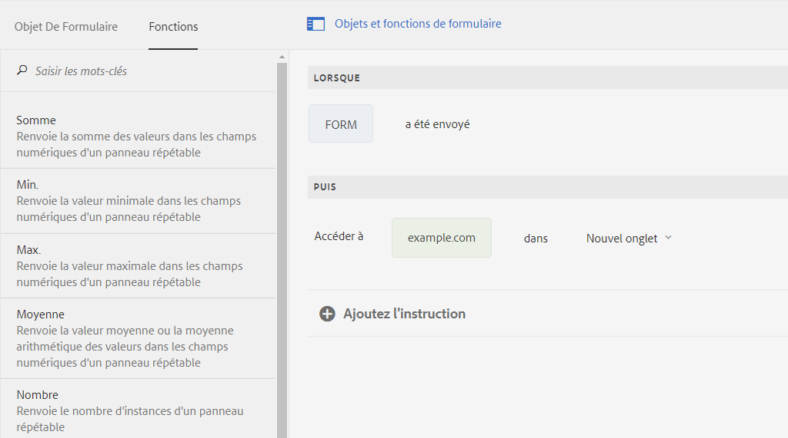

# Configuration de l’envoi asynchrone d’AEM Forms adaptatif {#asynchronous-submission-of-adaptive-forms}


| Version | Lien de l’article |
| -------- | ---------------------------- |
| AEM 6.5 | [Cliquez ici](https://experienceleague.adobe.com/docs/experience-manager-65/forms/adaptive-forms-advanced-authoring/asynchronous-submissions-adaptive-forms.html?lang=fr) |
| AEM as a Cloud Service | Cet article |


Traditionnellement, les formulaires web sont configurés à des fins d’envoi synchrone. Lors d’un envoi synchrone, lorsque les utilisateurs envoient un formulaire, ils sont redirigés vers une page d’accusé de réception, une page de remerciement ou, en cas d’échec de l’envoi, une page d’erreur. Toutefois, les expériences Web modernes telles que les applications d’une seule page gagnent en popularité. Dans une application de ce type, la page Web reste statique tandis que l’interaction entre le client et le serveur se déroule en arrière-plan. Vous pouvez configurer l’envoi asynchrone pour fournir cette expérience avec des formulaires adaptatifs.

Lors d’un envoi asynchrone, lorsqu’un utilisateur envoie un formulaire, le développeur de formulaires se connecte à une expérience distincte, notamment la redirection vers un autre formulaire ou une section distincte du site Web. L’auteur peut également ajouter des services distincts comme l’envoi de données à un autre magasin de données ou l’ajout d’un moteur d’analyse personnalisé. En cas d’envoi asynchrone d’un formulaire adaptatif, celui-ci se comporte comme une application d’une seule page, puisqu’il ne se recharge pas et que son adresse URL ne change pas lorsque ses données sont validées sur le serveur.

Lisez la suite pour plus de détails sur l’envoi asynchrone dans les formulaires adaptatifs.

## Configuration de l’envoi asynchrone {#configure}

Pour configurer l’envoi asynchrone d’un formulaire adaptatif :

1. En mode de création de formulaire adaptatif, sélectionnez l’objet Conteneur de formulaires et sélectionnez  pour ouvrir ses propriétés.
1. Dans la section des propriétés **[!UICONTROL Envoi]**, activez **[!UICONTROL Utiliser l’envoi asynchrone]**.
1. Dans la section **[!UICONTROL Lors de l’envoi]**, sélectionnez l’une des options suivantes pour effectuer un envoi de formulaire réussi.

   * **[!UICONTROL Rediriger vers l’URL]** : redirige vers l’URL ou la page spécifiée lors de l’envoi du formulaire. Vous pouvez spécifier une URL ou sélectionner le chemin d’accès à une page dans le champ **[!UICONTROL URL/Chemin d’accès restreint.]**
   * **[!UICONTROL Afficher le message]** : affiche un message lors de l’envoi d’un formulaire. Vous pouvez rédiger un message dans le champ de texte situé en dessous de l’option **[!UICONTROL Afficher le message]**. Le champ de texte prend en charge la mise en forme de texte enrichi.

1. Sélectionnez  pour enregistrer les propriétés.

## Fonctionnement de l’envoi asynchrone {#how-asynchronous-submission-works}

[!DNL Experience Manager Forms] fournit des gestionnaires de succès et d’erreur prêts à l’emploi pour les envois de formulaires. Les gestionnaires sont des fonctions côté client qui s’exécutent selon la réponse du serveur. Lorsqu’un formulaire est envoyé, les données sont transmises au serveur pour validation, ce qui renvoie une réponse au client avec des informations sur l’événement de succès ou d’erreur pour l’envoi. Les informations sont transmises comme paramètres au gestionnaire approprié pour exécuter la fonction.

En outre, les auteurs de formulaire et les développeurs peuvent écrire des règles au niveau du formulaire pour remplacer les gestionnaires par défaut. Pour plus d’informations, voir [Remplacer les gestionnaires par défaut à l’aide de règles](#custom).

Examinons d’abord la réponse du serveur pour les événements de succès et d’erreur.

### Réponse du serveur pour l’événement de succès de l’envoi {#server-response-for-submission-success-event}

La structure de la réponse du serveur pour l’événement de succès de l’envoi est la suivante :

```json
{oneOf: [
{  properties : {
     contentType : {"type" : "string",  "enum" : ["xmlschema", "jsonschema"]},
    data : {type : "string", description : "Form data in XML or  JSON  format"},
   thankYouOption : {type : "string"}
   }},
  properties : {
     contentType : {"type" : "string",  "enum" : ["xmlschema", "jsonschema"]},
    data : {type : "string", description : "Form data in XML or  JSON  format"},
   thankYouContent: {type: "string"}
   }
]

}
```

La réponse du serveur en cas de réussite de l’envoi du formulaire :

* Type de format de données du formulaire : XML ou JSON
* Données du formulaire au format XML ou JSON
* Option sélectionnée pour rediriger vers une page ou afficher un message tel que configuré dans le formulaire
* URL de la page ou contenu du message tel que configuré dans le formulaire

Le gestionnaire de succès lit la réponse du serveur et redirige en conséquence vers l’URL de la page configurée ou affiche un message.

### Réponse du serveur pour l’événement d’erreur d’envoi {#server-response-for-submission-error-event}

La structure de la réponse du serveur pour l’événement d’erreur d’envoi est la suivante :

```json
{
   errorCausedBy : "<CAPTCHA_VALIDATION or SERVER_SIDE_VALIDATION>",

   errors : [
               { "somExpression" : "<SOM Expression>",
                 "errorMessage"  : "<Error Message>"
               },
               ...
             ]
 }
```

La réponse du serveur en cas d’erreur d’envoi du formulaire inclut les éléments suivants :

* Raison de l’erreur, échec de la validation CAPTCHA ou côté serveur
* Liste des objets d’erreur, qui inclut l’expression SOM du champ dont la validation a échoué et le message d’erreur correspondant

Le gestionnaire d’erreurs lit la réponse du serveur et affiche le message d’erreur en conséquence sur le formulaire.

## Remplacer les gestionnaires par défaut en utilisant des règles {#custom}

Les développeurs et les auteurs de formulaires peuvent écrire des règles, au niveau du formulaire, de code pour remplacer les gestionnaires par défaut. La réponse du serveur pour les événements de succès et d’erreur est exposée au niveau du formulaire. Les développeurs peuvent y accéder à l’aide de `$event.data` dans les règles.

Effectuez les étapes suivantes pour écrire des règles afin de gérer les événements de succès et d’erreur.

1. Ouvrez le formulaire adaptatif en mode création, sélectionnez un objet de formulaire, puis  pour ouvrir l’éditeur de règles.
1. Sélectionnez **[!UICONTROL Formulaire]** dans l’arborescence des objets de formulaire, puis **[!UICONTROL Créer]**.
1. Sélectionnez **[!UICONTROL est envoyé avec succès]** ou **[!UICONTROL l’envoi échoue]** dans la liste déroulante **[!UICONTROL Sélectionner l’état]**.
1. Définissez une action **[!UICONTROL Ensuite]** pour l’état sélectionné. Par exemple, sélectionnez **[!UICONTROL Accéder à]**, puis tapez ou collez une URL. Vous pouvez également faire glisser n’importe quelle fonction à l’aide de l’onglet **[!UICONTROL Fonctions]** vers la règle.

   

1. Cliquez sur **[!UICONTROL Terminé]** pour enregistrer la règle.