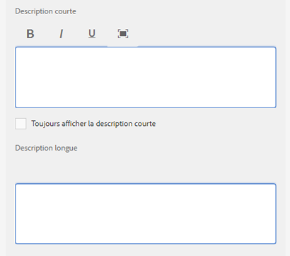
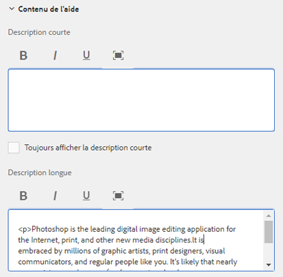
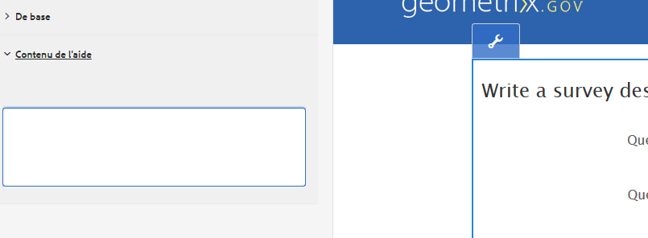

# Création d’une aide contextuelle pour les champs de formulaire{#authoring-in-context-help-for-form-fields}

## Présentation {#introduction}

Dans certains cas, les utilisateurs finaux qui remplissent un formulaire ne sont pas toujours sûrs des informations qu’ils doivent indiquer dans un champ spécifique. À cet effet, les formulaires adaptatifs permettent d’ajouter du texte ou une aide contextuelle riche à un champ de formulaire. Cela permet d’améliorer l’expérience de remplissage du formulaire et d’éviter toute ambiguïté pour les utilisateurs et utilisatrices finaux.

Cet article décrit comment les auteurs et autrices de formulaires peuvent ajouter une aide contextuelle lors de la création de formulaires adaptatifs.

## Ajout d’une aide contextuelle {#add-in-context-help}

Vous pouvez spécifier une aide contextuelle à l’aide des options suivantes dans la section Contenu de l’aide de l’onglet Propriétés de la barre latérale.

* [Description courte](authoring-in-field-help.md#p-short-description-p)
* [Description longue](authoring-in-field-help.md#p-long-description-p)

>[!NOTE]
>
>La description longue remplace la description courte. Si vous avez spécifié les deux, seule la description longue s’affiche.

### Description courte {#short-description}

Le champ Description courte permet de fournir des conseils courts et rapides pour le remplissage d’un champ de formulaire. Le texte saisi dans le champ Description courte s’affiche sous forme d’info-bulle lorsque le pointeur de la souris est placé sur le champ.

>[!NOTE]
>
>Sélectionnez **Toujours afficher la description courte** pour afficher en permanence le texte de l’aide sous le champ.

### Description longue {#long-description}

Vous pouvez utiliser le champ Description longue pour saisir un texte long ou incorporer du contenu multimédia enrichi, dont des vidéos, pour apporter une aide contextuelle. Par exemple, l’illustration ci-dessous montre comment incorporer une vidéo pour apporter une aide contextuelle.

L’ajout d’une description longue affiche une icône **?** en regard du champ. Un clic sur l’icône affiche le contenu ajouté à la section Description longue.

### Aide au niveau d’un panneau {#panel-level-help}

Outre l’aide contextuelle pour les champs de formulaire, vous pouvez spécifier une aide au niveau d’un panneau sous l’onglet Contenu de l’aide du panneau Modifier.

L’ajout d’une aide pour un panneau affiche une icône **?** en regard de la description du panneau. Un clic sur l’icône affiche le contenu ajouté dans la section Contenu de l’aide du panneau Modifier.

