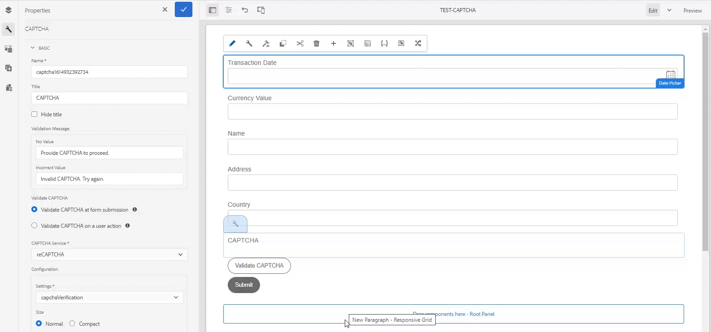

# Utiliser reCAPTCHA dans les Forms adaptatives {#using-reCAPTCHA-in-adaptive-forms}

<span class="preview"> Adobe recommande d’utiliser les [composants principaux](https://experienceleague.adobe.com/docs/experience-manager-core-components/using/adaptive-forms/introduction.html?lang=fr) de capture de données modernes et extensibles pour [créer de nouveaux formulaires adaptatifs](/help/forms/creating-adaptive-form-core-components.md) ou [ajouter des formulaires adaptatifs à des pages AEM Sites](/help/forms/create-or-add-an-adaptive-form-to-aem-sites-page.md). Ces composants représentent une avancée significative dans la création de formulaires adaptatifs, ce qui garantit des expériences utilisateur impressionnantes. Cet article décrit l’ancienne approche de la création de formulaires adaptatifs à l’aide de composants de base. </span>


| Version | Lien de l’article |
| -------- | ---------------------------- |
| AEM 6.5 | [Cliquez ici](https://experienceleague.adobe.com/docs/experience-manager-65/forms/adaptive-forms-basic-authoring/captcha-adaptive-forms.html) |
| AEM as a Cloud Service | Cet article |
| Application | Formulaire adaptatif basé sur des composants de base. <br> Pour les formulaires adaptatifs basés sur les composants principaux, [Cliquez ici](/help/forms/captcha-adaptive-forms-core-components.md). |


CAPTCHA (Completely Automated Public Turing test to tell Computers and Humans Apart, Test public de Turing complètement automatisé ayant pour but de différencier les personnes humaines des ordinateurs) est un programme couramment utilisé dans les transactions en ligne pour différencier les personnes humaines des programmes automatisés ou des robots. Il présente un test et évalue la réponse de l’utilisateur ou de l’utilisatrice pour déterminer s’il s’agit d’une personne humaine ou d’un robot qui interagit avec le site. Cela empêche l’utilisateur ou l’utilisatrice de continuer si le test échoue et permet de sécuriser les transactions en ligne en empêchant les robots d’envoyer du spam ou des éléments malveillants.

AEM Forms as a Cloud Service prend en charge les solutions CAPTCHA suivantes :

* [reCAPTCHA de Google](#configure-recaptcha-service-by-google)
* [Cloudflare Turnstile](/help/forms/integrate-adaptive-forms-turnstile.md)
* [Captcha](/help/forms/integrate-adaptive-forms-hcaptcha.md)

## Configurer le service reCAPTCHA de Google {#google-reCAPTCHA}

Les auteurs de formulaires peuvent utiliser le service reCAPTCHA de Google pour implémenter reCAPTCHA dans les Forms adaptatifs. Il offre des fonctionnalités avancées de CAPTCHA pour protéger votre site. Pour plus d’informations sur le fonctionnement de reCAPTCHA, consultez [Google reCAPTCHA](https://developers.google.com/recaptcha/). AEM Forms prend en charge [!DNL reCAPTCHA v2] et [!DNL reCAPTCHA Enterprise]. Toute autre version n’est pas prise en charge. Notez également que reCAPTCHA dans Adaptive Forms n’est pas pris en charge en mode hors ligne sur l’application [!DNL AEM Forms]. Selon vos besoins, vous pouvez configurer le service reCAPTCHA pour activer :


* [reCAPTCHA Enterprise dans AEM Forms](#steps-to-implement-reCAPTCHA-enterprise-in-forms)
* [reCAPTCHA v2 dans AEM Forms](#steps-to-implement-reCAPTCHA-v2-in-forms)


### Configuration de reCAPTCHA Enterprise  {#steps-to-implement-reCAPTCHA-enterprise-in-forms}

1. Créez ou sélectionnez un [projet Google Cloud](https://cloud.google.com/recaptcha-enterprise/docs/set-up-non-google-cloud-environments-api-keys#before-you-begin) et activez [reCAPTCHA Enterprise API](https://cloud.google.com/recaptcha-enterprise/docs/set-up-non-google-cloud-environments-api-keys#enable-the-recaptcha-enterprise-api).
1. Procurez-vous l’ [ID de projet](https://support.google.com/googleapi/answer/7014113?hl=en#:~:text=To%20locate%20your%20project%20ID,a%20member%20of%20are%20displayed) et créez une [clé d’API](https://cloud.google.com/recaptcha-enterprise/docs/set-up-non-google-cloud-environments-api-keys#create_an_api_key) et une [clé de site pour les sites web](https://cloud.google.com/recaptcha-enterprise/docs/create-key#create-key).
1. Créez un conteneur de configurations pour les services cloud.

   1. Accédez à **[!UICONTROL Outils > Général > Navigateur de configuration]**.
   1. Sélectionnez un dossier ou créez-en un, puis activez le dossier pour les configurations cloud en procédant comme suit :
      1. Dans l’explorateur de configurations, sélectionnez le dossier, puis **[!UICONTROL Propriétés]**.
      1. Dans la boîte de dialogue Propriétés de configuration, activez **[!UICONTROL Configurations cloud]**.
      1. Sélectionnez **[!UICONTROL Enregistrer et fermer]** pour enregistrer la configuration et fermer la boîte de dialogue.

1. Configurez le service cloud pour [!DNL reCAPTCHA Enterprise].

   1. Sur votre instance de création Experience Manager, accédez à  > **[!UICONTROL Cloud Services]**.
   1. Sélectionnez **[!UICONTROL reCAPTCHA]**. La page de configuration s’ouvre. Sélectionnez le conteneur de configuration que vous avez créé et sélectionnez **[!UICONTROL Créer]**.
   1. Sélectionnez la version [!DNL reCAPTCHA Enterprise] et spécifiez le nom, l’ID de projet, la clé du site et la clé API (Obtenu à l’étape 2) pour le service d’entreprise reCAPTCHA.
   1. Sélectionnez le type de clé, le type de clé doit être identique à la clé de site que vous avez configurée dans le [projet Google Cloud](https://cloud.google.com/recaptcha-enterprise/docs/set-up-non-google-cloud-environments-api-keys#before-you-begin), par exemple, **Cochez la clé de site** ou **Clé de site basée sur le score**.
   1. Spécifiez un score [seuil compris entre 0 et 1](https://cloud.google.com/recaptcha-enterprise/docs/interpret-assessment#interpret_scores). Les scores supérieurs ou égaux aux scores de seuil indiquent une interaction humaine, sinon il s’agit d’une interaction avec un robot.
   1. Sélectionnez **[!UICONTROL Créer]** pour créer la configuration du service cloud.

<!--
    1. In the Edit Component dialog, specify the name, project ID, site key, API key (obtained in steps 2 and 3), select the key type, and enter the threshold score. Select **[!UICONTROL Save Settings]** and then select **[!UICONTROL OK]** to complete the configuration.
-->

Une fois que le service reCAPTCHA Enterprise est activé, il peut être utilisé dans les formulaires adaptatifs. Voir [Utilisation du CAPTCHA dans les formulaires adaptifs](#using-reCAPTCHA).

<!--

-->

### Configurer Google reCAPTCHA v2 {#steps-to-implement-reCAPTCHA-v2-in-forms}

1. Obtenir la [paire de clés de l’API reCAPTCHA](https://www.google.com/recaptcha/admin) de Google. Elle comprend une **clé de site** et une **clé secrète**.
1. Créez un conteneur de configurations pour les services cloud.
   1. Accédez à **[!UICONTROL Outils > Général > Navigateur de configuration]**.
   1. Sélectionnez un dossier ou créez-en un, puis activez le dossier pour les configurations cloud en procédant comme suit :
      1. Dans l’explorateur de configurations, sélectionnez le dossier, puis **[!UICONTROL Propriétés]**.
      1. Dans la boîte de dialogue Propriétés de configuration, activez **[!UICONTROL Configurations cloud]**.
      1. Sélectionnez **[!UICONTROL Enregistrer et fermer]** pour enregistrer la configuration et fermer la boîte de dialogue.

1. Configurez le service cloud pour reCAPTCHA v2.

   1. Sur votre instance de création AEM, accédez à  > **Services cloud**.
   1. Sélectionnez **[!UICONTROL reCAPTCHA]**. La page de configuration s’ouvre. Sélectionnez le conteneur de configuration que vous avez créé et sélectionnez **[!UICONTROL Créer]**.
   1. Sélectionnez la version [!DNL reCAPTCHA v2] , spécifiez le nom, la clé du site et la clé secrète pour le service reCAPTCHA (Obtenu à l’étape 1) et sélectionnez **[!UICONTROL Créer]** pour créer la configuration du service cloud.
   1. Dans cette boîte de dialogue, spécifiez le site et les clés secrètes obtenues à l’étape 1. Sélectionnez **[!UICONTROL Enregistrer les paramètres]** puis **OK** pour terminer la configuration.

   Une fois que le service reCAPTCHA est configuré, il peut être utilisé dans les formulaires adaptatifs. Pour plus d’informations, voir [Utilisation du CAPTCHA dans les formulaires adaptatifs](#using-reCAPTCHA).

<!---->


## Utilisation de Google reCAPTCHA dans les formulaires adaptatifs {#using-reCAPTCHA}

Pour utiliser Google reCAPTCHA dans un formulaire adaptatif :

1. Ouvrez un formulaire adaptatif en mode d’édition.

   >[!NOTE]
   >
   >Assurez-vous que le conteneur de configurations sélectionné lors de la création du formulaire adaptatif contient le service cloud reCAPTCHA. Vous pouvez également changer les propriétés du formulaire adaptatif pour modifier le conteneur de configuration associé au formulaire.

1. À partir du navigateur du composant, faites glisser et déposez le composant **Captcha** sur le formulaire adaptatif.

   >[!NOTE]
   >
   >* L’utilisation de plusieurs composants Captcha dans un formulaire adaptatif n’est pas prise en charge. En outre, il n’est pas recommandé d’utiliser le CAPTCHA dans un panneau marqué pour le chargement différé ou dans un fragment.
   >* reCaptcha est sensible au temps et expire dans environ deux minutes. Par conséquent, il est recommandé de placer le composant Captcha juste avant le bouton Soumettre dans le formulaire adaptatif.

1. Sélectionnez le composant Captcha que vous avez ajouté et sélectionnez  pour modifier ses propriétés.
1. Indiquez un titre pour le widget CAPTCHA. La valeur par défaut est **Captcha**. Sélectionnez **Masquer le titre** si vous ne voulez pas que le titre apparaisse.
1. Dans le menu déroulant **Service Captcha**, sélectionnez **reCAPTCHA** pour activer le service reCAPTCHA si vous l’avez configuré comme décrit dans [Service reCAPTCHA de Google](#google-reCAPTCHA).
1. Sélectionnez une configuration dans la liste déroulante Paramètres pour **reCAPTCHA Enterprise** ou **reCAPTCHA v2**
   1. Si vous sélectionnez la version **reCAPTCHA Enterprise**, le type de clé peut être **checkbox** ou **score basé sur**. Il est basé sur votre sélection lorsque vous configurez la [clé de site pour les sites Web](https://cloud.google.com/recaptcha-enterprise/docs/create-key#create-key) :

   >[!NOTE]
   >
   >* Dans la configuration cloud avec **type de clé** comme **case à cocher**, le message d’erreur personnalisé s’affiche en tant que message intégré en cas d’échec de la validation du captcha.
   >* Dans la configuration cloud avec **type de clé** comme **score basé sur**, le message d’erreur personnalisé s’affiche sous forme de message contextuel si la validation du captcha échoue.

   1. Vous pouvez sélectionner la taille **[!UICONTROL normale]** et la taille **[!UICONTROL compacte]**.
   1. Vous pouvez sélectionner une **[!UICONTROL référence de liaison]**, dans **[!UICONTROL référence de liaison]** les données envoyées sont des données liées, sinon il s’agit de données non liées. Vous trouverez ci-dessous des exemples XML de données non liées et de données liées (avec une référence de liaison telle que SSN), respectivement, lorsqu’un formulaire est soumis.

   ```xml
           <?xml version="1.0" encoding="UTF-8" standalone="no"?>
           <afData>
           <afUnboundData>
               <data>
                   <captcha16820607953761>
                       <captchaType>reCaptchaEnterprise</captchaType>
                       <captchaScore>0.9</captchaScore>
                   </captcha16820607953761>
               </data>
           </afUnboundData>
           <afBoundData>
               <Root
                   xmlns:xfa="http://www.xfa.org/schema/xfa-data/1.0/"
                   xmlns:xsi="http://www.w3.org/2001/XMLSchema-instance">
                   <PersonalDetails>
                       <SSN>371237912</SSN>
                       <FirstName>Sarah </FirstName>
                       <LastName>Smith</LastName>
                   </PersonalDetails>
                   <OtherInfo>
                       <City>California</City>
                       <Address>54 Residency</Address>
                       <State>USA</State>
                       <Zip>123112</Zip>
                   </OtherInfo>
               </Root>
           </afBoundData>
           <afSubmissionInfo>
               <stateOverrides/>
               <signers/>
               <afPath>/content/dam/formsanddocuments/captcha-form</afPath>
               <afSubmissionTime>20230608034928</afSubmissionTime>
           </afSubmissionInfo>
           </afData>
   ```

   ```xml
           <?xml version="1.0" encoding="UTF-8" standalone="no"?>
           <afData>
           <afUnboundData>
               <data/>
           </afUnboundData>
           <afBoundData>
               <Root
                   xmlns:xfa="http://www.xfa.org/schema/xfa-data/1.0/"
                   xmlns:xsi="http://www.w3.org/2001/XMLSchema-instance">
                   <PersonalDetails>
                       <SSN>
                           <captchaType>reCaptchaEnterprise</captchaType>
                           <captchaScore>0.9</captchaScore>
                       </SSN>
                       <FirstName>Sarah</FirstName>
                       <LastName>Smith</LastName>
                   </PersonalDetails>
                   <OtherInfo>
                       <City>California</City>
                       <Address>54 Residency</Address>
                       <State>USA</State>
                       <Zip>123112</Zip>
                   </OtherInfo>
               </Root>
           </afBoundData>
           <afSubmissionInfo>
               <stateOverrides/>
               <signers/>
               <afPath>/content/dam/formsanddocuments/captcha-form</afPath>
               <afSubmissionTime>20230608035111</afSubmissionTime>
           </afSubmissionInfo>
           </afData>
   ```

   Si vous sélectionnez la version **reCAPTCHA v2** :
   1. Vous pouvez sélectionner la taille **[!UICONTROL Normal]** ou **[!UICONTROL Compact]** pour le widget reCAPTCHA.
   1. Vous pouvez sélectionner l&#39;option **[!UICONTROL Invisible]** pour afficher le défi CAPTCHA uniquement en cas d&#39;activité suspecte.

   Le service reCAPTCHA est activé sur le formulaire adaptatif. Vous pouvez prévisualiser le formulaire et voir CAPTCHA fonctionner. Le badge **protégé par reCAPTCHA**, affiché ci-dessous, s’affiche sur les formulaires protégés.
   

1. Enregistrez les propriétés.

>[!NOTE]
> 
> Ne sélectionnez pas **[!UICONTROL Par défaut]** dans le menu déroulant Service Captcha puisque le service par défaut AEM CAPTCHA est obsolète.

>[!VIDEO](https://video.tv.adobe.com/v/3422641/recaptcha-google-adaptive-forms/?quality=12&learn=on)

### Affichage ou masquage du composant CAPTCHA en fonction de règles {#show-hide-captcha}

Vous pouvez choisir d’afficher ou de masquer le composant CAPTCHA en fonction des règles que vous appliquez à un composant d’un formulaire adaptatif. Sélectionnez le composant, sélectionnez , puis sélectionnez **[!UICONTROL Créer]** pour créer une règle. Pour plus d’informations sur la création de règles, voir la section [Éditeur de règles](rule-editor.md).

Par exemple, le composant CAPTCHA ne doit s’afficher dans un formulaire adaptatif que si la valeur du champ Valeur monétaire du formulaire est supérieure à 25 000.

Sélectionnez le champ **[!UICONTROL Valeur monétaire]** dans le formulaire et créez les règles suivantes :


>[!NOTE]
>
> Lorsque vous sélectionnez une configuration reCAPTCHA v2 et que la taille est définie sur [!UICONTROL Invisible], l’option afficher/masquer reste désactivée.

### Valider le CAPTCHA {#validate-captcha}

Vous pouvez valider le CAPTCHA dans un formulaire adaptatif lorsque vous envoyez le formulaire ou que vous basez la validation CAPTCHA sur des actions et conditions des utilisateurs.

#### Valider le CAPTCHA lors de l’envoi du formulaire {#validation-form-submission}

Pour valider automatiquement un CAPTCHA lorsque vous envoyez un formulaire adaptatif :

1. Sélectionnez le composant CAPTCHA et sélectionnez  pour afficher les propriétés du composant.
1. Dans la section **[!UICONTROL Valider le CAPTCHA]**, sélectionnez **[!UICONTROL Valider le CAPTCHA lors de l’envoi du formulaire]**.
1. Sélectionnez  pour enregistrer les propriétés du composant.

#### Validation du CAPTCHA sur les actions et conditions des utilisateurs {#validate-captcha-user-action}

Pour valider un CAPTCHA en fonction des conditions et des actions des utilisateurs et des utilisatrices :

1. Sélectionnez le composant CAPTCHA et sélectionnez  pour afficher les propriétés du composant.
1. Dans la section **[!UICONTROL Valider le CAPTCHA]**, sélectionnez **[!UICONTROL Valider le CAPTCHA sur une action utilisateur]**.
1. Sélectionnez  pour enregistrer les propriétés du composant.

[!DNL Experience Manager Forms] fournit une API `ValidateCAPTCHA` pour valider le CAPTCHA à l’aide de conditions prédéfinies. Vous pouvez appeler l’API à l’aide d’une action d’envoi personnalisée ou en définissant des règles sur les composants d’un formulaire adaptatif.

Voici un exemple d’API `ValidateCAPTCHA` permettant de valider le CAPTCHA à l’aide de conditions prédéfinies :

```javascript
if (slingRequest.getParameter("numericbox1614079614831").length() >= 5) {
     GuideCaptchaValidatorProvider apiProvider = sling.getService(GuideCaptchaValidatorProvider.class);
        String formPath = slingRequest.getResource().getPath();
        String captchaData = slingRequest.getParameter(GuideConstants.GUIDE_CAPTCHA_DATA);
        if (!apiProvider.validateCAPTCHA(formPath, captchaData).isCaptchaValid()){
            response.setStatus(400);
            return;
        }
    }
```

L’exemple signifie que l’API `ValidateCAPTCHA` valide le CAPTCHA dans le formulaire uniquement si le nombre de chiffres dans la zone numérique spécifiée par l’utilisateur lors du remplissage du formulaire est supérieur à 5.

**Option 1 : utiliser l’API [!DNL Experience Manager Forms] ValidateCAPTCHA pour valider le CAPTCHA à l’aide d’une action d’envoi personnalisée**

Effectuez les étapes suivantes pour utiliser l’API `ValidateCAPTCHA` pour valider le CAPTCHA à l’aide d’une action d’envoi personnalisée :

1. Ajoutez le script qui inclut l’API `ValidateCAPTCHA` à l’action d’envoi personnalisée. Pour plus d’informations sur les actions d’envoi personnalisées, voir [Création d’une action d’envoi personnalisée pour les formulaires adaptatifs](custom-submit-action-form.md).
1. Sélectionnez le nom de l’action d’envoi personnalisée dans la liste déroulante **[!UICONTROL Action d’envoi]** des propriétés **[!UICONTROL Envoi]** d’un formulaire adaptatif.
1. Sélectionnez **[!UICONTROL Soumettre]**. Le CAPTCHA est validé en fonction des conditions définies dans l’API `ValidateCAPTCHA` de l’action d’envoi personnalisée.

**Option 2 : utiliser l’API [!DNL Experience Manager Forms] ValidateCAPTCHA pour valider le CAPTCHA sur une action de l’utilisateur avant d’envoyer le formulaire**

Vous pouvez également appeler l’API `ValidateCAPTCHA` en appliquant des règles à un composant d’un formulaire adaptatif.

Par exemple, vous ajoutez un bouton **[!UICONTROL Valider le CAPTCHA]** dans un formulaire adaptatif et créez une règle pour appeler un service lors d’un clic sur un bouton.

La figure suivante illustre comment vous pouvez appeler un service lors d’un clic sur le bouton **[!UICONTROL Valider le CAPTCHA]** :



Vous pouvez appeler la servlet personnalisée qui inclut l’API `ValidateCAPTCHA` à l’aide de l’éditeur de règles et activer ou désactiver le bouton d’envoi du formulaire adaptatif en fonction du résultat de la validation.

De même, vous pouvez utiliser l’éditeur de règles pour inclure une méthode personnalisée pour valider le CAPTCHA dans un formulaire adaptatif.

<!--

### Add custom CAPTCHA services {#add-custom-captcha-service}

[!DNL Experience Manager Forms] provides reCAPTCHA as the CAPTCHA service. However, you can add a custom service to display in the **[!UICONTROL CAPTCHA Service]** drop-down list.  

The following is a sample implementation of the interface to add additional CAPTCHA service to your Adaptive Form:

```javascript
package com.adobe.aemds.guide.service;

import org.osgi.annotation.versioning.ConsumerType;

/**
 * An interface to provide captcha validation at server side in Adaptive Form
 * This interface can be used to provide custom implementation for different captcha services.
 */
@ConsumerType
public interface GuideCaptchaValidator {
    /**
     * This method should define the actual validation logic of the captcha
     * @param captchaPropertyNodePath path to the node with CAPTCHA configurations inside form container
     * @param userResponseToken  The user response token provided by the CAPTCHA from client-side
     *
     * @return  {@link GuideCaptchaValidationResult} validation result of the captcha
     */
     GuideCaptchaValidationResult validateCaptcha(String captchaPropertyNodePath, String userResponseToken);

    /**
     * Returns the name of the captcha validator. This should be unique among the different implementations
     * @return  name of the captcha validator
     */
     String getCaptchaValidatorName();
}
```

`captchaPropertyNodePath` refers to the resource path of the CAPTCHA component in the Sling repository. Use this property to include details specific to the CAPTCHA component. For example, `captchaPropertyNodePath` includes information for the reCAPTCHA cloud configuration configured on the CAPTCHA component. The cloud configuration information provides **[!UICONTROL Site Key]** and **[!UICONTROL Secret Key]** settings for implementing the reCAPTCHA service.

`userResponseToken` refers to the `g_recaptcha_response` that gets generated after solving a CAPTCHA in a form. -->

### Modifier le domaine de service reCAPTCHA {#reCAPTCHA-service-domain}

Le service reCAPTCHA utilise `https://www.recaptcha.net/` comme domaine par défaut. Vous pouvez modifier les paramètres pour définir `https://www.google.com/` ou tout nom de domaine personnalisé pour le chargement, le rendu et la validation du service reCAPTCHA.

Définissez la propriété **[!UICONTROL af.cloudservices.recaptcha.domain]** de la **[!UICONTROL configuration du formulaire adaptatif et du canal web de communication interactive]** pour spécifier `https://www.google.com/` ou tout autre nom de domaine personnalisé. Le fichier JSON suivant affiche un exemple :

```json
{
  "af.cloudservices.recaptcha.domain": "https://www.google.com/"
}
```

Pour définir les valeurs d’une configuration, [générez des configurations OSGi à l’aide du SDK AEM](https://experienceleague.adobe.com/docs/experience-manager-cloud-service/implementing/deploying/configuring-osgi.html?lang=fr#generating-osgi-configurations-using-the-aem-sdk-quickstart) et [déployez la configuration](https://experienceleague.adobe.com/docs/experience-manager-cloud-service/implementing/using-cloud-manager/deploy-code.html?lang=fr#deployment-process) sur votre instance de Cloud Service.

## Voir également {#see-also}

{{see-also}}

<!--

>[!MORELIKETHIS]
>
>* [Reference Themes, Templates, and Form Data models for Adaptive Forms](/help/forms/reference-themes-templates-data-models.md)

-->
