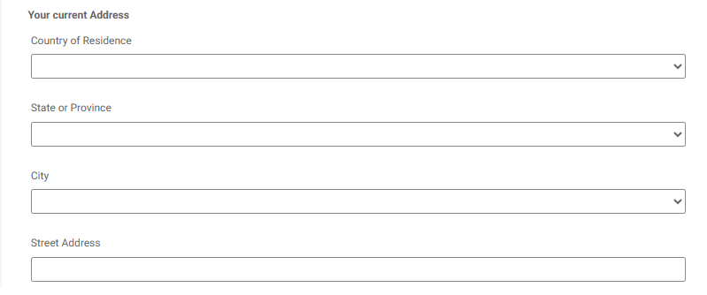
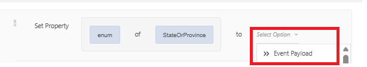

# Créer un formulaire à l’aide l’éditeur universel

Créez le formulaire suivant à l’aide de l’éditeur universel. Le formulaire comporte 3 listes déroulantes dont les valeurs seront renseignées à l’aide de l’intégration d’API

## Pays de résidence

Lors de l’initialisation, la liste déroulante Pays de résidence est renseignée avec les résultats de l’appel API.

## Gestionnaire de succès

Le gestionnaire de succès a été défini pour configurer les valeurs enum et enumNames de la liste déroulante des pays avec les valeurs appropriées du tableau geonames. Le tableau geonames est disponible sous l&#39;option Payload d&#39;événement .

## Récupérer les valeurs enfants

La liste déroulante d’État ou de province est renseignée lorsque l’utilisateur ou l’utilisatrice effectue une sélection dans la liste déroulante Pays de résidence. Le geonameId associé au pays sélectionné est transmis en tant que paramètre d’entrée à l’intégration de l’API GetChildren.

Le gestionnaire de succès a été défini pour définir enum/enumNames du champ déroulant StateOrProvince .

Lorsque l’État ou la province est sélectionné, vous pouvez renseigner la liste déroulante Ville en suivant le modèle mentionné ci-dessus utilisé pour remplir la liste déroulante d’État ou de province.