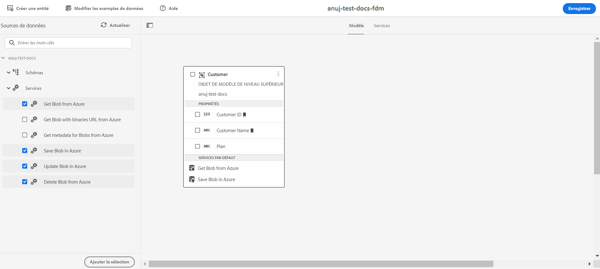

# Configurer le stockage [!DNL Azure] {#configure-azure-storage}

[[!DNL Experience Manager Forms] Intégration de données](data-integration.md) fournit une configuration de stockage [!DNL Azure] pour intégrer des formulaires aux services de stockage [!DNL Azure]. Le modèle de données de formulaire peut être utilisé pour créer des formulaires adaptatifs qui interagissent avec un serveur [!DNL Azure] pour activer des processus métier. Par exemple :

* Écrire des données dans [!DNL Azure] sur un envoi de formulaires adaptatifs.
* Écriture de données dans [!DNL Azure] par le biais d’entités personnalisées définies dans le modèle de données de formulaire et inversement.
* Demander des données à un serveur [!DNL Azure] et préremplir des formulaires adaptatifs.
* Lire des données à partir du serveur [!DNL Azure].

## Créer une configuration de stockage [!DNL Azure] {#create-azure-storage-configuration}

Avant d’exécuter ces étapes, vérifiez que vous disposez d’un compte de stockage [!DNL Azure] et d’une clé d’accès pour autoriser l’accès au compte de stockage [!DNL Azure].

1. Accédez à **[!UICONTROL Outils]** > **[!UICONTROL Cloud Services]** > **[!UICONTROL Stockage Azure]**.
1. Sélectionnez un dossier pour créer la configuration et appuyez sur **[!UICONTROL Créer]**.
1. Indiquez un titre pour la configuration dans le champ **[!UICONTROL Titre]**.
1. Indiquez le nom du compte de stockage [!DNL Azure] dans le champ **[!UICONTROL Compte de stockage Azure]**.
1. Indiquez la clé pour accéder au compte de stockage Azure dans le champ **[!UICONTROL Clé d’accès Azure]** et appuyez sur **[!UICONTROL Enregistrer]**.

## Création d’un modèle de données de formulaire {#create-azure-form-data-model}

Après avoir créé la configuration de stockage [!DNL Azure], vous pouvez [créer le modèle de données de formulaire](create-form-data-models.md). Spécifiez le dossier contenant la configuration [!DNL Azure] dans le champ **[!UICONTROL Configuration de source de données]** lors de la création du modèle de données de formulaire. Vous pouvez ensuite sélectionner la configuration dans la liste des configurations existant dans le nom de dossier spécifié.

### Ajout de services [!DNL Azure] au modèle de données de formulaire {#add-azure-services}

Après avoir créé le modèle de données de formulaire et ajouté des objets de modèle de données, vous pouvez ajouter des services [!DNL Azure] au modèle de données de formulaire.

Pour ajouter des services [!DNL Azure] :

1. En mode d’édition, sélectionnez les services dans la section **[!UICONTROL Services]** du volet de gauche, puis appuyez sur **[!UICONTROL Ajouter la sélection]**. Les services sélectionnés s’affichent dans l’onglet **[!UICONTROL Services]** du modèle de données de formulaire.

   

1. Dans l’onglet **[!UICONTROL Services]**, sélectionnez le service et appuyez sur **[!UICONTROL Modifier les propriétés]**. En fonction du service, définissez les objets de modèle d’entrée ou de sortie pour le service.

1. Appuyez sur **[!UICONTROL Enregistrer]** pour enregistrer le modèle de données de formulaire.

   Le tableau suivant décrit les services [!DNL Azure] disponibles :

   <table>
    <tbody>
     <tr>
      <th><strong>Nom du service</strong></th>
      <th><strong>Description</strong></th>
     </tr>
     <tr>
      <td>Get Blob from Azure (Obtenir un objet Blob à partir d’Azure)</td>
      <td>Récupération des données stockées sous la forme d’un objet Blob dans le stockage Azure à l’aide d’un identifiant ou d’un nom</td>
     </tr>
     <tr>
      <td>Get Blob with binaries URL from Azure (Obtenir un objet Blob avec une URL de fichiers binaires depuis Azure)</td>
      <td>Récupérer les données stockées en tant qu’objet Blob avec une URL pour les fichiers binaires dans le stockage Azure à l’aide d’un identifiant ou d’un nom</td>
     </tr>
     <tr>
      <td>Save Blob in Azure (Enregistrer l’objet Blob dans Azure)</td>
      <td>Utilisation d’un ID d’objet Blob pour enregistrer des données dans le stockage Azure</td>
     </tr>
     <tr>
      <td>Update Blob in Azure (Mettre un objet Blob à jour dans Azure)</td>
      <td>Utilisation d’un ID d’objet Blob pour mettre à jour les données dans le stockage Azure</td>
     </tr>
     <tr>
      <td>Récupération de la liste des ID Blob d’Azure</td>
      <td>Récupérez une liste d’ID Blob à partir d’Azure en fonction du nombre défini dans la requête d’entrée.</td>
     </tr>
     <tr>
      <td>Récupération des URL SAS pour les objets Blob à partir d’Azure</td>
      <td>Récupérez les URL SAS pour les objets Blob à partir d’Azure en fonction des ID Blob dans la requête d’entrée.</td>
     </tr>
     <tr>
      <td>Delete Blob from Azure (Supprimer un objet Blob d’Azure)</td>
      <td>Utilisation d’un ID d’objet Blob pour supprimer des données du stockage Azure</td>
     </tr>
    </tbody>
   </table>

### Définition d’une propriété d’objet de modèle de données comme clé de recherche {#define-data-model-object-as-metadata}

Pour définir une propriété d’objet de modèle de données comme clé de recherche :

1. Dans l’onglet **[!UICONTROL Modèle]**, sélectionnez la propriété de l’objet de modèle de données et appuyez sur **[!UICONTROL Modifier les propriétés]**.
1. Activez l’option **[!UICONTROL Clé de recherche]**. Cette option est disponible uniquement pour les types de données principaux.
1. Appuyez sur **[!UICONTROL Terminé]** pour enregistrer les propriétés puis sur **[!UICONTROL Enregistrer]** pour enregistrer le modèle de données de formulaire.

Après avoir défini les propriétés des objets du modèle de données comme clés de recherche, les valeurs de hachage sont stockées dans les balises dʼindex Azure et les valeurs codées en base64 dans les métadonnées Azure.

>[!NOTE]
>
>Seules 10 clés de recherche sont autorisées par entité Azure, car Azure nʼautorise que 10 balises par objet Blob. Les valeurs des propriétés marquées comme clés de recherche sont stockées dans les balises d’index Azure après hachage.

<!--

>[!MORELIKETHIS]
>
>* [Configure data sources for AEM Forms](/help/forms/configure-data-sources.md)
>* [Integrate Microsoft Dynamics 365 and Salesforce with Adaptive Forms](/help/forms/configure-msdynamics-salesforce.md)
>  [Add Forms Portal to an AEM Sites page](/help/forms/configure-forms-portal.md)

-->