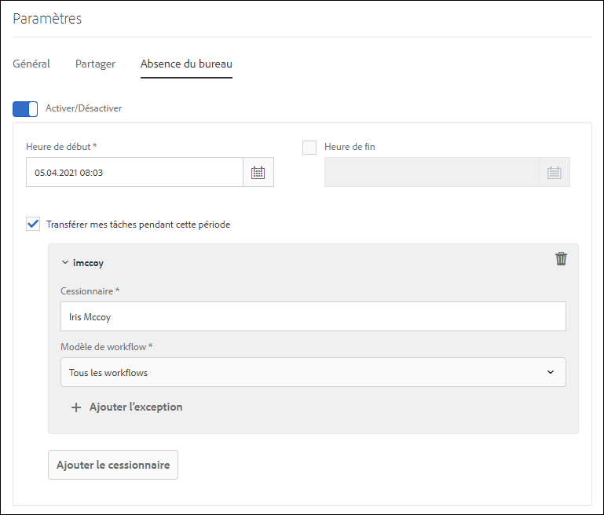

# Configuration du paramètre d’absence du bureau {#configure-out-of-office-settings}

| Version | Lien de l’article |
| -------- | ---------------------------- |
| AEM 6.5 | [Cliquez ici](https://experienceleague.adobe.com/docs/experience-manager-65/forms/workflows/configure-out-of-office-settings.html?lang=fr) |
| AEM as a Cloud Service | Cet article |

Si vous envisagez de vous absenter du bureau, vous pouvez spécifier les actions à entreprendre pour les tâches qui vous sont affectées pendant cette période.

Vous pouvez spécifier une date et une heure de début, ainsi qu’une date et une heure de fin, pour l’application de vos paramètres d’absence du bureau. Si vous êtes situé dans un fuseau horaire différent de celui du serveur, le fuseau horaire utilisé est celui du client.

Vous pouvez définir une personne par défaut à laquelle toutes vos tâches sont envoyées. Vous pouvez également spécifier des exceptions pour que des tâches issues de processus spécifiques soient envoyées à un utilisateur différent ou pour qu’elles restent dans votre boîte de réception jusqu’à votre retour. Si la personne désignée est également absente du bureau, la tâche passe à l’utilisateur qu’elle aura désigné. Si la tâche ne peut pas être affectée à un utilisateur qui n’est pas absent du bureau, elle demeure dans votre boîte de réception.

Vous pouvez séparer la délégation de tâches en fonction des modèles de processus. Par exemple, vous pouvez affecter une tâche liée au processus A à l’utilisateur A et affecter une tâche liée au processus B à l’utilisateur B.

>[!NOTE]
>
>* Lorsque vous activez le paramètre Absence du bureau , tous les éléments disponibles dans votre boîte de réception, avant d’activer le paramètre, restent dans votre boîte de réception. Seules les tâches reçues après l’activation du paramètre sont déléguées.
>* Lorsque vous désactivez le paramètre Absence du bureau, les tâches déléguées ne vous sont pas automatiquement réaffectées. Vous pouvez utiliser la fonctionnalité de revendication pour que ces tâches vous soient attribuées.
>* Lorsque l’utilisateur A délègue des tâches à l’utilisateur B et que l’utilisateur B délègue des tâches à l’utilisateur C, les tâches sont affectées uniquement à l’utilisateur C et non à l’utilisateur B.
>* Lorsqu’une boucle est en cours d’attribution, les tâches restent réservées à l’utilisateur d’origine. Par exemple, lorsque l’utilisateur A délègue des tâches à l’utilisateur B, l’utilisateur C délègue des tâches à l’utilisateur C, l’utilisateur C délègue des tâches à l’utilisateur D et l’utilisateur D délègue des tâches à l’utilisateur B, une boucle est créée. Dans ce cas, l’élément reste avec l’utilisateur d’origine. L’utilisateur A est l’utilisateur d’origine dans l’exemple ci-dessus.

## Activez le paramètre Absence du bureau pour votre compte {#enable-out-of-office}

Effectuez les étapes suivantes pour activer le paramètre Absence du bureau pour votre compte et déléguez les tâches de votre boîte de réception à un autre utilisateur :

1. Connectez-vous à l’instance AEM. Sélectionnez l’icône , puis **[!UICONTROL Afficher tout]**. La liste des éléments de votre boîte de réception s’affiche.
1. Sélectionnez l’icône  ou  en regard du bouton **[!UICONTROL Créer]**, puis sélectionnez **[!UICONTROL Paramètres]**. La boîte de dialogue des paramètres apparaît.
1. Ouvrez l’onglet **[!UICONTROL Absence du bureau]** dans la boîte de dialogue des paramètres.
1. Appuyez sur le bouton **[!UICONTROL Activer/Désactiver]** pour activer le paramètre Absence du bureau.
1. Spécifiez les paramètres **[!UICONTROL Heure de Début]** et **[!UICONTROL Heure de fin]**. Les tâches sont déléguées uniquement pendant la période spécifiée. Laissez le champ **[!UICONTROL Heure de fin]** vide pour déléguer des tâches pour une période indéfinie.
1. Cochez la case **[!UICONTROL Transférer mes tâches pendant cette période]**. Si vous ne sélectionnez pas l’option et ne spécifiez pas de personne désignée, vos éléments ne sont transférés à aucun utilisateur ni utilisatrice. Bien que vous soyez absent et que le paramètre soit activé, les tâches restent dans votre boîte de réception.
1. Sélectionnez **[!UICONTROL Ajouter une personne désignée]**. Spécifiez un utilisateur dans le champ **[!UICONTROL Cessionnaire]** pour lui déléguer les tâches. Spécifiez le **[!UICONTROL modèle de workflow]** à déléguer à l’utilisateur spécifié. Vous pouvez sélectionner plusieurs modèles de processus.

   En outre, pour affecter toutes les tâches, quel que soit le modèle de processus, à un utilisateur particulier, sélectionnez **[!UICONTROL Tous les processus]** dans la liste déroulante Modèle de processus.  

   Pour attribuer des éléments à un utilisateur ou une utilisatrice spécifique pour quasiment tous les modèles de workflow, sélectionnez **[!UICONTROL Tous les workflows]** dans la liste déroulante Modèle de workflow, appuyez sur **[!UICONTROL + Ajouter des exceptions]** et spécifiez les modèles de workflow à exclure.
    

   Répétez cette étape pour ajouter d’autres délégataires.  

   >[!NOTE]
   >
   >L’ordre des délégataires est important. Lorsqu’une tâche est affectée à un utilisateur qui a activé le paramètre Absence du bureau, la tâche est évaluée par rapport à la liste des délégataires dans leur ordre d’ajout. Lorsqu’un élément correspond aux critères, il est attribué à la personne désignée et la personne désignée suivante n’est pas cochée.

1. Sélectionnez **[!UICONTROL Enregistrer]**. Ce paramètre prend effet à la date et à l’heure de début spécifiées. Si vous vous connectez pendant que vous êtes absent du bureau, vous êtes toujours considéré comme absent du bureau jusqu’à ce que vous ayez modifié vos paramètres.

Désormais, les tâches qui vous sont affectées au cours de la période d’absence du bureau sont automatiquement affectées au délégataire spécifié.

>[!NOTE]
>
>(Pour les éléments de workflow basés sur Forms uniquement) Activez l’option **[!UICONTROL Autoriser la personne désignée à déléguer à l’aide de l’option &quot;Paramètres d’absence du bureau&quot;]** de l’étape **[!UICONTROL Affecter une tâche]** dans le workflow. Seules les tâches pour lesquelles l’option ci-dessus est activée sont déléguées à d’autres utilisateurs.
>(Pour les éléments de processus orientés formulaire uniquement) Activez l’option **[!UICONTROL Autoriser les délégataires à déléguer à l’aide des paramètres « Absence du bureau »]** de l’étape **[!UICONTROL Attribuer la tâche]** du processus. Seules les tâches pour lesquelles l’option ci-dessus est activée sont déléguées à d’autres utilisateurs ou utilisatrices.

## Limites {#limitations}

* L’affectation de tâches à un groupe n’est pas prise en charge.
* L’activation du paramètre Absence du bureau pour les tâches de projet n’est actuellement pas prise en charge.
