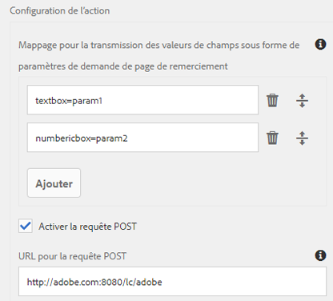
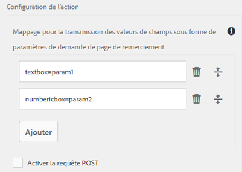

# Configuration d’un formulaire adaptatif pour l’action d’envoi de point d’entrée REST

 La possibilité de spécifier le point d’entrée REST à l’aide de la configuration est un programme adopté rapidement qui s’applique uniquement aux composants principaux et à Edge Delivery Services Forms. Vous pouvez écrire à `aem-forms-ea@adobe.com` à partir de votre ID d’e-mail officiel pour rejoindre le programme des utilisateurs et utilisatrices précoces et demander l’accès à la fonctionnalité. 

Utilisez l’action **[!UICONTROL Envoyer vers le point d’entrée REST]** pour transmettre les données envoyées à l’URL REST. L’URL peut être celle d’un serveur interne (le serveur sur lequel le formulaire est rendu) ou externe.

AEM as a Cloud Service propose différentes actions d’envoi prêtes à l’emploi pour gérer les envois de formulaires. Pour en savoir plus sur ces options, consultez l’article [Action d’envoi de formulaire adaptatif](/help/forms/aem-forms-submit-action.md).

## Avantages

Voici quelques avantages de la configuration de l’action d’envoi **[!UICONTROL Envoyer vers le point d’entrée REST]** pour le Forms adaptatif :

* Il permet une intégration transparente des données de formulaire aux systèmes et services externes par le biais d’API RESTful.
* Il offre une certaine flexibilité pour gérer les envois de données à partir de Forms adaptatif, en prenant en charge les structures de données dynamiques et complexes.
* Il prend en charge le mappage dynamique des champs de formulaire aux paramètres de l’URL du point d’entrée REST, ce qui permet des envois de données adaptables et personnalisables.

## Configuration de l’action d’envoi Envoyer vers le point d’entrée REST {#steps-to-configure-submit-to-restendpoint-submit-action}

>[!BEGINTABS]

>[!TAB Composant de base]

Pour configurer l’action d’envoi en fonction de la spécification Swagger Open API pour le formulaire adaptatif basé sur les composants de base, procédez comme suit :

1. Ouvrez le formulaire adaptatif pour le modifier et accéder à la section **[!UICONTROL Envoi]** des propriétés du Conteneur de formulaires adaptatifs.
1. Dans la liste déroulante **[!UICONTROL Action Envoyer]**, sélectionnez **[!UICONTROL Envoyer vers le point d’entrée REST]**.

   

   Pour publier des données sur un serveur interne, indiquez le chemin de la ressource. Les données sont publiées avec le chemin de la ressource. Par exemple, `/content/restEndPoint`. Pour ces requêtes de publication, les informations d’authentification de la requête d’envoi sont utilisées.
Cette option vous permet de saisir directement le point d’entrée REST cible .
Pour publier des données sur un serveur externe, indiquez une URL. Le format d’URL est le suivant : `https://host:port/path_to_rest_end_point`. Assurez-vous de configurer le chemin pour que la requête POST soit traitée anonymement.
   

   Dans l’exemple ci-dessus, les informations saisies par l’utilisateur dans `textbox` sont capturées au moyen du paramètre `param1`. La syntaxe permettant de publier les données capturées au moyen de `param1` est :

   `String data=request.getParameter("param1");`

   De même, les paramètres que vous utilisez pour publier des données XML et des pièces jointes sont `dataXml` et `attachments`.

   Par exemple, vous utilisez ces deux paramètres dans votre script pour analyser les données à un point d’entrée REST. Vous utilisez la syntaxe suivante pour stocker et analyser les données :

   `String data=request.getParameter("dataXml");`
   `String att=request.getParameter("attachments");`

   Dans cet exemple, `data` stocke les données XML et `att` stocke les données des pièces jointes.
L’option d’envoi **[!UICONTROL Envoyer vers le point d’entrée REST]** transmet les données renseignées dans le formulaire à une page de confirmation configurée dans le cadre de la requête HTTP GET. Vous pouvez ajouter le nom du champ à demander. Le format de la requête est :
   `{fieldName}={request parameter name}`

   Comme illustré ci-dessous, `param1` et `param2` sont transmis en tant que paramètres avec des valeurs copiées à partir des champs **textbox** et **numericbox** pour la prochaine action.

   

   Vous pouvez également **[!UICONTROL Activer la requête POST]** et fournir une URL pour la publication de la requête. Pour envoyer des données au serveur AEM qui héberge le formulaire, utilisez un chemin d’accès relatif correspondant au chemin racine du serveur AEM. Par exemple, `/content/forms/af/SampleForm.html`. Pour envoyer des données vers un autre serveur, utilisez un chemin d’accès absolu.

1. Cliquez sur **[!UICONTROL Terminé]**.

>[!TAB Composant principal]

Pour configurer l’action d’envoi en fonction de la spécification Swagger Open API pour le formulaire adaptatif basé sur les composants principaux, procédez comme suit :

1. Ouvrez l’explorateur de contenu, puis sélectionnez le composant **[!UICONTROL Conteneur de guide]** de votre formulaire adaptatif.
1. Cliquez sur l’icône des propriétés du conteneur de guide . La fenêtre du conteneur de formulaires adaptatifs s’ouvre.
1. Cliquez sur l’onglet **[!UICONTROL Envoi]**.
1. Dans la liste déroulante **[!UICONTROL Action Envoyer]**, sélectionnez **[!UICONTROL Envoyer vers le point d’entrée REST]**.

   

   Pour publier des données sur un serveur interne, indiquez le chemin de la ressource. Les données sont publiées avec le chemin de la ressource. Par exemple, `/content/restEndPoint`. Pour ces requêtes de publication, les informations d’authentification de la requête d’envoi sont utilisées.

   Vous disposez de deux options pour spécifier le point d’entrée REST :

   +++URL

   Cette option vous permet de saisir directement le point d’entrée REST cible .
Pour publier des données sur un serveur externe, indiquez une URL. Le format d’URL est le suivant : `https://host:port/path_to_rest_end_point`. Assurez-vous de configurer le chemin pour que la requête POST soit traitée anonymement.

   

   Dans l’exemple ci-dessus, les informations saisies par l’utilisateur dans `textbox` sont capturées au moyen du paramètre `param1`. La syntaxe permettant de publier les données capturées au moyen de `param1` est :

   `String data=request.getParameter("param1");`

   De même, les paramètres que vous utilisez pour publier des données XML et des pièces jointes sont `dataXml` et `attachments`.

   Par exemple, vous utilisez ces deux paramètres dans votre script pour analyser les données à un point d’entrée REST. Vous utilisez la syntaxe suivante pour stocker et analyser les données :

   `String data=request.getParameter("dataXml");`
   `String att=request.getParameter("attachments");`

   Dans cet exemple, `data` contient les données XML et `att` les données des pièces jointes.

   L’option d’envoi **[!UICONTROL Envoyer vers le point d’entrée REST]** transmet les données renseignées dans le formulaire à une page de confirmation configurée dans le cadre de la requête HTTP GET. Vous pouvez ajouter le nom du champ à demander. Le format de la requête est :

   `{fieldName}={request parameter name}`

   Comme illustré ci-dessous, `param1` et `param2` sont transmis en tant que paramètres avec des valeurs copiées à partir des champs **textbox** et **numericbox** pour la prochaine action.

   

   Vous pouvez également **[!UICONTROL Activer la requête POST]** et fournir une URL pour la publication de la requête. Pour envoyer des données au serveur AEM qui héberge le formulaire, utilisez un chemin d’accès relatif correspondant au chemin racine du serveur AEM. Par exemple, `/content/forms/af/SampleForm.html`. Pour envoyer des données vers un autre serveur, utilisez un chemin d’accès absolu.

   +++

   +++Configuration

   Cette option vous permet d’ajouter une configuration HTTP prédéfinie gérée via l’explorateur de configurations d’AEM. Vous pouvez sélectionner la configuration créée pour votre type d’authentification de point d’entrée Rest de service et les types de contenu. Pour en savoir plus sur le type d’authentification et les types de contenu, consultez [configuration des sources de données](/help/forms/configure-data-sources.md#configure-restful-services-using-service-endpoint-configure-restful-services-service-endpoint)

   +++

1. Cliquez sur **[!UICONTROL Terminé]**.

>[!TAB Éditeur universel]

Pour configurer l’action d’envoi en fonction de la spécification de l’API Open Swagger pour le formulaire adaptatif créé dans l’éditeur universel, procédez comme suit :

1. Ouvrez le formulaire adaptatif pour le modifier.
1. Cliquez sur l’extension **Modifier les propriétés du formulaire** dans l’éditeur.
La boîte de dialogue **Propriétés du formulaire** s’affiche.
   >[!NOTE]
   >
   > * Si l’icône **Modifier les propriétés de formulaire** ne s’affiche pas dans l’interface de l’éditeur universel, activez l’extension **Modifier les propriétés de formulaire** dans Extension Manager.
   > * Consultez l’article [Caractéristiques des fonctionnalités d’Extension Manager](https://developer.adobe.com/uix/docs/extension-manager/feature-highlights/#enablingdisabling-extensions) pour savoir comment activer ou désactiver les extensions dans l’éditeur universel.
1. Cliquez sur l’onglet **Envoi** et sélectionnez l’action d’envoi **[!UICONTROL Envoyer vers le point d’entrée REST]**.

   Pour publier des données sur un serveur interne, indiquez le chemin de la ressource. Les données sont publiées avec le chemin de la ressource. Par exemple, `/content/restEndPoint`. Pour ces requêtes de publication, les informations d’authentification de la requête d’envoi sont utilisées.

   Vous disposez de deux options pour spécifier le point d’entrée REST :

   +++URL

   Cette option vous permet de saisir directement le point d’entrée REST cible .
Pour publier des données sur un serveur externe, indiquez une URL. Le format d’URL est le suivant : `https://host:port/path_to_rest_end_point`. Assurez-vous de configurer le chemin pour que la requête POST soit traitée anonymement.

   

   Dans l’exemple ci-dessus, les informations saisies par l’utilisateur dans `textbox` sont capturées au moyen du paramètre `param1`. La syntaxe permettant de publier les données capturées au moyen de `param1` est :

   `String data=request.getParameter("param1");`

   De même, les paramètres que vous utilisez pour publier des données XML et des pièces jointes sont `dataXml` et `attachments`.

   Par exemple, vous utilisez ces deux paramètres dans votre script pour analyser les données à un point d’entrée REST. Vous utilisez la syntaxe suivante pour stocker et analyser les données :

   `String data=request.getParameter("dataXml");`
   `String att=request.getParameter("attachments");`

   Dans cet exemple, `data` contient les données XML et `att` les données des pièces jointes.

   L’option d’envoi **[!UICONTROL Envoyer vers le point d’entrée REST]** transmet les données renseignées dans le formulaire à une page de confirmation configurée dans le cadre de la requête HTTP GET. Vous pouvez ajouter le nom du champ à demander. Le format de la requête est :

   `{fieldName}={request parameter name}`

   Comme illustré ci-dessous, `param1` et `param2` sont transmis en tant que paramètres avec des valeurs copiées à partir des champs **textbox** et **numericbox** pour la prochaine action.

   

   Vous pouvez également **[!UICONTROL Activer la requête POST]** et fournir une URL pour la publication de la requête. Pour envoyer des données au serveur AEM qui héberge le formulaire, utilisez un chemin d’accès relatif correspondant au chemin racine du serveur AEM. Par exemple, `/content/forms/af/SampleForm.html`. Pour envoyer des données vers un autre serveur, utilisez un chemin d’accès absolu.

   +++

   +++Configuration

   Cette option vous permet d’ajouter une configuration HTTP prédéfinie gérée via l’explorateur de configurations d’AEM. Vous pouvez sélectionner la configuration créée pour votre type d’authentification de point d’entrée Rest de service et les types de contenu. Pour en savoir plus sur le type d’authentification et les types de contenu, consultez [configuration des sources de données](/help/forms/configure-data-sources.md#configure-restful-services-using-service-endpoint-configure-restful-services-service-endpoint)

   +++

1. Cliquez sur **[!UICONTROL Enregistrer et fermer]**.

>[!ENDTABS]

<!-- ### Configure submit action based on Service Rest Endpoint {#config-service-endpoint-auth}

1. Open the Content browser, and select the **[!UICONTROL Guide Container]** component of your Adaptive Form.
2. Click the Guide Container properties  icon. The Adaptive Form Container dialog box opens. 
3. Click the  **[!UICONTROL Submission]** tab. 
4. From the **[!UICONTROL Submit Action]** drop-down list, select **[!UICONTROL Submit to Rest endpoint]**.
5. Enable the POST request.
6. Specify the REST endpoint URL.
7. Select the Configuration you have created for your Service Rest Endpoint Authentication Type and the Content Types. To know more about Authentication Type and the Content Types, visit [configure data sources](/help/forms/configure-data-sources.md#configure-restful-services-using-service-endpoint-configure-restful-services-service-endpoint).
    
8. Click Done. -->

## Bonnes pratiques

* Lors de la publication de données sur un serveur externe, assurez-vous que l’URL est sécurisée et configurez le chemin d’accès pour gérer la requête POST de manière anonyme afin de protéger les informations sensibles.
* Pour transmettre les champs en tant que paramètres dans une URL REST, tous les champs doivent avoir des noms d’éléments différents, même s’ils sont placés sur différents panneaux.

## Articles connexes

{{af-submit-action}}
