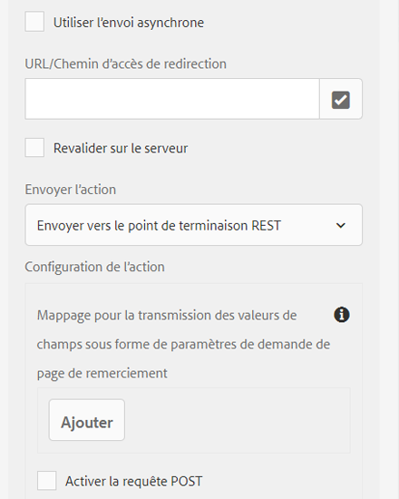
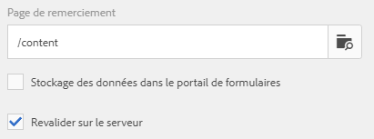

# Action Envoyer pour formulaire adaptatif {#configuring-the-submit-action}

 Adobe recommande d’utiliser les composants principaux pour [ajouter des formulaires adaptatifs à une page AEM Sites](/help/forms/create-or-add-an-adaptive-form-to-aem-sites-page.md) ou [créer des formulaires adaptatifs autonomes](/help/forms/creating-adaptive-form-core-components.md). 

| Version | Lien de l’article |
| -------- | ---------------------------- |
| AEM 6.5 | [Cliquez ici](https://experienceleague.adobe.com/docs/experience-manager-65/forms/adaptive-forms-basic-authoring/configuring-submit-actions.html?lang=fr) |
| AEM as a Cloud Service (composants de base) | [Cliquez ici](/help/forms/configuring-submit-actions.md) |
| AEM as a Cloud Service (composants principaux) | Cet article |

Une action Soumettre vous permet de choisir la destination des données capturées via un formulaire adaptatif. Il est déclenché lorsqu’un utilisateur clique sur le bouton **[!UICONTROL Envoyer]** d’un formulaire adaptatif. Forms as a Cloud Service, pour le Forms adaptatif basé sur les composants principaux, propose un tableau d’actions Envoyer préconfigurées. Ces actions d’envoi prêtes à l’emploi vous permettent de :

* Envoyez facilement des données de formulaire par e-mail.
* Lancez les flux Microsoft® Power Automate ou les workflows AEM lors de la transmission des données.
* Transmettez directement les données de formulaire à Microsoft® SharePoint Server, Microsoft® Azure Blob Storage ou Microsoft® OneDrive.
* Envoyez facilement les données à une source de données configurée à l’aide du modèle de données de formulaire (FDM).
* Envoyez facilement les données à un point d’entrée REST.

Vous pouvez [étendre les actions Envoyer par défaut](custom-submit-action-form.md). Vous pouvez également personnaliser les actions Envoyer pour les besoins spécifiques à l’entreprise.

Pour définir une action Envoyer pour un formulaire adaptatif, utilisez la boîte de dialogue Configurer d’un composant **Conteneur de formulaires adaptatifs**. La boîte de dialogue de configuration d’un composant **Conteneur de formulaires adaptatifs** comprend les éléments suivants :

* Onglet De base
* Onglet Modèle de données de formulaire
* Onglet Envoi

Vous pouvez définir les propriétés du conteneur de formulaires à l’aide de la boîte de dialogue de configuration. Pour en savoir plus sur la boîte de dialogue de configuration d’un composant Conteneur de formulaires, [cliquez ici](https://experienceleague.adobe.com/docs/experience-manager-core-components/using/adaptive-forms/adaptive-forms-components/form-container.html?lang=fr).

## Sélection et configuration d’une action Envoyer pour un formulaire adaptatif {#select-and-configure-submit-action}

Pour sélectionner et configurer une action Envoyer pour votre formulaire :

1. Ouvrez l’explorateur de contenu, puis sélectionnez le composant **[!UICONTROL Conteneur de guide]** de votre formulaire adaptatif.
1. Cliquez sur l’icône des propriétés du conteneur de guide . La fenêtre du conteneur de formulaires adaptatifs s’ouvre.

1. Cliquez sur l’onglet **[!UICONTROL Envoi]**.

   

1. Sélectionnez et configurez une **[!UICONTROL action Envoyer]** en fonction de vos besoins.

Vous pouvez également configurer différentes actions pour les envois de formulaires adaptatifs.
* **URL/chemin de redirection** - Cette option permet à l’utilisateur ou à l’utilisatrice de configurer une page pour chaque formulaire, vers laquelle les utilisateurs et utilisatrices du formulaire sont redirigés après l’envoi d’un formulaire adaptatif.
* **Afficher le message** - Cette option permet aux utilisateurs et utilisatrices d’ajouter un message qui s’affiche lorsque le formulaire adaptatif est envoyé avec succès. Le texte prédéfini est inclus dans la boîte de dialogue et peut être modifié par l’utilisateur ou l’utilisatrice.

Pour plus d’informations sur les actions Envoyer suivantes, voir :

* [Envoyer un e-mail](/help/forms/configure-submit-action-send-email.md)
* [Appeler un flux Power Automate](/help/forms/forms-microsoft-power-automate-integration.md)
* [Envoyer à SharePoint](/help/forms/configure-submit-action-sharepoint.md)
* [Appeler une Workfront Fusion](/help/forms/submit-adaptive-form-to-workfront-fusion.md)
* [Envoyer à l’aide du modèle de données de formulaire (FDM)](/help/forms/using-form-data-model.md)
* [Envoyer au stockage Blob Azure](/help/forms/configure-submit-action-azure-blob-storage.md)
* [Envoyer vers le point d’entrée REST](/help/forms/configure-submit-action-restpoint.md)
* [Envoyer à OneDrive](/help/forms/configure-submit-action-onedrive.md)
* [Appeler un workflow AEM](/help/forms/configure-submit-action-workflow.md)
* [Envoyer à Marketo Engage](/help/forms/submit-adaptive-form-to-marketo-engage.md)

Vous pouvez également envoyer un formulaire adaptatif à d’autres configurations de stockage :

* [Connecter un formulaire adaptatif à l’application Salesforce](/help/forms/aem-forms-salesforce-integration.md)
* [Connecter un formulaire adaptatif à Microsoft](/help/forms/ms-dynamics-odata-configuration.md)
* [Connecter un formulaire adaptatif à Adobe Marketo Engage](/help/forms/integrate-form-to-marketo-engage.md)

Vous pouvez [personnaliser les actions Envoyer par défaut](custom-submit-action-form.md). De plus, vous pouvez personnaliser les actions Envoyer pour vous aligner sur les exigences spécifiques de l’entreprise.

<!--
## Send Email {#send-email}

To send an email to one or more recipients upon successful submission of the form, you can use the **[!UICONTROL Send Email]** Submit Action. 

Refer to [configure the send email submit action for an Adaptive Form](/help/forms/configure-submit-action-send-email.md) to learn how to set up an Adaptive Form to send an email upon successful submission.
[!NOTE]
>
>Send PDF via Email Submit Action is applicable only to Adaptive Forms that use XFA template as form model. 

>[!NOTE]
>
>Ensure that the [AEM_Installation_Directory]\crx-quickstart\temp\datamanager\ASM folder
>exists. The directory is required to temporarily store attachments. If the directory does not exist, create it.

>[!CAUTION]
>
>If you  [prefill](prepopulate-adaptive-form-fields.md) a form template,  a Form Data Model (FDM) or schema based Adaptive Form with XML or JSON data complaint to a schema (XML schema, JSON schema , form template, or form data model (FDM)) that is data does not contain &lt;afData&gt;, &lt;afBoundData&gt;, and &lt;/afUnboundData&gt; tags, then the data of unbounded fields (Unbounded fields are Adaptive Form fields without [bindref](prepopulate-adaptive-form-fields.md) property) of the Adaptive Form is lost. 

>[!CAUTION]
>
>If you [prefill](prepopulate-adaptive-form-fields.md) a form template, a Form Data Model (FDM) or schema based Adaptive Form with XML or JSON data complaint to a schema (XML schema, JSON schema, or form data model(FDM)) that does not contain &lt;afData&gt;, &lt;afBoundData&gt;, and &lt;/afUnboundData&gt; tags, then the data of unbounded fields (Unbounded fields are Adaptive Form fields without [bindref](prepopulate-adaptive-form-fields.md) property) of the Adaptive Form is lost.

## Submit to Microsoft&reg; SharePoint {#submit-to-sharedrive}

The **[!UICONTROL Submit to SharePoint]** Submit Action connects an Adaptive Form with a Microsoft&reg; SharePoint Storage. You can submit the form data files, attachments, or Document of Record to the connected Microsoft&reg; Sharepoint Storage. 

Integration of AEM Adaptive Form with Microsoft&reg; SharePoint enables the submission, retrieval, or storage of data, files, and other relevant information within the SharePoint storage. To learn how to configure submit to SharePoint submit action for an Adaptive Form, [click here](/help/forms/configure-submit-action-sharepoint.md). 

## Submit using Form Data Model (FDM) {#submit-using-form-data-model}

The **[!UICONTROL Submit using Form Data Model (FDM)]** Submit Action writes submitted Adaptive Form data for the specified data model object in a Form Data Model (FDM) to its data source. When configuring the Submit Action, you can choose a data model object whose submitted data you want to write back to its data source.

When a user submits a form based on a form data model (FDM), you can [configure the form to write the submitted data to the data sources associated with the data model object](/help/forms/using-form-data-model.md#write-submitted-adaptive-form-data-into-data-sources-write-af).

## Submit to REST endpoint {#submit-to-rest-endpoint}

The **[!UICONTROL Submit to REST Endpoint]** submit action sends the submitted data to a REST URL. This URL can be either an internal server (the server where the form is displayed) or an external server. The data of an Adaptive Form is submitted to a REST URL using the **[!UICONTROL Submit to REST endpoint]** Submit Action.

For a comprehensive guide on the detailed steps to post or submit data to a REST URL, refer to [configure submit to REST Endpoint submit action for Adaptive Forms](/help/forms/configure-submit-action-restpoint.md).

## Invoke an AEM Workflow {#invoke-an-aem-workflow}

The **[!UICONTROL Invoke an AEM Workflow]** Submit Action integrates an Adaptive Form with an [AEM Workflow](https://experienceleague.adobe.com/docs/experience-manager-65/developing/extending-aem/extending-workflows/workflows-models.html?lang=fr#extending-aem). When a form is submitted, the selected workflow starts automatically. 

 [Integrate AEM Adaptive Form with AEM Workflow: Streamlining Business Processes](/help/forms/configure-submit-action-workflow.md) provides step-by-step instructions to seamlessly integrate AEM Workflow with Adaptive Forms, optimizing business processes and enhancing workflow automation.

## Submit to OneDrive {#submit-to-onedrive}

The **[!UICONTROL Submit to OneDrive]** Submit Action connects an Adaptive Form with a Microsoft&reg; OneDrive. You can submit the form data, files, attachments, or Document of Record to the connected Microsoft&reg; OneDrive Storage. 

AEM Forms Cloud Service with Microsoft&reg; OneDrive helps in optimize data submission. Explore the steps of [integrating OneDrive with AEM Forms](/help/forms/configure-submit-action-onedrive.md) for streamlined and secure storage.

## Submit to Azure Blob Storage {#submit-to-azure-blob-storage}

The **[!UICONTROL Submit to Azure Blob Storage]** Submit Action connects an Adaptive Form with a Microsoft&reg; Azure portal and allows you to submit various elements such as form data, files, attachments, or Document of Record to the associated Azure Storage containers.

AEM as a Cloud Service allows submitting data to Azure Storage from AEM Adaptive Forms. Learn how to [create and use Azure Blob Storage configuration in AEM Forms](/help/forms/configure-submit-action-azure-blob-storage.md) for efficient data storage. 

To set values of a configuration, [Generate OSGi Configurations using the AEM SDK](https://experienceleague.adobe.com/docs/experience-manager-cloud-service/implementing/deploying/configuring-osgi.html?lang=fr#generating-osgi-configurations-using-the-aem-sdk-quickstart), and [deploy the configuration](https://experienceleague.adobe.com/docs/experience-manager-cloud-service/implementing/using-cloud-manager/deploy-code.html?lang=fr#deployment-process) to your Cloud Service instance.

## Submit to Power Automate {#microsoft-power-automate}

You can configure an Adaptive Form to run a Microsoft&reg; Power Automate Cloud Flow on submission. The configured Adaptive Form sends captured data, attachments, and Document Of Record to Power Automate Cloud Flow for processing. It helps you build custom data capture experience while harnessing the power of Microsoft&reg; Power Automate to build business logics around captured data and automate customer workflows. 
Adaptive Forms editor provides the **Invoke a Microsoft&reg; Power Automate flow** submit action to send adaptive forms data, attachments, and Document Of Record to Power Automate Cloud Flow. To use the Submit action to send captured data to Microsoft&reg; Power Automate, [Connect your Forms as a Cloud Service instance with Microsoft&reg; Power Automate](forms-microsoft-power-automate-integration.md)  

After a successful configuration, use the [Invoke a Microsoft&reg; Power Automate flow](forms-microsoft-power-automate-integration.md#use-the-invoke-a-microsoft&reg;-power-automate-flow-submit-action-to-send-data-to-a-power-automate-flow-use-the-invoke-microsoft-power-automate-flow-submit-action) submit action to send data to a Power Automate Flow.  

## Submit to Workfront Fusion {#workfront-fusion}

You can configure an Adaptive Form to submit data to Workfront Fusion on submission. Workfront Fusion allows automation of processes so that user can concentrate on new tasks rather than repeating the same tasks again and again. It automates both simple and complex tasks, saving time and ensuring consistent process execution.

The Adaptive Forms editor provides the **Invoke a WorkFront Fusion Scenario** submit action to send Adaptive Forms data or attachments to a Workfront Fusion scenario. To use the submit action for sending captured data to a Workfront Fusion scenario, refer to [Submit an Adaptive Form to Adobe Workfront Fusion](/help/forms/submit-adaptive-form-to-workfront-fusion.md).

## Send PDF via Email {#send-pdf-via-email}

The **Send PDF via Email** Submit Action sends an email with a PDF containing form data, to one or more recipients on successful submission of the form.

>[!NOTE]
>
>This Submit Action is available for XFA-based Adaptive Forms and XSD-based adaption forms that have the Document of Record template. 
## Invoke a forms workflow {#invoke-a-forms-workflow}

The **Submit to Forms workflow** submit option sends a data xml and file attachments (if any) to an existing Adobe LiveCycle or [!DNL AEM Forms] on JEE process.

For information about how to configure the Submit to forms workflow Submit Action, see [Submitting and processing your form data using forms workflows](submit-form-data-livecycle-process.md). 
## Forms Portal Submit Action {#forms-portal-submit-action}

The **Forms Portal Submit Action** option makes form data available through an [!DNL AEM Forms] portal.

For more information about the Forms Portal and Submit Action, see [Drafts and submissions component](draft-submission-component.md). 

## Use synchronous or asynchronous submission {#use-synchronous-or-asynchronous-submission}

A Submit Action can use synchronous or asynchronous submission.

**Synchronous submission**: Traditionally, web forms are configured to submit synchronously. In a synchronous submission, when users submit a form, they are redirected to an acknowledgment page, a thank you page, or if there is submission failure, an error page. You can select the **[!UICONTROL Use asynchronous submission]** option to redirect the users to a webpage or show a message on submission.  

**Asynchronous submission**: Modern web experiences like single page applications are gaining popularity where the web page remains static while client-server interaction happens in the background. You can now provide this experience with Adaptive Forms by [configuring asynchronous submission](asynchronous-submissions-adaptive-forms.md).

## Server-Side Revalidation in Adaptive Form {#server-side-revalidation-in-adaptive-form}

Typically, in any online data capture system, developers place someJavaScript validations on client side to enforce a few business rules. But in modern browsers, end users have way to bypass those validations and manually do submissions using various techniques, Such as Web Browser DevTools Console. Such techniques are also valid for Adaptive Forms. A forms developer can create various validation logics, but technically, end users can bypass those validation logics and submit invalid data to the server. Invalid data would break the business rules that a form author has enforced.

The server-side revalidation feature provides the ability to run the validations that an Adaptive Forms author has provided while designing an Adaptive Form on the server. It prevents any possible compromise of data submissions and business rules violations represented in terms of form validations.

### What to validate on Server? {#what-to-validate-on-server-br}

All out of the box (OOTB) field validations of an Adaptive Form that are rerun at the server are:

* Required
* Validation Picture Clause
* Validation Expression

### Enabling Server-side Validation {#enabling-server-side-validation-br}

Use the **[!UICONTROL Revalidate on server]** under Adaptive Form Container in the sidebar to enable or disable server-side validation for the current form.

Enabling Server-Side Validation

If end-user bypass those validations and submit the forms, the server again performs the validation. If the validation fails at server end, then the submit transaction is stopped. The user is presented with the original form again. The captured data and submitted data are presented to the user as an error.

>[!NOTE]
>
>Server-side validation validates the form model. You are recommended to create a separate client library for validations and not mix it with other things like HTML styling and DOM manipulation in the same client library.
-->

## Gérer les erreurs sur l’action d’envoi {#error-handling-on-submit-action}

Dans le cadre de la sécurité AEM et des conseils de renforcement, configurez les pages d’erreur personnalisées telles que 400.jsp, 404.jsp et 500.jsp. Ces gestionnaires sont appelés lorsque les erreurs 400, 404 ou 500 s’affichent au moment d’envoyer un formulaire. Les gestionnaires sont également appelés lorsque ces codes d’erreur sont déclenchés sur le nœud de publication. Vous pouvez également créer des pages JSP pour d’autres codes d’erreur HTTP.

Lorsque vous préremplissez un modèle de données de formulaire (FDM) ou un formulaire adaptatif basé sur un schéma avec des données XML ou JSON conformes à un schéma, ce qui signifie que les données ne contiennent pas de balises `<afData>`, `<afBoundData>` et `</afUnboundData>`, les données des champs non liés du formulaire adaptatif sont perdues. Le schéma peut être un schéma XML, un schéma JSON ou un modèle de données de formulaire (FDM). Les champs non liés sont des champs de formulaire adaptatif sans la propriété `bindref`.

<!-- For more information, see [Customizing Pages shown by the Error Handler](/help/sites-developing/customizing-errorhandler-pages.md). -->

<!--
## See next

* [Create style or themes for your forms](using-themes-in-core-components.md)
* [Create an Adaptive Form (core components)](/help/forms/creating-adaptive-form-core-components.md)
* [Create a custom Submit Action for Adaptive Forms](/help/forms/custom-submit-action-form.md)

-->

## Voir également {#see-also}

{{see-also}}

