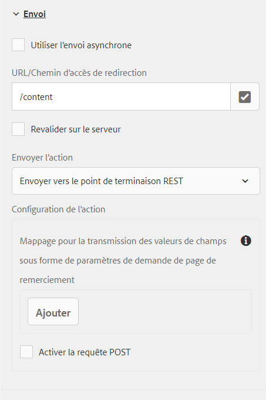

# Configuration d’une page de redirection {#configuring-redirect-page}

| Version | Lien de l’article |
| -------- | ---------------------------- |
| AEM 6.5 | [Cliquez ici](https://experienceleague.adobe.com/docs/experience-manager-65/forms/adaptive-forms-basic-authoring/configuring-redirect-page.html?lang=fr) |
| AEM as a Cloud Service | Cet article |

Pour chaque formulaire, les auteurs peuvent configurer une page vers laquelle les utilisateurs seront redirigés après l’envoi du formulaire.

1. En mode d’édition, sélectionnez un composant, puis cliquez sur  > **[!UICONTROL Conteneur de formulaires adaptatifs]**, puis cliquez sur .

1. Dans la barre latérale, cliquez sur **[!UICONTROL Envoi]**.

1. Indiquez L’URL de la page de redirection sous **[!UICONTROL Page de remerciement]** dans la section **[!UICONTROL Envoi]**.
1. Sous Action Envoyer, vous pouvez éventuellement configurer le paramètre à transmettre à la page de redirection pour l’action Envoyer vers le point d’entrée REST.

   

   Configuration de la page de redirection

Les auteurs et autrices de formulaires peuvent utiliser les paramètres suivants qui sont transmis à la page de remerciement. Les paramètres `status` et `owner` sont transmis pour toutes les actions d’envoi disponibles. Outre ces deux paramètres, d’autres paramètres sont transmis pour les actions d’envoi suivantes :

* **[!UICONTROL Envoyer vers le point d’entrée REST]** : les paramètres ajoutés pour la correspondance entre le champ et le paramètre sont transmis. Les paramètres `status` et `owner` ne sont pas transmis à cette action d’envoi. Pour plus d’informations, voir [Configuration de l’action d’envoi Envoyer vers le point d’entrée REST](configuring-submit-actions.md).

>[!MORELIKETHIS]
>
>* [Configuration d’une page de redirection ou d’un message de remerciement](/help/forms/configure-redirect-page-or-thank-you-message.md)
