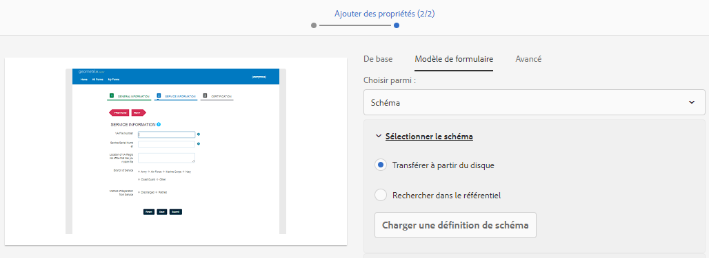
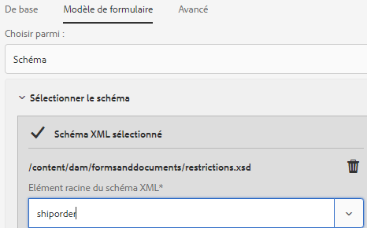

# Guide de prise en main du créateur de formulaires {#creating-an-adaptive-form}

| Version | Lien de l’article |
| -------- | ---------------------------- |
| AEM 6.5 | [Cliquez ici](https://experienceleague.adobe.com/docs/experience-manager-65/forms/adaptive-forms-basic-authoring/creating-adaptive-form.html?lang=fr) |
| AEM as a Cloud Service | Cet article |

Le créateur de formulaires d’AEM Forms vous permet de créer des formulaires attrayants, réactifs, dynamiques et adaptatifs. Que vous soyez un créateur de formulaires qui crée des formulaires professionnels ou que vous ayez besoin de créer rapidement des formulaires réactifs, AEM Forms fournit un assistant convivial. L’assistant offre une navigation rapide par onglets pour sélectionner facilement des modèles, un style, des champs et des options d’envoi préconfigurés.

{width="100%" align="center"}

Avant de commencer, découvrez les types de composants de formulaires disponibles :

* [Composants principaux de formulaires adaptatifs](https://experienceleague.adobe.com/docs/experience-manager-core-components/using/adaptive-forms/introduction.html?lang=fr) : il s’agit de composants de capture de données normalisés. Ces composants offrent des fonctionnalités de personnalisation, un délai de développement réduit et de plus bas coûts de maintenance pour vos expériences d’inscription numérique. Un développeur ou une développeuse peut facilement personnaliser et mettre en forme ces composants. Vous pouvez consulter [https://aemcomponents.dev/](https://aemcomponents.dev/) pour afficher les composants principaux disponibles en action **Adobe recommande d’utiliser ces composants modernes et extensibles pour développer des formulaires adaptatifs**.

* [Composants de base des formulaires adaptatifs](creating-adaptive-form.md) : il s’agit de composants de capture de données classiques (anciens). Vous pouvez continuer à les utiliser pour modifier votre formulaire adaptatif existant basé sur les composants de base. Si vous créez des formulaires, Adobe recommande d’utiliser les [composants principaux de formulaires adaptatifs pour créer des formulaires adaptatifs](#create-an-adaptive-form-core-components).

>[!BEGINTABS]

>[!TAB Création d’un Forms adaptatif avec des composants principaux (recommandé)]

Pour créer un formulaire adaptatif, vous devez disposer des éléments suivants :

* **Activer les composants principaux de Forms adaptative pour votre environnement** : lorsque vous créez un programme, les composants principaux de Forms adaptative sont déjà activés pour votre environnement. Installez la dernière version de pour activer les composants principaux de Forms adaptatif pour votre environnement AEM Cloud Service. Lors de l’activation des composants principaux pour votre environnement, le modèle **Formulaires adaptatifs (composant principal)** et le thème de la zone de travail sont ajoutés à votre environnement. Si votre version du SDK AEM est antérieure à 2023.02.0, [assurez-vous que l’indicateur `prerelease` est activé dans votre environnement](https://experienceleague.adobe.com/docs/experience-manager-cloud-service/content/release-notes/prerelease.html?lang=fr#new-features), car les composants principaux des formulaires adaptatifs faisaient partie de la version préliminaire avant la version 2023.02.0.

* **Modèle de formulaire adaptatif** : un modèle fournit une structure de base et définit l’aspect, c’est-à-dire la mise en page et les styles, d’un formulaire adaptatif. Il comporte des composants pré-formatés contenant certaines propriétés et une certaine structure de contenu. Il fournit également les options permettant de définir un thème et une action d’envoi. Le thème définit l’aspect et l’action d’envoi définit l’action à entreprendre lors de l’envoi d’un formulaire adaptatif. Par exemple, l’envoi des données collectées à une source de données. Le service cloud fournit un modèle prêt à l’emploi, sans nom :

   * Le modèle `blank` est inclus dans chaque nouveau programme AEM Forms as a Cloud Service.
   * Vous pouvez installer le package de référence, via le gestionnaire de modules, pour ajouter le modèle `blank` à votre programme AEM Forms as a Cloud Service.
   * Vous pouvez également [créer un modèle de Forms adaptatif (composants principaux)](template-editor.md) à partir de zéro.

* **Un thème de formulaire adaptatif** : un thème contient des détails de style pour les composants et les panneaux. Ces styles incluent les propriétés telles que les couleurs d’arrière-plan, les couleurs d’état, la transparence, l’alignement et la taille. Lorsque vous appliquez un thème, le style spécifié se reflète sur les composants correspondants.  Le modèle `Canvas` est inclus dans chaque nouveau programme AEM Forms as a Cloud Service.
  <!-- * You can install the reference package, via package manager, to add the `Canvas` template to your AEM Forms as a Cloud Service program.
    * You can also [create an Adaptive Forms theme (Core Components)](template-editor.md) and deploy it to your AEM Forms as a Cloud Service program. -->

* **Autorisations** : ajoutez vos utilisateurs et utilisatrices au groupe [!DNL forms-users]. Les membres du groupe [!DNL forms-users] ont les autorisations de créer un formulaire adaptatif. Pour obtenir une liste détaillée des groupes d’utilisateurs et d’utilisatrices spécifiques aux formulaires, voir [Groupes et autorisations](forms-groups-privileges-tasks.md).

## Créer un formulaire adaptatif {#create-an-adaptive-form-core-components}

1. Connectez-vous à votre instance d’auteur [!DNL Experience Manager Forms]. Il peut s’agir d’une instance cloud ou d’une instance de développement local.

1. Entrez vos informations d’identification dans la page de connexion d’Experience Manager. Une fois connecté, dans le coin supérieur gauche, sélectionnez **[!UICONTROL Adobe Experience Manager]** > **[!UICONTROL Formulaires]** > **[!UICONTROL Formulaires et documents.]**.

1. Sélectionnez **[!UICONTROL Créer]** > **[!UICONTROL Formulaires adaptatifs]**. Cette action permet d’ouvrir l’assistant. Dans l’onglet Source, sélectionnez un modèle :

   {width="100%" align="center"}

   Lorsque vous sélectionnez un modèle, un thème et l’action d’envoi spécifiée dans le modèle sont sélectionnés automatiquement. Le bouton **[!UICONTROL Créer]** est activé. Vous pouvez accéder aux onglets **[!UICONTROL Style]** ou **[!UICONTROL Envoi]** pour sélectionner un autre thème ou une autre action d’envoi. Si le modèle sélectionné ne spécifie pas de thème, le bouton de création reste désactivé. Vous pouvez accéder à l’onglet **[!UICONTROL Styles]** pour sélectionner manuellement un thème.

   >[!NOTE]
   >
   >
   > Si vous n’avez pas le modèle **Formulaires adaptatifs (composant principal)** sur votre environnement, vous devez [activer les composants principaux des formulaires adaptatifs pour votre environnement](setup-local-development-environment.md#enable-adaptive-forms-core-components-for-an-existing-aem-archetype-based-project). Quand vous activez des composants principaux pour votre environnement, le modèle **Formulaires adaptatifs (composant principal)** est ajouté à votre environnement.

1. Dans l’onglet **[!UICONTROL Style]**, sélectionnez un thème :

   * Lorsque le modèle sélectionné spécifie un thème, celui-ci est automatiquement sélectionné dans l’assistant. Vous pouvez également choisir un thème différent dans l’onglet Style.

   * Si le modèle sélectionné ne spécifie aucun thème, vous pouvez utiliser l’onglet Style pour en choisir un. Le bouton **[!UICONTROL Créer]** n’est activé qu’après la sélection d’un thème.

1. (Facultatif) Dans l’onglet Données, sélectionnez un modèle de données :

   * **Modèle de données de formulaire** : un [modèle de données de formulaire (FDM)](data-integration.md) vous permet d’intégrer des entités et des services provenant de sources de données disparates à un formulaire adaptatif. Choisissez le modèle de données de formulaire (FDM) si le formulaire adaptatif que vous créez implique l’extraction et l’écriture de données depuis et vers plusieurs sources de données.

   * **Schéma JSON** : [schéma JSON](adaptive-form-json-schema-form-model.md), notre formulaire adaptatif basé sur les composants principaux, permet une intégration transparente au système back-end de votre entreprise en vous permettant d’associer un schéma JSON, qui représente la structure des données générées ou consommées. Cette association permet aux créateurs et créatrices d’ajouter dynamiquement du contenu au formulaire adaptatif à l’aide des éléments du schéma. Les éléments du schéma sont facilement accessibles dans l’onglet Objets de modèle de données de l’explorateur de contenu au cours du processus de création. Tous les champs sont automatiquement ajoutés à tout formulaire adaptatif créé.

   Par défaut, tous les champs du schéma JSON associé sont automatiquement sélectionnés et convertis en composants de formulaire adaptatif correspondants, ce qui simplifie le processus de création. L’assistant vous permet, en outre, de sélectionner les champs à inclure dans le formulaire adaptatif au moyen de cases à cocher.

1. Dans l’onglet **[!UICONTROL Envoi]**, sélectionnez une action d’envoi :

   * Lorsque vous sélectionnez un modèle, l’action d’envoi spécifiée dans le modèle est sélectionnée automatiquement. Vous pouvez sélectionner une autre action d’envoi dans l’onglet Envoi. L’onglet **[!UICONTROL Envoi]** affiche toutes les actions d’envoi disponibles.

   * Lorsque le modèle sélectionné ne spécifie aucune action d’envoi, vous pouvez utiliser l’onglet **[!UICONTROL Envoi]** pour sélectionner une action d’envoi

1. (Facultatif) Dans l’onglet **[!UICONTROL Diffusion]**, vous pouvez spécifier une date de publication ou de d’annulation de publication pour un formulaire adaptatif.

1. Sélectionnez **[!UICONTROL Créer]**. Une boîte de dialogue pour spécifier le titre, le nom et l’emplacement d’enregistrement du formulaire adaptatif s’affiche :

   * **[!UICONTROL Titre]** Spécifie le nom d’affichage du formulaire. Le titre vous permet d’identifier le formulaire dans l’interface utilisateur [!DNL Experience Manager Forms] d’AEM Forms.
   * **[!UICONTROL Nom :]** indique le nom du formulaire. Un nœud portant le nom spécifié est créé dans le référentiel. Lorsque vous commencez à saisir un titre, la valeur du champ Nom est automatiquement générée. Vous pouvez modifier la valeur suggérée. Le champ Nom ne peut contenir que des caractères alphanumériques, des traits d’union et des traits de soulignement. Toutes les entrées non valides sont remplacées par un trait d’union.
   * **[!UICONTROL Chemin d’accès :]** indique l’emplacement d’enregistrement du formulaire adaptatif. Vous pouvez enregistrer le formulaire adaptatif directement sur `/content/dam/formsanddocuments` ou créer un dossier tel que `/content/dam/formsanddocuments/adaptiveforms` pour enregistrer un formulaire adaptatif. Assurez-vous de créer le dossier avant de l’utiliser dans le chemin d’accès. Le champ **[!UICONTROL Chemin d’accès]** ne crée pas de dossier automatiquement.

1. Sélectionnez **[!UICONTROL Créer]**. Un formulaire adaptatif est créé et s’ouvre dans l’éditeur de formulaires adaptatifs. L’éditeur affiche le contenu disponible dans le modèle.  En fonction du type de formulaire adaptatif, les éléments de formulaire présents dans le schéma JSON <!--XFA form template, XML schema or --> ou le modèle de données de formulaire (FDM) associé sont affichés dans l’onglet **[!UICONTROL Objets de modèle de données]** de l’**[!UICONTROL Explorateur de contenu]** dans la barre latérale.

Vous pouvez maintenant faire glisser et déposer les éléments [Composants principaux de Forms adaptatif](https://experienceleague.adobe.com/docs/experience-manager-core-components/using/adaptive-forms/introduction.html?lang=fr#components) ou de schéma pour créer votre formulaire adaptatif.

## Modification des propriétés du modèle de formulaire d’un formulaire adaptatif {#edit-form-model-core-components-based-adaptive-forms}

1. Sélectionnez le formulaire adaptatif et sélectionnez  > **[!UICONTROL Ouvrir les propriétés]**. La page Propriétés du formulaire s’ouvre.

1. Accédez à l’onglet **[!UICONTROL Modèle de formulaire]** et choisissez un modèle de formulaire. Si le formulaire adaptatif ne dispose pas de modèle de formulaire, vous avez la possibilité de choisir un schéma JSON ou un modèle de données de formulaire (FDM). D’autre part, si le formulaire adaptatif est déjà basé sur un modèle de formulaire, vous avez la possibilité de passer à un autre modèle de formulaire du même type. Par exemple, si le formulaire utilise un schéma JSON, vous pouvez facilement passer à un autre schéma JSON. De même, si le formulaire utilise un modèle de données de formulaire (FDM), vous pouvez passer à un autre modèle de données de formulaire (FDM).

1. Sélectionnez **[!UICONTROL Enregistrer]** pour enregistrer les propriétés.

>[!TAB Créer un Forms adaptatif avec des composants de base]

Pour créer un formulaire adaptatif, vous devez disposer des éléments suivants :

* **Autorisations** : ajoutez vos utilisateurs et utilisatrices à [!DNL forms-users] pour leur fournir les autorisations de création d’un formulaire adaptatif. Pour obtenir une liste détaillée des groupes d’utilisateurs et d’utilisatrices spécifiques aux formulaires, voir [Groupes et autorisations](forms-groups-privileges-tasks.md).

* **Un thème de formulaire adaptatif** : un thème contient des détails de style pour les composants et les panneaux. Ces styles incluent les propriétés telles que les couleurs d’arrière-plan, les couleurs d’état, la transparence, l’alignement et la taille. Lorsque vous appliquez un thème, le style spécifié se reflète sur les composants correspondants. Vous pouvez [&#x200B; créer un thème &#x200B;](themes.md) ou [&#x200B; importer un thème existant](import-export-forms-templates.md#uploading-a-theme). Vous pouvez également déployer l’[archétype le plus récent](https://experienceleague.adobe.com/docs/experience-manager-core-components/using/developing/archetype/using.html?lang=fr#create-project) pour obtenir des exemples de thèmes.

* **Modèle de formulaire adaptatif** : un modèle fournit une structure de base et définit l’aspect, c’est-à-dire la mise en page et les styles, d’un formulaire adaptatif. Il comporte des composants pré-formatés contenant certaines propriétés et une certaine structure de contenu. Il fournit également les options permettant de définir un thème et une action d’envoi. Le thème définit l’aspect et l’action d’envoi définit l’action à entreprendre lors de l’envoi d’un formulaire adaptatif. Par exemple, l’envoi des données collectées à une source de données. Le service cloud prend en charge deux types de modèles :

   * **Modèle modifiable** : vous pouvez [créer un](template-editor.md) ou [importer un modèle modifiable existant](migrate-to-forms-as-a-cloud-service.md). Vous pouvez également déployer l’[archétype le plus récent](https://experienceleague.adobe.com/docs/experience-manager-core-components/using/developing/archetype/using.html?lang=fr#:~:text=L%E2%80%99arch%C3%A9type%20AEM%20est%20constitu%C3%A9,les%20servlets%20et%20les%20filtres%20de%20requ%C3%AAte.%20it.tests%3A%20are%20Java-based%20integration%20tests.) pour obtenir des exemples de modèles modifiables.

   * **Modèle statique** : il s’agit de modèles hérités qui ne sont recommandés que pour les clients effectuant la migration depuis des installations Adobe Managed Services (AMS) et AEM Forms On-Premise (AEM 6.5 Forms ou version antérieure). Ainsi, vous pouvez continuer à tirer profit de votre investissement existant dans les modèles statiques. Lorsque vous créez un formulaire adaptatif, utilisez un modèle modifiable.

## Créer un formulaire adaptatif {#create-an-adaptive-form-foundation-components}

1. Accédez à l’instance de création [!DNL Experience Manager Forms]. Il peut s’agir d’une instance cloud ou d’une instance de développement local.

1. Entrez vos informations d’identification dans la page de connexion d’Experience Manager.

   Une fois connecté, dans le coin supérieur gauche, sélectionnez **[!UICONTROL Adobe Experience Manager]** > **[!UICONTROL Formulaires]** > **[!UICONTROL Formulaires et documents]**.

1. Sélectionnez **[!UICONTROL Créer]** > **[!UICONTROL Formulaires adaptatifs]**. Cette action permet d’ouvrir l’assistant.
1. Dans l’onglet Source, sélectionnez un modèle :

   * La sélection d’un modèle modifiable sélectionne automatiquement un thème et une action d’envoi spécifiés dans le modèle, et le bouton **[!UICONTROL Créer]** est activé. Vous pouvez accéder aux onglets **[!UICONTROL Style]** ou **[!UICONTROL Envoi]** pour sélectionner un autre thème ou une autre action d’envoi. Si le modèle modifiable sélectionné ne spécifie pas de thème, le bouton de création reste désactivé. Vous pouvez accéder à l’onglet **[!UICONTROL Styles]** pour sélectionner manuellement un thème.

     >[!NOTE]
     >
     > Vous pouvez également créer un modèle de [!UICONTROL document d’enregistrement] à l’aide d’un éditeur de formulaires adaptatifs. Pour plus d’informations, voir [Prise en charge des documents d’enregistrement dans l’éditeur de formulaires adaptatifs](/help/forms/generate-document-of-record-for-non-xfa-based-adaptive-forms.md#document-of-record-support-in-adaptive-form-editor-dor-support-in-adaptiveform).

   * Lorsque vous sélectionnez un modèle statique, les options de données, de style, d’envoi, de diffusion et de prévisualisation ne sont pas disponibles. Lorsque vous créez un formulaire adaptatif, il est recommandé d’utiliser un modèle modifiable.

1. Dans l’onglet **[!UICONTROL Style]**, sélectionnez un thème :

   * Lorsque le modèle sélectionné spécifie un thème, celui-ci est automatiquement sélectionné dans l’assistant. Vous pouvez également choisir un thème différent dans l’onglet Style.
   * Si le modèle sélectionné ne spécifie aucun thème, vous pouvez utiliser l’onglet Style pour en choisir un. Le bouton **[!UICONTROL Créer]** n’est activé qu’après la sélection d’un thème.

1. (Facultatif) Dans l’onglet **[!UICONTROL Données]**, sélectionnez un modèle de données :

   * **Modèle de données de formulaire** : un [modèle de données de formulaire (FDM)](data-integration.md) vous permet d’intégrer des entités et des services provenant de sources de données disparates à un formulaire adaptatif. Choisissez le modèle de données de formulaire (FDM) si le formulaire adaptatif que vous créez implique l’extraction et l’écriture de données depuis et vers plusieurs sources de données.

   * **Schéma JSON** : [le schéma JSON](adaptive-form-json-schema-form-model.md) représente la structure dans laquelle les données sont générées ou utilisées par le système back-end de votre organisation. Vous pouvez associer le schéma à un formulaire adaptatif et utiliser ses éléments pour ajouter du contenu dynamique à un formulaire adaptatif. Les éléments du schéma peuvent être utilisés dans l’onglet Objets de modèle de données de l’explorateur de contenu lors de la création d’un Forms adaptatif et tous les champs sont également ajoutés au formulaire adaptatif créé.

   Par défaut, tous les champs du modèle de données sont sélectionnés. Lorsque vous créez le formulaire adaptatif, tous les champs de modèle de données sélectionnés sont convertis en composants de formulaire adaptatif correspondants. L’assistant vous fournit des cases à cocher pour sélectionner uniquement les champs qui doivent être inclus dans le formulaire adaptatif.

   <!-- 
   
   If your JSON schema contains a fragment, the fragment is considered a single unit. You can select or deselect a complete fragment and all the fields of the fragment are selected or deselected accordingly. 
   
   -->

1. Dans l’onglet **[!UICONTROL Envoi]**, sélectionnez une action d’envoi :

   * Lorsque vous sélectionnez un modèle, l’action d’envoi spécifiée dans le modèle est sélectionnée automatiquement. Vous pouvez sélectionner une autre action d’envoi dans l’onglet Envoi. L’onglet **[!UICONTROL Envoi]** affiche toutes les actions d’envoi disponibles.

   * Lorsque le modèle sélectionné ne spécifie aucune action d’envoi, vous pouvez utiliser l’onglet **[!UICONTROL Envoi]** pour sélectionner une action d’envoi

1. (Facultatif) Dans l’onglet Diffusion, vous pouvez spécifier une date de publication ou de dépublication pour un formulaire adaptatif.

1. Sélectionnez **[!UICONTROL Créer]**. Une boîte de dialogue pour spécifier le titre, le nom et l’emplacement d’enregistrement du formulaire adaptatif s’affiche :

   * **[!UICONTROL Titre]** Spécifie le nom d’affichage du formulaire. Le titre vous permet d’identifier le formulaire dans l’interface utilisateur [!DNL Experience Manager Forms] d’AEM Forms.
   * **[!UICONTROL Nom :]** indique le nom du formulaire. Un nœud portant le nom spécifié est créé dans le référentiel. Lorsque vous commencez à saisir un titre, la valeur du champ Nom est automatiquement générée. Vous pouvez modifier la valeur suggérée. Le champ Nom ne peut contenir que des caractères alphanumériques, des traits d’union et des traits de soulignement. Toutes les entrées non valides sont remplacées par un trait d’union.
   * **[!UICONTROL Chemin d’accès :]** indique l’emplacement d’enregistrement du formulaire adaptatif. Vous pouvez enregistrer le formulaire adaptatif directement sur `/content/dam/formsanddocuments` ou créer un dossier tel que `/content/dam/formsanddocuments/adaptiveforms` pour enregistrer un formulaire adaptatif. Assurez-vous de créer le dossier avant de l’utiliser dans le chemin d’accès. Le champ **[!UICONTROL Chemin d’accès]** ne crée pas de dossier automatiquement.

1. Sélectionnez **[!UICONTROL Créer]**. Un formulaire adaptatif est créé et s’ouvre dans l’éditeur de formulaires adaptatifs. L’éditeur affiche le contenu disponible dans le modèle. Elle affiche également la barre latérale permettant de personnaliser le formulaire créé en fonction des besoins.

   En fonction du type de formulaire adaptatif, les éléments de formulaire présents dans le schéma JSON <!--XFA form template, XML schema or --> ou le modèle de données de formulaire (FDM) associé sont affichés dans l’onglet **[!UICONTROL Objets de modèle de données]** de l’**[!UICONTROL Explorateur de contenu]** dans la barre latérale. Vous pouvez également faire glisser ces éléments pour créer votre formulaire adaptatif.

<!-- ## Create an Adaptive Form based on a Form Data Model {#fdm}

[Data integration](data-integration.md) lets you integrate multiple data sources and bring their entities and services together to create a form data model. It is an extension of JSON schema. You can use a Form Data Model to create an Adaptive Form. The entities or data model objects configured in a Form Data Model are available as data model objects for form authoring. They are bound to respective data sources and used to prefill a form and write submitted data back to the respective data sources. You can also call services configured in a Form Data Model using Adaptive Form rules.

To use a Form Data Model for creating an Adaptive Form:

1. In Form Model tab on Add Properties screen, select **[!UICONTROL Form Data Model]** in the **[!UICONTROL Select From]** drop-down list.

   

1. Select to expand **[!UICONTROL Select Form Data Model]**. All available form data models are listed.Select a from data model.

>[!NOTE]
>
>You can also change the Form Data Model for an Adaptive Form. For detailed steps, see [Edit Form Model properties of an Adaptive Form](#edit-form-model).

## Create an adaptive form based on XML or JSON schema {#create-an-adaptive-form-based-on-xml-or-json-schema}

XML and JSON schemas represent the structure in which data is produced or consumed by the back-end system in your organization. You can associate a schema to an Adaptive Form and use its elements to add dynamic content to the Adaptive Form. The elements of the schema are available in the Data Model Object tab of the content browser for authoring Adaptive Forms. You can drag-drop the schema elements to build the form.

See the following documents to understand how to design XML or JSON schema for authoring Adaptive Forms.

* [Creating Adaptive Forms using XML schema](adaptive-form-xml-schema-form-model.md)
* [Creating Adaptive Forms using JSON schema](adaptive-form-json-schema-form-model.md)

Do the following to use XML or JSON schema as form model for an Adaptive Form:

1. On the **[!UICONTROL Add Properties]** step of Adaptive Form creation page, select on the **[!UICONTROL Form Model]** tab.
1. In the Form Model tab, select **[!UICONTROL Schema]** from the **[!UICONTROL Select From]** drop-down field.

1. Select **[!UICONTROL Select Schema]** and do one of the following:

    * **[!UICONTROL Upload from disk]** - Select this option and select Upload Schema Definition to browse and upload an XML schema or JSON schema from your file system. The uploaded schema file resides with the form and is not accessible to other Adaptive Forms.
    * **[!UICONTROL Search in repository]** - Select this option to select from the list of schema definition files available in the repository. Select the XML or JSON schema file as form model. The selected schema is associated with the form by reference and is accessible for use in other Adaptive Forms.

      Ensure that the JSON schema filename ends with **.schema.json**. For example: mySchema.schema.json

   
**Figure:** *Selecting XML or JSON schema*

1. (For XML schema only) After you select or upload an XML Schema, specify a root element of the selected XSD file to map with the Adaptive Form.

   
**Figure:** *Selecting XSD root element*

>[!NOTE]
>
>You can also change the schema for an Adaptive Form. For detailed steps, see [Edit Form Model properties of an Adaptive Form](#edit-form-model2). -->

## Modification des propriétés du modèle de formulaire d’un formulaire adaptatif {#edit-form-model-foundation-components}

Vous pouvez modifier le modèle d’un formulaire adaptatif (basé sur JSON ou modèle de données de formulaire (FDM)). Vous ne pouvez pas passer d’un modèle de formulaire à un autre.

1. Sélectionnez le formulaire adaptatif et sélectionnez l’icône **Propriétés**.
1. Ouvrez l’onglet **[!UICONTROL Modèle de formulaire]** et effectuez l’une des actions suivantes.

   * Si le formulaire adaptatif ne dispose pas de modèle de formulaire, vous pouvez choisir un autre modèle de formulaire et, en conséquence, sélectionner <!-- a form template, --> schéma XML ou JSON ou un modèle de données de formulaire (FDM).
   * Si le formulaire adaptatif est basé sur un modèle de formulaire, vous pouvez choisir un autre schéma XML ou JSON <!-- form template, -->, ou un autre modèle de données de formulaire (FDM) pour le même modèle de formulaire.

1. Sélectionnez **[!UICONTROL Enregistrer]** pour enregistrer les propriétés.

Vous pouvez également modifier les propriétés du modèle de formulaire à partir du créateur de formulaires adaptatifs ou du créateur de modèles de formulaires adaptatifs.

1. Sélectionnez le composant **[!UICONTROL Conteneur de formulaires adaptatifs (racine)]**.
1. Cliquez sur l’ pour ouvrir les **[!UICONTROL Propriétés]** du conteneur de formulaires adaptatifs.
1. Sélectionnez l’onglet **[!UICONTROL Modèle de données]** et effectuez l’une des actions suivantes :

   * Si le formulaire adaptatif ne dispose pas de modèle de formulaire, vous pouvez choisir un modèle de formulaire et, en conséquence, sélectionner <!-- a form template, --> schéma XML ou JSON ou un modèle de données de formulaire (FDM).
   * Si le formulaire adaptatif est basé sur un modèle de formulaire, vous ne pouvez pas modifier le modèle de formulaire. Vous pouvez choisir un autre schéma XML ou JSON <!-- form template, --> ou un autre modèle de données de formulaire (FDM) pour le même modèle de formulaire, selon le cas.
1. Sélectionnez  pour enregistrer les propriétés.

{width="100%" align="center"}

>[!NOTE]
>
> Vous pouvez également enregistrer un formulaire adaptatif en tant que modèle. Pour plus d’informations, consultez [Créer un modèle à l’aide d’un formulaire adaptatif](/help/forms/template-editor.md#saving-an-adaptive-form-as-template-saving-adaptive-form-as-template).

>[!ENDTABS]

## Étapes suivantes

* [Utilisation d’Adobe Sign avec Forms](working-with-adobe-sign.md)
* [Utilisation de Google reCaptcha dans avec Forms](captcha-adaptive-forms.md)
* [Ajout d’une section répétable à un formulaire](create-forms-repeatable-sections.md)
* [Pré-remplir les champs d’un formulaire](prepopulate-adaptive-form-fields.md)

>[!MORELIKETHIS]
>
>* [Créer un formulaire adaptatif](/help/forms/creating-adaptive-form-core-components.md)
