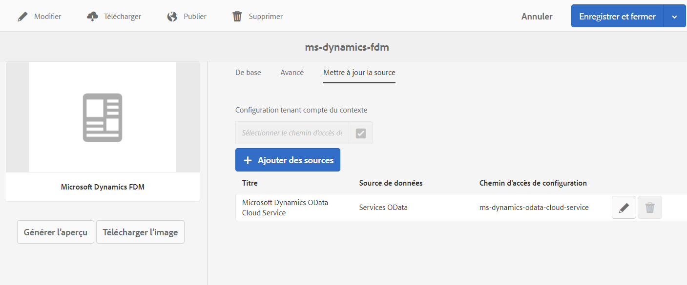

# Créer un modèle de données de formulaire {#create-form-data-model}

| Version | Lien de l’article |
| -------- | ---------------------------- |
| AEM 6.5 | [Cliquez ici](https://experienceleague.adobe.com/docs/experience-manager-65/forms/form-data-model/create-form-data-models.html?lang=fr) |
| AEM as a Cloud Service | Cet article |

L’intégration de données [!DNL Experience Manager Forms] fournit une interface utilisateur intuitive permettant de créer et d’utiliser des modèles de données de formulaire. Un modèle de données de formulaire se base sur les sources de données pour l’échange des données ; toutefois, vous pouvez créer un modèle de données de formulaire avec ou sans source de données. Il existe deux approches de création d’un modèle de données de formulaire, selon que vous avez ou non configuré les sources de données :

* **Utilisation de sources de données préconfigurées** : si vous avez configuré les sources de données comme décrit dans [Configurer les sources de données](configure-data-sources.md), vous pouvez les sélectionner lors de la création d’un modèle de données de formulaire. Elle apporte tous les objets, propriétés et services de modèle de données des sources de données sélectionnées, disponibles dans le modèle de données de formulaire.

* **Sans sources de données**: Si vous n’avez pas configuré de sources de données pour votre modèle de données de formulaire, vous pouvez tout de même le créer sans sources de données. Vous pouvez utiliser le modèle de données de formulaire pour créer des formulaires adaptatifs <!--and interactive communication--> et les tester à l’aide des exemples de données. Lorsque des sources de données sont disponibles, vous pouvez lier le modèle de données de formulaire à des sources de données, ce qui se reflète automatiquement dans les formulaires adaptatifs associés<!--and interactive communications-->.

>[!NOTE]
>
>Vous devez être membre des deux groupes **fdm-author** et **forms-user** pour pouvoir créer et utiliser le modèle de données de formulaire. Contactez votre administrateur [!DNL Experience Manager] pour devenir membre des groupes.

## Création d’un modèle de données de formulaire {#data-sources}

Assurez-vous d’avoir configuré les sources de données que vous avez l’intention d’utiliser dans le modèle de formulaire de données, comme décrit dans [Configurer les sources de données](configure-data-sources.md). Pour créer un modèle de données de formulaire basé sur des sources de données configurées, procédez comme suit :

1. Dans l’instance d’auteur [!DNL Experience Manager], accédez à **[!UICONTROL Formulaires > Intégrations de données]**.
1. Appuyez sur **[!UICONTROL Créer > Modèle de données de formulaire]**.
1. Dans la boîte de dialogue Créer un modèle de données de formulaire :

   * Spécifiez un nom pour le modèle de données de formulaire.
   * (**Facultatif**) Spécifiez le titre, la description et les balises du modèle de données de formulaire.
   * (**Facultatif et applicable uniquement si les sources de données sont configurées**) Appuyez sur l’icône en forme de coche en regard de l’option **[!UICONTROL Configuration des sources de données]** et sélectionnez le noeud de configuration où résident les services cloud pour les sources de données que vous souhaitez utiliser. Elle limite la liste des sources de données disponibles pour sélection sur la page suivante à celles disponibles dans le noeud de configuration sélectionné. Cependant, toutes les sources de données des profils d’utilisateurs [!DNL Experience Manager] sont répertoriées par défaut. Si vous ne sélectionnez pas de noeud de configuration, les sources de données de tous les noeuds de configuration sont répertoriées.

1. Appuyez sur **[!UICONTROL Suivant]**.

1. (**Applicable uniquement si les sources de données sont configurées**) **[!UICONTROL Sélectionner la source de données]** répertorie les sources de données disponibles, le cas échéant ; Sélectionnez les sources de données à utiliser dans le modèle de données de formulaire.
1. Appuyez sur **[!UICONTROL Créer]** et, dans la boîte de dialogue de confirmation, appuyez sur **[!UICONTROL Ouvrir]** pour lancer l’éditeur de modèle de données de formulaire.

   Passons en revue les différents composants de l’interface utilisateur de l’éditeur de modèle de données de formulaire.

   ![Modèle de données de formulaire avec trois sources de données : un service RESTful, un profil utilisateur [!DNL Experience Manager] et un système RDBMS](assets/fdm-ui.png)

   A. **[!UICONTROL Sources de données]** Répertorie les sources de données dans un modèle de données de formulaire. Développez une source de données pour afficher ses objets et services de modèle de données.

   B. **[!UICONTROL Actualiser les définitions de sources de données]** Récupère tous les changements dans les définitions de sources de données à partir des sources de données configurées et les met à jour dans l’onglet Sources de données de l’éditeur de modèle de données de formulaire.

   C. **[!UICONTROL Modèle]** Zone de contenu dans laquelle les objets de modèle de données ajoutés apparaissent.

   D. **[!UICONTROL Services]** Zone de contenu dans laquelle les opérations ou services de source de données ajoutés s’affichent.

   E. **[!UICONTROL Barre d’outils]** Outils pour l’utilisation d’un modèle de données de formulaire. La barre d’outils affiche plus d’options en fonction de l’objet sélectionné dans le modèle de données de formulaire.

   F. **[!UICONTROL Ajouter la sélection]** Ajoute les objets et les services de modèle de données sélectionnés au modèle de données de formulaire.

Pour plus d’informations sur l’éditeur de modèle de données de formulaire et sur son utilisation en vue de la modification et de la configuration du modèle de données de formulaire, voir [Utilisation d’un modèle de données de formulaire](work-with-form-data-model.md).

## Mise à jour des sources de données {#update}

Pour ajouter ou mettre à jour des sources de données dans un modèle de données de formulaire existant, procédez comme suit.

1. Accédez à **[!UICONTROL Formulaires > Intégrations de données]**, sélectionnez le modèle de données de formulaire dans lequel vous souhaitez ajouter ou mettre à jour des sources de données et appuyez sur **[!UICONTROL Propriétés]**.
1. Dans les propriétés du modèle de données de formulaire, accédez à l’onglet **[!UICONTROL Mettre à jour la source]**.

   Dans l’onglet **[!UICONTROL Mettre à jour la source]** :

   * Appuyez sur l’icône de navigation dans le champ **[!UICONTROL Configuration tenant compte du contexte]** et sélectionnez un nœud de configuration où se trouve la configuration cloud de la source de données que vous voulez utiliser. Si vous ne sélectionnez pas de nœud, les configurations cloud qui se trouvent uniquement dans le nœud `global` sont répertoriées lorsque vous appuyez sur **[!UICONTROL Ajouter des sources]**.

   * Pour ajouter une nouvelle source de données, appuyez sur **[!UICONTROL Ajouter des sources]** et sélectionnez les sources de données à ajouter au modèle de données de formulaire. Toutes les sources de données configurées en `global` et le nœud de configuration sélectionné, le cas échéant, s’affichent.

   * Pour remplacer une source de données existante par une autre source de données du même type, appuyez sur l’icône **[!UICONTROL Modifier]** de la source de données et sélectionnez-en une dans la liste des sources de données disponibles.
   * Pour supprimer une source de données existante, appuyez sur l’icône **[!UICONTROL Supprimer]** de la source de données. L’icône Supprimer est désactivée si un objet de modèle de données dans la source de données est ajouté au modèle de données de formulaire.

     

1. Appuyez sur **[!UICONTROL Enregistrer et fermer]** pour enregistrer les mises à jour.

>[!NOTE]
>
>Lorsque vous ajoutez de nouvelles sources de données ou que vous mettez à jour les sources de données existantes dans un modèle de données de formulaire, assurez-vous de mettre à jour les références de liaison, le cas échéant, dans les formulaires adaptatifs<!--and interactive communications--> qui utilisent le modèle de données de formulaire mis à jour.

## Configurations basées sur le contexte pour des modes d’exécution spécifiques {#runmode-specific-context-aware-config}

Le [!UICONTROL Modèle de données de formulaire] utilise des [configurations basées sur le contexte Sling](https://experienceleague.adobe.com/docs/experience-manager-core-components/using/developing/context-aware-configs.html?lang=fr) pour prendre en charge différents paramètres de source de données afin de se connecter à des sources de données pour différents modes d’exécution d’[!DNL Experience Manager].

Lorsque le [!UICONTROL modèle de données de formulaire] utilise les configurations cloud pour stocker les paramètres qui, lorsqu’ils sont archivés et déployés par le biais du contrôle de code source (référentiel GIT Cloud-Manager), créent une configuration cloud avec les mêmes paramètres pour tous les modes d’exécution (développement, évaluation et production). Toutefois, pour les cas d’utilisation où des jeux de données différents sont nécessaires pour les environnements d’évaluation et de production, nous utilisons des paramètres de source de données (par exemple, l’URL de la source de données) pour différents modes d’exécution d’[!DNL Experience Manager].

Pour ce faire, vous devez créer une configuration OSGi contenant des paires paramètres-valeur de source de données. Cette option remplace la même paire de la configuration cloud du [!UICONTROL modèle de données de formulaire] au moment de l’exécution. Comme les configurations OSGi prennent en charge ces modes d’exécution par défaut, vous pouvez remplacer un paramètre de source de données par des valeurs différentes en fonction du mode d’exécution.

Pour activer les configurations cloud spécifiques au déploiement dans le [!UICONTROL modèle de données de formulaire] :

1. créez une configuration cloud sur l’instance de développement locale. Pour obtenir des instructions détaillées, consultez [Comment configurer des sources de données](/help/forms/configure-data-sources.md).

1. Stockez votre configuration cloud sur le système de fichiers.
   1. Créez un package avec le filtre `/conf/{foldername}/settings/cloudconfigs/fdm`. Utilisez le même `{foldername}` que dans l’étape 1. Et remplacez `fdm` par `azurestorage` pour la configuration du stockage Azure.
   1. Générez et téléchargez le package. Pour plus d’informations, consultez les [actions de package](/help/implementing/developing/tools/package-manager.md).

1. Intégration de la configuration cloud dans le projet d’archétype d’[!DNL Experience Manager].
   1. Décompressez le package téléchargé.
   1. Copiez le dossier `jcr_root` et placez-le dans votre `ui.content` > `src` > `main` > `content`.
   1. Mettez à jour le chemin `ui.content` > `src` > `main` > `content` > `META-INF` > `vault` > `filter.xml` pour contenir le filtre `/conf/{foldername}/settings/cloudconfigs/fdm`. Pour plus d’informations, consultez le [module ui.content du projet d’archétype d’AEM](https://experienceleague.adobe.com/docs/experience-manager-core-components/using/developing/archetype/uicontent.html?lang=fr). Lorsque ce projet d’archétype est déployé sur le pipeline CM, la même configuration cloud est installée sur tous les environnements (ou tous les modes d’exécution). Pour modifier la valeur des champs (comme l’URL) des configurations cloud basées sur l’environnement, utilisez la configuration OSGi décrite à l’étape suivante.

1. Créez une configuration basée sur le contexte Apache Sling. Pour créer la configuration OSGi :
   1. **Configurez les fichiers de configuration OSGi dans le projet d’archétype d’[!DNL Experience Manager].**
Créez les fichiers de configuration OSGi d’usine avec le PID `org.apache.sling.caconfig.impl.override.OsgiConfigurationOverrideProvider`. Créez un fichier portant le même nom sous chaque dossier de mode d’exécution où les valeurs doivent être modifiées par mode d’exécution. Pour plus d’informations, consultez la [Configuration de l’OSGi pour  [!DNL Adobe Experience Manager]](/help/implementing/deploying/configuring-osgi.md#creating-sogi-configurations).

   1. **Configurez le fichier json de configuration OSGI.** Pour utiliser le fournisseur de remplacement de configuration prenant en compte le contexte Apache Sling :
      1. Sur l’instance de développement locale `/system/console/configMgr`, sélectionnez la configuration OSGi d’usine avec le nom **[!UICONTROL Fournisseur de remplacement de configuration prenant en compte le contexte Apache Sling : configuration OSGi]**.
      1. Fournissez une description.
      1. Sélectionnez **[!UICONTROL activé]**.
      1. Sous Remplacements, renseignez les champs qui doivent être modifiés en fonction de l’environnement dans la syntaxe de remplacement sling. Pour plus d’informations, consultez [Configuration tenant compte du contexte Apache Sling - Remplacement](https://sling.apache.org/documentation/bundles/context-aware-configuration/context-aware-configuration-override.html#override-syntax). Par exemple, `cloudconfigs/fdm/{configName}/url="newURL"`.
Vous pouvez ajouter plusieurs remplacements en sélectionnant **[!UICONTROL +]**.
      1. Sélectionnez **[!UICONTROL Enregistrer]**.
      1. Pour obtenir le fichier JSON de configuration OSGi, suivez les étapes de la rubrique [Génération de configurations OSGi à l’aide du SDK de démarrage rapide d’AEM](/help/implementing/deploying/configuring-osgi.md#generating-osgi-configurations-using-the-aem-sdk-quickstart).
      1. Placez le JSON dans les fichiers de configuration OSGi d’usine créés à l’étape précédente.
      1. Modifiez la valeur de `newURL` selon l’environnement (ou le mode d’exécution).
      1. Pour modifier une valeur secrète en fonction du mode d’exécution, une variable secrète peut être créée à l’aide de l’[API Cloud Manager](/help/implementing/deploying/configuring-osgi.md#cloud-manager-api-format-for-setting-properties) et plus tard peuvent être référencés dans la [Configuration OSGi](/help/implementing/deploying/configuring-osgi.md#secret-configuration-values).
Lorsque ce projet d’archétype est déployé via un pipeline CM, le remplacement fournit des valeurs différentes pour différents environnements (ou mode d’exécution).
      >[!NOTE]
      >
      >Les utilisateurs d’[!DNL Adobe Managed Service] peuvent chiffrer les valeurs secrètes à l’aide de la prise en charge du chiffrement (pour plus d’informations, consultez les instructions de [prise en charge du chiffrement des propriétés de configuration](https://experienceleague.adobe.com/docs/experience-manager-65/administering/security/encryption-support-for-configuration-properties.html?lang=fr#enabling-encryption-support) et placez du texte chiffré dans la valeur après [les configurations basées sur le contexte disponibles dans le Service Pack 6.5.13.0](https://experienceleague.adobe.com/docs/experience-manager-65/forms/form-data-model/create-form-data-models.html?lang=fr#runmode-specific-context-aware-config).

1. Actualisez les définitions de source de données à l’aide de l’option permettant d’actualiser les définitions de source de données dans la section [Éditeur de modèle de données de formulaire](#data-sources) pour actualiser le cache FDM via l’interface utilisateur FDM et obtenir la configuration la plus récente.

## Étapes suivantes {#next-steps}

Vous disposez maintenant d’un modèle de données de formulaire auquel des sources de données ont été ajoutées. Vous pouvez ensuite modifier le modèle de données de formulaire pour ajouter et configurer des objets et services de modèle de données, ajouter des associations entre les objets de modèle de données, modifier les propriétés, ajouter des objets et propriétés de modèle de données personnalisés, générer des exemples de données, etc.

Pour plus d’informations, reportez-vous à la section [Utilisation d’un modèle de données de formulaire](work-with-form-data-model.md).
