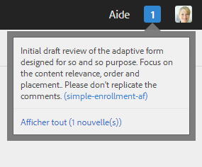
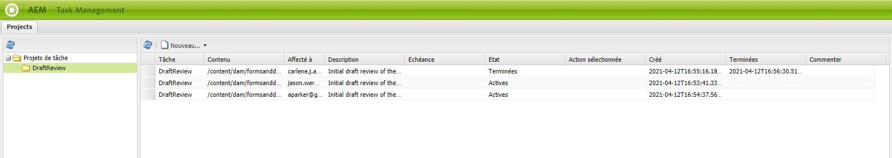

# Création et gestion de révisions des actifs d’un formulaire{#creating-and-managing-reviews-for-assets-in-forms}

## Révision {#review}

Une révision est un mécanisme permettant à un ou plusieurs réviseurs d’ajouter des commentaires sur un élément disponible dans un formulaire.

## Configuration d’une révision {#setting-up-a-review}

1. Accédez à l’onglet Formulaires et sélectionnez un formulaire.
1. Si aucune révision de ressource n’est en cours, l’icône de démarrage d’une révision  s’affiche dans la barre Action. Cliquez sur l’icône de démarrage d’une révision .
1. Saisissez les informations suivantes :

   * Nom de la révision : (Obligatoire) peut contenir des caractères alphanumériques, des traits d’union ou des caractères de soulignement.
   * Description de la révision : (Facultatif) description de la finalité ou du contenu à réviser.
   * Echéance de la révision : (Facultatif) date de fin de la révision. Une fois l’échéance passée, la tâche est indiquée comme étant « Overdue » (En retard).
   * Réviseurs : au moins un réviseur doit être indiqué. Utilisez la zone de liste déroulante pour ajouter des réviseurs. Lorsque vous entrez un nom, tous les noms correspondants sont répertoriés. Sélectionnez-en un et cliquez ensuite sur Ajouter.

1. Renseignez toutes les informations restantes et cliquez ensuite sur Démarrer.

### Actions survenant lorsqu’une révision est configurée {#actions-that-occur-when-a-review-is-set-up}

Cette section décrit ce qui se produit lorsqu’une révision est créée ou configurée.

1. Une tâche de révision est créée et affectée au responsable du lancement (initiateur) de la révision.
1. Tous les réviseurs se voient affecter une tâche de révision. La tâche apparaît dans leur section Notification. Le réviseur peut soit cliquer sur une notification, soit accéder à la boîte de réception pour afficher la tâche. Le réviseur peut cliquer pour ouvrir la tâche de révision, afficher le formulaire et commencer à ajouter des commentaires.

   

   Alerte de notification du réviseur

1. La zone de commentaire est accessible à l’initiateur et aux réviseurs de l’actif. Les autres utilisateurs peuvent voir les commentaires, mais ne sont pas habilités à en rédiger.

## Gestion d’une révision {#managing-a-review}

>[!NOTE]
>
>Seules les révisions en cours peuvent être modifiées. La modification des révisions terminées est donc impossible.

1. Accédez à l’onglet Formulaires et sélectionnez un formulaire.

1. Si une révision de ressource est en cours et que vous en êtes l’initiateur, l’icône Gérer la révision  s’affiche dans la barre Action. Seul l’initiateur de la révision peut gérer (mettre à jour/terminer) la révision.

   Cliquez sur l’icône Gérer la révision .

   Cette icône est désactivée pour les utilisateurs autres que l’initiateur.

1. Un écran affiche alors les informations suivantes :

   * **Nom de la révision** : ce champ ne peut pas être modifié.

   * **Description de la révision** : ce champ peut être modifié.

   * **Échéance** : ce champ peut être modifié. Vous pouvez modifier l’échéance selon n’importe quelle date et heure au-delà de la date et de l’heure actuelles.

   * **Réviseurs** : ce champ peut être modifié. Vous pouvez ajouter ou supprimer des réviseurs. Si une tâche est échue, vous ne pourrez ajouter des réviseurs qu’après avoir étendu l’échéance au-delà de la date actuelle.

1. Modifiez les champs nécessaires, puis cliquez sur Mettre à jour.

   

   État Mis à jour de la révision dans le Gestionnaire des tâches

1. Pour mettre fin à la révision, cliquez sur Terminer.

### Action survenant lorsqu’une révision est modifiée {#actions-that-occur-when-a-review-is-modified}

Cette section décrit ce qui se produit lorsque vous modifiez ou mettez fin à une révision :

1. Si la description de la révision est modifiée, la tâche correspondante des réviseurs et de l’initiateur est mise à jour.
1. Si l’échéance de la révision est modifiée, la nouvelle date est appliquée à la tâche correspondante pour les réviseurs.

1. Si un réviseur est supprimé :

   

   Suppression d’un réviseur

   1. Si la tâche affectée est incomplète, elle est terminée.
   1. Le réviseur ne peut plus ajouter de commentaires à l’actif.

1. Si un réviseur est ajouté :

   

   Ajout d’un réviseur

   1. Une tâche de révision est créée et affectée au réviseur qui vient d’être ajouté.
   1. Le nouveau réviseur peut ajouter des commentaires à l’actif.

1. Lorsqu’une révision est terminée :

   1. **Réviseurs** : pour chaque réviseur, il est mis fin à la tâche incomplète associée à la révision. La tâche n’apparaît plus avec l’état « Pending » (En attente) dans la section Notifications du réviseur.
   1. **Initiateur** : la tâche affectée à l’initiateur de la révision est marquée comme étant terminée. La tâche est supprimée de la section de notification de l’initiateur de la révision.
   1. **Tous** : la révision s’affiche dans la section des révisions précédentes. Plus aucun commentaire ne peut être ajouté.

