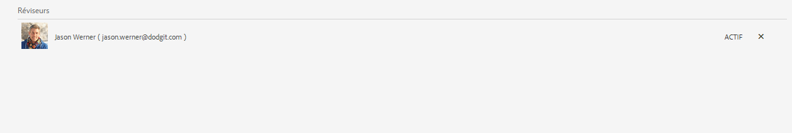
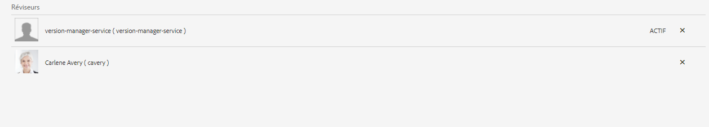

# Création et gestion des révisions de formulaires{#creating-and-managing-reviews-to-forms}

 Adobe recommande d’utiliser les [composants principaux](https://experienceleague.adobe.com/docs/experience-manager-core-components/using/adaptive-forms/introduction.html?lang=fr) de capture de données modernes et extensibles pour [créer de nouveaux formulaires adaptatifs](/help/forms/creating-adaptive-form-core-components.md) ou [ajouter des formulaires adaptatifs à des pages AEM Sites](/help/forms/create-or-add-an-adaptive-form-to-aem-sites-page.md). Ces composants représentent une avancée significative dans la création de formulaires adaptatifs, ce qui garantit des expériences utilisateur impressionnantes. Cet article décrit une approche plus ancienne de la création de Forms adaptatif à l’aide de composants de base. 

| Version | Lien de l’article |
| -------- | ---------------------------- |
| AEM 6.5 | [Cliquez ici](https://experienceleague.adobe.com/docs/experience-manager-65/forms/adaptive-forms-advanced-authoring/create-reviews-forms.html?lang=fr) |
| AEM as a Cloud Service | Cet article |

## Révision {#review}

Une révision est un mécanisme qui permet à un ou plusieurs réviseurs ou réviseuses de commenter des formulaires.

## Configuration d’une révision {#setting-up-a-review}

1. Accédez au navigateur de formulaires et sélectionnez un formulaire à réviser.
1. Si aucune révision n’est en cours dans le formulaire, l’icône de **démarrage d’une révision**  s’affiche dans la barre Action. Cliquez sur l’icône de **démarrage d’une révision** .
1. Saisissez les informations suivantes :

   * **Titre** (obligatoire) : il peut contenir des caractères alphanumériques, des tirets et des traits de soulignement.
   * **Description** (factultative) : description de la finalité ou du contenu de la révision.
   * **Échéance** (facultative) : date de fin de la révision. Une fois l’échéance passée, la tâche est indiquée comme étant « En retard ».
   * **Nom du réviseur ou de la réviseuse** : au moins un nom doit être indiqué. Utilisez la zone liste déroulante pour ajouter des réviseurs ou réviseuses, en saisissant une liste de tous les noms correspondants. Sélectionnez un nom, puis cliquez sur **Ajouter**. Dans la section suivante de l’onglet **Réviseurs**, les noms de tous les réviseurs s’affichent.

1. Cliquez sur **Démarrer** pour lancer une révision.

   >[!NOTE]
   >
   >* L’administrateur ou l’administratrice peut accéder à tous les groupes associés aux utilisateurs et utilisatrices du formulaire.
   >* Le groupe Utilisateurs et utilisatrices de service ne peut pas être sélectionné pour la révision.

### Actions survenant lorsqu’une révision est configurée {#actions-that-occur-when-a-review-is-set-up}

Cette section décrit ce qui se produit lorsqu’une révision est créée ou configurée.

1. Une tâche de révision est créée et affectée à la personne qui vient d’être ajoutée.
1. Une tâche de révision est affectée à toute l’équipe de révision. La tâche apparaît dans sa section Notifications. Un réviseur ou une réviseuse peut soit cliquer sur une notification soit accéder à sa boîte de réception pour afficher la tâche. Le réviseur peut cliquer pour ouvrir la tâche de révision, afficher le formulaire et commencer à ajouter des commentaires.

   

   Alerte de notification du réviseur

1. La zone de commentaire est accessible aux personnes effectuant la révision du formulaire. D’autres personnes peuvent lire les commentaires, mais ne peuvent pas en ajouter d’autres.

## Gestion d’une révision {#managing-a-review}

>[!NOTE]
>
>* Seules les révisions en cours peuvent être modifiées.
>* Les révisions terminées ne peuvent pas être modifiées.

1. Accédez à l’onglet Formulaires et sélectionnez un formulaire.

1. Si une révision de formulaire est en cours et que vous en êtes à l’origine, l’icône **Gérer la révision**  s’affiche dans la barre Action. Seule la personne initiant la révision peut gérer (mettre à jour/terminer) la révision.

   Cliquez sur l’icône **Gérer la révision** .

   Pour les utilisateurs autres que l’initiateur, l’icône Gérer la révision est désactivée.

1. Un écran affiche alors les informations suivantes :

   * **Nom de la révision** : ce champ ne peut pas être modifié.

   * **Description de la révision** : ce champ peut être modifié.

   * **Échéance** : ce champ peut être modifié. Vous pouvez modifier l’échéance selon n’importe quelle date et heure au-delà de la date et de l’heure actuelles.

   * **Réviseurs** : peut être modifié. Vous pouvez ajouter ou supprimer des réviseurs et réviseuses. Si une tâche est échue, vous ne pourrez ajouter des réviseurs et des réviseuses qu’après avoir étendu l’échéance au-delà de la date actuelle.

1. Pour mettre fin à la révision, cliquez sur **Terminer**.

### Actions survenant lorsqu’une révision est modifiée {#actions-that-occur-when-a-review-is-modified}

Cette section décrit ce qui se produit lorsque **vous modifiez ou mettez fin à une révision** :

1. Si la description de la révision est modifiée, la tâche correspondante des réviseurs/réviseuses et de l’initiateur ou l’initiatrice de la révision est mise à jour.
1. Si l’échéance de la révision est modifiée, la nouvelle date est appliquée à la tâche correspondante pour les réviseurs et les réviseuses.

1. Si un réviseur est supprimé :

   

   Suppression d’un réviseur

   1. Si la tâche affectée est incomplète, elle est terminée.
   1. Le réviseur ou la réviseuse ne peut plus ajouter de commentaires dans le formulaire.

1. Si un réviseur est ajouté :

   

   Ajout d’un réviseur

   1. Une tâche de révision est créée et affectée à la personne qui vient d’être ajoutée.
   1. Le nouveau réviseur ou la nouvelle réviseuse peut ajouter des commentaires à propos du formulaire.

1. Lorsqu’une révision est terminée :

   1. **Réviseurs et réviseuses** : pour chaque réviseur et réviseuse, il est mis fin à la tâche incomplète associée à la révision. La tâche n’apparaît plus avec l’état « en attente » dans la section Notifications du réviseur ou de la réviseuse.
   1. **Initiateur ou initiatrice** : la tâche affectée à l’initiateur ou l’initiatrice de la révision est marquée comme étant terminée. La tâche est supprimée de la section Notification de l’initiateur ou l’initiatrice de la révision.
   1. **Toutes** : la révision s’affiche dans la section des révisions précédentes. Plus aucun commentaire ne peut être ajouté.

   .

## Voir également {#see-also}

{{see-also}}

<!--

>[!MORELIKETHIS]
>
>* [Associating submission reviewers with a form](/help/forms/adding-reviewers-form.md)

-->