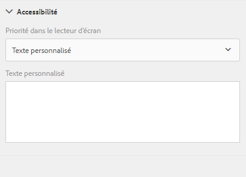
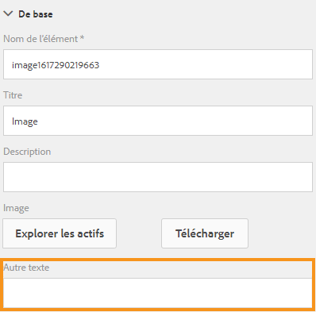

# Création de formulaires adaptatifs accessibles{#creating-accessible-adaptive-forms}

## Présentation {#introduction}

Un formulaire accessible est un formulaire utilisable par tout le monde, y compris par les utilisateurs souffrant de handicaps. Les formulaires adaptatifs comprennent différentes fonctionnalités et fonctions qui améliorent la facilité d’utilisation pour les utilisateurs ayant des capacités différentes. L’intégration d’options d’accessibilité dans des formulaires adaptatifs ne permet pas seulement d’élargir l’audience. Il s’agit en effet d’une exigence lors de la diffusion de documents dans des régions où le respect des normes d’accessibilité constitue une obligation. [!DNL AEM Forms] aide les développeurs à se conformer à ces normes d’accessibilité.

Pour créer un formulaire adaptatif accessible, l’auteur doit tenir compte des points suivants :

* Vérifier le formulaire à l’aide de l’outil de test d’accessibilité ANDI (Accessible Name and Description Inspecteur)
* Fournissez des libellés appropriés pour les commandes de formulaire
* Fournissez des équivalents textuels pour les images
* Fournissez un contraste des couleurs suffisant
* Assurez-vous que les commandes de formulaire sont accessibles au clavier

## Prérequis

Pour créer un formulaire adaptatif accessible, vous avez besoin d’un outil d’accessibilité comme **Accessible Name and Description Inspector (ANDI)** et d’un thème de formulaire adaptatif **développé pour résoudre les problèmes d’accessibilité**.

### Téléchargement et installation de l’outil de test d’accessibilité

L’outil ANDI (Accessible Name and Description Inspector) permet d’identifier et de corriger les problèmes de conformité liés à l’accessibilité du contenu Web. C’est l’outil mentionné dans les recommandations Trusted Tester v5 du département de la Sécurité intérieure. Il est développé par le département de la Sécurité sociale des États-Unis pour vérifier que le contenu Web respecte les dispositions de la section 508. L’outil :

* aide à détecter les problèmes d’accessibilité dans une page Web ;
* fournit des suggestions d’amélioration de l’accessibilité ;
* détecte les problèmes d’accessibilité du clavier et de contraste des couleurs ;
* identifie clairement le contenu destiné aux lecteurs d’écran conformément aux normes.

L’outil ANDI fonctionne avec tous les grands navigateurs Internet. Pour des instructions détaillées sur la configuration et l’utilisation de l’outil, consultez la [documentation d’ANDI](https://www.ssa.gov/accessibility/andi/help/install.html).

### Téléchargement et installation du thème Ultramarine-Accessible

Le thème Ultramarine-Accessible est un thème de référence. Il permet de montrer comment corriger le contraste des couleurs et d’autres problèmes liés à l’accessibilité dans un formulaire adaptatif. Adobe recommande de créer un thème personnalisé pour l’environnement de production en fonction des styles approuvés par votre organisation. Pour charger le thème dans votre instance AEM :

1. Téléchargez le package du thème.
1. Sélectionnez **[!UICONTROL Experience Manager]** > **[!UICONTROL Navigation]**  > **[!UICONTROL Forms]** dans votre instance AEM.
1. Appuyez sur **[!UICONTROL Créer]** > **[!UICONTROL Chargement de fichier]**. Sélectionnez et chargez le fichier x Ultramarine-Accessible-Theme.zip. Il télécharge le thème dans votre instance AEM.

## Rendre un formulaire adaptatif accessible

Vous devez vous focaliser sur quatre aspects clés : navigation au clavier, contraste des couleurs, texte alternatif éloquent pour les images et libellés appropriés pour les contrôles de formulaires afin de rendre un formulaire adaptatif accessible. Pour rendre vos formulaires adaptatifs existants accessibles :

### 1. Appliquez un thème accessible et effectuer des corrections supplémentaires.

Appliquez le thème Ultramarine-Accessible à votre formulaire adaptatif existant. Pour appliquer le thème :

1. Ouvrez le formulaire adaptatif pour le modifier.
1. Sélectionnez un composant et appuyez sur l’icône parent. Dans le menu contextuel, appuyez sur **[!UICONTROL Conteneur de formulaire adaptatif]**, puis sur l’icône Configurer.
1. Sélectionnez le thème Ultramarine-Accessible dans le navigateur de propriétés et appuyez sur l’icône **[!UICONTROL Enregistrer]**.
1. Actualisez la fenêtre du navigateur. Le thème est appliqué au formulaire adaptatif.

Après avoir appliqué un thème accessible, effectuez les corrections supplémentaires mentionnées ci-dessous. Les corrections s’ajoutent aux corrections liées à l’accessibilité couvertes dans le thème accessible :

1. Ajoutez un texte de remplacement éloquent pour l’image de logo dans le formulaire adaptatif.

   Fournissez un texte de remplacement éloquent pour les images des composants d’en-tête et de pied de page du modèle de formulaire adaptatif. Lorsque vous corrigez le modèle et que vous l’utilisez pour créer un formulaire adaptatif, les formulaires adaptatifs héritent de toutes les corrections liées à l’accessibilité appliquées à l’en-tête et au pied de page du modèle.  Pour un formulaire adaptatif existant, effectuez les modifications dans le formulaire adaptatif. Les modifications apportées à un modèle de formulaire adaptatif ne sont pas transférées automatiquement dans un formulaire adaptatif existant.

1. Ajoutez un composant d’en-tête contenant le nom du formulaire dans le formulaire adaptatif. Si votre conception de formulaire spécifie un nom de société, ajoutez un composant d’en-tête distinct pour le nom de la société.

   La plupart des outils d’accessibilité informent les utilisateurs de la hiérarchie du contenu afin de les aider à comprendre la structure de la page Web. Définissez différents niveaux d’en-tête pour le nom de l’organisation et le texte du nom du formulaire dans le formulaire adaptatif afin de fournir une structure hiérarchique à ce texte. En outre, utilisez un composant Texte avant chaque panneau et section avec un niveau d’en-tête approprié pour créer une hiérarchie.

   

1. Modifiez la couleur d’arrière-plan du pied de page pour utiliser un contraste approprié conformément aux normes d’accessibilité afin d’améliorer la visibilité et la lisibilité du texte. Vous pouvez utiliser ANDI pour rechercher des problèmes de contraste des couleurs dans votre formulaire. N’utilisez pas non plus de corps de police réduit. Les corps de polices réduits sont difficiles à lire.

1. Remplacez les composants Switch et Image choice de votre formulaire adaptatif existant par le composant choice (radio).

1. Remplacez le composant pas à pas numérique de votre formulaire adaptatif existant par le composant de zone numérique.

1. Remplacez le champ de saisie de date par le champ de sélecteur de date.

1. Définissez des modèles d’affichage, de validation et de modification pour le composant de sélecteur de date. Définissez également un message d’erreur de validation personnalisé. Par exemple, « Vous avez spécifié une date non valide. Le format correct de la date est AAAA-MM-JJ ».

1. Définissez le texte d’accessibilité personnalisé pour le composant Sélecteur de date. Par exemple, « Entrez votre date de naissance ». Les lecteurs d’écran lisent ces textes d’accessibilité personnalisés.

1. Utilisez une description brève plutôt qu’une description longue pour les composants de formulaire adaptatif. Une description longue ajoute le bouton d’aide. Assurez-vous que le formulaire adaptatif ne comporte pas de bouton d’aide.

1. Ajoutez du texte d’accessibilité personnalisé à toutes les cellules en lecture seule des tableaux. Désactivez également toutes les cellules de tableaux en lecture seule.

1. Supprimez les champs de signature tactile, le cas échéant, dans le formulaire adaptatif. Configurez le formulaire adaptatif de sorte qu’il utilise [!DNL Adobe Sign] pour une expérience de signature numérique transparente.

### 2. Fournissez des libellés appropriés pour les contrôles de formulaire. {#provide-proper-labels-for-form-controls}

Le libellé ou le titre d’un composant de formulaire identifie ce qu’il représente. Par exemple, le texte &quot;Prénom&quot; indique aux utilisateurs qu’ils doivent saisir leur prénom dans un champ de texte. Pour être accessible par les lecteurs d’écran, le libellé est associé par programmation à un composant de formulaire. La commande de formulaire peut également être configurée avec des informations d’accessibilité supplémentaires.

Le libellé qui est perçu par les lecteurs d’écran ne doit pas nécessairement être le même que la légende visuelle. Dans certains cas, vous souhaiterez peut-être être plus précis sur l’objectif du contrôle. Pour chaque objet de champ d’un formulaire, les options d’accessibilité permettent de spécifier ce que le lecteur d’écran annonce pour identifier le champ de formulaire spécifique.

Pour utiliser l’option Accessibilité, procédez comme suit :

1. Sélectionnez un composant et appuyez sur ](assets/cmppr.png)cmppr![.
1. Cliquez sur **[!UICONTROL Accessibilité]** dans la barre latérale pour sélectionner l’option d’accessibilité de votre choix.

### Options d’accessibilité dans des composants de formulaire {#accessibility-options-in-form-components}

**Texte personnalisé** : les auteurs de formulaires indiquent le contenu dans la zone de texte Personnalisé de l’option d’accessibilité. La technologie d’assistance, dont tirent parti les lecteurs d’écran, utilise ce texte personnalisé. L’utilisation du paramètre Titre est la meilleure option dans la plupart des scénarios. N’envisagez la création d’un texte de Reader d’écran personnalisé que lorsque l’utilisation du titre ou d’une brève description n’est pas possible.

**Description brève** : pour la majorité des composants, une description brève s’affiche lors de l’exécution lorsque l’utilisateur place le pointeur de la souris sur un composant. Vous pouvez définir cette option dans le champ approprié, sous l’option du contenu d’aide.

**Titre** : utilisez cette option pour permettre à [!DNL AEM Forms] d’utiliser le libellé visuel associé au champ de formulaire comme texte de lecteur d’écran.

**Nom** : vous pouvez définir une valeur dans le champ Nom de l’onglet Liaison. Le nom ne peut pas contenir d’espaces.

**Aucun** : lorsque vous sélectionnez Aucun, aucun nom n’est associé à l’objet de formulaire dans le formulaire publié. Aucun n’est pas un paramètre recommandé pour les commandes de formulaire.

>[!NOTE]
>
>* Dans le cas de la case d’option et de la case à cocher, deux options seulement sont possibles dans le cadre de l’accessibilité à savoir : Texte personnalisé et Titre.
>* Pour les formulaires adaptatifs basés sur XFA, l’option d’accessibilité est héritée des options d’accessibilité définies dans le fichier XDP. Les info-bulles du fichier XDP sont mappées sur la description courte et la légende sur le titre. Les autres options fonctionnent normalement.

### 3. Fournissez des équivalents textuels pour les images {#provide-text-equivalents-for-images}

Les images peuvent aider à améliorer la compréhension pour certains utilisateurs. Toutefois, pour les utilisateurs utilisant des lecteurs d’écran, les images réduisent l’accessibilité de votre formulaire. Si vous choisissez d’utiliser des images, fournissez des descriptions textuelles pour toutes les images.

Assurez-vous que le texte décrit l’objet et son objectif dans le formulaire. Un lecteur d’écran lit ce texte alternatif lorsqu’il rencontre une image. Un texte alternatif doit toujours être spécifié pour une image.

Sélectionnez un composant d’image et appuyez sur . Dans la barre latérale, sous Propriétés, indiquez le texte alternatif d’une image.

### 4. Fournissez un contraste des couleurs suffisant {#provide-sufficient-color-contrast}

La conception de l’accessibilité implique la prise en compte d’instructions supplémentaires pour l’utilisation des couleurs. Les auteurs de formulaires peuvent utiliser des couleurs pour améliorer l’aspect des formulaires en mettant en surbrillance différents composants de formulaire. Cependant, une utilisation incorrecte des couleurs peut rendre un formulaire difficile ou impossible à lire pour les personnes ayant des capacités différentes.

Les utilisateurs ayant une déficience visuelle s’appuient sur le contraste prononcé entre le texte et l’arrière-plan pour lire du contenu numérique. En l’absence de contraste suffisant, la lecture d’un formulaire peut s’avérer difficile, voire impossible, pour certains utilisateurs.

Il est recommandé d’utiliser la police et les couleurs d’arrière-plan par défaut, c’est-à-dire le contenu en noir sur fond blanc. Si vous modifiez les couleurs par défaut, choisissez une couleur de premier plan foncée sur un arrière-plan clair, ou inversement.

<!-- See [Creating custom themes for Adaptive Forms](creating-custom-adaptive-form-themes.md), for more information about changing the color contrast and theme for the Adaptive Forms. -->

### 5. Assurez-vous que les contrôles de formulaire sont accessibles au clavier. {#ensure-that-form-controls-are-keyboard-accessible}

Un formulaire accessible peut être entièrement rempli à l’aide du clavier ou d’un appareil de saisie équivalent. Les utilisateurs ayant une mobilité réduite ou une déficience visuelle peuvent n’avoir d’autre choix que d’utiliser le clavier. De plus, de nombreux utilisateurs qui peuvent utiliser une souris préfèrent saisir leur clavier. En proposant les différentes méthodes de saisie, vous pouvez non seulement créer des formulaires accessibles, mais également des formulaires mieux adaptés aux préférences de tous les utilisateurs.

Les raccourcis clavier suivants sont disponibles dans [!DNL AEM Forms].

| Action | Raccourci clavier |
|---|---|
| Déplacer le curseur vers l’avant dans un formulaire | Tabulation |
| Déplacer le curseur vers l’arrière dans un formulaire | Maj+Tabulation |
| Accéder au panneau suivant | Alt+Flèche Droite |
| Accéder au panneau précédent | Alt+Flèche Gauche |
| Réinitialiser les données renseignées dans un formulaire | Alt+R |
| Envoyer un formulaire | Alt+S |

En outre, plusieurs raccourcis clavier sont disponibles pour le composant **[!UICONTROL Sélecteur de date]** dans les formulaires adaptatifs. Pour activer les touches de raccourci, appuyez sur le composant **[!UICONTROL Sélecteur de date]** et sur  pour ouvrir les propriétés. Dans la section **[!UICONTROL Modèles]**, sélectionnez un modèle d’affichage à l’aide des listes déroulantes **[!UICONTROL Type]** et **[!UICONTROL Modèle]**. Enregistrez les propriétés pour activer l’utilisation de raccourcis clavier pour le composant **[!UICONTROL Sélecteur de date]**.

Les touches de raccourci clavier suivantes sont disponibles pour le composant Sélecteur de date dans les formulaires adaptatifs :

| Action | Raccourci clavier |
|---|---|
| <ul><li>Afficher les options du composant Sélecteur de date lorsque la sélection de l’onglet met en surbrillance l’icône de calendrier</li><li>Effectuer l’événement de clic lorsque la sélection de l’onglet met en surbrillance une option</li> | Espace ou Entrée |
| Masquer les options du composant Sélecteur de date | Échap |
| <ul><li>Déplacer le curseur vers l’avant dans les options disponibles dans le composant Sélecteur de date.</li><li>Définir l’icône de calendrier lorsque le champ de saisie de date est principal</li> | Tabulation |
| Déplacer le curseur vers l’arrière dans les options disponibles dans le composant Sélecteur de date | Maj+Tabulation |
| <ul><li>Afficher les options du composant Sélecteur de date lorsque la cible d’action de l’onglet met en surbrillance le champ de saisie de date</li><li>Déplacer le curseur vers le bas dans le calendrier disponible dans le composant Sélecteur de date</li> | Flèche vers le bas |
| Déplacer le curseur vers le haut dans le calendrier disponible dans le composant Sélecteur de date | Flèche vers le haut |
| Déplacer le curseur vers l’arrière dans le calendrier disponible dans le composant Sélecteur de date | Flèche vers la gauche |
| Déplacer le curseur vers l’avant dans le calendrier disponible dans le composant Sélecteur de date | Flèche vers la droite |
| Exécuter l’action de la légende disponible entre les flèches de navigation de droite et de gauche dans le calendrier | Maj+Flèche Haut |
| Exécuter l’action correspondant à l’icône de flèche de navigation droite  disponible dans le calendrier | Maj+Flèche Gauche |
| Exécuter l’action correspondant à l’icône de flèche de navigation gauche  disponible dans le calendrier | Maj+Flèche Droite |

## Utiliser l’outil d’accessibilité pour identifier les problèmes d’accessibilité restants

ANDI vous aide à identifier et à corriger les problèmes liés au respect des normes d’accessibilité dans un formulaire adaptatif. Pour rechercher des problèmes liés à l’accessibilité dans un formulaire adaptatif à l’aide de l’outil ANDI :

1. Ouvrez un formulaire adaptatif en mode d’aperçu.
1. Cliquez sur l’icône de l’outil ANDI en signet. L’outil ANDI analyse le formulaire adaptatif et affiche les problèmes d’accessibilité. Pour plus d’informations sur l’utilisation de l’outil, consultez la [documentation d’ANDI](https://www.ssa.gov/accessibility/andi/help/howtouse.html).
1. Examinez et résolvez les problèmes signalés par ANDI.
