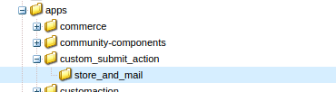
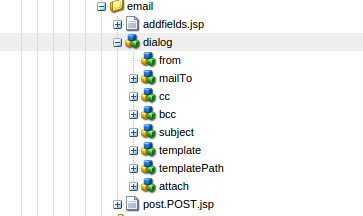
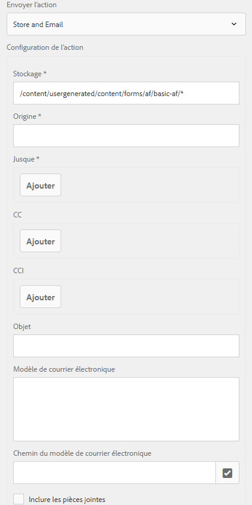
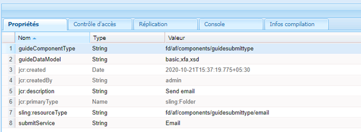
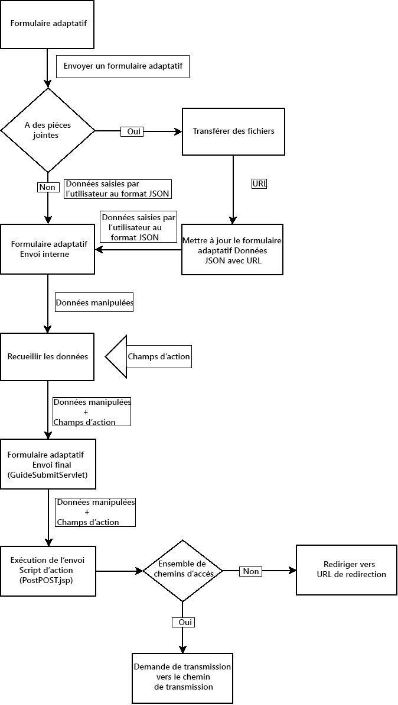

# Création d’une action Envoyer personnalisée pour les formulaires adaptatifs {#writing-custom-submit-action-for-adaptive-forms}

| Version | Lien de l’article |
| -------- | ---------------------------- |
| AEM 6.5 | [Cliquez ici](https://experienceleague.adobe.com/docs/experience-manager-65/forms/customize-aem-forms/custom-submit-action-form.html?lang=fr) |
| AEM as a Cloud Service (composants principaux) | [Cliquez ici](https://experienceleague.adobe.com/fr/docs/experience-manager-cloud-service/content/forms/adaptive-forms-authoring/authoring-adaptive-forms-core-components/create-an-adaptive-form-on-forms-cs/custom-submit-action-for-adaptive-forms-based-on-core-components) |
| AEM as a Cloud Service (composants de base) | Cet article |

Un formulaire adaptatif fournit plusieurs actions Envoyer prêtes à l’emploi. Une action Envoyer spécifie les détails des actions à effectuer sur les données collectées via le formulaire adaptatif, par exemple l’envoi de données sur un e-mail.

Vous pouvez créer une action Envoyer personnalisée pour ajouter des fonctionnalités non incluses dans les [actions Envoyer prêtes à l’emploi](configuring-submit-actions.md) ou qui ne sont pas prises en charge par une seule action Envoyer prête à l’emploi. Il peut s’agir par exemple de l’envoi de données à un processus, de l’enregistrement des données dans un magasin de données, de l’envoi d’une notification par e-mail à la personne qui envoie le formulaire et de l’envoi d’un e-mail à la personne responsable du traitement du formulaire envoyé pour approbation ou rejet par le biais d’une seule action Envoyer.

## Format des données XML {#xml-data-format}

Les données XML sont envoyées à la servlet à l’aide du paramètre de requête **`jcr:data`**. Les actions Envoyer peuvent accéder au paramètre pour traiter les données. Le code ci-après décrit le format des données XML. Les champs liés au modèle de formulaire apparaissent dans la section **`afBoundData`**. Les champs non liés apparaissent dans la `afUnoundData`section. <!--For more information about the format of the `data.xml` file, see [Introduction to prepopulating Adaptive Form fields](prepopulate-adaptive-form-fields.md).-->

```xml
<?xml ?>
<afData>
<afUnboundData>
<data>
<field1>value</field2>
<repeatablePanel>
    <field2>value</field2>
</repeatablePanel>
<repeatablePanel>
    <field2>value</field2>
</repeatablePanel>
</data>
</afUnboundData>
<afBoundData>
<!-- xml corresponding to the Form Model /XML Schema -->
</afBoundData>
</afData>
```

### Champs d’action {#action-fields}

Une action Envoyer peut ajouter des champs d’entrée masqués (à l’aide de la balise HTML [input](https://developer.mozilla.org/fr/docs/Web/HTML/Element/Input)) au code HTML du formulaire affiché. Ces champs masqués peuvent contenir les valeurs dont elle a besoin lors du traitement de l’envoi du formulaire. Lors de l’envoi du formulaire, ces valeurs de champ sont publiées en tant que paramètres de requête que l’action Envoyer peut utiliser lors de la gestion de l’envoi. Les champs d’entrée sont appelés champs d’action.

Par exemple, une action Envoyer qui capture également le temps nécessaire pour remplir un formulaire peut ajouter les champs d’entrée masqués `startTime` et `endTime`.

Un script peut fournir les valeurs des champs `startTime` et `endTime` lors du rendu du formulaire et avant l’envoi du formulaire. Le script de l’action Envoyer `post.jsp` peut ensuite accéder à ces champs à l’aide des paramètres de requête et calculer le temps total nécessaire au remplissage du formulaire.

### Pièces jointes {#file-attachments}

Les actions Envoyer peuvent également utiliser les pièces jointes que vous chargez à l’aide du composant Pièce jointe. Les scripts des actions Envoyer peuvent accéder à ces fichiers à l’aide de l’[API RequestParameter](https://sling.apache.org/apidocs/sling5/org/apache/sling/api/request/RequestParameter.html) sling. La méthode [isFormField](https://sling.apache.org/apidocs/sling5/org/apache/sling/api/request/RequestParameter.html#isFormField()) de l’API permet de déterminer si le paramètre de requête correspond à un fichier ou à un champ de formulaire. Vous pouvez effectuer une itération sur les paramètres de requête dans une action Envoyer pour identifier les paramètres de pièce jointe.

L’exemple de code ci-après identifie les pièces jointes de la requête. Il lit ensuite les données du fichier à l’aide de [Get API](https://sling.apache.org/apidocs/sling5/org/apache/sling/api/request/RequestParameter.html#get()). Il crée enfin un objet Document à l’aide des données et l’ajoute à la liste.

```java
RequestParameterMap requestParameterMap = slingRequest.getRequestParameterMap();
for (Map.Entry<String, RequestParameter[]> param : requestParameterMap.entrySet()) {
    RequestParameter rpm = param.getValue()[0];
    if(!rpm.isFormField()) {
        fileAttachments.add(new Document(rpm.get()));
    }
}
```

Lorsque vous joignez des fichiers au formulaire adaptatif, le serveur valide les pièces jointes après l’envoi du formulaire adaptatif et renvoie un message d’erreur dans les cas suivants :

* Les pièces jointes comprennent un nom de fichier qui commence par le caractère (.), contient les caractères \ / : * ? &quot; &lt; > | % $ ou qui contient des noms de fichier spéciaux réservés au système d’exploitation Windows, tels que `nul`, `prn`, `con`, `lpt` ou `com`.

* La taille de la pièce jointe du fichier est de 0 octet.

* Le format de la pièce jointe n’est pas défini dans la section [Types de fichiers pris en charge](https://helpx.adobe.com/fr/document-cloud/help/supported-file-formats-fill-sign.html#main-pars_text) lors de la configuration du composant Pièce jointe dans un formulaire adaptatif.

### Chemin de transfert et URL de redirection {#forward-path-and-redirect-url}

Après avoir exécuté l’action requise, la servlet Submit transfère la requête vers le chemin de transfert. Une action utilise l’API setForwardPath pour définir le chemin de transfert dans la servlet Guide Submit.

Si l’action ne fournit pas de chemin de transfert, la servlet Submit redirige le navigateur à l’aide de l’URL de redirection. L’auteur ou l’autrice configure l’URL de redirection à l’aide de la configuration de la page de remerciement dans la boîte de dialogue Modifier du formulaire adaptatif. Il est également possible de configurer l’URL de redirection par le biais de l’action Envoyer ou de l’API setRedirectUrl de la servlet Guide Submit. Vous pouvez également configurer les paramètres de requête envoyés à l’URL de redirection à l’aide de l’API setRedirectParameters du servlet Guide Submit.

>[!NOTE]
>
>Un auteur ou une autrice fournit l’URL de redirection (à l’aide de la configuration de la page de remerciement). Les [actions Envoyer prêtes à l’emploi](configuring-submit-actions.md) utilisent l’URL de redirection pour rediriger le navigateur à partir de la ressource référencée par le chemin de transfert.
>
>Vous pouvez créer une action Envoyer personnalisée qui transfère une requête vers une ressource ou une servlet. Adobe recommande que le script qui effectue la gestion des ressources pour le chemin de transfert redirige la requête vers l’URL de redirection au terme du traitement.

## Action Envoyer {#submit-action}

Une action Envoyer est un sling:Folder qui contient les éléments suivants :

* **addfields.jsp** : ce script fournit les champs d’action ajoutés au fichier HTML lors du rendu. Utilisez ce script pour ajouter les paramètres d’entrée masqués requis lors de l’envoi dans le script post.POST.jsp.
* **dialog.xml** : ce script est similaire à la boîte de dialogue du composant CQ. Il fournit des informations de configuration que l’auteur personnalise. Les champs s’affichent sous l’onglet Actions Envoyer de la boîte de dialogue Modifier le formulaire adaptatif lorsque vous sélectionnez l’action Envoyer.
* **post.POST.jsp** : la servlet Submit appelle ce script avec les données envoyées et les autres données des sections précédentes. Toute mention relative à l’exécution d’une action dans cette page implique l’exécution du script post.POST.jsp. Pour enregistrer l’action Envoyer avec le Forms adaptatif à afficher dans la boîte de dialogue Modifier le formulaire adaptatif, ajoutez les propriétés suivantes au `sling:Folder` :

   * **guideComponentType** de type chaîne et valeur **fd/af/components/guidesubmittype**
   * **guideDataModel** de type chaîne qui spécifie le type de formulaire adaptatif auquel l’action Envoyer est applicable. <!--**xfa** is supported for XFA-based Adaptive Forms while -->**xsd** est pris en charge pour les formulaires adaptatifs basés sur XSD. **basic** est pris en charge pour les formulaires adaptatifs qui n’utilisent pas XDP ou XSD. Pour afficher l’action sur plusieurs types de formulaires adaptatifs, ajoutez les chaînes correspondantes. Séparez chaque chaîne par une virgule. Par exemple, pour rendre une action visible sur les <!--XFA- and -->formulaires adaptatifs basés sur XSD, spécifiez la valeur en tant que <!--**xfa** and--> **xsd**.

   * **jcr:description** de type chaîne. La valeur de cette propriété est affichée dans la liste des actions Envoyer située sous l’onglet Actions Envoyer de la boîte de dialogue Modifier le formulaire adaptatif. Les actions prêtes à l’emploi figurent dans le référentiel CRX, à l’emplacement **/libs/fd/af/components/guidesubmittype**.

   * **submitService** de type chaîne. Pour plus d’informations, voir [Planification de l’envoi du formulaire adaptatif pour les actions personnalisées](#schedule-adaptive-form-submission).

## Création d’une action Envoyer personnalisée {#creating-a-custom-submit-action}

>[!NOTE]
>
> Pour savoir comment créer une action d’envoi personnalisée pour les composants principaux, consultez [Création d’une action d’envoi personnalisée pour le Forms adaptatif (composants principaux)](https://experienceleague.adobe.com/fr/docs/experience-manager-cloud-service/content/forms/adaptive-forms-authoring/authoring-adaptive-forms-core-components/create-an-adaptive-form-on-forms-cs/custom-submit-action-for-adaptive-forms-based-on-core-components).

Pour créer une action Envoyer personnalisée qui enregistre les données dans le référentiel CRX et vous envoie ensuite un e-mail, suivez la procédure ci-après. Le formulaire adaptatif contient l’action Envoyer Stocker le contenu (obsolète) prête à l’emploi qui permet d’enregistrer les données dans le référentiel CRX. En outre, AEM fournit une API de [messagerie](https://www.adobe.io/experience-manager/reference-materials/6-5/javadoc/com/day/cq/mailer/package-summary.html) qui peut être utilisée pour envoyer des e-mails. Avant d’utiliser l’API de messagerie, configurez le service de messagerie Day CQ via la console système. Vous pouvez réutiliser l’action Stocker le contenu (obsolète) pour stocker les données dans le référentiel. L’action Stocker le contenu (obsolète) se trouve à l’emplacement /libs/fd/af/components/guidesubmittype/store dans le référentiel CRX.

1. Connectez-vous à CRXDE Lite en accédant à https://&lt;server>:&lt;port>/crx/de/index.jsp. Créez un nœud avec la propriété sling:Folder et le nom store_and_mail dans le dossier /apps/custom_submit_action. Créez le dossier custom_submit_action, le cas échéant.

   

2. **Fournissez les champs de configuration obligatoires.**

   Ajoutez la configuration nécessaire à l’action Stocker. Copiez le nœud **cq:dialog** de l’action Stocker à l’emplacement /libs/fd/af/components/guidesubmittype/store dans le dossier d’action à l’emplacement /apps/custom_submit_action/store_and_email.

   

3. **Fournissez des champs de configuration pour demander à l’auteur la configuration des e-mails.**

   Le formulaire adaptatif contient également une action E-mail qui permet d’envoyer des e-mails aux utilisateurs. Personnalisez cette action selon vos besoins. Accédez à /libs/fd/af/components/guidesubmittype/email/dialog. Copiez les nœuds du nœud cq:dialog dans le nœud cq:dialog de votre action Envoyer (/apps/custom_submit_action/store_and_email/dialog).

   

4. **Rendez l’action accessible dans la boîte de dialogue Modifier le formulaire adaptatif.**

   Ajoutez les propriétés suivantes au nœud store_and_email :

   * **guideComponentType** de type **chaîne** et valeur **fd/af/components/guidesubmittype**

   * **guideDataModel** de type **chaîne** et de valeur **<!--xfa, -->xsd, basic**

   * **jcr:description** de type **chaîne** et de valeur **Store and Email Action**

   * **submitService** de type **chaîne** et de valeur **Store and Email**. Pour plus d’informations, voir [Planification de l’envoi du formulaire adaptatif pour les actions personnalisées](#schedule-adaptive-form-submission).

5. Ouvrez un formulaire adaptatif. Cliquez sur le bouton **Modifier** en regard de **Démarrer** pour ouvrir la boîte de dialogue **Modifier** du conteneur de formulaires adaptatifs. La nouvelle action s’affiche sous l’onglet **Actions Envoyer**. La sélection de l’action **Store and Email** affiche la configuration ajoutée au nœud dialog.

   

6. **Utilisez l’action pour terminer une tâche.**

   Ajoutez le script post.POST.jsp à votre action. (/apps/custom_submit_action/store_and_mail/).

   Exécutez l’action Stocker prête à l’emploi (script post.POST.jsp). Utilisez l’API [FormsHelper.runAction](https://www.adobe.io/experience-manager/reference-materials/6-5/javadoc/com/day/cq/wcm/foundation/forms/FormsHelper.html#runAction-java.lang.String-java.lang.String-org.apache.sling.api.resource.Resource-org.apache.sling.api.SlingHttpServletRequest-org.apache.sling.api.SlingHttpServletResponse-)&#x200B;(java.lang.String, java.lang.String, org.apache.sling.api.resource.Resource, org.apache.sling.api.SlingHttpServletRequest, org.apache.sling.api.SlingHttpServletResponse)) fournie par CQ dans votre code pour exécuter l’action Stocker. Ajoutez le code suivant à votre fichier JSP :

   `FormsHelper.runAction("/libs/fd/af/components/guidesubmittype/store", "post", resource, slingRequest, slingResponse);`

   Pour envoyer l’e-mail, le code lit l’adresse électronique du destinataire à partir de la configuration. Pour récupérer la valeur de configuration dans le script de l’action, lisez les propriétés de la ressource actuelle à l’aide du code ci-après. Vous pouvez également lire les autres fichiers de configuration.

   `ValueMap properties = ResourceUtil.getValueMap(resource);`

   `String mailTo = properties.get("mailTo");`

   Utilisez enfin l’API de messagerie CQ pour envoyer l’e-mail. Utilisez la classe [SimpleEmail](https://commons.apache.org/proper/commons-email/apidocs/org/apache/commons/mail/SimpleEmail.html) pour créer l’objet Email comme illustré ci-dessous :

   >[!NOTE]
   >
   >Vérifiez que le fichier JSP porte le nom post.POST.jsp.

   ```java
   <%@include file="/libs/fd/af/components/guidesglobal.jsp" %>
   <%@page import="com.day.cq.wcm.foundation.forms.FormsHelper,
          org.apache.sling.api.resource.ResourceUtil,
          org.apache.sling.api.resource.ValueMap,
                   com.day.cq.mailer.MessageGatewayService,
     com.day.cq.mailer.MessageGateway,
     org.apache.commons.mail.Email,
                   org.apache.commons.mail.SimpleEmail" %>
   <%@taglib prefix="sling"
                   uri="https://sling.apache.org/taglibs/sling/1.0" %>
   <%@taglib prefix="cq"
                   uri="https://www.day.com/taglibs/cq/1.0"
   %>
   <cq:defineObjects/>
   <sling:defineObjects/>
   <%
           String storeContent =
                       "/libs/fd/af/components/guidesubmittype/store";
           FormsHelper.runAction(storeContent, "post", resource,
                                   slingRequest, slingResponse);
    ValueMap props = ResourceUtil.getValueMap(resource);
    Email email = new SimpleEmail();
    String[] mailTo = props.get("mailto", new String[0]);
    email.setFrom((String)props.get("from"));
           for (String toAddr : mailTo) {
               email.addTo(toAddr);
      }
    email.setMsg((String)props.get("template"));
    email.setSubject((String)props.get("subject"));
    MessageGatewayService messageGatewayService =
                       sling.getService(MessageGatewayService.class);
    MessageGateway messageGateway =
                   messageGatewayService.getGateway(SimpleEmail.class);
    messageGateway.send(email);
   %>
   ```

   Sélectionnez l’action dans le formulaire adaptatif. L’action envoie un e-mail et stocke les données.

## Utilisez la propriété submitService pour les actions Envoyer personnalisées {#submitservice-property}

Lorsque vous définissez l’action Envoyer personnalisée, qui comprend la propriété `submitService`, le formulaire déclenche l’action [FormSubmitActionService](https://helpx.adobe.com/fr/experience-manager/6-5/forms/javadocs/com/adobe/aemds/guide/service/FormSubmitActionService.html) lors de l’envoi. L’action `FormSubmitActionService` utilise la méthode `getServiceName` pour récupérer la valeur de la propriété `submitService`. En fonction de la valeur de la propriété `submitService`, le service appelle la méthode d’envoi appropriée. Incluez `FormSubmitActionService` dans le lot personnalisé que vous téléchargez sur le serveur [!DNL AEM Forms].

Ajoutez la propriété `submitService` de type string sur `sling:Folder` de votre action Envoyer personnalisée pour activer [!DNL Adobe Sign] pour le formulaire adaptatif. Vous pouvez sélectionner l’option **[!UICONTROL Activer Adobe Sign]** dans la section **[!UICONTROL Signature électronique]** des propriétés du conteneur de formulaires adaptatifs uniquement après avoir défini la valeur de la propriété `submitService` de votre action d’envoi personnalisée.

<!--As a result of setting an appropriate value for the `submitService` property and enabling [!DNL Adobe Sign], you can schedule the submission of an Adaptive Form to ensure that all configured signers have taken an action on the form. [!DNL Adobe Sign] Configuration Service keeps polling [!DNL Adobe Sign] server at regular intervals to verify the status of signatures. If all the signers complete signing the form, the Submit Action service is started and the form is submitted.-->




<!-- You can't do comments within comments, so I changed comment tags to <start-comment> <end-comment> -->

<!--
## Workflow for a Submit Action {#workflow-for-a-submit-action}

The flowchart depicts the workflow for a Submit Action that is triggered when you click the **[!UICONTROL Submit]** button in an Adaptive Form. The files in the File Attachment component are uploaded to the server, and the form data is updated with the URLs of the uploaded files. Within the client, the data is stored in the JSON format. The client sends an Ajax request to an internal servlet that massages the data you specified and returns it in the XML format. The client collates this data with action fields. It submits the data to the final servlet (Guide Submit servlet) through a Form Submit Action. Then, the servlet forwards the control to the Submit Action. The Submit Action can forward the request to a different sling resource or redirect the browser to another URL.



### XML data format {#xml-data-format}

The XML data is sent to the servlet using the **`jcr:data`** request parameter. Submit Actions can access the parameter to process the data. The following code describes the format of the XML data. The fields that are bound to the Form model appear in the **`afBoundData`** section. Unbound fields appear in the `afUnoundData`section. For more information about the format of the `data.xml` file, see [Introduction to prepopulating Adaptive Form fields](prepopulate-adaptive-form-fields.md).

```xml
<?xml ?>
<afData>
<afUnboundData>
<data>
<field1>value</field2>
<repeatablePanel>
    <field2>value</field2>
</repeatablePanel>
<repeatablePanel>
    <field2>value</field2>
</repeatablePanel>
</data>
</afUnboundData>
<afBoundData>
<start comment> xml corresponding to the Form Model /XML Schema <end comment>
<start comment> </afBoundData> <end comment>
</afData>
```

### Action fields {#action-fields}

A Submit Action can add hidden input fields (using the HTML [input](https://developer.mozilla.org/en/docs/Web/HTML/Element/Input) tag) to the rendered form HTML. These hidden fields can contain values that it needs while processing form submission. When submitting the form, these field values are posted back as request parameters that the Submit Action can use during submission handling. The input fields are called action fields.

For example, a Submit Action that also captures the time taken to fill a form can add the hidden input fields `startTime` and `endTime`.

A script can supply the values of the `startTime` and `endTime` fields when the form renders and before form submission, respectively. The Submit Action script `post.jsp` can then access these fields using request parameters and compute the total time required to fill the form.

### File attachments {#file-attachments}

Submit Actions can also use the file attachments you upload using the File Attachment component. Submit Action scripts can access these files using the sling [RequestParameter API](https://sling.apache.org/apidocs/sling5/org/apache/sling/api/request/RequestParameter.html). The [isFormField](https://sling.apache.org/apidocs/sling5/org/apache/sling/api/request/RequestParameter.html#isFormField()) method of the API helps identify whether the request parameter is a file or a form field. You can iterate over the Request parameters in a Submit Action to identify File Attachment parameters.

The following sample code identifies the file attachments in the request. Next, it reads the data into the file using the [Get API](https://sling.apache.org/apidocs/sling5/org/apache/sling/api/request/RequestParameter.html#get()). Finally, it creates a Document object using the data and appends it to a list.

```java
RequestParameterMap requestParameterMap = slingRequest.getRequestParameterMap();
for (Map.Entry<String, RequestParameter[]> param : requestParameterMap.entrySet()) {
    RequestParameter rpm = param.getValue()[0];
    if(!rpm.isFormField()) {
        fileAttachments.add(new Document(rpm.get()));
    }
}
```

### Forward path and Redirect URL {#forward-path-and-redirect-url}

After performing the required action, the Submit servlet forwards the request to the forward path. An action uses the setForwardPath API to set the forward path in the Guide Submit servlet.

If the action does not provide a forward path, the Submit servlet redirects the browser using the Redirect URL. The author configures the Redirect URL using the Thank You Page configuration in the Adaptive Form Edit dialog. You can also configure the Redirect URL through the Submit Action or the setRedirectUrl API in the Guide Submit servlet. You can also configure the Request parameters sent to the Redirect URL using the setRedirectParameters API in the Guide Submit servlet.

>[!NOTE]
>
>An author provides the Redirect URL (using the Thank You Page Configuration). [OOTB Submit Actions](configuring-submit-actions.md) use the Redirect URL to redirect the browser from the resource that the forward path references.
>
>You can write a custom Submit Action that forwards a request to a resource or servlet. Adobe recommends that the script that performs resource handling for the forward path redirect the request to the Redirect URL when the processing completes.

## Submit Action {#submit-action}

A Submit Action is a sling:Folder that includes the following:

* **addfields.jsp**: This script provides the action fields that are added to the HTML file during rendition. Use this script to add hidden input parameters required during submission in the post.POST.jsp script.
* **dialog.xml**: This script is similar to the CQ Component dialog. It provides configuration information that the author customizes. The fields are displayed in the Submit Actions Tab in the Adaptive Form Edit dialog when you select the Submit Action.
* **post.POST.jsp**: The Submit servlet calls this script with the data that you submit and the additional data in the previous sections. Any mention of running an action in this page implies running the post.POST.jsp script. To register the Submit Action with the Adaptive Forms to display in the Adaptive Form Edit dialog, add these properties to the sling:Folder:

    * **guideComponentType** of type String and value **fd/af/components/guidesubmittype**
    * **guideDataModel** of type String that specifies the type of Adaptive Form for which the Submit Action is applicable. **xfa** is supported for XFA-based Adaptive Forms while **xsd** is supported for XSD-based Adaptive Forms. **basic** is supported for Adaptive Forms that do not use XDP or XSD. To display the action on multiple types of Adaptive Forms, add the corresponding strings. Separate each string by a comma. For example, to make an action visible on XFA- and XSD-based Adaptive Forms, specify the values **xfa** and **xsd** respectively.

    * **jcr:description** of type String. The value of this property is displayed in the Submit Action list in the Submit Actions Tab of the Adaptive Form Edit dialog. The OOTB actions are present in the CRX repository at the location **/libs/fd/af/components/guidesubmittype**.

## Creating a custom Submit Action {#creating-a-custom-submit-action}

Perform the following steps to create a custom Submit Action that saves the data in the CRX repository and then sends you an email. The Adaptive Form contains the OOTB Submit Action Store Content (deprecated) that saves the data in the CRX repository. In addition, CQ provides a [Mail](https://www.adobe.io/experience-manager/reference-materials/6-5/javadoc/com/day/cq/mailer/package-summary.html) API that can be used to send emails. Before using the Mail API, configure the Day CQ Mail service through the system console. You can reuse the Store Content (deprecated) action to store the data in the repository. The Store Content (deprecated) action is available at the location /libs/fd/af/components/guidesubmittype/store in the CRX repository.

1. Log in to CRXDE Lite at the URL https://&lt;server&gt;:&lt;port&gt;/crx/de/index.jsp. Create a node with the property sling:Folder and name store_and_mail in the /apps/custom_submit_action folder. Create the custom_submit_action folder if it does not exist already.

   

1. **Provide the mandatory configuration fields.**

   Add the configuration the Store action requires. Copy the **cq:dialog** node of the Store action from /libs/fd/af/components/guidesubmittype/store to the action folder at /apps/custom_submit_action/store_and_email.

   

1. **Provide configuration fields to prompt the author for email configuration.**

   The Adaptive Form also provides an Email action that sends emails to users. Customize this action based on your requirements. Navigate to /libs/fd/af/components/guidesubmittype/email/dialog. Copy the nodes within the cq:dialog node to cq:dialog node of your Submit Action (/apps/custom_submit_action/store_and_email/dialog).

   

1. **Make the action available in the Adaptive Form Edit dialog.**

   Add the following properties in the store_and_email node:

    * **guideComponentType** of type **String** and value **fd/af/components/guidesubmittype**

    * **guideDataModel** of type **String** and value **xfa, xsd, basic**

    * **jcr:description** of type **String** and value **Store and Email Action**

1. Open any Adaptive Form. Click the **Edit** button next to **Start** to open the **Edit** dialog of the Adaptive Form container. The new action is displayed in the **Submit Actions** Tab. Selecting the **Store and Email Action** displays the configuration added in the dialog node.

   

1. **Use the action to complete a task.**

   Add the post.POST.jsp script to your action. (/apps/custom_submit_action/store_and_mail/).

   Run the OOTB Store action (post.POST.jsp script). Use the [FormsHelper.runAction](https://www.adobe.io/experience-manager/reference-materials/6-5/javadoc/com/day/cq/wcm/foundation/forms/FormsHelper.html#runAction-java.lang.String-java.lang.String-org.apache.sling.api.resource.Resource-org.apache.sling.api.SlingHttpServletRequest-org.apache.sling.api.SlingHttpServletResponse-(java.lang.String, java.lang.String, org.apache.sling.api.resource.Resource, org.apache.sling.api.SlingHttpServletRequest, org.apache.sling.api.SlingHttpServletResponse)) API that CQ provides in your code to run the Store action. Add the following code in your JSP file:

   `FormsHelper.runAction("/libs/fd/af/components/guidesubmittype/store", "post", resource, slingRequest, slingResponse);`

   To send the email, the code reads the recipient's email address from the configuration. To fetch the configuration value in the action's script, read the properties of the current resource using the following code. Similarly you can read the other configuration files.

   `ValueMap properties = ResourceUtil.getValueMap(resource);`

   `String mailTo = properties.get("mailTo");`

   Finally, use the CQ Mail API to send the email. Use the [SimpleEmail](https://commons.apache.org/proper/commons-email/apidocs/org/apache/commons/mail/SimpleEmail.html) class to create the Email Object as depicted below:

   >[!NOTE]
   >
   >Ensure that the JSP file has the name post.POST.jsp.

   ```java
   <%@include file="/libs/fd/af/components/guidesglobal.jsp" %>
   <%@page import="com.day.cq.wcm.foundation.forms.FormsHelper,
          org.apache.sling.api.resource.ResourceUtil,
          org.apache.sling.api.resource.ValueMap,
                   com.day.cq.mailer.MessageGatewayService,
     com.day.cq.mailer.MessageGateway,
     org.apache.commons.mail.Email,
                   org.apache.commons.mail.SimpleEmail" %>
   <%@taglib prefix="sling"
                   uri="https://sling.apache.org/taglibs/sling/1.0" %>
   <%@taglib prefix="cq"
                   uri="https://www.day.com/taglibs/cq/1.0"
   %>
   <cq:defineObjects/>
   <sling:defineObjects/>
   <%
           String storeContent =
                       "/libs/fd/af/components/guidesubmittype/store";
           FormsHelper.runAction(storeContent, "post", resource,
                                   slingRequest, slingResponse);
    ValueMap props = ResourceUtil.getValueMap(resource);
    Email email = new SimpleEmail();
    String[] mailTo = props.get("mailto", new String[0]);
    email.setFrom((String)props.get("from"));
           for (String toAddr : mailTo) {
               email.addTo(toAddr);
      }
    email.setMsg((String)props.get("template"));
    email.setSubject((String)props.get("subject"));
    MessageGatewayService messageGatewayService =
                       sling.getService(MessageGatewayService.class);
    MessageGateway messageGateway =
                   messageGatewayService.getGateway(SimpleEmail.class);
    messageGateway.send(email);
   %>
   ```

   Select the action in the Adaptive Form. The action sends an email and stores the data. 

-->

>[!MORELIKETHIS]
>
>* [Configuration d’une action Envoyer pour un formulaire adaptatif](/help/forms/configure-submit-actions-core-components.md)