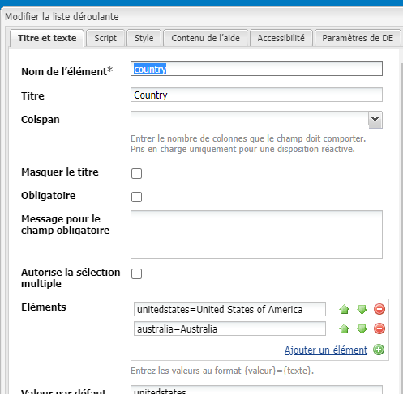

# Remplissage dynamique des listes déroulantes {#dynamically-populating-drop-down-lists}

## Prérequis {#prerequisites}

* [Création de lots OSGI](https://experienceleague.adobe.com/docs/experience-manager-learn/getting-started-wknd-tutorial-develop/overview.html?lang=fr&amp;CID=RedirectAEMCommunityKautuk)
* [Développement de composants AEM](https://experienceleague.adobe.com/docs/experience-manager-cloud-service/implementing/developing/full-stack/components-templates/overview.html?lang=fr#developing)
* [Création d’un formulaire adaptatif](creating-adaptive-form.md)
* [Création d’un formulaire adaptatif](introduction-forms-authoring.md)

## Procédure pour remplir de façon dynamique des listes déroulantes {#procedure-to-dynamically-populate-drop-down-lists}

Supposons que vous souhaitez remplir la liste déroulante **Etat** en fonction d’une valeur que vous sélectionnez dans la liste déroulante **Pays**. Si vous sélectionnez Australie dans la liste déroulante **Pays**, la liste déroulante **Etat** affiche les états de l’Australie. La procédure ci-dessous décrit la marche à suivre.

1. Créez un projet avec les modules suivants :

   * Le lot contenant la logique pour remplir la liste déroulante, qui dans ce cas est une servlet.
   * Le contenu, qui incorpore le fichier .jar et dispose d’une ressource déroulante. Le servlet pointe vers cette ressource.

1. Créez un servlet basé sur le paramètre de requête Pays, qui renvoie un tableau contenant les noms des états du pays.

   ```java
   @Component(metatype = false)
   @Service(value = Servlet.class)
   @Properties({
           @Property(name = "sling.servlet.resourceTypes", value = "/apps/populatedropdown"),
           @Property(name = "sling.servlet.methods", value = {"GET", "POST"}),
           @Property(name = "service.description", value = "Populate states drop-down based on country value")
   })
   public class DropDownPopulator extends SlingAllMethodsServlet {
       private Logger logger = LoggerFactory.getLogger(DropDownPopulator.class);
   
       protected void doPost(SlingHttpServletRequest request,
                             final SlingHttpServletResponse response)
               throws ServletException, IOException {
           response.setHeader("Access-Control-Allow-Origin", "*");
           response.setContentType("application/json");
           response.setCharacterEncoding("UTF-8");
           try {
               String US_STATES[] = {"0=Alabama",
                       "1=Alaska",
                       "2=Arizona",
                       "3=Arkansas",
                       "4=California",
                       "5=Colorado",
                       "6=Connecticut",
                       "7=Delaware",
                       "8=Florida",
                       "9=Georgia",
                       "10=Hawaii",
                       "11=Idaho",
                       "12=Illinois",
                       "13=Indiana",
                       "14=Iowa",
                       "15=Kansas",
                       "16=Kentucky",
                       "17=Louisiana",
                       "18=Maine",
                       "19=Maryland",
                       "20=Massachusetts",
                       "21=Michigan",
                       "22=Minnesota",
                       "23=Mississippi",
                       "24=Missouri",
                       "25=Montana",
                       "26=Nebraska",
                       "27=Nevada",
                       "28=New Hampshire",
                       "29=New Jersey",
                       "30=New Mexico",
                       "31=New York",
                       "32=North Carolina",
                       "33=North Dakota",
                       "34=Ohio",
                       "35=Oklahoma",
                       "36=Oregon",
                       "37=Pennsylvania",
                       "38=Rhode Island",
                       "39=South Carolina",
                       "40=South Dakota",
                       "41=Tennessee",
                       "42=Texas",
                       "43=Utah",
                       "44=Vermont",
                       "45=Virginia",
                       "46=Washington",
                       "47=West Virginia",
                       "48=Wisconsin",
                       "49=Wyoming"};
               String AUSTRALIAN_STATES[] = {"0=Ashmore and Cartier Islands",
                       "1=Australian Antarctic Territory",
                       "2=Australian Capital Territory",
                       "3=Christmas Island",
                       "4=Cocos (Keeling) Islands",
                       "5=Coral Sea Islands",
                       "6=Heard Island and McDonald Islands",
                       "7=Jervis Bay Territory",
                       "8=New South Wales",
                       "9=Norfolk Island",
                       "10=Northern Territory",
                       "11=Queensland",
                       "12=South Australia",
                       "13=Tasmania",
                       "14=Victoria",
                       "15=Western Australia"};
               String country = request.getParameter("country");
               JSONArray stateJsonArray = new JSONArray();
               if (country.length() > 0) {
                   if ("australia".equalsIgnoreCase(country)) {
                       stateJsonArray = new JSONArray();
                       for (String state : AUSTRALIAN_STATES) {
                           stateJsonArray.put(state);
                       }
                   } else if ("unitedstates".equalsIgnoreCase(country)) {
                       stateJsonArray = new JSONArray();
                       for (String state : US_STATES) {
                           stateJsonArray.put(state);
                       }
                   }
                   response.setContentType("application/json");
                   response.getWriter().write(stateJsonArray.toString());
               }
   
           } catch ( Exception e) {
               logger.error(e.getMessage(), e);
           }
       }
   }
   ```

1. Créez un nœud de liste déroulante sous une hiérarchie de dossiers spécifique dans les applications (par exemple, créez un nœud sous /apps/myfolder/demo). Veillez à ce que le paramètre `sling:resourceType` du nœud soit identique à celui vers lequel la servlet pointe (/apps/populatedropdown).

   

1. Regroupez le noeud de contenu et incorporez le fichier .jar à un emplacement spécifique (par exemple, /apps/myfolder/demo/install/). Déployez le même fichier sur le serveur.
1. Créez un formulaire adaptatif et ajoutez deux listes déroulantes, Pays et État, à ce dernier. La liste Pays peut inclure les noms des pays. La liste Etat peut remplir de manière dynamique les noms des états du pays sélectionné dans la première liste.

   Ajoutez les noms des pays à afficher dans la liste Pays. Dans la liste Etat, ajoutez un script pour la remplir en fonction du nom du pays dans la liste Pays.

     

   ```javascript
   JSON.parse(
       $.ajax({
           url: "/apps/myfolder/demo/dropdown",
           type: "POST",
           async: false,
           data: {"country": country.value},
            success: function(res){},
            error : function (message) {
                 guideBridge._guide.logger().log(message);
                 successFlag = false;
                 }
              })
   .responseText);
   ```

Le package de contenu qui contient un exemple de formulaire adaptatif (demo/AFdemo) avec le code ci-dessus implémenté.

[Obtenir le fichier](assets/dropdown-demo-content-1.0.1-snapshot.zip)


>[!MORELIKETHIS]
>
>* [Préremplir les champs de formulaire adaptatif](/help/forms/prepopulate-adaptive-form-fields.md)
