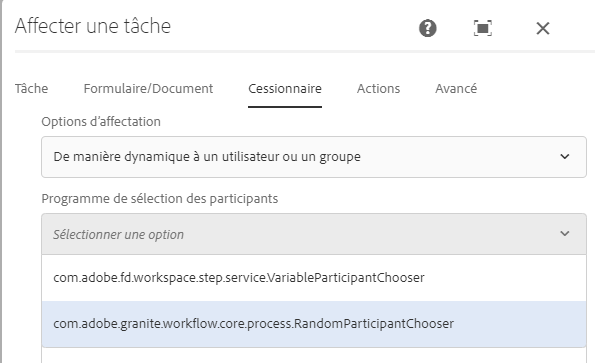

# Sélection dynamique d’utilisateurs ou de groupes dans AEM workflow {#dynamically-select-a-user-or-group-for-aem-forms-centric-workflow-steps}

Découvrez comment sélectionner un utilisateur ou un groupe pour un workflow [!DNL AEM Forms] au moment de l’exécution.

Dans les grandes organisations, il est nécessaire de sélectionner dynamiquement les utilisateurs et utilisatrices pour un processus. On peut par exemple sélectionner un agent ou une agente de terrain pour servir un client ou une cliente en fonction de leur proximité. Dans un tel scénario, la sélection de l’agent ou de l’agente est dynamique.

Les étapes Affecter une tâche et [!DNL Adobe Sign] des [processus basés sur l’utilisation de Forms sur OSGi](aem-forms-workflow.md) fournissent des options pour sélectionner de manière dynamique un utilisateur. Vous pouvez utiliser des bundles ECMAScript ou OSGi pour sélectionner de manière dynamique une personne désignée pour l’étape Affecter une tâche ou pour sélectionner des signataires pour l’étape Signer un document.

## Utilisation de ECMAScript pour sélectionner de manière dynamique un utilisateur ou un groupe {#use-ecmascript-to-dynamically-select-a-user-or-group}

ECMAScript est un langage de script. Il est utilisé pour les applications de script et de serveur côté client. Suivez les étapes ci-après pour sélectionner dynamiquement un utilisateur, une utilisatrice ou un groupe à l’aide d’ECMAScript :

1. Ouvrez CRXDE Lite. L’URL est `https://'[server]:[port]'/crx/de/index.jsp`
1. Créez un fichier avec l’extension .ecma à l’emplacement suivant. Si le chemin d’accès (structure du nœud) n’existe pas, créez-le :

   * (Chemin de l’étape Affecter une tâche) `/apps/fd/dashboard/scripts/participantChooser`
   * (Chemin de l’étape Signature) `/apps/fd/workflow/scripts/adobesign`

1. Ajoutez ECMAScript, qui possède la logique pour sélectionner dynamiquement une personne, au fichier .ecma. Cliquez sur **[!UICONTROL Enregistrer tout]**.

   Pour des exemples de script, voir [Exemples de ECMAScript pour la sélection dynamique d’un utilisateur ou d’un groupe](dynamically-select-a-user-or-group-for-aem-workflow.md#sample-ecmascripts-to-dynamically-choose-a-user-or-a-group).

1. Ajoutez le nom d’affichage du script. Ce nom s’affiche dans les étapes du workflow. Pour spécifier le nom :

   1. Développez le nœud du script, cliquez avec le bouton droit de la souris sur **[!UICONTROL jcr:content]**, puis cliquez sur **[!UICONTROL Mixins]**.
   1. Ajoutez la propriété `mix:title` dans la boîte de dialogue Modifier les mixins et cliquez sur **OK**.
   1. Ajoutez la propriété suivante au nœud de script jcr:content :

      | Nom | Type | Valeur |
      |--- |--- |--- |
      | jcr:title | Chaîne | Indiquez le nom du script. Par exemple, sélectionnez l’agent ou agente de terrain se situant le plus près. Ce nom s’affiche dans les étapes Affecter une tâche et Signer un document. |

   1. Cliquez sur **Enregistrer tout**. Le script peut être sélectionné dans les composants du workflow AEM.

      

### Exemples de ECMAScript pour sélectionner de manière dynamique un utilisateur ou un groupe {#sample-ecmascripts-to-dynamically-choose-a-user-or-a-group}

L’exemple ECMAScript suivant sélectionne de manière dynamique une personne désignée pour l’étape Affecter une tâche. Dans ce script, une personne est sélectionnée en fonction du chemin de la payload. Avant d’utiliser ce script, veillez à ce que toutes les personnes mentionnées dans le script existent dans AEM. Dans le cas contraire, le processus associé peut échouer.

```javascript
function getParticipant() {

var workflowData = graniteWorkItem.getWorkflowData();

if (workflowData.getPayloadType() == "JCR_PATH") { 

var path = workflowData.getPayload().toString(); 
     if (path.indexOf("/content/geometrixx/en") == 0) {
    return "user1";
    } 
   else {
              return "user2";
            }
}
}
```

L’exemple ECMAScript suivant sélectionne de manière dynamique une personne désignée pour l’étape [!DNL Adobe Sign]. Avant d’utiliser le script ci-dessous, assurez-vous que les coordonnées (adresses e-mails et numéros de téléphone) renseignées dans le script sont correctes. Dans le cas contraire, le processus associé peut échouer.

>[!NOTE]
>
>Lors de l’utilisation de ECMAScript pour [!DNL Adobe Sign], le script doit se trouver dans le référentiel crx à l’adresse /apps/fd/workflow/scripts/adobesign/ et doit disposer d’une fonction appelée getAdobeSignRecipients pour renvoyer une liste des utilisateurs.

```javascript
function getAdobeSignRecipients() {

    var recipientSetInfos = new Packages.java.util.ArrayList();

    var recipientInfoSet = new com.adobe.aem.adobesign.recipient.RecipientSetInfo();
    var recipientInfoList = new Packages.java.util.ArrayList();
    var recipientInfo = new com.adobe.aem.adobesign.recipient.RecipientInfo();

    var email;
    var recipientAuthenticationMethod = com.adobe.aem.adobesign.recipient.RecipientAuthenticationMethod.PHONE;  
    //var recipientAuthenticationMethod = com.adobe.aem.adobesign.recipient.RecipientAuthenticationMethod.NONE;
    var securityOptions = null;

    var phoneNumber = "123456789";
    var countryCode = "+1";
    var recipientPhoneInfo = new Array();
    recipientPhoneInfo.push(new com.adobe.aem.adobesign.recipient.RecipientPhoneInfo(phoneNumber, countryCode));

     securityOptions = new com.adobe.aem.adobesign.recipient.RecipientSecurityOption(recipientAuthenticationMethod, recipientPhoneInfo , null);
    
    email = "example@example.com";
    
    recipientInfo.setEmail(email);
    recipientInfo.setSecurityOptions(securityOptions);
    
    recipientInfoList.add(recipientInfo);
    recipientInfoSet.setMemberInfos(recipientInfoList);
    recipientSetInfos.add(recipientInfoSet);

    return recipientSetInfos;

}
```

## Utilisation de l’interface Java pour sélectionner de manière dynamique un utilisateur ou un groupe {#use-java-interface-to-dynamically-choose-a-user-or-group}

Vous pouvez utiliser l’interface Java [RecipientInfoSpecifier](https://developer.adobe.com/experience-manager/reference-materials/6-5/forms/javadocs/com/adobe/fd/workflow/adobesign/api/RecipientInfoSpecifier.html) pour choisir de manière dynamique un utilisateur ou un groupe pour les étapes [!DNL Adobe Sign] et Affecter une tâche. Vous pouvez créer un bundle OSGi qui utilise l’interface Java [RecipientInfoSpecifier](https://developer.adobe.com/experience-manager/reference-materials/6-5/forms/javadocs/com/adobe/fd/workflow/adobesign/api/RecipientInfoSpecifier.html) et la déploie sur le serveur [!DNL AEM Forms]. Cela rend disponible à la sélection l’option dans les composants Affecter une tâche et [!DNL Adobe Sign] du processus AEM.

Vous avez besoin des fichiers jar [[!DNL AEM Forms] Client SDK](https://experienceleague.adobe.com/docs/experience-manager-release-information/aem-release-updates/forms-updates/aem-forms-releases.html?lang=fr) et [granite jar](https://repo1.maven.org/maven2/com/adobe/granite/com.adobe.granite.workflow.api/1.0.2/) pour compiler l’exemple de code répertorié ci-dessous. Ajoutez ces fichiers jar en tant que dépendances externes au projet de bundle OSGi. Vous pouvez utiliser n’importe quel IDE Java pour créer un bundle OSGi. La procédure suivante décrit l’utilisation d’Eclipse pour créer un bundle OSGi :

1. Ouvrez Eclipse IDE. Accédez à **[!UICONTROL Fichier]** > **[!UICONTROL Nouveau projet]**.
1. Dans l’écran Sélectionner un assistant, sélectionnez **[!UICONTROL Projet Maven]**, puis cliquez sur **[!UICONTROL Suivant]**.
1. Sur le nouveau projet Maven, conservez les valeurs par défaut, puis cliquez sur **[!UICONTROL Suivant]**. Sélectionnez un archétype et cliquez sur **[!UICONTROL Suivant]**. Par exemple, maven-archetype-quickstart. Indiquez l’**[!UICONTROL ID de groupe]**, l’**[!UICONTROL ID d’artefact]**, la **[!UICONTROL version]** et le **[!UICONTROL package]** du projet, puis cliquez sur **[!UICONTROL Terminer]**. Le projet est créé.
1. Ouvrez le fichier pom.xml pour modifier et remplacer tout le contenu du fichier par ce qui suit :

   ```xml
   <project xmlns="https://maven.apache.org/POM/4.0.0" xmlns:xsi="https://www.w3.org/2001/XMLSchema-instance"
       xsi:schemaLocation="https://maven.apache.org/POM/4.0.0 https://maven.apache.org/xsd/maven-4.0.0.xsd">
       <modelVersion>4.0.0</modelVersion>
   
       <groupId>getAgent</groupId>
       <artifactId>assignToAgent</artifactId>
       <version>1.0</version>
       <packaging>bundle</packaging><!-- packaging type bundle is must -->
   
       <name>assignToAgent</name>
       <url>https://maven.apache.org</url>
       <repositories>
           <repository>
               <id>adobe</id>
               <name>Adobe Public Repository</name>
               <url>https://repo1.maven.org/maven2/com/adobe/</url>
               <layout>default</layout>
           </repository>
       </repositories>
       <pluginRepositories>
           <pluginRepository>
               <id>adobe</id>
               <name>Adobe Public Repository</name>
               <url>https://repo1.maven.org/maven2/com/adobe/</url>
               <layout>default</layout>
           </pluginRepository>
       </pluginRepositories>
   
       <dependencies>
           <dependency>
               <groupId>com.adobe.aemfd</groupId>
               <artifactId>aemfd-client-sdk</artifactId>
               <version>6.0.138</version>
           </dependency>
           <dependency>
               <groupId>com.adobe.granite</groupId>
               <artifactId>com.adobe.granite.workflow.api</artifactId>
               <version>1.0.0</version>
           </dependency>
   
           <dependency>
               <groupId>org.osgi</groupId>
               <artifactId>org.osgi.core</artifactId>
               <version>4.2.0</version>
               <scope>provided</scope>
           </dependency>
   
           <dependency>
               <groupId>org.apache.felix</groupId>
               <artifactId>org.apache.felix.scr.annotations</artifactId>
               <version>1.7.0</version>
   
           </dependency>
   
           <dependency>
               <groupId>org.apache.sling</groupId>
               <artifactId>org.apache.sling.api</artifactId>
               <version>2.2.0</version>
   
           </dependency>
   
       </dependencies>
   
       <!-- ====================================================================== -->
       <!-- B U I L D D E F I N I T I O N -->
       <!-- ====================================================================== -->
       <build>
           <plugins>
   
               <plugin>
                   <groupId>org.apache.felix</groupId>
                   <artifactId>maven-bundle-plugin</artifactId>
                   <extensions>true</extensions>
                   <configuration>
                       <instructions>
                           <Bundle-SymbolicName>com.aem.assigntoAgent-bundle</Bundle-SymbolicName>
                       </instructions>
                   </configuration>
               </plugin>
   
               <plugin>
                   <groupId>org.apache.felix</groupId>
                   <artifactId>maven-scr-plugin</artifactId>
                   <version>1.9.0</version>
                   <executions>
                       <execution>
                           <id>generate-scr-descriptor</id>
                           <goals>
                               <goal>scr</goal>
                           </goals>
                       </execution>
                   </executions>
               </plugin>
           </plugins>
       </build>
   
   </project>
   ```

1. Ajoutez un code source qui utilise l’interface Java [RecipientInfoSpecifier](https://developer.adobe.com/experience-manager/reference-materials/6-5/forms/javadocs/com/adobe/fd/workflow/adobesign/api/RecipientInfoSpecifier.html) pour choisir dynamiquement une personne ou un groupe pour l’étape Affecter une tâche. Pour consulter un exemple de code, rendez-vous sur [Exemple de choix dynamique d’une personne ou d’un groupe à l’aide de l’interface Java](#-sample-scripts-for).
1. Ouvrez une invite de commande et accédez au répertoire contenant le projet de bundle OSGi. Utilisez la commande suivante pour créer le bundle OSGi :

   `mvn clean install`

1. Chargez le bundle sur un serveur [!DNL AEM Forms]. Vous pouvez utiliser le gestionnaire de packages AEM pour importer le bundle sur le serveur [!DNL AEM Forms].

Une fois le bundle importé, l’option de sélection de l’interface Java pour sélectionner de manière dynamique un utilisateur ou un groupe devient disponible pour les étapes Adobe Sign et Affecter une tâche.

### Exemples de code Java pour sélectionner de manière dynamique un utilisateur ou un groupe {#sample-java-code-to-dynamically-choose-a-user-or-a-group}

L’exemple de code suivant sélectionne de manière dynamique une personne désignée pour l’étape Adobe Sign. Utilisez le code dans un bundle OSGi. Avant d’utiliser le code répertorié ci-dessous, assurez-vous que les coordonnées (adresses e-mails et numéros de téléphone) renseignées dans le code sont correctes. Dans le cas contraire, le processus associé peut échouer.

```java
/*************************************************************************

 *
 * ADOBE CONFIDENTIAL
 * __________________
 *
 * Copyright 2016 Adobe Systems Incorporated
 * All Rights Reserved.
 *
 * NOTICE:  All information contained herein is, and remains
 * the property of Adobe Systems Incorporated and its suppliers,
 * if any.  The intellectual and technical concepts contained
 * herein are proprietary to Adobe Systems Incorporated and its
 * suppliers and are protected by trade secret or copyright law.
 * Dissemination of this information or reproduction of this material
 * is strictly forbidden unless prior written permission is obtained
 * from Adobe Systems Incorporated.
 **************************************************************************/
 
package com.aem.impl;

import java.util.ArrayList;
import java.util.List;

import com.adobe.aem.adobesign.recipient.RecipientAuthenticationMethod;
import com.adobe.aem.adobesign.recipient.RecipientInfo;
import com.adobe.aem.adobesign.recipient.RecipientPhoneInfo;
import com.adobe.aem.adobesign.recipient.RecipientSecurityOption;
import com.adobe.aem.adobesign.recipient.RecipientSetInfo;
import com.adobe.fd.workflow.adobesign.api.RecipientInfoSpecifier;
import com.adobe.granite.workflow.WorkflowException;
import com.adobe.granite.workflow.WorkflowSession;
import com.adobe.granite.workflow.exec.WorkItem;
import com.adobe.granite.workflow.metadata.MetaDataMap;
import org.apache.felix.scr.annotations.Component;
import org.apache.felix.scr.annotations.Service;

/**
 * <code>DummyRecipientInfoSpecifier implementation. A sample code to write implementation of RecipientInfoSpecifier to choose recipients/code>...
 */
@Service

@Component(metatype = false)
public class DummyRecipientChoser implements RecipientInfoSpecifier {
    public List<RecipientSetInfo> getAdobeSignRecipients(WorkItem workItem, WorkflowSession workflowSession, MetaDataMap args) throws WorkflowException {

        List<RecipientSetInfo> recipientSetInfos = new ArrayList<RecipientSetInfo>();

                //First Recipient

                RecipientSetInfo recipientInfoSet1 = new RecipientSetInfo();
                List<RecipientInfo> recipientInfoList = new ArrayList<RecipientInfo>();
                RecipientInfo recipientInfo1 = new RecipientInfo();//Member to first recipient

                String email;

                RecipientAuthenticationMethod recipientAuthenticationMethod = RecipientAuthenticationMethod.WEB_IDENTITY;
                RecipientSecurityOption securityOptions = null;

                String phoneNumber = "123456789";
                String countryCode = "+1";
                RecipientPhoneInfo[] recipientPhoneInfo = new RecipientPhoneInfo[1];  //if multiple phone numbers, size>1
                recipientPhoneInfo[0] = new RecipientPhoneInfo(phoneNumber, countryCode);
                securityOptions = new RecipientSecurityOption(recipientAuthenticationMethod, recipientPhoneInfo , null);
                 
                email = "example@example.com";

                recipientInfo1.setEmail(email);
                recipientInfo1.setSecurityOptions(securityOptions);

                recipientInfoList.add(recipientInfo1);  //Add member

                recipientInfoSet1.setMemberInfos(recipientInfoList);

                //Second Recipient

                RecipientSetInfo recipientInfoSet2 = new RecipientSetInfo();
                List<RecipientInfo> recipientInfoList2 = new ArrayList<RecipientInfo>();

                recipientAuthenticationMethod = RecipientAuthenticationMethod.PHONE;
                securityOptions = null;
                 
                phoneNumber = "987654321";//"0123456789";

                countryCode = "+1";
                RecipientPhoneInfo[] recipientPhoneInfo_1 = new RecipientPhoneInfo[1];
                recipientPhoneInfo_1[0] = new RecipientPhoneInfo(phoneNumber, countryCode);
                securityOptions = new RecipientSecurityOption(recipientAuthenticationMethod, recipientPhoneInfo_1 , null);
                 
                email = "example2@example.com";//"dummymail2@domain.com";

                RecipientInfo recipientInfo2  = new RecipientInfo();
                recipientInfo2.setEmail(email);
                recipientInfo2.setSecurityOptions(securityOptions);

                recipientInfoList2.add(recipientInfo2);  //Add member

                recipientInfoSet2.setMemberInfos(recipientInfoList2);

                //*********************************

                recipientSetInfos.add(recipientInfoSet1); 
                recipientSetInfos.add(recipientInfoSet2);

        return recipientSetInfos;

    }

}
```

>[!MORELIKETHIS]
>
>* [Utiliser le workflow AEM Forms pour l’automatisation des processus d’entreprise](/help/forms/aem-forms-workflow.md)