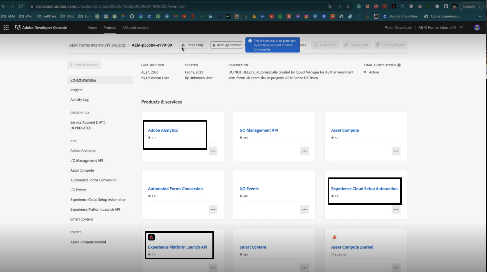

# (Obsolète) Activer Adobe Analytics pour un formulaire adaptatif à l’aide de l’automatisation de la configuration d’Experience Cloud {#integrate-adobe-analytics-to-aem-forms-with-experience-cloud-setup-automation}

>[!CAUTION]
>
>La fonctionnalité Automatisation de la configuration d’Experience Cloud est obsolète.


| Version | Lien de l’article |
| -------- | ---------------------------- |
| AEM as a Cloud Service | Cet article |
| AEM 6.5 | [Cliquez ici](https://experienceleague.adobe.com/docs/experience-manager-65/forms/integrate-aem-forms-with-experience-cloud-solutions/configure-analytics-forms-documents.html?lang=fr) |

L’automatisation de la configuration d’Experience Cloud permet de connecter Adobe Analytics à Adaptive Forms, ce qui permet d’analyser rapidement les interactions des utilisateurs avec vos formulaires et d’obtenir des informations sur les interactions et l’engagement des visiteurs. L’automatisation de la configuration d’Experience Cloud permet également de surveiller les performances des formulaires, ce qui implique d’évaluer des mesures telles que les délais d’achèvement et les points de dépôt. Cette analyse permet d’optimiser les formulaires pour une meilleure expérience utilisateur, tout en distinguant le comportement des utilisateurs et utilisatrices en fonction du statut de connexion, par exemple les utilisateurs et utilisatrices anonymes, afin d’identifier les tendances et les modèles généraux.

## Avantages de l’intégration d’Adobe Analytics à Adaptive Forms {#advantages-of-integrating-adobe-analytics-with-aem-forms}

* **Informations sur le comportement de l’utilisateur final** : Adobe Analytics permet d’obtenir des informations sur le comportement de l’utilisateur final, révèle les actions de l’utilisateur, les abandons et les taux d’achèvement, ce qui permet de mieux comprendre la manière dont les individus interagissent avec les formulaires.
* **Permettre aux utilisateurs professionnels non techniques d’obtenir des informations** : Adobe Analytics grâce à son interface facile à utiliser, permet aux utilisateurs non techniques d’accéder aux données d’utilisation des formulaires et de les interpréter, ce qui favorise les décisions axées sur les données pour améliorer les expériences d’inscription.
* **Optimisation de l’expérience de capture de données en fonction de l’utilisation** : les entreprises identifient facilement les points faibles de la capture de données, ce qui conduit à des améliorations ciblées qui améliorent la convivialité du formulaire et augmentent les envois réussis.

## Portée des mesures d’utilisation de Forms adaptatif {#scope-of-adaptive-forms-usage-metrics}

Adobe Analytics propose un tableau complet de mesures de performances de Forms adaptatif, conçu pour fournir des informations précieuses sur l’utilisation des formulaires et propose des analyses de suivi rapide. Ces mesures sont les suivantes :

* **Rendus de formulaire, envois de formulaire, erreurs de validation et visiteurs uniques**, ce qui vous permet d’évaluer l’utilisation et l’efficacité de vos formulaires.

* **Informations sur les visiteurs** qui englobent les fréquences de visite et d’envoi, ainsi que le nombre de visiteurs uniques, offrant ainsi une vue complète de l’audience de votre formulaire.

* **Type d’appareil** données qui vous informent sur les appareils utilisés par les utilisateurs pour accéder à vos formulaires.

* La **Répartition géographique** révèle la répartition régionale des utilisateurs de vos formulaires.

* Les mesures **Sources de trafic** et **Formulaires populaires** qui consistent en les domaines référents les plus fréquents et les formulaires les plus visités, vous aident à comprendre d’où provient votre trafic et quels formulaires sont les plus populaires.

* **L’activité des utilisateurs sur les meilleurs formulaires** fournit des informations sur les visites de champ, les rendus de formulaire, les erreurs de validation, les formulaires abandonnés et les envois de formulaire, ce qui vous permet d’analyser le comportement des utilisateurs.

* **Chronologie pour le temps passé sur les formulaires** qui offre une vue chronologique de l’interaction des utilisateurs et utilisatrices avec vos formulaires.

* **Zones nécessitant l’assistance des visiteurs** mesures comprenant des vues d’aide, des instances d’erreur de validation et la fréquence des visites sur le terrain, ce qui met en évidence les endroits où les utilisateurs peuvent avoir besoin d’aide pour remplir des formulaires.

{width="100%"}


Pour obtenir des informations détaillées sur chaque mesure, consultez [Affichage et compréhension des rapports AEM Forms Analytics](/help/forms/view-understand-aem-forms-analytics-reports.md)

## Prérequis {#prerequisites}

<!--
Analytics, Data Collection (Formerly Adobe Launch), and Experience Manager (experience.adobe.com)
-->

L’automatisation de la configuration d’Experience Cloud nécessite une **licence Adobe Analytics**, **collecte de données (anciennement Adobe Launch)** pour gérer les scripts de suivi et **licence Experience Manager Forms** pour rationaliser l’agrégation des données et la génération d’insight.

Si vous disposez d’une licence active pour **Adobe Analytics** et **Experience Manager Forms**, et que vous disposez d’une intégration à **Collecte de données (anciennement Adobe Launch)**, vous devez vérifier leur disponibilité dans votre console de développement.

Pour vérifier que les éléments ci-dessus sont disponibles pour votre environnement Forms as a Cloud Service, accédez à la [ Developer Console ](https://developer.adobe.com/console/projects), accédez au projet et recherchez votre projet avec l’ID de programme - ID d’environnement, par exemple, pour l’environnement avec l’URL `https://author-p45913-e175111-cmstg.adobeaemcloud.com/index.html`, l’ID de programme - ID d’environnement est `p45913-e175111`. Vérifiez que les API Experience Cloud Setup Automation, Adobe Analytics et Experience Platform Launch sont répertoriées. S’ils sont répertoriés, vous pouvez activer Adobe Analytics pour une analyse accélérée de votre Forms adaptatif.

{width="100%"}

<!-- 
>[!NOTE]
> If you have an active licenses for Experience Cloud Setup Automation, Adobe Analytics, and Experience Platform Launch API, you should verify their availability within your developer console.
-->

<!-- For more information about your available integrations, see [troubleshooting Adaptive Forms with Analytics Integration](https://experienceleague.adobe.com/docs/experience-manager-65/forms/integrate-aem-forms-with-experience-cloud-solutions/view-understand-aem-forms-analytics-reports.html?lang=fr)
-->

## Configuration d’Adobe Analytics {#configure-adobe-analytics}

Suivez les étapes ci-dessous pour activer et configurer Adobe Analytics pour une analyse accélérée de votre Forms adaptatif :

* [Activation d’Adobe Analytics pour le Forms adaptatif en fonction des composants de base](#integrate-adobe-analytics-with-aem-forms-for-foundation-component)
* [Activation d’Adobe Analytics pour le Forms adaptatif en fonction des composants principaux](#integrate-adobe-analytics-with-aem-forms-for-core-components)

>[!VIDEO](https://video.tv.adobe.com/v/3424577/enable-adobe-analytics/?quality=12&learn=on)


<!--
>[!NOTE]
>
> This is the demo video for **Foundation Component**. In **Core Component** you are required to perform similar steps but the container is not chosen for forms.
-->

### Activation d’Adobe Analytics avec le composant Adaptive Forms for Foundation {#integrate-adobe-analytics-with-aem-forms-for-foundation-component}

1. Créez un conteneur de configurations pour les services cloud :
   1. Accédez à **[!UICONTROL Outils > Général > Navigateur de configuration]**.
   1. Sélectionnez ou créez un conteneur de configurations et activez le dossier pour **[!UICONTROL Configurations cloud]**.
   1. Sélectionnez **[!UICONTROL Enregistrer et fermer]** pour enregistrer la configuration et fermer la boîte de dialogue.
1. Sur votre instance AEM, accédez à **[Forms]** >> **[Forms et document]**.
1. Sélectionnez votre **[!UICONTROL Formulaire]** >> **[!UICONTROL Propriétés]**. Dans le **[!UICONTROL Conteneur de configurations]**, sélectionnez le conteneur de configurations que vous avez créé ou sélectionné dans le **[!UICONTROL Explorateur de configurations]** à l’étape 1.
1. Sélectionnez le Panneau Tâche sur le rail de gauche et cliquez sur **Configurer Analytics** et **Activer Adobe Analytics**.
1. Indiquez le nom de votre choix pour la suite de rapports, puis cliquez sur **[!UICONTROL Suivant]** et **[!UICONTROL Enregistrer]**.
1. Une fois le projet enregistré, la configuration s’exécute pendant un certain temps jusqu’à l’intégration d’Adobe Analytics à votre formulaire adaptatif. Vous pouvez également vérifier le **statut de l’intégration**.

   >[!NOTE]
   >
   >Si votre configuration dure plus de 15 minutes, réessayez d’activer les analyses pour vos formulaires.

1. Sur votre instance AEM, accédez à **[!UICONTROL Forms]** >> **[Forms et document]** et sélectionnez votre **[!UICONTROL Formulaire]**, vous pouvez voir qu’Adobe Analytics est intégré à votre formulaire, comme illustré dans l’image ci-dessous.
1. Vous pouvez maintenant afficher votre [rapport Adobe Analytics de formulaire adaptatif](#view-adobe-analytics-report).

{width="100%"}


### Activation d’Adobe Analytics avec le Forms adaptatif pour les composants principaux {#integrate-adobe-analytics-with-aem-forms-for-core-components}

1. Sur votre instance AEM, accédez à **[!UICONTROL Forms]** >> **[!UICONTROL Forms et document]** puis sélectionnez votre **[!UICONTROL Formulaire]**.
1. Sélectionnez le Panneau des tâches sur la gauche et cliquez sur **Configurer Analytics** et **Activer Adobe Analytics**.
1. Indiquez le nom de votre choix pour la suite de rapports, puis cliquez sur **[!UICONTROL Suivant]** et **[!UICONTROL Enregistrer]**.
1. Une fois le projet enregistré, la configuration s’exécute pendant un certain temps jusqu’à l’intégration d’Adobe Analytics à votre formulaire adaptatif. Vous pouvez également vérifier le **statut de l’intégration**.

   >[!NOTE]
   >
   >Si votre configuration dure plus de 15 minutes, réessayez d’activer les analyses pour vos formulaires.

1. Sur votre instance AEM, accédez à **[!UICONTROL Forms]** >> **[!UICONTROL Forms et document]** et sélectionnez votre **[!UICONTROL Formulaire]**, vous verrez qu’Adobe Analytics est intégré à votre formulaire.
1. Vous pouvez maintenant afficher votre [rapport Adobe Analytics de formulaire adaptatif](#view-adobe-analytics-report).

## Affichage du rapport Adobe Analytics de Forms adaptatif {#view-adobe-analytics-report}

1. Sur votre instance AEM, accédez à **[!UICONTROL Forms]** >> **[!UICONTROL Forms et document]**.
1. Sélectionnez votre formulaire, vous voyez qu’Adobe Analytics est intégré, comme illustré sur la gauche, au Forms activé pour Adobe Analytics.

   {width="100%"}

1. Cliquez sur **Adobe Analytics** pour afficher votre rapport et analyser les données de performances.

Pour connecter un formulaire adaptatif à Adobe Analytics à l’aide de la méthode manuelle, consultez [Intégration d’AEM Forms à Adobe Analytics](/help/forms/integrate-aem-forms-with-adobe-analytics.md).

## Activation d’Analytics vers le Forms adaptatif dans Sites {#Connect-Analytics-to-Adaptive-Forms-in-Sites}

La configuration des analyses de suivi rapide pour votre formulaire adaptatif dans AEM Sites vous permet d’effectuer le suivi des interactions utilisateur et des envois de formulaire sur votre formulaire dans une page Sites. En intégrant facilement des analyses dans votre Forms Sites, vous obtenez des informations précieuses sur le comportement des utilisateurs, les taux de conversion et les domaines à améliorer dans votre formulaire.

### Prérequis {#Prerequisites-to-connect-forms-analytics-to-sites}

Pour connecter et activer les analyses dans Forms adaptatif pour AEM Sites, vous devez vous assurer que votre AEM Sites dispose d’une Adobe Analytics active.

### Connexion au Forms adaptatif dans Sites pour activer Analytics {#Connect-analytics-to-adaptive-forms}

Pour connecter un formulaire adaptatif à une page AEM Sites afin d’activer Analytics pour une analyse de suivi rapide, incluez la bibliothèque cliente `customfooterlibs` à la page AEM Sites à l’aide de l’archétype AEM/du référentiel Git et du pipeline de déploiement.

1. Ouvrez votre projet [Archétype AEM Forms ou référentiel Git cloné](https://experienceleague.adobe.com/docs/experience-manager-core-components/using/developing/archetype/overview.html?lang=fr) dans un éditeur de texte. Par exemple, Visual Studio Code.

1. Accédez à la page de vos sites où se trouve votre formulaire adaptatif. Par exemple, dans ce projet de démonstration, nous avons `ui.apps/src/main/content/jcr_root/apps/corecomponents/components/page/.content.xml`.

1. Copiez la valeur de `sling:resourceSuperType`. Par exemple, la valeur est `core/wcm/components/page/v3/page`.

   {width="100%"}

1. Créez la structure similaire à l’emplacement `ui.apps/src/main/content/jcr_root/apps` identique à `core/wcm/components/page/v3/page`.

   {width="100%"}

1. Ajoutez un fichier `customfooterlibs.html`.

   ```
   // customheaderlibs.html
   <sly data-sly-use.page="com.adobe.cq.wcm.core.components.models.Page">
   <sly data-sly-test="${page.data && page.dataLayerClientlibIncluded}" data-sly-call="${clientlib.js @ categories='core.forms.components.commons.v1.datalayer', async=true}"></sly>
   </sly>
   ```

   Le `customfooterlibs.html` est utilisé pour JavaScript.

1. [Exécutez le pipeline](https://experienceleague.adobe.com/docs/experience-manager-cloud-service/content/sites/administering/site-creation/enable-front-end-pipeline.html?lang=fr) pour déployer les modifications.

### Activation des règles Form Analytics vers Forms dans Sites {#bind-forms-analytics-rules-to-forms-in-sites}

1. Consultez la **Collecte de données Adobe Experience Platform**.
1. Cliquez sur **Balises** sur le côté gauche.
1. Recherchez votre projet avec l’ID de programme comme illustré dans l’image ci-dessous, par exemple, pour l’environnement avec l’URL `https://author-p45921-e175111-cmstg.adobeaemcloud.com/index.html`, l’ID de programme est `45921`.

   {width="100%"}

1. Ajoutez une configuration pour **Règles de formulaire** et **Éléments de données** comme indiqué ci-dessous :

#### Ajouter des règles de formulaire {#form-rules}

1. Sélectionnez votre formulaire et ajoutez **Nouvelle propriété** en haut à droite, ou cliquez sur votre formulaire.
1. Sur la page des propriétés, cliquez sur **Règles** et sélectionnez les événements de votre formulaire. Dans l’exemple d’image ci-dessous, il s’agit de **Événements de formulaire**.

   {width="100%"}

1. Sélectionnez tous les événements du formulaire et de la **copie** qui se trouve dans le rail supérieur droit.
1. Une fois la copie effectuée, un pop-up **Copier la règle** s’affiche à l’endroit où vous recherchez votre page Sites avec l’ID de projet, pour coller les règles de formulaire.

   {width="100%"}

1. Cliquez sur **copier** pour coller les règles de formulaire dans la page Sites.

#### Ajouter des éléments de données {#data-elements}

1. Sélectionnez votre formulaire et ajoutez **Nouvelle propriété** en haut à droite, ou cliquez sur votre formulaire.
1. Sur la page des propriétés, cliquez sur **Éléments de données** et sélectionnez les événements de votre formulaire.
1. Sélectionnez tous les événements du formulaire et **copier** dans le rail supérieur droit.
1. Une fois la copie effectuée, un pop-up **Copier la règle** s’affiche à l’endroit où vous recherchez votre page Sites avec l’ID de projet, pour coller les règles de formulaire.
1. Cliquez sur **copier** pour coller les règles de formulaire dans la page Sites.

   {width="100%"}

Une fois que vous avez lié vos règles de formulaires et de sites par le biais des étapes mentionnées ci-dessus, effectuez les étapes suivantes pour activer Analytics sur votre formulaire adaptatif dans la page Sites :

1. Cliquez sur **Flux de publication** sur la gauche.
1. Cliquez sur **Ajouter une bibliothèque** et saisissez le nom de votre choix.
1. Dans le menu déroulant **Environnement** à droite, sélectionnez **développement**.
1. Cliquez sur **Add All Changed Resources** (Ajouter toutes les ressources modifiées).
1. Cliquez sur **Enregistrer et créer dans le développement**.

{width="100%"}


<!--

## Best Practices

1.    Verify that Adobe Analytics is enabled on all the forms activated for Adobe Analytics.

1.    Check the Adobe Analytics report periodically to gain insights into user behavior and form performance. For instance, you may set the cadence to 15 days or the period you prefer to choose for report analysis. This enables you to improve the forms enrollment experience.

1.    Enable Analytics for all or most of your forms for tracking and analyzing user interaction with your forms and to gain insights into visitor interactions and engagement.

1. Check your forms performance after you update your form fields or components.

1.    Share Analytics report with your peer groups for review, you can schedule your report for a later time.

-->

## Voir également {#see-also}

* [Consultation et compréhension des rapports d’analyse de Forms adaptatif](/help/forms/view-understand-aem-forms-analytics-reports.md)
* [Ajouter un formulaire adaptatif à une page AEM Sites ou un fragment d’expérience](/help/forms/create-or-add-an-adaptive-form-to-aem-sites-page.md)
* [Intégration d’AEM Forms à Adobe Analytics](/help/forms/integrate-aem-forms-with-adobe-analytics.md)
