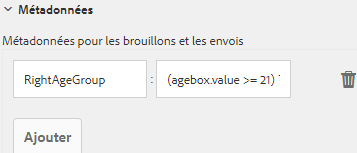
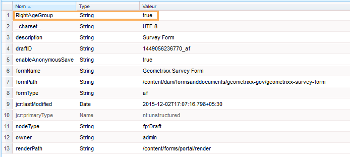
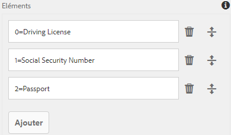
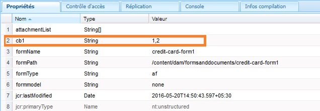

# Ajout d’informations à partir de données utilisateur aux métadonnées d’envoi de formulaire {#adding-information-from-user-data-to-form-submission-metadata}

Vous pouvez utiliser des valeurs saisies dans un élément de votre formulaire pour calculer les champs de métadonnées d’un brouillon ou d’un envoi de formulaire. Les métadonnées vous permettent de filtrer le contenu en fonction des données utilisateur. Par exemple, un utilisateur ou une utilisatrice saisit John Doe dans le champ de nom de votre formulaire. Vous pouvez utiliser ces informations pour calculer les métadonnées susceptibles de classer cet envoi sous les initiales JD.

Pour calculer les champs de métadonnées avec des valeurs saisies par l’utilisateur, ajoutez les éléments de votre formulaire aux métadonnées. Lorsqu’un utilisateur entre une valeur dans cet élément, un script utilise la valeur pour calculer les informations. Ces informations sont ajoutées dans les métadonnées. Lorsque vous ajoutez un élément sous la forme d’un champ de métadonnées, vous fournissez la clé correspondante. La clé est ajoutée en tant que champ dans les métadonnées et les informations calculées sont enregistrées en fonction de celle-ci.

Par exemple, une compagnie d’assurance maladie publie un formulaire. Dans ce formulaire, un champ capture l’âge des utilisateurs finaux. Le client ou la cliente souhaite vérifier tous les envois dans une tranche d’âge spécifique, après qu’un certain nombre d’utilisateurs et utilisatrices ont envoyé le formulaire. Plutôt que de parcourir toutes les données qui deviennent complexes à mesure que le nombre de formulaires augmente, des métadonnées supplémentaires aident le client ou la cliente. L’auteur du formulaire peut configurer les propriétés/données renseignées par l’utilisateur qui sont stockées au niveau supérieur afin que la recherche soit la plus facile. Les métadonnées supplémentaires sont des informations renseignées par l’utilisateur ou l’utilisatrice et stockées au niveau supérieur du nœud de métadonnées, tel que l’auteur ou l’autrice les a configurées.

Prenons un autre exemple de formulaire qui capture l’ID de l’e-mail et le numéro de téléphone. Lorsqu’un utilisateur visite ce formulaire de manière anonyme et abandonne le formulaire, l’auteur peut configurer le formulaire afin que l’ID d’adresse électronique et le numéro de téléphone soient automatiquement enregistrés. Ce formulaire est enregistré automatiquement et le numéro de téléphone et l’ID d’adresse électronique sont stockés dans le nœud de métadonnées du brouillon. Le tableau de bord de gestion des prospects représente un cas d’utilisation de cette configuration.

## Ajout d’éléments de formulaire aux métadonnées {#adding-form-elements-to-metadata}

Effectuez les étapes suivantes pour ajouter un élément aux métadonnées :

1. Ouvrez votre formulaire adaptatif en mode d’édition.\
   Pour ouvrir le formulaire en mode d’édition, dans Forms Manager, sélectionnez le formulaire, puis sélectionnez **[!UICONTROL Ouvrir]**.
1. En mode d’édition, sélectionnez un composant, sélectionnez  > **[!DNL Adaptive Form Container]**, puis .
1. Dans la barre latérale, cliquez sur **[!DNL Metadata]**.
1. Dans la section Métadonnées, cliquez sur **[!DNL Add]**.
1. Utilisez le champ Valeur de l’onglet Métadonnées pour ajouter des scripts. Les scripts que vous ajoutez collectent des données à partir d’éléments sur le formulaire et calculent les valeurs qui sont ajoutées aux métadonnées.

   Par exemple, la valeur **[!DNL true]** est enregistrée dans les métadonnées si l’âge entré est supérieur à 21, et la valeur **[!DNL false]** est enregistrée s’il est inférieur à 21. Vous entrez le script suivant dans l’onglet Métadonnées :

   `(agebox.value >= 21) ? true : false`

   

   Script entré dans l’onglet Métadonnées

1. Cliquez sur **[!DNL OK]**.

Une fois qu’un utilisateur a saisi des données dans l’élément sélectionné comme champ de métadonnées, les informations calculées sont enregistrées dans les métadonnées. Vous pouvez afficher les métadonnées dans le référentiel que vous avez configuré pour stocker les métadonnées.

## Affichage des métadonnées d’envoi de formulaire mises à jour : {#seeing-updated-form-nbsp-submission-metadata}

Pour l’exemple ci-dessus, les métadonnées sont stockées dans le référentiel CRX. Les métadonnées présentent l’aspect suivant :

Si vous ajoutez un élément de case à cocher dans les métadonnées, les valeurs sélectionnées sont stockées sous forme de chaîne séparée par des virgules. Par exemple, vous ajoutez un composant de case à cocher dans votre formulaire, puis indiquez son nom : `checkbox1`. Dans les propriétés du composant de case à cocher, vous ajoutez les éléments Permis de conduire, Numéro de sécurité sociale et Passeport pour les valeurs 0, 1 et 2.

Vous sélectionnez le conteneur de formulaires adaptatifs et dans les propriétés du formulaire vous ajoutez une clé de métadonnées `cb1` qui stocke `checkbox1.value`, puis vous publiez le formulaire. Lorsqu’un client ou une cliente remplit le formulaire, il sélectionne les options Passeport et Numéro de sécurité sociale dans le champ de case à cocher. Les valeurs 1 et 2 sont stockées sous la forme 1, 2 dans le champ cb1 des métadonnées d’envoi.

>[!NOTE]
>
>L’exemple ci-dessus est fourni uniquement à des fins d’apprentissage. Veillez à rechercher des métadonnées à l’emplacement correct, tel que configuré dans votre implémentation [!DNL Experience Manager Forms].