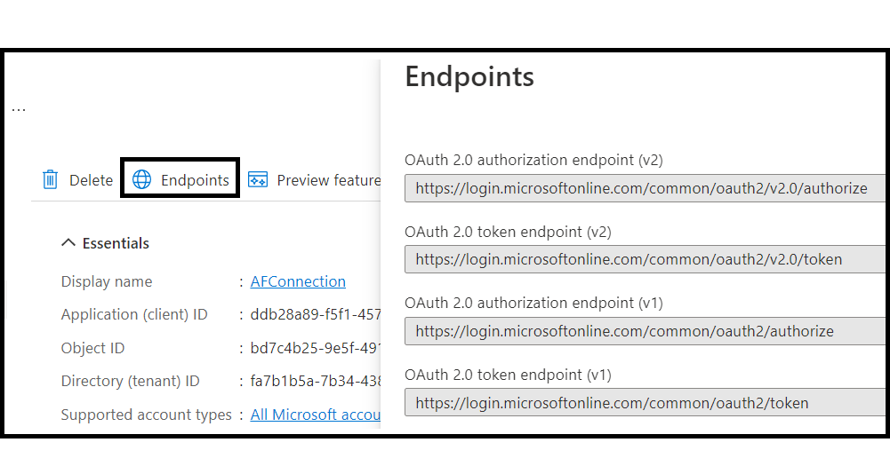
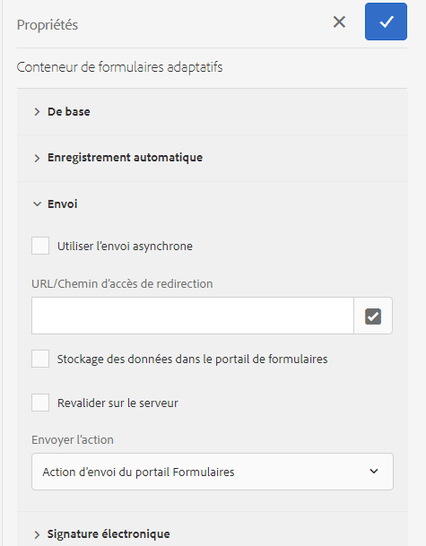

# Connecter un formulaire adaptatif à Microsoft® Power Automate {#connect-adaptive-form-with-power-automate}

Vous pouvez configurer un formulaire adaptatif pour exécuter un flux cloud Power Automate lors de l’envoi. Le formulaire adaptatif configuré envoie les données capturées, les pièces jointes et le document d’enregistrement au flux Cloud Power Automate pour traitement. Il vous permet de créer une expérience de capture de données personnalisée tout en tirant parti de la puissance de Microsoft® Power Automate pour élaborer des logiques commerciales autour des données capturées et automatiser les workflows client.

L’éditeur de Forms adaptatif fournit l’action d’envoi **Invoke a Microsoft® Power Automate flow** pour envoyer des données de formulaires adaptatifs, des pièces jointes et un document d’enregistrement sont envoyés à Power Automate Cloud Flow.

AEM as a Cloud Service propose différentes actions d’envoi prêtes à l’emploi pour gérer les envois de formulaire. Vous pouvez en savoir plus sur ces options dans l’article [Action d’envoi de formulaire adaptatif](/help/forms/configure-submit-actions-core-components.md) .


## Avantages

Voici quelques exemples de ce que vous pouvez faire après l’intégration d’un formulaire adaptatif à Microsoft® Power Automate :

* Utiliser des données de formulaires adaptatifs dans des processus d’entreprise Power Automate
* Utilisez Power Automate pour envoyer des données capturées à plus de 500 sources de données ou à toute API publique
* Exécuter des calculs complexes sur les données capturées
* Enregistrer des données de formulaires adaptatifs dans les systèmes de stockage selon un planning prédéfini

## Conditions préalables

Les éléments suivants sont requis pour connecter un formulaire adaptatif à Microsoft® Power Automate :

* Licence Premium Microsoft® Power Automate.
* [Flux Microsoft® Power Automate](https://learn.microsoft.com/fr-fr/power-automate/create-flow-solution) avec le déclencheur `When an HTTP request is received` pour accepter les données d’envoi de formulaire adaptatif.
* Utilisateur ou utilisatrice Experience Manager disposant de droits de [création](/help/forms/forms-groups-privileges-tasks.md) et d’[administration](/help/forms/forms-groups-privileges-tasks.md) de formulaires
* Compte utilisé pour se connecter à Microsoft® Power Automate étant propriétaire du flux Power Automate configuré pour recevoir des données du formulaire adaptatif

## Connecter votre instance Forms as a Cloud Service à Microsoft® Power Automate {#connect-forms-server-with-power-automate}

Effectuez les actions suivantes pour connecter votre instance Forms as a Cloud Service à Microsoft® Power Automate :

1. [Créer une Microsoft](#ms-power-automate-application)
1. [Créer Microsoft](#microsoft-power-automate-dataverse-cloud-configuration)
1. [Créer Microsoft](#create-microsoft-power-automate-flow-cloud-configuration)
1. [Publier Microsoft](#publish-microsoft-power-automate-dataverse-cloud-configuration)

### Créer une application Microsoft® Azure Active Directory {#ms-power-automate-application}

1. Connectez-vous au [Portail Azure](https://portal.azure.com/).
1. Sélectionnez [!UICONTROL Azure Active Directory] dans le volet de navigation de gauche.
1. Sur la page Répertoire par défaut, sélectionnez [!UICONTROL Enregistrement des applications] dans le panneau de gauche.
1. Sur la page Enregistrements des applications, cliquez sur Nouveaux enregistrements.
1. Spécifiez le nom, les types de compte pris en charge et l’URI de redirection sur la page. Dans l’URI de redirection, spécifiez ce qui suit et cliquez sur Enregistrer.
   * `https://[Forms as a Cloud Service Server]/libs/fd/powerautomate/content/dataverse/config.html`
   * `https://[Forms as a Cloud Service Server]/libs/fd/powerautomate/content/flowservice/config.html`

   

   >[!NOTE]
   >Vous pouvez également spécifier des URI de redirection supplémentaires, si nécessaire, à partir de la page Authentification.
   > Pour les types de compte pris en charge, sélectionnez un client unique, plusieurs clients ou un compte Microsoft® personnel, selon votre cas d’utilisation.


1. Sur la page Authentification, activez les options suivantes, puis cliquez sur Enregistrer.


   * Jetons d’accès (utilisés pour les flux implicites)
   * Jetons d’ID (utilisés pour les flux implicites et hybrides)

1. Sur la page des autorisations d’API, cliquez sur `Add a permission`.

1. Sous Microsoft® API, sélectionnez le `Power Automate` et sélectionnez les autorisations suivantes.
   * Flows.Manage.All
   * Flows.Read.All
   * Autorisation GCC (facultative si vous souhaitez vous connecter à un client GCC (Government Cloud Computing)
Cliquez sur `Add permissions` pour enregistrer les autorisations.
1. Sur la page des autorisations d’API, cliquez sur `Add a permission`. Sélectionnez les API que mon entreprise utilise et recherchez `DataVerse` et activez les autorisations de `user_impersonation` clic `Add`.
1. (Facultatif) Sur la page Certificats et secrets, cliquez sur Nouveau secret client. Dans l’écran Ajouter un secret client, fournissez une description et un délai d’expiration du secret, puis cliquez sur Ajouter. Une chaîne secrète est générée.
1. Conservez une note spécifique à l’[URL de l’environnement Dynamics](https://docs.microsoft.com/fr-fr/power-automate/web-api#compose-http-request) de votre organisation.

### Créez une configuration cloud de Dataverse de Microsoft® Power Automate. {#microsoft-power-automate-dataverse-cloud-configuration}

1. Dans l’instance de création AEM Forms, accédez à **[!UICONTROL Outils]**  > **[!UICONTROL Général]** > **[!UICONTROL Navigateur de configuration]**.
1. Sur la page du **[!UICONTROL navigateur de configuration]**, sélectionnez **[!UICONTROL Créer]**.
1. Dans la boîte de dialogue **[!UICONTROL Créer une configuration]**, indiquez un **[!UICONTROL titre]** pour la configuration, activez **[!UICONTROL Configurations cloud]** et sélectionnez **[!UICONTROL Créer]**. Un conteneur de configurations pour Cloud Services est ainsi créé. Vérifiez que le nom du dossier ne contient aucun espace.
1. Accédez à **[!UICONTROL Outils]**  > **[!UICONTROL Services cloud]** > **[!UICONTROL Dataverse de Microsoft® Power Automate]** et ouvrez le conteneur de configurations que vous avez créé à l’étape précédente.


   >[!NOTE]
   >
   >Lorsque vous créez un formulaire adaptatif, indiquez le nom du conteneur dans le champ **[!UICONTROL Conteneur de configurations]**.

1. Sur la page de configuration, sélectionnez **[!UICONTROL Créer]** pour créer une configuration [!DNL Microsoft® Power Automate Flow Service] dans AEM Forms.
1. Sur la page **[!UICONTROL Configurer le service Dataverse pour Microsoft® Power Automate]**, indiquez l’**[!UICONTROL ID client]** (également appelé ID de l’application), le **[!UICONTROL Secret client]**, l’**[!UICONTROL URL OAuth]** et l’**[!UICONTROL URL de l’environnement Dynamics]**. Utilisez l’ID client, le secret client, l’URL OAuth et l’URL de l’environnement Dynamics de [l’application Microsoft® Azure Active Directory](#ms-power-automate-application) que vous avez créée dans la section précédente. Utilisez l’option Points d’entrée de l’interface utilisateur de l’application Microsoft® Azure Active Directory pour trouver l’URL OAuth.

   

1. Sélectionnez **[!UICONTROL Connexion]**. Si cela vous est demandé, connectez-vous à votre compte Microsoft® Azure. Sélectionnez **[!UICONTROL Enregistrer]**.

### Créer la configuration cloud du service de flux de Microsoft® Power Automate {#create-microsoft-power-automate-flow-cloud-configuration}

1. Accédez à **[!UICONTROL Outils]**  > **[!UICONTROL Services cloud]** > **[!UICONTROL Service de flux de Microsoft® Power Automate]**, puis ouvrez le conteneur de configurations que vous avez créé à l’étape précédente.


   >[!NOTE]
   >
   >Lorsque vous créez un formulaire adaptatif, indiquez le nom du conteneur dans le champ **[!UICONTROL Conteneur de configurations]**.

1. Sur la page de configuration, sélectionnez **[!UICONTROL Créer]** pour créer une configuration [!DNL Microsoft® Power Automate Flow Service] dans AEM Forms.

1. (Facultatif) Cochez la case `Connect to Microsoft GCC` pour vous connecter au client GCC.

   >[!NOTE]
   >
   > Si vous souhaitez vous connecter à un client GCC (Government Cloud Computing), sélectionnez l’autorisation GCC dans Microsoft Azure Portal.


   

1. Sur la page **[!UICONTROL Configurer Dataverse pour Microsoft® Power Automate]**, indiquez l’**[!UICONTROL ID client]** (également appelé ID de l’application), le **[!UICONTROL Secret client]**, l’**[!UICONTROL URL OAuth]** et l’**[!UICONTROL URL de l’environnement Dynamics]**. Utilisez l’ID client, le secret client, l’URL OAuth et l’ID d’environnement Dynamics. Utilisez l’option Points d’entrée dans l’interface utilisateur de l’application Microsoft® Azure Active Directory pour trouver l’URL OAuth. Ouvrez le lien [Mes flux](https://powerautomate.microsoft.com/fr-fr/) et sélectionnez Mes flux pour utiliser l’ID répertorié dans l’URL en tant qu’ID d’environnement Dynamics.

1. Sélectionnez **[!UICONTROL Connexion]**. Si cela vous est demandé, connectez-vous à votre compte Microsoft® Azure. Sélectionnez **[!UICONTROL Enregistrer]**.

### Publiez les configurations cloud du Dataverse de Microsoft® Power Automate et du Service de flux de Microsoft® Power Automate. {#publish-microsoft-power-automate-dataverse-cloud-configuration}

1. Accédez à **[!UICONTROL Outils]**  > **[!UICONTROL Cloud Services]** > **[!UICONTROL Dataverse de Microsoft® Power Automate]**, ouvrez le conteneur de configuration que vous avez créé lors de la section [Créer une configuration cloud du Dataverse de Microsoft® Power Automate](#microsoft-power-automate-dataverse-cloud-configuration) précédente.
1. Sélectionnez la configuration `dataverse` puis choisissez **[!UICONTROL Publier]**.
1. Sur la page de Publication, sélectionnez **[!UICONTROL Toutes les configurations]** et choisissez **[!UICONTROL Publier]**. Publiez les configurations cloud du Dataverse de Power Automate et du service de flux de Power Automate.

Votre instance Forms as a Cloud Service est désormais connectée à Microsoft® Power Automate. Vous pouvez désormais envoyer des données de formulaires adaptatifs à un flux Power Automate.

## Utilisez l’action d’envoi Appeler un flux Microsoft® Power Automate pour envoyer des données à un flux Power Automate. {#use-the-invoke-microsoft-power-automate-flow-submit-action}

Après la [Connexion de votre instance Forms as a Cloud Service à Microsoft® Power Automate](#connect-forms-server-with-power-automate), effectuez l’action suivante pour configurer votre formulaire adaptatif afin d’envoyer les données capturées à un flux Microsoft® lors de la soumission du formulaire.

1. Connectez-vous à votre instance Création, sélectionnez votre formulaire adaptatif et cliquez sur **[!UICONTROL Propriétés]**.
1. Dans le conteneur de configuration, recherchez et sélectionnez le conteneur créé dans la section [Créer une configuration cloud du Dataverse de Microsoft® Power Automate](#microsoft-power-automate-dataverse-cloud-configuration), puis choisissez **[!UICONTROL Enregistrer et fermer]**.
1. Ouvrez le formulaire adaptatif pour le modifier et accéder à la section **[!UICONTROL Envoi]** des propriétés du Conteneur de formulaires adaptatifs.
1. Dans le conteneur de propriétés, pour **[!UICONTROL Submit Actions]**, sélectionnez l’option **[!UICONTROL Invoke a Power Automate flow]** et sélectionnez un **[!UICONTROL Power Automate flow]**. Sélectionnez le flux requis afin que les données de formulaires adaptatifs lui soient soumises lors de l’envoi.

   

>[!NOTE]
>
> Avant d’envoyer le formulaire adaptatif, assurez-vous que le déclencheur `When an HTTP Request is received` avec le schéma JSON en-dessous est ajouté à votre flux Power Automate.

```
        {
            "type": "object",
            "properties": {
                "attachments": {
                    "type": "array",
                    "items": {
                        "type": "object",
                        "properties": {
                            "filename": {
                                "type": "string"
                            },
                            "data": {
                                "type": "string"
                            },
                            "contentType": {
                                "type": "string"
                            },
                            "size": {
                                "type": "integer"
                            }
                        },
                        "required": [
                            "filename",
                            "data",
                            "contentType",
                            "size"
                        ]
                    }
                },
                "templateId": {
                    "type": "string"
                },
                "templateType": {
                    "type": "string"
                },
                "data": {
                    "type": "string"
                },
                "document": {
                    "type": "object",
                    "properties": {
                        "filename": {
                            "type": "string"
                        },
                        "data": {
                            "type": "string"
                        },
                        "contentType": {
                            "type": "string"
                        },
                        "size": {
                            "type": "integer"
                        }
                    }
                }
            }
        }
```

<!--
## See also

* [Create an Adaptive Form](creating-adaptive-form-core-components.md)
* [Configure a Submit Action](configure-submit-actions-core-components.md)
* [Adobe Experience Manager Connector for Microsoft&reg; Power Automate](https://learn.microsoft.com/en-us/connectors/adobeexperiencemanag/)
* [Connect Adaptive Form to Microsoft® Power Automate](/help/forms/configure-submit-actions-core-components.md#microsoft-power-automate)
-->


## Articles connexes

{{af-submit-action}}

<!--

>[!MORELIKETHIS]
>
>* [Connect Adaptive Form to Microsoft Power Automate](/help/forms/configure-submit-actions-core-components.md#microsoft-power-automate)

-->