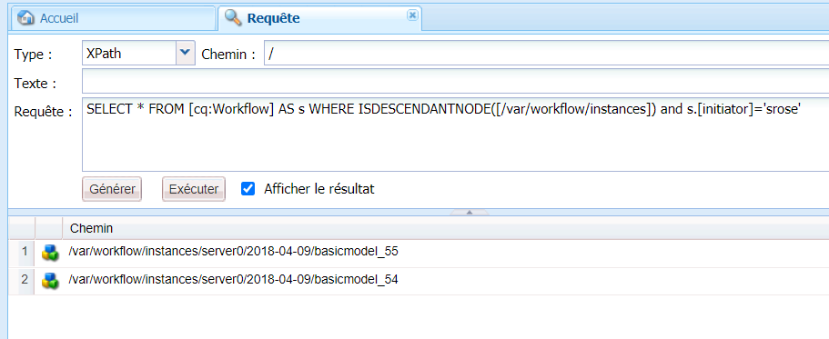
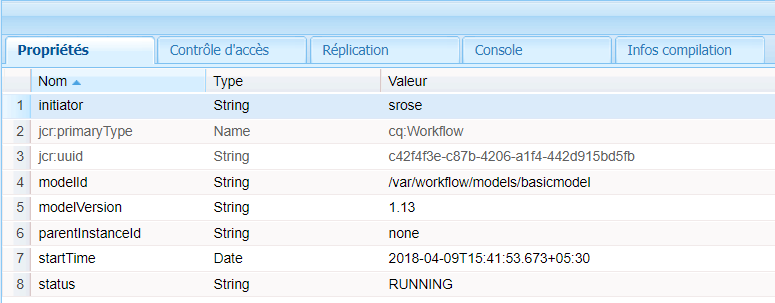
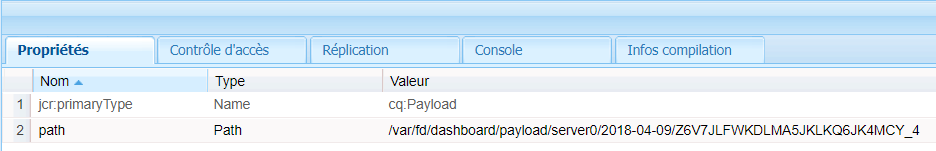

# Flux de travail basé sur l’utilisation de Forms sur OSGi | Gestion des données utilisateur {#forms-centric-workflows-on-osgi-handling-user-data}

Les flux de travail AEM basé sur l’utilisation de Forms vous permettent d’automatiser les processus réels d’entreprise axés sur les formulaires. Les flux de travail se composent d’une série d’étapes effectuées dans un ordre spécifique dans le modèle de flux de travail associé. Chaque étape exécute une action spécifique, par exemple, attribuer une tâche à un utilisateur ou envoyer un message électronique. Les flux de travail peuvent interagir avec des ressources dans le référentiel, les comptes utilisateur, et dans les services. Les flux de travail peuvent donc coordonner des activités complexes qui impliquent tous les aspects d’Experience Manager.

Un flux de travail basé sur l’utilisation de Forms peut être déclenché ou lancé à l’aide de l’une des méthodes suivantes :

* Envoi d’une demande depuis la boîte de réception AEM
* Envoi d’une demande depuis l’application AEM [!DNL Forms]
* Envoi d’un formulaire adaptatif
* Utilisation d’un dossier de contrôle
* Envoi d’une communication interactive ou d’une lettre

Pour plus d’informations sur les flux de travail et les fonctionnalités AEM basés sur l’utilisation de Forms, voir [Flux de travail basé sur l’utilisation de Forms sur OSGi](aem-forms-workflow.md).

## Données utilisateur et stockage de données {#user-data-and-data-stores}

Lorsqu’un flux de travail est déclenché, une charge utile est générée automatiquement pour l’instance de flux de travail. Chaque instance de flux de travail se voit attribuer un ID d’instance unique et un ID de charge utile associé. La charge utile contient les emplacements de référentiel pour les données d’utilisateur et de formulaire associées à une instance de flux de travail. Par ailleurs, les données d’historique et de brouillon d’une instance de flux de travail sont également stockées dans le référentiel AEM.

Les emplacements de référentiel par défaut où la charge utile, les brouillons et l’historique d’une instance de flux de travail résident sont les suivants :

>[!NOTE]
>
>Vous pouvez configurer différents emplacements pour stocker les données de charge utile, de brouillon et d’historique lors de la création d’un flux de travail ou d’une application. Pour identifier les emplacements dans lesquels un flux de travail ou une application a stocké des données, vérifiez le flux de travail.

<table>
 <tbody>
  <tr>
   <td> </td>
   <td><b>AEM 6.4 [!DNL Forms]</b></td>
   <td><b>AEM 6.3 [!DNL Forms]</b></td>
  </tr>
  <tr>
   <td><strong>Instance   de flux de travail</strong></td>
   <td>/var/workflow/instances/[server_id]/&lt;date&gt;/[workflow-instance]/</td>
   <td>/etc/workflow/instances/[server_id]/[date]/[workflow-instance]/</td>
  </tr>
  <tr>
   <td><strong>Charge utile</strong></td>
   <td>/var/fd/dashboard/payload/[server_id]/[date]/  [id-charge-utile]/</td>
   <td>/etc/fd/dashboard/payload/[server_id]/[date]/  [id-charge-utile]/</td>
  </tr>
  <tr>
   <td><strong>Brouillons</strong></td>
   <td>/var/fd/dashboard/instances/[server_id]/  [date]/[workflow-instance]/draft/[workitem]/</td>
   <td>/etc/fd/dashboard/instances/[server_id]/  [date]/[workflow-instance]/draft/[workitem]/</td>
  </tr>
  <tr>
   <td><strong>Historique</strong></td>
   <td>/var/fd/dashboard/instances/[server_id]/  [date]/[workflow_instance]/history/</td>
   <td>/etc/fd/dashboard/instances/[server_id]/  [date]/[workflow_instance]/history/</td>
  </tr>
 </tbody>
</table>

## Accès et suppression des données utilisateur {#access-and-delete-user-data}

Vous pouvez accéder et supprimer des données utilisateur d’une instance de flux de travail dans le référentiel. Pour ce faire, vous devez connaître l’ID de l’instance de flux de travail associé à l’utilisateur. Vous pouvez rechercher l’ID d’une instance de flux de travail à l’aide du nom de l’utilisateur qui a initié l’instance de flux de travail ou à qui l’instance de flux de travail est actuellement attribuée.

Notez toutefois que l’identification est impossible ou les résultats sont ambigus lors de l’identification des flux de travail associés à un initiateur dans les cas suivants :

* **Flux de travail déclenché par un dossier de contrôle** : une instance de flux de travail ne peut pas être identifiée à l’aide de son initiateur si le flux de travail est déclenché par un dossier de contrôle. Dans ce cas, les informations de l’utilisateur sont codées dans les données stockées.
* **Flux de travail initié à partir de l’instance de publication AEM** : toutes les instances de flux de travail sont créées à l’aide d’un utilisateur de service lorsque les formulaires adaptatifs, les communications interactives ou les lettres sont envoyés depuis l’instance de publication AEM. Dans ce cas, le nom de l’utilisateur connecté n’est pas capturé dans les données de l’instance de flux de travail.

### Accès aux données utilisateur {#access}

Pour identifier et accéder aux données utilisateur stockées pour une instance de flux de travail, procédez comme suit :

1. Sur l’instance d’auteur AEM, accédez à `https://'[server]:[port]'/crx/de` puis à **[!UICONTROL Outils > Requête]**.

   Sélectionnez **[!UICONTROL SQL2]** dans le menu déroulant **[!UICONTROL Type]**.

1. Selon les informations disponibles, effectuez l’une des requêtes suivantes :

   * Exécutez la commande suivante si l’initiateur de flux de travail est connu :

   `SELECT &ast; FROM [cq:Workflow] AS s WHERE ISDESCENDANTNODE([path-to-workflow-instances]) and s.[initiator]='*initiator-ID*'`

   * Exécutez la commande suivante si l’utilisateur des données que vous recherchez est actuellement la personne à laquelle le flux de travail est assigné :

   `SELECT &ast; FROM [cq:WorkItem] AS s WHERE ISDESCENDANTNODE([path-to-workflow-instances]) and s.[assignee]='*assignee-id*'`

   La requête renvoie l’emplacement de toutes les instances de flux de travail de l’initiateur de flux de travail spécifié ou de la personne à laquelle le flux de travail est actuellement assigné.

   Par exemple, la requête suivante renvoie le chemin d’accès de deux instances de flux de travail du nœud `/var/workflow/instances` pour lequel l’initiateur du flux de travail est `srose`.

   

1. Accédez à un chemin d’instance de flux de travail renvoyé par la requête. La propriété Etat affiche l’état actuel de l’instance de flux de travail.

   

1. Dans le nœud de l’instance de flux de travail, accédez à `data/payload/`. La propriété `path` enregistre le chemin de la charge utile de l’instance de flux de travail. Vous pouvez accéder au chemin d’accès des données stockées dans la charge utile.

   

1. Accédez aux emplacements des brouillons et de l’historique de l’instance de flux de travail.

   Par exemple :

   `/var/fd/dashboard/instances/server0/2018-04-09/_var_workflow_instances_server0_2018-04-09_basicmodel_54/draft/`

   `/var/fd/dashboard/instances/server0/2018-04-09/_var_workflow_instances_server0_2018-04-09_basicmodel_54/history/`

1. Répétez les étapes 3 à 5 pour toutes les instances de flux de travail renvoyées par la requête à l’étape 2.

   >[!NOTE]
   >
   >L’application AEM [!DNL Forms] stocke également les données en mode hors ligne. Les données d’une instance de flux de travail peuvent être enregistrées localement sur des appareils individuels et envoyées au serveur lorsque l’application se synchronise avec le serveur.[!DNL Forms]

### Suppression de données utilisateur {#delete-user-data}

Vous devez être un administrateur AEM pour supprimer des données utilisateur des instances de flux de travail en suivant la procédure suivante :

1. Suivez les instructions indiquées dans la section [Accès aux données utilisateur](forms-workflow-osgi-handling-user-data.md#access) et notez les éléments suivants :

   * Chemins d’accès aux instances de flux de travail associées à l’utilisateur
   * Etat des instances de flux de travail
   * Chemins d’accès aux charges utiles pour les instances de flux de travail
   * Chemins d’accès aux brouillons et à l’historique des instances de flux de travail

1. Effectuez cette étape pour des instances de flux de travail à l’état **EN COURS**,**SUSPENDU** ou **** OBSOLÈTE :

   1. Accédez à `https://'[server]:[port]'/aem/start.html` et connectez-vous avec les informations d’identification de l’administrateur.
   1. Accédez à **[!UICONTROL Outils > Flux de travail > Modèles]**.
   1. Sélectionnez les instances de flux de travail correspondant à l’utilisateur et appuyez sur **[!UICONTROL Arrêter]** pour arrêter les instances en cours d’exécution.

      Pour plus d’informations sur l’utilisation des instances de flux de travail, voir [Gestion des instances de flux de travail](https://experienceleague.adobe.com/docs/experience-manager-cloud-service/sites/authoring/workflows/overview.html?lang=fr#authoring).

1. Accédez à la console [!DNL CRXDE Lite], puis au chemin d’accès de la charge utile d’une instance de flux de travail et supprimez le nœud `payload`.
1. Accédez au chemin d’accès des brouillons d’une instance de flux de travail et supprimez le nœud `draft`.
1. Accédez au chemin d’accès de l’historique d’une instance de flux de travail et supprimez le nœud `history`.
1. Accédez au chemin d’accès d’une instance de flux de travail et supprimez le nœud `[workflow-instance-ID]` du flux de travail.

   >[!NOTE]
   >
   >La suppression du nœud d’une instance de flux de travail entraîne la suppression de l’instance de flux de travail pour tous les participants au flux.

1. Répétez les étapes 2 à 6 pour toutes les instances de flux de travail identifiées pour un utilisateur.
1. Identifiez et supprimez les données de brouillon et d’envoi hors ligne dans la boîte d’envoi de l’application AEM [!DNL Forms] des participants au flux de travail afin d’éviter tout envoi au serveur.

Vous pouvez également utiliser des API pour accéder et supprimer des nœuds et des propriétés. Consultez les documents suivants pour plus d’informations.

* [Comment accéder au JCR AEM par programmation](https://experienceleague.adobe.com/docs/experience-manager-65/developing/platform/access-jcr.html?lang=fr#platform)
* [Suppression des nœuds et propriétés](https://docs.adobe.com/docs/en/spec/jcr/2.0/10_Writing.html#10.9%20Removing%20Nodes%20and%20Properties)
* [Guide de référence des API](https://experienceleague.adobe.com/docs/experience-manager-release-information/aem-release-updates/previous-updates/aem-previous-versions.html?lang=fr)

