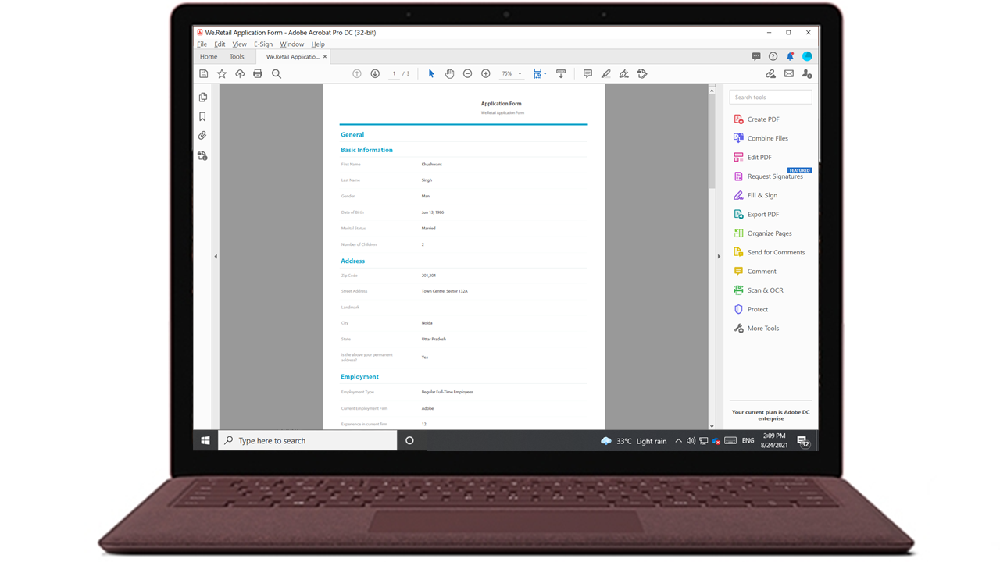
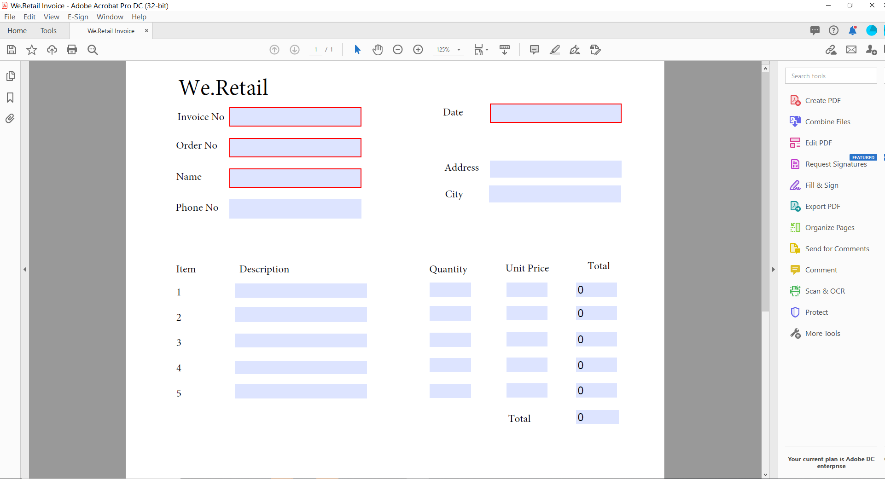
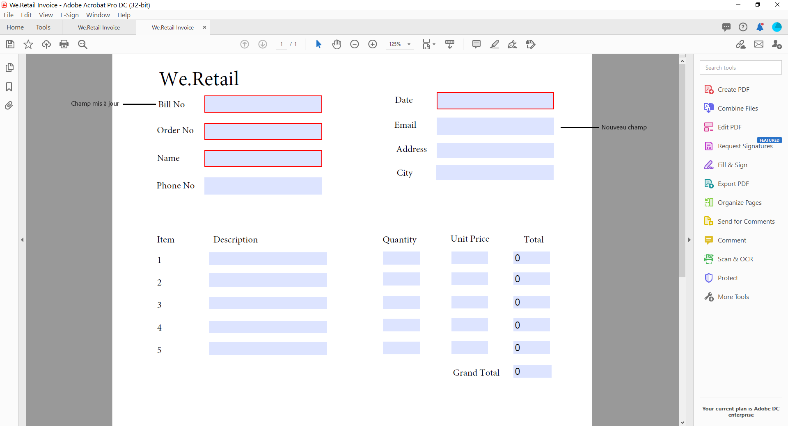
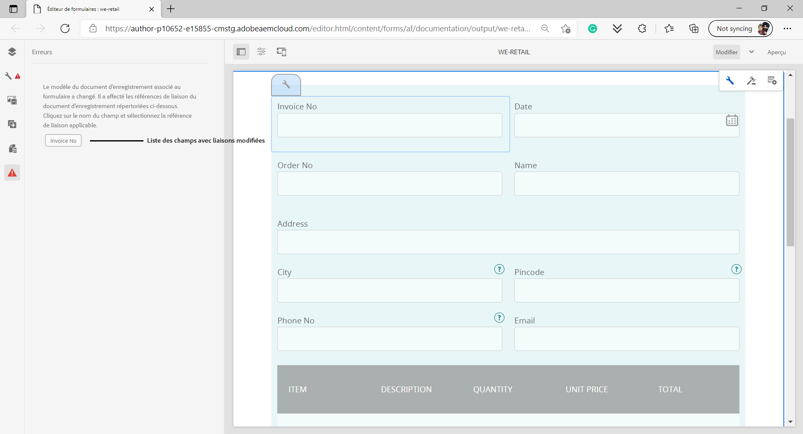

# Générer un PDF d’envoi (anciennement Document d’enregistrement) pour le Forms adaptatif (composants principaux)

## Présentation {#overview}

Lorsqu’un formulaire est rempli ou envoyé, vous pouvez en conserver un enregistrement au format imprimé ou document. Cet enregistrement est appelé PDF d’envoi (anciennement Document d’enregistrement, ou DoR). Il s’agit d’un PDF du formulaire envoyé qui peut être imprimé. Vous pouvez également vous reporter au PDF d’envoi pour les informations que les clients ont remplies à une date ultérieure ou utiliser le PDF d’envoi pour archiver ensemble les formulaires et le contenu au format PDF.

## Applicabilité et cas d’utilisation

### Assurance

## AEM Forms peut-il générer des documents de réclamation d’assurance ?

Oui. AEM Forms prend en charge la génération de Submissions PDF (anciennement Document d’enregistrement), ce qui permet aux assureurs de produire des PDF et des enregistrements en fonction des données de formulaire envoyées.

## Les documents générés par AEM Forms sont-ils adaptés aux audits ?

Oui. AEM Forms prend en charge la génération cohérente de documents, l’accès contrôlé et la traçabilité, qui sont importants pour les exigences d’audit et de conformité.

Pour créer un PDF d’envoi, un modèle basé sur XFA ou Acrobat est fusionné avec les données collectées via un formulaire adaptatif. Vous pouvez générer un PDF d’envoi automatiquement ou à la demande. L’option à la demande vous permet de spécifier un modèle XFA ou Acrobat personnalisé pour donner une apparence personnalisée à votre PDF d’envoi.

Vous pouvez :

* [Générer une PDF d’envoi basée sur XFA](#generate-an-XFA-based-document-of-record)
* [Générer un PDF d’envoi basé sur Acroform (Acrobat Form PDF)](#generate-an-Acroform-based-document-of-record)
* [Générer automatiquement un PDF d’envoi](#auto-generate-a-document-of-record)

## Avant de commencer {#components-to-automatically-generate-a-document-of-record}

Avant de commencer à apprendre et à préparer les ressources requises pour une PDF d’envoi :

**Modèle de base :** un modèle XFA (fichier XDP) créé dans Forms Designer ou un formulaire Acrobat Form (AcroForm). Le [modèle de base](#base-template-of-a-document-of-record) est utilisé pour spécifier les informations de style et de marque pour un PDF d’envoi. Chargez votre modèle XFA (fichier XDP) sur votre instance AEM Forms au préalable.

**Formulaire adaptatif :** formulaire adaptatif pour lequel le PDF d’envoi doit être généré.

## Générer une PDF d’envoi basée sur XFA {#generate-an-XFA-based-document-of-record}

Chargez votre modèle XFA (fichier XDP) vers votre instance AEM Forms. Pour configurer un formulaire adaptatif afin d’utiliser un modèle XFA (fichier XDP) comme modèle pour Submission PDF, procédez comme suit :

1. Dans l’instance de création Experience Manager, cliquez sur **[!UICONTROL Formulaires]** > **[!UICONTROL Formulaires et documents].**
1. Sélectionnez un formulaire ou créez un formulaire adaptatif, puis cliquez sur **[!UICONTROL Propriétés]**.
1. Dans la fenêtre Propriétés, sélectionnez **[!UICONTROL Modèle de formulaire]**.
1. Dans l’onglet **[!UICONTROL Modèle de formulaire]**, dans la liste déroulante **[!UICONTROL Sélectionner à partir de]**, sélectionnez **[!UICONTROL Modèle de données de formulaire]**, **[!UICONTROL Schéma]** ou **[!UICONTROL Aucun]**. Vous pouvez également sélectionner un modèle de formulaire lorsque vous créez un formulaire.
1. Dans la section Configuration du modèle de document d’enregistrement de l’onglet Modèle de formulaire, sélectionnez **Associer le modèle de formulaire en tant que modèle de document d’enregistrement**. Lorsque vous sélectionnez cette option, tous les modèles XFA (fichiers XDP) disponibles sur votre ordinateur s’affichent. Sélectionnez le fichier approprié. Assurez-vous également que le même schéma (schéma de données) est utilisé pour le formulaire adaptatif et le modèle XFA sélectionné (fichier XDP).
1. Cliquez sur **[!UICONTROL Terminé]**

Votre formulaire adaptatif est maintenant configuré pour utiliser un fichier XDP comme modèle de PDF d’envoi. L’étape suivante consiste à [lier les composants de formulaire adaptatif aux champs de modèle correspondants](#bind-adaptive-form-components-with-template-fields).

## Générer un PDF d’envoi basé sur Acroform {#generate-an-Acroform-based-document-of-record}

Chargez votre PDF Adobe Acrobat (Acroform) sur votre instance AEM Forms. Pour configurer un formulaire adaptatif afin d’utiliser Adobe Acrobat PDF (Acroform) comme modèle pour l’envoi de PDF, procédez comme suit :

1. Dans l’instance de création Experience Manager, cliquez sur **[!UICONTROL Formulaires]** > **[!UICONTROL Formulaires et documents].**
1. Sélectionnez un formulaire ou **[!UICONTROL Créez un formulaire adaptatif]**, puis cliquez sur **[!UICONTROL Propriétés]**.
1. Dans la fenêtre Propriétés, sélectionnez **[!UICONTROL Modèle de formulaire]**.
1. Dans l’onglet **[!UICONTROL Modèle de formulaire]**, dans la liste déroulante **[!UICONTROL Sélectionner à partir de]**, sélectionnez **[!UICONTROL Modèle de données de formulaire]**, **[!UICONTROL Schéma]** ou **[!UICONTROL Aucun]**. Vous pouvez également sélectionner un modèle de formulaire lorsque vous créez un formulaire.
1. Dans la section Configuration du modèle de document d’enregistrement de l’onglet Modèle de formulaire, sélectionnez **Associer le modèle de formulaire en tant que modèle de document d’enregistrement**. Lorsque vous sélectionnez cette option, tous les fichiers Acrobat PDF (Acroform) disponibles sur votre ordinateur s’affichent. Sélectionnez l’Acroform que vous souhaitez utiliser.
1. Cliquez sur **[!UICONTROL Terminé]**

Votre formulaire adaptatif est maintenant configuré pour utiliser un Acroform comme modèle pour Submission PDF. L’étape suivante consiste à [lier les composants de formulaire adaptatif aux champs de modèle correspondants](#bind-adaptive-form-components-with-template-fields).

## Générer automatiquement un PDF de soumission {#auto-generate-a-document-of-record}

Lorsqu’un formulaire adaptatif est configuré pour générer automatiquement un PDF d’envoi, chaque fois qu’un formulaire est modifié, son PDF d’envoi est mis à jour immédiatement. Par exemple, si un champ est supprimé d’un formulaire adaptatif existant, le champ correspondant est également supprimé et n’est pas visible dans le PDF d’envoi. La génération automatique d’une PDF d’envoi présente de nombreux autres avantages :

* Les développeurs de formulaires n’ont pas à gérer manuellement les liaisons de données. Le PDF d’envoi généré automatiquement prend en charge les mises à jour liées à la liaison de données.
* Les développeurs de formulaires n’ont pas à masquer manuellement les champs marqués comme exclus de Submission PDF. Les PDF d’envoi générées automatiquement sont préconfigurées pour exclure ces champs.
* L’option PDF d’envoi générée automatiquement permet de gagner du temps lors de la création d’un modèle de formulaire pour le PDF d’envoi.
* L’option PDF d’envoi générée automatiquement vous permet d’utiliser des styles et des aspects différents en utilisant différents modèles de base. Il permet de sélectionner le style et l’apparence appropriés pour Submission PDF pour votre organisation. Si vous ne spécifiez pas de style, les styles système sont définis en tant que valeur par défaut.
* Le PDF d’envoi généré automatiquement garantit que toute modification du formulaire se répercute immédiatement dans le PDF d’envoi.

Pour configurer un formulaire adaptatif afin de générer automatiquement un PDF d’envoi, procédez comme suit :

1. Dans l’instance de création Experience Manager, cliquez sur **[!UICONTROL Formulaires]** > **[!UICONTROL Formulaires et documents].**
1. Sélectionnez un formulaire ou créez un formulaire adaptatif, puis cliquez sur **[!UICONTROL Propriétés]**.
1. Dans la fenêtre Propriétés, sélectionnez **[!UICONTROL Modèle de formulaire]**.
1. Dans l’onglet **[!UICONTROL Modèle de formulaire]**, dans la liste déroulante **[!UICONTROL Sélectionner à partir de]**, sélectionnez **[!UICONTROL Modèle de données de formulaire]**, **[!UICONTROL Schéma]** ou **[!UICONTROL Aucun]**. Vous pouvez également sélectionner un modèle de formulaire lorsque vous créez un formulaire.
1. Dans la section Configuration du modèle de document d’enregistrement de l’onglet Modèle de formulaire, sélectionnez **Générer un document d’enregistrement**.
1. Cliquez sur **[!UICONTROL Terminé]**

## Liaison des composants de formulaire adaptatif aux champs de modèle {#bind-adaptive-form-components-with-template-fields}

Liez les champs de formulaire adaptatif aux champs de modèle pour afficher les données de formulaire capturées dans le champ PDF d’envoi correspondant. Pour lier les composants de formulaire adaptatif aux champs de modèle PDF d’envoi correspondants :

1. Ouvrez le formulaire adaptatif, configuré pour utiliser un modèle de formulaire personnalisé, pour le modifier.

1. Sélectionnez un composant de formulaire adaptatif et cliquez sur l’icône Configurer . Il ouvre le navigateur des propriétés.

1. Dans le navigateur des propriétés, recherchez et sélectionnez un champ.

   * (Pour le modèle AcroForm) la propriété **[!UICONTROL Champ de référence de liaison de document d’enregistrement]**.
   * (Pour le modèle XFA) la propriété **[!UICONTROL Référence de liaison de modèle de données]**.

1. Cliquez sur **[!UICONTROL Enregistrer]**.

<!-- 
In the following video, Adaptive Form components are bound with corresponding Acroform template fields and the Document of Record is sent as an email attachment.
-->

Vous pouvez utiliser des actions d’envoi telles que « Envoyer par e-mail », « Appeler un workflow d’AEM », « Appeler un flux Power Automate », etc., et d’autres [actions d’envoi](configuring-submit-actions.md) pour recevoir une PDF d’envoi.

>[!NOTE]
>
> Vous pouvez enregistrer la PDF d’envoi pour n’importe quel modèle de données de formulaire à l’aide de la propriété **[!UICONTROL Champ de référence de liaison de document d’enregistrement]**.

## Mises à jour incrémentielles du modèle de PDF d’envoi {#document-of-record-template-incremental-updates}

Les formulaires adaptatifs et les modèles de PDF d’envoi correspondants peuvent évoluer au fil du temps. Vous pouvez choisir d’ajouter, de supprimer ou de modifier des champs dans un formulaire adaptatif ou un modèle de PDF d’envoi.

Lorsque vous modifiez un modèle PDF d’envoi et chargez le modèle modifié vers AEM Forms, l’éditeur de Forms adaptatif détecte automatiquement les liaisons modifiées et vous informe sur les composants de formulaire adaptatif qui nécessitent de nouvelles liaisons. Il vous permet d’effectuer des mises à jour incrémentielles sur un modèle de PDF d’envoi.

Par exemple, une organisation, *We.Retail*, possède un modèle de PDF d’envoi basé sur AcroForm, *we-retail-facture.pdf*. Le modèle ressemble à ce qui suit :

Après avoir utilisé le modèle pendant un certain temps, l’entreprise décide de renommer le champ `invoice-number` en champ `bill-number` et de capturer l’adresse électronique des acheteurs. Un développeur met à jour le nom du champ `invoice-number` et ajoute un champ d’e-mail au modèle. Il crée également une version du modèle appelée *we-retail-invoice-v2.pdf*.

<!--

The developer uploads and applies to the updated template to the adaptive form. The adaptive form automatically detects and displays list of fields where binding has changed.

The form developer binds Adaptive Forms fields with corresponding Document of Record template.

-->

>[!VIDEO](assets/we-retail-binding.mp4)

Désormais, lorsque le formulaire adaptatif est envoyé, un PDF d’envoi mis à jour est généré.

## Points essentiels à prendre en compte lors de l’utilisation de Submissions PDF {#key-considerations-when-working-with-document-of-record}

Gardez à l’esprit les points et restrictions suivants lorsque vous utilisez Submission PDF pour Adaptive Forms.

* Les modèles PDF d’envoi ne prennent pas en charge le texte enrichi. Par conséquent, tout texte enrichi dans le formulaire adaptatif statique ou dans les informations renseignées par l’utilisateur est remplacé par du texte brut dans le PDF d’envoi.
* Les fragments de document d’un formulaire adaptatif n’apparaissent pas dans le PDF d’envoi. Les fragments de formulaire adaptatif sont toutefois pris en charge.
* La liaison de contenu dans le PDF d’envoi généré pour le formulaire adaptatif de schéma XML n’est pas prise en charge.
* La version localisée de Submission PDF est créée à la demande pour un paramètre régional lorsque l’utilisateur demande le rendu de Submission PDF. La localisation de l’envoi PDF se produit avec la localisation du formulaire adaptatif. <!-- For more information on localization of Document of Record and Adaptive Forms see Using AEM translation workflow to localize Adaptive Forms and Document of Record.-->

<!-- ## Configure an adaptive form to generate  Document of Record {#adaptive-form-types-and-their-documents-of-record}

While creating an adaptive form, in the Form Model tab of Adaptive Form properties, select one the following option: 

* **None**
  Select the option to create an Adaptive Form without a form model. When the option is selected, the Document of Record is automatically generated for your Adaptive Form.

* **[Associate form template as a Document of Record template](creating-adaptive-form.md#create-an-adaptive-form-based-on-an-xfa-form-template)**
  
  Select the option to use an XFA Form as a template for Document of Record. 

* **[Generate Document of Record](creating-adaptive-form.md#create-an-adaptive-form-based-on-xml-or-json-schema)**
  Select the option to use an XFA Form as a template. When the option is selected, the Document of Record is automatically generated for your Adaptive Form. When you use an XML schema as a template for an Adaptive Form, ensure that the adaptive form and associated XFA Form use the same XML schema as your Adaptive Form
  

When you select a form model, configure Document of Record using options available under Document of Record Template Configuration. See [Document of Record Template Configuration](#document-of-record-template-configuration). -->

## Mappage des éléments d’un formulaire adaptatif {#mapping-of-adaptive-form-elements}

Le tableau suivant décrit les composants de formulaire adaptatif et les composants XFA correspondants, et s’ils apparaissent dans un PDF d’envoi.

### Champs {#fields}

<table>
 <tbody>
  <tr>
   <th>Composant de formulaire adaptatif</th>
   <th>Composant XFA correspondant</th>
   <th>Inclus par défaut dans le modèle PDF d’envoi ?</th>
   <th>Remarques</th>
  </tr>
  <tr>
   <td>Bouton</td>
   <td>Bouton</td>
   <td>false</td>
   <td> </td>
  </tr>
  <tr>
   <td>Case à cocher</td>
   <td>Case à cocher</td>
   <td>true</td>
   <td> </td>
  </tr>
  <tr>
   <td>Sélecteur de date</td>
   <td>Champ Date/Heure</td>
   <td>true</td>
   <td> </td>
  </tr>
  <tr>
   <td>Liste déroulante</td>
   <td>Liste déroulante</td>
   <td>true</td>
   <td> </td>
  </tr>
  <tr>
   <td>Zone numérique</td>
   <td>Champ numérique</td>
   <td>true</td>
   <td> </td>
  </tr>
  <tr>
   <td>Bouton radio</td>
   <td>Bouton radio</td>
   <td>true</td>
   <td> </td>
  </tr>
  <tr>
   <td>Zone de texte</td>
   <td>Champ de texte</td>
   <td>true</td>
   <td> </td>
  </tr>
  <tr>
   <td>Bouton de réinitialisation</td>
   <td>Bouton de réinitialisation</td>
   <td>false</td>
   <td> </td>
  </tr>
  <tr>
   <td>Bouton Envoyer</td>
   <td>
Bouton Envoyer par e-mail
 
Bouton Envoyer via HTTP
 </td>
   <td>false</td>
   <td> </td>
  </tr>
  <tr>
   <td>Pièce jointe</td>
   <td> </td>
   <td>false</td>
   <td>Non disponible dans le modèle PDF d’envoi. Disponible uniquement dans Submission PDF par le biais de pièces jointes.</td>
  </tr>
 </tbody>
</table>

### Conteneurs {#containers}

<table>
 <tbody>
  <tr>
   <th>Composant de formulaire adaptatif</th>
   <th>Composant XFA correspondant</th>
   <th>Remarques</th>
  </tr>
  <tr>
   <td>Panneau  </td>
   <td>Sous-formulaire  </td>
   <td>Le panneau répétable est mappé à un sous-formulaire répétable.</td>
  </tr>
 </tbody>
</table>

### Composants statiques {#static-components}

| Composant de formulaire adaptatif | Composant XFA correspondant | Remarques |
|---|---|---|
| Image | Image | Qu’ils soient liés ou non, les composants TextDraw et Image apparaissent toujours dans le PDF d’envoi pour un formulaire adaptatif basé sur XSD, sauf si cela est exclu dans les paramètres de PDF d’envoi. |
| Texte | Texte |  |

### Tableaux {#tables}

Composants tabulaires des formulaires adaptatifs, comme l’en-tête, le pied de page et les lignes associés aux composants XFA correspondants. Vous pouvez mapper des panneaux répétables aux tableaux dans Submission PDF.

## Modèle de base d’un PDF d’envoi {#base-template-of-a-document-of-record}

Le modèle de base fournit des informations de style et d’aspect à Submission PDF. Il vous permet de personnaliser l’aspect par défaut du PDF d’envoi généré automatiquement. Par exemple, vous pouvez utiliser un modèle de base pour ajouter le logo de votre société dans l’en-tête et les informations sur le droit d’auteur dans le pied de page du PDF de soumission.

Le gabarit de page d’un modèle de base est utilisé comme gabarit de page pour le modèle PDF d’envoi . Le gabarit de page peut comporter des informations telles que l’en-tête, le pied et le numéro de page, que vous pouvez appliquer au PDF d’envoi. Vous pouvez appliquer ces informations au PDF de soumission à l’aide du modèle de base pour la génération automatique du PDF de soumission. L’utilisation d’un modèle de base vous permet de modifier les propriétés par défaut des champs.

Respectez toujours les [conventions relatives aux modèles de base](#base-template-conventions) lorsque vous créez un modèle de base.

## Conventions relatives aux modèles de base {#base-template-conventions}

Un modèle de base est utilisé pour définir l’en-tête, le pied de page, le style et l’aspect d’un PDF d’envoi. L’en-tête et le pied de page peuvent comporter des informations, comme le logo de l’entreprise et la mention de droit d’auteur. Le gabarit de page du modèle de base est copié et utilisé comme gabarit de page du PDF d’envoi. Il contient l’en-tête, le pied de page et le numéro de page, ainsi que toute autre information devant apparaître sur toutes les pages du PDF d’envoi. Si vous utilisez un modèle de base non conforme aux conventions en matière de modèles de base, le premier gabarit de page du modèle de base est toujours utilisé dans le modèle PDF d’envoi. Il est vivement recommandé de concevoir votre modèle de base en fonction des conventions correspondantes et de l’utiliser pour la génération automatique du code PDF d’envoi.

**Conventions en matière de gabarits de page**

* Dans le modèle de base, vous devriez nommer le sous-formulaire racine `AF_METATEMPLATE` et le gabarit de page `AF_MASTERPAGE`.

* Le gabarit de page « `AF_MASTERPAGE` » et situé sous le sous-formulaire racine `AF_METATEMPLATE` est privilégié pour extraire les informations sur l’en-tête, le pied de page et le style.

* En l’absence de gabarit de page `AF_MASTERPAGE`, le premier gabarit de page présent dans le modèle de base est utilisé.

**Conventions an matière de style des champs**

* Pour appliquer un style aux champs du PDF d’envoi, le modèle de base fournit les champs situés dans le sous-formulaire `AF_FIELDSSUBFORM` sous le sous-formulaire racine `AF_METATEMPLATE`.

* Les propriétés de ces champs sont appliquées aux champs dans le PDF d’envoi. Ces champs doivent respecter la convention d’affectation des noms de `AF_<name of field in all caps>_XFO`. Par exemple, le champ contenant une case à cocher doit être nommé `AF_CHECKBOX_XFO`.

Pour créer un modèle de base, procédez comme suit dans Forms Designer.

1. Cliquez sur **[!UICONTROL Fichier]** > **[!UICONTROL Nouveau]**.
1. Sélectionnez l’option **[!UICONTROL Basé sur un modèle]**.

1. Sélectionnez la catégorie **[!UICONTROL Forms - Document d’enregistrement]**.
1. Sélectionnez **[!UICONTROL Modèle de base de DE]**.
1. Cliquez sur **[!UICONTROL Suivant]** et renseignez les informations nécessaires.

1. (Facultatif) Modifiez le style et l’aspect à appliquer aux champs du PDF d’envoi.
1. Enregistrez le formulaire.
   

Vous pouvez désormais utiliser le formulaire enregistré comme modèle de base d’une PDF d’envoi. Ne modifiez ou ne supprimez aucun des scripts du modèle de base.

**Modification du modèle de base**

* Si vous n’appliquez aucun style aux champs du modèle de base, il est recommandé de les supprimer afin que toutes les mises à niveau du modèle de base soient automatiquement sélectionnées.
* Lors de la modification du modèle de base, ne supprimez, n’ajoutez ou ne modifiez pas les scripts.

Respectez rigoureusement les conventions et instructions mentionnées ci-dessus pour concevoir un modèle de base.

## Personnaliser les informations d’identité graphique dans Submission PDF {#customize-the-branding-information-in-document-of-record}

Lors de la génération d’une PDF de soumission, vous pouvez modifier les informations de branding de la PDF de soumission dans l’onglet Document d’enregistrement. L’onglet Document d’enregistrement inclut des options telles que le logo, l’apparence, la mise en page, l’en-tête et le pied de page, la clause de non-responsabilité et si vous souhaitez inclure des options de case à cocher et de bouton radio désélectionnées.

Pour localiser les informations de branding que vous saisissez dans l’onglet Document d’enregistrement, assurez-vous que les paramètres régionaux du navigateur sont définis correctement. Pour personnaliser les informations d’identité graphique de Submission PDF, procédez comme suit :

1. Sélectionnez un panneau (panneau racine) dans le PDF d’envoi, puis sélectionnez .
1. Sélectionnez . L’onglet Document d’enregistrement s’affiche.
1. Sélectionnez le modèle par défaut ou un modèle personnalisé pour le rendu du PDF d’envoi. Si vous sélectionnez le modèle par défaut, une vignette d’aperçu du PDF d’envoi s’affiche sous la liste déroulante Modèle.
1. Selon que vous sélectionnez un modèle par défaut ou un modèle personnalisé, certaines des propriétés suivantes, ou toutes les propriétés, apparaissent dans l’onglet Document d’enregistrement. Spécifiez les propriétés mentionnées ci-dessous pour définir l’apparence du PDF d’envoi :

   1. **Propriétés de base** :
      * **Modèle** : si vous choisissez de sélectionner un modèle personnalisé, recherchez et sélectionnez un fichier XDP sur votre serveur [!DNL AEM Forms]. Si vous souhaitez utiliser un modèle qui n’est pas sur votre serveur [!DNL AEM Forms], vous devez au préalable charger le fichier XDP sur votre serveur [!DNL AEM Forms].
      * **Couleur d’accentuation** : la couleur dans laquelle le texte de l’en-tête et les lignes de séparation sont affichés dans le PDF d’envoi.
      * **Famille de polices** : famille de polices du texte dans la PDF d’envoi.

        >[!NOTE]
        >
        > AEM Forms propose toute une gamme de polices intégrées qui s’intègrent de manière transparente aux fichiers PDF. Pour afficher la liste des polices prises en charge, [cliquez ici](/help/forms/supported-out-of-the-box-fonts.md).

      * **Inclure les objets de formulaire qui ne sont pas liés au modèle de données** : la définition de la propriété inclut des champs non liés du formulaire adaptatif basé sur un schéma dans le PDF d’envoi.

        <!-- **Exclude hidden fields from the Document of Record**: Setting the property identifies the hidden fields for exclusion from Document of Record.-->

      * **Masquer la description des panneaux** : la définition de la propriété exclut la description du panneau/tableau de la PDF d’envoi. Applicable au panneau et au tableau.

   1. **Propriétés des champs de formulaire** :

      * **Pour les composants Case à cocher et Bouton radio, afficher uniquement les valeurs sélectionnées** : la définition de la propriété affiche uniquement les valeurs sélectionnées de la case à cocher et du bouton radio dans [!UICONTROL document d’enregistrement].
      * **Séparateur pour plusieurs valeurs** : vous pouvez choisir n’importe quel séparateur, tel qu’une virgule ou un saut de ligne, pour afficher plusieurs valeurs.
      * **Alignement des options** : vous pouvez sélectionner l’alignement de votre choix (horizontal, vertical, identique au formulaire adaptatif) pour définir l’alignement des champs (case à cocher ou bouton radio, par exemple) à afficher sur le [!UICONTROL document d’enregistrement]. Par défaut, l’alignement vertical est défini pour les champs du [!UICONTROL document d’enregistrement]. La définition des propriétés à partir des [!UICONTROL Propriétés des champs de formulaire] du document d’enregistrement remplace les propriétés définies dans la variable [!UICONTROL Alignement des éléments] pour les champs d’un formulaire adaptatif. Si vous sélectionnez l’option [!UICONTROL Identique au formulaire adaptatif], l’alignement tel que configuré dans une instance de création de formulaire adaptatif est utilisé pour les champs du [!UICONTROL document d’enregistrement].
      * **Nombre d’options d’alignement horizontal**:You peut définir le nombre d’options à afficher dans le PDF d’envoi pour l’alignement horizontal.

   1. **Propriétés du gabarit de page** :

      * **Image du logo** : vous pouvez choisir d’utiliser l’image du logo à partir du formulaire adaptatif, sélectionner une image dans le gestionnaire des ressources numériques (DAM) ou en charger une à partir de votre ordinateur.
      * **Titre du formulaire** : titre du document d’enregistrement.
* **Texte d’en-tête** : texte qui apparaît dans la section d’en-tête du PDF d’envoi.
* **Libellé clause de non-responsabilité** : libellé de la clause de non-responsabilité.
* **Clause de non-responsabilité** : texte spécifiant la portée des droits et des obligations sur le PDF de soumission.
* **Texte de clause de non-responsabilité** : texte de la clause de non-responsabilité.

      &lt;!— —>
     
     >[!REMARQUE]
     >
     >Si vous utilisez un modèle de formulaire adaptatif créé avec une version de Designer antérieure à la version 6.3, pour que les propriétés Couleur d’accentuation et Famille de polices fonctionnent, assurez-vous que les éléments suivants sont présents dans votre modèle de formulaire adaptatif sous le sous-formulaire racine :
     
     «xml
&lt;proto>    &lt;font typeface=« Arial »/>
&lt;fill>    &lt;color value=« 4,166,203 »/>
&lt;/fill>    &lt;edge>
&lt;color value=« 4,166,203 »/>    &lt;/edge>
&lt;/proto>     »
      
      
      
      
      
  
1. Pour enregistrer les modifications d’identité graphique, sélectionnez **[!UICONTROL Terminé]**.

>[!NOTE]
> 
> Pour afficher un titre de formulaire personnalisé dans votre PDF d’envoi, modifiez le **Titre du formulaire personnalisé** dans **Propriétés du document d’enregistrement** > **Propriétés de page du Principal**. Ce titre personnalisé :
> 
> * Apparaît dans l’en-tête du PDF généré
> * Apparaît comme titre dans les propriétés du document PDF
> * S’affiche en tant que titre d’affichage initial à l’ouverture du PDF

## Dispositions de tableaux et de colonnes pour les panneaux dans Submission PDF {#table-and-column-layouts-for-panels-in-document-of-record}

Votre formulaire adaptatif peut être étendu, avec plusieurs champs de formulaire. Vous ne pouvez pas enregistrer un PDF d’envoi en tant que copie exacte du formulaire adaptatif. Vous pouvez maintenant choisir une disposition de tableau ou de colonne pour enregistrer un ou plusieurs panneaux de formulaires adaptatifs dans le PDF d’envoi.

Avant de générer un PDF d’envoi, dans les paramètres d’un panneau, sélectionnez Tableau ou Colonne pour Mise en page du document d’enregistrement pour ce panneau. Les champs du panneau sont organisés en conséquence dans le PDF d’envoi.

Champs dans un panneau rendu dans une mise en page de tableau dans le PDF d’envoi

Champs dans un panneau rendu dans une mise en page Colonne dans le PDF d’envoi

## Paramètres d’envoi de PDF {#document-of-record-settings}

Les paramètres de PDF d’envoi vous permettent de choisir les options que vous souhaitez inclure dans la PDF d’envoi. Par exemple, une banque accepte le nom, l’âge, le numéro de sécurité sociale et le numéro de téléphone dans un formulaire. Le formulaire génère un numéro de compte bancaire et les détails de la banque. Vous pouvez choisir de n’afficher que le nom, le numéro de sécurité sociale, le compte bancaire et les informations bancaires dans Submission PDF.

Les paramètres du composant Document d’enregistrement sont disponible sous ses propriétés. Pour accéder aux propriétés d’un composant, sélectionnez le composant et cliquez sur  dans le recouvrement. Les propriétés sont répertoriées dans la barre latérale. Vous y trouvez les paramètres suivants.

**Paramètres sur le terrain**

* **Exclure du document d’enregistrement** : la définition de la propriété sur true exclut le champ du PDF d’envoi. Il s’agit d’une propriété pouvant faire l’objet d’un script appelée « `excludeFromDoR` ». Son comportement dépend de la propriété au niveau du formulaire **Exclure des champs du document d’enregistrement (DE) s’il est masqué**.

* **Afficher le panneau sous forme de tableau :** la définition de cette propriété affiche le panneau sous forme de tableau dans le PDF d’envoi s’il contient moins de 6 champs. Applicable au panneau uniquement.
* **Exclure le titre du document d’enregistrement** : la définition de la propriété exclut le titre du panneau/tableau du PDF d’envoi. Applicable au panneau et à la table uniquement.
* **Exclure la description du document d’enregistrement :** la définition de la propriété exclut la description du panneau/tableau de la PDF d’envoi. Applicable au panneau et à la table uniquement.
* **Exclure les champs masqués du document d’enregistrement** : la sélection de cette propriété exclut les champs masqués du PDF d’envoi. Elle s’applique à tous les champs de formulaire. Par défaut, l’option **Exclure les champs masqués du document d’enregistrement** n’est pas sélectionnée.

**Paramètres des niveaux de formulaires**

* **Inclure les champs non liés dans le document d’enregistrement :** la définition de la propriété inclut les champs non liés du schéma basé sur le formulaire adaptatif dans le PDF d’envoi. Par défaut, le paramètre est true.

## Voir également {#see-also}

{{see-also}}

<!-- 

**Exclude fields from DoR if hidden:** Set the property to exclude the hidden fields from Document of Record at form submission. When you enable [Revalidate on server](/help/forms/configuring-submit-actions.md#server-side-revalidation-in-adaptive-form-server-side-revalidation-in-adaptive-form), the server recomputes the hidden fields before excluding those fields from the Document of Record.

!->>
