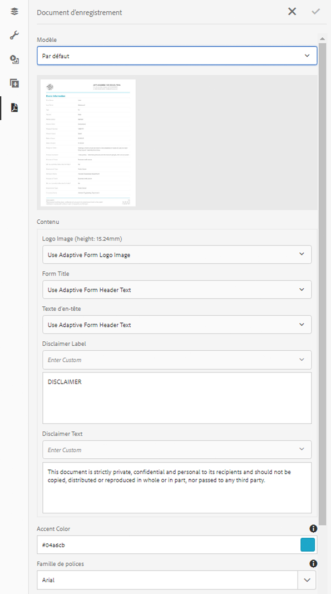

# Génération d’un document d’enregistrement pour les formulaires adaptatifs

## Présentation {#overview}

Lorsqu’un formulaire est rempli ou envoyé, vous pouvez conserver un enregistrement du formulaire, au format imprimé ou au format de document. Ici, il s’agit de document d’enregistrement (DOR). Il s’agit d’une copie imprimable du formulaire envoyé. Vous pouvez également vous reporter au document d’enregistrement pour les informations que les clients ont remplies à une date ultérieure ou utiliser le document d’enregistrement pour archiver ensemble les formulaires et le contenu au format PDF.


Pour créer un document d’enregistrement, un modèle basé sur XFA ou Acrobat est fusionné avec les données collectées via un formulaire adaptatif. Vous pouvez générer un document d’enregistrement automatiquement ou à la demande.
L’option à la demande vous permet de spécifier un modèle XFA ou Acrobat personnalisé pour donner une apparence personnalisée à votre document d’enregistrement.

Vous pouvez :

* [Générer un document d’enregistrement basé sur XFA](#generate-an-XFA-based-document-of-record)
* [générer un document d’enregistrement basé sur Acroform (Acrobat Form PDF) ;](#generate-an-Acroform-based-document-of-record)
* [générer automatiquement un document d’enregistrement.](#auto-generate-a-document-of-record)

## Avant de commencer {#components-to-automatically-generate-a-document-of-record}

Avant de commencer à apprendre et à préparer les ressources requises pour un document d’enregistrement :

**Modèle de base :** Un modèle XFA (fichier XDP) créé dans Forms Designer ou un formulaire Acrobat (AcroForm). Le [modèle de base](#base-template-of-a-document-of-record), également appelé métamodèle, est utilisé pour spécifier les informations de style et de marque pour un document d’enregistrement. Chargez votre modèle XFA (fichier XDP) sur votre instance AEM Forms au préalable.

**Formulaire adaptatif :** le formulaire adaptatif pour lequel le document d’enregistrement doit être généré.

## Générer un document d’enregistrement basé sur XFA {#generate-an-XFA-based-document-of-record}

Chargez votre modèle XFA (fichier XDP) vers votre instance AEM Forms. Suivez les étapes suivantes pour configurer un formulaire adaptatif afin d’utiliser un modèle XFA (fichier XDP) comme modèle de document d’enregistrement :

1. Dans l’instance d’auteur du Experience Manager, cliquez sur **[!UICONTROL Forms]** > **[!UICONTROL Forms et documents].**
1. Sélectionnez un formulaire, puis cliquez sur **[!UICONTROL Propriétés]**.
1. Dans la fenêtre Propriétés, appuyez sur **[!UICONTROL Modèle de formulaire]**.
1. Dans l’onglet **[!UICONTROL Modèle de formulaire]**, dans la liste déroulante **[!UICONTROL Sélectionner à partir de]**, sélectionnez **[!UICONTROL Schéma]** ou **[!UICONTROL Aucun]**. Vous pouvez également sélectionner un modèle de formulaire lorsque vous créez un formulaire.
1. Dans la section Configuration du modèle de document d’enregistrement de l’onglet Modèle de formulaire, sélectionnez **Associer le modèle de formulaire en tant que modèle de document d’enregistrement**. Lorsque vous sélectionnez cette option, tous les modèles XFA (fichiers XDP) disponibles sur votre ordinateur s’affichent. Sélectionnez le fichier approprié. Assurez-vous également que le même schéma (schéma de données) est utilisé pour le formulaire adaptatif et le modèle XFA sélectionné (fichier XDP).
1. Cliquez sur **[!UICONTROL Terminé]**.

Votre formulaire adaptatif est maintenant configuré pour utiliser un fichier XDP comme modèle de document d’enregistrement. Les étapes suivantes consistent à [lier les composants de formulaire adaptatif aux champs de modèle correspondants](#bind-adaptive-form-components-with-template-fields).

## Génération d’un document d’enregistrement basé sur Acroform {#generate-an-Acroform-based-document-of-record}

Chargez votre PDF Adobe Acrobat (Acroform) sur votre instance AEM Forms. Suivez les étapes suivantes pour configurer un formulaire adaptatif afin d’utiliser Adobe Acrobat PDF (acroform) comme modèle de document d’enregistrement :

1. Dans l’instance d’auteur du Experience Manager, cliquez sur **[!UICONTROL Forms]** > **[!UICONTROL Forms et documents].**
1. Sélectionnez un formulaire, puis cliquez sur **[!UICONTROL Propriétés]**.
1. Dans la fenêtre Propriétés, appuyez sur **[!UICONTROL Modèle de formulaire]**.
1. Dans l’onglet **[!UICONTROL Modèle de formulaire]**, dans la liste déroulante **[!UICONTROL Sélectionner à partir de]**, sélectionnez **[!UICONTROL Schéma]** ou **[!UICONTROL Aucun]**. Vous pouvez également sélectionner un modèle de formulaire lorsque vous créez un formulaire.
1. Dans la section Configuration du modèle de document d’enregistrement de l’onglet Modèle de formulaire, sélectionnez **Associer le modèle de formulaire en tant que modèle de document d’enregistrement**. Lorsque vous sélectionnez cette option, tous les fichiers Acrobat PDF (Acroform) disponibles sur votre ordinateur s’affichent. Sélectionnez le fichier approprié.
1. Cliquez sur **[!UICONTROL Terminé]**.

Votre formulaire adaptatif est maintenant configuré pour utiliser un Acroform comme modèle de document d’enregistrement. Les étapes suivantes consistent à [lier les composants de formulaire adaptatif aux champs de modèle correspondants](#bind-adaptive-form-components-with-template-fields).

## Génération automatique d’un document d’enregistrement {#auto-generate-a-document-of-record}

Lorsqu’un formulaire adaptatif est configuré pour générer automatiquement un document d’enregistrement, chaque fois qu’un formulaire est modifié, son document d’enregistrement est mis à jour immédiatement. Par exemple, si un champ est supprimé d’un formulaire adaptatif existant, le champ correspondant est également supprimé et n’est pas visible dans le document d’enregistrement. La génération automatique d’un document d’enregistrement présente de nombreux autres avantages.  :

* Les développeurs de formulaires n’ont pas à gérer manuellement les liaisons de données. Le document d’enregistrement généré automatiquement prend en charge les mises à jour des liaisons de données.
* Les développeurs de formulaires n’ont pas à masquer manuellement les champs marqués comme exclus du document d’enregistrement. Les documents d’enregistrement générés automatiquement sont préconfigurés pour exclure ces champs.
* L’option de génération automatique du document d’enregistrement permet de gagner du temps lors de la création d’un modèle de formulaire pour le document d’enregistrement.
* L’option de génération automatique du document d’enregistrement vous permet d’utiliser des styles et des aspects différents en utilisant différents modèles de base. Il permet de sélectionner le style et l’apparence appropriés pour le document d’enregistrement de votre entreprise. Si vous ne spécifiez pas de style, les styles système sont définis en tant que valeur par défaut.
* Le document d’enregistrement généré automatiquement garantit que toute modification du formulaire est immédiatement répercutée dans le document d’enregistrement.

Suivez les étapes suivantes pour configurer un formulaire adaptatif afin de générer automatiquement un document d’enregistrement :

1. Dans l’instance d’auteur du Experience Manager, cliquez sur **[!UICONTROL Forms]** > **[!UICONTROL Forms et documents].**
1. Sélectionnez un formulaire, puis cliquez sur **[!UICONTROL Propriétés]**.
1. Dans la fenêtre Propriétés, appuyez sur **[!UICONTROL Modèle de formulaire]**.
1. Dans l’onglet **[!UICONTROL Modèle de formulaire]**, dans la liste déroulante **[!UICONTROL Sélectionner à partir de]**, sélectionnez **[!UICONTROL Schéma]** ou **[!UICONTROL Aucun]**. Vous pouvez également sélectionner un modèle de formulaire lorsque vous créez un formulaire.
1. Dans la section Configuration du modèle de document d’enregistrement de l’onglet Modèle de formulaire, sélectionnez **Générer un document d’enregistrement**.
1. Cliquez sur **[!UICONTROL Terminé]**.

## Liaison des composants de formulaire adaptatif aux champs de modèle {#bind-adaptive-form-components-with-template-fields}

Liez les champs de formulaire adaptatif aux champs de modèle pour afficher les données de formulaire capturées dans le champ de document d’enregistrement correspondant. Pour lier les composants de formulaire adaptatif aux champs de modèle de document d’enregistrement correspondants :

1. Ouvrez le formulaire adaptatif, configuré pour utiliser un modèle de formulaire personnalisé, pour le modifier.

1. Sélectionnez un composant de formulaire adaptatif et cliquez sur l’icône Configurer . Il ouvre le navigateur des propriétés.

1. Dans le navigateur des propriétés, recherchez et sélectionnez un champ.

   * (Pour le modèle AcroForm) la propriété **[!UICONTROL Champ de référence de liaison de document d’enregistrement]**.
   * (Pour le modèle XFA) la propriété **[!UICONTROL Référence de liaison de modèle de données]**.

1. Cliquez sur **[!UICONTROL Enregistrer]**.

<!-- 
In the following video Adaptive Form components are binded with corresponding Acroform template fields and the Document of Record is sent as an email attachment.
-->

Vous pouvez utiliser l’action d’envoi Envoyer un courrier électronique, Processus de Experience Manager conjointement avec [Étape Document d’enregistrement et autres actions d’envoi](configuring-submit-actions.md) pour recevoir un document d’enregistrement.

## Mises à jour incrémentielles du modèle de document d’enregistrement {#document-of-record-template-incremental-updates}

Les formulaires adaptatifs et les documents correspondants des modèles d’enregistrement peuvent évoluer au fil du temps. Vous pouvez choisir d’ajouter, de supprimer ou de modifier des champs sur un formulaire adaptatif ou un modèle de document d’enregistrement.

Lorsque vous apportez des modifications à un modèle de document d’enregistrement et chargez le modèle de document d’enregistrement modifié vers AEM Forms, l’éditeur de formulaires adaptatifs détecte automatiquement les liaisons modifiées et vous informe sur les composants de formulaire adaptatif qui nécessitent de nouvelles liaisons. Il vous permet d’effectuer des mises à jour incrémentielles sur un modèle de document d’enregistrement.

Par exemple, une organisation, *We.Retail*, possède un modèle de document d’enregistrement basé sur AcroForm, *we-retail-facture.pdf*. Le modèle ressemble à ce qui suit :


Après avoir utilisé le modèle pendant un certain temps, l’entreprise décide de renommer le champ `invoice-number` en champ `bill-number` et de capturer l’adresse électronique des acheteurs. Un développeur met à jour le nom du champ `invoice-number` et ajoute un champ d’e-mail au modèle. Il crée également une version du modèle appelée *we-retail-facture-v2.pdf*.


Le développeur charge et applique le modèle mis à jour au formulaire adaptatif. Le formulaire adaptatif détecte et affiche automatiquement la liste des champs où la liaison a changé.


Le développeur de formulaires associe les champs de formulaires adaptatifs au modèle de document d’enregistrement correspondant.
>[!VIDEO](assets/we-retail-binding.mp4)

Désormais, lorsque le formulaire adaptatif est envoyé, un document d’enregistrement mis à jour est créé.


## Considérations essentielles lors de l’utilisation de documents d’enregistrement {#key-considerations-when-working-with-document-of-record}

Gardez en tête les considérations et les limitations suivantes lorsque vous utilisez un document d’enregistrement pour les formulaires adaptatifs.

* Les modèles de document d’enregistrement ne prennent pas en charge le texte enrichi. Par conséquent, tout texte enrichi dans le formulaire adaptatif statique ou dans les informations renseignées par l’utilisateur final est remplacé par du texte brut dans le document d’enregistrement.
* Les fragments de document contenus dans un formulaire adaptatif n’apparaissent pas dans le document d’enregistrement. Les fragments de formulaire adaptatif sont toutefois pris en charge.
* La liaison de contenu dans le document de l’enregistrement généré pour le formulaire adaptatif de schéma XML n’est pas prise en charge.
* La version localisée du document d’enregistrement est créée sur demande pour un paramètre régional lorsque l’utilisateur demande le rendu du document d’enregistrement. La localisation du document d’enregistrement est effectuée en même temps que la localisation du formulaire adaptatif. <!-- For more information on localization of Document of Record and Adaptive Forms see Using AEM translation workflow to localize Adaptive Forms and Document of Record.-->

<!-- ## Configure an adaptive form to generate  Document of Record {#adaptive-form-types-and-their-documents-of-record}

While creating an adaptive form, in the Form Model tab of Adaptive Form properties, select one the following option: 

* **None**
  Select the option to create an Adaptive Form without a form model. When the option is selected, the Document of Record is automatically generated for your Adaptive Form.

* **[Associate form template as a Document of Record template](creating-adaptive-form.md#create-an-adaptive-form-based-on-an-xfa-form-template)**
  
  Select the option to use an XFA Form as a template for Document of Record. 

* **[Generate Document of Record](creating-adaptive-form.md#create-an-adaptive-form-based-on-xml-or-json-schema)**
  Select the option to use an XFA Form as a template. When the option is selected, the Document of Record is automatically generated for your Adaptive Form. When you use an XML schema as a template for an Adaptive Form, ensure that the adaptive form and associated XFA Form use the same XML schema as your Adaptive Form
  

When you select a form model, configure Document of Record using options available under Document of Record Template Configuration. See [Document of Record Template Configuration](#document-of-record-template-configuration). -->

## Mappage des éléments d’un formulaire adaptatif {#mapping-of-adaptive-form-elements}

Le tableau suivant décrit les composants de formulaire adaptatif et les composants XFA correspondants, et s’ils apparaissent dans un document d’enregistrement.

### Champs {#fields}

<table>
 <tbody>
  <tr>
   <th>Composant de formulaire adaptatif</th>
   <th>Composant XFA correspondant</th>
   <th>Inclus par défaut dans le modèle de document d’enregistrement ?</th>
   <th>Remarques</th>
  </tr>
  <tr>
   <td>Bouton</td>
   <td>Bouton</td>
   <td>false</td>
   <td> </td>
  </tr>
  <tr>
   <td>Case à cocher</td>
   <td>Case à cocher</td>
   <td>true</td>
   <td> </td>
  </tr>
  <tr>
   <td>Sélecteur de date</td>
   <td>Champ Date/Heure</td>
   <td>true</td>
   <td> </td>
  </tr>
  <tr>
   <td>Liste déroulante</td>
   <td>Liste déroulante</td>
   <td>true</td>
   <td> </td>
  </tr>
  <tr>
   <td>Signature tactile</td>
   <td>Signature tactile</td>
   <td>true</td>
   <td> </td>
  </tr>
  <tr>
   <td>Zone numérique</td>
   <td>Champ numérique</td>
   <td>true</td>
   <td> </td>
  </tr>
  <tr>
   <td>Zone de mot de passe</td>
   <td>Champ Mot de passe</td>
   <td>false</td>
   <td> </td>
  </tr>
  <tr>
   <td>Bouton radio</td>
   <td>Bouton radio</td>
   <td>true</td>
   <td> </td>
  </tr>
  <tr>
   <td>Zone de texte</td>
   <td>Champ de texte</td>
   <td>true</td>
   <td> </td>
  </tr>
  <tr>
   <td>Bouton Réinitialiser</td>
   <td>Bouton Réinitialiser</td>
   <td>false</td>
   <td> </td>
  </tr>
  <tr>
   <td>Bouton Envoyer</td>
   <td><p>Bouton Envoyer par messagerie</p> <p>Bouton Envoyer via HTTP</p> </td>
   <td>false</td>
   <td> </td>
  </tr>
  <tr>
   <td>Termes et conditions</td>
   <td> </td>
   <td>true</td>
   <td> </td>
  </tr>
  <tr>
   <td>Pièce jointe</td>
   <td> </td>
   <td>false</td>
   <td>Non disponible dans le modèle de document d’enregistrement. Disponible uniquement dans le document d’enregistrement par pièces jointes.</td>
  </tr>
 </tbody>
</table>

### Conteneurs {#containers}

<table>
 <tbody>
  <tr>
   <th>Composant de formulaire adaptatif</th>
   <th>Composant XFA correspondant</th>
   <th>Remarques</th>
  </tr>
  <tr>
   <td>Panneau<br /> </td>
   <td>Sous-formulaire<br /> </td>
   <td>Le panneau répétable se mappe au sous-formulaire répétable.</td>
  </tr>
 </tbody>
</table>

### Composants statiques {#static-components}

| Composant de formulaire adaptatif | Composant XFA correspondant | Remarques |
|---|---|---|
| Image | Image | Qu’ils soient liés ou non, les composants TextDraw et Image s’affichent toujours dans le document d’enregistrement concernant un formulaire adaptatif basé sur XSD, sauf si cela est exclu dans les paramètres de document d’enregistrement. |
| Texte | Texte |

### Tableaux {#tables}

Composants tabulaires des formulaires adaptatifs, comme l’en-tête, le pied de page et les lignes associés aux composants XFA correspondants. Vous pouvez mapper des panneaux répétables aux tableaux dans un document d’enregistrement.

## Modèle de base d’un document d’enregistrement {#base-template-of-a-document-of-record}

Le modèle de base fournit les informations de style et d’aspect du document d’enregistrement. Il permet de personnaliser l’aspect par défaut d’un document d’enregistrement généré automatiquement. Par exemple, vous pouvez utiliser des modèles de base pour ajouter le logo de votre entreprise dans l’en-tête et les informations sur le droit d’auteur dans le pied de page du document d’enregistrement.

Le gabarit de page du modèle de base est utilisé comme gabarit de modèle de document d’enregistrement. Le gabarit de page peut comporter des informations comme l’en-tête, le pied et le numéro de page, que vous pouvez appliquer au document d’enregistrement. Vous pouvez appliquer ces informations au document d’enregistrement à l’aide d’un modèle de base pour générer automatiquement un document d’enregistrement. L’utilisation d’un modèle de base permet de modifier les propriétés par défaut des champs.

Respectez toujours les [conventions relatives aux modèles de base](#base-template-conventions) lorsque vous créez un modèle de base.

## Conventions relatives aux modèles de base {#base-template-conventions}

Un modèle de base sert à définir l’en-tête, le pied de page, le style et l’aspect d’un document d’enregistrement. L’en-tête et le pied de page peuvent comporter des informations, comme le logo de l’entreprise et la mention de droit d’auteur. Le premier gabarit de page du modèle de base est copié et utilisé comme gabarit de page du document d’enregistrement. Il contient l’en-tête, le pied de page, le numéro de page et toute autre information devant figurer sur toutes les pages du document d’enregistrement. Même si vous utilisez un modèle de base non conforme aux conventions en matière de modèles de base, le premier gabarit de page du modèle de base est utilisé dans le modèle de document d’enregistrement. Il est vivement recommandé de créer votre modèle de base en fonction des conventions correspondantes et de l’utiliser pour générer automatiquement un document d’enregistrement.

**Conventions en matière de gabarits de page**

* Dans le modèle de base, vous devriez nommer le sous-formulaire racine `AF_METATEMPLATE` et le gabarit de page `AF_MASTERPAGE`.

* Le gabarit de page « `AF_MASTERPAGE` » et situé sous le sous-formulaire racine `AF_METATEMPLATE` est privilégié pour extraire les informations sur l’en-tête, le pied de page et le style.

* En l’absence de gabarit de page `AF_MASTERPAGE`, le premier gabarit de page présent dans le modèle de base est utilisé.

**Conventions an matière de style des champs**

* Pour appliquer un style aux champs du document d’enregistrement, le modèle de base fournit les champs situés dans le sous-formulaire `AF_FIELDSSUBFORM` sous le sous-formulaire racine `AF_METATEMPLATE`.

* Les propriétés de ces champs sont appliquées aux champs du document d’enregistrement. Ces champs doivent respecter la convention d’affectation des noms de `AF_<name of field in all caps>_XFO`. Par exemple, le champ contenant une case à cocher doit être nommé `AF_CHECKBOX_XFO`.

Pour créer un modèle de base, procédez comme suit dans Forms Designer.

1. Cliquez sur **[!UICONTROL Fichier]** > **[!UICONTROL Nouveau]**.
1. Sélectionnez l’option **[!UICONTROL Basé sur un modèle]**.

1. Choisissez la catégorie **[!UICONTROL Formulaires - Document d’enregistrement]**.
1. Sélectionnez **[!UICONTROL Modèle de base de DE]**.
1. Cliquez sur **[!UICONTROL Suivant]** et renseignez les informations nécessaires.

1. (Facultatif) Modifiez le style et l’aspect à appliquer aux champs du document d’enregistrement.
1. Enregistrez le formulaire.

Vous pouvez maintenant utiliser le formulaire enregistré comme modèle de base de document d’enregistrement. Ne modifiez ou ne supprimez aucun des scripts du modèle de base.

**Modification du modèle de base**

* Si vous n’appliquez aucun style aux champs du modèle de base, il est recommandé de les supprimer afin que toutes les mises à niveau du modèle de base soient automatiquement reportées.
* Lors de la modification du modèle de base, ne supprimez, n’ajoutez ou ne modifiez pas les scripts.

Respectez rigoureusement les conventions et instructions mentionnées ci-dessus pour concevoir un modèle de base.

## Personnaliser les informations d’identité graphique d’un document d’enregistrement {#customize-the-branding-information-in-document-of-record}

Lors de la génération d’un document d’enregistrement, vous pouvez modifier les informations d’identité graphique pour le document d’enregistrement sous l’onglet Document d’enregistrement. L’onglet Document d’enregistrement inclut des options telles que le logo, l’apparence, la mise en page, l’en-tête et le pied de page, la clause de non-responsabilité et si vous souhaitez inclure des options de case à cocher et de bouton radio désélectionnées.

Pour localiser les informations d’identité graphique que vous saisissez dans l’onglet Document d’enregistrement, assurez-vous que les paramètres régionaux du navigateur sont correctement définis. Pour personnaliser les informations d’identité graphique du document d’enregistrement, suivez les étapes suivantes :

1. Sélectionnez un panneau (panneau racine) dans le document d’enregistrement, puis appuyez sur .
1. Appuyez sur . L’onglet Document d’enregistrement s’affiche.
1. Sélectionnez le modèle par défaut ou un modèle personnalisé pour le rendu du document d’enregistrement. Si vous sélectionnez le modèle par défaut, une vignette d’aperçu du document d’enregistrement s’affiche sous la liste déroulante Modèle.

   

   Si vous choisissez de sélectionner un modèle personnalisé, sélectionnez un fichier XDP sur votre serveur [!DNL AEM Forms]. Si vous souhaitez utiliser un modèle qui n’est pas déjà sur votre [!DNL AEM Forms] , vous devez d’abord télécharger le fichier XDP sur votre [!DNL AEM Forms] serveur.

1. Si vous sélectionnez un modèle par défaut ou un modèle personnalisé, une partie ou la totalité des propriétés suivantes s’affichent sous l’onglet Document d’enregistrement. Spécifiez-les en conséquence :

   * **Image du logo** : vous pouvez choisir d’utiliser l’image du logo à partir du formulaire adaptatif, sélectionner une image dans le gestionnaire des ressources numériques (DAM) ou en charger une à partir de votre ordinateur.
   * **Titre du formulaire**
   * **Texte d’en-tête**
   * **Libellé de cause de non-responsabilité**
   * **Clause de non-responsabilité**
   * **Texte de la clause de non-responsabilité**
   * **Couleur d’accentuation** : la couleur dans laquelle le texte de l’en-tête et les lignes de séparation sont affichées dans le document ou l’enregistrement PDF
   * **Famille de polices** : famille de polices du texte dans le document d’enregistrement au format PDF
   * **Pour les composants de case à cocher et de bouton radio, afficher uniquement les valeurs sélectionnées**
   * **Séparateur pour plusieurs valeurs sélectionnées**
   * **Inclure les objets de formulaire qui ne sont pas associés à un modèle de données**
   * **Exclure les champs masqués du document d’enregistrement**
   * **Masquer la description des panneaux**

   >[!NOTE]
   >
   >Si vous utilisez un modèle de formulaire adaptatif créé avec une version de Designer antérieure à la version 6.3 pour que les propriétés Couleur d’accentuation et Famille de polices fonctionnent, assurez-vous que les éléments suivants sont présents dans votre modèle de formulaire adaptatif sous le sous-formulaire racine :

   ```xml
   <proto>
   <font typeface="Arial"/>
   <fill>
   <color value="4,166,203"/>
   </fill>
   <edge>
   <color value="4,166,203"/>
   </edge>
   </proto>
   ```

1. Pour enregistrer les modifications d’identité graphique, appuyez sur Terminé.

## Mises en page de tableau et de colonne pour les panneaux d’un document d’enregistrement {#table-and-column-layouts-for-panels-in-document-of-record}

Votre formulaire adaptatif peut être étendu, avec plusieurs champs de formulaire. Vous ne pouvez pas enregistrer un document d’enregistrement comme copie exacte du formulaire adaptatif. Vous pouvez maintenant choisir une mise en page de tableau ou de colonne pour enregistrer un ou plusieurs panneaux de formulaires adaptatifs dans le document d’enregistrement PDF.

Avant de générer un document d’enregistrement, dans les paramètres d’un panneau, sélectionnez Tableau ou Colonne pour Mise en page du document d’enregistrement pour ce panneau. Les champs du panneau sont organisés en conséquence dans le document d’enregistrement.


Champs dans un panneau rendu dans une mise en page Tableau dans le document d’enregistrement


Champs dans un panneau rendu dans une mise en page Colonne dans le document d’enregistrement

## Paramètres d’un document d’enregistrement {#document-of-record-settings}

Les paramètres d’un document d’enregistrement permettent de sélectionner les options à inclure dans le document d’enregistrement. Par exemple, une banque accepte les informations suivantes dans un formulaire : nom, âge, numéro de sécurité sociale et numéro de téléphone. Le formulaire génère un numéro de compte bancaire et les informations sur la banque. Vous pouvez choisir de n’afficher que le nom, le numéro de sécurité sociale, le compte bancaire et les informations bancaires dans le document d’enregistrement.

La définition du composant Document d’enregistrement est disponible sous ses propriétés. Pour accéder aux propriétés d’un composant, sélectionnez le composant et cliquez sur  dans le recouvrement. Les propriétés sont répertoriées dans la barre latérale. Vous y trouvez les paramètres suivants.

**Paramètres sur le terrain**

* **Exclure du document d’enregistrement** : la définition de cette propriété sur true exclut le champ du document d’enregistrement. Il s’agit d’une propriété pouvant faire l’objet d’un script appelée « `excludeFromDoR` ». Son comportement dépend de la propriété au niveau du formulaire **Exclure des champs du document d’enregistrement (DE) s’il est masqué**.

* **Afficher le panneau sous forme de tableau** : la définition de cette propriété affiche le panneau sous forme de tableau dans le document d’enregistrement s’il comporte moins de 6 champs. Applicable au panneau uniquement.
* **Exclure le titre du document d’enregistrement** : la définition de la propriété exclut le titre du panneau/tableau du document d’enregistrement. Applicable au panneau et à la table uniquement.
* **Exclure la description du document d’enregistrement** : la définition de la propriété exclut la description du panneau/tableau du document d’enregistrement. Applicable au panneau et à la table uniquement.

**Paramètres des niveaux de formulaires**

* **Inclure les champs non liés dans le document d’enregistrement** : la définition de la propriété comprend les champs non liés du schéma basé sur le formulaire adaptatif du document d’enregistrement. Par défaut, le paramètre est true.
* **Exclure des champs du document d’enregistrement (DE) s’il est masqué** : la définition de cette propriété remplace le comportement de la propriété de niveau de champ Exclure du document d’enregistrement lorsque le paramètre est différent de true. Si les champs sont masqués au moment de l’envoi du formulaire, ils sont exclus du document d’enregistrement si la propriété est définie sur true, à condition que la propriété &quot;Exclure du document d’enregistrement&quot; ne soit pas définie.

## Utilisation d’un fichier XCI personnalisé

>[!NOTE]
>
> Cette fonctionnalité est disponible dans le canal de version préliminaire. Pour plus d’informations sur l’activation de cette fonctionnalité dans votre environnement, consultez la [documentation sur les canaux de version préliminaire](/help/release-notes/prerelease.md#enable-prerelease).

Un fichier XCI permet de définir différentes propriétés d’un document. Forms as a Cloud Service comporte un fichier XCI maître. Vous pouvez utiliser un fichier XCI personnalisé pour remplacer une ou plusieurs propriétés par défaut spécifiées dans le fichier XCI maître. Par exemple, vous pouvez choisir d’incorporer une police dans un document ou d’activer la propriété balisée pour tous les documents. Le tableau suivant spécifie les options XCI :

| Option XCI | Description |
|--- |--- |
| config/present/pdf/creator | Identifie le créateur du document à l’aide de l’entrée Créateur du dictionnaire d’informations sur le document. Pour plus d’informations sur ce dictionnaire, voir [Guide de référence du PDF](https://www.adobe.com/content/dam/acom/en/devnet/pdf/pdfs/pdf_reference_archives/PDFReference.pdf). |
| config/present/pdf/producer | Identifie le producteur du document à l’aide de l’entrée Producteur du dictionnaire d’informations sur le document. Pour plus d’informations sur ce dictionnaire, voir [Guide de référence du PDF](https://www.adobe.com/content/dam/acom/en/devnet/pdf/pdfs/pdf_reference_archives/PDFReference.pdf). |
| config/present/layout | Contrôle si la sortie est un panneau unique ou si elle est paginée. |
| config/present/pdf/compression/level | Indique le degré de compression à utiliser lors de la génération d’un document PDF. |
| config/present/pdf/fontInfo/embed | Contrôle l’incorporation des polices dans le document de sortie. |
| config/present/pdf/scriptModel | Contrôle si des informations spécifiques à XFA sont incluses dans le document PDF de sortie. |
| config/present/common/data/adjustData | Contrôle si l’application XFA ajuste les données après la fusion. |
| config/present/pdf/renderPolicy | Contrôle si la génération du contenu de la page est effectuée sur le serveur ou différée au client. |
| config/present/common/locale | Spécifie le paramètre régional par défaut utilisé dans le document de sortie. |
| config/present/destination | Lorsque contenu par un élément présent, indique le format de sortie. Lorsqu’il est contenu par un élément openAction, spécifie l’action à effectuer lors de l’ouverture du document dans un client interactif. |
| config/present/output/type | Spécifie le type de compression à appliquer à un fichier ou le type de sortie à produire. |
| config/present/common/temp/uri | Spécifie l’URI du formulaire. |
| config/present/common/template/base | Fournit un emplacement de base pour les URI dans le design de formulaire. Lorsque cet élément est absent ou vide, l’emplacement du design de formulaire est utilisé comme base. |
| config/present/common/log/to | Contrôle l’emplacement dans lequel les données du journal ou les données de sortie sont écrites. |
| config/present/output/to | Contrôle l’emplacement dans lequel les données du journal ou les données de sortie sont écrites. |
| config/present/script/currentPage | Indique la page initiale à l’ouverture du document. |
| config/present/script/exclude | Informe Forms as a Cloud Service les événements à ignorer. |
| config/present/pdf/linearized | Contrôle si le document PDF de sortie est linéarisé. |
| config/present/script/runScripts | Contrôle l’ensemble de scripts que Forms as a Cloud Service exécute. |
| config/present/pdf/tagged | Contrôle l’inclusion de balises dans le document PDF de sortie. Les balises, dans le contexte d’un PDF, sont des informations supplémentaires incluses dans un document afin d’exposer la structure logique du document. Les balises aident à l’accessibilité et au reformatage. Par exemple, un numéro de page peut être balisé en tant qu’artefact afin qu’un lecteur d’écran ne l’indique pas au milieu du texte. Bien que les balises rendent un document plus utile, elles augmentent également sa taille et le temps de traitement pour le créer. |
| config/present/pdf/fontInfo/alwaysEmbed | Spécifie une police incorporée dans le document de sortie. |
| config/present/pdf/fontInfo/neverEmbed | Spécifie une police qui ne doit jamais être incorporée dans le document de sortie. |
| config/present/pdf/pdfa/part | Indique le numéro de version de la spécification PDF/A à laquelle le document est conforme. |
| config/present/pdf/pdfa/amd | Indique le niveau de modification de la spécification PDF/A. |
| config/present/pdf/pdfa/conformance | Indique le niveau de conformité avec la spécification PDF/A. |
| config/present/pdf/version | Spécifie la version du document PDF à générer |
| config/present/pdf/version/map | Spécifie les polices de secours pour le document. |

### Utilisation d’un fichier XCI personnalisé dans votre environnement Forms as a Cloud Service

1. Ajoutez le fichier XCI personnalisé à votre projet de développement.
1. Spécifiez les [propriété intégrée](/help/implementing/deploying/configuring-osgi.md):

   ```JSON
    {
     "xciFilePath": "[path of XCI file]"
    }
   ```

   Par exemple,

   ```JSON
    {
     "xciFilePath": "/content/dam/formsanddocuments/customMinionProBoldAndTagged.xci"
    }
   ```

1. Déployez le projet dans votre environnement de Cloud Service.

### Utilisation d’un fichier XCI personnalisé dans votre environnement de développement Forms as a Cloud Service local

1. Chargez le fichier XCI dans votre environnement de développement local.
1. Ouvrez Cloud Service SDK Configuration Manager. L’URL par défaut est: <http://localhost:4502/system/console/configMgr>.
1. Recherchez et ouvrez le **[!UICONTROL Forms adaptatif et canal web de communication interactive]** configuration.
1. Spécifiez le chemin du fichier XCI et cliquez sur **[!UICONTROL Enregistrer]**.
