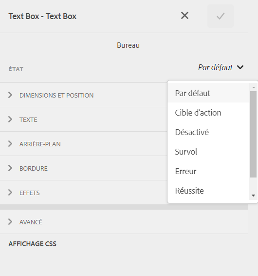
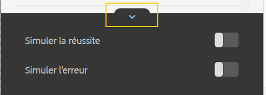

# Styles intégrés des composants de formulaire adaptatif {#inline-styling-of-adaptive-form-components}

 Adobe recommande d’utiliser la capture de données moderne et extensible. [Composants principaux](https://experienceleague.adobe.com/docs/experience-manager-core-components/using/adaptive-forms/introduction.html?lang=fr) pour [création d’un Forms adaptatif](/help/forms/creating-adaptive-form-core-components.md) ou [Ajout de Forms adaptatif à des pages AEM Sites](/help/forms/create-or-add-an-adaptive-form-to-aem-sites-page.md). Ces composants représentent une avancée significative dans la création de Forms adaptatif, ce qui garantit des expériences utilisateur impressionnantes. Cet article décrit l’approche plus ancienne de la création de Forms adaptatif à l’aide de composants de base. 

| Version | Lien de l’article |
| -------- | ---------------------------- |
| AEM 6.5 | [Cliquez ici](https://experienceleague.adobe.com/docs/experience-manager-65/forms/adaptive-forms-basic-authoring/inline-style-adaptive-forms.html) |
| AEM as a Cloud Service | Cet article |

Vous pouvez définir l’aspect général et le style d’un formulaire adaptatif en spécifiant les styles à l’aide d’un [éditeur de thèmes](themes.md). En outre, vous pouvez appliquer des styles CSS intégrés à différents composants de formulaire adaptatif et prévisualiser les modifications apportées à la volée. Les styles intégrés remplacent les styles fournis dans le thème.

## Application des propriétés de style CSS intégré {#apply-inline-css-properties}

Pour ajouter des styles intégrés à un composant :

1. Ouvrez votre formulaire dans l’éditeur de formulaires, puis choisissez le mode Style. Pour passer en mode Style, dans la barre d’outils de la page, sélectionnez  > **[!UICONTROL Style]**.
1. Sélectionnez un composant dans la page, puis cliquez sur le bouton Modifier . . Les propriétés de style s’ouvrent dans la barre latérale.

   Vous pouvez également sélectionner des composants dans l’arborescence de hiérarchie de formulaire dans la barre latérale. L’arborescence de hiérarchie de formulaires est disponible sous forme d’objets de formulaire dans la barre latérale.

   Dans le mode [!UICONTROL Style,] vous pouvez afficher les composants répertoriés sous Objets de formulaire. Cependant, la liste Objets de formulaire dans la barre latérale répertorie les composants tels que les champs et les panneaux. Les champs et les panneaux sont des composants génériques qui peuvent contenir des composants tels que des zones de texte et des boutons radio.

   Lorsque vous sélectionnez un composant dans la barre latérale, vous voyez tous les sous-composants répertoriés et les propriétés du composant sélectionné. Vous pouvez sélectionner un sous-composant spécifié et lui appliquer une mise en forme.

1. Cliquez sur un onglet de la barre latérale pour spécifier les propriétés CSS. Vous pouvez spécifier des propriétés telles que :

   * [!UICONTROL Dimensions et position] (paramètre d’affichage, remplissage, hauteur, largeur, marge, position, index z, flottant, clair, débordement)
   * [!UICONTROL Texte] (famille de polices, épaisseur, couleur, taille, hauteur de ligne et alignement)
   * [!UICONTROL Arrière-plan] (image et gradient, couleur d’arrière-plan)
   * [!UICONTROL Bordure] (largeur, style, couleur, rayon)
   * [!UICONTROL Effets] (ombre, opacité)
   * [!UICONTROL Avancé] (permet de saisir un CSS personnalisé pour le composant)

1. De même, vous pouvez appliquer des styles pour d’autres parties d’un composant tels que [!UICONTROL Widget], [!UICONTROL Légende] et [!UICONTROL Aide].
1. Sélectionner **[!UICONTROL Terminé]** pour confirmer les modifications ou **[!UICONTROL Annuler]** pour ignorer les modifications.

## Exemple : styles intégrés pour un composant de champ {#example-inline-styles-for-a-field-component}

Les images suivantes illustrent une zone de texte avant et après l’application des styles intégrés.

Composant de zone de texte avant d’appliquer les propriétés de style intégré

Notez la modification du style de la zone de texte comme illustré ci-dessous après l’application des propriétés CSS suivantes.

<table>
 <tbody>
  <tr>
   <td>
Sélecteur
 </td>
   <td>
propriété CSS
 </td>
   <td>
Valeur
 </td>
   <td>
Effet
 </td>
  </tr>
  <tr>
   <td>
Champ
 </td>
   <td>
bordure
 </td>
   <td>
Largeur de la bordure = 2px
 
Style de bordure = Plein
 
Couleur de la bordure = #1111
 </td>
   <td>
Crée une bordure large noire 2-px autour du champ
 </td>
  </tr>
  <tr>
   <td>
Zone de texte
 </td>
   <td>
background-color
 </td>
   <td>
#6495ED
 </td>
   <td>
Modifie la couleur de fond en CornflowerBlue (#6495ED)
 
Remarque : vous pouvez spécifier un nom de couleur ou son code hexadécimal dans le champ Valeur.
 </td>
  </tr>
  <tr>
   <td>
Libellé
 </td>
   <td>
Dimensions et position &gt; largeur
 </td>
   <td>
100 px
 </td>
   <td>
Définit la largeur sur 100 px pour le libellé.
 </td>
  </tr>
  <tr>
   <td>Icône d’aide du champ</td>
   <td>Texte &gt; Couleur de la police</td>
   <td>#2ECC40</td>
   <td>Modifie la couleur de la face de l’icône d’aide.</td>
  </tr>
  <tr>
   <td>
Description longue
 </td>
   <td>
text-align
 </td>
   <td>
centre
 </td>
   <td>
Aligne la description longue pour faciliter le centrage.
 </td>
  </tr>
 </tbody>
</table>

Composant de zone de texte après application des propriétés de style intégré

En suivant les étapes ci-dessus, vous pouvez sélectionner et mettre en forme d’autres composants, tels que les panneaux, les boutons d’envoi et les boutons radio.

>[!NOTE]
>
>Les propriétés de style varient en fonction du composant sélectionné.

## Copie et collage de styles {#copy-paste-styles}

Vous pouvez également copier un style et le coller d’un composant à un autre dans un formulaire adaptatif. Dans le **[!UICONTROL Style]** en mode , sélectionnez le composant, puis cliquez sur l’icône Copier .

Sélectionnez l’autre composant du même type, puis cliquez sur l’icône Coller .  pour copier le style. Vous pouvez également sélectionner l’icône Effacer le style .  pour effacer le style appliqué.

## Définition des styles pour les différents états d’un composant {#set-styles-for-states}

Vous pouvez définir des styles pour différents états d’un type de composant. Les différents états sont les suivants : [!UICONTROL Activé], [!UICONTROL Désactivé], [!UICONTROL Survol], [!UICONTROL Erreur], [!UICONTROL Succès] et [!UICONTROL Obligatoire].

Pour définir la mise en forme d’un état d’un composant :

1. Dans le **[!UICONTROL Style]** en mode , sélectionnez le composant, puis cliquez sur l’icône Modifier .

1. Sélectionnez l’état du composant à l’aide de la liste déroulante **[!UICONTROL État]**.

   

1. Définissez la mise en forme de l’état sélectionné du composant et sélectionnez  pour enregistrer les propriétés.

Vous pouvez également simuler les états de succès et d’erreur. Cliquez sur l’icône Développer pour afficher le **[!UICONTROL Simuler la réussite]** et **[!UICONTROL Simuler une erreur]** options.

## Voir également {#see-also}

{{see-also}}

<!--

>[!MORELIKETHIS]
>
>* [Use themes in Adaptive Form Core Components ](/help/forms/using-themes-in-core-components.md)

-->