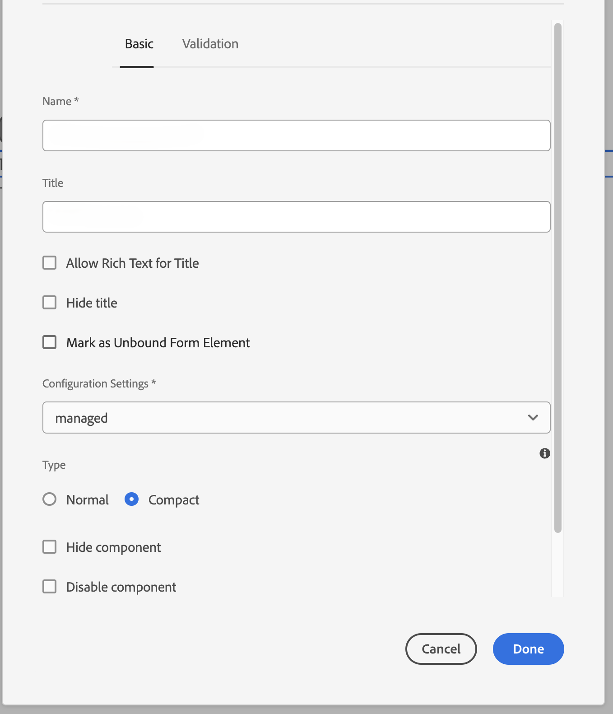

# Connexion de votre environnement AEM Forms avec Captcha® {#connect-your-forms-environment-with-hcaptcha-service}

 Cette fonctionnalité est inscrite dans le Programme des Adopteurs Anticipés. Vous pouvez écrire à aem-forms-ea@adobe.com à partir de votre adresse e-mail officielle pour rejoindre le programme d’adoption précoce et demander l’accès à la fonctionnalité. 

CAPTCHA (Completely Automated Public Turing test to tell Computers and Humans Apart, Test public de Turing complètement automatisé ayant pour but de différencier les personnes humaines des ordinateurs) est un programme couramment utilisé dans les transactions en ligne pour différencier les personnes humaines des programmes automatisés ou des robots. Il présente un test et évalue la réponse de l’utilisateur ou de l’utilisatrice pour déterminer s’il s’agit d’une personne humaine ou d’un robot qui interagit avec le site. Cela empêche l’utilisateur ou l’utilisatrice de continuer si le test échoue et permet de sécuriser les transactions en ligne en empêchant les robots d’envoyer du spam ou des éléments malveillants.

AEM Forms as a Cloud Service prend en charge les solutions CAPTCHA suivantes :

* [reCAPTCHA de Google](/help/forms/captcha-adaptive-forms-core-components.md)
* [Cloudflare Turnstile](/help/forms/integrate-adaptive-forms-turnstile-core-components.md)
* [Captcha](/help/forms/integrate-adaptive-forms-hcaptcha-core-components.md)

## Intégration de l’environnement AEM Forms avec Captcha Captcha

Le service hCaptcha® protège vos formulaires des robots, spams et violations automatisées. Il propose un test sous forme de widget de case à cocher et évalue la réponse de l’utilisateur ou de l’utilisatrice pour déterminer s’il s’agit d’une personne humaine ou d’un robot qui interagit avec le formulaire. Cela empêche l’utilisateur ou l’utilisatrice de continuer si le test échoue et permet de sécuriser les transactions en ligne en empêchant les robots d’envoyer du spam ou des activités malveillantes.

AEM Forms as a Cloud Service prend en charge Captcha® dans les composants principaux de Forms adaptatif. Vous pouvez l’utiliser pour présenter un défi de widget de case à cocher lors de l’envoi du formulaire.

<!-- -->

### Conditions préalables pour intégrer l’environnement AEM Forms avec Captcha® {#prerequisite}

Pour configurer Captcha® avec AEM Forms, vous devez obtenir la variable [Clé de site et clé secrète Captcha®](https://docs.hcaptcha.com/switch/#get-your-hcaptcha-sitekey-and-secret-key) du site web de Captcha®.

### Configuration de Captcha® {#steps-to-configure-hcaptcha}

Pour intégrer AEM Forms avec le service Captcha®, procédez comme suit :

1. Créez un conteneur de configuration sur votre environnement as a Cloud Service AEM Forms. Un conteneur de configuration contient les configurations cloud utilisées pour se connecter AEM aux services externes. Pour créer et configurer un conteneur de configuration afin de connecter votre environnement AEM Forms à avec Captcha® :
   1. Ouvrez votre instance AEM Forms as a Cloud Service.
   1. Accédez à **[!UICONTROL Outils > Général > Navigateur de configuration]**.
   1. Dans l’explorateur de configurations, vous pouvez sélectionner un dossier existant ou créer un dossier. Vous pouvez créer un dossier et activer l’option Configurations du cloud pour celui-ci ou Activer l’option Configurations du cloud pour un dossier existant :

      * Pour créer un dossier et activer l’option Configurations du cloud :
         1. Dans le navigateur de configuration, cliquez sur **[!UICONTROL Créer]**.
         1. Dans la boîte de dialogue Créer une configuration, indiquez un nom et un titre, puis sélectionnez le paramètre **[!UICONTROL Configurations du cloud]** .
         1. Cliquez sur **[!UICONTROL Créer]**.
      * Pour activer l’option Configurations du cloud pour un dossier existant :
         1. Dans l’explorateur de configurations, sélectionnez le dossier, puis sélectionnez **[!UICONTROL Propriétés]**.
         1. Dans la boîte de dialogue Propriétés de configuration, activez **[!UICONTROL Configurations cloud]**.
         1. Sélectionnez **[!UICONTROL Enregistrer et fermer]** pour enregistrer la configuration et fermer la boîte de dialogue.

1. Configurez le Cloud Service :
   1. Sur votre instance d’auteur AEM, accédez à  > **[!UICONTROL Cloud Service]** et sélectionnez **[!UICONTROL Captcha®]**.
      
   1. Sélectionnez un conteneur de configuration, créé ou mis à jour, comme décrit dans la section précédente. Sélectionnez **[!UICONTROL Créer]**.
      
   1. Spécifier **[!UICONTROL Titre]**, **[!UICONTROL Nom]**, **[!UICONTROL Clé du site]**, et **[!UICONTROL Clé secrète]** pour le service Captcha® [obtenu en prérequis](#prerequisite). Sélectionnez **[!UICONTROL Créer]**.

      

   >[!NOTE]
   > Les utilisateurs ne doivent pas modifier [URL de validation JavaScript côté client](https://docs.hcaptcha.com/#add-the-hcaptcha-widget-to-your-webpage) et [URL de validation côté serveur](https://docs.hcaptcha.com/#verify-the-user-response-server-side) car ils sont déjà préremplis pour la validation du Captcha®.

   Une fois le service hCAPTCHA configuré, il peut être utilisé dans une [Formulaire adaptatif basé sur les composants principaux](https://experienceleague.adobe.com/fr/docs/experience-manager-core-components/using/adaptive-forms/introduction).

## Utilisation de Captcha® dans un composant principal Forms adaptatif {#using-hCaptcha®-core-components}

1. Ouvrez votre instance AEM Forms as a Cloud Service.
1. Accédez à **[!UICONTROL Forms]** > **[!UICONTROL Forms et documents]**.
1. Sélectionnez un formulaire adaptatif et choisissez **[!UICONTROL Propriétés]**. Pour le **[!UICONTROL Conteneur de configuration]** sélectionnez l’option Conteneur de configuration contenant la configuration du cloud qui connecte AEM Forms à avec Captcha® et sélectionnez **[!UICONTROL Enregistrer et fermer]**.

   Si vous ne disposez pas d’un tel conteneur de configuration, reportez-vous à la section . [Connexion de votre environnement AEM Forms avec Captcha®](#connect-your-forms-environment-with-hcaptcha-service) pour savoir comment créer un conteneur de configuration.

   

1. Sélectionnez un formulaire adaptatif et choisissez **[!UICONTROL Modifier]**. Le formulaire adaptatif s’ouvre dans l’éditeur de Forms adaptatif.
1. À partir de l’explorateur de composants, effectuez un glisser-déposer ou ajoutez le **[!UICONTROL Captcha de formulaire adaptatif®]** sur le formulaire adaptatif.
1. Sélectionnez la variable **[!UICONTROL Captcha de formulaire adaptatif®]** composants et propriétés de clic  Icône Elle ouvre la boîte de dialogue des propriétés. Spécifiez les propriétés suivantes :

   

   * **[!UICONTROL Nom]:** Indiquez le nom de votre composant Captcha. Vous pouvez identifier facilement un composant de formulaire avec son nom unique dans le formulaire et dans l’éditeur de règles.
   * **[!UICONTROL Titre]:** Indiquez le titre de votre composant Captcha.
   * **[!UICONTROL Paramètres de configuration] :** sélectionnez une configuration de cloud configurée pour hCaptcha®.
   * **Taille du captcha :** Vous pouvez sélectionner la taille d&#39;affichage de la boîte de dialogue de défi Captcha®. Utilisez l’option **[!UICONTROL Compact]** pour afficher une boîte de dialogue de test Captcha® de petite taille et l’option **[!UICONTROL Normal]** pour afficher une taille relativement grande.<!-- or **[!UICONTROL Invisible]** to validate hCaptcha&reg; without explicitly rendering the checkbox widget on the user interface. -->
   * **[!UICONTROL Message de validation]:** Fournissez un message de validation pour votre validation Captcha lors de l’envoi du formulaire.
   * **[!UICONTROL Message de validation de script]** - Cette option permet de saisir un message à afficher en cas d’échec de la validation du script.
     >[!NOTE]
     >Vous pouvez avoir plusieurs configurations de cloud dans votre environnement à des fins similaires. Choisissez donc le service avec soin. Si aucun service n’est répertorié, voir [Connexion de votre environnement AEM Forms avec Captcha®](#connect-your-forms-environment-with-hcaptcha-service) pour savoir comment créer un Cloud Service qui connecte votre environnement AEM Forms au service Captcha®.
     <!--* **Error Message:** Provide the error message to display to the user when the Captcha submission fails.-->

1. Sélectionnez **[!UICONTROL Terminé]**.

Désormais, seuls les formulaires légitimes dans lesquels l’utilisateur réussit à résoudre le problème posé par le service Captcha® sont autorisés pour l’envoi du formulaire. hCaptcha®

**hCaptcha® est une marque déposée d’Intuition Machines, Inc.**

## Questions fréquentes

* **Q : Puis-je utiliser plusieurs composants Captcha dans un formulaire adaptatif ?**
* **Réponse :** L’utilisation de plusieurs composants Captcha dans un formulaire adaptatif n’est pas prise en charge. En outre, il n’est pas recommandé d’utiliser un composant Captcha dans un fragment ou un panneau marqué pour le chargement différé.

## Voir également {#see-also}

{{see-also}}
