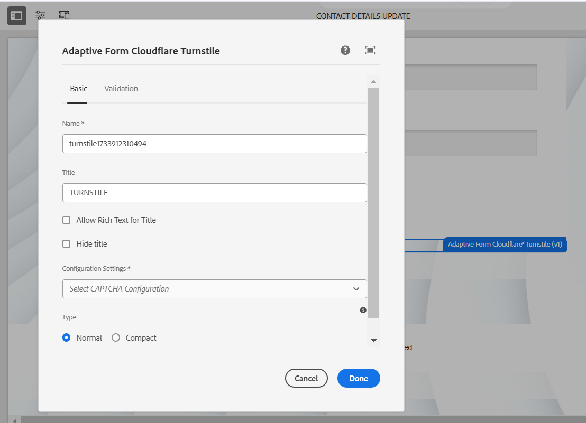

# Connecter votre environnement AEM Forms à Turnstile {#connect-your-forms-environment-with-turnstile-service}

 Cette fonctionnalité s’inscrit dans le cadre du programme d’adoption précoce. Vous pouvez écrire à aem-forms-ea@adobe.com à partir de votre adresse e-mail officielle pour rejoindre le programme d’adoption précoce et demander l’accès à la fonctionnalité. 

CAPTCHA (Completely Automated Public Turing test to tell Computers and Humans Apart, Test public de Turing complètement automatisé ayant pour but de différencier les personnes humaines des ordinateurs) est un programme couramment utilisé dans les transactions en ligne pour différencier les personnes humaines des programmes automatisés ou des robots. Il présente un test et évalue la réponse de l’utilisateur ou de l’utilisatrice pour déterminer s’il s’agit d’une personne humaine ou d’un robot qui interagit avec le site. Cela empêche l’utilisateur ou l’utilisatrice de continuer si le test échoue et permet de sécuriser les transactions en ligne en empêchant les robots d’envoyer du spam ou des éléments malveillants.

AEM Forms as a Cloud Service prend en charge les solutions CAPTCHA suivantes :

* [Turnstile](/help/forms/integrate-adaptive-forms-turnstile-core-components.md)
* [reCAPTCHA de Google](/help/forms/captcha-adaptive-forms-core-components.md)
* [hCaptcha](/help/forms/integrate-adaptive-forms-hcaptcha-core-components.md)

<!-- -->

## Intégration de l’environnement AEM Forms à Captcha Turnstile

Le Captcha Turnstile de Cloudflare est une mesure de sécurité qui vise à protéger les formulaires et les sites contre les robots automatisés, les attaques malveillantes, les spams et le trafic automatisé indésirable. Elle présente une case à cocher lors de l’envoi du formulaire pour vérifier qu’ils sont humains, avant de leur permettre d’envoyer le formulaire. AEM Forms as a Cloud Service prend en charge le Captcha de créneau dans les composants principaux de Forms adaptatif.

### Conditions préalables à l’intégration de l’environnement AEM Forms avec le Captcha Turnstile {#prerequisite}

Pour configurer Turnstile pour les composants principaux d’AEM Forms, vous devez obtenir la [clé de site Turnstile et clé secrète](https://developers.cloudflare.com/turnstile/get-started/) à partir du site Web Turnstile.

### Configurer le tourniquet {#steps-to-configure-hcaptcha}

Pour intégrer AEM Forms au service Turnstile, procédez comme suit :

1. Créez un conteneur de configuration sur votre environnement AEM Forms as a Cloud Service. Un conteneur de configuration contient les configurations cloud utilisées pour connecter AEM à des services externes. Pour créer et configurer un conteneur de configuration afin de connecter votre environnement AEM Forms à Turnstile, procédez comme suit :
   1. Ouvrez votre instance AEM Forms as a Cloud Service.
   1. Accédez à **[!UICONTROL Outils > Général > Navigateur de configuration]**.
   1. Dans l’explorateur de configurations, créez un dossier et activez les configurations cloud pour celui-ci ou activez les configurations cloud pour un dossier existant, comme expliqué ci-dessous :

      * Pour créer un **dossier** et activer les configurations cloud pour celui-ci, procédez comme suit :
         1. Dans le navigateur de configuration, cliquez sur **[!UICONTROL Créer]**.
         1. Dans la boîte de dialogue Créer une configuration, spécifiez un nom et un titre, puis sélectionnez l’option **[!UICONTROL Configurations cloud]**.
         1. Cliquez sur **[!UICONTROL Créer]**.
      * Pour activer l’option Configurations cloud pour un dossier **existant** :
         1. Dans l’explorateur de configurations, sélectionnez votre dossier existant, puis cliquez sur **[!UICONTROL Propriétés]**.
         1. Dans la boîte de dialogue Propriétés de configuration, activez **[!UICONTROL Configurations cloud]**.
         1. Cliquez sur **[!UICONTROL Enregistrer et fermer]** pour enregistrer la configuration et quitter.

1. Configurez le Cloud Service :
   1. Sur votre instance d’auteur AEM, accédez à  > **[!UICONTROL Cloud Service]** puis cliquez sur **[!UICONTROL Tourniquet]**.
      
   1. Sélectionnez un conteneur de configuration, créé ou mis à jour, comme décrit dans la section précédente. Sélectionnez **[!UICONTROL Créer]**.
      
   1. Spécifiez **[!UICONTROL Type de widget]** comme géré, non interactif ou invisible. Pour en savoir plus sur le type de widget, consultez [Widget tourniquet](https://developers.cloudflare.com/turnstile/concepts/widget/).
   1. Spécifiez **[!UICONTROL Titre]**, **[!UICONTROL Nom]**, **[!UICONTROL Clé du site]** et **[!UICONTROL Clé secrète]** pour le service Turnstile [obtenu dans les conditions préalables](#prerequisite).
   1. Cliquez sur **[!UICONTROL Créer]**.

      

   >[!NOTE]
   > Les utilisateurs n’ont pas besoin de modifier les URL de validation de JavaScript côté client et côté serveur, car elles sont déjà préremplies pour la validation Turnstile.

   Une fois le service Captcha de tourniquet configuré, il peut être utilisé dans un [formulaire adaptatif basé sur les composants principaux](https://experienceleague.adobe.com/fr/docs/experience-manager-core-components/using/adaptive-forms/introduction).

## Utiliser Turnstile dans un formulaire adaptatif {#using-turnstile-core-components}

1. Ouvrez votre instance AEM Forms as a Cloud Service.
1. Accédez à **[!UICONTROL Forms]** > **[!UICONTROL Forms et documents]**.
1. Sélectionnez votre formulaire adaptatif et cliquez sur **[!UICONTROL Propriétés]**. Dans la section **[!UICONTROL Conteneur de configurations]**, sélectionnez le Conteneur de configurations contenant la configuration cloud qui connecte AEM Forms à Turnstile.
1. Cliquez sur **[!UICONTROL Enregistrer et fermer]**.

   Si vous ne disposez pas d’un conteneur de configuration, consultez la section [Configurer le tourniquet](#steps-to-configure-hcaptcha) pour savoir comment créer un conteneur de configuration.

   

1. Sélectionnez un formulaire adaptatif et cliquez sur **[!UICONTROL Modifier]** pour ouvrir un formulaire dans l’éditeur.
1. À partir de l’explorateur de composants, faites glisser et déposez ou ajoutez le composant **[!UICONTROL Tourniquet de formulaire adaptatif]** sur le formulaire adaptatif.
   
1. Sélectionnez le composant **[!UICONTROL Tourniquet de formulaire adaptatif]** et cliquez sur l’icône Propriétés . Cela ouvre la boîte de dialogue des propriétés. Spécifiez les propriétés suivantes :

   

   * **[!UICONTROL Nom] :** indiquez le nom de votre composant Captcha ; vous pouvez identifier facilement un composant de formulaire en lui attribuant un nom unique dans le formulaire et dans l’éditeur de règles.
   * **[!UICONTROL Titre] :** spécifiez le titre de votre composant Captcha. vous pouvez autoriser le texte enrichi pour le titre et également masquer le titre en cochant les cases.
   * **[!UICONTROL Paramètres de configuration] :** sélectionnez une configuration cloud configurée pour le service Captcha de tourniquet.
     >[!NOTE]
     >* Plusieurs configurations cloud peuvent être définies dans votre environnement dans un but similaire. Donc, choisissez le service avec soin. Si aucun service n’est répertorié, reportez-vous à la section [Configuration d’un tourniquet](#steps-to-configure-hcaptcha) pour savoir comment créer un conteneur de configuration afin de connecter votre environnement AEM Forms au service de tourniquet.

   * **[!UICONTROL Validation] :** effectuez une validation Captcha sous la forme d’un message d’erreur :

      * **Message d’erreur :** le message d’erreur à afficher à l’utilisateur ou à l’utilisatrice en cas d’échec de l’envoi du Captcha.
        >[!NOTE]
        >* Un message d’erreur ne s’affiche que si le CAPTCHA est renseigné côté client.
1. Cliquez sur **[!UICONTROL Terminé]**.

Désormais, seuls les formulaires légitimes, dans lesquels le remplisseur de formulaire résout avec succès le problème posé par le service Turnstile, sont autorisés pour l’envoi du formulaire.

## Questions fréquentes

* **Q : Puis-je utiliser plusieurs composants Captcha dans un formulaire adaptatif ?**
* **Réponse :** l’utilisation de plusieurs composants Captcha dans un formulaire adaptatif n’est pas prise en charge. En outre, il n’est pas recommandé d’utiliser un composant Captcha dans un fragment ou un panneau marqué pour le chargement différé.

## Voir également {#see-also}

{{see-also}}
