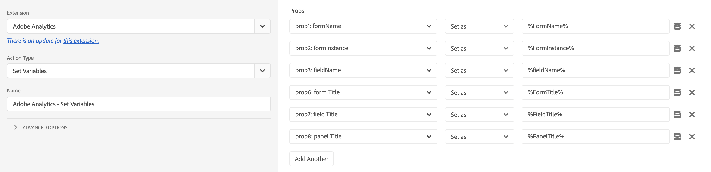
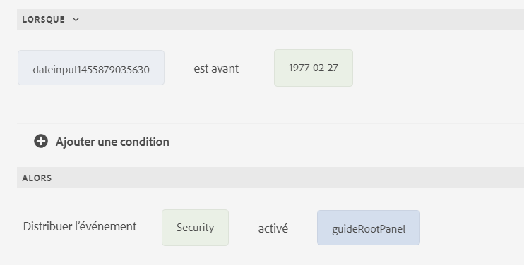

# Form Analytics avec Adobe Analytics et AEM Forms - Guide complet {#integrate-aem-forms-with-adobe-analytics}

## Qu’est-ce que Form Analytics ?

L’analyse des formulaires est le processus de collecte, de mesure et d’analyse des données sur la manière dont les utilisateurs interagissent avec vos formulaires. Il fournit des informations sur le comportement des utilisateurs et utilisatrices, identifie les goulets d’étranglement dans le processus de remplissage de formulaire et aide à optimiser les formulaires pour de meilleurs taux de conversion.

L’analyse des formulaires va au-delà du simple suivi des envois pour fournir des informations complètes sur chaque aspect de l’expérience utilisateur. En analysant la façon dont les utilisateurs interagissent avec les champs de formulaire individuels, les modèles de navigation et les comportements de saisie semi-automatique, les entreprises peuvent apporter des améliorations basées sur les données qui ont un impact significatif sur les résultats commerciaux.

### Concepts d’analyse des formulaires principaux

**Suivi des interactions utilisateur**
L’analyse des formulaires capture des informations détaillées sur la manière dont les utilisateurs interagissent avec les formulaires, notamment le temps passé sur chaque champ, les mouvements de souris, le comportement de défilement et les schémas d’interaction. Ces données granulaires permettent d’identifier les problèmes de convivialité et les opportunités d’optimisation.

**Analyse des modèles comportementaux**
En analysant les modèles de comportement des utilisateurs sur plusieurs sessions de formulaires, les entreprises peuvent identifier les parcours d’utilisateurs courants, les points d’abandon typiques et les chemins d’achèvement réussis. Cette analyse permet des améliorations ciblées qui répondent aux besoins réels des utilisateurs.

**Mesure du rendement**
L’analyse des formulaires fournit des mesures quantitatives qui mesurent l’efficacité des formulaires, notamment les taux de conversion, les délais d’achèvement, la fréquence des erreurs et les indicateurs de satisfaction des utilisateurs. Ces mesures permettent une évaluation objective des performances du formulaire et de l’impact de l’optimisation.

### Importance des analyses de formulaires pour l’entreprise

L’analyse de formulaires transforme les données brutes d’interaction utilisateur en informations commerciales exploitables qui génèrent des améliorations mesurables pour les mesures commerciales clés :

**Optimisation du taux de conversion**
L’abandon de formulaire est un défi commercial majeur qui a un impact direct sur le chiffre d’affaires et la génération de pistes. Les recherches montrent que 68 % des utilisateurs abandonnent les formulaires avant de les remplir, ce qui rend l’analyse des formulaires essentielle pour identifier les points de dépôt. L’analyse de formulaire permet des stratégies d’optimisation de conversion ciblées qui peuvent améliorer considérablement les performances des formulaires. L’optimisation efficace des conversions par le biais de l’analyse des formulaires offre des améliorations mesurables dans la génération de pistes et l’acquisition de clients.

**Amélioration de l’expérience utilisateur**
Comprendre les difficultés et les points faibles des utilisateurs permet aux entreprises de créer des expériences de formulaire plus fluides et plus intuitives. Cela permet d’accroître la satisfaction des clients, de réduire les coûts de support et d’améliorer la perception de la marque.

**Prise De Décision Basée Sur Les Données**
Plutôt que de s’appuyer sur des hypothèses ou des bonnes pratiques, l’analyse des formulaires fournit des données concrètes sur l’analyse du comportement des utilisateurs. Cela permet une optimisation de la conversion basée sur des preuves qui fournit des résultats nettement meilleurs que les modifications basées sur l’intuition. L’analyse du comportement des utilisateurs par le biais du suivi des performances des formulaires garantit que les efforts d’optimisation se concentrent sur les besoins réels des utilisateurs plutôt que sur les hypothèses.

**Mesure et justification du retour sur investissement**
L’analyse des formulaires quantifie l’impact des efforts d’optimisation, en fournissant des mesures claires qui démontrent la valeur commerciale. Les entreprises peuvent mesurer la corrélation directe entre les améliorations de formulaire et les résultats commerciaux tels que la génération de pistes, la conversion des ventes et les coûts d’acquisition des clients.

**Avantage concurrentiel**
Des expériences de formulaire de qualité supérieure deviennent un facteur de différenciation concurrentiel dans l’acquisition de clients. Les entreprises qui utilisent l’analyse de formulaires peuvent créer des expériences utilisateur exceptionnelles qui surpassent leurs concurrents et stimulent la croissance des parts de marché.

### Mesures clés d’analyse des formulaires

Les analyses de formulaires efficaces se concentrent sur les mesures qui affectent directement les résultats commerciaux et fournissent des informations exploitables pour l’optimisation :

**Mesures de succès du Principal**

- **Taux de conversion du formulaire** : pourcentage de vues de formulaire qui entraînent des envois réussis - la mesure ultime de l’efficacité du formulaire
- **Taux d’abandon de formulaire** : où et pourquoi les utilisateurs abandonnent, ce qui entraîne des problèmes d’expérience utilisateur avec insight
- **Temps d’achèvement** : temps nécessaire aux utilisateurs et utilisatrices pour remplir des formulaires, indiquant la complexité et la qualité de l’expérience utilisateur

**Indicateurs de performance détaillés**

- **Field-Level Analytics** : quels champs spécifiques posent problème, ce qui permet des efforts d’optimisation ciblés
- **Analyse des taux d’erreurs** : problèmes de validation et erreurs de l’utilisateur qui empêchent la réussite du remplissage du formulaire
- **Modèles d’utilisation de l’aide** : quand et où les utilisateurs ont besoin d’aide, indiquant les améliorations à apporter

**Mesures comportementales avancées**

- **Analyse de l’entonnoir de conversion** : parcours des utilisateurs sur des formulaires à plusieurs étapes, présentant les schémas de progression et de déperdition
- **Performances des appareils et des navigateurs** : facteurs techniques affectant la réussite dans différents environnements utilisateur
- **Profondeur de l’engagement des utilisateurs** : temps passé sur les formulaires, modèles d’interaction avec les champs et indicateurs d’attention des utilisateurs

**Mesures de l’impact commercial**

- **Corrélation de la qualité du lead** : relation entre le comportement de remplissage de formulaire et la conversion du lead et la valeur client
- **Performances de Traffic Source** : quels canaux marketing génèrent les envois de formulaires de la plus haute qualité ?
- **Impact saisonnier et de campagne** : variation des performances des formulaires en fonction des activités marketing et des facteurs externes

## Avantages commerciaux de Form Analytics

La mise en œuvre d’analyses de formulaires offre une valeur commerciale mesurable sur plusieurs dimensions. Les entreprises qui utilisent Forms Analytics constatent généralement des améliorations significatives en termes de taux de conversion, de satisfaction des utilisateurs et d’efficacité opérationnelle.

### &#x200B;1. Réduire les abandons de formulaire et augmenter les conversions

L’abandon de formulaire est un défi commercial majeur qui a un impact direct sur le chiffre d’affaires et la génération de pistes :

- **Identification des points de dépôt** : suivez exactement l’endroit où les utilisateurs abandonnent les formulaires pour identifier les champs ou sections problématiques
- **Optimiser le flux de formulaires** : réorganiser, simplifier ou supprimer les champs qui provoquent les taux d’abandon les plus élevés
- **Améliorations apportées aux tests A/B** : testez différentes variations de formulaire et mesurez leur impact sur les taux d’achèvement
- **Optimisation des appareils mobiles** : identifier les problèmes spécifiques aux appareils mobiles qui empêchent la saisie semi-automatique des formulaires
- **Surveillance en temps réel** : recevez des alertes immédiates lorsque les performances des formulaires se dégradent

**Impact commercial** : les entreprises constatent généralement une amélioration significative des taux de conversion de formulaire après l’implémentation d’optimisations basées sur les analyses.

### &#x200B;2. Améliorer l&#39;expérience et la satisfaction des utilisateurs

L’analyse des formulaires fournit des informations détaillées sur le comportement des utilisateurs et les problèmes :

- **Réduire le temps d’achèvement** : identifier les champs dont l’achèvement est trop long et rationaliser le processus
- **Réduire la frustration des utilisateurs** : suivez les modèles d’erreur et les problèmes de validation pour améliorer l’utilisation du formulaire
- **Optimiser l’ordre des champs** : organisez les champs dans la séquence la plus logique et la plus conviviale
- **Améliorer l’aide et les conseils** : identifier les endroits où les utilisateurs ont besoin d’aide et fournir une aide ciblée
- **Expérience entre appareils** : garantir des performances cohérentes sur les postes de travail, les tablettes et les appareils mobiles

**Impact commercial** : l’amélioration de l’expérience client entraîne une augmentation des scores de satisfaction client et de la fidélité à la marque.

### &#x200B;3. Apporter Des Améliorations Aux Formulaires Pilotés Par Les Données

Remplacez les conjectures par des données concrètes lors de l’optimisation des formulaires :

- **Décisions basées sur des preuves** : utilisez des données réelles sur le comportement des utilisateurs plutôt que des hypothèses pour orienter les améliorations
- **Mesurer l’impact de l’optimisation** : quantifier les résultats des modifications de formulaire avec les analyses avant/après
- **Hiérarchiser les améliorations** : privilégiez les modifications qui auront le plus d’impact sur les mesures commerciales
- **Optimisation continue** : établissez des cycles d’amélioration continus en fonction des données de performance
- **Rapports des parties prenantes** : fournissez des mesures concrètes pour démontrer les performances du formulaire et le retour sur investissement

**Impact commercial** : l’optimisation pilotée par les données offre généralement de bien meilleurs résultats que les modifications basées sur l’intuition.

### &#x200B;4. Améliorer la qualité des leads et l&#39;efficacité des ventes

L’analyse des formulaires permet d’optimiser non seulement la quantité mais aussi la qualité des envois :

- **Intégration de la notation du lead** : corrélez le comportement du formulaire avec la qualité du lead et le potentiel de conversion.
- **Attribution Source** : identifiez les sources de trafic qui génèrent les envois de formulaires de la plus haute qualité
- **Profilage progressif** : optimisez les formulaires à plusieurs étapes pour rassembler davantage de prospects qualifiés
- **Informations sur la segmentation** : identifier les modèles de comportement des formulaires clients à forte valeur ajoutée
- **Optimisation de la remise des ventes** : fournissez aux équipes commerciales un contexte sur les interactions de formulaire de prospect

**Impact commercial** : des prospects de meilleure qualité entraînent une amélioration des taux de conversion des ventes et une réduction des coûts d’acquisition des clients.

### &#x200B;5. Efficacité opérationnelle et réduction des coûts

L’analyse des formulaires entraîne des améliorations opérationnelles dans l’ensemble de l’organisation :

- **Réduction du nombre de tickets d’assistance** : identifier et résoudre les problèmes de formulaire courants qui génèrent des appels au service clientèle
- **Automate Optimization** : configurez des alertes automatisées et des règles d’optimisation en fonction des seuils de performance
- **Allocation des ressources** : concentrez les ressources de développement sur les formulaires et champs présentant l’impact commercial le plus important
- **Surveillance de la conformité** : suivez les performances des formulaires pour la conformité aux réglementations et à l’accessibilité
- **Efficacité de l’intégration** : optimisez les intégrations de formulaire à système en fonction des modèles d’envoi

**Impact commercial** : les améliorations opérationnelles peuvent réduire considérablement les coûts d’assistance liés aux formulaires.

### &#x200B;6. Avantage Concurrentiel Grâce À Une Forms Supérieure

L’analyse de formulaire permet aux entreprises de créer des expériences de formulaire haut de gamme :

- **Performances de référence** : comparez les performances des formulaires aux normes du secteur et aux concurrents.
- **Opportunités d’innovation** : identifiez les opportunités d’optimisation uniques que les concurrents peuvent manquer
- **Rétention des clients** : des expériences de formulaires de qualité supérieure contribuent à la satisfaction et à la fidélisation globales des clients
- **Différenciation du marché** : utilisez les informations d’analyse des formulaires pour créer des avantages concurrentiels dans l’expérience utilisateur
- **Optimisation évolutive** : appliquez des modèles de formulaire réussis à plusieurs produits et campagnes

**Impact commercial** : des expériences de formulaire de qualité supérieure peuvent devenir un facteur de différenciation concurrentiel important dans l’acquisition de clients.

## Cas d’utilisation et exemples d’Analytics de formulaire

Comprendre comment l’analyse des formulaires s’applique aux scénarios réels aide les organisations à identifier les opportunités d’optimisation et à mettre en œuvre des stratégies de mesure efficaces. Voici des cas d’utilisation courants dans différents secteurs d’activité et types de formulaires.

### e-commerce et vente au détail Forms

**Passage en caisse et Forms de paiement**

- **Défi** : un abandon de panier trop élevé pendant le processus de passage en caisse a une incidence directe sur le chiffre d’affaires
- **Solution Form Analytics** : suivez les taux d’achèvement champ par champ et les performances des formulaires pour identifier les points de friction.
- **Résultats courants** : les champs de carte de crédit, la validation de l’adresse d’expédition et les étapes de création de compte entraînent souvent l’abandon du formulaire
- **Résultats de l’optimisation des conversions** : les détaillants constatent généralement une amélioration significative de l’achèvement du passage en caisse après l’optimisation des performances des formulaires pilotée par les analyses
- **Analyse du comportement des utilisateurs** : suivez les modèles d’abandon de panier pour comprendre quand et pourquoi les clients quittent lors du passage en caisse
- **Impact commercial** : la réduction des abandons de formulaires se traduit directement par une augmentation des revenus et une amélioration des coûts d’acquisition des clients

**Enregistrement et garantie des produits Forms**

- **Défi** : taux d’enregistrement des produits faibles affectant le service clientèle et le marketing
- **Solution Analytics** : surveillez les taux d’achèvement et identifiez l’impact sur le champ facultatif ou obligatoire
- **Stratégie d’optimisation** : réduisez les champs obligatoires et améliorez l’expérience mobile.
- **Impact commercial** : des taux d’enregistrement plus élevés améliorent la valeur client et l’efficacité du support

### Génération de leads et Forms B2B

**Forms des demandes de contact et de démonstration**

- **Défi** : trouver le juste équilibre entre la qualité des prospects et les taux de remplissage des formulaires et réduire l’abandon des formulaires
- **Solution Form Analytics** : suivez la corrélation entre les performances du formulaire, la longueur du formulaire et la qualité de conversion des prospects
- **Informations clés** : le profilage progressif surclasse souvent les formulaires d’une seule page longs pour l’optimisation de la conversion
- **Analyse du comportement des utilisateurs** : contrôlez l’impact de la longueur du formulaire sur les taux d’achèvement et les scores de qualité des prospects
- **Résultats de l’optimisation des conversions** : les entreprises B2B constatent une amélioration significative de la génération de pistes qualifiées grâce à l’optimisation des performances des formulaires
- **Impact commercial** : une meilleure analyse des formulaires conduit à des prospects de meilleure qualité et à de meilleurs taux de conversion des ventes

**Enregistrement de webinaires et d’événements**

- **Défi** : optimiser la participation aux événements tout en collectant les informations nécessaires
- **Solution Analytics** : contrôlez les taux d’inscription par rapport aux taux de présence réels.
- **Schémas courants** : des formulaires plus courts augmentent les inscriptions, mais peuvent réduire la qualité de la participation
- **Bonne pratique** : utilisez l’analyse pour trouver un équilibre optimal entre la longueur du formulaire et la qualité du participant

### Forms des services financiers

**Demandes de prêt et de crédit**

- **Défi** : applications complexes à plusieurs étapes avec des taux d&#39;abandon élevés
- **Solution Analytics** : suivez les taux d’achèvement à chaque étape et identifiez les points de chute
- **Critical Insights** : les étapes de chargement de documents et de vérification des revenus entraînent souvent l’abandon
- **Stratégie d’optimisation** : fournissez des indicateurs de progression clairs et une fonctionnalité d’enregistrement et de reprise.
- **Considérations réglementaires** : Analytics doit respecter les exigences en matière de confidentialité des données financières.

**Forms des devis et réclamations d’assurance**

- **Défi** : collecter des informations détaillées tout en maintenant l’interaction client
- **Solution Analytics** : surveillez le délai d’achèvement et l’engagement au niveau du terrain
- **Résultats clés** : le remplissage automatique et les valeurs par défaut intelligentes améliorent considérablement les taux d’achèvement
- **Impact commercial** : l’amélioration du remplissage des formulaires est directement corrélée aux taux de conversion des politiques

### Santé et Forms médicale

**Enregistrement et admission des patients Forms**

- **Défi** : Collecter efficacement des informations médicales complètes
- **Solution Analytics** : suivez les taux d’achèvement sur différentes données démographiques des patients.
- **Objectif accessibilité** : surveiller les performances sur différents appareils et outils d’accessibilité
- **Priorité d’optimisation** : optimisation mobile essentielle pour la satisfaction des patients
- **Exigences de conformité** : la conformité HIPAA est essentielle pour toutes les implémentations Analytics

**Forms de planification des rendez-vous**

- **Défi** : réduire le nombre de non-présentation tout en simplifiant le processus de réservation
- **Solution Analytics** : corrélez le comportement de remplissage du formulaire avec la présence au rendez-vous.
- **Informations clés** : les préférences de confirmation et de rappel ont un impact significatif sur l’assiduité
- **Opportunité d’intégration** : connecter l’analyse des formulaires aux systèmes de gestion des rendez-vous

### Etablissement scolaire Forms

**Forms de demande et d’inscription**

- **Défi** : gérer des applications complexes à plusieurs étapes avec des exigences de document
- **Solution Analytics** : suivez les taux d’achèvement à différentes étapes de l’application
- **Mesures critiques** : modèles d’utilisation de délai d’achèvement et d’enregistrement et de reprise
- **Objectif optimisation** : l’expérience mobile devient de plus en plus importante pour les applications étudiantes
- **Considérations saisonnières** : Les performances varient considérablement au cours des périodes d’application

**Forms d’enregistrement et de retour d’informations sur le cours**

- **Défi** : Maximiser l&#39;engagement des étudiants dans les processus administratifs
- **Solution Analytics** : surveiller les taux d’achèvement et identifier les problèmes d’expérience utilisateur
- **Informations clés** : l’intégration aux portails destinés aux étudiants améliore les taux d’achèvement
- **Amélioration continue** : un examen régulier des analyses est essentiel pour l’optimisation semestre par semestre.

### Scénarios courants d’analyse de formulaire

**Optimisation de formulaire à plusieurs étapes**

Les formulaires à plusieurs étapes atteignent généralement des taux de conversion de 86 % supérieurs à ceux des formulaires à page unique lorsqu’ils sont correctement optimisés :

- **Analyse étape par étape** : suivez les taux de réalisation à chaque étape du formulaire
- **Impact de l’indicateur de progression** : mesure de l’impact des barres de progression sur les taux de réalisation
- **Utilisation de l’enregistrement et de la reprise** : contrôlez comment l’enregistrement du brouillon affecte l’achèvement final.
- **Performances mobiles et ordinateurs de bureau** : comparez les taux d’achèvement sur tous les appareils

**Analyse des performances au niveau du terrain**

- **Champs obligatoires ou facultatifs** : analyse de l’impact des exigences en matière de champ sur l’achèvement
- **Optimisation de l’ordre des champs** : testez différentes séquences de champs pour un flux optimal
- **Modèles d’erreur de validation** : identifier les erreurs courantes de l’utilisateur et améliorer la validation
- **Efficacité du texte d’aide** : Mesurer l’impact des conseils sur le terrain sur les taux d’achèvement

**Performances saisonnières et de campagne**

- **Analyse des Source de trafic** : comparaison des performances des formulaires sur les canaux marketing
- **Variations saisonnières** : suivez l’évolution des performances des formulaires tout au long de l’année
- **Intégration de Campaign** : corrélez l’analyse des formulaires avec les performances des campagnes marketing
- **Intégration des tests A/B** : utilisez des analyses pour mesurer les variations de test et les optimiser en continu

## Scénarios D’Implémentation De Real-World Form Analytics

La compréhension de scénarios d’implémentation spécifiques aide les organisations à appliquer efficacement l’analyse des formulaires dans différents contextes commerciaux. Ces exemples réels montrent comment le suivi des performances des formulaires et l’optimisation des conversions offrent des résultats commerciaux mesurables.

### Optimisation du passage en caisse pour le commerce électronique

**Scénario** : retailer en ligne présentant un abandon de panier élevé lors du passage en caisse

- **Implémentation de Form Analytics** : suivez l’abandon du panier au niveau du formulaire à l’aide d’une analyse champ par champ.
- **Principales constatations** : Le remplissage du formulaire de paiement a chuté de manière significative à l’étape de vérification des cartes de crédit
- **Stratégie d’optimisation des conversions** : formulaire de paiement simplifié, indicateurs de progression ajoutés, expérience mobile optimisée.
- **Résultats** : Réduction substantielle des abandons de formulaires et augmentation des recettes
- **Analyse du comportement des utilisateurs** : les utilisateurs d’appareils mobiles identifiés ont présenté des taux d’abandon plus élevés, ce qui a conduit à une reconception initiale des appareils mobiles

### Optimisation du formulaire de génération de leads

**Scénario** : société de logiciels B2B se débattant avec des prospects de faible qualité provenant de formulaires de contact

- **Problème de performances des formulaires** : taux d’achèvement des formulaires élevés, mais conversion de prospect à client médiocre
- **Solution Analytics** : corrélez le comportement de remplissage du formulaire avec la qualité du prospect et les résultats des ventes.
- **Approche d’optimisation** : implémentation du profilage progressif et de l’intégration de notation des prospects
- **Impact commercial** : amélioration significative de la qualité des prospects et augmentation des prospects qualifiés pour les ventes
- **Optimisation des conversions** : réduction de l’abandon de formulaire tout en améliorant la qualification des prospects

### Optimisation de l’enregistrement et de l’intégration

**Scénario** : plateforme SaaS avec un taux d’abandon élevé lors du processus d’intégration

- **Analyse du comportement des utilisateurs** : suivez les taux d’achèvement des inscriptions et identifiez les goulets d’étranglement à l’intégration
- **Insights Form Analytics** : un abandon significatif d’utilisateurs et utilisatrices a eu lieu lors de l’étape de vérification du compte
- **Stratégie d’optimisation** : processus de vérification rationalisé, ajout de la fonctionnalité de sauvegarde et de reprise.
- **Résultats** : augmentation substantielle du taux d’achèvement de l’inscription et des taux d’activation des utilisateurs améliorés
- **Impact à long terme** : meilleure intégration corrélée à une valeur de durée de vie client plus élevée

## Fonctionnalités d’analyse de formulaire d’Adobe Analytics

Adobe Analytics fournit des fonctionnalités de suivi des formulaires de niveau entreprise qui permettent aux organisations de capturer des informations détaillées sur les interactions des utilisateurs avec leurs formulaires. L’intégration transparente à AEM Forms offre des options d’analyse puissantes prêtes à l’emploi et des options de personnalisation sophistiquées qui s’adaptent aux besoins de l’entreprise.

### Pourquoi choisir Adobe Analytics pour Form Analytics ?

**Performance à l’échelle de l’entreprise**
Adobe Analytics gère des millions d’interactions de formulaires sans dégradation des performances, ce qui le rend idéal pour les sites web à trafic élevé et les environnements d’entreprise complexes. L’infrastructure robuste de la plateforme garantit une collecte de données fiable, même pendant les périodes de pointe.

**Fonctionnalités de segmentation avancées**
Contrairement aux outils d’analyse de formulaire de base, Adobe Analytics permet une segmentation sophistiquée des utilisateurs et utilisatrices en fonction du comportement, des données démographiques, des sources de trafic et des critères métier personnalisés. Cela permet d’appliquer des stratégies d’optimisation ciblées qui répondent à des scénarios et des groupes d’utilisateurs spécifiques.

**Informations et alertes en temps réel**
Surveillez les performances des formulaires telles qu’elles se présentent avec des tableaux de bord en temps réel et des alertes automatisées. Identifiez les problèmes et réagissez immédiatement, en évitant les pertes de revenus potentielles dues aux problèmes de formulaire ou à la dégradation des performances.

### Fonctionnalités de tracking prêtes à l’emploi

AEM Forms s’intègre de manière transparente à [Adobe Analytics](https://experienceleague.adobe.com/docs/analytics-learn/tutorials/overview.html?lang=fr) pour capturer et suivre automatiquement les mesures de performances des formulaires que vous avez publiés. Vous pouvez surveiller le comportement des utilisateurs authentifiés et anonymes sans configuration supplémentaire.

Avant de mettre en œuvre des analyses de formulaires, assurez-vous que votre environnement [AEM Forms est correctement configuré](/help/forms/setup-forms-cloud-service.md) et que vous avez [créé vos formulaires adaptatifs](/help/forms/creating-adaptive-form-core-components.md) à l’aide des composants principaux ou [composants de base](/help/forms/creating-adaptive-form.md).

**Suivi complet des événements de formulaire :**

Adobe Analytics capture automatiquement une vue d’ensemble des interactions entre les formulaires utilisateur :

- **Rendus de formulaire** : suivez les impressions et les vues de formulaire pour comprendre la portée et l’engagement initial
- **Envois de formulaires** : surveillez les envois réussis avec un contexte d’envoi détaillé et des données de parcours utilisateur
- **Analyse de l’abandon de formulaire** : capturez des points d’abandon précis avec une granularité au niveau du champ et un contexte de session utilisateur
- **Suivi des erreurs de validation** : enregistrez les types d’erreurs, la fréquence et les modèles de résolution pour identifier les problèmes d’utilisation
- **Utilisation du contenu d’aide** : surveillez le moment où les utilisateurs accèdent aux ressources d’aide, en indiquant les zones de confusion ou de complexité
- **Interactions au niveau du champ** : suivez l’engagement sur le terrain, la durée de la visite et les schémas d’interaction
- **Comportement d’enregistrement de brouillon** : comprenez l’intention de l’utilisateur et la complexité du formulaire grâce à des modèles d’utilisation d’enregistrement et de reprise
- **Suivi entre sessions** : suivez les utilisateurs au cours de plusieurs sessions de formulaire pour comprendre les parcours d’achèvement

**Informations comportementales avancées :**

- **Analyse du temps passé sur le champ** : mesurez le temps passé par les utilisateurs et utilisatrices sur chaque champ de formulaire pour identifier les problèmes de complexité
- **Modèles de mouvement de souris** : suivez les hésitations et l’engagement des utilisateurs grâce à l’analyse du comportement du curseur
- **Suivi de la profondeur de défilement** : comprenez la manière dont les utilisateurs naviguent dans les formulaires longs et identifiez la longueur optimale de formulaire
- **Modèles de récupération d’erreurs** : analysez la manière dont les utilisateurs répondent aux erreurs de validation et les récupèrent

### Suivi des événements personnalisés

Au-delà des événements de formulaire standard, Adobe Analytics permet un suivi personnalisé sophistiqué :

- **Mesures spécifiques à l’entreprise** : définissez des événements personnalisés à l’aide de l’éditeur de règles pour effectuer le suivi des interactions de formulaires spécifiques à une organisation
- **Mappage des Parcours utilisateur** : créez des événements personnalisés pour suivre les chemins d’accès utilisateur complexes à travers des formulaires à plusieurs étapes
- **Analyse de l’entonnoir de conversion** : configurez des événements personnalisés pour mesurer des points de conversion et des étapes de dépôt spécifiques
- **Événements d’intégration** : suivez les interactions des formulaires avec les systèmes et API externes.

### Fonctionnalités de création de rapports avancées

Adobe Analytics fournit des fonctionnalités de création de rapports de niveau entreprise pour les performances des formulaires :

- **Tableaux de bord en temps réel** : surveiller les performances des formulaires et les interactions utilisateur au fur et à mesure qu’elles se produisent
- **Analyse de segmentation** : analysez les performances des formulaires sur différents groupes d’utilisateurs, sources de trafic et données démographiques
- **Visualisation en entonnoir** : visualisez la progression des utilisateurs et utilisatrices au moyen de formulaires à plusieurs étapes et identifiez les opportunités d’optimisation
- **Analyse des cohortes** : suivez les améliorations des performances des formulaires au fil du temps et mesurez l’impact de l’optimisation.
- **Suivi sur plusieurs appareils** : comprendre comment les utilisateurs interagissent avec les formulaires sur différents appareils et sessions

### Avantages de l’intégration

L’intégration d’Adobe Analytics et d’AEM Forms offre des avantages uniques :

- **Plateforme de données unifiées** : combiner l’analyse des formulaires à des analyses marketing et des sites web plus larges
- **Intégration de Adobe Experience Cloud** : utilisez les connexions à Adobe Target, Campaign et d’autres solutions Experience Cloud
- **Sécurité d’entreprise** : conformité intégrée aux réglementations sur la confidentialité des données et aux exigences de sécurité de l’entreprise
- **Architecture évolutive** : gestion des interactions de formulaires à volume élevé sans impact sur les performances
- **Assistance professionnelle** : accès aux services d’assistance et d’optimisation pour les entreprises d’Adobe

Après avoir implémenté les étapes d’intégration décrites dans cet article, vous pouvez configurer et afficher des rapports complets dans [!DNL Adobe Analytics], comme illustré dans la vidéo suivante :

>[!VIDEO](https://video.tv.adobe.com/v/337262)

## Mesures d’analyse de formulaire clés à suivre

Une implémentation réussie d’analyses de formulaires nécessite de se concentrer sur les mesures qui affectent directement les résultats commerciaux. Comprendre les mesures auxquelles donner la priorité aide les organisations à prendre des décisions basées sur les données et à optimiser efficacement les performances des formulaires.

### Mesures de performances du Principal

**Taux de conversion du formulaire**

- **Définition** : pourcentage de vues de formulaire ayant abouti à des envois réussis
- **Calcul** : (Envois De Formulaire/Vues De Formulaire) × 100
- **Impact commercial** : correspond directement aux objectifs de génération de pistes et de chiffre d’affaires
- **Cible d’optimisation** : varie selon le secteur et la complexité du formulaire

**Taux d’abandon de formulaire**

- **Définition** : pourcentage d’utilisateurs et d’utilisatrices qui commencent mais ne remplissent pas de formulaires.
- **Calcul** : (Début De Formulaire - Fin De Formulaire) / Début De Formulaire × 100
- **Critical Insights** : identifie les problèmes d’expérience utilisateur et les opportunités d’optimisation
- **Référence** : des taux d’abandon élevés indiquent généralement des problèmes d’utilisation importants

**Temps d&#39;achèvement moyen**

- **Définition** : temps moyen que les utilisateurs passent à remplir des formulaires du début à la soumission
- **Analysis Focus** : identifier les formulaires qui prennent trop de temps et peuvent frustrer les utilisateurs et les utilisatrices
- **Objectif d’optimisation** : concilier rigueur et efficacité de l’expérience utilisateur
- **Segmentation** : comparez les temps d’achèvement sur les appareils, les types d’utilisateurs et les sources de trafic

### Analyse au niveau du champ

**Taux d’abandon de champ**

- **Mesure** : pourcentage d’utilisateurs qui abandonnent des formulaires dans des champs spécifiques
- **Valeur d’optimisation** : identifie les champs problématiques qui doivent être simplifiés ou supprimés
- **Problèmes courants** : exigences de validation complexes, instructions imprécises ou problèmes techniques
- **Éléments action** : privilégiez les efforts d’optimisation sur les champs présentant les taux d’abandon les plus élevés.

**Modèles d’interaction de champ**

- **Taux de clics publicitaires** : pourcentage d’utilisateurs et d’utilisatrices qui interagissent avec des champs de formulaire spécifiques
- **Temps passé sur le champ** : temps moyen passé par les utilisateurs sur des champs individuels
- **Taux d’erreurs** : fréquence des erreurs de validation pour des champs spécifiques
- **Utilisation de l’aide** : fréquence à laquelle les utilisateurs accèdent au contenu de l’aide pour des champs spécifiques

**Taux d’achèvement des champs**

- **Analyse progressive** : suivez les taux d’achèvement à mesure que les utilisateurs et utilisatrices parcourent les champs de formulaire
- **Identification par restitution** : repérer les emplacements exacts où les utilisateurs abandonnent les formulaires
- **Priorité d’optimisation** : concentrez les améliorations sur les champs où le taux d’achèvement diminue le plus

### Mesures d’expérience utilisateur

**Analyse du taux d’erreur**

- **Erreurs de validation** : fréquence et types d’échecs de validation de formulaire
- **Erreurs techniques** : problèmes au niveau du système affectant la fonctionnalité des formulaires
- **Modèles d’erreur utilisateur** : erreurs courantes des utilisateurs et utilisatrices lors de la saisie de formulaires
- **Suivi de la résolution** : surveiller l’impact des améliorations du taux d’erreur sur la conversion globale

**Performances mobiles et ordinateurs de bureau**

Les formulaires mobiles présentent généralement des taux d’abandon 30 % plus élevés par rapport aux versions de bureau, ce qui rend l’optimisation spécifique aux appareils cruciale :

- **Taux de conversion spécifiques à l’appareil** : comparaison des performances des formulaires pour tous les types d’appareils
- **Responsive Design Impact** : mesurez l’impact de l’optimisation mobile sur les taux d’achèvement
- **Utilisation de l’interface tactile** : analyse des modèles d’interaction spécifiques aux appareils mobiles
- **Parcours sur plusieurs appareils** : suivez les utilisateurs qui démarrent des formulaires sur un appareil et les complètent sur un autre

**Chargement de page et mesures de performances**

Les Forms qui se chargent en moins de 3 secondes ont des taux de remplissage 70 % plus élevés que les formulaires plus lents :

- **Durée de chargement du formulaire** : temps nécessaire pour que les formulaires s’affichent entièrement et deviennent interactifs
- **Temps de réponse du champ** : latence entre l’entrée utilisateur et la réponse du système
- **Temps de traitement des envois** : durée entre l’envoi du formulaire et sa confirmation
- **Impact sur les performances** : corrélation entre les temps de chargement et les taux d’abandon

### Mesures Analytics Avancées

**Analyse de la segmentation des utilisateurs**

- **Performances de Traffic Source** : comparaison des taux de conversion des formulaires sur les canaux marketing
- **Performance géographique** : analysez les taux de remplissage des formulaires par emplacement et langue.
- **Analyse des types d’utilisateurs** : comparez les performances entre les nouveaux utilisateurs et les utilisateurs récurrents
- **Informations démographiques** : comprendre comment différents groupes d’utilisateurs interagissent avec les formulaires.

**Analyse de l’entonnoir de conversion**

- **Progression de formulaire à plusieurs étapes** : suivez l’avancement des utilisateurs via des formulaires complexes
- **Conversion étape par étape** : mesurez les taux d’achèvement à chaque étape de formulaire
- **Optimisation de l’entonnoir** : identifier et résoudre les goulots d’étranglement dans la progression du formulaire
- **Intégration du test A/B** : comparaison des performances de l’entonnoir entre les variations de formulaire

**Mesures de l’impact commercial**

- **Score de qualité du lead** : corréler le comportement d’achèvement du formulaire avec les taux de conversion du lead
- **Attribution du chiffre d’affaires** : connecte les envois de formulaire aux résultats commerciaux réels
- **Valeur de durée de vie du client** : analyser la valeur à long terme des utilisateurs acquise par le biais de différents formulaires
- **Coût par acquisition** : calculez l’efficacité marketing en fonction des données de performances du formulaire.

La figure suivante illustre les actions que vous devez effectuer avant d’afficher des rapports dans [!DNL Adobe Analytics] :


## Configuration de Form Analytics pour AEM Forms

L’implémentation de Forms Analytics avec Adobe Analytics et AEM Forms nécessite une configuration systématique sur plusieurs composants. Cette section fournit des conseils de configuration complets, les conditions préalables et les bonnes pratiques pour une implémentation réussie.

### Conditions préalables et configuration requise

Avant de commencer l’implémentation de Forms Analytics, assurez-vous que votre environnement répond aux exigences suivantes :

>[!NOTE]
>
>Si vous rencontrez des problèmes lors de l’installation, consultez notre [guide de dépannage d’AEM Forms](/help/forms/troubleshooting-installation-and-configuration.md) complet pour les problèmes d’installation et de configuration.

**Accès Adobe Experience Cloud**

- Organisation Adobe Experience Cloud valide avec licence Adobe Analytics
- Accès administratif aux environnements Adobe Analytics et AEM Forms
- Accès à Adobe Launch (collecte de données) pour la gestion et la configuration des balises

**Environnement AEM Forms**

- [AEM Forms as a Cloud Service](/help/forms/setup-forms-cloud-service.md) ou AEM Forms 6.5+ (installations sur site/AMS)
- Activation des fonctionnalités de création et de publication de Forms
- Vérifiez que l’option [Forms est disponible](/help/forms/troubleshooting-installation-and-configuration.md#forms-option-is-unavailable) dans votre environnement AEM
- [Composants principaux de Forms adaptatif](/help/forms/creating-adaptive-form-core-components.md) ou [Composants de base](/help/forms/creating-adaptive-form.md) disponibles

**Exigences techniques**

- Navigateurs web modernes avec JavaScript activé pour le suivi de l’analyse des formulaires
- Implémentation du protocole HTTPS pour une transmission de données sécurisée
- Configurations de pare-feu et de réseau appropriées pour la collecte de données Adobe Analytics

**Autorisations et accès**

- Rôle d’administrateur Adobe Analytics pour la configuration des suites de rapports
- Autorisations de création AEM Forms pour la configuration et la publication de formulaires
- Accès développeur Adobe Launch pour l’implémentation des balises et la création de règles

### Guide de mise en œuvre détaillé

#### &#x200B;1. Configuration d’Adobe Analytics {#Configure-adobe-analytics}

Avant de configurer [!DNL Adobe Analytics], créez :

- un Adobe ID pour vous connecter à [Adobe Experience Cloud](https://experience.adobe.com/#/home) ;
- une [suite de rapports](https://experienceleague.adobe.com/docs/analytics/admin/manage-report-suites/new-report-suite/t-create-a-report-suite.html?lang=fr).


### Installation d’extensions AEM Forms et [!DNL Adobe Analytics] {#install-extensions}

Suivez les étapes suivantes pour configurer les extensions AEM Forms et [Adobe Analytics](https://experienceleague.adobe.com/docs/experience-platform/tags/extensions/adobe/analytics/overview.html?lang=fr) :

1. Connectez-vous à Adobe Experience Cloud et sélectionnez un nom approprié pour l’entreprise.

1. Sélectionnez **[!UICONTROL Launch/Collecte de données]** et **[!UICONTROL Accéder à Launch/Collecte de données]**.

1. Sélectionnez **[!UICONTROL Nouvelle propriété]** et spécifiez un nom pour la configuration.

1. Indiquez un nom de domaine et sélectionnez **[!UICONTROL Enregistrer]** pour enregistrer la propriété.

1. Sélectionnez le nom de configuration disponible dans la liste des propriétés de balise.

1. Dans la section **[!UICONTROL Création]**, sélectionnez **[!UICONTROL Extensions]**.

1. Sélectionnez **[!UICONTROL Catalogue]** puis **[!UICONTROL Installer]** pour l’extension **[!UICONTROL Adobe Experience Manager Forms]**. **[!UICONTROL Adobe Experience Manager Forms]** s’affiche dans la liste des extensions installées disponibles dans l’onglet **Installé**.

1. Sélectionnez **[!UICONTROL Installer]** pour l’extension **[!UICONTROL Adobe Analytics]**.
1. Sélectionnez le nom de la suite de rapports dans les listes déroulantes **[!UICONTROL Suites de rapports de développement]**, **[!UICONTROL Suites de rapports d’évaluation]** et **[!UICONTROL Suites de rapports produit]** et sélectionnez **[!UICONTROL Enregistrer]** pour enregistrer l’extension.

### Configuration d’éléments de données {#configure-data-elements}

Vous pouvez sélectionner l’un de ces éléments de données configurés dans une règle créée pour un événement. Lorsqu’un événement se produit sur un formulaire adaptatif, AEM Forms envoie ces éléments de données à [!DNL Adobe Analytics].

Après avoir installé l’extension **[!UICONTROL Adobe Experience Manager Forms]**, vous pouvez créer les éléments de données suivants :

<table>
 <tbody>
  <tr>
   <td>FieldName</th>
   <td>FieldTitle</th>
   <td>FormInstance</th>
  </tr>
  <tr>
   <td>FormName<br /> </td>
   <td>FormTitle<br /> </td>
   <td>PageName</td>
  </tr>
  <tr>
   <td>PageURL<br /> </td>
   <td>PanelTitle<br /> </td>
   <td>TimeSpent</td>
  </tr>
 </tbody>
</table>

Procédez comme suit pour configurer les élément de données :

1. Dans la section **[!UICONTROL Création]**, sélectionnez **[!UICONTROL Éléments de données]**.

1. Sélectionnez **[!UICONTROL Créer un élément de données]**.

1. Spécifiez un nom pour l’élément de données. Par exemple, « Titre du formulaire » pour le type d’élément de données FormTitle.

1. Spécifiez **[!UICONTROL Adobe Experience Manager Forms]** comme nom d’extension.

1. Sélectionnez le **[!UICONTROL Type d’élément de données]**.

1. Sélectionnez **[!UICONTROL Enregistrer]** pour enregistrer l’élément de données.

>[!VIDEO](https://video.tv.adobe.com/v/337472)

### Configuration de règles {#configure-rules}

Suivez les étapes suivantes pour créer des règles basées sur l’extension **[!UICONTROL Adobe Experience Manager Forms]** :

1. Dans la section **[!UICONTROL Création]**, sélectionnez **[!UICONTROL Règles]**.

1. Sélectionnez **[!UICONTROL Créer une règle]**.

1. Spécifiez un nom pour la règle. Par exemple, Envoi de formulaire pour enregistrer les envois de formulaire.

1. Dans la section **[!UICONTROL Événements]**, sélectionnez **[!UICONTROL Ajouter]**.

1. Spécifiez **[!UICONTROL Adobe Experience Manager Forms]** comme nom d’extension.

1. Sélectionnez le type d’événement. L’entrée du champ **[!UICONTROL Nom]** est renseignée automatiquement en fonction du type d’événement sélectionné.

1. Sélectionnez **[!UICONTROL Conserver les modifications]** pour enregistrer l’événement.

1. Dans la section **[!UICONTROL Actions]**, sélectionnez **[!UICONTROL Ajouter]**.

1. Spécifiez **[!UICONTROL Adobe Analytics]** comme nom d’extension.

1. Sélectionnez **[!UICONTROL Définir les variables]** comme type d’action. Les options disponibles dans la liste déroulante sont les suivantes :

   - **[!UICONTROL Définir les variables]** : utilisez ce type d’action pour définir le type d’événement pour lequel les éléments de données sélectionnés sont envoyés d’AEM Forms vers [!DNL Adobe Analytics].

   - **[!UICONTROL Envoyer la balise]** : utilisez ce type d’action pour envoyer des données d’AEM Forms vers [!DNL Adobe Analytics].

   - **[!UICONTROL Effacer les variables]** : utilisez ce type d’action pour effacer le journal de données afin que l’événement ne s’enregistre qu’une seule fois dans [!DNL Adobe Analytics].

     L’approche recommandée consiste à utiliser le type d’action **[!UICONTROL Définir les variables]** pour configurer l’événement et les éléments de données, puis à utiliser **[!UICONTROL Envoyer la balise]** pour envoyer des données, et **[!UICONTROL Effacer les variables]** pour effacer le suivi des données.

1. Dans la section **[!UICONTROL Props]**, mappez les options de suite de rapports disponibles dans la liste déroulante avec les éléments de données définis à l’aide de la commande [Configurer les éléments de données](#configure-data-elements).

   Par exemple, pour envoyer l’élément de données **Titre du formulaire** d’AEM Forms à [!DNL Adobe Analytics] lorsque vous envoyez un formulaire suivez les étapes suivantes :
   1. Dans la section **[!UICONTROL Props]**, sélectionnez une prop pour le titre du formulaire disponible dans la suite de rapports, puis sélectionnez  pour la mapper au titre du formulaire créé dans [Configuration des éléments de données](#configure-data-elements).

      

   1. Sélectionnez **[!UICONTROL Ajouter]** pour ajouter d’autres éléments de données à la liste.

1. Dans la section **[!UICONTROL Événements]**, sélectionnez un événement parmi les options disponibles dans la suite de rapports, puis cliquez sur **[!UICONTROL Conserver les modifications]**.

1. Dans la section **[!UICONTROL Actions]**, sélectionnez + et indiquez **[!UICONTROL Adobe Analytics]** comme nom d’extension.

1. Sélectionnez **[!UICONTROL Envoyer la balise]** comme type d’action. Dans le volet de droite, sélectionnez **[!UICONTROL s.t()]** pour envoyer des données à [!DNL Adobe Analytics] et les traiter comme une page vue ou **[!UICONTROL s.tl()]** pour envoyer des données à [!DNL Adobe Analytics] et ne pas les traiter comme une page vue. Sélectionnez **[!UICONTROL Conserver les modifications]**.

1. Dans la section **[!UICONTROL Actions]**, sélectionnez + et indiquez **[!UICONTROL Adobe Analytics]** comme nom d’extension.

1. Sélectionnez **[!UICONTROL Effacer les variables]** comme type d’action. Sélectionnez **[!UICONTROL Conserver les modifications]**. Après avoir effectué ces étapes, la section **[!UICONTROL Actions]** s’affiche comme suit :
   

   Personnalisez la section **[!UICONTROL Actions]** en fonction de vos besoins. Par exemple, vous pouvez définir deux étapes **Envoyer la balise** dans un flux Action pour envoyer des données à [!DNL Adobe Analytics] et les traiter comme une page vue en une seule étape et envoyer des données à [!DNL Adobe Analytics] sans les traiter comme une page vue lors de la seconde étape.

   

1. Sélectionnez **[!UICONTROL Enregistrer]** pour enregistrer la règle.

   Vous pouvez créer des règles pour tous les types d’événements, tels que : Abandons, Erreurs, Visites de champ, Aide, Rendus, Enregistrements et Envois.

>[!VIDEO](https://video.tv.adobe.com/v/337425)


### Flux de publication {#publish-flow}

Après avoir créé les éléments de données et les avoir utilisés dans des règles, publiez la configuration pour collecter les données de formulaire dans [!DNL Adobe Analytics].

Pour publier la configuration, procédez comme suit :

1. Dans la section **[!UICONTROL Publication]**, sélectionnez **[!UICONTROL Flux de publication]**.

1. Sélectionnez **[!UICONTROL Ajouter la bibliothèque]**, spécifiez un nom et sélectionnez l’environnement de la bibliothèque.

1. Sélectionnez **[!UICONTROL Ajouter toutes les ressources modifiées]**, puis **[!UICONTROL Enregistrer et créer dans le développement]**.

1. Dans la section **[!UICONTROL Développement]**, sélectionnez , puis **[!UICONTROL Approuver et publier dans la production]**.

1. Vérifiez que les modifications et le flux de publication s’affichent bientôt dans la section **[!UICONTROL Publié]**.


## &#x200B;2. Configuration d’AEM Forms {#configure-aem-forms}

Avant de créer une configuration Adobe Launch, créez une [configuration Adobe IMS à l’aide d’Adobe Launch en tant que solution cloud](https://experienceleague.adobe.com/docs/experience-manager-learn/sites/integrations/experience-platform-launch/connect-aem-launch-adobe-io.html?lang=fr).

### Création d’une configuration Adobe Launch {#create-adobe-launch-configuration}

Pour créer une configuration Adobe Launch, procédez comme suit :

1. Dans l’instance de création AEM Forms, accédez à **[!UICONTROL Outils]** > **[!UICONTROL Services cloud]** > **[!UICONTROL Configurations d’Adobe Launch]**.

1. Sélectionnez un dossier pour créer la configuration et sélectionnez **[!UICONTROL Créer]**.

1. Indiquez un titre pour la configuration dans le champ **[!UICONTROL Titre]**.

1. Sélectionnez la [configuration Adobe IMS associée](https://experienceleague.adobe.com/docs/experience-manager-learn/sites/integrations/experience-platform-launch/connect-aem-launch-adobe-io.html?lang=fr).

1. Sélectionnez le nom de la société utilisée lors de la [configuration d’Adobe Analytics](#Configure-adobe-analytics).

1. Sélectionnez le nom de la propriété créée lors de la [configuration d’Adobe Analytics](#install-extensions).

1. Sélectionnez **[!UICONTROL Enregistrer et fermer]**.

1. Publiez la configuration.

### Activation d’[!DNL Adobe Analytics] pour un formulaire adaptatif {#enable-analytics-adaptive-form}

Pour utiliser la configuration [!DNL Adobe Launch] dans un formulaire adaptatif existant :

1. Dans l’instance de création AEM Forms, accédez à **[!UICONTROL Adobe Experience Manager]** > **[!UICONTROL Formulaires]** > **[!UICONTROL Formulaires et documents]**.
1. Sélectionnez le formulaire adaptatif, puis sélectionnez **[!UICONTROL Propriétés]**.
1. Dans l’onglet **[!UICONTROL De base]**, sélectionnez le [conteneur de configuration](#create-adobe-launch-configuration) utilisé lors de la création de la configuration Adobe Launch.
1. Sélectionnez **[!UICONTROL Enregistrer et fermer]**. Le formulaire adaptatif est activé pour [!DNL Adobe Analytics].
1. Publication du formulaire.

Après avoir activé [!DNL Adobe Analytics] pour un formulaire adaptatif, vous pouvez [valider](https://experienceleague.adobe.com/docs/launch-learn/implementing-in-websites-with-launch/implement-solutions/analytics.html?lang=fr#validate-the-page-view-beacon) s’il existe un flux approprié d’événement de données entre AEM Forms et [!DNL Adobe Analytics]. L’intégration d’AEM Forms avec Adobe Analytics est terminée. Vous pouvez désormais [configurer et afficher des rapports dans Adobe Analytics](#view-reports-adobe-analytics).

### Création de règles pour la capture d’événements personnalisés (facultatif) {#capture-custom-events}

Créez des règles sur des champs spécifiques d’un formulaire adaptatif à l’aide d’un éditeur de règles pour envoyer des données Analytics d’un formulaire adaptatif à [!DNL Adobe Analytics].

Dans un processus en deux étapes, vous définissez une règle sur un champ d’un formulaire adaptatif. La règle distribue un événement. Le nom de l’événement est mappé à un événement de capture personnalisé dans Adobe Launch.

Pour créer des règles à l’aide d’un éditeur de règles dans un formulaire adaptatif :

1. Sélectionnez le champ et sélectionnez  pour ouvrir la page de l’éditeur de règles.
1. Définissez une condition dans la section [!UICONTROL Lorsque] de la règle.
1. Dans la section [!UICONTROL Alors] de la règle, sélectionnez **[!UICONTROL Distribuer l’événement]** dans la liste déroulante **[!UICONTROL Sélectionner une action]**.
1. Indiquez le nom de l’événement dans le champ **[!UICONTROL Saisir le nom de l’événement]**.

Par exemple, si la date de naissance est antérieure à une certaine date, AEM Forms distribue l’événement **Sécurité**.



Pour mapper l’événement à un événement de capture personnalisé dans [!DNL Adobe Analytics] :

1. [Créez une règle](#configure-rules).

1. Dans la section **[!UICONTROL Événements]**, sélectionnez **[!UICONTROL Ajouter]**.

1. Spécifiez **[!UICONTROL Adobe Experience Manager Forms]** comme nom d’extension.

1. Sélectionnez **[!UICONTROL Capturer un événement personnalisé]** dans la liste déroulante **[!UICONTROL Type d’événement]**.

1. Indiquez le nom de l’événement que vous avez spécifié à l’étape 4 lors de la création d’une règle à l’aide de l’éditeur de règles.

1. Sélectionnez **Conserver les modifications** et effectuez le reste des actions spécifiées dans [Configurer les règles](#configure-rules).

## &#x200B;3. Configuration et affichage de rapports dans [!DNL Adobe Analytics] {#view-reports-adobe-analytics}

Après avoir configuré un formulaire adaptatif pour envoyer des données d’événement dans [!DNL Adobe Analytics], vous pouvez commencer à afficher les rapports dans [!DNL Adobe Analytics] :

1. Sélectionnez  et **[!UICONTROL Analytics]**.

1. Sélectionnez **[!UICONTROL Créer un projet]** et **[!UICONTROL Projet vierge]**.

1. Sélectionnez le nom de la suite de rapports dans la liste déroulante située en haut à droite de la forme libre.

1. Spécifiez **Titre du formulaire** dans le texte **[!UICONTROL Rechercher des éléments de dimensions]** pour afficher tous les titres du formulaire.

1. Déposez le titre du formulaire adaptatif dans la zone de texte **[!UICONTROL Déposez un segment ici (ou tout autre composant)]**.

1. Dans la section **[!UICONTROL Mesures]**, déposez les événements à suivre dans la zone de texte **[!UICONTROL Déposez une mesure ici (ou tout autre composant)]**.

1. Sélectionnez  et déposez un type de graphique dans la section Structure libre. De même, vous pouvez ajouter plusieurs types de graphique à la section Structure libre.

1. Sélectionnez les touches Ctrl + S et spécifiez un nom pour enregistrer le projet.

<!--

## Add AEM Forms and Adobe Analytics integration specific rules to Dispatcher {#forms-specific-rules-to-dispatcher}

Add AEM Forms and Adobe Analytics integration specific rules to filter the data traffic that is sent to the backend.

Perform the following steps to add AEM Forms and Adobe Analytics integration specific rules to Dispatcher for Experience Manager Forms as a Cloud Service:

1. Open your AEM Project and navigate to `\src\conf.dispatcher.d\filters`.
1. Open `filters.any` file for editing and add the following rule at the end of the file:

     ```json
     /00XX { /type "allow" /path "/content/forms/af/*" /method "POST" /selectors '(analyticsconfigparser)' /extension '(jsp|json)' }
     ```

1. Save and close the file.
1. Compile and deploy the project to your [!DNL AEM Forms] as a Cloud Service environment.


## Limitations {#limitations}

* Adobe Analytics can track form metrics only for authenticated users.

-->

## Configuration avancée d’Analytics de formulaire

Au-delà de la configuration de base, Adobe Analytics propose des options de configuration avancées qui activent des fonctionnalités sophistiquées de suivi et d’analyse des formulaires. Ces fonctionnalités avancées permettent aux entreprises d’obtenir des informations plus précises et de mettre en œuvre des scénarios d’analyse complexes.

### Événements personnalisés et suivi

**Création d’événements de formulaire personnalisés**

Les événements personnalisés permettent de suivre les interactions spécifiques à l’entreprise qui vont au-delà de l’analyse de formulaire standard :

- **Événements de processus métier** : suivez les interactions de formulaires qui s’alignent sur des workflows métier spécifiques
- **Événements d’engagement utilisateur** : mesurez les comportements avancés des utilisateurs, tels que l’aperçu du formulaire, l’utilisation de l’aide sur le champ ou l’achèvement de la section
- **Événements d’intégration** : surveillez les interactions des formulaires avec des systèmes externes, des API ou des services tiers
- **Événements de performance** : suivez les mesures de performances personnalisées telles que les temps de chargement des formulaires ou les taux de réponse des champs

**Approche de mise en œuvre**

1. **Définir les besoins de l’entreprise** : identifier les interactions de formulaire spécifiques qui fournissent une valeur commerciale
2. **Créer des variables personnalisées** : configurez des eVars et des props personnalisées dans Adobe Analytics pour les données spécifiques à l’entreprise
3. **Configurer l’éditeur de règles** : utilisez l’éditeur de règles d’AEM Forms pour déclencher des événements personnalisés en fonction des interactions de formulaire
4. **Mapper aux événements Analytics** : connecter des événements de formulaire personnalisés au suivi des événements Adobe Analytics
5. **Valider l’implémentation** : testez les événements personnalisés pour garantir une collecte de données et un compte rendu des performances précis

### Configuration avancée des rapports

**Configuration de l’analyse multidimensionnelle**

- **Analyse croisée des formulaires** : comparez les performances entre différents types de formulaires et processus métier
- **Mappage des Parcours utilisateur** : suivez les interactions utilisateur sur plusieurs formulaires et points de contact
- **Modélisation d’attribution** : comprenez comment différents canaux marketing contribuent à la remplissage des formulaires
- **Analyse des cohortes** : analysez les améliorations des performances des formulaires au fil du temps et sur les segments d’utilisateurs.

**Configuration Des Rapports En Temps Réel**

- **Configuration du tableau de bord dynamique** : configuration de la surveillance des performances des formulaires en temps réel
- **Configuration des alertes** : configurez des alertes automatisées pour les problèmes ou anomalies de performances des formulaires
- **Seuils de performance** : définissez des plages de performances acceptables et des déclencheurs de surveillance
- **Rapports des parties prenantes** : créez des rapports automatisés pour différents rôles et responsabilités organisationnels

### Intégration à d’autres outils Adobe

**Intégration Adobe Target**

- **Test A/B de formulaire** : testez différentes variations de formulaire et mesurez l’impact sur les performances
- **Personalization** : proposez des expériences de formulaire personnalisées en fonction du comportement des utilisateurs et des données d’analyse
- **Optimisation** : utilisez les informations d’analyse pour éclairer les stratégies d’optimisation de Target
- **Optimisation des conversions** : combinez l’analyse des formulaires avec des efforts d’optimisation des conversions plus larges

**Intégration Adobe Campaign**

- **Formation de prospect** : utilisez les données d’analyse de formulaire pour informer les campagnes de marketing par e-mail et de formation de prospect
- **Segmentation** : créez des segments d’utilisateurs en fonction du comportement de remplissage de formulaire et des modèles d’engagement
- **Attribution de la campagne** : suivez l’influence des campagnes marketing sur les performances des formulaires et les taux d’achèvement
- **Marketing tout au long du cycle de vie** : intégrer l’analyse des formulaires aux stratégies marketing plus larges du cycle de vie des clients

## Rapports et informations d’analyse de formulaire

Comprendre comment interpréter et agir sur les données d’analyse de formulaire est essentiel pour une optimisation réussie. Cette section couvre les rapports clés, la configuration des tableaux de bord et l’extraction d’informations exploitables.

### Présentation de votre tableau de bord Analytics

**Tableau de bord des indicateurs clés de performance (KPI)**

- **Entonnoir de conversion de formulaire** : visualisez la progression de l’utilisateur tout au long du processus de remplissage du formulaire
- **Analyse des abandons** : identifier les points spécifiques où les utilisateurs laissent les formulaires incomplets
- **Tendances des performances** : suivez les modifications des performances des formulaires au fil du temps et identifiez les modèles
- **Analyse comparative** : comparez les performances sur différents formulaires, périodes et segments d’utilisateurs

**Tableau de bord des mesures opérationnelles**

- **Activité de formulaire en temps réel** : surveiller l’utilisation actuelle des formulaires et les taux d’achèvement
- **Surveillance du taux d’erreurs** : suivez les erreurs de validation et les problèmes techniques affectant les performances des formulaires
- **Performances des appareils et des navigateurs** : analysez les performances des formulaires dans différents environnements techniques
- **Performances géographiques** : comprenez comment les performances des formulaires varient selon l’emplacement et la langue

### Principaux rapports à surveiller

**Rapports de performances quotidiens**

- **Résumé d’achèvement du formulaire** : présentation quotidienne des envois de formulaire, des taux d’abandon et des mesures de conversion
- **Analyse des erreurs** : suivi quotidien des erreurs de formulaire, problèmes de validation et problèmes techniques
- **Performances de Traffic Source** : analyse de la manière dont différents canaux marketing génèrent les remplissage de formulaires
- **Performances des appareils mobiles par rapport aux ordinateurs de bureau** : analyse comparative des performances des formulaires pour tous les types d’appareils

**Analyse des tendances hebdomadaires**

- **Identification des tendances en matière de performances** : analyse hebdomadaire des améliorations ou des baisses des performances des formulaires
- **Modèles de comportement utilisateur** : analyse hebdomadaire des modèles d’interaction utilisateur et des tendances d’engagement
- **Mesure de l’impact de l’optimisation** : évaluation de l’impact des modifications de formulaire sur les mesures de performances
- **Analyse comparative concurrentielle** : comparaison des performances des formulaires par rapport aux normes et aux références du secteur

**Rapports stratégiques mensuels**

- **Analyse du retour sur investissement** : évaluation mensuelle de l’impact de l’analyse des formulaires sur les résultats et le chiffre d’affaires
- **User Experience Insights** : analyse complète des améliorations apportées à l’expérience utilisateur et des opportunités d’optimisation
- **Performances de l’intégration** : analyse de l’impact de l’intégration des analyses de formulaires sur les processus marketing et métier au sens large
- **Recommandations stratégiques** : recommandations pilotées par les données pour l’optimisation des formulaires et les améliorations des processus métier

### Extraction d’informations exploitables

**Informations sur l’optimisation des performances**

- **Optimisation au niveau du champ** : identifier les champs de formulaire spécifiques à améliorer ou à supprimer
- **Amélioration de l’expérience utilisateur** : découvrez les problèmes d’expérience utilisateur et implémentez des améliorations ciblées
- **Optimisation du taux de conversion** : utilisez les données d’analyse pour implémenter des modifications qui améliorent les taux de remplissage des formulaires
- **Optimisation des performances techniques** : permet de résoudre les problèmes techniques qui affectent les performances de chargement et d’envoi des formulaires

**Informations sur les processus métier**

- **Analyse de la qualité du lead** : comprendre la corrélation entre le comportement d’achèvement du formulaire et la qualité du lead et la conversion
- **Attribution marketing** : identifiez les canaux et campagnes marketing qui génèrent les envois de formulaire de la plus haute qualité
- **Optimisation du Parcours client** : utilisez l’analyse des formulaires pour améliorer les processus plus larges d’acquisition et de rétention des clients
- **Affectation des ressources** : prenez des décisions basées sur les données concernant l’emplacement des ressources d’optimisation des formulaires

## Résolution des problèmes liés à Form Analytics

Même avec une implémentation soigneuse, les configurations d’analyse de formulaire peuvent rencontrer des problèmes qui affectent la précision de la collecte de données et des rapports. Cette section fournit des conseils de dépannage systématiques pour les problèmes courants.

### Problèmes de configuration courants

**Problèmes de collecte de données**

- **Données de formulaire manquantes** : vérifiez la configuration Adobe Launch et assurez-vous que le déploiement des balises est correct
- **Suivi des événements incomplet** : vérifiez la configuration des règles et assurez-vous que tous les événements de formulaire sont correctement mappés
- **Latence des données** : comprendre les retards normaux de traitement des données et identifier les retards anormaux dans les rapports
- **Suivi inter-domaines** : permet de résoudre les problèmes liés à l’analyse des formulaires sur différents domaines ou sous-domaines

>[!TIP]
>
>Pour obtenir d’autres conseils de dépannage, consultez nos guides de dépannage de la collection [AEM Forms](/help/forms/troubleshooting-installation-and-configuration.md) et de dépannage de la création de formulaires [&#128279;](/help/forms/form-creation-failing.md).

**Problèmes de configuration**

- **Mappage de suites de rapports** : assurez-vous que les formulaires envoient des données à la suite de rapports Adobe Analytics appropriée
- **Configuration des variables** : vérifiez que les variables personnalisées (eVars, props) sont correctement configurées et mappées
- **Problèmes de logique des règles** : déboguer des règles Adobe Launch qui peuvent ne pas se déclencher correctement
- **Problèmes d’autorisation** : résolvez les problèmes d’accès qui empêchent une configuration correcte ou l’affichage des données

### Résolution des incohérences de données

**Incohérences entre Analytics et le système de formulaires**

- **Différences entre le nombre d’envois** : réconciliez les différences entre le nombre d’envois Adobe Analytics et AEM Forms
- **User Behavior Tracking** : résolution des incohérences dans le suivi des interactions utilisateur entre les systèmes
- **Problèmes de fuseau horaire et de date** : résolvez les incohérences de rapports dues aux différences de configuration des fuseaux horaires
- **Échantillonnage de données** : comprendre quand et comment l’échantillonnage de données Adobe Analytics affecte la précision des analyses de formulaires

**Cohérence Des Données Entre Plateformes**

- **Suivi mobile ou sur poste de travail** : garantir une collecte de données cohérente sur différents types d’appareils et plateformes
- **Compatibilité des navigateurs** : permet de résoudre les problèmes de suivi spécifiques à certains navigateurs ou versions de navigateur
- **Intégration tierce** : permet de résoudre les problèmes de cohérence des données avec les systèmes et intégrations externes.
- **Données en temps réel et historiques** : comprendre et résoudre les différences entre les données historiques en temps réel et traitées

### Optimisation des performances

**Impact sur les performances Analytics**

- **Performances de chargement des pages** : réduisez l’impact du suivi Analytics sur les temps de chargement des formulaires
- **Efficacité de la collecte de données** : optimisez la collecte de données pour réduire l’utilisation de la bande passante et améliorer l’expérience utilisateur
- **Traitement en temps réel** : configurez le traitement des analyses en temps réel pour les besoins d’analyse des formulaires sensibles au temps
- **Considérations d’évolutivité** : assurez-vous que la configuration Analytics peut gérer l’utilisation de formulaires volumineux sans dégradation des performances

**Performances de l’intégration système**

- **Performances de l’API** : optimisez les intégrations entre AEM Forms et Adobe Analytics pour de meilleures performances
- **Efficacité du traitement des données** : améliorez les workflows de traitement des données pour réduire la latence et améliorer la ponctualité des rapports
- **Utilisation des ressources** : surveillez et optimisez l’utilisation des ressources du système pour la collecte et le traitement des données d’analyse
- **Optimisation du réseau** : configurez les paramètres réseau pour optimiser la transmission de données entre les systèmes

## Bonnes pratiques relatives aux analyses de formulaire

La mise en œuvre réussie des analyses de formulaires nécessite de suivre les bonnes pratiques établies qui garantissent une collecte de données précise, des informations significatives et des processus d’optimisation durables.

>[!TIP]
>
>Avant d’implémenter des analyses, assurez-vous que vos formulaires sont correctement configurés à l’aide des [bonnes pratiques d’AEM Forms](/help/forms/introduction-forms-authoring.md) et des [actions d’envoi](/help/forms/configuring-submit-actions.md) appropriées.

### Instructions de mise en œuvre

**Planification stratégique**

- **Alignement des objectifs commerciaux** : assurez-vous que l’implémentation de Forms Analytics s’aligne sur les objectifs commerciaux et les KPI spécifiques
- **Engagement des parties prenantes** : impliquez les parties prenantes clés dans la planification pour vous assurer que l’analyse répond aux besoins organisationnels.
- **Implémentation par phases** : implémentez l’analyse de formulaire par phases pour gérer la complexité et garantir un déploiement réussi
- **Définition des mesures de succès** : définissez clairement à quoi ressemble le succès et comment il sera mesuré

**Implémentation technique**

- **Documentation de configuration** : conservez la documentation complète de la configuration Analytics pour vous y référer et résoudre les problèmes ultérieurement
- **Protocoles de test** : implémentez des procédures de test complètes pour garantir la collecte de données précises avant le déploiement en production
- **Gestion des versions** : utilisez la gestion des versions pour les modifications de configuration d’Analytics afin d’activer la restauration en cas de problème
- **Surveillance des performances** : surveillez en permanence les performances de l’implémentation des analyses et l’impact sur les fonctionnalités des formulaires

### Considérations relatives à la confidentialité

**Respect De La Confidentialité Des Données**

- **Conformité au RGPD** : assurez-vous que la mise en œuvre des analyses de formulaires est conforme aux réglementations européennes en matière de protection des données
- **Conformité au CCPA** : implémentez les exigences de la Loi sur la protection des informations personnelles des consommateurs de Californie pour la collecte de données de formulaire et les droits des utilisateurs
- **Réglementations spécifiques au secteur** : répondent aux exigences de confidentialité spécifiques au secteur, notamment en matière de santé (HIPAA), de finances (PCI DSS) et autres
- **Gestion du consentement des utilisateurs** : implémentez des mécanismes de consentement appropriés pour la collecte et le traitement des données Analytics

**Sécurité des données**

- **Chiffrement des données** : assurez-vous que toutes les données d’analyse de formulaire sont chiffrées en transit et au repos
- **Contrôles d’accès** : implémentez des contrôles d’accès appropriés pour les données d’analyse et les rapports
- **Conservation des données** : définissez et appliquez des politiques de conservation des données appropriées pour les informations d’analyse de formulaire
- **Journaux d’audit** : conservez les journaux d’audit pour l’accès aux données d’analyse et les modifications de configuration

### Stratégies d’optimisation

**Processus d’amélioration continue**

- **Révision régulière des performances** : établissez des cycles de révision réguliers pour évaluer les performances des analyses de formulaires et identifier les opportunités d’optimisation
- **Intégration des tests A/B** : utilisez les données d’analyse des formulaires pour informer les stratégies de test A/B et mesurer l’impact de l’optimisation
- **Intégration des commentaires de l’utilisateur** : combinez des données d’analyse quantitatives avec des commentaires qualitatifs de l’utilisateur pour obtenir des informations d’optimisation complètes
- **Cross-Functional Collaboration** : encouragez la collaboration entre les équipes de marketing, d’expérience utilisateur, de développement et d’analyse pour une optimisation holistique

**Utilisation avancée d’Analytics**

- **Analytique prédictive** : utilisez les données d’analyse de formulaire historiques pour prédire le comportement des utilisateurs et utilisatrices et optimiser les expériences de formulaire de manière proactive
- **Intégration du machine learning** : utilisez les fonctionnalités de machine learning pour identifier les modèles et les opportunités d’optimisation dans les données d’analyse de formulaire
- **Optimisation en temps réel** : implémentez l’optimisation des formulaires en temps réel en fonction des performances d’analyse actuelles et du comportement de l’utilisateur
- **Intégration cross-canal** : intégrez l’analyse des formulaires à des analyses de parcours client plus larges pour une optimisation complète de l’expérience utilisateur

## Questions fréquentes

Cette section FAQ complète aborde les questions courantes sur l’implémentation, le dépannage et l’optimisation des analyses de formulaires pour aider les utilisateurs à tous les niveaux d’expérience.

### Questions de prise en main

**Q : Quelle est la différence entre l’analyse des formulaires et l’analyse générale des sites web ?**

R : L’analyse des formulaires se concentre spécifiquement sur les interactions utilisateur au sein des formulaires, fournissant des informations détaillées sur le comportement au niveau du champ, les modèles d’achèvement et les points d’abandon. Tandis que l’analyse générale des sites Web effectue le suivi des pages vues et des parcours utilisateur globaux, l’analyse des formulaires offre des données granulaires sur les expériences utilisateur spécifiques aux formulaires, les erreurs de validation, les délais d’achèvement des champs et l’analyse de l’entonnoir de conversion dans les formulaires eux-mêmes.

**Q : Ai-je besoin d’une expertise technique pour implémenter l’analyse de formulaires avec Adobe Analytics ?**

R : Une implémentation de base peut être réalisée avec des connaissances techniques modérées, mais les configurations avancées bénéficient d’une expertise technique. Adobe fournit des options de configuration automatisées via l’automatisation de la configuration Experience Cloud pour des mises en œuvre plus simples. Pour les déploiements d’entreprise complexes avec des événements personnalisés et des rapports avancés, il est recommandé de collaborer avec les développeurs ou les consultants Adobe.

**Q : Combien de temps faut-il pour voir des données significatives à partir d’analyses de formulaires ?**

R : Les données initiales apparaissent dans les 24 à 48 heures suivant l’implémentation, mais des informations significatives nécessitent généralement 2 à 4 semaines de collecte de données pour identifier les modèles et les tendances. Pour obtenir une signification statistique dans les décisions de test A/B et d’optimisation, prévoyez 4 à 6 semaines de collecte de données, en fonction du volume de trafic de formulaires.

**Q : Quel est le volume de trafic minimum nécessaire pour une analyse de formulaire efficace ?**

R : L’analyse des formulaires peut fournir de la valeur à n’importe quel niveau de trafic, mais la signification statistique pour les décisions d’optimisation nécessite généralement au moins 100 envois de formulaire par semaine. Pour les tests A/B et l’analyse avancée, plus de 500 soumissions hebdomadaires fournissent des informations plus fiables. Les formulaires à faible trafic peuvent toujours bénéficier d’informations qualitatives sur les modèles de comportement des utilisateurs et utilisatrices et l’identification des erreurs.

### Questions relatives à l’implémentation et à la configuration

**Q : Puis-je effectuer le suivi des formulaires sur plusieurs domaines ou sous-domaines ?**

R : Oui, Adobe Analytics prend en charge le suivi des formulaires inter-domaines grâce à une configuration appropriée du code de suivi Adobe Analytics et à une implémentation d’Adobe Launch. Garantissez une configuration cohérente des suites de rapports et du suivi inter-domaines pour maintenir l’intégrité des données sur différents domaines.

**Q : Comment gérer l’analyse des formulaires pour les formulaires à plusieurs étapes ou de type assistant ?**

R : Les formulaires à plusieurs étapes nécessitent une configuration spéciale pour suivre la progression de chaque étape. Mettez en œuvre des événements personnalisés pour l’achèvement de l’étape, configurez l’analyse de l’entonnoir pour visualiser les points de dépôt entre les étapes et utilisez des variables personnalisées pour suivre les chemins d’accès des utilisateurs via l’assistant de formulaire. Adobe Analytics fournit des conseils spécifiques pour le suivi des formulaires de plusieurs pages.

**Q : Qu’advient-il des données d’analyse si un utilisateur remplit un formulaire hors ligne ou avec JavaScript désactivé ?**

R : Adobe Analytics nécessite JavaScript pour la collecte de données. Par conséquent, les utilisateurs dont le JavaScript est désactivé ne seront pas suivis. Pour les scénarios hors ligne, implémentez des mécanismes de suivi de secours pour la collecte d’analyses côté serveur. Tenez compte de l’impact sur l’exhaustivité des données et implémentez d’autres méthodes de suivi pour les processus métier critiques.

**Q : Comment effectuer le suivi des performances des formulaires sur différents appareils et navigateurs ?**

R : Adobe Analytics capture automatiquement les informations de l’appareil et du navigateur avec les données d’analyse de formulaire. Configurez des rapports personnalisés pour analyser les performances des formulaires par type d’appareil, navigateur, système d’exploitation et résolution d’écran. Utilisez ces données pour identifier les opportunités d’optimisation spécifiques aux appareils et garantir la cohérence des expériences de formulaire sur toutes les plateformes.

### Questions relatives à l’analyse et à l’optimisation des données

**Q : Quel taux d&#39;abandon de formulaire dois-je considérer comme problématique ?**

R : Les taux d’abandon des formulaires varient considérablement selon le secteur et la complexité des formulaires. Les formulaires de contact simples ont généralement des taux d’abandon plus faibles, tandis que les formulaires à plusieurs étapes complexes et les processus de passage en caisse de commerce électronique ont tendance à avoir des taux plus élevés. Des taux d’abandon anormalement élevés pour un type de formulaire et un secteur spécifiques indiquent des opportunités d’optimisation.

**Q : Comment identifier les champs de formulaire qui provoquent le plus d’abandons ?**

R : Utilisez le suivi au niveau du champ Adobe Analytics pour analyser les taux d’achèvement pour chaque champ de formulaire. Recherchez les taux d’erreur importants pour des champs spécifiques, le temps passé sur des champs spécifiques supérieur à la moyenne et les taux d’erreur élevés pour certains types de champs. La cartographie thermique et les enregistrements de session utilisateur peuvent fournir un contexte supplémentaire pour l’optimisation au niveau du champ.

**Q : Dois-je optimiser la vitesse ou la précision d’achèvement du formulaire ?**

R : L’équilibre dépend des objectifs de votre entreprise. Pour la génération de piste, optimisez l’achèvement tout en maintenant la qualité de piste. Pour une collecte de données détaillée (enquêtes, applications), concentrez-vous sur les améliorations de l’expérience utilisateur qui réduisent les frictions sans sacrifier la qualité des données. Utilisez des tests A/B pour trouver l’équilibre optimal pour votre cas d’utilisation spécifique.

**Q : Comment puis-je mesurer le retour sur investissement de l’implémentation de Forms Analytics ?**

A : Calculez le retour sur investissement en mesurant les améliorations des taux de conversion, de la qualité des prospects et de l’efficacité opérationnelle. Suivez des mesures telles que : augmentation des taux de remplissage des formulaires, réduction des tickets d’assistance liés aux problèmes de formulaire, amélioration des taux de conversion de prospect en client et diminution des coûts d’acquisition des clients. Quantifiez ces améliorations par rapport au coût de la mise en œuvre des analyses et des efforts d’optimisation continus.

### Questions techniques et de dépannage

**Q : Pourquoi est-ce que je vois des incohérences entre Adobe Analytics et le nombre d’envois de mon système de formulaires ?**

R : Les causes courantes incluent : les erreurs JavaScript qui empêchent le suivi Analytics, les utilisateurs qui envoient des formulaires plusieurs fois, le trafic de robots affectant un système mais pas l’autre, les différences de fuseau horaire dans les rapports et les retards de traitement des données. Implémentez des règles de validation, filtrez les robots et assurez la cohérence des paramètres de fuseau horaire sur l’ensemble des systèmes.

**Q : Comment gérer l’analyse des formulaires pour les applications monopages (SPA) ?**

R : Les SPA nécessitent une configuration spéciale pour l’analyse de formulaire, car les événements de chargement de page traditionnels ne se produisent pas. Implémentez le suivi des événements personnalisés pour les interactions de formulaire, utilisez les fonctionnalités de suivi de la SPA Adobe Analytics, configurez les pages vues virtuelles pour les étapes de formulaire et assurez-vous que le déclenchement des événements est correct pour les éléments de formulaire dynamiques.

**Q : Que dois-je faire si l’analyse des formulaires a un impact sur les performances de chargement des pages ?**

R : Optimisez l’implémentation d’Analytics en chargeant les scripts d’analyse de manière asynchrone, en implémentant le chargement différé pour le suivi non critique, en réduisant le nombre de variables et d’événements personnalisés, en utilisant des configurations de règle efficaces dans Adobe Launch et en surveillant les composants Web vitaux principaux pour vous assurer que l’analyse n’a pas d’impact négatif sur l’expérience utilisateur.

**Q : Comment puis-je m’assurer que les analyses de formulaires sont conformes aux réglementations de confidentialité ?**

R : Implémentez la conformité en matière de confidentialité en obtenant le consentement approprié des utilisateurs pour le suivi des analyses, en anonymisant ou en pseudonymisant les données personnelles, en implémentant des politiques de conservation des données, en fournissant des mécanismes d’opt-out, en veillant à la conformité au RGPD/CCPA dans la collecte et le traitement des données et en travaillant avec les équipes juridiques pour assurer la conformité réglementaire.

### Questions avancées relatives à l’implémentation

**Q : Puis-je intégrer form analytics à d’autres solutions Adobe Experience Cloud ?**

R : Oui, Adobe Analytics s’intègre de manière transparente à d’autres solutions Experience Cloud. Connectez-vous à Adobe Target pour les tests A/B et la personnalisation des formulaires, intégrez à Adobe Campaign pour la formation de prospects en fonction du comportement des formulaires, utilisez Adobe Audience Manager pour la segmentation avancée et utilisez Adobe Experience Platform pour une analyse complète du parcours client.

**Q : Comment configurer l’analyse prédictive en cas d’abandon de formulaire ?**

R : Mettez en œuvre l’analyse prédictive en collectant des données complètes sur le comportement des utilisateurs, en utilisant les fonctionnalités de machine learning d’Adobe Analytics, en implémentant des modèles de notation en temps réel, en mettant en place des interventions automatisées pour les scénarios d’abandon à haut risque et en affinant continuellement les modèles en fonction des données de performance.

**Q : Quelle est la meilleure approche pour effectuer le suivi des analyses de formulaires dans une application mobile ?**

R : L’analyse des formulaires des applications mobiles nécessite l’implémentation d’Adobe Analytics Mobile SDK. Configurez des événements et des variables spécifiques aux appareils mobiles, implémentez la collecte de données hors ligne et la synchronisation, effectuez le suivi des interactions spécifiques aux appareils mobiles (événements tactiles, orientation des appareils) et assurez une attribution appropriée entre les sessions d’application et les interactions web.

**Q : Comment créer des tableaux de bord personnalisés pour différentes parties prenantes ?**

R : créez des tableaux de bord spécifiques aux rôles en identifiant les mesures clés de chaque groupe de parties prenantes (dirigeants, spécialistes marketing, développeurs), en utilisant Adobe Analytics Workspace pour créer des visualisations personnalisées, en implémentant des plannings de création de rapports automatisés, en créant des fonctionnalités d’analyse détaillée et en fournissant des formations sur l’interprétation et l’utilisation des tableaux de bord.

### Résolution des problèmes liés aux correctifs rapides

**Problèmes courants et solutions :**

| Problème | Correctif rapide | Solution Détaillée |
|-------|-----------|-------------------|
| Aucune donnée affichée | Vérifier le déploiement d’Adobe Launch | Vérifier l’implémentation des balises et la configuration des règles |
| Nombre d’envois incorrect | Valider le déclenchement de l’événement | Vérifier la logique des règles et le mappage des éléments de données |
| Données manquantes au niveau du champ | Configurer le suivi des champs | Configurer des variables personnalisées pour les interactions de champs |
| Problèmes interdomaines | Mise à jour de la configuration du suivi | Mise en œuvre d’une configuration appropriée du suivi inter-domaines |
| Problèmes de tracking mobile | Vérifier l’implémentation mobile | Vérifier la conception réactive et les événements spécifiques aux appareils mobiles |
| Impact sur les performances | Optimisation de la stratégie de chargement | Mise en œuvre d’un chargement asynchrone et de règles efficaces |

>[!MORELIKETHIS]
>
>*[Activer Adobe Analytics pour un formulaire adaptatif](/help/forms/enable-adobe-analytics-adaptive-form-using-experience-cloud-setup-automation.md)
