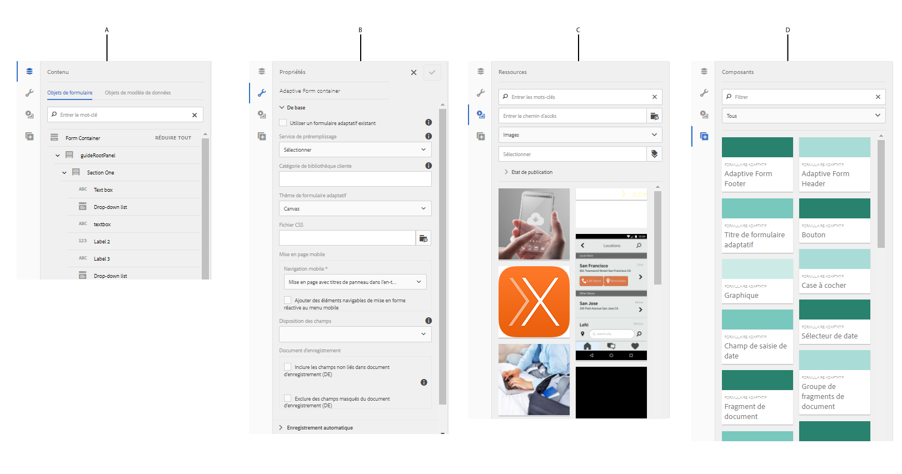
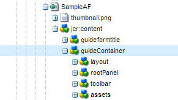

# Éditeur de formulaires adaptatifs {#introduction-to-authoring-adaptive-forms}

| Version | Lien de l’article |
| -------- | ---------------------------- |
| AEM 6.5 | [Cliquez ici](https://experienceleague.adobe.com/docs/experience-manager-65/forms/getting-started/introduction-forms-authoring.html) |
| AEM as a Cloud Service | Cet article |

## Présentation {#overview}

Les formulaires adaptatifs vous permettent de créer des formulaires attrayants, réactifs, dynamiques et adaptatifs. [!DNL AEM Forms] fournit une interface utilisateur intuitive et des composants prêts à l’emploi pour la création et l’utilisation de formulaires adaptatifs. Vous pouvez choisir de créer un formulaire adaptatif basé sur un modèle de formulaire ou un schéma ou sans modèle de formulaire. Il est important de choisir avec soin le modèle de formulaire qui convient non seulement à vos besoins, mais qui étend également vos investissements et vos ressources d’infrastructure existantes. Vous pouvez choisir parmi les options suivantes pour créer un formulaire adaptatif :

* **Utilisation d’un modèle de données de formulaire**
  L’[intégration de données](data-integration.md) vous permet d’intégrer des entités et des services provenant de sources de données disparates dans un modèle de données de formulaire que vous pouvez utiliser pour créer des formulaires adaptatifs. Choisissez le modèle de données de formulaire si le formulaire adaptatif que vous créez implique l’extraction et l’écriture de données depuis et vers plusieurs sources de données.

* **Utilisation d’un modèle de formulaire XDP**
Il s’agit d’un modèle de formulaire idéal si vous investissez dans des formulaires XFA ou XDP. Il fournit une méthode directe de conversion des formulaires de type XFA en formulaires adaptatifs. Toutes les règles XFA existantes sont conservées dans les formulaires adaptatifs associés. Les formulaires adaptatifs qui en résultent prennent en charge les éléments XFA, tels que les validations, les événements, les propriétés et les motifs.

* **Utilisation d’une définition de schéma XML (XSD) ou d’un schéma JSON**
Les schémas XML et JSON représentent la structure dans laquelle les données sont produites ou consommées par le système principal de votre entreprise. Vous pouvez associer le schéma à un formulaire adaptatif et utiliser ses éléments pour ajouter du contenu dynamique à un formulaire adaptatif. Les éléments du schéma peuvent être utilisés dans l’onglet Objets de modèle de données de l’explorateur de contenu lors de la création d’un Forms adaptatif.

* **Utilisation d’aucun ou sans modèle de formulaire**
Le Forms adaptatif créé avec cette option n’utilise aucun modèle de formulaire. Les données XML générées à partir de ce type de formulaire présentent une structure plate avec des champs et des valeurs correspondantes.

  >[!NOTE]
  >
  > Vous pouvez modifier les propriétés du modèle de formulaire à partir de l’éditeur de formulaires adaptatifs ou de l’éditeur de modèles de formulaires adaptatifs. Pour plus d’informations, consultez l’article [Modifier les propriétés du modèle de formulaire d’un formulaire adaptatif](/help/forms/creating-adaptive-form.md#edit-form-model-properties-of-an-adaptive-form-edit-form-model).

Pour créer un formulaire adaptatif, consultez l’article [créer un formulaire adaptatif](creating-adaptive-form.md).

## Interface utilisateur de création de formulaires adaptatifs {#adaptive-form-authoring-ui}

L’interface utilisateur optimisée pour les écrans tactiles permet de créer des formulaires adaptatifs de manière intuitive et offre les avantages suivants :

* Fonctionnalité glisser-déposer
* Composants standard de formulaire
* Référentiel intégré de ressources

Lorsque vous créez ou modifiez un formulaire adaptatif, vous utilisez les éléments suivants de l’interface utilisateur :

* [Barre latérale](#sidebar)
* [Barre d’outils de la page](#page-toolbar)
* [Barre d’outils de composants](#component-toolbar)
* [Page de formulaires adaptatifs](#af-page)

<!-- 

**A.** Sidebar **B.** Page toolbar **C.** Adaptive Form page -->

### Barre latérale {#sidebar}

La barre latérale vous permet de

* Rechercher, afficher et utiliser des ressources dans votre référentiel de gestion des ressources numériques (DAM) AEM.
* Voir le contenu du formulaire tel que les panneaux, les composants, les champs et la mise en page.
* Ajouter des composants dans le formulaire.
* Modifier les propriétés du composant.

**A.** Explorateur de contenu **B.** Explorateur de propriétés **C.** Explorateur de ressources **D.** Explorateur de composants

<!--Click to enlarge

](assets/sidebar-comps-1.png) -->

La barre latérale comprend les explorateurs suivants :

* **Explorateur de contenu**
Dans l’explorateur de contenu, vous pouvez voir :

   * **Objets de formulaire**
Affiche la hiérarchie des objets du formulaire. L’auteur peut accéder au composant spécifique du formulaire en appuyant sur cet élément dans l’arborescence de l’objet de formulaire. L’auteur peut alors rechercher des objets et les réorganiser depuis l’arborescence.

   * **Objets de modèle de données**
Permet de voir la hiérarchie des modèles de formulaire.
Vous pouvez faire glisser des éléments du modèle de formulaire sur le formulaire adaptatif. Les éléments ajoutés sont automatiquement convertis en composants de formulaire tout en conservant leurs propriétés d’origine. Vous pouvez voir des objets de modèle de données lorsque votre formulaire utilise un schéma XML, un schéma JSON ou un modèle XDP.

* **Explorateur de propriétés**

  Permet de modifier les propriétés d’un composant. Les propriétés affichées varient en fonction d’un composant. Pour voir les propriétés du conteneur de formulaires adaptatifs :

  Sélectionnez un composant, puis appuyez sur  > **[!UICONTROL Conteneur de formulaires adaptatif]**, puis sur .

* **Explorateur de ressources**

  Isole différents types de contenu, tels que des images, des documents, des pages, des séquences vidéo, etc.

* **Explorateur de composants**

  Comprend des composants que vous pouvez utiliser pour créer un formulaire adaptatif. Vous pouvez faire glisser des composants sur le formulaire adaptatif afin d’ajouter des éléments de formulaire, puis configurer les éléments ajoutés conformément aux exigences. Le tableau ci-dessous décrit les composants répertoriés dans l’explorateur de composants.

<table>
 <tbody>
  <tr>
   <th><strong>Composant</strong></th>
   <th><strong>Fonctionnalité</strong></th>
  </tr>
  <tr>
   <td>Bloc Adobe Sign</td>
   <td>Ajoute un bloc de texte contenant des espaces réservés pour le remplissage des champs lors de la signature à l’aide d’Adobe Sign.</td>
  </tr>
  <tr>
   <td>Bouton</td>
   <td>Ajoute un bouton que vous pouvez configurer pour exécuter des actions telles que Enregistrer, Réinitialiser, Passer au suivant, Passer au précédent, etc.</td>
  </tr>
  <tr>
   <td>Captcha</td>
   <td>Ajoutez une validation CAPTCHA en utilisant le service reCAPTCHA de Google.</td>
  </tr>
  <tr>
   <td>Graphique</td>
   <td>Ajoute un diagramme que vous pouvez utiliser dans des formulaires et des documents adaptatifs pour la représentation visuelle des données bidimensionnelles dans les panneaux et les lignes de tableau répétables.</td>
  </tr>
  <tr>
   <td>Case à cocher</td>
   <td>Ajoute une case à cocher.</td>
  </tr>
  <tr>
   <td>Champ de saisie de date</td>
   <td>Utilisez le composant Champ de saisie de date dans votre formulaire pour permettre aux clients de remplir séparément dans trois cases le jour, le mois et l’année. Vous pouvez personnaliser l’aspect du composant et modifier le format de date. Par exemple, vous pouvez laisser vos clients saisir des dates au format MM/JJ/AAAA ou JJ/MM/AAAA.</td>
  </tr>
  <tr>
   <td>Sélecteur de date</td>
   <td>Ajoute un champ de calendrier pour sélectionner une date.</td>
  </tr>
  <tr>
   <td>Fragment de document</td>
   <td>Permet d’ajouter des composants réutilisables d’une correspondance.</td>
  </tr>
  <tr>
   <td>Groupe de fragments de document</td>
   <td>Vous permet d’ajouter un groupe de fragments de document associés que vous pouvez utiliser dans un modèle de lettre en tant qu’unité unique.</td>
  </tr>
  <tr>
   <td>Liste déroulante</td>
   <td>Ajoute une liste déroulante, à sélection simple ou multiple.</td>
  </tr>
  <tr>
   <td>E-mail</td>
   <td>
Ajoute un champ pour capturer l’adresse électronique. Par défaut, le composant Email valide les adresses email à l’aide de l’expression régulière suivante.
 
<code>^[a-zA-Z0-9.!#$%&amp;'*+/=?^_`{|}~-]+@[a-zA-Z0-9-]+(?:.[a-zA-Z0-9-]+)*$</code>
 </td>
  </tr>
  <tr>
   <td>Pièce jointe</td>
   <td>
Ajoute un bouton qui permet aux utilisateurs et utilisatrices de rechercher et de joindre des documents annexes au formulaire.
 
<strong>Remarque :</strong> Le composant Pièce jointe prend en charge un ensemble prédéfini de formats de fichiers dans des formulaires adaptatifs activés pour Adobe Sign. Pour plus d’informations, voir <a href="https://helpx.adobe.com/fr/document-cloud/help/supported-file-formats-fill-sign.html#main-pars_text">Formats de fichiers pris en charge</a>.
 </td>
  </tr>
  <tr>
   <td>Liste des pièces jointes</td>
   <td>Ajoute un champ qui répertorie toutes les pièces jointes téléchargées à l’aide du composant Pièce jointe .</td>
  </tr>
  <tr>
   <td>Pied de page  </td>
   <td>Ajoute un en-tête qui contient habituellement le logo d’une société, le titre du formulaire et le résumé.  </td>
  </tr>
  <tr>
   <td>En-tête</td>
   <td>Ajoute le pied de page qui contient généralement des informations de copyright, ainsi que des liens vers d’autres pages. </td>
  </tr>
  <tr>
   <td>Image</td>
   <td>Vous permet d’insérer une image.</td>
  </tr>
  <tr>
   <td>Choix d’image</td>
   <td>Permet à vos clients de sélectionner une image pour fournir des informations. Vous pouvez utiliser ces informations pour fournir des services personnalisés à vos clients.</td>
  </tr>
  <tr>
   <td>Bouton Suivant</td>
   <td>Ajoute un bouton permettant d’accéder au panneau suivant d’un formulaire.</td>
  </tr>
  <tr>
   <td>Zone numérique</td>
   <td>Ajoute un champ destiné à la saisie de valeurs numériques.</td>
  </tr>
  <tr>
   <td>Procédure pas à pas numérique</td>
   <td>Utilisez la procédure pas à pas numérique pour permettre à vos clients d’indiquer une valeur numérique, qu’ils peuvent augmenter ou diminuer en fonction d’une étape prédéfinie.</td>
  </tr>
  <tr>
   <td>Panneau</td>
   <td>
Ajoute un panneau ou un sous-panneau.
 
Vous pouvez également ajouter un composant de panneau à partir de la barre d’outils du panneau parent à l’aide de la propriété Ajouter un panneau enfant</code> button. De même, vous pouvez ajouter une barre d’outils spécifique au panneau à l’aide de la fonction Barre d’outils Ajouter un panneau</code> button. Vous pouvez configurer la position de la barre d’outils du panneau à l’aide de la boîte de dialogue Modifier le panneau.
 </td>
  </tr>
  <tr>
   <td>Zone de mot de passe</td>
   <td>Ajoute un champ destiné à la saisie d’un mot de passe.</td>
  </tr>
  <tr>
   <td>Bouton Précédent</td>
   <td>Ajoute un bouton permettant de revenir à la page ou au panneau précédents.</td>
  </tr>
  <tr>
   <td>Bouton Radio</td>
   <td>Ajoute des boutons radio.</td>
  </tr>
  <tr>
   <td>Bouton de réinitialisation</td>
   <td>Ajoute un bouton pour réinitialiser les champs de formulaire.</td>
  </tr>
  <tr>
   <td>Bouton Enregistrer</td>
   <td>Ajoute un bouton permettant d’enregistrer les données de formulaire.</td>
  </tr>
  <tr>
   <td>Signature tactile</td>
   <td>Ajoute un champ destiné à la saisie de signatures tactiles.</td>
  </tr>
  <tr>
   <td>Séparateur</td>
   <td>Active la ségrégation visuelle des panneaux dans le formulaire.</td>
  </tr>
  <tr>
   <td>Étape de signature</td>
   <td>Affiche les informations fournies dans le formulaire et les champs de signature permettant à l’utilisateur de vérifier et de signer le formulaire.</td>
  </tr>
  <tr>
   <td>Texte</td>
   <td>Permet de spécifier du texte statique.</td>
  </tr>
  <tr>
   <td>Bouton Envoyer</td>
   <td>Ajoute un bouton d’envoi permettant d’envoyer le formulaire à l’action d’envoi configurée.</td>
  </tr>
  <tr>
   <td>Étape de résumé</td>
   <td>Soumet le formulaire et affiche le texte récapitulatif spécifié par les auteurs après la soumission du formulaire. </td>
  </tr>
  <tr>
   <td>Basculer</td>
   <td>Ajoute un commutateur qui exécute une action de basculement ou d’activation/désactivation. Vous ne pouvez pas ajouter plus de deux options dans le composant Basculer. Un bouton ne peut avoir que deux valeurs : Activé ou Désactivé, obligatoire ne s’applique pas. Au moins une valeur est enregistrée, quelle que soit la saisie utilisateur.   </td>
  </tr>
  <tr>
   <td>Tableau</td>
   <td>Ajoute un tableau qui permet de classer les données par lignes et par colonnes. </td>
  </tr>
  <tr>
   <td>Téléphone</td>
   <td>
Ajoute un champ pour capturer le numéro de téléphone. Le composant Téléphone permet aux auteurs de configurer l’un des types de numéros de téléphone suivants. Chaque type est associé à une expression régulière par défaut pour la validation.

    <ul>
     <li>Le type International est validé par <code>^[+][0-9]{0,14}$</code>.</li>
     <li>Le type USPhoneNumber est validé par <code>{'+1 ('999') '999-9999}</code>.</li>
     <li>Le type UKPhoneNumber est validé par <code>text{'+'99 999 999 9999}</code>.</li>
     <li>Type Personnalisé ne fournit pas de modèle de validation par défaut. Il prend la valeur du dernier type de numéro de téléphone sélectionné. Vous pouvez également spécifier votre propre modèle de validation personnalisé.</li>
    </ul> </td>
  </tr>
  <tr>
   <td>Termes et conditions  </td>
   <td>Ajoute un champ que les auteurs peuvent utiliser pour spécifier les conditions générales que les utilisateurs doivent consulter avant de remplir le formulaire.</td>
  </tr>
  <tr>
   <td>Zone de texte </td>
   <td>
Ajoute une zone de texte dans laquelle un utilisateur peut spécifier les informations requises. 
 
Par défaut, le composant Zone de texte accepte uniquement du texte brut. Vous pouvez activer un composant de zone de texte afin de permettre la prise en charge du texte brut. Un composant de texte enrichi fournit des options permettant d’ajouter des en-têtes, de modifier les styles de caractères (gras, italique, soulignement des caractères), de créer des listes ordonnées et non ordonnées, de modifier l’arrière-plan du texte et la couleur du texte, ainsi que d’ajouter des liens hypertexte. Pour activer le texte enrichi pour une zone de texte, activez l’option <strong>Autoriser le texte enrichi</strong> dans les propriétés du composant.
 </td>
  </tr>
  <tr>
   <td>Titre</td>
   <td>Spécifie un titre pour le formulaire adaptatif.</td>
  </tr>
  <tr>
   <td>Étape de vérification</td>
   <td>
Ajoute un espace réservé pour afficher le formulaire rempli à des fins de vérification par l’utilisateur.
 
<strong>Remarque</strong> : le formulaire adaptatif contenant le composant Vérifier ne prend pas en charge les utilisateurs anonymes. En outre, il n’est pas recommandé d’utiliser le composant Vérifier dans un fragment de formulaire adaptatif.
 </td>
  </tr>
 </tbody>
</table>

### Barre d’outils de la page {#page-toolbar}

La barre d’outils de la page supérieure propose des options permettant de prévisualiser le formulaire, de modifier ses propriétés et de modifier sa mise en page. Vous pouvez prévisualiser le formulaire lors de sa création et apporter des modifications en conséquence. Dans la barre d’outils de la page, vous voyez :

* **Activer/désactiver le panneau latéral**  : affiche ou masque la barre latérale.

* **Informations sur la page**  : affiche les propriétés de la page, permet de publier/d’annuler la publication d’un formulaire, de lancer un processus de formulaire et d’ouvrir le formulaire dans une IU classique.

* **Émulateur**  : simule l’aspect de votre formulaire pour différentes tailles d’affichage, selon les tablettes et les téléphones, par exemple.

* **Modifier** : permet de sélectionner d’autres modes comme : **[!UICONTROL Modifier]**, **[!UICONTROL Style]**, **[!UICONTROL Développeur]** et **[!UICONTROL Conception]**.

   * **Modifier** : permet de modifier les propriétés du formulaire et de ses composants. Exemple : l’ajout d’un composant, le dépôt d’une image et l’indication des champs obligatoires.
   * **Style** : définit l’aspect des composants de votre formulaire. Par exemple, en mode Style, vous pouvez sélectionner un panneau et définir sa couleur d’arrière-plan.

   * **Développeur** : permet à un développeur de :

      * Découvrez les formulaires composés.
      * Déboguer en temps réel afin de mieux résoudre les problèmes.

      * **Conception**. Permet d’activer ou de désactiver les composants personnalisés ou les composants prêts à l’emploi qui ne sont pas répertoriés dans la barre latérale.

* **Aperçu** : permet de prévisualiser le formulaire avant de le publier.

### Barre d’outils de composants {#component-toolbar}

Lorsque vous sélectionnez un composant, une barre d’outils s’affiche, vous permettant de l’utiliser. Vous avez la possibilité de couper, coller, déplacer et spécifier les propriétés des composants. Vous avez le choix entre :

A. **Configurer** : lorsque vous appuyez sur **[!UICONTROL Configurer]**, les propriétés du composant sont visibles dans la barre latérale. La configuration de ces propriétés vous permet de personnaliser l’expérience de capture de données. Vous pouvez modifier le nom de l’élément du composant, spécifier le texte du libellé dans le champ Titre du composant. Le nom de l’élément vous permet de capturer les valeurs saisies par les utilisateurs à l’aide du composant. Dans les propriétés du composant, vous spécifiez le comportement du composant et gérez les entrées utilisateur. Configurez les propriétés dans la barre latérale pour capturer les données utilisateur et les utiliser pour un traitement ultérieur. Les propriétés du conteneur de formulaires adaptatifs permettent de spécifier des bibliothèques clients, des mises en page, des thèmes, des documents d’enregistrement, des paramètres d’enregistrement, des paramètres d’envoi et des paramètres de métadonnées.

B. **Copier** : permet de copier un composant et le coller ailleurs dans le formulaire. Lorsque vous collez un composant, ce dernier obtient un nouveau nom d’élément mais conserve les propriétés du composant copié.

C. **Couper** : permet de déplacer un composant d’un endroit à un autre dans le formulaire adaptatif.

D. **Supprimer** : permet de supprimer le composant du formulaire.

E. **Insérer** : permet d’insérer un composant au-dessus du composant sélectionné.

F. **Coller** : permet de coller du composant coupé ou copié à l’aide des options décrites ci-dessus.

G. **Éditeur de règles** : permet d’ouvrir l’éditeur de règles. Pour plus d’informations, <!-- see [Rule Editor](rule-editor.md). -->

H. **Groupe** : permet de sélectionner plusieurs composants permettant de couper, copier ou coller plusieurs composants ensemble.

I. **Parent** : permet de sélectionner le parent d’un composant. Par exemple, un champ de texte se trouve dans une sous-section, qui réside dans une section. La section réside dans le panneau racine de guide, et le conteneur du formulaire adaptatif est le parent d’un panneau racine de guide. Pour chaque composant s’affichent toutes les options avec la hiérarchie triée de bas en haut.

Par exemple, si vous tapez **[!UICONTROL Parent]** pour une zone de texte, vous pouvez voir les éléments suivants :

* Sous-section
* Section
* guideRootPanel
* Conteneur de formulaires adaptatifs

J. **Autres**: Fournit d’autres options pour utiliser le composant sélectionné.

* Afficher l’expression SOM
* Enregistrement d’un panneau en tant que fragment (pour les panneaux uniquement)
* Ajouter un panneau enfant (pour les panneaux uniquement)
* Barre d’outils Ajouter un panneau (pour les panneaux uniquement)
* Remplacer (pas pour les panneaux)

### Page de formulaires adaptatifs {#af-page}

La page de formulaires adaptatifs est le formulaire proprement dit. Elle est identique à toute autre page de gestion de contenu Web modélisée en tant que composant de gestion de contenu Web `cq:Page`. L’illustration suivante présente la structure de contenu d’un formulaire adaptatif standard.

La structure de contenu contient généralement les composants principaux ci-dessous :

* **guideContainer** : racine d’un formulaire adaptatif, indiquée sous la forme **[!UICONTROL Début du formulaire adaptatif]** dans l’interface utilisateur du formulaire. Dans ce composant, vous pouvez spécifier les éléments suivants :

   * *Mise en page du formulaire adaptatif pour mobiles* : définit l’apparence du formulaire sur les appareils mobiles.
   * *Page de remerciement*: Définit la page vers laquelle l’utilisateur est redirigé après l’envoi du formulaire.
   * *Action Envoyer*: Définit le mode de traitement du formulaire sur le serveur une fois que l’utilisateur l’a envoyé.
   * *Style*: Spécifie le chemin d’accès au fichier CSS utilisé pour personnaliser l’aspect du formulaire.

* **rootPanel** : panneau racine d’un formulaire adaptatif. Il peut contenir des sous-panneaux sous le noeud éléments . Une disposition peut être associée à chaque panneau, y compris le panneau racine. La disposition du panneau détermine la disposition du formulaire. Par exemple, dans la mise en page en accordéon, les éléments constitutifs sont disposés sous la forme d’étapes en accordéon.

* **toolbar:** : une barre d’outils globale est associée à un conteneur de formulaires adaptatifs. Il s’agit d’une barre d’outils à l’échelle du formulaire. Cette barre d’outils peut être ajoutée à l’aide de l’action **[!UICONTROL Ajouter une barre d’outils]** de la barre d’édition, ce qui permet aux auteurs d’ajouter des actions telles que Envoyer, Enregistrer, réinitialiser, etc.

* **ressources** : ce nœud contient des informations supplémentaires au sujet de la création de formulaires. Il s’agit, par exemple, de détails sur le modèle de formulaire, de détails de localisation, etc.
