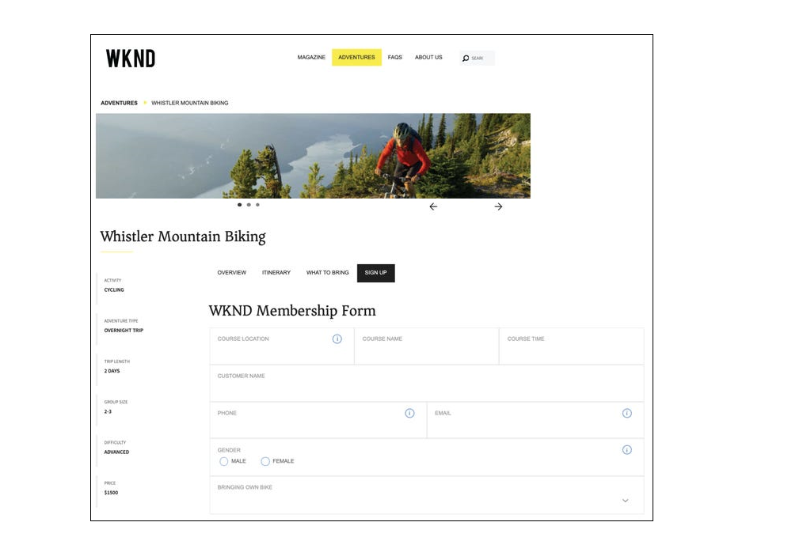

<!-- # Introduction to [!DNL AEM Forms] as a Cloud Service {#overview}

Adobe Experience Manager Forms as a Cloud Service offers a cloud-native, Platform as a Service (PaaS) solution for businesses to create, manage, publish, and update complex digital forms while integrating submitted data with back-end processes, business rules, and saving data in an external data store. The service is always current, always available, and always learning.

You can use the service to create and rollout  interactive and engaging digital forms. For example, an organization is looking to digitize their customer enrollment journey. They have multiple data sources with existing customer data, they are looking to pre-populate forms, add e-sign their forms, and archive filled forms as PDF files. Besides, the organization has multiple print forms (PDF forms), they are also looking to convert all of their print forms to digital forms.

The organization can use [!DNL AEM Forms] as a Cloud Service to create digital forms, connect forms to existing data sources, integrate forms with [!DNL Adobe Sign] to add e-signatures to forms, and generate Document of Record (DoR) to archive filled forms as PDF files. The organization can also use the service to convert their existing PDF forms to digital forms. 

An organization can sign up for [!DNL AEM Forms] as a Cloud Service and start using all these features without waiting to buy and set up a local infrastructure. The service also frees the organizations from the cycle of upgrades as it is always up to date and always offers the latest feature.  -->

# Dernières innovations {#latest-innovations}

Voici quelques-unes des dernières innovations d’AEM Forms as a Cloud Service :

|  |  |
|---|---|
| Forms adaptatif sans affichage | Création et gestion [Forms adaptatif sans affichage](https://experienceleague.corp.adobe.com/docs/experience-manager-headless-adaptive-forms/using/overview.html) dans la plateforme Adobe Experience Manager. Permet aux développeurs de créer, publier et gérer des formulaires interactifs accessibles et interactifs via des API, plutôt que par le biais d’une interface utilisateur graphique classique.     Ces formulaires sont conçus pour être envoyés sans avoir besoin d’une interface de HTML traditionnelle. En d’autres termes, ils vous permettent d’envoyer des données de formulaire par programmation via une API ou un code d’arrière-plan sans nécessiter d’éléments de formulaire visibles sur le front-end.     Les formulaires sans affichage sont utiles dans divers scénarios, comme lors de la création d’applications d’une seule page, d’applications web progressives ou d’applications mobiles, où une interface de HTML classique peut ne pas être nécessaire ou pratique. En permettant aux développeurs d’envoyer des données de formulaire directement via des API ou du code d’arrière-plan, les formulaires sans tête permettent de rationaliser les workflows et d’améliorer les performances globales des applications web. |
| Composants principaux | Le [Composants principaux de Forms adaptatif](https://experienceleague.adobe.com/docs/experience-manager-core-components/using/adaptive-forms/introduction.html#features) sont un ensemble de 24 composants Open Source compatibles avec BEM qui sont construits sur la base des composants principaux de la gestion de contenu web Adobe Experience Manager. Elles sont spécialement conçues pour être utilisées pour créer des Forms adaptatives, qui sont des formulaires qui s’adaptent au périphérique, au navigateur et à la taille d’écran de l’utilisateur.     Ces composants peuvent être utilisés pour créer des expériences de capture et d’inscription de données exceptionnelles en proposant un large éventail d’options de champ de formulaire, notamment des champs de texte, des cases à cocher, des menus déroulants, etc. Ils comprennent également des fonctionnalités telles que la validation, la logique conditionnelle et la conception réactive, qui peuvent être utilisées pour créer des formulaires conviviaux et faciles à utiliser.      En outre, comme ces composants sont Open Source, les développeurs peuvent facilement personnaliser et étendre les composants pour répondre aux besoins spécifiques de leur entreprise. Et ces composants sont construits sur une méthodologie BEM qui garantit qu&#39;ils sont extensibles et maintenables. |
| Connecteur Microsoft PowerAutomate | AEM Forms Power Automate Connector vous permet d’intégrer Adobe Experience Manager (AEM) Forms à Microsoft Power Automate (précédemment appelé flux Microsoft). Power Automate est un service basé sur le cloud qui vous permet de créer des processus automatisés entre différentes applications et services.      Avec AEM Form Power Automate Connector, vous pouvez créer des processus qui se déclenchent automatiquement en fonction de l’envoi d’un formulaire adaptatif. Par exemple, vous pouvez créer un workflow qui envoie automatiquement une notification électronique à une personne spécifique lorsqu’un utilisateur envoie un formulaire ou crée une tâche dans le planificateur Microsoft lorsqu’un utilisateur remplit un formulaire.       AEM Forms Power Automate Connector est un puissant outil qui vous permet d’automatiser et d’intégrer votre Forms adaptatif à d’autres applications et services qui se connectent à Microsoft Power Automate, ce qui vous permet de travailler avec un large éventail d’outils. Vous pouvez créer des workflows adaptés à vos besoins spécifiques, avec la possibilité d’ajouter des actions, des conditions et des déclencheurs personnalisés. En outre, Power Automate fournit des analyses et des rapports détaillés, ce qui vous permet de surveiller et d’optimiser vos workflows au fil du temps. |
| Connecteurs de stockage Microsoft | Connecteurs de stockage AEM Forms Microsoft pour <a href="https://experienceleague.corp.adobe.com/docs/experience-manager-cloud-service/content/forms/adaptive-forms-authoring/authoring-adaptive-forms-foundation-components/configure-submit-actions-and-metadata-submission/configuring-submit-actions.html#submit-to-sharedrive">OneDrive</a>, <a href="https://experienceleague.corp.adobe.com/docs/experience-manager-cloud-service/content/forms/adaptive-forms-authoring/authoring-adaptive-forms-foundation-components/configure-submit-actions-and-metadata-submission/configuring-submit-actions.html?#submit-to-sharedrive"> SharePoint, </a> et <a href="https://experienceleague.corp.adobe.com/docs/experience-manager-cloud-service/content/forms/adaptive-forms-authoring/authoring-adaptive-forms-foundation-components/configure-submit-actions-and-metadata-submission/configuring-submit-actions.html?#submit-to-azure-blob-storage"> Stockage Azure Blob </a> sont des connecteurs qui vous permettent d’intégrer Adobe Experience Manager (AEM) Forms à Microsoft OneDrive et SharePoint. Avec ce connecteur, vous pouvez télécharger des fichiers de données et des pièces jointes vers OneDrive et SharePoint directement à partir d’Adaptive Forms.     OneDrive et SharePoint peuvent s’intégrer à d’autres applications métier, telles que les systèmes CRM, les logiciels de comptabilité et les outils de gestion de projet. Cela vous permet de rationaliser vos processus d’entreprise, de réduire la saisie manuelle des données et d’améliorer l’efficacité globale. |

<!-- 

# Key features and capabilities {#key-features}

[!DNL AEM Forms] as a Cloud Service provides several cloud-native capabilities such as a cloud-native architecture, auto-scaling, zero downtime for upgrades, a CDN (Content Delivery Network), cloud-native development environment, and ability to self-Service the environments via Cloud Manager. You can use the service to: 

* [Create Adaptive Forms](creating-adaptive-form.md#strong-create-an-adaptive-form-strong) that automatically render for a user's device and browser.

    

* [Create pixel-perfect PDF forms](use-forms-designer.md#create-an-adaptive-form) that look almost like paper.

* Use [Automated Forms Conversion service](https://experienceleague.adobe.com/docs/aem-forms-automated-conversion-service/using/introduction.html) to convert a PDF Form to an Adaptive Form. It helps you accelerate digitization and modernization of data capture experiences of your organization.

    

* [Create business processes](aem-forms-workflow-step-reference.md#create-form-centric-workflows). For example, You can create and trigger an approval and rejection workflow on submission of an Adaptive Form.

In addition to above [!DNL AEM Forms] as a Cloud Service offers the following features and capabilities:

* An easy-to-use graphical user interface to let business users easily import, manage, preview, and publish forms
* A responsive forms directory with powerful search features using keywords, tags, and metadata
* Dynamic detection of a user's device and location to render the form appropriately across web and mobile channels
* [Integration with Adobe Sign](adobe-sign-integration-adaptive-forms.md) services or Scribble to electronically sign documents containing confidential information
* Ability to [connect the service to various types of data sources](data-integration.md#create-an-adaptive-form) to send and retrieve data. The service supports sending and retrieving data from RESTful web services, SOAP-based web services, and OData enabled services.
* Integration with AEM Sites. It allows to embed an adaptive form in an AEM Sites page. You can also integrate an adaptive form to any webpage. 
* Ability to create a Document of Record (DoR) to keep a record of the information that you provide and submit in an Adaptive Form so that you can refer to it later. A DoR is a PDF version of a form. It includes both a template and data. The service provides a default DoR template and tools to develop a custom template.
* Ability to create Adaptive Forms to produce schema-compliant data. It helps you submit captured data to existing processes and data sources without any or minimal modifications.
* Ability to create a prefill service to fill a form with existing customer data based on a criteria. It helps fasten the form filling process and reduce the abandon rate.

<!-- 

## Enterprise-class forms {#enterprise-class-forms}

You can create enterprise class forms (Adaptive Forms) and deliver beautiful, interactive, responsive, and personalized experiences to your customers. These forms change behavior and appearance based on the underlying device. You can also use themes and templates with Adaptive Forms to mandate a uniform structure and appearance for all the forms of an organization or a department.

## Automatic conversion of PDF forms to Adaptive Forms {#automatic-conversion-of-pdf-forms-to-adaptive-forms}

You can use Automated Forms Conversion service to convert a PDF Form to an Adaptive Form. It helps you accelerate digitization and modernization of data capture experiences of your organization.

## Data Integration {#data-integration}

You can connect the service to various types of data sources to send and retrieve data. The service supports sending and retrieving data from RESTful web services, SOAP-based web services, and OData enabled services.

## Integration with [!DNL Adobe Sign] {#integration-with-adobe-sign}

 You can integrate the service with [!DNL Adobe Sign] and add [!DNL Adobe Sign] fields to an Adaptive Form. It allows your users to e-sign an Adaptive Form and use [!DNL Adobe Sign] with AEM Workflows. You can use AEM Workflows to develop a business logic and send forms and documents to recipients for signatures based on the business logic.

## Integration with [!DNL AEM Sites] {#integration-with-aem-sites}

You can embed an adaptive form in an AEM Sites or an external webpage. The service provides a component out of the box to integrate an adaptive forms to an AEM Sites page.

## Business Processes Automation {#bpa}

You can use AEM Workflows to create business processes and automate operations. For example, You can create and trigger an approval and rejection workflow on submission of an Adaptive Form. 

## Document of Record {#dor}

You can create a Document of Record (DoR) to keep a record of the information that you provide and submit in an Adaptive Form so that you can refer to it later. A DoR is a PDF version of a form. It includes both a template and data. The service provides a default DoR template and tools to develop a custom template.

## Rule editor {#rule-editor}

Rule editor empowers you to build dynamism and interactivity to Adaptive Forms. These rules define actions to trigger on form objects based on preset conditions, user inputs, and user actions on the form. It helps  streamline the form filling experience while ensuring accuracy and speed.
  

## WYSIWYG editors {#wysiwyg-editor} 

The service provides several WYSIWYG editors: Adaptive Forms editor, Theme editor, and Template editor. These help you create and edit forms and related assets in WYSIWYG manner. The editors also provide out-of-the-box options to simulate views for popular mobile devices, tablets, and desktop screen configurations.

## Schema-compliant data {#schema-complaint-data}

You can create Adaptive Forms to produce schema-compliant data. It helps you submit captured data to existing processes and data sources without any or minimal modifications.

## Prefill a form

You can create a prefill service to fill a form with existing customer data based on a criteria. It helps fasten the form filling process and reduce the abandon rate.

## Submit Actions

A Submit Action allows you to persist and process captured data. The service provides several Submit Actions out-of-the-box. You can use these Submit Actions to send submitted data to a REST endpoint, database, or an AEM Workflow. You can also email submitted data along with attachments and Document of Record(DoR). You can also develop a custom Submit Action to perform an action specific to your business.

* **Emulators:** You can view an Adaptive Form in an in-built emulator. It helps you simulate how an Adaptive Form appears on different devices to an end user. It provides out-of-the-box options to simulate views for popular mobile devices, tablets, and desktop screen configurations. 

In addition to standard [!DNL AEM Forms] features, [!DNL AEM Forms] as a Cloud Service provides several cloud-native capabilities such as a cloud-native architecture, auto-scaling, zero downtime for upgrades, a CDN (Content Delivery Network), cloud-native development environment, and ability to self-Service the environments via Cloud Manager. -->
