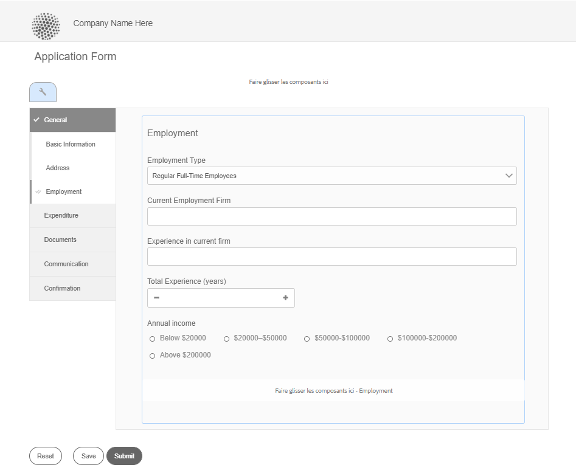

# Fonctions de mise en page des formulaires adaptatifs {#layout-capabilities-of-adaptive-forms}

<span class="preview"> Adobe recommande d’utiliser les [composants principaux](https://experienceleague.adobe.com/docs/experience-manager-core-components/using/adaptive-forms/introduction.html?lang=fr) de capture de données modernes et extensibles pour [créer de nouveaux formulaires adaptatifs](/help/forms/creating-adaptive-form-core-components.md) ou [ajouter des formulaires adaptatifs à des pages AEM Sites](/help/forms/create-or-add-an-adaptive-form-to-aem-sites-page.md). Ces composants représentent une avancée significative dans la création de formulaires adaptatifs, ce qui garantit des expériences utilisateur impressionnantes. Cet article décrit l’ancienne approche de la création de formulaires adaptatifs à l’aide de composants de base. </span>


| Version | Lien de l’article |
| -------- | ---------------------------- |
| AEM 6.5 | [Cliquez ici](https://experienceleague.adobe.com/docs/experience-manager-65/forms/adaptive-forms-basic-authoring/layout-capabilities-adaptive-forms.html) |
| AEM as a Cloud Service (composants principaux) | [Cliquez ici](/help/forms/layout-capabilities-adaptive-forms-core-components.md) |
| AEM as a Cloud Service (composants de base) | Cet article |

[!DNL Adobe Experience Manager] permet de créer des formulaires adaptatifs simples d’emploi, qui offrent des expériences dynamiques aux utilisateurs finaux. La disposition des formulaires détermine l’affichage des éléments et des composants dans un formulaire adaptatif.

<!-- ## Prerequisite knowledge {#prerequisite-knowledge}

Before learning about the different layout capabilities of Adaptive Forms, read [Introduction to authoring forms](introduction-forms-authoring.md) to know more about Adaptive Forms. -->

## Types de mise en page {#types-of-layouts}

Un formulaire adaptatif propose les types de disposition suivants :

**[!UICONTROL Disposition de panneau]** : contrôle l’affichage des éléments ou des composants d’un panneau sur un appareil.

**[!UICONTROL Disposition mobile]** : contrôle la navigation d’un formulaire sur un appareil mobile. Si la largeur de l’écran d’un appareil est supérieure ou égale à 768 pixels, la disposition est considérée comme étant adaptée à un appareil mobile et optimisée en conséquence.

**[!UICONTROL Disposition de barre d’outils]** : contrôle le positionnement des boutons d’action dans la barre d’outils ou la barre d’outils du panneau d’un formulaire.

Toutes ces dispositions de panneau sont définies à l’emplacement `/libs/fd/af/layouts` suivant :

Pour modifier la disposition d’un formulaire adaptatif, utilisez le mode Création dans [!DNL Experience Manager].

## [!UICONTROL Mise en page du panneau] {#panel-layout}

L’auteur d’un formulaire peut associer une disposition à chaque panneau d’un formulaire adaptatif, y compris le panneau racine.

Les dispositions de panneau sont disponibles à l’emplacement `/libs/fd/af/layouts/panel`suivant. Sélectionnez le panneau et sélectionnez  pour afficher les propriétés du panneau.


### [!UICONTROL Réactif – Tout sur une page sans navigation] {#responsive-everything-on-one-page-without-navigation-br}

Utilisez cette disposition de panneau pour créer une disposition réactive, qui s’adapte à la taille d’écran de votre appareil sans avoir à recourir à une navigation spécialisée.

Cette disposition permet de placer plusieurs composants **[!UICONTROL Panneau de formulaire adaptatif]** l’un après l’autre dans le panneau.


### [!UICONTROL Assistant] {#wizard}

Utilisez cette disposition de panneau pour proposer une navigation guidée dans un formulaire. Vous pouvez, par exemple, l’utiliser pour capturer des informations obligatoires dans un formulaire, tout en guidant les utilisateurs pas à pas.

Utilisez le composant **[!UICONTROL Panneau de formulaire adaptatif]** pour proposer une navigation pas à pas dans un panneau. Lorsque vous utilisez cette disposition, l’utilisateur ne passe à l’étape suivante qu’après avoir terminé l’étape en cours.

```javascript
window.guideBridge.validate([], this.panel.navigationContext.currentItem.somExpression)
```


### [!UICONTROL Accordéon] {#layout-for-accordion-design}

Cette disposition permet de placer le composant **[!UICONTROL Panneau de formulaire adaptatif]** dans un panneau avec un style de navigation en accordéon. Cette disposition permet également de créer des panneaux reproductibles. Ces panneaux permettent d’ajouter ou de supprimer des panneaux de manière dynamique en fonction de vos besoins. Vous pouvez définir le nombre minimal et maximal de répétitions d’un panneau. Le titre du panneau peut également être déterminé de manière dynamique en fonction des informations fournies dans les éléments du panneau.

L’expression récapitulative peut être utilisée pour afficher les valeurs fournies par l’utilisateur dans le titre du panneau réduit.


### [!UICONTROL  Disposition avec onglets : les onglets s’affichent sur la gauche]{#tabbed-layout-tabs-appear-on-the-left}

Cette disposition permet de placer le composant **[!UICONTROL Panneau de formulaire adaptatif]** dans un panneau avec une navigation par onglets. Les onglets sont placés à gauche du contenu du panneau.



Onglets affichés à gauche d’un panneau

### [!UICONTROL Mises en page avec onglets – Les onglets s’affichent en haut] {#tabbed-layout-tabs-appear-on-the-top}

Cette disposition permet de placer le composant **[!UICONTROL Panneau de formulaire adaptatif]** dans un panneau avec une navigation à onglets. Les onglets sont placés au-dessus du contenu du panneau.


## Mises en page pour appareils mobiles {#mobile-layouts}

Les dispositions mobiles permettent une navigation conviviale sur les appareils mobiles dotés d’écrans relativement plus petits. Les dispositions mobiles utilisent des styles à onglets ou avec assistant pour la navigation dans les formulaires. L’application d’une disposition mobile fournit une disposition unique pour l’ensemble du formulaire.

Cette disposition contrôle la navigation à l’aide d’une barre de navigation et d’un menu de navigation. La barre de navigation affiche des icônes **&lt;** et **>** pour indiquer les étapes de navigation **[!UICONTROL suivante]** et **[!UICONTROL précédente]** dans le formulaire.

Les dispositions pour appareils mobiles sont disponibles à l’emplacement `/libs/fd/af/layouts/mobile/`. Les dispositions pour appareils mobiles ci-dessous sont disponibles par défaut dans les formulaires adaptatifs.


Sélectionnez l’option **[!UICONTROL Ajouter des éléments du menu Disposition réactive pour les appareils mobiles]** pour afficher les options de navigation disponibles pour un panneau dans la disposition pour appareils mobiles. Les options de navigation ne sont visibles que si vous sélectionnez la disposition **[!UICONTROL Réactive]** pour un panneau.

Lorsque vous utilisez une disposition pour appareils mobiles, le menu de formulaire qui permet d’accéder aux différents panneaux de formulaire est disponible en appuyant sur l’icône .

### [!UICONTROL Mise en page avec titres de panneau dans l’en-tête de formulaire] {#layout-with-panel-titles-in-the-form-header}

Cette disposition, comme son nom l’indique, affiche les titres des panneaux ainsi que le menu de navigation et la barre de navigation. Cette disposition fournit également des icônes Suivant et Précédent pour la navigation.


### [!UICONTROL  Disposition sans titres de panneau dans l’en-tête de formulaire]{#layout-without-panel-titles-in-the-form-header}

Cette disposition, comme son nom l’indique, affiche uniquement le menu de navigation et la barre de navigation sans les titres des panneaux. Cette disposition fournit également des icônes Suivant et Précédent pour la navigation.


## Voir également {#see-also}

{{see-also}}


<!-- ## Toolbar layouts {#toolbar-layouts}

A Toolbar Layout controls positioning and display of any action buttons that you add to your Adaptive Forms. The layout can be added at a form level or at a panel level.


A list of Toolbar Layouts in Adaptive Forms

Toolbar layouts are available at `/libs/fd/af/layouts/toolbar` location. Adaptive Forms provide the following Toolbar Layouts, by default.

### [!UICONTROL Default layout for toolbar] {#default-layout-for-toolbar}

This layout is selected as the default layout when you add any action buttons in an Adaptive Form. Selecting this layout displays the same layout for both, desktop and mobile devices.

Also, you can add multiple toolbars containing action buttons configured with this layout. An action button is associated with a form control. You can configure the toolbars to be before or after a panel.


Default view for toolbar

### [!UICONTROL Mobile fixed layout for toolbar] {#mobile-fixed-layout-for-toolbar}

Select this layout to provide alternate layouts for desktop and mobile devices.

For the desktop layout, you can add Action buttons using some specific labels. Only one toolbar can be configured with this layout. If more than one toolbar is configured with this layout, there is an overlap for mobile devices and only one toolbar is visible. For example, you can have a toolbar at the bottom or the top of the form, or, after or before panels in the form.

For the Mobile layout, you can add action buttons using icons.


Mobile fixed layout for toolbar-->


