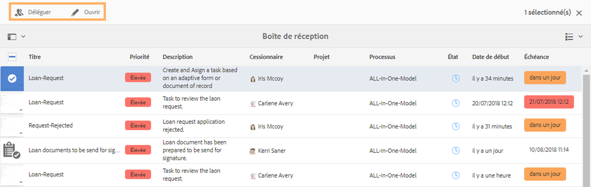
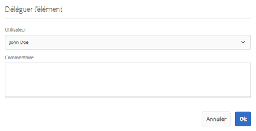
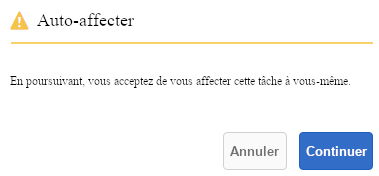
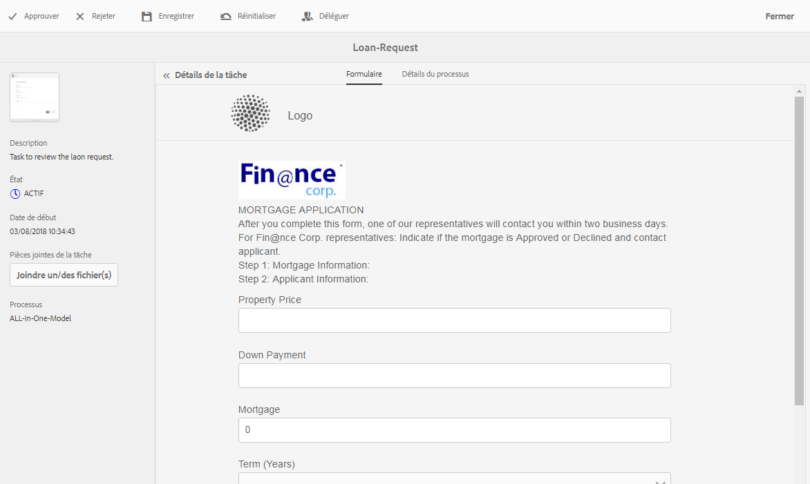
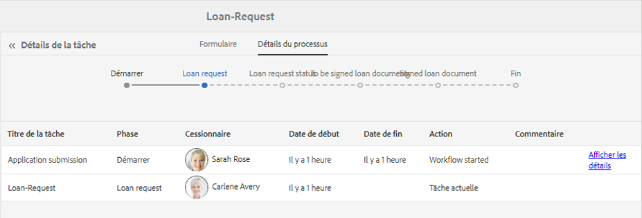
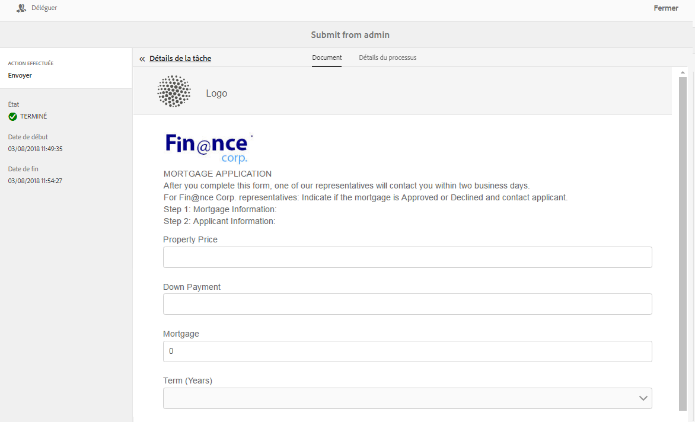
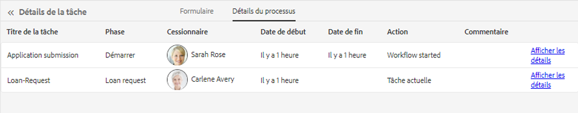

# Gestion des applications et des tâches Forms dans la boîte de réception AEM {#manage-forms-applications-and-tasks-in-aem-inbox}

L’une des nombreuses façons de lancer ou de déclencher un processus orienté formulaire consiste à utiliser des applications dans la boîte de réception AEM. Vous devez créer une application de processus pour rendre un processus Forms disponible en tant qu’application dans la boîte de réception. Pour plus d’informations sur l’application de processus et d’autres façons de lancer les processus de Forms, voir [Lancement d’un processus orienté formulaire sur OSGi](aem-forms-workflow.md#launch).

En outre, AEM boîte de réception regroupe les notifications et les tâches provenant de divers composants d’AEM, y compris les workflows Forms. Lorsqu’un processus Forms contenant une étape Affecter une tâche est déclenché, l’application associée est répertoriée comme une tâche dans la boîte de réception de la personne désignée. Si la personne désignée est un groupe, la tâche apparaît dans la boîte de réception de tous les membres du groupe jusqu’à ce qu’un individu demande ou délègue la tâche.

L’interface utilisateur de la boîte de réception fournit la liste et les vues de calendrier pour afficher les tâches. Vous pouvez également configurer les paramètres d’affichage. Vous pouvez filtrer les tâches en fonction de divers paramètres. Pour plus d’informations sur la vue et les filtres, voir [Votre boîte de réception](https://experienceleague.adobe.com/docs/experience-manager-cloud-service/sites/authoring/getting-started/inbox.html?lang=fr#inbox-in-the-header).

En résumé, la boîte de réception vous permet de créer une nouvelle application et de gérer les tâches affectées.

>[!NOTE]
>
>Vous devez être membre du groupe [!DNL workflow-users] pour pouvoir utiliser la boîte de réception AEM.

## Création d’une application {#create-application}

1. Accédez à la boîte de réception AEM à l’adresse https://’[serveur]:[port/]’/aem/inbox.
1. Dans l’interface utilisateur de la boîte de réception, appuyez sur **[!UICONTROL Créer > Application]**. La page Sélectionner l’application s’affiche.
1. Sélectionnez une application, puis appuyez sur **[!UICONTROL Créer]**. Le formulaire adaptatif associé à l’application s’ouvre. Renseignez les informations dans le formulaire adaptatif et appuyez sur **[!UICONTROL Soumettre]**. Cette action lance le processus associé et crée une tâche dans la boîte de réception de la personne désignée.

## Gestion des tâches {#manage-tasks}

Lorsqu’un workflow Forms se déclenche et que vous êtes une personne désignée ou faites partie du groupe désigné, une tâche s’affiche dans votre boîte de réception. Vous pouvez afficher les détails de la tâche et exécuter les actions disponibles sur la tâche depuis la boîte de réception.

### Demande ou délégation de tâches {#claim-or-delegate-tasks}

Les tâches affectées à un groupe apparaissent dans la boîte de réception de tous les membres du groupe. Tout membre du groupe peut demander cette tâche ou la déléguer à un autre membre du groupe. Pour ce faire :

1. Appuyez pour sélectionner la miniature de la tâche. Les options d’ouverture ou de délégation de la tâche s’affichent en haut.

   

1. Utilisez l’une des méthodes suivantes :

   * Pour déléguer la tâche, appuyez sur **[!UICONTROL Déléguer]**. La boîte de dialogue Déléguer l’élément s’ouvre. Sélectionnez un utilisateur (vous pouvez également ajouter un commentaire) puis appuyez sur **[!UICONTROL OK]**.

   

   * Pour demander la tâche, appuyez sur **[!UICONTROL Ouvrir]**. La boîte de dialogue Attribuer à soi s’ouvre. Appuyer **[!UICONTROL Continuer]** pour demander la tâche. La tâche demandée apparaît avec vous en tant que personne désignée dans votre boîte de réception.

   

### Affichage des détails et actions sur les tâches {#view-details-and-perform-actions-on-tasks}

Lorsque vous ouvrez une tâche, vous pouvez afficher les détails de la tâche et exécuter les actions disponibles. Les actions disponibles pour une tâche sont définies à l’étape Affecter une tâche du workflow Forms associé.

1. Appuyez pour sélectionner la miniature de la tâche. Les options d’ouverture ou de délégation de la tâche sélectionnée s’affichent en haut.
1. Appuyer **Ouvrir** pour afficher les détails de la tâche et agir. La vue détaillée de la tâche s’ouvre. Dans cet affichage, vous pouvez afficher les détails de la tâche et agir sur la tâche.

   >[!NOTE]
   >
   >Si une tâche est assignée à un groupe, vous devez la demander pour pouvoir l&#39;ouvrir dans une vue détaillée.



La vue détaillée des tâches comprend les sections suivantes :

* Détails de la tâche
* Formulaire
* Détails du processus
* Barre d’outils Actions

#### Détails de la tâche {#task-details}

La section Détails de la tâche affiche des informations sur la tâche. Les informations affichées dépendent des paramètres de configuration de l’[étape Affecter une tâche](https://experienceleague.adobe.com/docs/experience-manager-65/developing/extending-aem/extending-workflows/workflows-step-ref.html?lang=fr#extending-aem) dans le processus. L’exemple ci-dessus affiche la description, l’état, la date de début et le workflow utilisés pour la tâche. Il permet également de joindre un fichier à la tâche.

#### Formulaire {#form}

L’onglet Formulaire dans la zone de contenu principale affiche le formulaire envoyé et les pièces jointes du champ, le cas échéant.

#### Détails du processus {#workflow-details}

L’onglet Détails du workflow situé en haut affiche la progression de la tâche à différentes étapes du workflow. Il affiche les étapes terminées, en cours et en attente de la tâche. Les étapes d’un processus sont définies à [l’étape Affecter une tâche](https://experienceleague.adobe.com/docs/experience-manager-65/developing/extending-aem/extending-workflows/workflows-step-ref.html?lang=fr#extending-aem) du processus associé.

En outre, l’onglet affiche l’historique des tâches pour chaque étape terminée dans le workflow. Vous pouvez appuyer sur **[!UICONTROL Afficher les détails]** pour une étape terminée afin de connaître les détails de cette étape. Il affiche les commentaires, les pièces jointes aux formulaires et aux tâches, l’état, les dates de début et de fin, etc. concernant la tâche.



#### Barre d’outils Actions {#actions-toolbar}

La barre d’outils Actions affiche toutes les options disponibles pour la tâche. Bien que les actions Enregistrer, Réinitialiser et Déléguer soient des actions par défaut, d’autres actions disponibles sont configurées dans [Étape Affecter une tâche](https://experienceleague.adobe.com/docs/experience-manager-65/developing/extending-aem/extending-workflows/workflows-step-ref.html?lang=fr#extending-aem). Dans l&#39;exemple ci-dessus, les options Approuver et Rejeter sont configurées dans le workflow.

Lorsque vous effectuez une action sur la tâche, celle-ci se poursuit plus loin dans le workflow.

### Affichage des tâches terminées {#view-completed-tasks}

AEM boîte de réception affiche uniquement les tâches principales. Les tâches terminées n’apparaissent pas dans la liste. Vous pouvez toutefois utiliser les filtres de la boîte de réception pour filtrer les tâches en fonction de plusieurs paramètres, tels que le type de tâche, l’état, les dates de début et de fin, etc. Pour afficher les tâches terminées :

1. Dans la boîte de réception AEM, appuyez sur  pour ouvrir le sélecteur de filtres.
1. Appuyer **[!UICONTROL État de la tâche]** accordéon et sélectionnez **[!UICONTROL Terminer]**. Toutes les tâches terminées s’affichent.

   

1. Appuyez pour sélectionner une tâche et appuyez sur **[!UICONTROL Ouvrir]**.

La tâche s’ouvre pour afficher le document ou le formulaire adaptatif associé à la tâche. Pour les formulaires adaptatifs, la tâche affiche le formulaire adaptatif en lecture seule ou son document d’enregistrement PDF tel que configuré dans l’onglet Formulaire/Document de l’[étape Affecter une tâche du processus](https://experienceleague.adobe.com/docs/experience-manager-65/developing/extending-aem/extending-workflows/workflows-step-ref.html?lang=fr#extending-aem).

La section de détails de la tâche affiche des informations telles qu’une mesure prise, l’état de la tâche, la date de début et la date de fin.



L’onglet **[!UICONTROL Détails du processus]** affiche chaque étape du processus. Appuyez sur **[!UICONTROL Afficher les détails]** d’une étape pour obtenir des informations détaillées.



## Résolution des problèmes {#troubleshooting-workflows}

### Impossible de voir des éléments liés au processus AEM dans la boîte de réception AEM {#unable-to-see-aem-worklow-items}

Un propriétaire de modèle de processus ne peut pas afficher des éléments liés au processus AEM dans la boîte de réception AEM. Pour résoudre ce problème, ajoutez les index suivants à votre référentiel AEM et recréez l’index.

1. Pour ajouter des index, utilisez l’une des méthodes suivantes :

   * Créez les nœuds suivants dans CRX DE à `/oak:index/workflowDataLucene/indexRules/granite:InboxItem/properties` avec les propriétés respectives spécifiées dans le tableau suivant :

      | Nœud | Propriété | Type |
      |---|---|---|
      | sharedWith | sharedWith | CHAÎNE |
      | verrouillé | verrouillé | BOOLÉEN |
      | renvoyé | renvoyé | BOOLÉEN |
      | allowInboxSharing | allowInboxSharing | BOOLÉEN |
      | allowExplicitSharing | allowExplicitSharing | BOOLÉEN |


   * Déployez les index au moyen d’un package AEM. Vous pouvez utiliser un projet [AEM Archetype](https://experienceleague.adobe.com/docs/experience-manager-core-components/using/developing/archetype/overview.html?lang=fr) pour créer un package AEM déployable. Utilisez l’exemple de code suivant pour ajouter des index à un projet AEM Archetype :

   ```Java
      .property("sharedWith", "sharedWith").type(TYPENAME_STRING).propertyIndex()
      .property("locked", "locked").type(TYPENAME_BOOLEAN).propertyIndex()
      .property("returned", "returned").type(TYPENAME_BOOLEAN).propertyIndex()
      .property("allowInboxSharing", "allowInboxSharing").type(TYPENAME_BOOLEAN).propertyIndex()
      .property("allowExplicitSharing", "allowExplicitSharing").type(TYPENAME_BOOLEAN).propertyIndex()
   ```

1. [Créez un index de propriétés et définissez-le sur Vrai](https://experienceleague.adobe.com/docs/experience-manager-65/deploying/deploying/queries-and-indexing.html?lang=fr#the-property-index).

1. Après avoir configuré des index dans CRX DE ou procédé au déploiement via un package, [réindexez le référentiel](https://helpx.adobe.com/fr/experience-manager/kb/HowToCheckLuceneIndex.html#Completelyrebuildtheindex).

