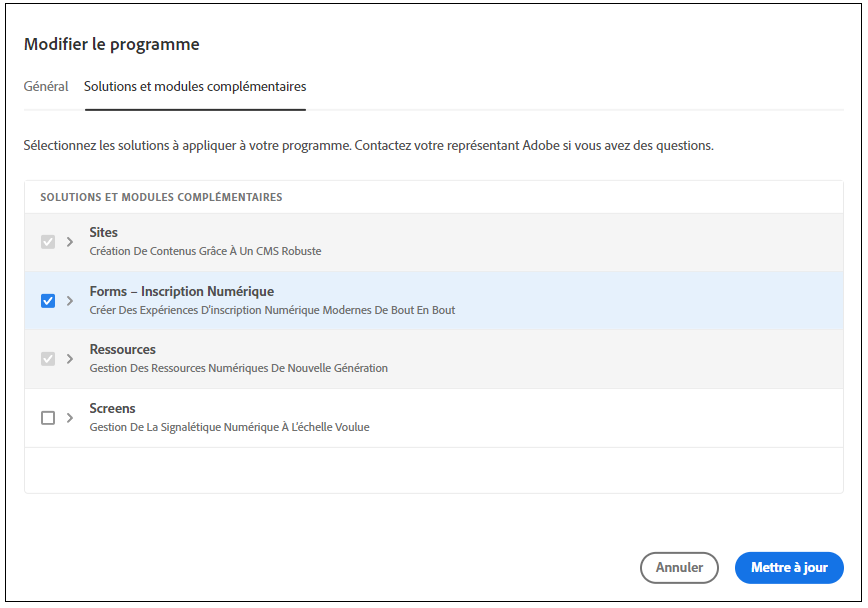

# Migrer depuis [!DNL AEM Forms] (environnements AMS et On-Premise) vers [!DNL AEM Forms] as a Cloud Service  {#Harden-your-AEM-Forms-as-a-Cloud-Service-environment}

| Version | Lien de l’article |
| -------- | ---------------------------- |
| AEM 6.5 | [Cliquez ici](https://experienceleague.adobe.com/docs/experience-manager-65/forms/upgrade-aem-forms/upgrade.html?lang=fr) |
| AEM as a Cloud Service | Cet article |

Vous pouvez migrer ou mettre à niveau vos formulaires adaptatifs, thèmes, modèles et configurations de cloud d’<!-- AEM 6.3 Forms AEM 6.4 Forms on OSGi and --> AEM 6.5 Forms on OSGi vers [!DNL AEM] as a Cloud Service. Avant de migrer ces ressources, utilisez l’utilitaire de migration pour convertir le format utilisé dans les versions antérieures au format utilisé dans [!DNL AEM] as a Cloud Service.
Commençons par le parcours de migration vers AEM as a Cloud Service | Adobe Experience Manager. Lorsque vous exécutez l’utilitaire de migration, les ressources ci-dessous sont mises à jour :

* Composants personnalisés pour les formulaires adaptatifs
* Modèles et thèmes de formulaires adaptatifs
* Configurations cloud
* Les scripts de l’éditeur de code sont convertis en fonctions réutilisables et appliqués aux règles visuelles.

## Considérations pour la migration vers Forms as a Cloud Service {#consideration}

Pour migrer d’AEM 6.5 Forms vers AEM Cloud Service, il est important de tenir compte des points suivants :

* Ce service ne permet de migrer du contenu d’[!DNL AEM Forms] que dans les environnements OSGi. La migration de contenu d’[!DNL AEM Forms] on JEE vers un environnement Cloud Service n’est pas prise en charge.

* (Uniquement pour les versions antérieures d’AEM 6.5 Forms) Les formulaires adaptatifs reposant sur des modèles et des thèmes prêts à l’emploi disponibles dans AEM 6.3 Forms ou une version antérieure ne sont pas pris en charge dans [!DNL AEM Forms] as a Cloud Service.

* Adobe Experience Manager Forms as a Cloud Service apporte des modifications notables aux fonctionnalités existantes par rapport aux environnements Adobe Experience Manager Forms 6.5 (On-Premise et Adobe-Managed Service). Avant de poursuivre la migration vers le service, [apprenez-en plus sur ces modifications notables](notable-changes.md) et les [différences de niveau de fonctionnalité](https://experienceleague.adobe.com/docs/experience-manager-cloud-service/content/migration-journey/cloud-migration/best-practices-analyzer/using-best-practices-analyzer.html?lang=fr#viewing-report) pour décider d’une migration selon les fonctionnalités dont votre entreprise a besoin.

<!-- 
## Difference with AEM 6.5 Forms 

| Feature         | Difference with AEM 6.5 Forms    |
|--------------|-----------|
| HTML5 Forms (Mobile Forms)     | The service does not support HTML5 Forms (Mobile Forms). If you render your XDP-based forms as HTML5 Forms, you can continue using the feature on AEM 6.5 Forms. |
| Adaptive Forms     | <li><b>XSD-Based Adaptive Forms:</b> The service does not support HTML5 Forms (Mobile Forms). If you render your XDP-based forms as HTML5 Forms, you can continue using the feature on AEM 6.5 Forms. </li> <li><b> Adaptive Form templates:</b> Use build pipeline and corresponding Git repository of your program to import existing Adaptive Form templates. </li><li><b>Rule editor:</b> AEM Forms as a Cloud Service provides a hardened [Rule editor](rule-editor.md#visual-rule-editor). The code editor is not available on Forms as a Cloud Service. The migration utility helps you migrate your forms that have custom rules (created in code editor). The utility converts such rules into custom functions supported on Forms as a Cloud Service. You can use the reusable functions with Rule editor to continue obtaining results obtained with rule scripts  The `onSubmitError` or `onSubmitSuccess` functions are now available as actions the Rule Editor. </li> <li><b>Drafts and submissions:</b> The service does not retain metadata for drafts and submitted Adaptive Forms. </li> <li><b> Prefill Service:</b> By default, the prefill service merges data with an Adaptive Form at client as opposed to merging data on Server in AEM 6.5 Forms. The feature helps improve the time required to prefill an Adaptive Form. You can always configure to run the merge action on the Adobe Experience Manager Forms Server. </li><li><b>Submit actions:</b> The **Email as PDF** action is not available. The **Email** submit action provide options to send attachments and attach Document of Record (DoR) with email. </li>|
| Form Data Model | <li>Forms data model supports only HTTP and HTTPs endpoints to submit data. </li><li>Forms as a Cloud Service allows to use Microsoft Azure Blob, Microsoft Sharepoint, Microsoft OneDrive, and services supporting general CRUD (Create, Read, Update, and Delete) operations as data stores. The service does not support JDBC connector, Mutual SSL for Rest connector, and x509 certificate-based authentication for SOAP data sources. </li>|
| Automated Forms Conversion Service     | The service does not provide meta-model for Automated Forms Conversion Service. You can [download it from Automated Forms Conversion Service documentation](https://experienceleague.adobe.com/docs/aem-forms-automated-conversion-service/using/extending-the-default-meta-model.html?lang=en#default-meta-model).|
|Configurations|<li>Email support only HTTP and HTTPs protocols, by default. [Contact the support team](https://experienceleague.adobe.com/docs/experience-manager-cloud-service/implementing/developing/development-guidelines.html#sending-email) to enable ports for sending emails and to enable SMTP protocol for your environment. </li> <li>If you use custom bundles, recompile your code with latest version of adobe-aemfd-docmanager before using these bundles with Forms as a Cloud Service.</li> |
| Document Manipulation APIs (Assembler Service)| The service does not support operations dependent on other services or applications: <li>Conversion of documents in a non-PDF format to a PDF format is not supported. For example, Microsoft Word to PDF, Microsoft Excel to PDF, and HTML to PDF are not supported</li><li>Adobe Distiller-based conversions are not supported. For example, PostScript(PS) to PDF</li><li>Forms Service-based conversions are not supported. For example, XDP to PDF Forms.</li><li>The service does not support converting a Signed PDF or Transparent PDF to another PDF format.</li>| -->

## Prérequis {#prerequisites}

Pour garantir une transition en douceur d’AEM Forms 6.5 vers l’environnement AEM as a Cloud Service, il est important de tenir compte des conditions préalables suivantes :

* Activez l’option [Forms : inscription numérique](https://experienceleague.adobe.com/docs/experience-manager-cloud-manager/using/getting-started/setting-up-program.html?lang=fr#editing-program) pour votre programme Forms Cloud Service et [exécutez le pipeline](https://experienceleague.adobe.com/docs/experience-manager-cloud-manager/using/how-to-use/deploying-code.html?lang=fr).

  

* Dans un environnement de Cloud Service, l’utilitaire de migration fonctionne conjointement avec l’outil de transfert de contenu. L’utilitaire de migration rend les ressources [!DNL AEM Forms] compatibles avec Cloud Service et l’outil de transfert de contenu migre le contenu de votre environnement [!DNL AEM Forms] vers un environnement [!DNL AEM] as a Cloud Service. Avant d’utiliser l’utilitaire de migration, découvrez comment [passer à AEM en tant que Cloud Service](https://experienceleague.adobe.com/docs/experience-manager-cloud-service/moving/home.html?lang=fr). Le processus utilise l’outil suivant :
   * [Outil de transfert de contenu](https://experienceleague.adobe.com/docs/experience-manager-cloud-service/moving/cloud-migration/content-transfer-tool/overview-content-transfer-tool.html?lang=fr#cloud-migration) : l’outil de transfert de contenu permet de préparer et de transférer du contenu d’un environnement existant vers un environnement Cloud Service. Cela permet aux utilisateurs et utilisatrices de mettre facilement à niveau AEM Forms vers l’environnement cloud.
* Comptes disposant de droits d’administration sur [!DNL AEM Forms] as a Cloud Service et votre environnement local [!DNL AEM Forms].
* Téléchargez et installez Best Practice Analyzer, l’outil de transfert de contenu et l’utilitaire de migration [!DNL AEM Forms] à partir de [ Software Distribution Portal](https://experience.adobe.com/#/downloads/content/software-distribution/en/aemcloud.html).

* Exécutez l’outil [Best Practices Analyzer](https://experienceleague.adobe.com/docs/experience-manager-cloud-service/moving/cloud-migration/best-practices-analyzer/overview-best-practices-analyzer.html?lang=fr#cloud-migration) et corrigez le problème signalé. Pour connaître les éventuels problèmes liés à la migration d’Adobe Experience Manager Forms vers Adobe Experience Manager Forms as a Cloud Service, consultez [Détection de motifs AEM pour Forms as a Cloud Service](https://experienceleague.adobe.com/docs/experience-manager-cloud-service/content/migration-journey/cloud-migration/best-practices-analyzer/using-best-practices-analyzer.html?lang=fr#viewing-report).

<!-- * Download the latest [compatibility package](https://experienceleague.adobe.com/docs/experience-manager-release-information/aem-release-updates/forms-updates/aem-forms-releases.html?lang=en#aem-65-forms-releases) for your [!DNL AEM Forms] version. -->

## Migrer les ressources [!DNL AEM 6.5 Forms] vers AEM Cloud Service {#use-the-migration-utility}

Pour rendre vos ressources [!DNL AEM Forms] compatibles avec Cloud Service et les transférer vers un environnement [!DNL AEM] as a Cloud Service, procédez comme suit.

1. Créez un [clone](https://experienceleaguecommunities.adobe.com/t5/adobe-experience-manager/correct-method-to-clone-the-aem-environment/td-p/363487?profile.language=fr) de votre environnement [!DNL AEM Forms] existant.

   >[!NOTE]
   >
   > Lorsque vous migrez de la version 6.5 vers Cloud Service, il est recommandé d’utiliser un environnement cloné pour exécuter l’outil de transfert de contenu et l’utilitaire de migration. L’outil de transfert de contenu et l’utilitaire de migration apportent des modifications au contenu et aux ressources. Par conséquent, n’exécutez pas l’outil de transfert de contenu ou l’utilitaire de migration dans un environnement de production.

1. Connectez-vous à votre environnement cloné avec des droits d’administrateur.

1. Téléchargez et installez l’outil [Content Transfer Tool](https://experienceleague.adobe.com/docs/experience-manager-cloud-service/moving/cloud-migration/content-transfer-tool/overview-content-transfer-tool.html?lang=fr#cloud-migration) et l’utilitaire de migration [!DNL AEM Forms] as a Cloud Service à partir du [portail de distribution logicielle](https://experience.adobe.com/#/downloads/content/software-distribution/en/aemcloud.html) dans l’environnement cloné. Vous pouvez utiliser AEM Package Manager pour installer l’outil et l’utilitaire.

1. Accédez à **[!UICONTROL Outils]** > **[!UICONTROL Opérations]** > **[!UICONTROL Migration du contenu]**.

1. Ouvrez la carte **[!UICONTROL Préparer Forms pour la migration]**. Le navigateur affiche cinq options :
   * **[!UICONTROL Migration des ressources d’AEM Forms]**
   * **[!UICONTROL Migration de composants personnalisés de formulaires adaptatifs]**
   * **[!UICONTROL Migration de modèles de formulaire adaptatif]**
   * **[!UICONTROL Migration des configurations cloud AEM Forms]**
   * **[!UICONTROL Migration du script de l’éditeur de code]**

1. Utilisez l’option une après l’autre pour rendre vos ressources [!DNL AEM Forms] compatibles avec [!DNL AEM] as a Cloud Service :

   1. Sélectionnez **[!UICONTROL Migration AEM Forms Assets]**, puis dans l’écran suivant, sélectionnez **[!UICONTROL Démarrer la migration]**. Cela rend les formulaires adaptatifs et les thèmes dans votre environnement [!DNL AEM Forms] compatible avec [!DNL AEM] as a Cloud Service.

   1. Sélectionnez **[!UICONTROL Migration des composants personnalisés de Forms adaptatif]** puis, sur la page Migration des composants personnalisés, sélectionnez **[!UICONTROL Lancer la migration]**. Cela rend les composants personnalisés développés pour des formulaires adaptatifs et les superpositions de composants dans votre environnement [!DNL AEM Forms] compatibles avec [!DNL AEM] as a Cloud Service.

   1. Sélectionnez **[!UICONTROL Migration de modèles de Forms adaptatif]** puis, dans la page Migration des composants personnalisés, sélectionnez **[!UICONTROL Lancer la migration]**. Cela rend les modèles de formulaire adaptatif dans `/apps` ou `/conf` et créés à l’aide de l’éditeur de modèles AEM compatibles avec [!DNL AEM] as a Cloud Service.

   1. Sélectionnez **[!UICONTROL Migration des configurations cloud AEM Forms]** puis, sur la page Migration de la configuration, sélectionnez **[!UICONTROL Démarrer la migration]**. Il met à jour et déplace les Cloud Services suivants vers un nouvel emplacement :

      * Cloud Service de modèle de données de formulaire
      * Google reCAPTCHA Cloud Service
      * [!DNL Adobe Sign] Cloud Service
      * Adobe Fonts Cloud Service

   1. Sélectionnez **[!UICONTROL Migration des scripts de l’éditeur de code]**, spécifiez un emplacement pour enregistrer les fonctions réutilisables, puis sélectionnez **[!UICONTROL Démarrer la migration].

   Cloud Service ne prend pas en charge les scripts de l’éditeur de règles. L’outil **[!UICONTROL Migration des scripts de l’éditeur de code]** convertit tous les scripts de règle de votre environnement en fonctions réutilisables et applique les fonctions réutilisables à l’éditeur visuel à l’emplacement approprié. Ces fonctions réutilisables sont enregistrées sous forme de bibliothèques clientes et vous aident à conserver les fonctionnalités existantes intactes. L’outil applique automatiquement les fonctions réutilisables générées aux formulaires adaptatifs correspondants.

   Migration d’AEM Form vers Cloud Service, utilisez le [gestionnaire de packages](https://experienceleague.adobe.com/docs/experience-manager-65/administering/contentmanagement/package-manager.html?lang=fr#contentmanagement) pour exporter les fonctions réutilisables (bibliothèques clientes) vers un package.

1. [Déployez](https://experienceleague.adobe.com/docs/experience-manager-cloud-service/implementing/deploying/overview.html?lang=fr#deploying-content-packages-via-cloud-manager-and-package-manager) le package de fonctions réutilisables (bibliothèques clientes), le [code personnalisé, les composants, les configurations](https://experienceleague.adobe.com/docs/experience-manager-learn/cloud-service/cloud-manager/devops/deploy-code.html?lang=fr#cloud-manager), les bibliothèques personnalisées spécifiques aux paramètres régionaux dans votre environnement [!DNL AEM] as a Cloud Service.

   <!-- 1. Install the latest [Compatibility Package](https://experienceleague.adobe.com/docs/experience-manager-cloud-service/moving/cloud-migration/content-transfer-tool/overview-content-transfer-tool.html?#cloud-migration) to your cloned [!DNL AEM Forms] environment. -->

1. Exécutez l’[outil de transfert de contenu](https://experienceleague.adobe.com/docs/experience-manager-cloud-service/moving/cloud-migration/content-transfer-tool/overview-content-transfer-tool.html?lang=fr#cloud-migration). Lors de la spécification des paramètres dans l’écran **[!UICONTROL Créer un jeu de migration]**, spécifiez le chemin d’accès au Forms adaptatif, aux thèmes, aux modèles, au modèle de données de formulaire (FDM), aux Cloud Service, aux composants personnalisés et à d’autres ressources spécifiques à AEM Forms sur l’option **[!UICONTROL Chemins à inclure]**. Cela ajoute les ressources [!DNL AEM Forms] spécifiées au jeu de migration.

## Chemins d’accès à différentes ressources spécifiques à AEM Forms

Lorsque vous migrez d’AEM Forms 6.5 vers le service cloud, vous pouvez localiser les ressources spécifiques à AEM Forms à l’adresse :

* **Formulaires adaptatifs** : vous trouverez les formulaires adaptatifs sous `/content/dam/formsanddocuments/` et `/content/forms/af`. Par exemple, pour un formulaire adaptatif appelé « Enregistrement WKND », ajoutez des chemins `/content/dam/formsanddocuments/wknd-registration` et `/content/forms/af/wknd-registration`.
* **Modèle de données de formulaire** : vous trouverez tout le modèle de données de formulaire (FDM) à l’adresse `/content/dam/formsanddocuments-fdm`. Par exemple, `/content/dam/formsanddocuments-fdm/ms-dynamics-fdm`.

* **Bibliothèques clientes** : le chemin d’accès par défaut aux bibliothèques clientes est `/etc/clientlibs/fd/theme`.

* **Modèles de formulaire adaptatif** : le chemin d’accès par défaut aux modèles est `/conf/<template folder>`. Par exemple, pour un modèle appelé « chemin d’ajout de base » `/conf/ReferenceEditableTemplates/settings/wcm/templates/basic`.

* **Thèmes de formulaires adaptatifs et bibliothèques clientes** : le chemin d’accès par défaut aux thèmes est ` /content/dam/formsanddocuments-themes/` et chemin d’accès par défaut aux bibliothèques clientes est `/etc/clientlibs/fd/theme`. Par exemple, pour un modèle appelé « Thème WKND », ajoutez le chemin d’accès ` /content/dam/formsanddocuments-themes/wkndtheme` et les bibliothèques clientes pour le thème sous `/etc/clientlibs/reference-themes/wkndtheme-3-0`. Vous pouvez également utiliser des thèmes et des bibliothèques clientes sur d’autres chemins d’accès personnalisés.

* **Configurations du cloud** : vous trouverez les configurations de cloud sous `/conf/`. Par exemple, la configuration cloud du modèle de données de formulaire (FDM) se trouve à l’adresse `/conf/global/settings/cloudconfigs/fdm`.

* **Modèle de processus** : vous trouverez des modèles de processus AEM sous `/conf/global/settings/workflow/models/`. Par exemple, pour un modèle de processus appelé « Enregistrement WKND », ajoutez le chemin d’accès `/conf/global/settings/workflow/models/wknd-registration`.

Vous pouvez ajouter des chemins d’accès aux dossiers de niveau supérieur répertoriés ci-dessous ou des chemins d’accès aux dossiers spécifiques, comme indiqué ci-dessous. Cela vous permet de migrer simultanément une certaine ressource et toutes les ressources et tous les formulaires, lorsque vous effectuez une mise à niveau vers le service cloud à partir d’AEM Forms 6.5.

* `/content/dam/formsanddocuments-fdm`
* `/content/dam/formsanddocuments/themes`
* `/content/forms/af`
* `/etc/clientlibs/fd/theme`

Lorsque vous migrez des modèles de processus AEM d’AEM Forms 6.5 vers Cloud Service, spécifiez les chemins d’accès suivants :

* `/conf/global/settings/workflow/models/`
* `/conf/global/settings/workflow/launcher`
* `/var/workflow/models`

## Voir suivant

* [Modifications notables pour les utilisateurs et utilisatrices d’Adobe Experience Manager Forms 6.5 existants](https://experienceleague.adobe.com/docs/experience-manager-cloud-service/content/forms/forms-overview/notable-changes.html?lang=fr)
* [Intégration d’AEM Forms as a Cloud Service](https://experienceleague.adobe.com/docs/experience-manager-cloud-service/content/forms/setup-configure-migrate/setup-forms-cloud-service.html?lang=fr)
* [Créer votre premier formulaire adaptatif sur Cloud Service](https://experienceleague.adobe.com/docs/experience-manager-cloud-service/content/forms/adaptive-forms-authoring/authoring-adaptive-forms-foundation-components/create-an-adaptive-form-on-forms-cs/creating-adaptive-form.html?lang=fr)

## Informations supplémentaires

L’utilitaire de migration vous permet de migrer les formulaire adaptatifs en fonction des composants de base. En outre, Forms as a Cloud Service prend en charge les composants principaux de formulaires adaptatifs. Ainsi, vous pouvez :

* [créer des formulaires adaptatifs autonomes basés sur des composants principaux ;](/help/forms/creating-adaptive-form-core-components.md)
* [Créer un formulaire adaptatif basé sur les composants principaux directement dans une page AEM Sites](/help/forms/create-or-add-an-adaptive-form-to-aem-sites-page.md)

Pour en savoir plus sur AEM Forms as a Cloud Service, consultez :

* [Présentation d’AEM Forms Cloud Service](/help/forms/home.md)
* [Innovations dans AEM Forms Cloud Service](/help/forms/latest-innovations.md)