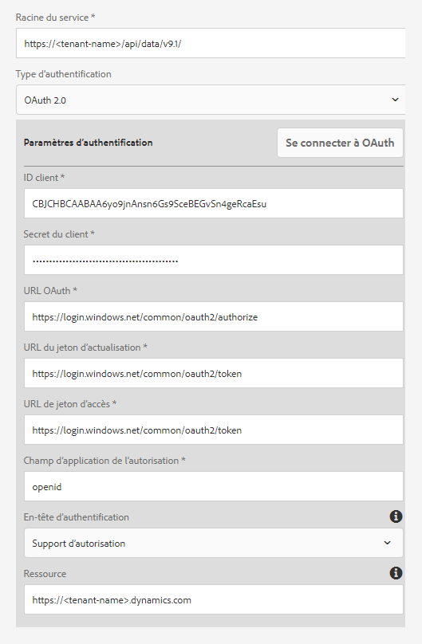
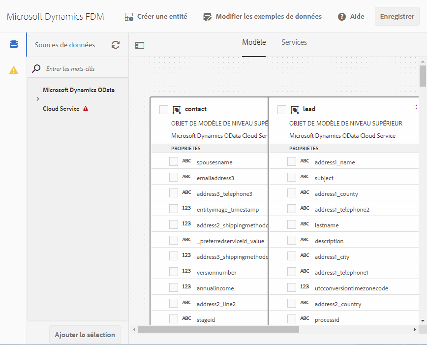

# Configuration de [!DNL Microsoft Dynamics] OData {#microsoft-dynamics-odata-configuration}

| Version | Lien de l’article |
| -------- | ---------------------------- |
| AEM 6.5 | [Cliquez ici](https://experienceleague.adobe.com/docs/experience-manager-65/forms/form-data-model/ms-dynamics-odata-configuration.html) |
| AEM as a Cloud Service | Cet article |


[!DNL Microsoft Dynamics] est un logiciel de gestion de la relation client (Customer Relationship Management, CRM) et de planification des ressources de l’entreprise (Enterprise Resource Planning, ERP), qui fournit des solutions d’entreprise pour la création et la gestion de comptes clients, de contacts, de prospects, d’opportunités et de dossiers. L’[[!DNL Experience Manager Forms] intégration de données](data-integration.md) fournit une configuration de service cloud OData permettant d’intégrer Forms aux serveurs [!DNL Microsoft Dynamics] On-premise et en ligne. Elle permet de créer un modèle de données de formulaire reposant sur des entités, des attributs et des services définis dans le service [!DNL Microsoft Dynamics]. Le modèle de données de formulaire peut être utilisé pour créer des formulaires adaptatifs qui interagissent avec un serveur [!DNL Microsoft Dynamics] pour activer des processus métier. Par exemple :

* Demander des données à un serveur [!DNL Microsoft Dynamics] et préremplir des formulaires adaptatifs
* Écrire des données dans [!DNL Microsoft Dynamics] sur un envoi de formulaires adaptatifs
* Écriture de données dans [!DNL Microsoft Dynamics] par le biais d’entités personnalisées définies dans le modèle de données de formulaire et inversement

<!--[!DNL Experience Manager Forms] add-on package also includes reference OData configuration that you can use to quickly integrate [!DNL Microsoft Dynamics] with [!DNL Experience Manager Forms].-->

<!--When the package is installed, the following entities and services are available on your [!DNL Experience Manager Forms] instance:

* MS Dynamics OData Cloud Service (OData Service)-->
<!--* Form Data Model with preconfigured [!DNL Microsoft Dynamics] entities and services.-->

<!-- Preconfigured [!DNL Microsoft Dynamics] entities and services in a Form Data Model are available on your [!DNL Experience Manager Forms] instance only if the run mode for the [!DNL Experience Manager] instance is set as `samplecontent` (default). -->  Le Cloud Service OData MS Dynamics (service OData) est disponible avec tous les modes d’exécution. Pour plus d’informations sur la configuration des modes d’exécution pour un événement [!DNL Experience Manager] instance, voir [Modes d’exécution](https://experienceleague.adobe.com/docs/experience-manager-cloud-service/implementing/deploying/overview.html?lang=fr#runmodes).

AEM as a Cloud Service propose différentes actions d’envoi prêtes à l’emploi pour gérer les envois de formulaire. Pour en savoir plus sur ces options, voir [Action d’envoi de formulaire adaptatif](/help/forms/configure-submit-actions-core-components.md)  article.


## Conditions préalables {#prerequisites}

Avant de commencer à installer et à configurer [!DNL Microsoft Dynamics], vérifiez que vous avez :

<!--* Installed the [[!DNL Experience Manager Forms] add-on package](installing-configuring-aem-forms-osgi.md) -->
* configuré [!DNL Microsoft Dynamics] 365 en ligne ou installé une instance de l’une des versions de [!DNL Microsoft Dynamics] suivantes :

   * [!DNL Microsoft Dynamics] 365 version locale
   * [!DNL Microsoft Dynamics] 2016 version locale

* [Enregistrez l’application pour le service en ligne [!DNL Microsoft Dynamics] avec [!DNL Microsoft Azure] Active Directory](https://docs.microsoft.com/fr-fr/dynamics365/customer-engagement/developer/walkthrough-register-dynamics-365-app-azure-active-directory). Notez les valeurs de l’ID client (également appelé « ID d’application ») et du secret du client pour le service enregistré. Ces valeurs sont utilisées lors de la [configuration du service cloud pour votre [!DNL Microsoft Dynamics] service](#configure-cloud-service-for-your-microsoft-dynamics-service).

## Définition de l’URL de réponse pour l’application [!DNL Microsoft Dynamics] enregistrée {#set-reply-url-for-registered-microsoft-dynamics-application}

Pour définir l’URL de réponse de l’application [!DNL Microsoft Dynamics] enregistrée :

>[!NOTE]
>
>N’utilisez cette procédure que lors de l’intégration d’[!DNL Experience Manager Forms]au serveur [!DNL Microsoft Dynamics] en ligne.

1. Accédez au compte Active Directory [!DNL Microsoft Azure] et ajoutez l’URL de configuration du service cloud suivante dans les paramètres des **[!UICONTROL URL de réponse]** pour votre application enregistrée :

   `https://[server]:[port]/libs/fd/fdm/gui/components/admin/fdmcloudservice/createcloudconfigwizard/cloudservices.html`

   

1. Enregistrez la configuration.

## Configuration de [!DNL Microsoft Dynamics] pour IFD {#configure-microsoft-dynamics-for-ifd}

[!DNL Microsoft Dynamics] utilise l’authentification basée sur les réclamations pour permettre aux utilisateurs externes d’accéder aux données sur le serveur CRM [!DNL Microsoft Dynamics]. À cet effet, procédez comme suit pour configurer [!DNL Microsoft Dynamics] pour le déploiement par Internet (IFD) et configurer les paramètres de réclamation.

>[!NOTE]
>
> N’utilisez cette procédure que lors de l’intégration d’[!DNL Experience Manager Forms] au serveur [!DNL Microsoft Dynamics] local.

1. Configurez l’instance locale d’[!DNL Microsoft Dynamics] pour IFD, comme décrit dans [Configurer IFD pour [!DNL Microsoft Dynamics]](https://technet.microsoft.com/fr-fr/library/dn609803.aspx).
1. Exécutez les commandes ci-dessous à l’aide de Windows PowerShell pour configurer les paramètres de réclamation sur [!DNL Microsoft Dynamics] compatible avec IFD :

   ```shell
   Add-PSSnapin Microsoft.Crm.PowerShell
    $ClaimsSettings = Get-CrmSetting -SettingType OAuthClaimsSettings
    $ClaimsSettings.Enabled = $true
    Set-CrmSetting -Setting $ClaimsSettings
   ```

   Pour plus d’informations, voir [Enregistrement de l’application pour CRM local (IFD)](https://msdn.microsoft.com/sl-si/library/dn531010(v=crm.7).aspx#bkmk_ifd).

## Configuration du client OAuth sur une machine AD FS {#configure-oauth-client-on-ad-fs-machine}

Pour enregistrer un client OAuth sur l’ordinateur Active Directory Federation Services (AD FS) et octroyer l’accès sur l’ordinateur AD FS :

>[!NOTE]
>
>N’utilisez cette procédure que lors de l’intégration d’[!DNL Experience Manager Forms] au serveur [!DNL Microsoft Dynamics] local.

1. Exécutez la commande suivante :

   `Add-AdfsClient -ClientId “<Client-ID>” -Name "<name>" -RedirectUri "<redirect-uri>" -GenerateClientSecret`

   Où :

   * `Client-ID` est un ID client que vous pouvez générer à l’aide d’un générateur de GUID.
   * `redirect-uri` est l’URL du service cloud OData de [!DNL Microsoft Dynamics] dans [!DNL Experience Manager Forms]. Le service cloud par défaut installé avec [!DNL Experience Manager Forms] est déployé à l’adresse URL suivante :
     `https://'[server]:[port]'/libs/fd/fdm/gui/components/admin/fdmcloudservice/createcloudconfigwizard/cloudservices.html`

1. Exécutez la commande ci-dessous pour octroyer l’accès sur l’ordinateur AD FS :

   `Grant-AdfsApplicationPermission -ClientRoleIdentifier “<Client-ID>” -ServerRoleIdentifier <resource> -ScopeNames openid`

   Où :

   * `resource` est l’URL de l’organisation de [!DNL Microsoft Dynamics].

1. [!DNL Microsoft Dynamics] utilise le protocole HTTPS. Pour appeler les points d’entrée AD FS à partir du serveur [!DNL Forms], installez le certificat de site [!DNL Microsoft Dynamics] dans le magasin de certificats Java à l’aide de la commande `keytool` sur l’ordinateur exécutant [!DNL Experience Manager Forms].

## Configuration du service cloud pour votre service [!DNL Microsoft Dynamics] {#configure-cloud-service-for-your-microsoft-dynamics-service}

Un service OData est identifié par son URL racine de service. Pour configurer un service OData dans [!DNL Experience Manager] as a Cloud Service, vérifiez que vous disposez de l’URL racine du service et procédez comme suit :

<!--The **MS Dynamics OData Cloud Service (OData Service)** configuration comes with default OData configuration. To configure it to connect with your [!DNL Microsoft Dynamics] service, do the following.-->

>[!NOTE]
>
>Pour obtenir un guide pas à pas sur la configuration de [!DNL Microsoft Dynamics 365], en ligne ou sur site, voir [[!DNL Microsoft Dynamics] Configuration OData](ms-dynamics-odata-configuration.md).

1. Accédez à **[!UICONTROL Outils > Cloud Services > Sources de données]**. Sélectionnez le dossier dans lequel vous souhaitez créer une configuration cloud.

   Pour plus d’informations sur la création et la configuration d’un dossier pour les configurations de service cloud, voir [Configurer le dossier pour les configurations de service cloud](#cloud-folder).

1. Sélectionner **[!UICONTROL Créer]** pour ouvrir le **[!UICONTROL Assistant Créer une configuration de source de données]**. Indiquez un nom et éventuellement un titre pour la configuration, puis sélectionnez **[!UICONTROL Service OData]** de la **[!UICONTROL Type de service]** , vous pouvez également rechercher et sélectionner une miniature pour la configuration, puis sélectionner **[!UICONTROL Suivant]**.
Dans l’onglet **[!UICONTROL Paramètres d’authentification]** :

   1. Saisissez la valeur de la variable **[!UICONTROL Racine du service]** champ . Accédez à l’instance Dynamics et à **[!UICONTROL Ressources de développement]** pour afficher la valeur du champ Racine du service. Par exemple, https://&lt;nom-client>/api/data/v9.1/

   1. Sélectionnez **[!UICONTROL OAuth 2.0]** comme type d’authentification.

   1. Remplacez les valeurs par défaut dans les champs **[!UICONTROL ID client]** (également appelé **ID d’application**), **[!UICONTROL Secret du client]**, **[!UICONTROL URL OAuth]**, **[!UICONTROL URL du jeton d’actualisation]**, **[!UICONTROL URL du jeton d’accès]** et **[!UICONTROL Ressource]** par les valeurs de votre configuration de service [!DNL Microsoft Dynamics]. Il est obligatoire de spécifier l’URL de l’instance dynamique dans le champ **[!UICONTROL Ressource]** pour configurer [!DNL Microsoft Dynamics] avec un modèle de données de formulaire. Utilisez l’URL racine du service pour dériver l’URL de l’instance dynamique. For example, [https://org.crm.dynamics.com](https://org.crm.dynamics.com/).

   1. Spécifiez **[!UICONTROL openid]** dans le champ **[!UICONTROL Champ d’application de l’autorisation]** pour la procédure d’autorisation sur [!DNL Microsoft Dynamics].

      
Modèle de données de formulaire
1. Cliquez sur **[!UICONTROL Se connecter à OAuth]**. Vous êtes redirigé vers la page de connexion de [!DNL Microsoft Dynamics].
1. Connectez-vous avec vos informations d’identification [!DNL Microsoft Dynamics] et autorisez la connexion de la configuration du service cloud au service [!DNL Microsoft Dynamics]. Il s’agit d’une tâche unique de définition du modèle de données de formulaire entre le service cloud et le service.

   Vous êtes ensuite redirigé vers la page de configuration du service cloud, qui affiche un message indiquant que la configuration OData a bien été enregistrée.

Le service cloud MS Dynamics OData Cloud Service (Service OData) est configuré et connecté à votre service Dynamics. Modèle de données de formulaire Modèle de données de formulaire

## Création d’un modèle de données de formulaire {#create-form-data-model}

<!--When you install the [!DNL Experience Manager Forms] package, a form data model, **[!DNL Microsoft Dynamics] FDM**, is deployed on your [!DNL Experience Manager] instance. By default, the Form Data Model uses [!DNL Microsoft Dynamics] service configured in the MS Dynamics OData Cloud Service (OData Service) as its data source.

On opening the Form Data Model for the first time, it connects to the configured [!DNL Microsoft Dynamics] service and fetches entities from your [!DNL Microsoft Dynamics] instance. The "contact" and "lead" entities from [!DNL Microsoft Dynamics] are already added in the form data model.

To review the form data model, go to **[!UICONTROL Form Data Model egrations]**. Select **[!DNL Microsoft Dynamics] FDM** and click **[!UICONTROL Edit]** to open the Form Data Model in edit mode. Alternatively, you can open the Form Data Model directly from the following URL:

`https://'[server]:[port]'/aem/fdm/editor.html/content/dam/formsanddocuments-fdm/ms-dynamics-fdm`
 Form Data Model 
-->

Après avoir configuré le service cloud OData de MS Dynamics, vous pouvez utiliser le service lors de la création de modèles de données de formulaire. Pour plus d’informations, voir [Créer un modèle de données de formulaire](create-form-data-models.md).

Ensuite, vous pouvez créer un modèle de données de formulaire adaptatif et l’utiliser dans divers cas d’utilisation de formulaire adaptatif, tels que :

* Remplir le formulaire adaptatif en obtenant des informations des entités et des services [!DNL Microsoft Dynamics]
* Appeler des opérations du serveur [!DNL Microsoft Dynamics] définies dans un modèle de données de formulaire à l’aide de règles de formulaires adaptatifs
* Écrire les données de formulaire envoyées dans les entités [!DNL Microsoft Dynamics]

<!--It is recommended to create a copy of the Form Data Model provided with the [!DNL Experience Manager Forms] package and configure data models and services to suit your requirements. It will ensure that any future updates to the package do not override your form data model.-->

Vous pouvez [configuration de l’action d’envoi de modèle de données de formulaire](/help/forms/using-form-data-model.md) pour un formulaire adaptatif pour envoyer des données à Microsoft Dynamics OData.

Pour plus d’informations sur la création et l’utilisation d’un modèle de données de formulaire dans les processus métier, voir [Intégration de données](data-integration.md).

## Articles connexes

{{af-submit-action}}
