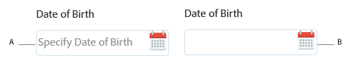

# Texte d’espace réservé dans [!DNL AEM Forms] {#placeholder-text-in-aem-forms}

Le texte d’espace réservé représente un mot ou une expression courte. L’objectif est d’aider l’utilisateur à saisir des données lorsque le contrôle n’a pas de valeur. Un texte d’espace réservé peut être un exemple de valeur ou une brève description du format attendu. Le texte d’espace réservé s’affiche avant que l’utilisateur ne saisisse une valeur et il est supprimé lorsque l’utilisateur saisit ou sélectionne une valeur.

>[!NOTE]
>
>Le texte d’espace réservé doit avoir, le cas échéant, une valeur qui ne contient aucun caractère de nouvelle ligne.

**A.** Composant de date avec le texte d’espace réservé **B.** Composant de date sans le texte d’espace réservé

[!DNL AEM Forms] prend en charge le texte d’espace réservé pour la zone Mot de passe, le sélecteur de date, la zone numérique et les champs de zone de texte.\
Les textes d’espace réservé ne sont pas pris en charge pour le widget natif de date en HTML5. Pour spécifier un texte d’espace réservé :

1. Cliquez avec le bouton droit sur un composant qui prend en charge le texte d’espace réservé, puis cliquez sur **Modifier**. La boîte de dialogue Modifier le composant apparaît.

1. Ouvrez l’onglet **Titre et texte.**
1. Indiquez un mot ou un groupe de mots court dans **la zone d’espace réservé**. Cliquez sur **OK**.

>[!NOTE]
>
>Le texte d’espace réservé n’est pas pris en charge sous [!DNL Microsoft Internet Explorer 9].

