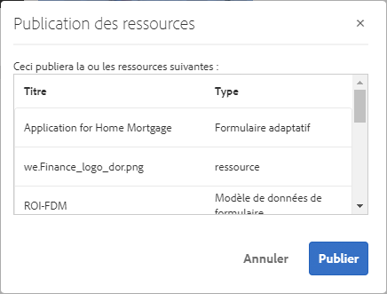
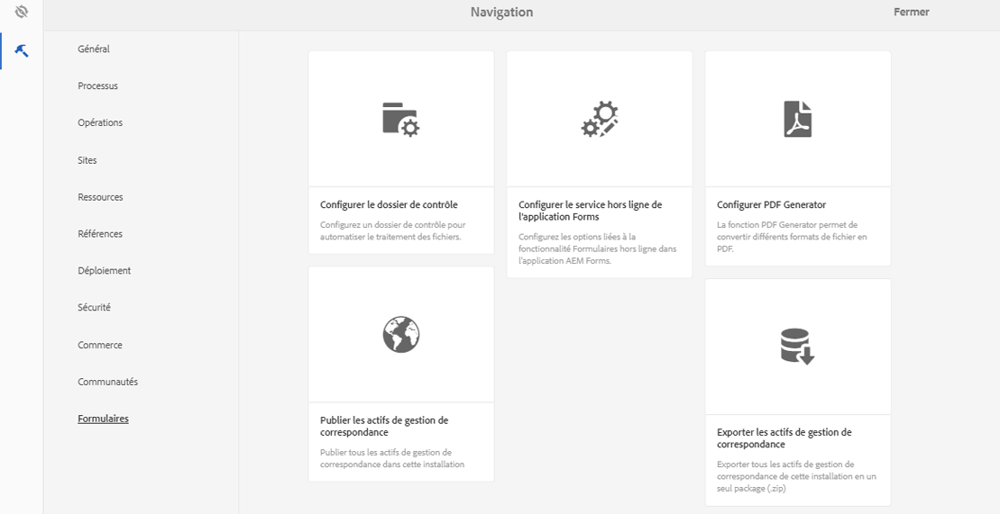
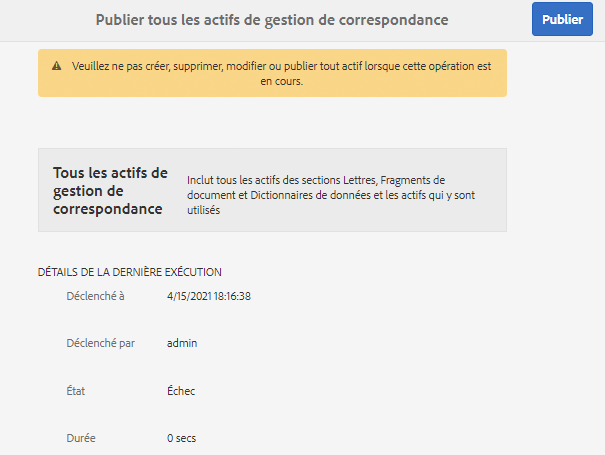

# Publication et dépublication de formulaires et documents{#publishing-and-unpublishing-forms-and-documents}

[!DNL AEM Forms] vous permet de créer, de publier et de dépublier facilement des formulaires. Le serveur [!DNL AEM Forms] propose deux instances : auteur et publication. L’instance Auteur est destinée à la création et la gestion d’éléments et de ressources de formulaire. L’instance de Publish permet de conserver les ressources et les ressources associées qui sont disponibles pour les utilisateurs finaux.

## Ressources prises en charge  {#supported-assets-nbsp}

[!DNL AEM Forms] prend en charge les types d’éléments suivants :

* Formulaires adaptatifs
* Documents adaptatifs
* Fragments de formulaire adaptatif
* Thèmes
* Modèles de formulaire <!-- (XFA forms) -->
* Formulaires PDF
* Document (documents PDF plats)
* Ensembles de formulaires
* Ressource (images, schémas et feuilles de style)

Au départ, tous les éléments sont uniquement disponibles dans l’instance de création. Une équipe d’administration ou un créateur ou une créatrice de formulaires peut publier tous les éléments, à l’exception des ressources.

Lorsque vous sélectionnez un formulaire et que vous le publiez, ses éléments et ressources associés sont également publiés. Toutefois, les éléments dépendants ne sont pas publiés. Dans ce contexte, les actifs et ressources connexes sont des actifs qu’un actif publié utilise ou auxquels il fait référence. Les actifs dépendants sont des actifs qui font référence à un actif publié.

Vos formulaires adaptatifs peuvent utiliser certaines configurations ou des paramètres et personnalisations qui ne sont pas publiés automatiquement. Il est recommandé de publier ou d’activer ces ressources avant de publier un formulaire adaptatif.

* Modèles de formulaire adaptatif modifiable
* Configurations de Cloud Service pour Adobe Sign, Typekit, reCAPTCHA et Form Data Model (FDM)
* Les autres configurations de service cloud ne sont activées que si l’utilisateur ou l’utilisatrice dispose d’autorisations d’administration.
* Personnalisations. Il s’agit notamment des éléments suivants, mais sans s’y limiter :

   * Dispositions personnalisées
   * Apparences personnalisées
   * Fichier CSS : utilisé en tant qu’entrée dans la boîte de dialogue des propriétés du conteneur de formulaires adaptatifs
   * Catégorie de bibliothèque cliente : utilisée en tant qu’entrée dans la boîte de dialogue des propriétés du conteneur de formulaires adaptatifs
   * Toute autre bibliothèque cliente pouvant être incluse dans le modèle de formulaire adaptatif.
   * Chemins de conception

## États d’un élément {#asset-states}

Un élément peut présenter les états suivants :

* **Dépublié** : élément qui n’a jamais été publié (l’état Dépublié s’applique uniquement aux éléments de Forms. Les éléments de Correspondence Management n’ont pas l’état Dépublié.)
* **Publié** : élément qui a été publié et qui est disponible sur l’instance de publication.
* **Modifié** : élément qui est modifié après avoir été publié.

## Publier une ressource {#publish-an-asset}

1. Connectez-vous au serveur [!DNL AEM Forms].
1. Utilisez l’une des méthodes suivantes pour sélectionner et publier un élément.

   1. Déplacez le pointeur sur un actif et sélectionnez **[!UICONTROL Publier]** .
   1. Effectuez l’une des actions suivantes, puis sélectionnez Publier :

      * Si la vue Carte est active, sélectionnez **[!UICONTROL Passer en mode de sélection]** , puis choisissez l’élément. L’élément est sélectionné.
      * Si vous êtes en mode Liste, cochez la case d’un élément. L’élément est sélectionné.
      * Sélectionnez un élément pour en afficher les détails.
      * Affichez les propriétés d’un élément en appuyant sur Afficher les propriétés .

      >[!NOTE]
      >
      >Ne sélectionnez pas plusieurs éléments. La publication simultanée de plusieurs éléments n’est pas prise en charge.

1. Au lancement de la procédure de publication, une boîte de dialogue de confirmation s’ouvre. Elle répertorie l’ensemble des éléments et des ressources connexes. Dans la boîte de dialogue contenant les éléments connexes, sélectionnez **[!UICONTROL Publier]**. L’élément est publié et la boîte de dialogue Publication réussie apparaît.

   >[!NOTE]
   >
   >Dans le cas des formulaires adaptatifs, à côté des éléments connexes, le nom de la page Formulaire adaptatif est également affiché.

   

   Boîte de dialogue de confirmation comprenant l’ensemble des ressources et des éléments connexes.

   >[!NOTE]
   >
   >Pour Forms Manager, si l’utilisateur n’est pas autorisé à publier les éléments répertoriés, l’action Publication est désactivée. Un élément qui nécessite des autorisations supplémentaires est affiché en rouge.

   Une fois l’élément publié, ses propriétés de métadonnées sont copiées dans l’instance Publication et son état passe à Publié. Le statut des éléments dépendants qui sont publiés passe également à Publié.

   <!-- After publishing an asset, you can use the Forms Portal to display all the assets on a web page. For more information, see [Introduction to publishing forms on a portal](introduction-publishing-forms.md).-->

## Publier toutes les ressources de Correspondence Management {#publish-all-the-correspondence-management-assets}

[!DNL AEM Forms] permet de modifier tous les éléments de Correspondence Management sur un serveur en une seule fois. Les éléments publiés comportent tous les éléments de Correspondence Management et dépendances connexes.

Procédez comme suit pour publier tous les éléments de Correspondence Management sur un serveur :

1. Connectez-vous au serveur [!DNL AEM Forms].
1. Sélectionnez **Adobe Experience Manager** dans la barre de navigation générale.
1. Sélectionnez les , puis sélectionnez **Formulaires**.
1. Sélectionnez **Publier les éléments de Correspondence Management**.

   

   La page Publier tous les actifs de gestion de correspondance apparaît et affiche les informations sur la dernière fois où le processus de publication des actifs de gestion de correspondance a été tenté.

   

1. Sélectionnez **Publier**, puis, dans le message de confirmation, cliquez sur **OK**.

   A la fin du traitement par lot, vous pouvez afficher les détails de la dernière exécution. Cela inclut des informations telles que les identifiants de l’administrateur ou de l’administratrice et la mention de la réussite ou de l’échec de l’exécution par lots.

   >[!NOTE]
   >
   >Le processus de publication ne peut plus être annulé une fois qu’il a été lancé. En outre, pendant que le processus de publication est en cours, ne procédez à aucune création, suppression, modification ou publication d’éléments, ou ne lancez aucune opération d’exportation d’éléments de Correspondence Management.

## Automatisation de la publication ou de la dépublication de formulaires et documents {#automate-publishing-and-unpublishing-for-forms-amp-documents}

[!DNL AEM Forms] permet de planifier la publication et la dépublication des éléments de formulaires et documents. Vous pouvez spécifier la planification dans l’éditeur de métadonnées. Pour plus d’informations sur la gestion des métadonnées de formulaire, voir [Gestion des métadonnées de formulaire](manage-form-metadata.md).

Procédez comme suit pour planifier la date et l’heure de publication et de dépublication des éléments de formulaires et documents :

1. Sélectionnez un élément et cliquez sur **[!UICONTROL Afficher les propriétés]**. La page Propriétés des métadonnées s’ouvre.
1. Dans la page Propriétés des métadonnées, sélectionnez **[!UICONTROL Avancé]**, puis **[!UICONTROL Modifier]** .
1. Sélectionnez la date et l’heure dans les champs **[!UICONTROL Heure de début de publication]** et **[!UICONTROL Heure de fin de publication]**.\
   Sélectionnez **[!UICONTROL Terminé]** .

## Annulation de la publication d’un élément {#unpublish-an-asset}

1. Sélectionnez un élément publié, puis **[!UICONTROL Annuler la publication]**.
1. Utilisez l’une des actions suivantes pour sélectionner et annuler la publication d’un élément.

   1. Positionnez le pointeur sur une ressource puis sélectionnez **[!UICONTROL Annuler la publication]** .
   1. Effectuez l’une des actions suivantes, puis sélectionnez Annuler la publication :

      * Si la vue Carte est active, sélectionnez **[!UICONTROL Passer en mode de sélection]** , puis choisissez l’élément. L’élément est sélectionné.

      * Si la vue Liste est active, pointez sur un élément et sélectionnez . L’élément est sélectionné.

      * Sélectionnez un élément pour en afficher les détails.
      * Affichez les propriétés d’un élément en appuyant sur Afficher les propriétés .

1. Au lancement de la procédure de dépublication, une boîte de dialogue de confirmation s’ouvre. Sélectionner **[!UICONTROL Annuler la publication]**.

   >[!NOTE]
   >
   >L’annulation de la publication affecte uniquement l’élément sélectionné ; les éléments enfants et référencés ne sont pas concernés.

## Rétablissement de la version précédemment publiée d’une ressource ou d’une lettre {#revert-an-asset-or-letter-to-the-previously-published-version}

Chaque fois que vous publiez un élément ou une lettre après modification, une version de l’élément ou de la lettre est créée. Vous pouvez rétablir la version précédemment publiée d’un élément ou d’une lettre. Cette opération peut être utile si un problème se produit avec la version actuelle de l’élément ou de la lettre.

>[!NOTE]
>
>Ne rétablissez pas le dernier état de publication d’une lettre si un élément dépendant utilisé dans cette lettre publiée a été supprimé du système.

1. Sélectionnez un élément, puis **[!UICONTROL Restaurer la version publiée précédemment]** .
1. Avant que l’élément ne soit rétabli, une boîte de dialogue de confirmation s’affiche. Sélectionnez **[!UICONTROL Rétablir]**.

   La version précédemment publiée de l’élément ou de la lettre est rétablie.

## Suppression d’un élément {#delete-an-asset}

>[!NOTE]
>
>La suppression d’un élément le supprime de l’instance de publication. La suppression d’un élément supprime également son historique des versions, sauf la version de base.

1. Sélectionnez un élément, puis **[!UICONTROL Supprimer]** .

   >[!NOTE]
   >
   >L’option de suppression est également disponible quand vous affichez les détails de l’élément en appuyant sur l’élément ou quand vous affichez les propriétés d’un élément en appuyant sur Afficher les propriétés .

1. Avant que l’élément soit supprimé, une boîte de dialogue de confirmation s’affiche. Sélectionnez **[!UICONTROL Supprimer]**.

   >[!NOTE]
   >
   >Seul l’élément sélectionné est supprimé. Les éléments dépendants ne le sont pas. Pour vérifier les références d’un élément, sélectionnez , puis un élément.
   >
   >
   >Si l’élément que vous essayez de supprimer est un élément enfant d’un autre élément, il n’est pas supprimé. Pour supprimer ce type d’élément, supprimez les références de cet élément des autres éléments et réessayez.

## Formulaires adaptatifs protégés {#protected-adaptive-forms}

Vous pouvez activer une authentification pour les formulaires auxquels vous souhaitez que des personnes sélectionnées aient accès. Lorsque vous activez une authentification pour vos formulaires, les personnes voient un écran de connexion avant d’y accéder. Seules les personnes dotées d’informations d’identification autorisées peuvent accéder aux formulaires.

Pour activer une authentification pour vos formulaires :

1. Dans votre navigateur, ouvrez configMgr dans l’instance de publication.\
   URL : `https://<hostname>:<PublishPort>/system/console/configMgr`

1. Dans la configuration de la console Web d’Adobe Experience Manager, cliquez sur **Service d’authentification Apache Sling** pour le configurer.
1. Dans la boîte de dialogue Service d’authentification d’Apache Sling qui s’affiche, utilisez le bouton **+** pour ajouter des chemins d’accès.\
   Lorsque vous ajoutez un chemin, le service d’authentification est activé pour les formulaires de ce chemin.
