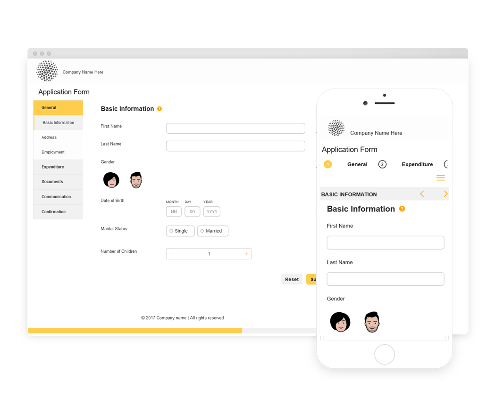

# Thèmes de référence, modèles et modèles de données de formulaire {#reference-themes-templates-and-data-models}

| Application | Lien de l’article |
| -------- | ---------------------------- |
| Formulaire adaptatif basé sur les composants principaux | [Cliquer ici](https://experienceleague.adobe.com/docs/experience-manager-core-components/using/adaptive-forms/sample-themes-templates-form-data-models-core-components.html?lang=fr) |
| Formulaire adaptatif basé sur les composants de base | Cet article |

>[!NOTE]
>
> Adobe recommande d’utiliser la capture de données moderne et extensible [composants principaux](https://experienceleague.adobe.com/docs/experience-manager-core-components/using/adaptive-forms/introduction.html?lang=fr) pour [créer un nouveau Forms adaptatif](/help/forms/creating-adaptive-form-core-components.md) ou [ajouter un Forms adaptatif aux pages AEM Sites](/help/forms/create-or-add-an-adaptive-form-to-aem-sites-page.md). Ces composants représentent une avancée significative dans la création de formulaires adaptatifs, ce qui garantit des expériences utilisateur impressionnantes. Cet article décrit une ancienne approche de création de Forms adaptatif à l’aide de composants de base.

AEM Forms as a Cloud Service fournit plusieurs thèmes de référence, modèles et modèle de données de formulaire (FDM) pour vous aider à commencer rapidement la création de Forms adaptatif. Vous pouvez télécharger le [module de contenu de référence du portail de distribution logicielle](https://experience.adobe.com/#/downloads/content/software-distribution/en/aemcloud.html?package=/content/software-distribution/en/details.html/content/dam/aemcloud/public/aem-forms-reference-content.ui.content-2.1.0.zip) et utiliser la fonction [Gestionnaire de modules](/help/implementing/developing/tools/package-manager.md) pour installer le [module de contenu de référence](https://experience.adobe.com/#/downloads/content/software-distribution/en/aemcloud.html?package=/content/software-distribution/en/details.html/content/dam/aemcloud/public/aem-forms-reference-content.ui.content-2.1.0.zip) dans votre environnement de production, de développement ou de développement local pour envoyer ces ressources de référence à votre environnement.

Les thèmes, modèles et modèle de données de formulaire (FDM) inclus dans le package de contenu de référence sont les suivants :

| Thèmes | Modèles | Modèle de données de formulaire (FDM) |
|---------|----------|---------|
| Canvas 3.0 | De base | Microsoft Dynamics 365 |
| Tranquil | Vide | Salesforce |
| Urbane |   |  |
| Ultramarine |  |  |
| Beryl |  |  |
| Healthcare |  |   |
| FSI |   |   |

## Thèmes de référence {#reference-themes}

Les [thèmes](/help/forms/themes.md) vous permettent de styliser vos formulaires sans aucune connaissance approfondie de CSS. Vous pouvez obtenir les thèmes suivants en installant le [module de contenu de référence](https://experience.adobe.com/#/downloads/content/software-distribution/en/aemcloud.html?package=/content/software-distribution/en/details.html/content/dam/aemcloud/public/aem-forms-reference-content.ui.content-2.1.0.zip) :

* Beryl
* Canvas 3.0
* Tranquil
* Urbane
* Ultramarine
* Healthcare
* FSI (Financial Services &amp; Insurance)

Chaque thème contient un style unique et élégant que vous pouvez utiliser pour créer des formulaires adaptatifs attrayants pour vos utilisateurs et vos utilisatrices. Il contient des styles uniques pour les sélecteurs tels que le panneau, la zone de texte, la zone numérique, le bouton radio, le tableau et le commutateur. Les styles de ces thèmes varient selon les besoins. Par exemple, dans un scénario particulier, vous avez besoin d’un thème minimaliste avec des polices très lisibles. Le thème Liberty permet d’obtenir cette apparence.

Les thèmes inclus dans ce package sont réactifs, avec un style défini pour des affichages mobiles et de bureau. La plupart des navigateurs modernes sur différents appareils peuvent sans problème rendre des formulaires auxquels est appliqué l’un de ces thèmes.

Pour plus d’informations sur l’installation du package, voir [Comment travailler avec les packages](/help/implementing/developing/tools/package-manager.md).

## Beryl {#beryl}

Le thème Beryl souligne l’utilisation d’une image d’arrière-plan, de la transparence et de grandes icônes aplaties. Dans la capture d’écran ci-dessous, vous pouvez voir à quoi ressemble le thème Beryl, et comment il peut augmenter le style de votre formulaire.

## Canvas 3.0 {#canvas}

Canvas 3.0 est le thème par défaut des formulaires adaptatifs. Il souligne l’utilisation des couleurs de base, de la transparence et des icônes aplaties. Dans la capture d’écran ci-dessous, vous pouvez voir à quoi ressemble le thème Canvas 3.0.

## Tranquil {#tranquil}

Le thème Tranquil fournit des nuances claires et sombres du jeu de couleurs Tranquil pour mettre en évidence différents composants d’un formulaire. Par exemple, les boutons radio, les panneaux et les onglets ont une nuance de vert différente.

## Urbane {#urbane}

Le thème Urbane met en évidence une apparence minimaliste et fonctionnelle de votre formulaire. Lorsque vous appliquez le thème Urbane à votre formulaire, vous pouvez voir que les composants sont aplatis. Les panneaux reçoivent des contours fins pour créer un aspect moderne.

## Ultramarine {#ultramarine}

Le thème Ultramarine met en évidence les composants tels que les onglets, les panneaux, les zones de texte et les boutons avec des tons bleu foncé.

## Healthcare {#healthcare}

Le thème Healthcare met en évidence les composants tels que les onglets, les panneaux, les zones de texte et les boutons avec des tons vert foncé.

## FSI (Financial Services &amp; Insurance)

Le thème FSI donne un aspect minimaliste et fonctionnel à votre formulaire. Lorsque vous appliquez le thème FSI à votre formulaire, les composants du panneau sont jaunes.

## Modèles de référence {#reference-templates}

Les [modèles](/help/forms/themes.md) vous permettent de définir la structure, le contenu et les actions de votre formulaire initial. Vous pouvez obtenir les modèles suivants en installant le [module de contenu de référence](https://experience.adobe.com/#/downloads/content/software-distribution/en/aemcloud.html?package=/content/software-distribution/en/details.html/content/dam/aemcloud/public/aem-forms-reference-content.ui.content-2.1.0.zip) :

* De base
* Vide

Le modèle de base permet de créer rapidement un formulaire d’inscription. Vous pouvez également l’utiliser pour prévisualiser les fonctionnalités des composants de base des formulaires adaptatifs. Il fournit une disposition d’assistant pour la présentation section par section des données. Utilisez le modèle vierge pour commencer à créer un formulaire adaptatif à partir d’un canevas vierge.

## Modèle de données de formulaire de référence (FDM) {#reference-models}

Les formulaires adaptatifs peuvent ainsi interagir avec les serveurs Microsoft Dynamics 365 et Salesforce pour activer les workflows métier. Par exemple :

* Écrivez des données sur Microsoft Dynamics 365 et Salesforce sur les envois de formulaires adaptatifs.
* Écrivez des données dans Microsoft Dynamics 365 et Salesforce par le biais d’entités personnalisées définies dans le modèle de données de formulaire (FDM) et inversement.
* Demandez des données aux serveurs Microsoft Dynamics 365 et Salesforce et préremplissez des formulaires adaptatifs.
* Lisez des données à partir des serveurs Microsoft Dynamics 365 et Salesforce.

Vous pouvez obtenir le modèle de données de formulaire (FDM) suivant en installant le [package de contenu de référence](https://experience.adobe.com/#/downloads/content/software-distribution/en/aemcloud.html?package=/content/software-distribution/en/details.html/content/dam/aemcloud/public/aem-forms-reference-content.ui.content-2.1.0.zip) :

* Microsoft® Dynamics 365
* Salesforce

Pour plus d’informations sur l’utilisation de ces modèles, consultez [Configuration des services cloud Microsoft Dynamics 365 et Salesforce](https://experienceleague.adobe.com/docs/experience-manager-cloud-service/content/forms/integrate/use-form-data-model/configure-msdynamics-salesforce.html?lang=fr#configure-dynamics-cloud-service).

## Voir également {#see-also}

{{see-also}}