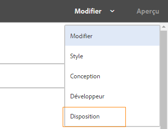

# Utilisation du mode Mise en page pour redimensionner les composants d’Adaptive Forms {#use-layout-mode-to-resize-components}

 Adobe recommande d’utiliser la capture de données moderne et extensible. [Composants principaux](https://experienceleague.adobe.com/docs/experience-manager-core-components/using/adaptive-forms/introduction.html?lang=fr) pour [création d’un Forms adaptatif](/help/forms/creating-adaptive-form-core-components.md) ou [Ajout de Forms adaptatif à des pages AEM Sites](/help/forms/create-or-add-an-adaptive-form-to-aem-sites-page.md). Ces composants représentent une avancée significative dans la création de Forms adaptatif, ce qui garantit des expériences utilisateur impressionnantes. Cet article décrit l’approche plus ancienne de la création de Forms adaptatif à l’aide de composants de base. 

| Version | Lien de l’article |
| -------- | ---------------------------- |
| AEM 6.5 | [Cliquez ici](https://experienceleague.adobe.com/docs/experience-manager-65/forms/adaptive-forms-basic-authoring/resize-using-layout-mode.html) |
| AEM as a Cloud Service | Cet article |

L’interface de création de formulaires adaptatifs vous permet de redimensionner des composants en mode Mise en page. Faites glisser les points bleus dans les colonnes pour définir les points de départ et de fin afin de positionner les composants. Les points bleus s’affichent après avoir appuyé sur le composant dans la grille réactive. La grille réactive est composée de 12 colonnes égales. L’ombrage blanc et bleu différencie une colonne d’une l’autre.

Vous pouvez utiliser le mode Mise en page afin de redimensionner les composants pour tous les types d’appareils tels que les ordinateurs de bureau, les tablettes, les smartphones et d’autres appareils plus petits. La tablette dérive automatiquement la configuration de la disposition de la version de bureau. Les appareils plus petits dérivent la configuration de la disposition du téléphone. Vous pouvez toutefois remplacer les configurations dérivées automatiquement pour définir une configuration différente pour chaque type d’appareil.

## Accès au mode Mise en page {#access-layout-mode}

Sélectionnez **[!UICONTROL Mise en page]** dans la liste déroulante qui s’affiche en haut de l’interface de création de formulaires adaptatifs à côté de l’option **[!UICONTROL Prévisualiser]**. Le formulaire s’affiche en mode Mise en page.

1. Connectez-vous à l’instance d’auteur [!DNL Adobe Experience Manager] et accédez à **[!UICONTROL Adobe Experience Manager]** > **[!UICONTROL Formulaires]** > **[!UICONTROL Formulaires et documents]**.
1. Créez un formulaire ou ouvrez un [formulaire adaptatif](creating-adaptive-form.md) existant.
1. Sélectionnez **[!UICONTROL Mise en page]** dans la liste déroulante qui s’affiche en haut à côté de l’option **[!UICONTROL Prévisualiser]**. Le formulaire s’affiche en mode Mise en page.

   

## Redimensionnement des composants {#resize-components}

1. En mode Mise en page, sélectionnez le composant à redimensionner. Les points bleus s’affichent au début et à la fin de la grille réactive.
1. Faites glisser les points bleus pour définir la position du composant dans la grille réactive.

   

   La barre d’outils qui s’affiche après avoir appuyé sur des composants comprend les options suivantes :

   * **[!UICONTROL Parent]** : permet de sélectionner le parent d’un composant.
   * **[!UICONTROL Rétablir la disposition des points d’arrêt]** : permet d’annuler toutes les modifications de redimensionnement et d’appliquer la disposition par défaut au composant.
   * **[!UICONTROL Flotter vers la nouvelle ligne]** : permet de placer le composant sur la ligne suivante s’il existe plusieurs composants dans une même ligne.

   Vous pouvez également utiliser l’option **[!UICONTROL Rétablir la disposition du point d’arrêt]** () au niveau du panneau pour annuler toutes les modifications de redimensionnement.

   >[!NOTE]
   >
   >Vous ne pouvez pas redimensionner les composants de colonne de tableau, de barre d’outils, de bouton de barre d’outils et de zone cible à l’aide du mode Mise en page. Utilisez le mode Style pour redimensionner ces composants.

### Exemple {#example}

**Objectif :** vous souhaitez insérer un composant de tableau ainsi qu’un composant d’image et les positionner en parallèle dans un formulaire adaptatif.

1. Insérez les composants de tableau et d’image en utilisant le mode [!UICONTROL Édition] dans le formulaire adaptatif. Le composant d’image s’affiche après le composant de tableau.
1. Basculer vers [!UICONTROL Disposition] et sélectionnez l’option [!UICONTROL Tableau] composant. Les points bleus pour redimensionner le composant s’affichent aux colonnes 1 et 12.
1. Faites glisser le point bleu de la colonne 12 vers la colonne 6 de la grille réactive.

   

1. De même, sélectionnez le composant [!UICONTROL Image] et faites glisser le point bleu de la colonne 1 vers la colonne 7 de la grille réactive. Les composants de tableau et d’image s’affichent en parallèle.

   

   Vous pouvez sélectionner le composant Image et sélectionner la variable **[!UICONTROL Flotter sur une nouvelle ligne]** option disponible dans la barre d’outils pour déplacer le composant Image vers la ligne suivante.

## Redimensionnement des panneaux {#resize-panels-layout-mode}

Effectuez les étapes suivantes si vous souhaitez redimensionner l’ensemble du panneau au lieu de composants distincts :

1. Sélectionnez l’un des composants du panneau que vous souhaitez redimensionner, puis sélectionnez , puis sélectionnez la première option de la liste déroulante, si le panneau est le parent immédiat du composant.

   Les points bleus s’affichent au début et à la fin de la grille réactive.

1. Faites glisser les points bleus pour définir la position du panneau dans la grille réactive.
Vous pouvez répéter les étapes 1 et 2 et sélectionner  pour déplacer le panneau redimensionné vers la ligne suivante.

## Définition de la disposition à plusieurs colonnes d’un panneau

Pour définir le nombre de colonnes d’un panneau, procédez comme suit :

1. Dans **[!UICONTROL Modifier]** mode, sélectionnez le panneau, sélectionnez , puis sélectionnez **[!UICONTROL Réactif : tout sur la page sans navigation]** de l’option **[!UICONTROL Disposition du panneau]** liste déroulante.

1. Sélectionner  pour enregistrer les propriétés.

1. Dans le **[!UICONTROL Disposition]** , sélectionnez l’un des composants du panneau, puis , puis sélectionnez le panneau .

1. Sélectionner  et sélectionnez le nombre de colonnes dans la liste déroulante. Le nombre de colonnes peut être compris entre 1 et 12. Le panneau est divisé en une disposition à plusieurs colonnes.

## Activation de la nouvelle grille réactive pour les anciennes dispositions réactives {#enableresponsivegrid}

Activez la nouvelle grille réactive pour les formulaires que vous créez à l’aide de la version [!DNL Adobe Experience Manager] Forms 6.4 ou d’une version antérieure pour redimensionner les composants.

>[!NOTE]
>
>Le passage à la nouvelle grille réactive ignore les propriétés de disposition déjà définies pour les composants utilisés dans le formulaire.

Pour activer la nouvelle grille réactive, procédez comme suit :

1. Sélectionnez **[!UICONTROL Mise en page]** dans la liste déroulante qui s’affiche en haut à côté de l’option **[!UICONTROL Prévisualiser]**. Une confirmation s’affiche pour activer le mode Mise en page.
1. Sélectionner **[!UICONTROL Oui]** pour activer la variable **[!UICONTROL Disposition]** du formulaire.

### Incorporation d’un ancien fragment dans un formulaire adaptatif avec une nouvelle disposition réactive {#embed-an-old-fragment-in-an-adaptive-form-with-new-responsive-layout}

La nouvelle disposition réactive du formulaire adaptatif permet d’ajouter au formulaire un fragment de formulaire adaptatif avec l’ancienne disposition réactive. La nouvelle disposition ignore toutefois les propriétés de disposition déjà définies pour les composants utilisés dans le fragment. Vous pouvez passer en mode Mise en page pour définir les propriétés de disposition des composants utilisés dans le fragment.

### Incorporation d’un fragment avec une nouvelle disposition réactive dans un ancien formulaire adaptatif {#embed-a-fragment-with-new-responsive-layout-in-an-old-adaptive-form}

Si vous incorporez un fragment avec la nouvelle disposition réactive dans un formulaire adaptatif avec une ancienne disposition réactive, le système vous invite à activer le mode Mise en page du formulaire et à réincorporer le fragment.

Pour activer le mode Mise en page, sélectionnez **[!UICONTROL Disposition]** dans la liste déroulante qui s’affiche en haut à côté de la **[!UICONTROL Aperçu]** et sélectionnez **[!UICONTROL Oui]** pour confirmer. Sélectionnez le mode **[!UICONTROL Édition]** pour réincorporer le fragment.

## Désactivation du mode Mise en page pour les formulaires avec une ancienne disposition réactive {#disable-layout-mode-for-forms-with-old-responsive-layout}

Vous pouvez désactiver le mode Mise en page pour les formulaires avec une ancienne disposition réactive en modifiant les propriétés du modèle utilisé dans le formulaire.

Pour désactiver le mode Mise en page, procédez comme suit :

1. Sélectionnez **[!UICONTROL Outils]** > **[!UICONTROL Général]** > **[!UICONTROL Modèles]** et ouvrez le modèle utilisé dans le formulaire en mode **[!UICONTROL Édition]**.
1. Sélectionnez le conteneur de formulaires dans le volet de gauche, puis sélectionnez **[!UICONTROL Stratégie.]**

   

1. Sélectionnez la variable **[!UICONTROL Paramètres de mise en page]** et sélectionnez **[!UICONTROL Désactiver le mode Mise en page]**.
1. Sélectionner  pour enregistrer les propriétés du modèle.

## Voir également {#see-also}

{{see-also}}