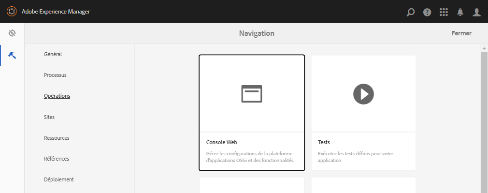
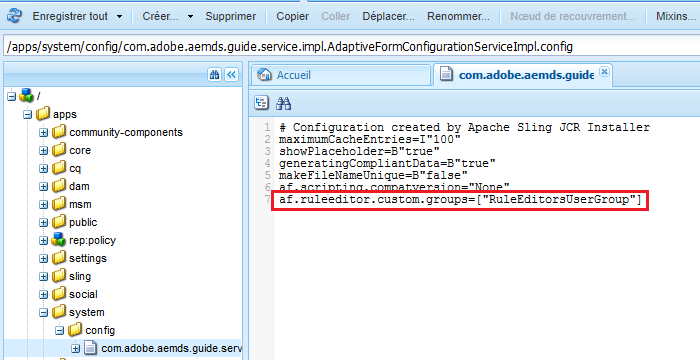

# Autorisation d’accès à l’éditeur de règles pour des groupes d’utilisateurs sélectionnés {#grant-rule-editor-access-to-select-user-groups}

## Présentation {#overview}

Plusieurs types d’utilisateurs dotés de différentes compétences peuvent utiliser les formulaires adaptatifs. Les utilisateurs expérimentés peuvent avoir les connaissances requises pour utiliser des scripts et des règles complexes. Toutefois, certains utilisateurs peu expérimentés doivent utiliser uniquement les propriétés de mise en page et de base des formulaires adaptatifs.

[!DNL Experience Manager Forms] vous permet de limiter l’accès de l’éditeur de règles aux utilisateurs en fonction de leur rôle ou fonction. Dans les paramètres du service de configuration des formulaires adaptatifs, vous pouvez spécifier les [groupes d’utilisateurs](forms-groups-privileges-tasks.md) qui pourront afficher l’éditeur de règles et y accéder.

## Spécification des groupes d’utilisateurs qui peuvent accéder à l’éditeur de règles {#specify-user-groups-that-can-access-rule-editor}

1. Connectez-vous à [!DNL Experience Manager Forms] en tant qu’administrateur.
1. Dans l’instance d’auteur, cliquez sur Adobe Experience Manager > Outils  > **[!UICONTROL Opérations]** > **[!UICONTROL Console Web]**. La console web s’ouvre dans une nouvelle fenêtre.

   

1. Dans la fenêtre de la [!UICONTROL console web], localisez le **[!UICONTROL service de configuration de formulaire adaptatif]** et cliquez dessus. La boîte de dialogue **[!UICONTROL Service de configuration de formulaire adaptatif]** s’affiche. Ne modifiez aucune valeur, puis cliquez sur **[!UICONTROL Enregistrer]**.

   Vous créez ainsi un fichier `/apps/system/config/com.adobe.aemds.guide.service.impl.AdaptiveFormConfigurationServiceImpl.config` dans le référentiel CRX.

1. Connectez-vous à CRXDE en tant qu’administrateur. Ouvrez le fichier `/apps/system/config/com.adobe.aemds.guide.service.impl.AdaptiveFormConfigurationServiceImpl.config` pour édition.
1. Utilisez la propriété suivante pour spécifier le nom d’un groupe pouvant accéder à l’éditeur de règles (par exemple, RuleEditorsUserGroup) et cliquez sur **[!UICONTROL Enregistrer tout]**.

   `af.ruleeditor.custom.groups=["RuleEditorsUserGroup"]`

   Pour autoriser l’accès à plusieurs groupes, spécifiez une liste de valeurs séparées par des virgules :

   `af.ruleeditor.custom.groups=["RuleEditorsUserGroup", "PermittedUserGroup"]`

   

   Maintenant, lorsqu’un utilisateur qui ne fait pas partie du groupe spécifié d’utilisateurs (ici `RuleEditorsUserGroup`) appuie sur un champ, l’icône d’édition de règles () n’est pas disponible dans la barre d’outils de composants :

   

   Barre d’outils de composants comme visible pour un utilisateur ayant un accès à l’éditeur de règles :

   

   Barre d’outils de composants comme visible pour un utilisateur sans accès à l’éditeur de règles

   Pour obtenir des instructions sur l’ajout d’utilisateurs aux groupes, voir [Administration et sécurité des utilisateurs](https://experienceleague.adobe.com/docs/experience-manager-65/administering/security/security.html?lang=fr).

