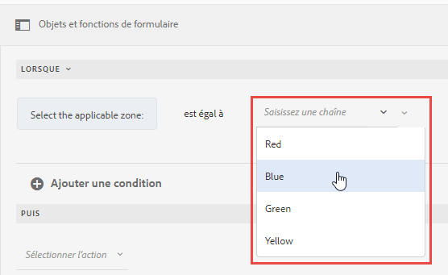
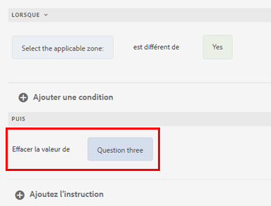
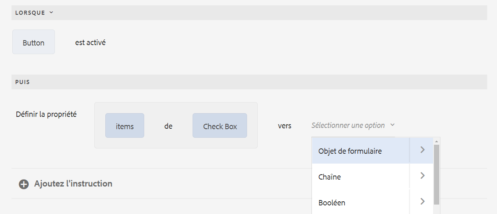
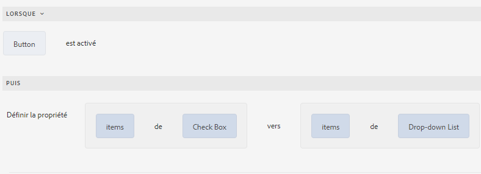
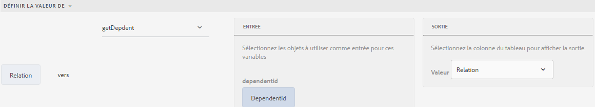
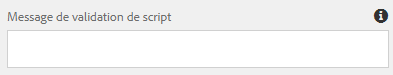
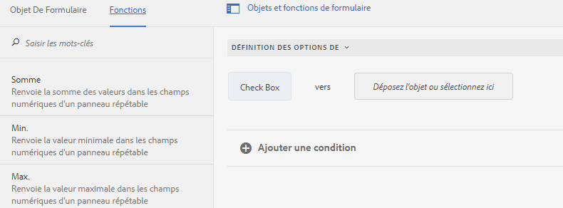
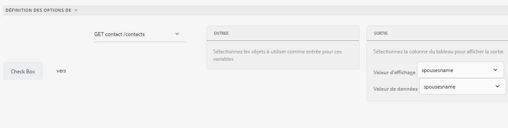

# Types d’opérateurs et événements dans l’éditeur de règles d’un formulaire adaptatif basé sur les composants principaux

Dans AEM Forms as a Cloud Service, l’éditeur de règles comprend différents types d’opérateurs et d’événements qui vous permettent de définir et d’exécuter facilement des conditions et des actions complexes.

Les types d’opérateurs disponibles dans l’éditeur de règles d’un formulaire adaptatif fournissent un cadre robuste pour la création de conditions précises. Ils vous permettent de manipuler les données, d’effectuer des calculs et de combiner plusieurs conditions de manière logique et cohérente. Que vous compariez des valeurs, effectuiez des opérations arithmétiques ou manipuliez des chaînes, ces opérateurs garantissent la flexibilité et la puissance de vos règles.

Les événements de l’éditeur de règles servent de déclencheurs pour activer vos règles. Ils définissent les actions spécifiques qui se produisent lorsque certaines conditions sont remplies. En utilisant différents types d’événements, vous pouvez automatiser les réponses à un large éventail de scénarios, par exemple, les interactions utilisateur, les heures planifiées, les modifications de données et les états du système. La possibilité de spécifier ces déclencheurs vous permet de créer des règles dynamiques et réactives adaptées à vos besoins.

En comprenant et en utilisant les types d’opérateur et d’événement disponibles, vous pouvez exploiter tout le potentiel de l’éditeur de règles, qui permet de créer des règles efficaces et performantes qui répondent à vos besoins et améliorent les fonctionnalités générales du système.

## Types d’opérateur et événements disponibles dans l’éditeur de règles {#available-operator-types-and-events-in-rule-editor}

L’éditeur de règles fournit les opérateurs logiques et les événements suivants à l’aide desquels vous pouvez créer des règles.

* **Est égal à** - Vérifie si un objet de formulaire correspond à une valeur spécifiée.
* **N’est pas égal à** - Vérifie si l’objet d’un formulaire ne correspond pas à une valeur spécifiée.
* **Commence par** - Vérifie si un objet de formulaire commence par une chaîne donnée.
* **Se termine par** - Vérifie si un objet de formulaire se termine par une chaîne spécifiée.
* **Contient** - Vérifie si l’objet d’un formulaire inclut une sous-chaîne spécifiée.
* **Ne contient pas** - Vérifie si l’objet d’un formulaire n’inclut pas une sous-chaîne spécifiée.
* **Est vide** - Vérifie si un objet de formulaire est vide ou non fourni.
* **N’est pas vide** - Vérifie si un objet de formulaire est présent et non vide.
* **A sélectionné** - Renvoie « true » lorsqu’un utilisateur sélectionne une option de case à cocher, de liste déroulante ou de bouton radio spécifique.
* **Est initialisé (événement)** - Renvoie la valeur True si un objet de formulaire est généré dans le navigateur.
* **Est modifié (événement)** - Renvoie « true » lorsqu’un utilisateur modifie la valeur ou la sélection d’un objet de formulaire.
* **Est cliqué (événement)** - Renvoie la valeur True si un utilisateur clique sur un objet de formulaire, par exemple un bouton. Un utilisateur peut [ajouter plusieurs conditions au clic sur le bouton](/help/forms/rule-editor-core-components-usecases.md#set-focus-to-another-panel-on-button-click-if-the-first-panel-is-valid).
* **Est valide** - Vérifie si un objet de formulaire répond aux critères de validation.
* **N’est pas valide** - Vérifie si un objet de formulaire ne répond pas aux critères de validation.

<!--
* **Navigation(event):** Returns true when the user clicks a navigation object. Navigation objects are used to move between panels. 
* **Step Completion(event):** Returns true when a step of a rule completes.
* **Successful Submission(event):** Returns true on successful submission of data to a form data model.
* **Error in Submission(event):**  Returns true on unsuccessful submission of data to a form data model. -->

### Types de règle disponibles dans l’éditeur de règles {#available-rule-types-in-rule-editor}

L’éditeur de règles fournit un ensemble de types de règle prédéfinis que vous pouvez utiliser pour créer des règles. Examinons en détail chaque type de règle. Pour plus d’informations sur l’écriture de règles dans l’éditeur de règles, voir [Écriture de règles](/help/forms/rule-editor-core-components-user-interface.md#write-rules).

#### [!UICONTROL Lorsque] {#whenruletype}

Le type de règle **[!UICONTROL Lorsque]** suit le concept de règle d’**action alternative de condition-action** ou parfois simplement le concept de **condition-action**. Dans ce type de règle, vous spécifiez d’abord une condition à évaluer, puis une action à déclencher si la condition est remplie (`True`). Lors de l’utilisation du type de règle Lorsque, vous pouvez utiliser plusieurs opérateurs ET et OU afin de créer des [expressions imbriquées](/help/forms/rule-editor-core-components-usecases.md#nested-expressions).

Avec le type de règle Lorsque, vous pouvez évaluer une condition sur un objet de formulaire et exécuter des actions sur un ou plusieurs objets.

En clair, un type de règle Lorsque standard est structuré comme suit :

`When on Object A:`

`(Condition 1 AND Condition 2 OR Condition 3) is TRUE;`

`Then, do the following:`

`Action 2 on Object B;`
`AND`
`Action 3 on Object C;`

`Else, do the following:`

`Action 2 on Object C;`

Lorsque vous avez un composant à valeurs multiples, comme des boutons radio ou une liste, les options sont récupérées automatiquement et mises à disposition du créateur de la règle lorsque vous créez une règle pour ce composant. Vous n’avez pas besoin de saisir à nouveau les valeurs de l’option.

Prenons l’exemple d’une liste comportant quatre options : rouge, bleu, vert et jaune. Lors de la création de la règle, les options (boutons radio) sont automatiquement récupérées et mises à la disposition du créateur de la règle comme suit :

Lorsque vous créez une règle Lorsque, vous pouvez déclencher l’action Effacer la valeur de. L’action Effacer la valeur d’efface la valeur de l’objet spécifié. L’option Effacer la valeur de dans l’instruction Lorsque permet de créer des conditions complexes comportant plusieurs champs. Vous pouvez ajouter l’instruction Else pour ajouter d’autres conditions

>[!NOTE]
>
> Lorsque le type de règle ne prend en charge que les instructions else à un seul niveau.

##### Plusieurs champs autorisés dans [!UICONTROL Lorsque] {#allowed-multiple-fields}

Dans la condition **Lorsque**, vous avez la possibilité d’ajouter d’autres champs à l’exception du champ auquel la règle est appliquée.

Par exemple, en utilisant le type de règle Lorsque, vous pouvez évaluer une condition sur différents objets de formulaire et effectuer l’action suivante :

Lorsque :

(Objet A Condition 1)

ET/OU

(Objet B Condition 2)

Procédez ensuite comme suit :

Action 1 sur l&#39;objet A

_

**Remarques concernant l’utilisation des champs multiples autorisés dans la fonction Lorsque la condition**

* Assurez-vous que le composant [principal) est défini sur la version 3.0.14 ou ultérieure](https://github.com/adobe/aem-core-forms-components) pour utiliser cette fonctionnalité dans l’éditeur de règles.
* Si des règles sont appliquées à différents champs dans la condition Lorsque, la règle se déclenche même si un seul de ces champs est modifié.
* Vous pouvez uniquement ajouter les plusieurs champs dans la condition **Lorsque** pour une règle **ET**. Cela n’est pas possible pour une règle **OR**.

>[!NOTE]
>
> Pour ajouter plusieurs conditions qui incluent un clic sur un bouton, assurez-vous que l’événement de clic sur le bouton est placé en tant que première condition. Par exemple, `When button is clicked AND text input equals '5'` est valide, alors que `When text input equals '5' AND button is clicked` n’est pas pris en charge.

<!--
* It is not possible to add multiple fields in the When condition while applying rules to a button.

##### To enable Allowed Multiple fields in When condition feature

Allowed Multiple fields in When condition feature is disabled by default. To enable this feature, add a custom property at the template policy:

1. Open the corresponding template associated with an Adaptive Form in the template editor.
1. Select the existing policy as **formcontainer-policy**.
1. Navigate to the **[!UICONTROL Structure]**  view and, from the **[!UICONTROL Allowed Components]** list, open the **[!UICONTROL Adaptive Forms Container]** policy.
1. Go to the **[!UICONTROL Custom Properties]** tab and to add a custom property, click **[!UICONTROL Add]**.
1. Specify the **Group Name** of your choice. For example, in our case, we added the group name as **allowedfeature**.
1. Add the **key** and **value** pair as follows:
   * key: fd:changeEventBehaviour
   * value: deps
1. Click **[!UICONTROL Done]**. -->

Si plusieurs champs autorisés de la fonctionnalité de condition Lorsque rencontrent des problèmes, suivez les étapes de dépannage comme suit :

1. Ouvrez le formulaire en mode d’édition.
1. Ouvrez l’explorateur de contenu, puis sélectionnez le composant **[!UICONTROL Conteneur de guide]** de votre formulaire adaptatif.
1. Cliquez sur l’icône des propriétés du conteneur de guide . La boîte de dialogue du conteneur de formulaires adaptatifs s’ouvre.
1. Cliquez sur Terminé et enregistrez à nouveau la boîte de dialogue.

**[!UICONTROL Masquer]** Masque l’objet spécifié.

**[!UICONTROL Afficher]** Affiche l’objet spécifié.

**[!UICONTROL Activer]** Active l’objet spécifié.

**[!UICONTROL Désactiver]** Désactive l’objet spécifié.

**[!UICONTROL Appel du service]** Appelle un service configuré dans un modèle de données de formulaire (FDM). Lorsque vous sélectionnez l’opération Appel du service, un champ s’affiche. Lorsque vous touchez le champ, il affiche tous les services configurés dans tous les modèles de données de formulaire de votre instance [!DNL Experience Manager]. Lorsque vous choisissez un service de modèle de données de formulaire, des champs supplémentaires dans lesquels vous pouvez mapper des objets de formulaire avec des paramètres d’entrée pour le service spécifié s’affichent. Vous pouvez mapper les paramètres de sortie par le biais de l’option de payload d’événement pour le service spécifié. Vous pouvez également créer des règles pour gérer les réponses de succès et d’échec de l’opération du service Invoquer à l’aide de l’éditeur de règles.

>[!NOTE]
>
> Pour en savoir plus sur le service Invoke, [cliquez ici](/help/forms/invoke-service-enhancements-rule-editor.md).

Consultez l’exemple de règle pour appeler les services de modèle de données de formulaire (FDM).

Outre le service de modèle de données de formulaire, vous pouvez spécifier une URL WSDL directe pour appeler un service web. Cependant, un service de modèle de données de formulaire possède de nombreux avantages et l’approche recommandée permettant d’appeler un service.

Pour plus d’informations sur la configuration des services dans le modèle de données de formulaire, voir [[!DNL Experience Manager Forms] Intégration de données](data-integration.md).

**[!UICONTROL Définir la valeur de]** Calcule et définit la valeur de l’objet spécifié. Vous pouvez définir la valeur de l’objet sur une chaîne, la valeur d’un autre objet, la valeur calculée à l’aide d’une expression ou d’une fonction mathématique, la valeur d’une propriété d’un objet ou la valeur de sortie d’un service de modèle de données de formulaire configuré. Lorsque vous sélectionnez l’option Service web, elle affiche tous les services configurés dans tous les modèles de données de formulaire de votre instance [!DNL Experience Manager]. Lorsque vous sélectionnez un service de modèle de données de formulaire, des champs supplémentaires s’affichent dans lesquels vous pouvez mapper des objets de formulaire à des paramètres d’entrée et de sortie pour le service spécifié.

Pour plus d’informations sur la configuration des services dans le modèle de données de formulaire, voir [[!DNL Experience Manager Forms] Intégration de données](data-integration.md).

Le type de règle **[!UICONTROL Définir la propriété]** permet de définir la valeur d’une propriété de l’objet spécifié en fonction d’une action de condition. Vous pouvez définir la propriété sur l’une des options suivantes :

* visible (booléen)
* label.value (chaîne)
* label.visible (booléen)
* description (chaîne)
* enabled (booléen)
* readOnly (booléen)
* required (booléen)
* screenReaderText (chaîne)
* valid (booléen)
* errorMessage (chaîne)
* default (nombre, chaîne, date)
* enumNames (chaîne[])
* chartType (chaîne)

Elle permet, par exemple, de définir des règles pour afficher la zone de texte lorsqu’un utilisateur clique sur un bouton. Vous pouvez utiliser une fonction personnalisée, un objet de formulaire, une propriété d’objet ou une sortie de service pour définir une règle.

Pour définir une règle basée sur une fonction personnalisée, sélectionnez **[!UICONTROL Sortie de fonction]** dans la liste déroulante, puis faites glisser et déposez une fonction personnalisée à partir de l’onglet **[!UICONTROL Fonctions]**. Si l’action de condition est remplie, la zone de saisie de texte est visible.

Pour définir une règle basée sur un objet de formulaire, sélectionnez **[!UICONTROL Objet de formulaire]** dans la liste déroulante, puis faites glisser et déposez un objet de formulaire à partir de l’onglet **[!UICONTROL Objets de formulaire]**. Si l’action de condition est remplie, la zone de saisie de texte est visible dans le formulaire adaptatif.

Une règle Définir la propriété basée sur une propriété d’objet permet de rendre la zone de saisie de texte visible dans un formulaire adaptatif en fonction d’une autre propriété d’objet incluse dans le formulaire adaptatif.

La figure suivante illustre un exemple d’activation dynamique de la case à cocher en fonction du masquage ou de l’affichage d’une zone de texte dans un formulaire adaptatif :

**[!UICONTROL Effacer la valeur de]** : efface la valeur de l’objet spécifié.

**[!UICONTROL Définir la cible d’action]**: définit la cible d’action sur l’objet spécifié.

**[!UICONTROL Envoyer le formulaire]** Envoie le formulaire.

**[!UICONTROL Réinitialiser]** Réinitialise le formulaire ou l’objet spécifié.

**[!UICONTROL Valider]** Valide le formulaire ou l’objet spécifié.

**[!UICONTROL Ajouter une instance]** : ajoute une instance de la ligne de panneau ou de tableau répétable spécifiée.

**[!UICONTROL Supprimer une instance]** : supprime une instance de la ligne de panneau ou de tableau répétable spécifiée.

**[!UICONTROL Sortie de fonction]** définit une règle basée sur des fonctions prédéfinies ou des fonctions personnalisées.

**[!UICONTROL Accéder à]** Accédez à d’autres ressources Forms adaptatives, d’autres ressources telles que des images ou des fragments de document ou une URL externe. <!-- For more information, see [Add button to the Interactive Communication](create-interactive-communication.md#addbuttontothewebchannel). -->

**[!UICONTROL Distribuer l’événement]** Déclenche des actions ou des comportements spécifiques en fonction de conditions ou d’événements prédéfinis.

#### [!UICONTROL Définir la valeur de] {#set-value-of}

Le type de règle **[!UICONTROL Définir la valeur de]** permet de définir la valeur d’un objet de formulaire selon que la condition spécifiée est remplie ou non. La valeur peut être définie sur la valeur d’un autre objet, d’une chaîne littérale, la valeur dérivée d’une expression ou d’une fonction mathématique, la valeur d’une propriété d’un autre objet ou la sortie d’un service de modèle de données de formulaire. De même, vous pouvez vérifier la condition d’un composant, d’une chaîne, d’une propriété ou les valeurs dérivées d’une fonction ou d’une expression mathématique.

Notez que le type de règle **Définir la valeur de** n’est pas disponible pour tous les objets de formulaire, comme les boutons de panneaux et de barres d’outils. Une règle Définir la valeur de standard possède la structure suivante :

Définissez la valeur de Objet A sur :

(Chaîne ABC) OU
(propriété d&#39;objet X de l&#39;objet C) OU
(valeur d’une fonction) OU
(valeur d’une expression mathématique) OU
(valeur de sortie d’un service de modèle de données);

Lorsque (facultatif) :

(Condition 1 ET Condition 2 ET Condition 3) est TRUE ;

L’exemple ci-après sélectionne la valeur de `Question2` en tant que `True` et définit la valeur de `Result` en tant que `correct`.

Exemple de règle Définir la valeur à l’aide du service de modèle de données de formulaire.

#### [!UICONTROL Afficher] {#show}

Le type de règle **[!UICONTROL Afficher]** permet de créer une règle pour afficher ou masquer un objet de formulaire selon qu’une condition est remplie ou non. Le type de règle Afficher déclenche également l’action Masquer au cas où la condition ne serait pas remplie ou renverrait `False`.

Une règle standard Afficher est structurée comme suit :

`Show Object A;`

`When:`

`(Condition 1 OR Condition 2 OR Condition 3) is TRUE;`

`Else:`

`Hide Object A;`

#### [!UICONTROL Masquer] {#hide}

De la même manière que pour le type de règle Afficher, vous pouvez utiliser le type de règle **[!UICONTROL Masquer]** pour afficher ou masquer un objet de formulaire selon qu’une condition est remplie ou non. Le type de règle Masquer déclenche également l’action Afficher au cas où la condition ne serait pas remplie ou renverrait `False`.

Une règle standard Masquer est structurée comme suit :

`Hide Object A;`

`When:`

`(Condition 1 AND Condition 2 AND Condition 3) is TRUE;`

`Else:`

`Show Object A;`

#### [!UICONTROL Activer] {#enable}

Le type de règle **[!UICONTROL Activer]** permet d’activer ou de désactiver un objet de formulaire selon qu’une condition est remplie ou non. Le type de règle Activer déclenche également l’action Désactiver au cas où la condition ne serait pas remplie ou renverrait `False`.

Une règle Activer standard est structurée comme suit :

`Enable Object A;`

`When:`

`(Condition 1 AND Condition 2 AND Condition 3) is TRUE;`

`Else:`

`Disable Object A;`

#### [!UICONTROL Désactiver] {#disable}

De la même manière que le type de règle Activer, le type de règle **[!UICONTROL Désactiver]** permet d’activer ou de désactiver un objet de formulaire selon qu’une condition est remplie ou non. Le type de règle Désactiver déclenche également l’action Activer au cas où la condition ne serait pas remplie ou renverrait `False`.

Une règle Désactiver standard est structurée comme suit :

`Disable Object A;`

`When:`

`(Condition 1 OR Condition 2 OR Condition 3) is TRUE;`

`Else:`

`Enable Object A;`

#### [!UICONTROL Valider] {#validate}

Le type de règle **[!UICONTROL Valider]** valide la valeur d’un champ à l’aide d’une expression. Par exemple, vous pouvez écrire une expression pour vérifier que la zone de texte servant à spécifier un nom ne contient ni caractères spéciaux ni chiffres.

Une règle Valider standard est structurée comme suit :

`Validate Object A;`

`Using:`

`(Expression 1 AND Expression 2 AND Expression 3) is TRUE;`

>[!NOTE]
>
>Si la valeur spécifiée n’est pas conforme à la règle Valider, vous pouvez afficher un message de validation à l’utilisateur ou utilisatrice. Vous pouvez spécifier le message dans le champ **[!UICONTROL Message de validation du script]** dans les propriétés de composant dans la barre latérale.

#### [!UICONTROL Naviguer dans les panneaux]

Le type de règle **[!UICONTROL Naviguer parmi les panneaux]** vous permet de déplacer la sélection entre différents panneaux d’un formulaire. Par exemple, vous pouvez créer une expression pour déplacer le focus vers le panneau suivant.

Une règle standard **Naviguer parmi les panneaux** pour déplacer la sélection vers le panneau suivant est structurée comme suit :

`Navigate among the panels`

`Shift focus to the next item Object A;`

`When:`

`(Condition 1 OR Condition 2 OR Condition 3) is TRUE;`

De même, vous pouvez écrire **Naviguer parmi les panneaux** règle pour déplacer la sélection vers le panneau précédent :

`Navigate among the panels`

`Shift focus to the previous item Object A;`

`When:`

`(Condition 1 OR Condition 2 OR Condition 3) is TRUE;`

Pour plus d’informations sur la création d’une règle pour naviguer dans un panneau, [cliquez ici](/help/forms/rule-editor-core-components-usecases.md#navigating-between-panels-using-buttons).

#### [!UICONTROL &#x200B; Appel de fonction asynchrone &#x200B;]

Il s’agit d’une fonctionnalité de version préliminaire accessible par le biais de notre [canal de version préliminaire](https://experienceleague.adobe.com/docs/experience-manager-cloud-service/content/release-notes/prerelease.html?lang=fr#new-features). 

Le type de règle **[!UICONTROL Appel de fonction asynchrone]** permet d’exécuter des fonctions asynchrones. Il vous permet de lancer un appel de fonction qui fonctionne indépendamment du thread d’exécution principal, ce qui permet à d’autres processus de continuer à s’exécuter sans attendre que la fonction asynchrone se termine.

Une règle d’appel de fonction asynchrone standard pour exécuter une fonction asynchrone est structurée comme suit :

`When:`

`(Condition 1 OR Condition 2 OR Condition 3) is TRUE;`

`Async Function call`

`[Callback Function];`

Pour plus d’informations sur l’utilisation de l’appel de fonction asynchrone dans l’éditeur visuel de règles, reportez-vous à l’article [&#x200B; Utilisation d’appels de fonction asynchrones dans l’éditeur de règles &#x200B;](/help/forms/using-async-funct-in-rule-editor.md).

<!--
### [!UICONTROL Set Options Of] {#setoptionsof}

The **[!UICONTROL Set Options Of]** rule type enables you to define rules to add check boxes dynamically to the Adaptive Form. You can use a Form Data Model or a custom function to define the rule.

To define a rule based on a custom function, select **[!UICONTROL Function Output]** from the drop-down list, and drag-and-drop a custom function from the **[!UICONTROL Functions]** tab. The number of checkboxes defined in the custom function are added to the Adaptive Form.

To create a custom function, see [custom functions in rule editor](#custom-functions).

To define a rule based on a form data model:

1. Select **[!UICONTROL Service Output]** from the drop-down list.
1. Select the data model object.
1. Select a data model object property from the **[!UICONTROL Display Value]** drop-down list. The number of checkboxes in the Adaptive Form is derived from the number of instances defined for that property in the database.
1. Select a data model object property from the **[!UICONTROL Save Value]** drop-down list.

 -->

## Étape suivante

Examinons maintenant divers [exemples d’éditeur de règles pour un formulaire adaptatif basé sur les composants principaux](/help/forms/rule-editor-core-components-usecases.md).

## Voir également

{{see-also-rule-editor}}
