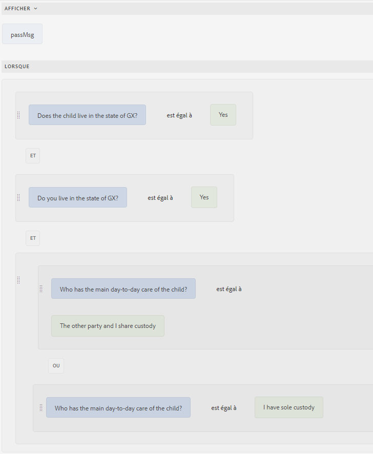
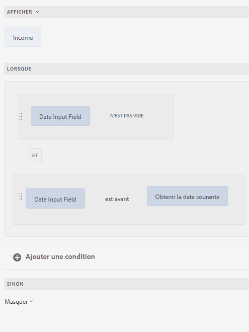
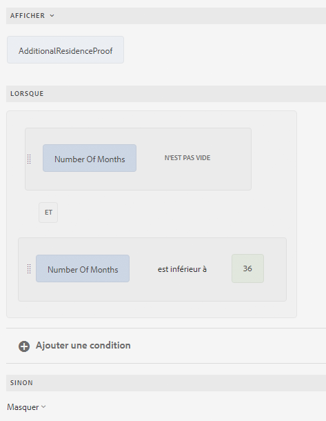
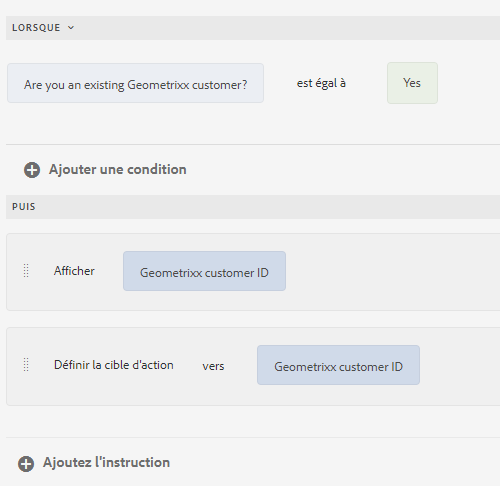
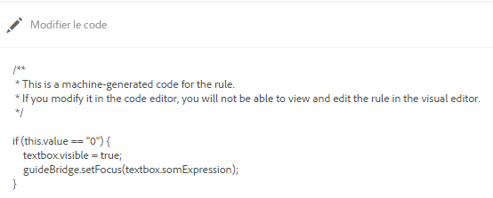
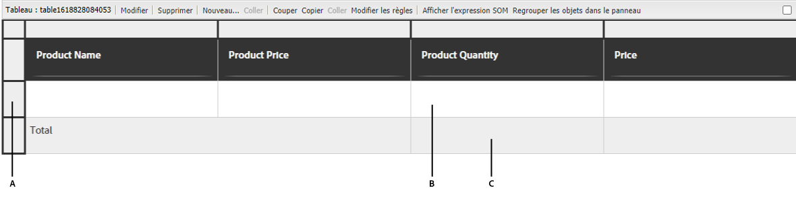
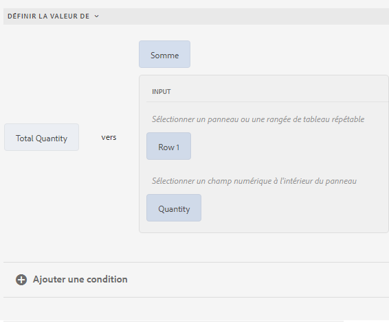
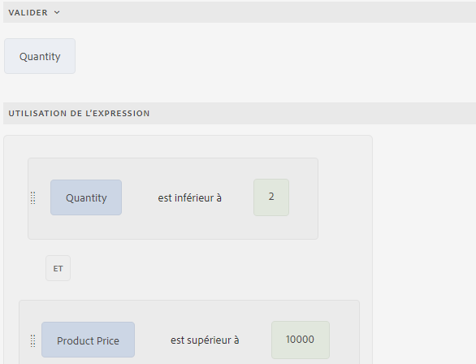

# Différents cas d’utilisation de l’éditeur de règles

L’article fournit des exemples détaillés d’un éditeur de règles pour un formulaire adaptatif basé sur des composants principaux, fournissant des informations sur son implémentation appropriée pour différents scénarios. L’éditeur de règles permet aux développeurs de définir et de gérer la logique contrôlant le comportement des formulaires.
Maintenant, discutons des différentes mises en oeuvre d’un éditeur de règles.

## Navigation entre les panneaux à l’aide du bouton

L’éditeur de règles vous permet d’ajouter des boutons de navigation à vos mises en page de panneau, tels que Onglets horizontaux, Onglets verticaux, Accordéons ou Assistant. Ces boutons améliorent l’expérience utilisateur en simplifiant les transitions entre les différents panneaux d’un formulaire, en déplaçant la sélection vers le panneau sélectionné.

Imaginez que vous interagissiez avec la section des paramètres de profil d’une application, où la navigation est facilitée par des boutons plutôt que par des onglets. Lors de la saisie des paramètres de profil à partir du tableau de bord principal, vous rencontrez une série de panneaux dédiés aux différents aspects de leur profil : **Informations personnelles**, **Sécurité du compte** et **Préférences de notification**.

Chaque panneau contient des champs et des options pertinents pour la mise à jour d’informations spécifiques. Les boutons de navigation, tels que `Next` et `Back`, sont placés en bonne place pour vous permettre de vous déplacer entre ces panneaux. Cliquez sur `Next` pour avancer l&#39;utilisateur vers le panneau **Sécurité du compte** et cliquez sur `Back` pour revenir au panneau **Informations personnelles**. Cette méthode de navigation garantit une transition transparente entre les sections sans perdre de contexte, offrant ainsi une expérience utilisateur fluide et intuitive. L&#39;utilisation des boutons de navigation simplifie le processus de gestion des paramètres de profil, ce qui rend l&#39;interaction plus organisée et conviviale.

Vous pouvez utiliser la règle `Navigate among the panels` pour créer des règles de navigation pour les boutons qui permettent de basculer entre différents panneaux.  Sélectionnez l’attribut `Shift focus to the next item` pour déplacer la mise au point vers le panneau suivant de la mise en page.

{width=50%}

Lorsque l’utilisateur clique sur le bouton `Next`, la mise en page se déplace vers le panneau suivant.

De même, vous pouvez créer une règle pour le bouton `Previous` afin de déplacer la sélection vers le panneau précédent.

{width=50%}

## Rationalisation de calculs complexes dans des panneaux répétables avec fonctions

L’éditeur de règles vous permet d’utiliser des fonctions prêtes à l’emploi telles que Somme, Min, Max et Joindre directement sur les champs des panneaux répétables. Vous pouvez également transmettre une valeur de champ de panneau répétable à la fonction qui accepte le tableau de nombres, le tableau de chaînes, le tableau booléen, etc. Cela permet de libérer une automatisation puissante, ce qui vous permet de mettre en oeuvre une logique commerciale complexe sans code personnalisé.

Imaginez un formulaire avec un panneau répétable, où chaque instance de panneau collecte des informations sur la valeur déclarée des ressources.

Vous pouvez utiliser la fonction `Sum` pour calculer automatiquement la valeur totale des ressources sur tous les panneaux, rendant ainsi inutile tout calcul manuel et réduisant le risque d’erreur.

Lorsque vous remplissez un formulaire, en ajoutant des instances pour déclarer les valeurs de la ressource, le bouton `Calculate Asset Value` calcule la somme totale de toutes les valeurs de la ressource déclarée et affiche le résultat dans la zone de texte `assetvalue`.

>[!NOTE]
>
> Si la valeur du champ de panneau répétable est transmise à une fonction qui n’accepte pas de tableau, la valeur du champ de la dernière instance du panneau répétable est transmise à la fonction .

Ce n&#39;est qu&#39;un exemple ! Explorez les [fonctions](#b-form-objects-and-functions-br) disponibles pour simplifier les processus et améliorer la précision des données dans vos formulaires.

## Expressions imbriquées {#nestedexpressions}

L’éditeur de règles vous permet d’utiliser plusieurs opérateurs ET et OU afin de créer des règles imbriquées. Vous pouvez mélanger plusieurs opérateurs ET et OU dans les règles.

Voici un exemple de règle imbriquée qui affiche un message à l’utilisateur concernant l’éligibilité à la garde d’un enfant lorsque les conditions requises sont remplies.

Vous pouvez également faire glisser et déposer des conditions dans une règle pour la modifier. Appuyez et passez le curseur sur la poignée () avant une condition. Une fois le pointeur affiché sous forme de main comme illustré ci-dessous, faites glisser la condition et déposez-la n’importe où dans la règle. La structure de la règle change.

## Conditions d’expression de date {#dateexpression}

L’éditeur de règles vous permet d’utiliser des comparaisons de dates afin de créer des conditions.

Vous trouverez ci-dessous un exemple de condition qui affiche un objet de texte statique si le prêt immobilier est déjà contracté, ce que l’utilisateur indique en remplissant le champ de date.

Lorsque la date du prêt hypothécaire de la propriété indiquée par l’utilisateur est déjà dépassée, le formulaire adaptatif affiche une remarque concernant le calcul des revenus. La règle ci-dessous compare la date indiquée par l’utilisateur à la date actuelle et si la date indiquée par l’utilisateur est antérieure à la date actuelle, le formulaire affiche le message texte (appelé « Revenu »).

Lorsque la date remplie est antérieure à la date actuelle, le formulaire affiche le message texte (Revenu), comme suit :

## Conditions de comparaison des nombres {#number-comparison-conditions}

L’éditeur de règles vous permet de créer des conditions qui comparent deux nombres.

Voici un exemple de condition, qui contient un objet de texte statique si le demandeur habite à l’adresse actuelle depuis moins de 36 mois.

Lorsque l’utilisateur indique qu’il habite à l’adresse résidentielle actuelle depuis moins de 36 mois, le formulaire affiche une notification indiquant qu’un justificatif de domicile supplémentaire peut être demandé.

<!-- ## Impact of rule editor on existing scripts {#impact-of-rule-editor-on-existing-scripts}

In [!DNL Experience Manager Forms] versions prior to [!DNL Experience Manager 6.1 Forms] feature pack 1, form authors and developers used to write expressions in the Scripts tab of the Edit component dialog to add dynamic behavior to Adaptive Forms. The Scripts tab is now replaced by the rule editor.

Any scripts or expressions that you must have written in the Scripts tab are available in the rule editor. While you cannot view or edit them in visual editor, if you are a part of the forms-power-users group you can edit scripts in code editor. -->

### Appeler service de modèle de données de formulaire {#invoke}

Imaginons un service Web `GetInterestRates` prenant le montant du prêt, la durée et la cote de solvabilité du demandeur comme valeurs d’entrée et renvoyant un plan de prêt incluant le montant des mensualités et le taux d’intérêt. Vous créez un modèle de données de formulaire (FDM) à l’aide du service Web comme source de données. Ajoutez des objets de modèle de données et un service `get` au modèle de formulaire. Le service apparaît dans l’onglet Services du modèle de données de formulaire (FDM). Ensuite, créez un formulaire adaptatif incluant des champs des objets de modèle de données pour capturer les données saisies par l’utilisateur pour le montant et la durée du prêt et la cote de solvabilité. Ajoutez un bouton qui demande au service Web d’extraire les détails du plan. La sortie est renseignée dans les champs appropriés.

La règle ci-dessous indique comment configurer l’action Appel du service pour accomplir l’exemple de scénario.

>[!NOTE]
>
>Si l’entrée est de type tableau, les champs qui prennent en charge les tableaux sont visibles dans la section déroulante Sortie.

### Déclenchement de plusieurs actions à l’aide de la règle Lorsque {#triggering-multiple-actions-using-the-when-rule}

Dans un formulaire de demande de prêt, vous voulez savoir si la personne demandant le prêt est un client ou une cliente existante ou non. Selon les informations fournies par l’utilisateur, le champ ID de client doit s’afficher ou se masquer. En outre, vous souhaitez placer le focus sur le champ d’ID de client ou cliente si l’utilisateur ou l’utilisatrice est un client ou une cliente existant. Le formulaire de demande de prêt est composé des éléments suivants :

* Un bouton radio,**[!UICONTROL Êtes-vous déjà client(e) chez Geometrixx ?]**, qui propose les options [!UICONTROL Oui] et [!UICONTROL Non]. La valeur Oui est **0** ; la valeur Non est **1**.

* Un champ de texte, **[!UICONTROL ID de client Geometrixx]**, pour indiquer l’ID du client/de la cliente.

Lorsque vous entrez une règle Lorsque sur le bouton radio pour implémenter ce comportement, la règle s’affiche comme suit dans l’éditeur de règles visuel.

Dans l’exemple de règle, l’instruction suivante dans la section Lorsque est la condition qui, si elle renvoie True, exécute les actions spécifiées dans la section Alors.

<!-- The rule appears as follows in the code editor.

 

Rule in the code editor -->

### Utilisation d’une sortie de fonction dans une règle {#using-a-function-output-in-a-rule}

Dans un formulaire de bon de commande, le tableau ci-dessous permet aux utilisateurs de saisir leurs commandes. Dans le tableau ci-dessous :

* La première ligne est répétable, de sorte que les utilisateurs et utilisatrices puissent commander plusieurs produits et spécifier différentes quantités. Son nom d’élément est `Row1`.
* Le titre de la cellule dans la colonne Quantité de produit de la ligne répétable est Quantité. Le nom de l’élément pour cette cellule est `productquantity`.
* La deuxième ligne du tableau est non répétable et le titre de la cellule de la colonne Quantité de produit de cette ligne est Quantité totale.

**A.** Ligne 1 **B.** Quantité **C.** Quantité totale

Maintenant, vous souhaitez ajouter des quantités spécifiées dans la colonne Quantité de produit pour tous les produits et afficher la somme dans la cellule Quantité totale. Vous pouvez obtenir ce résultat en saisissant une règle Définir la valeur de dans la cellule Quantité totale, comme indiqué ci-dessous.

### Validation d’une valeur de champ à l’aide d’une expression {#validating-a-field-value-using-expression}

Dans le formulaire de bon de commande décrit dans l’exemple précédent, vous souhaitez empêcher l’utilisateur de commander plusieurs quantités d’un produit dont le prix est supérieur à 10 000. À cet effet, vous pouvez créer une règle Valider, comme indiqué ci-dessous.

## Voir également

{{see-also-rule-editor}}
