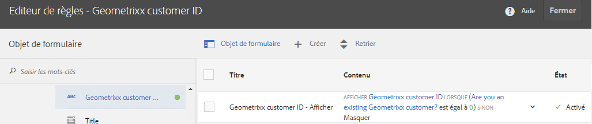
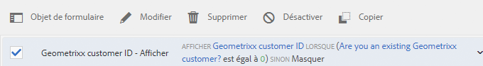

# Interface d’utilisation de l’éditeur de règles pour les formulaires adaptatifs basés sur les composants principaux

L’interface utilisateur de l’éditeur de règles pour le Forms adaptatif basé sur les composants principaux améliore le processus de création de formulaires dans Adobe Experience Manager (AEM). Il permet aux utilisateurs professionnels et aux développeurs d’implémenter un comportement dynamique et une logique complexe dans les formulaires en écrivant des règles qui déclenchent des actions en fonction de conditions prédéfinies, de saisies d’utilisateurs et d’interactions. Cette fonctionnalité prend en charge les fonctionnalités JavaScript modernes jusqu’à ES2022 et offre un éditeur visuel intuitif qui simplifie le processus de création de règles.
L’éditeur de règles joue un rôle essentiel dans la rationalisation du remplissage du formulaire, en garantissant à la fois précision et efficacité. Il permet la validation ou la réinitialisation des panneaux et des formulaires, ainsi que l’exécution de fonctions personnalisées pour calculer les valeurs des objets de formulaire. Grâce à sa prise en charge des conditions imbriquées et à la possibilité d’appeler les services de modèle de données de formulaire, l’interface utilisateur de l’éditeur de règles est un composant essentiel pour la création de formulaires réactifs, conviviaux et adaptatifs.

## Présentation de l’interface utilisateur de l’éditeur de règles {#understanding-the-rule-editor-user-interface}

L’éditeur de règles offre une interface utilisateur exhaustive et néanmoins simple, qui permet de créer et de gérer des règles. Vous pouvez lancer l’interface utilisateur de l’éditeur de règles à partir d’un formulaire adaptatif en mode Création.

Pour lancer l’interface utilisateur de l’éditeur de règles :

1. Ouvrez un formulaire adaptatif en mode Création.
1. Sélectionnez l’objet de formulaire pour lequel vous voulez créer une règle, puis  de la barre d’outils Composant. L’interface utilisateur de l’éditeur de règles s’affiche.

   

   Toutes les règles existantes pour les objets de formulaire sélectionnés sont répertoriées dans cet écran. Pour plus d’informations sur la gestion des règles existantes, voir [Gestion des règles](rule-editor.md#p-manage-rules-p).

1. Sélectionnez **[!UICONTROL Créer]** pour créer une règle. L’éditeur visuel de l’interface utilisateur de l’éditeur de règles s’affiche par défaut la première fois que vous lancez l’éditeur de règles.

   

Examinons en détail chaque composant de l’interface utilisateur de l’éditeur de règles.

### A. Affichage composant-règle {#a-component-rule-display}

Affiche le titre de l’objet de formulaire adaptatif à partir duquel vous avez lancé l’éditeur de règles et le type de règle actuellement sélectionné. Dans l’exemple ci-dessus, l’éditeur de règles est lancé à partir de l’objet de formulaire adaptatif intitulé Question 1 et le type de règle sélectionné est Lorsque.

### B. Objets de formulaire et fonctions {#b-form-objects-and-functions-br}

Le volet situé à gauche de l’interface utilisateur de l’éditeur de règles comporte deux onglets: **[!UICONTROL Objets de formulaire]** et **[!UICONTROL Fonctions]**.

L’onglet Objets de formulaire affiche une arborescence de tous les objets contenus dans le formulaire adaptatif. Il affiche le titre et le type des objets. Lors de la création d’une règle, vous pouvez faire glisser-déposer les objets de formulaire dans l’éditeur de règles. Lorsque vous créez ou modifiez une règle en faisant glisser et en déposant un objet ou une fonction dans un espace réservé, cet espace prend automatiquement le type de valeur approprié.

Les objets de formulaire contenant une ou plusieurs règles valides appliquées sont désignés par un point vert. Si l’une des règles appliquées à un objet de formulaire n’est pas valide, l’objet de formulaire est désigné par un point jaune.

L’onglet Fonctions comporte un jeu de fonctions intégrées, comme Somme de, Minimum de, Maximum de, Moyenne de, Nombre de et Valider le formulaire. Vous pouvez utiliser ces fonctions pour calculer des valeurs dans les panneaux et les lignes de tableau répétables et pour les instructions d’action et de condition lors de la création de règles. Cependant, vous pouvez également créer des fonctions personnalisées.

Certaines fonctions de la liste sont affichées dans la figure :


>[!NOTE]
>
>Vous pouvez effectuer une recherche de texte dans les noms et titres des objets et des fonctions à partir des onglets Objets et Fonctions de Forms.

Dans l’arborescence de gauche des objets de formulaire, vous pouvez sélectionner les objets de formulaire pour afficher les règles appliquées à chacun des objets. Vous pouvez non seulement parcourir les règles des différents objets de formulaire mais également copier-coller des règles entre les objets du formulaire. Pour plus d’informations, reportez-vous à la section [Règles de copier-coller](rule-editor.md#p-copy-paste-rules-p).

### C. Basculement entre les objets de formulaire et les fonctions {#c-form-objects-and-functions-toggle-br}

Le bouton Basculer, lorsqu’il est sélectionné, permet de basculer entre le volet des objets de formulaire et celui des fonctions.

### D. Éditeur de règles visuel {#visual-rule-editor}

Lorsque l’interface utilisateur de l’éditeur de règles est en mode éditeur visuel, l’éditeur de règles visuel est la zone dans laquelle vous créez des règles. Il vous permet de sélectionner un type de règle et de définir en conséquence des conditions et des actions. Lors de la définition des conditions et des actions dans une règle, vous pouvez glisser-déposer des objets de formulaire et des fonctions depuis le volet Objets de formulaire et Fonctions.

Pour plus d’informations sur l’utilisation d’un éditeur de règles visuel, voir [Création de règles](rule-editor.md#p-write-rules-p).
<!-- 
### E. Visual-code editors switcher {#e-visual-code-editors-switcher}

Users in the forms-power-users group can access code editor. For other users, code editor is not available. If you have the rights, you can switch from visual editor mode to code editor mode of the rule editor, and conversely, using the switcher right above the rule editor. When you launch rule editor the first time, it opens in the visual editor mode. You can write rules in the visual editor mode or switch to the code editor mode to write a rule script. However, note that if you modify a rule or write a rule in code editor, you cannot switch back to the visual editor for that rule unless you clear the code editor.

[!DNL Experience Manager Forms] tracks the rule editor mode you used last to write a rule. When you launch the rule editor next time, it opens in that mode. However, you can also configure a default mode to open the rule editor in the specified mode. To do so:

1. Go to [!DNL Experience Manager] web console at `https://[host]:[port]/system/console/configMgr`.
1. Click to edit **[!UICONTROL Adaptive Form Configuration Service]**.
1. choose **[!UICONTROL Visual Editor]** or **[!UICONTROL Code Editor]** from the **[!UICONTROL Default Mode for Rule Editor]** drop-down

1. Click **[!UICONTROL Save]**.
-->

### E. Boutons Terminé et Annuler {#done-and-cancel-buttons}

Le bouton **[!UICONTROL Terminé]** permet d’enregistrer une règle. Vous pouvez enregistrer une règle incomplète. Toutefois, les règles incomplètes ne sont pas valides et ne s’exécutent pas. Les règles enregistrées sur un objet de formulaire sont répertoriées lorsque vous lancez l’éditeur de règles la prochaine fois à partir du même objet de formulaire. Vous pouvez gérer des règles existantes dans cette vue. Pour plus d’informations, consultez la section [Gérer les règles](rule-editor.md#p-manage-rules-p).

Le bouton **[!UICONTROL Annuler]** annule toutes les modifications que vous avez apportées à une règle et ferme l’éditeur de règles.

## Règles d’écriture {#write-rules}

Vous pouvez écrire des règles à l’aide de l’éditeur de règles visuel <!-- or the code editor. When you launch the rule editor the first time, it opens in the visual editor mode. You can switch to the code editor mode and write rules. However, if you write or modify a rule in code editor, you cannot switch to the visual editor for that rule unless you clear the code editor. When you launch the rule editor next time, it opens in the mode that you used last to create rule. -->.

Examinons d’abord comment écrire des règles à l’aide d’un éditeur visuel.

+++ Utilisation des {#using-visual-editor} de l’éditeur visuel

Examinons comment créer une règle dans un éditeur visuel à l’aide de l’exemple de formulaire suivant.


La section Conditions de prêt dans l’exemple de formulaire de demande de prêt requiert des demandeurs et demandeuses de spécifier leur état civil, leur salaire et, si ils ou elles sont marié(e)s, le salaire de leur conjoint(e). D’après les entrées de l’utilisateur ou utilisatrice, la règle permet de calculer le montant d’éligibilité du prêt et l’affiche dans le champ Éligibilité de prêt. Appliquez les règles suivantes pour mettre en œuvre le scénario :

* Le champ Salaire de l’époux ou de l’épouse s’affiche uniquement lorsque la valeur État civil est Marié ou Mariée.
* Le montant d’éligibilité de prêt représente 50 % du salaire total.

Pour créer des règles :

1. Tout d’abord, créez la règle pour contrôler la visibilité du champ Salaire du conjoint en fonction de l’option que l’utilisateur sélectionne pour le bouton radio État civil.

   Ouvrez le formulaire de demande de prêt en mode Création. Sélectionnez le composant **[!UICONTROL État civil]** et choisissez . Ensuite, sélectionnez **[!UICONTROL Créer]** pour lancer l’éditeur de règles.

   

   Lorsque vous lancez l’éditeur de règles, la règle Lorsque est sélectionnée par défaut. En outre, l’objet de formulaire (dans ce cas, État civil) d’où vous avez lancé l’éditeur de règles est spécifié dans l’instruction Lorsque.

   Bien que vous ne puissiez pas changer ou modifier l’objet sélectionné, vous pouvez utiliser la liste déroulante de règles, comme indiqué ci-dessous, pour sélectionner un autre type de règle. Si vous souhaitez créer une règle sur un autre objet, sélectionnez Annuler pour quitter l’éditeur de règles et relancez-le depuis l’objet de formulaire de votre choix.

1. Sélectionnez le menu déroulant **[!UICONTROL Sélectionner l’état]** et choisissez **[!UICONTROL est égal à]**. Le champ **[!UICONTROL Saisissez une chaîne]** s’affiche.

   

1. Dans le champ **[!UICONTROL Saisissez une chaîne]** de la règle, sélectionnez **Marié(e)** dans le menu déroulant.

   

   Vous avez défini la condition comme `When Marital Status is equal to Married`. Définissez ensuite l’action à effectuer si cette condition est True.

1. Dans l’instruction Alors, sélectionnez **[!UICONTROL Afficher]** dans le menu déroulant **[!UICONTROL Sélectionner une action]**.

   

1. Faites glisser et déposez le champ **[!UICONTROL Salaire du conjoint ou de la conjointe]** de l’onglet Objets de formulaire vers le champ **[!UICONTROL Déposez l’objet ou sélectionnez ici]**. Vous pouvez également sélectionner le champ **[!UICONTROL Déposer l’objet ou sélectionner ici]**, puis le champ **[!UICONTROL Salaire du conjoint ou de la conjointe]** dans le menu contextuel, qui répertorie tous les objets de formulaire dans le formulaire.

   

   Définissez ensuite l’action à effectuer si cette condition est False.
1. Cliquez sur **[!UICONTROL Ajouter une section Else]** pour ajouter une autre condition pour le champ **[!UICONTROL Salaire du conjoint ou de la conjointe]**, au cas où vous sélectionneriez célibataire pour État civil.

   


1. Dans l’instruction Else, choisissez **[!UICONTROL Masquer]** dans le menu déroulant **[!UICONTROL Sélectionner l’action]**.
   

1. Faites glisser et déposez le champ **[!UICONTROL Salaire du conjoint ou de la conjointe]** de l’onglet Objets de formulaire vers le champ **[!UICONTROL Déposez l’objet ou sélectionnez ici]**. Vous pouvez également sélectionner le champ **[!UICONTROL Déposer l’objet ou sélectionner ici]**, puis le champ **[!UICONTROL Salaire du conjoint ou de la conjointe]** dans le menu contextuel, qui répertorie tous les objets de formulaire dans le formulaire.
   

   La règle s’affiche comme suit dans l’éditeur de règles.

   

1. Cliquez sur **[!UICONTROL Terminé]** pour enregistrer la règle.

<!--
1. Repeat steps 1 through 5 to define another rule to hide the Spouse Salary field if the marital Status is Single. The rule appears as follows in the rule editor.

    -->

>[!NOTE]
>
> Vous pouvez également créer une règle Afficher dans le champ Salaire du conjoint ou de la conjointe, au lieu de deux règles Lorsque dans le champ État civil pour mettre en œuvre le même comportement.


1. Ensuite, créez une règle pour calculer le niveau d’éligibilité de prêt, à hauteur de 50 % du salaire total, puis affichez-la dans le champ Éligibilité de prêt. Pour obtenir ce résultat, créez des règles **[!UICONTROL Définir la valeur de]** dans le champ Éligibilité de prêt.

   En mode Création, sélectionnez le champ **[!UICONTROL Éligibilité de prêt]**, puis . Ensuite, sélectionnez **[!UICONTROL Créer]** pour lancer l’éditeur de règles.

1. Sélectionnez la règle **[!UICONTROL Définir la valeur de]** dans la liste déroulante des règles.

   

1. Choisissez **[!UICONTROL Sélectionner l’option]** et sélectionnez **[!UICONTROL Expression mathématique]**. Un champ permettant de saisir l’expression mathématique s’ouvre.

   

1. Dans le champ d&#39;expression :

   * Sélectionnez ou faites glisser et déposez le champ **[!UICONTROL Salaire]**, de l’onglet Objet de formulaire vers le premier champ **[!UICONTROL Déposez l’objet ou sélectionnez ici]**.

   * Sélectionnez **[!UICONTROL Plus]** dans le champ **[!UICONTROL Sélectionner un opérateur]**.

   * Sélectionnez ou faites glisser et déposez depuis le champ **[!UICONTROL Salaire du conjoint]** de l’onglet Objets de formulaire vers l’autre champ **[!UICONTROL Déposez l’objet ou sélectionnez ici]**.

   

1. Ensuite, sélectionnez la zone en surbrillance autour du champ Expression et choisissez **[!UICONTROL Étendre l’expression]**.

   

   Dans le champ d’expression étendue, sélectionnez **[!UICONTROL divisé par]** dans le champ **[!UICONTROL Sélectionner un opérateur]** et **[!UICONTROL Nombre]** dans le champ **[!UICONTROL Sélectionner une option]**. Ensuite, spécifiez **[!UICONTROL 2]** dans le champ Nombre.

   

   >[!NOTE]
   >
   >Vous pouvez créer des expressions complexes à l’aide de composants, fonctions, expressions mathématiques et valeurs de propriété dans le champ Sélectionner une option.

   Créez ensuite une condition qui, lorsqu’elle renvoie True, permet que l’expression s’exécute.

1. Sélectionnez **[!UICONTROL Ajouter une condition]** pour ajouter une instruction Lorsque.

   

   Dans l’instruction Lorsque :

   * Sélectionnez ou glissez-déposez depuis l’onglet Objets de formulaire le champ **[!UICONTROL État civil]** dans le premier champ **[!UICONTROL Déposez l’objet ou sélectionnez ici]**.

   * Sélectionnez **[!UICONTROL est égal à]** dans le champ **[!UICONTROL Sélectionner un opérateur]**.

   * Sélectionnez Chaîne dans l’autre champ **[!UICONTROL Déposez l’objet ou sélectionnez ici]** et spécifiez **[!UICONTROL Marié(e)]** dans le champ **[!UICONTROL Saisissez la chaîne]**.

   Enfin, la règle s’affiche comme suit dans l’éditeur de règles. 

1. Sélectionnez **[!UICONTROL Terminé]**. La règle est enregistrée.

1. Répétez les étapes 7 à 14 pour définir une autre règle pour calculer le montant d’éligibilité si la valeur d’état civil est Célibataire. La règle s’affiche comme suit dans l’éditeur de règles.

   

Vous pouvez également utiliser la règle Définir la valeur de pour calculer l’éligibilité de prêt dans la règle Lorsque que vous avez créée pour afficher ou masquer le champ Salaire du conjoint. La règle combinée résultante, lorsque l’état civil est Célibataire, s’affiche comme suit dans l’éditeur de règles.


De même, vous pouvez écrire une règle combinée pour contrôler la visibilité du champ Salaire du conjoint ou de la conjointe lorsque la valeur d’état civil est Marié ou mariée à l’aide de la condition Else.


+++


<!-- ### Using code editor {#using-code-editor}

Users added to the forms-power-users group can use code editor. The rule editor auto generates the JavaScript code for any rule you create using visual editor. You can switch from visual editor to the code editor to view the generated code. However, if you modify the rule code in the code editor, you cannot switch back to the visual editor. If you prefer writing rules in code editor rather than visual editor, you can write rules afresh in the code editor. The visual-code editors switcher helps you switch between the two modes.

The code editor JavaScript is the expression language of Adaptive Forms. All the expressions are valid JavaScript expressions and use Adaptive Forms scripting model APIs. These expressions return values of certain types. For the complete list of Adaptive Forms classes, events, objects, and public APIs, see [JavaScript Library API reference for Adaptive Forms](https://helpx.adobe.com/fr/experience-manager/6-5/forms/javascript-api/index.html).

For more information about guidelines to write rules in the code editor, see [Adaptive Form Expressions](adaptive-form-expressions.md).

While writing JavaScript code in the rule editor, the following visual cues help you with the structure and syntax:

* Syntax highlights

* Auto Indentation

* Hints and suggestions for Form objects, functions, and their properties

* Auto completion of form component names and common JavaScript functions


-->

### Fonctions personnalisées dans l’éditeur de règles {#custom-functions}

Outre les fonctions prêtes à l’emploi, comme *Somme de*, qui sont répertoriées sous **Sortie de fonction**, vous pouvez également utiliser des fonctions personnalisées dans l’éditeur de règles L’éditeur de règles prend en charge la syntaxe JavaScript ECMASScript 2019 pour les scripts et les fonctions personnalisées. Pour plus d’informations sur la création de fonctions personnalisées, consultez l’article [Fonctions personnalisées dans les formulaires adaptatifs](/help/forms/create-and-use-custom-functions.md).

<!--

Ensure that the function you write is accompanied by the `jsdoc` above it. Adaptive Form supports the various [JavaScript annotations for custom functions](/help/forms/create-and-use-custom-functions.md#js-annotations).

For more information, see [jsdoc.app](https://jsdoc.app/).

Accompanying `jsdoc` is required:

* If you want custom configuration and description
* Because there are multiple ways to declare a function in `JavaScript,` and comments let you keep a track of the functions.

Supported `jsdoc` tags:

* **Private**
  Syntax: `@private`
  A private function is not included as a custom function.

* **Name**
  Syntax: `@name funcName <Function Name>`
  Alternatively `,` you can use: `@function funcName <Function Name>` **or** `@func` `funcName <Function Name>`.
  `funcName` is the name of the function (no spaces allowed).
  `<Function Name>` is the display name of the function.

* **Parameter**
  Syntax: `@param {type} name <Parameter Description>`
  Alternatively, you can use: `@argument` `{type} name <Parameter Description>` **or** `@arg` `{type}` `name <Parameter Description>`.
  Shows parameters used by the function. A function can have multiple parameter tags, one tag for each parameter in the order of occurrence.
  `{type}` represents parameter type. Allowed parameter types are:

    1. string
    2. number
    3. boolean
    4. scope
    5. string[]
    6. number[]
    7. boolean[]
    8. date
    9. date[]
    10. array
    11. object

   `scope` refers to a special globals object which is provided by forms runtime. It must be the last parameter and is not be visible to the user in the rule editor. You can use scope to access readable form and field proxy object to read properties, event which triggered the rule and a set of functions to manipulate the form.

   `object` type is used to pass readable field object in parameter to a custom function instead of passing the value.

   All parameter types are categorized under one of the above. None is not supported. Ensure that you select one of the types above. Types are not case-sensitive. Spaces are not allowed in the parameter name.  Parameter description can have multiple words.

* **Optional Parameter**
Syntax: `@param {type=} name <Parameter Description>` 
Alternatively, you can use: `@param {type} [name] <Parameter Description>`
By default all parameters are mandatory. You can mark a parameter optional by adding `=` in type of the parameter or by putting param name in square brackets.
   
   For example, let us declare `Input1` as optional parameter:
    * `@param {type=} Input1`
    * `@param {type} [Input1]`

* **Return Type**
  Syntax: `@return {type}`
  Alternatively, you can use `@returns {type}`.
  Adds information about the function, such as its objective.
  {type} represents the return type of the function. Allowed return types are:

    1. string
    2. number
    3. boolean
    4. string[]
    5. number[]
    6. boolean[]
    7. date
    8. date[]
    9. array
    10. object

  All other return types are categorized under one of the above. None is not supported. Ensure that you select one of the types above. Return types are not case-sensitive.

**Adding a custom function**

For example, you want to add a custom function which calculates area of a square. Side length is the user input to the custom function, which is accepted using a numeric box in your form. The calculated output is displayed in another numeric box in your form. To add a custom function, you have to first create a client library, and then add it to the CRX repository.

To create a client library and add it in the CRX repository, perform the following steps:

1. Create a client library. For more information, see [Using Client-Side Libraries](https://experienceleague.adobe.com/docs/experience-manager-cloud-service/implementing/developing/full-stack/clientlibs.html?lang=fr#developing).
2. In CRXDE, add a property `categories`with string type value as `customfunction` to the `clientlib` folder.

   >[!NOTE]
   >
   >`customfunction`is an example category. You can choose any name for the category you create in the `clientlib`folder.

After you have added your client library in the CRX repository, use it in your Adaptive Form. It lets you use your custom function as a rule in your form. To add the client library in your Adaptive Form, perform the following steps:

1. Open your form in edit mode.
   To open a form in edit mode, select a form and select **[!UICONTROL Open]**.
1. In the edit mode, select a component, then select  &gt; **[!UICONTROL Adaptive Form Container]**, and then select .
1. In the sidebar, under Name of Client Library, add your client library. ( `customfunction` in the example.)

   

1. Select the input numeric box, and select  to open the rule editor.
1. Select **[!UICONTROL Create Rule]**. Using options shown below, create a rule to save the squared value of the input in the Output field of your form.

   [](assets/add-custom-rule.png)
  
1. Select **[!UICONTROL Done]**. Your custom function is added.

   >[!NOTE]
   >
   > To invoke a form data model from rule editor using custom functions, [see here](/help/forms/using-form-data-model.md#invoke-services-in-adaptive-forms-using-rules-invoke-services). 

#### Function declaration supported types {#function-declaration-supported-types}

**Function Statement**

```javascript
function area(len) {
    return len*len;
}
```

This function is included without `jsdoc` comments.

**Function Expression**

```javascript
var area;
//Some codes later
/** */
area = function(len) {
    return len*len;
};
```

**Function Expression and Statement**

```javascript
var b={};
/** */
b.area = function(len) {
    return len*len;
}
```

**Function Declaration as Variable**

```javascript
/** */
var x1,
    area = function(len) {
        return len*len;
    },
    x2 =5, x3 =true;
```

Limitation: custom function picks only the first function declaration from the variable list, if together. You can use function expression for every function declared.

**Function Declaration as Object**

```javascript
var c = {
    b : {
        /** */
        area : function(len) {
            return len*len;
        }
    }
};
```

>[!NOTE]
>
>Ensure that you use `jsdoc` for every custom function. Although `jsdoc`comments are encouraged, include an empty `jsdoc`comment to mark your function as custom function. It enables default handling of your custom function.
-->

## Gestion des règles {#manage-rules}

Les règles existantes sur un objet de formulaire sont répertoriées lorsque vous sélectionnez l’objet et . Vous pouvez afficher le titre et un aperçu du résumé de la règle. En outre, l’interface utilisateur vous permet de développer et d’afficher le résumé complet d’une règle, de changer l’ordre des règles, de les modifier et de les supprimer.


Vous pouvez effectuer les actions suivantes sur les règles :

* **Développer/Réduire** : la colonne Contenu dans la liste des règles affiche le contenu des règles. Si le contenu entier des règles n’est pas visible dans l’affichage par défaut, sélectionnez  pour le développer.

* **Réorganiser** : toute nouvelle règle que vous créez est empilée au bas de la liste des règles. Les règles sont exécutées de haut en bas. La règle en haut s’exécute en premier, suivie des autres règles du même type. Par exemple, si vous avez les règles Lorsque, Afficher, Activer et Lorsque à la première, deuxième, troisième et quatrième position du haut, respectivement, la règle Lorsque en haut est exécutée en premier, suivie de la règle Lorsque à la quatrième position. Ensuite, les règles Afficher et Activer seront exécutées.
Vous pouvez modifier l’ordre d’une règle en appuyant sur  en regard ou la faire glisser et la déposer dans l’ordre souhaité dans la liste.

* **Modifier** : pour modifier une règle, cochez la case située en regard du titre de la règle. Les options de modification et de suppression de la règle s’affichent. Sélectionnez **[!UICONTROL Modifier]** pour ouvrir la règle sélectionnée dans l’éditeur de règles.

* **Supprimer** : pour supprimer une règle, sélectionnez-la puis choisissez **[!UICONTROL Supprimer]**.

* **Activer/désactiver** : lorsque vous devez suspendre temporairement l’utilisation d’une règle, vous pouvez sélectionner une ou plusieurs règles et appuyer sur **[!UICONTROL Désactiver]** dans la barre d’outils Actions pour les désactiver. Si une règle est désactivée, elle ne s’exécute pas lors de l’exécution. Pour activer une règle désactivée, vous pouvez la sélectionner puis choisir Activer dans la barre d’outils Actions. La colonne de statut de la règle indique si la règle est activée ou désactivée.


## Règles de copier-coller {#copy-paste-rules}

Vous pouvez copier-coller une règle d’un champ à d’autres champs similaires pour gagner du temps.

Pour copier-coller des règles, procédez comme suit :

1. Sélectionnez l’objet de formulaire à partir duquel vous souhaitez copier une règle puis, dans la barre d’outils des composants, sélectionnez . L’interface utilisateur de l’éditeur de règles s’affiche avec l’objet de formulaire sélectionné, et les règles existantes s’affichent.

   

   Pour plus d’informations sur la gestion des règles existantes, voir [Gestion des règles](rule-editor.md#p-manage-rules-p).

1. Cochez la case en regard du titre de la règle pour afficher les options de gestion de la règle. Sélectionnez **[!UICONTROL Copie]**.

   

1. Sélectionnez un autre objet de formulaire dans lequel vous souhaitez coller la règle et choisissez **[!UICONTROL Coller]**. De plus, vous pouvez modifier la règle pour y apporter des modifications.

   >[!NOTE]
   >
   >Vous pouvez coller une règle dans un autre objet de formulaire uniquement si cet objet de formulaire prend en charge les événement de la règle copiée. Par exemple, un bouton prend en charge l’événement Cliquer. Vous pouvez coller une règle avec un événement Cliquer sur un bouton mais pas dans une case à cocher.

1. Sélectionnez **[!UICONTROL Terminé]** pour enregistrer la règle.

## Étape suivante

Pour comprendre les différents types d’opérateur et événements dans l’éditeur de règles d’un formulaire adaptatif, reportez-vous à l’article [Types d’opérateur et événements disponibles dans l’éditeur de règles d’un formulaire adaptatif](/help/forms/rule-editor-core-components-events-operators.md).


## Voir également

{{see-also-rule-editor}}
