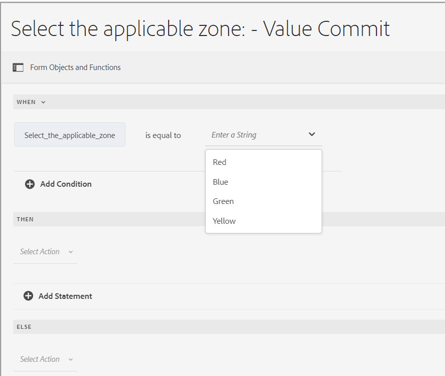
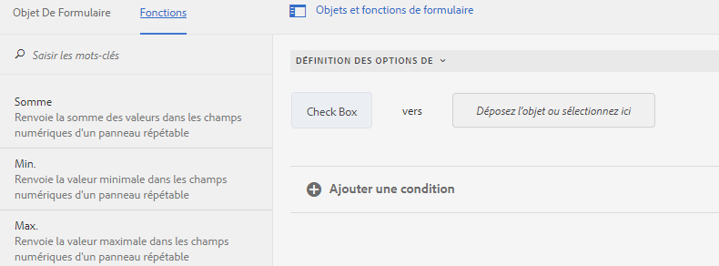
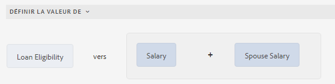
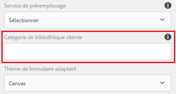
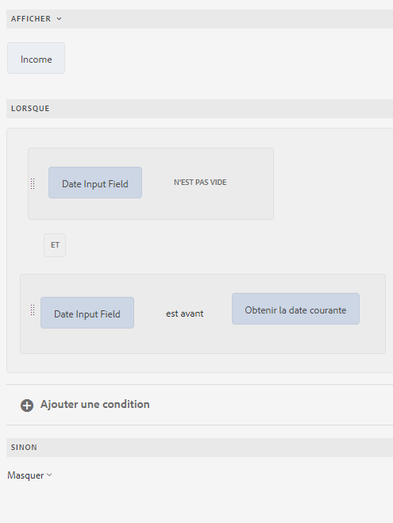
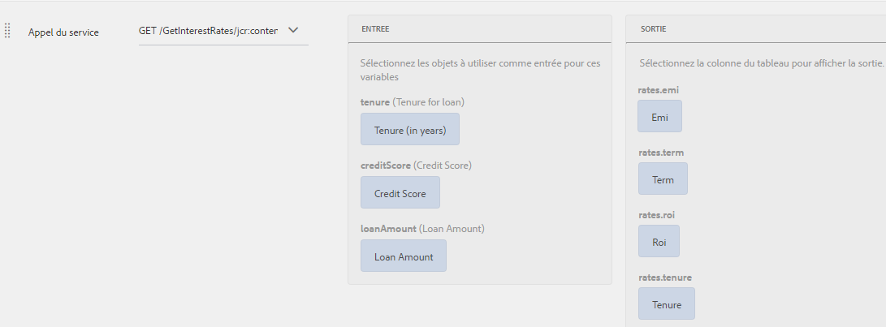
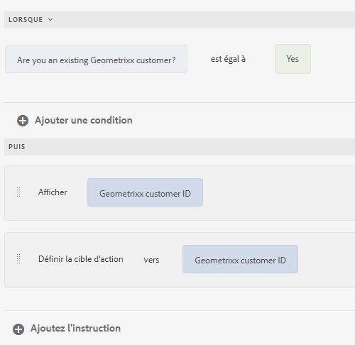
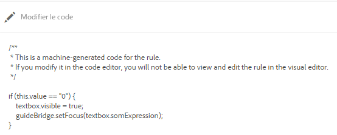
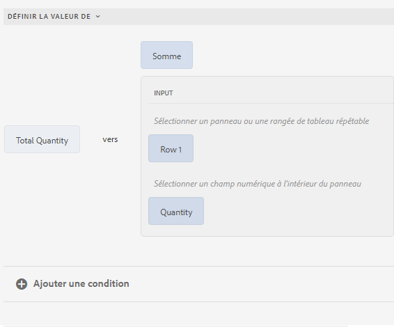

<span class="preview"> Cet article contient du contenu pour certaines fonctionnalités de version anticipée. Ces fonctions de préversion sont accessibles uniquement via notre [canal de version préliminaire](https://experienceleague.adobe.com/docs/experience-manager-cloud-service/content/release-notes/prerelease.html#new-features). Les fonctionnalités du programme de version préliminaire sont les suivantes :
* Prise en charge de l’implémentation de conditions imbriquées avec la fonctionnalité Lorsque-alors-autre
* Validation ou réinitialisation des panneaux et des formulaires, y compris les champs
* Prise en charge des fonctionnalités JavaScript modernes telles que les fonctions de gauche et de flèche (prise en charge d’ES10) dans les fonctions personnalisées.
</span>

# Ajout de règles à un formulaire adaptatif (composants principaux) {#adaptive-forms-rule-editor}

La fonctionnalité d’éditeur de règles permet aux utilisateurs professionnels et aux développeurs de formulaires de créer des règles sur des objets de formulaire adaptatif. Ces règles déterminent les actions à déclencher sur des objets de formulaire en fonction des conditions prédéfinies, des entrées de l’utilisateur et des actions de l’utilisateur sur le formulaire. Cela permet de rationaliser davantage l’expérience de remplissage du formulaire en assurant précision et vitesse.

L’éditeur de règles fournit une interface utilisateur intuitive et simplifiée pour la création de règles. L’éditeur de règles met un éditeur visuel à disposition de tous les utilisateurs.<!-- In addition, only for forms power users, rule editor provides a code editor to write rules and scripts. --> Vous pouvez exécuter différentes actions sur des objets de formulaire adaptatif utilisant des règles, comme :

* Afficher ou masquer un objet
* Activer ou désactiver un objet
* Définir une valeur pour un objet
* Valider la valeur d’un objet
* Exécuter les fonctions de calcul de la valeur d’un objet
* Appeler un service de modèle de données de formulaire et exécuter une opération
* Définir la propriété d’un objet

<!-- Rule editor replaces the scripting capabilities in [!DNL Experience Manager 6.1 Forms] and earlier releases. However, your existing scripts are preserved in the new rule editor. For more information about working with existing scripts in the rule editor, see [Impact of rule editor on existing scripts](rule-editor.md#p-impact-of-rule-editor-on-existing-scripts-p). -->

Les utilisateurs ajoutés au groupe des utilisateurs avancés de formulaires peuvent créer des scripts et modifier des scripts existants. Les utilisateurs appartenant au groupe [!DNL forms-users] peuvent utiliser les scripts, mais ne peuvent ni en créer ni en modifier.

## Compréhension d’une règle {#understanding-a-rule}

Une règle est une combinaison d’actions et de conditions. Dans l’éditeur de règles, les actions incluent des activités telles que masquer, afficher, activer, désactiver ou calculer la valeur d’un objet dans un formulaire. Les conditions sont des expressions booléennes qui sont évaluées en effectuant des vérifications et des opérations sur l’état, la valeur ou la propriété d’un objet de formulaire. Les actions sont exécutées en fonction de la valeur (`True` ou `False`) renvoyée par l’évaluation d’une condition.

L’éditeur de règles fournit un ensemble de types de règle prédéfinis, tels que Lorsque, Afficher, Masquer, Activer, Désactiver, Définir la valeur de et Valider pour vous aider à créer des règles. Chaque type de règle vous permet de définir des conditions et des actions dans une règle. Le document décrit de façon plus détaillée chaque type de règle.

Une règle suit généralement l’un des concepts suivants :

**Condition-action** Dans ce concept, une règle définit d’abord une condition suivie d’une action à déclencher. Le concept est comparable à l’instruction if-then des langages de programmation.

Dans l’éditeur de règles, le type de règle **Lorsque** applique le concept de condition-action.

**Action-condition** Dans ce concept, une règle définit d’abord une action à déclencher suivie de conditions d’évaluation. Une autre variante de ce concept est une action alternative d’action-condition, qui définit également une action alternative à déclencher si la condition renvoie la valeur False.

Les types de règles Afficher, Masquer, Activer, Désactiver, Définir la valeur de et Valider de l’éditeur de règles appliquent le concept de règle d’action-condition. Par défaut, l’action alternative d’Afficher est Masquer et l’action alternative d’Activer est Désactiver, et inversement. Vous ne pouvez pas modifier l’action alternative par défaut.

>[!NOTE]
>
>Les types de règles disponibles, y compris les conditions et actions que vous définissez dans l’éditeur de règles, dépendent également du type d’objet de formulaire sur lequel vous créez une règle. L’éditeur de règles affiche uniquement les types de règle et les options valides lors de la création des instructions de condition et d’action pour un type particulier d’objet de formulaire. Par exemple, vous ne voyez pas les types Valider et Définir la valeur de pour un objet de panneau.

Pour plus d’informations sur les types de règle disponibles dans l’éditeur de règles, reportez-vous à la section [Types de règle disponibles dans l’éditeur de règles](rule-editor.md#p-available-rule-types-in-rule-editor-p).

### Recommandations pour la sélection d’un concept de règle {#guidelines-for-choosing-a-rule-construct}

Même si vous pouvez obtenir la plupart des cas d’utilisation avec n’importe quel concept de règle, voici quelques recommandations pour sélectionner un concept plutôt qu’un autre. Pour plus d’informations sur les règles disponibles dans l’éditeur de règles, reportez-vous à la section [Types de règles disponibles dans l’éditeur de règles](rule-editor.md#p-available-rule-types-in-rule-editor-p).

* Lors de la création d’une règle, réfléchissez d’abord au contexte de l’objet pour lequel vous la créez. Supposons que vous souhaitiez masquer ou afficher le champ B en fonction de la valeur spécifiée par un utilisateur ou une utilisatrice dans le champ A. Dans ce cas, vous évaluez une condition sur le champ A, et selon la valeur qu’elle renvoie, vous déclenchez une action sur le champ B.

  Par conséquent, si vous créez une règle pour le champ B (l’objet pour lequel vous évaluez une condition), utilisez le concept de condition-action ou le type de règle Lorsque. De même, utilisez le concept d’action-condition ou le type de règle Afficher ou Masquer pour le champ A.

* Parfois, vous devez exécuter plusieurs actions en fonction d’une condition. Dans pareils cas, il est recommandé d’utiliser le concept de condition-action. Dans ce concept, vous pouvez évaluer une condition une fois et spécifier plusieurs instructions d’action.

  Par exemple, pour masquer les champs B, C et D en fonction de la condition qui vérifie la valeur spécifiée par un utilisateur ou une utilisatrice dans le champ A, écrivez une règle avec le concept de condition-action ou le type de règle Lorsque dans le champ A et spécifiez les actions pour contrôler la visibilité des champs B, C et D. Dans le cas contraire, vous avez besoin de trois règles distinctes sur les champs B, C et D, où chaque règle vérifie la condition et affiche ou masque le champ correspondant. Dans cet exemple, il est plus efficace de créer le type de règle Lorsque sur un objet plutôt que le type de règle Afficher ou Masquer sur trois objets.

* Pour déclencher une action selon plusieurs conditions, il est recommandé d’utiliser le concept d’action-condition. Par exemple, pour afficher et masquer le champ A en évaluant les conditions des champs B, C et D, utilisez le type de règle Afficher ou Masquer sur le champ A.
* Utilisez le concept de condition-action ou d’action-condition si la règle contient une action pour une condition.
* Si une règle vérifie une condition et exécute immédiatement une action en fournissant une valeur dans un champ ou en quittant un champ, il est recommandé de créer une règle avec le concept de condition-action ou le type de règle Lorsque sur le champ sur lequel la condition est évaluée.
* La condition dans la règle Lorsque est évaluée lorsqu’un utilisateur modifie la valeur de l’objet pour lequel la règle Lorsque est appliquée. Cependant, si vous souhaitez déclencher l’action lorsque la valeur change du côté serveur, comme lorsque vous préremplissez la valeur, il est recommandé de créer une règle Lorsque qui déclenche l’action lors de l’initialisation du champ.
* Lorsque vous créez des règles pour les menus déroulants, les boutons radio ou les cases à cocher, les options ou les valeurs de ces objets de formulaire sont préremplies dans l’éditeur de règles.

## Types d’opérateur et événements disponibles dans l’éditeur de règles {#available-operator-types-and-events-in-rule-editor}

L’éditeur de règles fournit les opérateurs logiques et les événements suivants à l’aide desquels vous pouvez créer des règles.

* **est égal à**
* **n&#39;est pas égal à**
* **Commence par**
* **Se termine par**
* **Contient**
* **Ne contient pas**
* **Est vide**
* **N’est pas vide**
* **A sélectionné :** renvoie la valeur True lorsque l’utilisateur sélectionne une option donnée pour une case à cocher, une liste déroulante, un bouton radio.
* **Est initialisé (événement) :** renvoie la valeur True si un objet de formulaire est généré dans le navigateur.
* **Est modifié (événement) :** renvoie la valeur True si l’utilisateur modifie la valeur saisie ou l’option sélectionnée pour un objet de formulaire.

<!--
* **Navigation(event):** Returns true when the user clicks a navigation object. Navigation objects are used to move between panels. 
* **Step Completion(event):** Returns true when a step of a rule completes.
* **Successful Submission(event):** Returns true on successful submission of data to a form data model.
* **Error in Submission(event):**  Returns true on unsuccessful submission of data to a form data model. -->

## Types de règle disponibles dans l’éditeur de règles {#available-rule-types-in-rule-editor}

L’éditeur de règles fournit un ensemble de types de règle prédéfinis que vous pouvez utiliser pour créer des règles. Examinons en détail chaque type de règle. Pour plus d’informations sur la création de règles dans l’éditeur de règles, reportez-vous à la section [Création de règles](rule-editor.md#p-write-rules-p).

### [!UICONTROL Lorsque] {#whenruletype}

Le type de règle **[!UICONTROL Lorsque]** suit le concept de règle d’**action alternative de condition-action** ou parfois simplement le concept de **condition-action**. Dans ce type de règle, vous spécifiez d’abord une condition à évaluer, puis une action à déclencher si la condition est remplie (`True`). Lors de l’utilisation du type de règle Lorsque, vous pouvez utiliser plusieurs opérateurs ET et OU afin de créer des [expressions imbriquées](#nestedexpressions).

Avec le type de règle Lorsque, vous pouvez évaluer une condition sur un objet de formulaire et exécuter des actions sur un ou plusieurs objets.

En clair, un type de règle Lorsque standard est structuré comme suit :

`When on Object A:`

`(Condition 1 AND Condition 2 OR Condition 3) is TRUE;`

`Then, do the following:`

Action 2 sur Objet B ;
ET 
Action 3 sur Objet C ;

`Else, do the following:`

Action 2 sur Objet C ; _

Lorsque vous avez un composant à valeurs multiples, comme des boutons radio ou une liste, les options sont récupérées automatiquement et mises à disposition du créateur de la règle lorsque vous créez une règle pour ce composant. Vous n’avez pas besoin de saisir à nouveau les valeurs de l’option.

Prenons l’exemple d’une liste comportant quatre options : rouge, bleu, vert et jaune. Lors de la création de la règle, les options (boutons radio) sont automatiquement récupérées et mises à la disposition du créateur ou de la créatrice de la règle comme suit :



Lorsque vous créez une règle Lorsque, vous pouvez déclencher l’action Effacer la valeur de. L’action Effacer la valeur d’efface la valeur de l’objet spécifié. L’option Effacer la valeur de comme dans l’instruction Lorsque vous permet de créer des conditions complexes avec plusieurs champs. Vous pouvez ajouter l’instruction Else pour ajouter d’autres conditions.


>[!NOTE]
>
> Lorsque le type de règle ne prend en charge que les instructions de niveau unique, alors les instructions else.

**[!UICONTROL Masquer]** Masque l’objet spécifié.

**[!UICONTROL Afficher]** Affiche l’objet spécifié.

**[!UICONTROL Activer]** Active l’objet spécifié.

**[!UICONTROL Désactiver]** Désactive l’objet spécifié.

**[!UICONTROL Appel du service]** Appel un service configuré dans un modèle de données de formulaire. Lorsque vous sélectionnez l’opération Appel du service, un champ s’affiche. Lorsque vous touchez le champ, il affiche tous les services configurés dans tous les modèles de données de formulaire de votre instance [!DNL Experience Manager]. Lorsque vous sélectionnez un service de modèle de données de formulaire, des champs supplémentaires permettant de mapper des objets de formulaires avec des paramètres d’entrée et de sortie pour le service spécifié s’affichent. Reportez-vous à l’exemple de règle pour appeler des services de modèle de données de formulaire.

Outre le service de modèle de données de formulaire, vous pouvez spécifier une URL WSDL directe pour appeler un service Web. Cependant, un service de modèle de données de formulaire possède de nombreux avantages et l’approche recommandée permettant d’appeler un service.

Pour plus d’informations sur la configuration des services dans le modèle de données de formulaire, voir [[!DNL Experience Manager Forms] Intégration de données](data-integration.md).

**[!UICONTROL Définir la valeur de]** Calcule et définit la valeur de l’objet spécifié. Vous pouvez définir cette valeur par une chaîne, la valeur d’un autre objet, la valeur calculée avec une expression ou une fonction mathématique, la valeur d’une propriété d’un objet ou la valeur de sortie d’un service de modèle de données de formulaire configuré. Lorsque vous sélectionnez l’option Service Web, elle affiche tous les services configurés dans tous les modèles de données de formulaire de votre instance de [!DNL Experience Manager]. Lorsque vous sélectionnez un service de modèle de données de formulaire, des champs supplémentaires permettant de mapper des objets de formulaires avec des paramètres d’entrée et de sortie pour le service spécifié s’affichent.

Pour plus d’informations sur la configuration des services dans le modèle de données de formulaire, voir [[!DNL Experience Manager Forms] Intégration de données](data-integration.md).

Le type de règle **[!UICONTROL Définir la propriété]** permet de définir la valeur d’une propriété de l’objet spécifié en fonction d’une action de condition. Vous pouvez définir la propriété sur l’une des options suivantes :
* visible (booléen)
* label.value (String)
* label.visible (booléen)
* description (chaîne)
* enabled (booléen)
* readOnly (booléen)
* obligatoire (booléen)
* screenReaderText (String)
* valid (booléen)
* errorMessage (chaîne)
* default (Number, String, Date)
* enumNames (chaîne)[])
* chartType (chaîne)

Par exemple, il vous permet de définir des règles pour afficher la zone de texte lorsqu’un utilisateur clique sur un bouton. Vous pouvez utiliser une fonction personnalisée, un objet de formulaire, une propriété d’objet ou une sortie de service pour définir une règle.


Pour définir une règle basée sur une fonction personnalisée, sélectionnez **[!UICONTROL Sortie de fonction]** dans la liste déroulante, puis faites glisser et déposez une fonction personnalisée à partir de l’onglet **[!UICONTROL Fonctions]**. Si l’action de condition est remplie, la zone de saisie de texte est visible.

Pour définir une règle basée sur un objet de formulaire, sélectionnez **[!UICONTROL Objet de formulaire]** dans la liste déroulante, puis faites glisser et déposez un objet de formulaire à partir de l’onglet **[!UICONTROL Objets de formulaire]**. Si l’action de condition est remplie, la zone de saisie de texte est visible dans le formulaire adaptatif.

Une règle Définir la propriété basée sur une propriété d’objet vous permet de rendre la zone de saisie de texte visible dans un formulaire adaptatif en fonction d’une autre propriété d’objet incluse dans le formulaire adaptatif.

La figure suivante illustre un exemple d’activation dynamique de la case à cocher en fonction du masquage ou de l’affichage de la zone de texte dans un formulaire adaptatif :


**[!UICONTROL Effacer la valeur de]** : efface la valeur de l’objet spécifié.

**[!UICONTROL Définir la cible d’action]**: définit la cible d’action sur l’objet spécifié.

**[!UICONTROL Envoyer le formulaire]** Envoie le formulaire.

**[!UICONTROL Réinitialiser]** Réinitialise le formulaire ou l’objet spécifié.

**[!UICONTROL Valider]** Valide le formulaire ou l’objet spécifié.

**[!UICONTROL Ajouter une instance]** : ajoute une instance de la ligne de panneau ou de tableau répétable spécifiée.

**[!UICONTROL Supprimer une instance]** : supprime une instance de la ligne de panneau ou de tableau répétable spécifiée.

**[!UICONTROL Sortie de fonction]** Définit une règle basée sur des fonctions prédéfinies ou des fonctions personnalisées.

**[!UICONTROL Accéder à]** : accédez à d’autres <!--Interactive Communications,-->formulaires adaptatifs, d’autres ressources, comme des images ou des fragments de document ou une URL externe. <!-- For more information, see [Add button to the Interactive Communication](create-interactive-communication.md#addbuttontothewebchannel). -->

**[!UICONTROL Événement Dispatcher]** Déclenche les actions ou les comportements spécifiques en fonction de conditions ou d’événements prédéfinis.


### [!UICONTROL Définir la valeur de] {#set-value-of}

Le type de règle **[!UICONTROL Définir la valeur de]** permet de définir la valeur d’un objet de formulaire selon que la condition spécifiée est remplie ou non. La valeur peut être définie sur la valeur d’un autre objet, d’une chaîne littérale, la valeur dérivée d’une expression ou d’une fonction mathématique, la valeur d’une propriété d’un autre objet ou la sortie d’un service de modèle de données de formulaire. De même, vous pouvez vérifier la condition d’un composant, d’une chaîne, d’une propriété ou les valeurs dérivées d’une fonction ou d’une expression mathématique.

Notez que le type de règle **Définir la valeur de** n’est pas disponible pour tous les objets de formulaire, comme les boutons de panneaux et de barres d’outils. Une règle Définir la valeur de standard possède la structure suivante :

Définir la valeur d’Objet A sur :

(chaîne ABC) OU (propriété d’objet X de Objet C) OU (valeur d’une fonction) OU (valeur d’une expression mathématique) OU (valeur de sortie d’un service de modèle de données) ;

Lorsque (facultatif) :

(Condition 1 ET Condition 2 ET Condition 3) est TRUE ;

L’exemple suivant sélectionne la valeur de `Question2` as `True` et définit la valeur de `Result` as `correct`.


Exemple de règle Définir la valeur à l’aide du service de modèle de données de formulaire.

### [!UICONTROL Afficher] {#show}

Le type de règle **[!UICONTROL Afficher]** permet de créer une règle pour afficher ou masquer un objet de formulaire selon qu’une condition est remplie ou non. Le type de règle Afficher déclenche également l’action Masquer au cas où la condition ne serait pas remplie ou renverrait `False`.

Une règle standard Afficher est structurée comme suit :

`Show Object A;`

`When:`

`(Condition 1 OR Condition 2 OR Condition 3) is TRUE;`

`Else:`

`Hide Object A;`

### [!UICONTROL Masquer] {#hide}

De la même manière que pour le type de règle Afficher, vous pouvez utiliser le type de règle **[!UICONTROL Masquer]** pour afficher ou masquer un objet de formulaire selon qu’une condition est remplie ou non. Le type de règle Masquer déclenche également l’action Afficher au cas où la condition ne serait pas remplie ou renverrait `False`.

Une règle standard Masquer est structurée comme suit :

`Hide Object A;`

`When:`

`(Condition 1 AND Condition 2 AND Condition 3) is TRUE;`

`Else:`

`Show Object A;`

### [!UICONTROL Activer] {#enable}

Le type de règle **[!UICONTROL Activer]** permet d’activer ou de désactiver un objet de formulaire selon qu’une condition est remplie ou non. Le type de règle Activer déclenche également l’action Désactiver au cas où la condition ne serait pas remplie ou renverrait `False`.

Une règle Activer standard est structurée comme suit :

`Enable Object A;`

`When:`

`(Condition 1 AND Condition 2 AND Condition 3) is TRUE;`

`Else:`

`Disable Object A;`

### [!UICONTROL Désactiver] {#disable}

De la même manière que le type de règle Activer, le type de règle **[!UICONTROL Désactiver]** permet d’activer ou de désactiver un objet de formulaire selon qu’une condition est remplie ou non. Le type de règle Désactiver déclenche également l’action Activer au cas où la condition ne serait pas remplie ou renverrait `False`.

Une règle Désactiver standard est structurée comme suit :

`Disable Object A;`

`When:`

`(Condition 1 OR Condition 2 OR Condition 3) is TRUE;`

`Else:`

`Enable Object A;`

### [!UICONTROL Valider] {#validate}

Le type de règle **[!UICONTROL Valider]** valide la valeur d’un champ à l’aide d’une expression. Par exemple, vous pouvez créer une expression pour vérifier que le champ de texte qui indique un nom ne contient pas de caractères spéciaux ni de nombres.

Une règle Valider standard est structurée comme suit :

`Validate Object A;`

`Using:`

`(Expression 1 AND Expression 2 AND Expression 3) is TRUE;`

>[!NOTE]
>
>Si la valeur spécifiée n’est pas conforme à la règle Valider, vous pouvez afficher un message de validation à l’utilisateur ou utilisatrice. Vous pouvez spécifier le message dans le champ **[!UICONTROL Message de validation du script]** dans les propriétés de composant dans la barre latérale.


<!--
### [!UICONTROL Set Options Of] {#setoptionsof}

The **[!UICONTROL Set Options Of]** rule type enables you to define rules to add check boxes dynamically to the Adaptive Form. You can use a Form Data Model or a custom function to define the rule.

To define a rule based on a custom function, select **[!UICONTROL Function Output]** from the drop-down list, and drag-and-drop a custom function from the **[!UICONTROL Functions]** tab. The number of checkboxes defined in the custom function are added to the Adaptive Form.



To create a custom function, see [custom functions in rule editor](#custom-functions).

To define a rule based on a form data model:

1. Select **[!UICONTROL Service Output]** from the drop-down list.
1. Select the data model object.
1. Select a data model object property from the **[!UICONTROL Display Value]** drop-down list. The number of checkboxes in the Adaptive Form is derived from the number of instances defined for that property in the database.
1. Select a data model object property from the **[!UICONTROL Save Value]** drop-down list.

 -->

## Présentation de l’interface utilisateur de l’éditeur de règles {#understanding-the-rule-editor-user-interface}

L’éditeur de règles offre une interface utilisateur exhaustive et néanmoins simple, qui permet de créer et de gérer des règles. Vous pouvez lancer l’interface utilisateur de l’éditeur de règles à partir d’un formulaire adaptatif en mode Création.

Pour lancer l’interface utilisateur de l’éditeur de règles :

1. Ouvrez un formulaire adaptatif en mode Création.
1. Sélectionnez l’objet de formulaire pour lequel vous voulez créer une règle, puis  de la barre d’outils Composant. L’interface utilisateur de l’éditeur de règles s’affiche.

   

   Toutes les règles existantes pour les objets de formulaire sélectionnés sont répertoriées dans cet écran. Pour plus d’informations sur la gestion des règles existantes, voir [Gestion des règles](rule-editor.md#p-manage-rules-p).

1. Sélectionnez **[!UICONTROL Créer]** pour créer une règle. L’éditeur visuel de l’interface utilisateur de l’éditeur de règles s’affiche par défaut la première fois que vous lancez l’éditeur de règles.

   

Examinons en détail chaque composant de l’interface utilisateur de l’éditeur de règles.

### A. Affichage composant-règle {#a-component-rule-display}

Affiche le titre de l’objet de formulaire adaptatif à partir duquel vous avez lancé l’éditeur de règles et le type de règle actuellement sélectionné. Dans l’exemple ci-dessus, l’éditeur de règles est lancé à partir d’un objet de formulaire adaptatif intitulé Question 1 et le type de règle sélectionné est Lorsque.

### B. Objets de formulaire et fonctions {#b-form-objects-and-functions-br}

Le volet situé à gauche de l’interface utilisateur de l’éditeur de règles comporte deux onglets: **[!UICONTROL Objets de formulaire]** et **[!UICONTROL Fonctions]**.

L’onglet Objets de formulaire affiche une arborescence de tous les objets contenus dans le formulaire adaptatif. Il affiche le titre et le type des objets. Lors de la création d’une règle, vous pouvez faire glisser-déposer les objets de formulaire dans l’éditeur de règles. Lorsque vous créez ou modifiez une règle en faisant glisser et en déposant un objet ou une fonction dans un espace réservé, cet espace prend automatiquement le type de valeur approprié.

Les objets de formulaire contenant une ou plusieurs règles valides appliquées sont désignés par un point vert. Si l’une des règles appliquées à un objet de formulaire n’est pas valide, l’objet de formulaire est désigné par un point jaune.

L’onglet Fonctions comporte un jeu de fonctions intégrées, comme Somme de, Minimum de, Maximum de, Moyenne de, Nombre de et Valider le formulaire. Vous pouvez utiliser ces fonctions pour calculer des valeurs dans les panneaux et les lignes de tableau répétables et pour les instructions d’action et de condition lors de la création de règles. Vous pouvez toutefois créer des fonctions personnalisées.

Certaines fonctions de la liste sont affichées dans la figure :


>[!NOTE]
>
>Vous pouvez effectuer une recherche de texte dans les noms et titres des objets et des fonctions à partir des onglets Objets de formulaire et Fonctions.

Dans l’arborescence de gauche des objets de formulaire, vous pouvez sélectionner les objets de formulaire pour afficher les règles appliquées à chacun des objets. Vous pouvez non seulement parcourir les règles des différents objets de formulaire mais également copier-coller des règles entre les objets du formulaire. Pour plus d’informations, reportez-vous à la section [Règles de copier-coller](rule-editor.md#p-copy-paste-rules-p).

### C. Basculement entre les objets de formulaire et les fonctions {#c-form-objects-and-functions-toggle-br}

Le bouton Basculer, lorsqu’il est sélectionné, permet de basculer entre le volet des objets de formulaire et celui des fonctions.

### D. Éditeur de règles visuel {#visual-rule-editor}

Lorsque l’interface utilisateur de l’éditeur de règles est en mode éditeur visuel, l’éditeur de règles visuel est la zone dans laquelle vous créez des règles. Il vous permet de sélectionner un type de règle et de définir en conséquence des conditions et des actions. Lors de la définition des conditions et des actions dans une règle, vous pouvez glisser-déposer des objets de formulaire et des fonctions depuis le volet Objets de formulaire et Fonctions.

Pour plus d’informations sur l’utilisation de l’éditeur de règles visuel, voir [Création de règles](rule-editor.md#p-write-rules-p).
<!-- 
### E. Visual-code editors switcher {#e-visual-code-editors-switcher}

Users in the forms-power-users group can access code editor. For other users, code editor is not available. If you have the rights, you can switch from visual editor mode to code editor mode of the rule editor, and conversely, using the switcher right above the rule editor. When you launch rule editor the first time, it opens in the visual editor mode. You can write rules in the visual editor mode or switch to the code editor mode to write a rule script. However, note that if you modify a rule or write a rule in code editor, you cannot switch back to the visual editor for that rule unless you clear the code editor.

[!DNL Experience Manager Forms] tracks the rule editor mode you used last to write a rule. When you launch the rule editor next time, it opens in that mode. However, you can also configure a default mode to open the rule editor in the specified mode. To do so:

1. Go to [!DNL Experience Manager] web console at `https://[host]:[port]/system/console/configMgr`.
1. Click to edit **[!UICONTROL Adaptive Form Configuration Service]**.
1. choose **[!UICONTROL Visual Editor]** or **[!UICONTROL Code Editor]** from the **[!UICONTROL Default Mode for Rule Editor]** drop-down

1. Click **[!UICONTROL Save]**.
-->

### E. Boutons Terminé et Annuler {#done-and-cancel-buttons}

Le bouton **[!UICONTROL Terminé]** permet d’enregistrer une règle. Vous pouvez enregistrer une règle incomplète. Toutefois, les règles incomplètes ne sont pas valides et ne s’exécutent pas. Les règles enregistrées sur un objet de formulaire sont répertoriées lorsque vous lancez l’éditeur de règles la prochaine fois à partir du même objet de formulaire. Vous pouvez gérer des règles existantes dans cette vue. Pour plus d’informations, consultez la section [Gérer les règles](rule-editor.md#p-manage-rules-p).

Le bouton **[!UICONTROL Annuler]** annule tous les changements apportés à une règle et ferme l’éditeur de règles.

## Règles d’écriture {#write-rules}

Vous pouvez créer des règles à l’aide de l’éditeur de règles visuel. <!-- or the code editor. When you launch the rule editor the first time, it opens in the visual editor mode. You can switch to the code editor mode and write rules. However, if you write or modify a rule in code editor, you cannot switch to the visual editor for that rule unless you clear the code editor. When you launch the rule editor next time, it opens in the mode that you used last to create rule. -->

Tout d&#39;abord, examinons l’écriture de règles utilisant l’éditeur visuel.

### À l’aide de l’éditeur visuel {#using-visual-editor}

Examinons comment créer une règle dans l’éditeur visuel en utilisant l’exemple de formulaire suivant.


La section Conditions de prêt dans l’exemple de formulaire de demande de prêt requiert des demandeurs et demandeuses de spécifier leur état civil, leur salaire et, si ils ou elles sont marié(e)s, le salaire de leur conjoint(e). D’après les entrées de l’utilisateur ou utilisatrice, la règle permet de calculer le montant d’éligibilité du prêt et l’affiche dans le champ Éligibilité de prêt. Appliquez les règles suivantes pour mettre en œuvre le scénario :

* Le champ Salaire de l’époux ou de l’épouse s’affiche uniquement lorsque la valeur État civil est Marié ou Mariée.
* Le montant d’éligibilité de prêt représente 50 % du salaire total.

Pour créer des règles :

1. Tout d’abord, créez la règle pour contrôler la visibilité du champ Salaire du conjoint en fonction de l’option de l’utilisateur pour le bouton radio État civil.

   Ouvrez le formulaire de demande de prêt en mode Création. Sélectionnez le composant **[!UICONTROL État civil]** et choisissez . Ensuite, sélectionnez **[!UICONTROL Créer]** pour lancer l’éditeur de règles.

   

   Lorsque vous lancez l’éditeur de règles, la règle Lorsque est sélectionnée par défaut. En outre, l’objet de formulaire (dans ce cas, État civil) d’où vous avez lancé l’éditeur de règles est spécifié dans l’instruction Lorsque.

   Bien que vous ne puissiez pas changer ou modifier l’objet sélectionné, vous pouvez utiliser la liste déroulante de règles, comme indiqué ci-dessous, pour sélectionner un autre type de règle. Si vous souhaitez créer une règle sur un autre objet, sélectionnez Annuler pour quitter l’éditeur de règles et relancez-le depuis l’objet de formulaire de votre choix.

1. Sélectionnez le menu déroulant **[!UICONTROL Sélectionner l’état]** et choisissez **[!UICONTROL est égal à]**. Le champ **[!UICONTROL Saisissez une chaîne]** s’affiche.

   

<!--  In the Marital Status radio button, **[!UICONTROL Married]** and **[!UICONTROL Single]** options are assigned **0** and **1** values, respectively. You can verify assigned values in the Title tab of the Edit radio button dialog as shown below.

   -->

1. Dans le **[!UICONTROL Entrer une chaîne]** dans la règle, sélectionnez **Marié** dans le menu déroulant.

   

   Vous avez défini la condition comme `When Marital Status is equal to Married`. Définissez ensuite l’action à effectuer si cette condition est True.

1. Dans l’instruction Alors, sélectionnez **[!UICONTROL Afficher]** dans le menu déroulant **[!UICONTROL Sélectionner une action]**.

   

1. Faites glisser et déposez le champ **[!UICONTROL Salaire du conjoint]** de l’onglet Objets de formulaire vers le champ **[!UICONTROL Déposez l’objet ou sélectionnez ici]**. Vous pouvez également sélectionner le champ **[!UICONTROL Déposer l’objet ou sélectionner ici]**, puis le champ **[!UICONTROL Salaire du conjoint ou de la conjointe]** dans le menu contextuel, qui répertorie tous les objets de formulaire dans le formulaire.

   

   Définissez ensuite l’action à effectuer si cette condition est False.
1. Cliquez sur **[!UICONTROL Ajouter une section supplémentaire]** pour ajouter une autre condition pour la variable **[!UICONTROL Salaire du conjoint]** , au cas où vous sélectionneriez État civil comme seul.

   


1. Dans l’instruction Else, sélectionnez **[!UICONTROL Masquer]** de la **[!UICONTROL Sélectionner une action]** menu déroulant.
   

1. Faites glisser et déposez le champ **[!UICONTROL Salaire du conjoint]** de l’onglet Objets de formulaire vers le champ **[!UICONTROL Déposez l’objet ou sélectionnez ici]**. Vous pouvez également sélectionner le champ **[!UICONTROL Déposer l’objet ou sélectionner ici]**, puis le champ **[!UICONTROL Salaire du conjoint ou de la conjointe]** dans le menu contextuel, qui répertorie tous les objets de formulaire dans le formulaire.
   

   La règle s’affiche comme suit dans l’éditeur de règles.

   


1. Cliquez sur **[!UICONTROL Terminé]** pour enregistrer la règle.

<!--
1. Repeat steps 1 through 5 to define another rule to hide the Spouse Salary field if the marital Status is Single. The rule appears as follows in the rule editor.

    -->

>[!NOTE]
>
> Vous pouvez également écrire une règle Afficher sur le champ Salaire du conjoint, au lieu d’une règle Lorsque sur le champ État civil, pour mettre en oeuvre le même comportement.


1. Ensuite, créez une règle pour calculer le niveau d’éligibilité de prêt, à hauteur de 50 % du salaire total, puis affichez-la dans le champ Éligibilité de prêt. À cet effet, créez des règles **[!UICONTROL Définir la valeur de]** sur le champ Éligibilité de prêt.

   En mode Création, sélectionnez le champ **[!UICONTROL Éligibilité de prêt]**, puis . Ensuite, sélectionnez **[!UICONTROL Créer]** pour lancer l’éditeur de règles.

1. Sélectionnez la règle **[!UICONTROL Définir la valeur de]** dans la liste déroulante des règles.

   

1. Choisissez **[!UICONTROL Sélectionner l’option]** et sélectionnez **[!UICONTROL Expression mathématique]**. Un champ permettant de saisir l’expression mathématique s’ouvre.

   

1. Dans le champ d&#39;expression :

   * Sélectionnez ou faites glisser et déposez le champ **[!UICONTROL Salaire]**, de l’onglet Objet de formulaire vers le premier champ **[!UICONTROL Déposez l’objet ou sélectionnez ici]**.

   * Sélectionnez **[!UICONTROL Plus]** dans le champ **[!UICONTROL Sélectionner un opérateur]**.

   * Sélectionnez ou faites glisser et déposez depuis le champ **[!UICONTROL Salaire du conjoint]** de l’onglet Objets de formulaire vers l’autre champ **[!UICONTROL Déposez l’objet ou sélectionnez ici]**.

   

1. Ensuite, sélectionnez la zone en surbrillance autour du champ Expression et choisissez **[!UICONTROL Étendre l’expression]**.

   

   Dans le champ d’expression étendue, sélectionnez **[!UICONTROL divisé par]** dans le champ **[!UICONTROL Sélectionner un opérateur]** et **[!UICONTROL Nombre]** dans le champ **[!UICONTROL Sélectionner une option]**. Ensuite, spécifiez **[!UICONTROL 2]** dans le champ Nombre.

   

   >[!NOTE]
   >
   >Vous pouvez créer des expressions complexes à l’aide de composants, fonctions, expressions mathématiques et valeurs de propriété dans le champ Sélectionner une option.

   Créez ensuite une condition qui, lorsqu’elle renvoie True, permet que l’expression s’exécute.

1. Sélectionnez **[!UICONTROL Ajouter une condition]** pour ajouter une instruction Lorsque.

   

   Dans l’instruction Lorsque :

   * Sélectionnez ou glissez-déposez depuis l’onglet Objets de formulaire le champ **[!UICONTROL État civil]** dans le premier champ **[!UICONTROL Déposez l’objet ou sélectionnez ici]**.

   * Sélectionnez **[!UICONTROL est égal à]** dans le champ **[!UICONTROL Sélectionner un opérateur]**.

   * Sélectionnez Chaîne dans l’autre champ **[!UICONTROL Déposez l’objet ou sélectionnez ici]** et spécifiez **[!UICONTROL Marié(e)]** dans le champ **[!UICONTROL Saisissez la chaîne]**.

   Enfin, la règle s’affiche comme suit dans l’éditeur de règles. 

1. Sélectionnez **[!UICONTROL Terminé]**. La règle est enregistrée.

1. Répétez les étapes 7 à 14 pour définir une autre règle pour calculer le montant d’éligibilité si la valeur d’état civil est Célibataire. La règle s’affiche comme suit dans l’éditeur de règles.

   

Vous pouvez également utiliser la règle Définir la valeur de pour calculer l’éligibilité de prêt dans la règle Lorsque que vous avez créée pour afficher ou masquer le champ Salaire du conjoint. La règle combinée résultante, lorsque l’état civil est Célibataire, s’affiche comme suit dans l’éditeur de règles.


Vous pouvez écrire une règle combinée pour contrôler la visibilité du champ Salaire du conjoint et calculer l’éligibilité de prêt lorsque l’état civil est Marié à l’aide de la condition Sinon.


<!-- ### Using code editor {#using-code-editor}

Users added to the forms-power-users group can use code editor. The rule editor auto generates the JavaScript code for any rule you create using visual editor. You can switch from visual editor to the code editor to view the generated code. However, if you modify the rule code in the code editor, you cannot switch back to the visual editor. If you prefer writing rules in code editor rather than visual editor, you can write rules afresh in the code editor. The visual-code editors switcher helps you switch between the two modes.

The code editor JavaScript is the expression language of Adaptive Forms. All the expressions are valid JavaScript expressions and use Adaptive Forms scripting model APIs. These expressions return values of certain types. For the complete list of Adaptive Forms classes, events, objects, and public APIs, see [JavaScript Library API reference for Adaptive Forms](https://helpx.adobe.com/experience-manager/6-5/forms/javascript-api/index.html).

For more information about guidelines to write rules in the code editor, see [Adaptive Form Expressions](adaptive-form-expressions.md).

While writing JavaScript code in the rule editor, the following visual cues help you with the structure and syntax:

* Syntax highlights

* Auto Indentation

* Hints and suggestions for Form objects, functions, and their properties

* Auto completion of form component names and common JavaScript functions


-->

#### Fonctions personnalisées dans l’éditeur de règles {#custom-functions}

Outre les fonctions prêtes à l’emploi telles que *Somme de* qui sont répertoriés sous **Sortie de fonctions**, vous pouvez également utiliser des fonctions personnalisées dans votre éditeur de règles. L’éditeur de règles prend en charge la syntaxe ECMAScript 2019 JavaScript pour les scripts et les fonctions personnalisées. Pour plus d’informations sur la création de fonctions personnalisées, reportez-vous à l’article [Fonctions personnalisées dans les Forms adaptatives](/help/forms/create-and-use-custom-functions.md).

<!--

Ensure that the function you write is accompanied by the `jsdoc` above it. Adaptive Form supports the various [JavaScript annotations for custom functions](/help/forms/create-and-use-custom-functions.md#js-annotations).

For more information, see [jsdoc.app](https://jsdoc.app/).

Accompanying `jsdoc` is required:

* If you want custom configuration and description
* Because there are multiple ways to declare a function in `JavaScript,` and comments let you keep a track of the functions.

Supported `jsdoc` tags:

* **Private**
  Syntax: `@private`
  A private function is not included as a custom function.

* **Name**
  Syntax: `@name funcName <Function Name>`
  Alternatively `,` you can use: `@function funcName <Function Name>` **or** `@func` `funcName <Function Name>`.
  `funcName` is the name of the function (no spaces allowed).
  `<Function Name>` is the display name of the function.

* **Parameter**
  Syntax: `@param {type} name <Parameter Description>`
  Alternatively, you can use: `@argument` `{type} name <Parameter Description>` **or** `@arg` `{type}` `name <Parameter Description>`.
  Shows parameters used by the function. A function can have multiple parameter tags, one tag for each parameter in the order of occurrence.
  `{type}` represents parameter type. Allowed parameter types are:

    1. string
    2. number
    3. boolean
    4. scope
    5. string[]
    6. number[]
    7. boolean[]
    8. date
    9. date[]
    10. array
    11. object

   `scope` refers to a special globals object which is provided by forms runtime. It must be the last parameter and is not be visible to the user in the rule editor. You can use scope to access readable form and field proxy object to read properties, event which triggered the rule and a set of functions to manipulate the form.

   `object` type is used to pass readable field object in parameter to a custom function instead of passing the value.

   All parameter types are categorized under one of the above. None is not supported. Ensure that you select one of the types above. Types are not case-sensitive. Spaces are not allowed in the parameter name.  Parameter description can have multiple words.

* **Optional Parameter**
Syntax: `@param {type=} name <Parameter Description>` 
Alternatively, you can use: `@param {type} [name] <Parameter Description>`
By default all parameters are mandatory. You can mark a parameter optional by adding `=` in type of the parameter or by putting param name in square brackets.
   
   For example, let us declare `Input1` as optional parameter:
    * `@param {type=} Input1`
    * `@param {type} [Input1]`

* **Return Type**
  Syntax: `@return {type}`
  Alternatively, you can use `@returns {type}`.
  Adds information about the function, such as its objective.
  {type} represents the return type of the function. Allowed return types are:

    1. string
    2. number
    3. boolean
    4. string[]
    5. number[]
    6. boolean[]
    7. date
    8. date[]
    9. array
    10. object

  All other return types are categorized under one of the above. None is not supported. Ensure that you select one of the types above. Return types are not case-sensitive.

**Adding a custom function**

For example, you want to add a custom function which calculates area of a square. Side length is the user input to the custom function, which is accepted using a numeric box in your form. The calculated output is displayed in another numeric box in your form. To add a custom function, you have to first create a client library, and then add it to the CRX repository.

To create a client library and add it in the CRX repository, perform the following steps:

1. Create a client library. For more information, see [Using Client-Side Libraries](https://experienceleague.adobe.com/docs/experience-manager-cloud-service/implementing/developing/full-stack/clientlibs.html#developing).
2. In CRXDE, add a property `categories`with string type value as `customfunction` to the `clientlib` folder.

   >[!NOTE]
   >
   >`customfunction`is an example category. You can choose any name for the category you create in the `clientlib`folder.

After you have added your client library in the CRX repository, use it in your Adaptive Form. It lets you use your custom function as a rule in your form. To add the client library in your Adaptive Form, perform the following steps:

1. Open your form in edit mode.
   To open a form in edit mode, select a form and select **[!UICONTROL Open]**.
1. In the edit mode, select a component, then select  &gt; **[!UICONTROL Adaptive Form Container]**, and then select .
1. In the sidebar, under Name of Client Library, add your client library. ( `customfunction` in the example.)

   

1. Select the input numeric box, and select  to open the rule editor.
1. Select **[!UICONTROL Create Rule]**. Using options shown below, create a rule to save the squared value of the input in the Output field of your form.

   [](assets/add-custom-rule.png)
  
1. Select **[!UICONTROL Done]**. Your custom function is added.

   >[!NOTE]
   >
   > To invoke a form data model from rule editor using custom functions, [see here](/help/forms/using-form-data-model.md#invoke-services-in-adaptive-forms-using-rules-invoke-services). 

#### Function declaration supported types {#function-declaration-supported-types}

**Function Statement**

```javascript
function area(len) {
    return len*len;
}
```

This function is included without `jsdoc` comments.

**Function Expression**

```javascript
var area;
//Some codes later
/** */
area = function(len) {
    return len*len;
};
```

**Function Expression and Statement**

```javascript
var b={};
/** */
b.area = function(len) {
    return len*len;
}
```

**Function Declaration as Variable**

```javascript
/** */
var x1,
    area = function(len) {
        return len*len;
    },
    x2 =5, x3 =true;
```

Limitation: custom function picks only the first function declaration from the variable list, if together. You can use function expression for every function declared.

**Function Declaration as Object**

```javascript
var c = {
    b : {
        /** */
        area : function(len) {
            return len*len;
        }
    }
};
```

>[!NOTE]
>
>Ensure that you use `jsdoc` for every custom function. Although `jsdoc`comments are encouraged, include an empty `jsdoc`comment to mark your function as custom function. It enables default handling of your custom function.
-->

## Gestion des règles {#manage-rules}

Les règles existantes sur un objet de formulaire sont répertoriées lorsque vous sélectionnez l’objet et . Vous pouvez afficher le titre et un aperçu du résumé de la règle. En outre, l’interface utilisateur vous permet de développer et d’afficher le résumé complet d’une règle, de changer l’ordre des règles, de les modifier et de les supprimer.


Vous pouvez effectuer les actions suivantes sur les règles :

* **Développer/Réduire** : la colonne Contenu dans la liste des règles affiche le contenu des règles. Si le contenu entier des règles n’est pas visible dans l’affichage par défaut, sélectionnez  pour le développer.

* **Réorganiser** : toute nouvelle règle que vous créez est empilée au bas de la liste des règles. Les règles sont exécutées de haut en bas. La règle en haut s’exécute en premier, suivie des autres règles du même type. Par exemple, si vous avez les règles Lorsque, Afficher, Activer et Lorsque en première, deuxième, troisième et quatrième positions depuis le haut respectivement, la règle Lorsque du haut est exécutée en premier, suivie de la règle Lorsque à la quatrième position. Ensuite, les règles Afficher et Activer seront exécutées.
Vous pouvez modifier l’ordre d’une règle en appuyant sur  en regard ou la faire glisser et la déposer dans l’ordre souhaité dans la liste.

* **Modifier** : pour modifier une règle, cochez la case située en regard du titre de la règle. Les options de modification et de suppression de la règle s’affichent. Sélectionner **[!UICONTROL Modifier]** pour ouvrir la règle sélectionnée dans l’éditeur de règles <!-- in visual  or code editor mode depending on the mode used to create the rule -->.

* **Supprimer** : pour supprimer une règle, sélectionnez-la puis choisissez **[!UICONTROL Supprimer]**.

* **Activer/Désactiver**: lorsque vous devez suspendre temporairement l’utilisation d’une règle, vous pouvez sélectionner une ou plusieurs règles et sélectionner **[!UICONTROL Désactiver]** dans la barre d’outils Actions pour les désactiver. Si une règle est désactivée, elle ne s’exécute pas lors de l’exécution. Pour activer une règle désactivée, vous pouvez la sélectionner puis choisir Activer dans la barre d’outils Actions. La colonne de statut de la règle indique si la règle est activée ou désactivée.


## Règles de copier-coller {#copy-paste-rules}

Vous pouvez copier-coller une règle d’un champ à d’autres champs similaires pour gagner du temps.

Pour copier-coller des règles, procédez comme suit :

1. Sélectionnez l’objet de formulaire à partir duquel vous souhaitez copier une règle, puis, dans la barre d’outils du composant, sélectionnez . L’interface utilisateur de l’éditeur de règles s’affiche avec l’objet de formulaire sélectionné, et les règles existantes s’affichent.

   

   Pour plus d’informations sur la gestion des règles existantes, voir [Gestion des règles](rule-editor.md#p-manage-rules-p).

1. Cochez la case en regard du titre de la règle pour afficher les options de gestion de la règle. Sélectionnez **[!UICONTROL Copie]**.

   

1. Sélectionnez un autre objet de formulaire dans lequel vous souhaitez coller la règle et choisissez **[!UICONTROL Coller]**. De plus, vous pouvez modifier la règle pour y apporter des modifications.

   >[!NOTE]
   >
   >Vous pouvez coller une règle dans un autre objet de formulaire uniquement si cet objet de formulaire prend en charge les événement de la règle copiée. Par exemple, un bouton prend en charge l’événement Cliquer. Vous pouvez coller une règle avec un événement Cliquer sur un bouton mais pas dans une case à cocher.

1. Sélectionnez **[!UICONTROL Terminé]** pour enregistrer la règle.

## Expressions imbriquées {#nestedexpressions}

L’éditeur de règles vous permet d’utiliser plusieurs opérateurs ET et OU afin de créer des règles imbriquées. Vous pouvez fusionner plusieurs opérateurs ET et OU dans les règles.

Voici un exemple de règle imbriquée qui affiche un message concernant l’éligibilité pour un droit de garde lorsque les conditions nécessaires sont remplies à l’intention de l’utilisateur.


Vous pouvez également faire glisser et déposer des conditions dans une règle pour la modifier. Appuyez et passez le curseur sur la poignée () avant une condition. Une fois le pointeur affiché sous forme de main comme illustré ci-dessous, faites glisser la condition et déposez-la n’importe où dans la règle. La structure de la règle change.


## Conditions d’expression de date {#dateexpression}

L’éditeur de règles vous permet d’utiliser des comparaisons de dates afin de créer des conditions.

Voici un exemple de condition qui contient un objet de texte statique si le prêt hypothécaire sur la maison est déjà utilisé, ce que l’utilisateur ou l’utilisatrice indique en remplissant le champ de date.

Lorsque la date du prêt hypothécaire de la propriété indiquée par l’utilisateur est déjà dépassée, le formulaire adaptatif affiche une remarque concernant le calcul des revenus. La règle ci-dessous compare la date indiquée par l’utilisateur à la date actuelle et si la date indiquée par l’utilisateur est antérieure à la date actuelle, le formulaire affiche le message texte (appelé « Revenu »).



Lorsque la date remplie est antérieure à la date actuelle, le formulaire affiche le message texte (Revenu), comme suit :


## Conditions de comparaison des nombres {#number-comparison-conditions}

L’éditeur de règles vous permet de créer des conditions qui comparent deux nombres.

Voici un exemple de condition, qui contient un objet de texte statique si le demandeur habite à l’adresse actuelle depuis moins de 36 mois.


Lorsque l’utilisateur indique qu’il habite à l’adresse résidentielle actuelle depuis moins de 36 mois, le formulaire affiche une notification indiquant qu’un justificatif de domicile supplémentaire peut être demandé.


<!-- ## Impact of rule editor on existing scripts {#impact-of-rule-editor-on-existing-scripts}

In [!DNL Experience Manager Forms] versions prior to [!DNL Experience Manager 6.1 Forms] feature pack 1, form authors and developers used to write expressions in the Scripts tab of the Edit component dialog to add dynamic behavior to Adaptive Forms. The Scripts tab is now replaced by the rule editor.

Any scripts or expressions that you must have written in the Scripts tab are available in the rule editor. While you cannot view or edit them in visual editor, if you are a part of the forms-power-users group you can edit scripts in code editor. -->

## Exemples de règles {#example}

### Appeler service de modèle de données de formulaire {#invoke}

Imaginons un service Web `GetInterestRates` prenant le montant du prêt, la durée et la cote de solvabilité du demandeur comme valeurs d’entrée et renvoyant un plan de prêt incluant le montant des mensualités et le taux d’intérêt. Créez un modèle de données de formulaire à l’aide du service Web comme source de données. Ajoutez des objets de modèle de données et un service `get` au modèle de formulaire. Le service s’affiche sur l’onglet Services du modèle de données de formulaire. Ensuite, créez un formulaire adaptatif incluant des champs des objets de modèle de données pour capturer les données saisies par l’utilisateur pour le montant et la durée du prêt et la cote de solvabilité. Ajoutez un bouton qui demande au service Web d’extraire les détails du plan. La sortie est renseignée dans les champs appropriés.

La règle ci-dessous indique comment configurer l’action Appel du service pour accomplir l’exemple de scénario.



>[!NOTE]
>
>Si l’entrée est de type tableau, les champs qui prennent en charge les tableaux sont visibles dans la section déroulante Sortie.

### Déclenchement de plusieurs actions à l’aide de la règle Lorsque {#triggering-multiple-actions-using-the-when-rule}

Dans un formulaire de demande de prêt, vous voulez savoir si la personne demandant le prêt est un client ou une cliente existante ou non. En fonction des informations fournies par l’utilisateur ou l’utilisatrice, le champ ID du client ou de la cliente doit s’afficher ou se masquer. En outre, vous souhaitez placer le focus sur le champ d’ID de client ou cliente si l’utilisateur ou l’utilisatrice est un client ou une cliente existant. Le formulaire de demande de prêt est composé des éléments suivants :

* Un bouton radio,**[!UICONTROL Êtes-vous déjà client(e) chez Geometrixx ?]**, qui propose les options [!UICONTROL Oui] et [!UICONTROL Non]. La valeur Oui est **0** ; la valeur Non est **1**.

* Un champ de texte, **[!UICONTROL ID de client Geometrixx]**, pour indiquer l’ID du client/de la cliente.

Lorsque vous entrez une règle Lorsque sur le bouton radio pour implémenter ce comportement, la règle s’affiche comme suit dans l’éditeur de règles visuel.



Règle dans l’éditeur visuel

Dans l’exemple de règle, l’instruction suivante dans la section Lorsque est la condition qui, si elle renvoie True, exécute les actions spécifiées dans la section Alors.

<!-- The rule appears as follows in the code editor.

 

Rule in the code editor -->

### Utilisation d’une sortie de fonction dans une règle {#using-a-function-output-in-a-rule}

Dans un formulaire de bon de commande, le tableau ci-dessous permet aux utilisateurs de saisir leurs commandes. Dans le tableau ci-dessous :

* La première ligne est répétable, de sorte que les utilisateurs et utilisatrices puissent commander plusieurs produits et spécifier différentes quantités. Son nom d’élément est `Row1`.
* Le titre de la cellule dans la colonne Quantité de produit de la ligne répétable est Quantité. Le nom de l’élément pour cette cellule est `productquantity`.
* La deuxième ligne du tableau est non répétable, et le titre de la cellule dans la colonne Quantité de produit sur cette ligne est Quantité totale.


**A.** Ligne 1 **B.** Quantité **C.** Quantité totale

Maintenant, vous souhaitez ajouter des quantités spécifiées dans la colonne Quantité de produit pour tous les produits et afficher la somme dans la cellule Quantité totale. Vous pouvez obtenir ce résultat en saisissant une règle Définir la valeur de dans la cellule Quantité totale, comme indiqué ci-dessous.



Règle dans l’éditeur visuel

<!-- he rule appears as follows in the code editor.


Rule in the code editor -->

### Validation d’une valeur de champ à l’aide d’une expression {#validating-a-field-value-using-expression}

Dans le formulaire de bon de commande décrit dans l’exemple précédent, vous souhaitez empêcher l’utilisateur de commander plus d’une quantité d’un produit dont le prix est supérieur à 10 000. À cet effet, vous pouvez créer une règle Valider, comme indiqué ci-dessous.


Règle dans l’éditeur visuel

<!-- The rule appears as follows in the code editor.


Rule in the code editor -->
