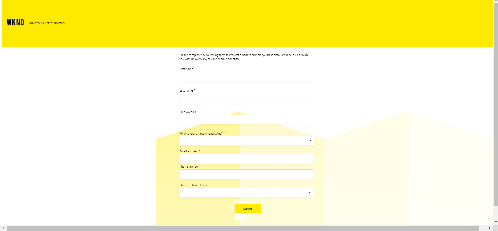
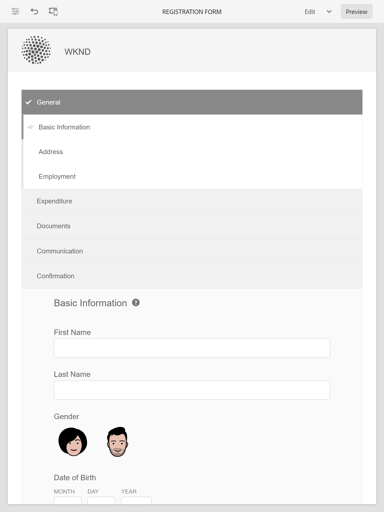

# Exemples de thèmes, de modèles et de données de formulaire dans les composants principaux {#sample-themes-templates-and-data-models}

AEM Forms as a Cloud Service fournit plusieurs exemples de thèmes de référence, de modèles et de modèles de données de formulaire pour vous aider à commencer rapidement la création de Forms adaptatif avec les composants principaux. Vous pouvez [Activation des composants principaux de Forms adaptatif](https://experienceleague.adobe.com/docs/experience-manager-cloud-service/content/forms/setup-configure-migrate/enable-adaptive-forms-core-components.html?lang=fr) dans l’environnement de développement as a Cloud Service et local d’AEM Forms pour obtenir des modèles prêts à l’emploi de référence et pour [utilisation et personnalisation des thèmes](https://experienceleague.adobe.com/docs/experience-manager-cloud-service/content/forms/adaptive-forms-authoring/authoring-adaptive-forms-core-components/create-an-adaptive-form-on-forms-cs/using-themes-in-core-components.html) in [!DNL AEM Forms].

Les exemples de thèmes, modèles et modèles de données de formulaire inclus dans le module de contenu de référence sont les suivants :

| Modèles | Thèmes | Modèle de données de formulaire |
---------|----------|---------
| De base | Canvas  | Microsoft® Dynamics 365 |
| Vide | WKND | Salesforce |
| Nous contacter | Pâques |  |
| Formulaire de consentement | |  |
| Commencer la plainte | | |
| Requête de service de journal |  |  |
| Envoyer des commentaires |  |  |
| Inscription aux avantages |  |   |
| Synthèse des avantages des employés |   |   |
| Demande de relevé de compte |   |   |
| Mise à jour des détails du contact |   |   |
| Formulaire d&#39;inspection de sécurité |   |   |
| Inspection du contrôle qualité |   |   |
| Demande d’achat |  |  |

## Exemples de thèmes {#Sample-Themes}

Les thèmes de référence vous aident à définir le style de vos formulaires sans avoir besoin d’une expertise en CSS, même si vous pouvez personnaliser votre thème selon vos besoins. Vous pouvez [Activation des composants principaux de Forms adaptatif](https://experienceleague.adobe.com/docs/experience-manager-cloud-service/content/forms/setup-configure-migrate/enable-adaptive-forms-core-components.html?lang=fr) dans l’environnement de développement as a Cloud Service et local d’AEM Forms pour obtenir ces thèmes décrits comme suit :

### Canvas  {#Canvas}

Canvas  est le thème par défaut des formulaires adaptatifs. Il souligne l’utilisation des couleurs de base, de la transparence et des icônes aplaties. Dans la capture d’écran ci-dessous, vous pouvez voir à quoi ressemble le thème Canvas 

### WKND {#WKND}

Le thème WKND incarne un design vivant, imaginatif et attrayant pour présenter un aspect stylisé dans vos formulaires. Le thème est basé sur l’aspect et le style de [Site WKND](https://wknd.site/us/en.html) qui est un site Web de voyage et d&#39;aventure basé sur [Composants principaux d’Adobe Experience Manager](https://experienceleague.adobe.com/docs/experience-manager-core-components/using/introduction).

### Pâques {#Easel}

Le thème Easel fait référence à un type spécifique de conception de modèle facile à configurer et personnalisé pour plus de simplicité et de convivialité. Le thème de l&#39;Easel est basé sur le concept d&#39;un stand portable utilisé par les artistes pour soutenir une toile pendant qu&#39;ils travaillent sur leurs tableaux.

## Exemples de modèles {#Sample-templates}

Les modèles définissent la structure, le contenu et les actions du formulaire initial à répliquer dans votre formulaire ou utilisent une structure de modèle similaire à votre formulaire, par exemple, le formulaire de consentement, le formulaire d’inscription aux avantages et bien d’autres. Vous pouvez obtenir les modèles suivants en [activation des composants principaux de Forms adaptatif](https://experienceleague.adobe.com/docs/experience-manager-cloud-service/content/forms/setup-configure-migrate/enable-adaptive-forms-core-components.html?lang=fr) dans l’environnement de développement as a Cloud Service ou local d’AEM Forms. Les exemples de modèles dans les composants principaux de Forms adaptatif sont les suivants :

### De base {#Basic}

Le modèle de base vous permet de créer rapidement un formulaire d’expérience d’inscription. Vous pouvez également l’utiliser pour prévisualiser la fonctionnalité des composants principaux Forms adaptatifs. Il fournit une disposition d’assistant pour la présentation section par section des données.

>[!BEGINTABS]

>[!TAB Poste de travail]

    

>[!TAB Téléphone]

    

>[!TAB Tablette]

    

>[!ENDTABS]

### Vide {#Blank}

Un modèle de canevas vierge est utilisé pour créer entièrement une structure de formulaire adaptatif, du contenu et des règles. Aucun composant de formulaire n’est incorporé.

### Demande de relevé de compte {#Request-for-Account-Statement}

Demande d’un formulaire de relevé de compte pour demander un relevé de transactions. Ce relevé fournit un enregistrement détaillé des transactions financières, des activités ou d’autres informations pertinentes sur un individu. En remplissant ce formulaire, vous pouvez lancer le processus d’obtention d’une instruction précise et à jour pour vos enregistrements.

### Mise à jour des détails du contact {#Contact-Details-Update}

Le formulaire de mise à jour des coordonnées de contact pour la mise à jour des adresses et des coordonnées est conçu pour vous aider à mettre à jour vos informations personnelles relatives à votre abonnement ou à vos avantages afin de garantir une communication transparente et un accès ininterrompu aux services ou aux avantages que vous recevez.

### Inspection de la sécurité {#Safety-Inspection}

Le Formulaire d&#39;inspection de sécurité vise à maintenir un environnement de travail sûr. En procédant à des inspections régulières sous cette forme, on peut identifier les dangers potentiels. Il couvre divers aspects tels que les sorties d&#39;urgence, la sécurité incendie, la sécurité électrique, les matières dangereuses, les équipements de protection personnelle, l&#39;ergonomie des postes de travail, etc. pour la sécurité et le bien-être des employés, des visiteurs et des clients et crée un environnement sécurisé pour tous.

### Demande d’achat {#Purchase-Request}

Formulaire de demande d’achat pour lancer la procédure d’achat et permettre aux employés de demander formellement l’achat de biens ou de services nécessaires à leur travail. Le formulaire capture les détails essentiels tels que la description de l’article, la quantité, le fournisseur préféré (le cas échéant), l’allocation du budget, la justification de l’achat, les informations de diffusion et les validations requises. L’objectif du formulaire est de rationaliser et de documenter le processus d’achat, en assurant l’autorisation et le suivi appropriés des achats demandés.

### Résumé des avantages des employés {#Employee-Benefits-Summary}

Le formulaire de résumé des avantages sociaux des employés permet de recueillir des détails essentiels sur les avantages d’un individu. Il permet d’évaluer rapidement et précisément la couverture, offrant ainsi une vue d’ensemble complète pour une assistance et un soutien efficaces.

### Inscription aux avantages {#Benefits-Enrollment}

Un modèle de formulaire d’inscription aux avantages afin de recueillir des informations essentielles sur les avantages et les options de couverture préférés auprès de leurs employés. Il accompagne généralement la période d’inscription annuelle des avantages.

### Inspection du contrôle qualité {#Quality-Control-Inspection}

Formulaire d’inspection du contrôle qualité pour évaluer et documenter l’apparence visuelle, les dimensions, la fonctionnalité, la documentation, les résultats de test et la qualité globale d’un produit ou d’un article. Il permet d’identifier les défauts, les non-conformités et les actions correctives nécessaires pour garantir le respect des normes de qualité.

### Formulaire de consentement {#Consent-Form}

Un formulaire de consentement est un document juridique qui cherche à obtenir la permission volontaire et éclairée d’un individu ou d’un participant avant de participer à une activité spécifique, à une étude de recherche, à une procédure médicale ou à toute situation où ses informations personnelles ou ses droits peuvent être impliqués. Le formulaire de consentement a pour but d&#39;assurer la transparence, de protéger les droits des participants et d&#39;établir une compréhension claire de ce à quoi l&#39;individu accepte.

### Nous contacter {#Contact-Us}

Le formulaire de mise à jour des coordonnées de contact pour la mise à jour des adresses et des coordonnées est conçu pour vous aider à mettre à jour vos informations personnelles relatives à votre abonnement ou à vos avantages afin de garantir une communication transparente et un accès ininterrompu aux services ou aux avantages que vous recevez.

### Requête de service de journal {#Log-Service-Request}

Formulaire de demande de service de journal pour demander des services de journalisation spécifiques à un fournisseur de services. Le formulaire sert de requête formelle pour créer un ticket lorsque certains événements, activités ou données sont consignés pour le suivi ou le suivi de l’état.

### Donnez vos commentaires {#Give-Feedback}

Un modèle de &quot;retour d’expérience&quot; pour fournir un retour constructif à une autre personne ou à une autre équipe. Le modèle permet de s’assurer que les commentaires sont clairs, spécifiques et exploitables, ce qui favorise la communication ouverte et l’amélioration.

## Modèles de données de formulaire de référence {#reference-models}

Le Forms adaptatif peut alors interagir avec les serveurs Microsoft® Dynamics 365 et Salesforce pour activer les workflows d’entreprise. Par exemple :

* Écrivez des données dans Microsoft® Dynamics 365 et Salesforce lors de l’envoi du formulaire adaptatif.
* Écrivez des données dans Microsoft® Dynamics 365 et Salesforce par le biais d’entités personnalisées définies dans le modèle de données de formulaire et vice versa.
* Query Microsoft® Dynamics 365 et le serveur Salesforce pour les données et préremplissage de Forms adaptatif.
* Lecture des données à partir du serveur Microsoft® Dynamics 365 et Salesforce.

Vous pouvez obtenir les modèles de données de formulaire suivants en installant le [package de contenu de référence](https://experience.adobe.com/#/downloads/content/software-distribution/en/aemcloud.html?package=/content/software-distribution/en/details.html/content/dam/aemcloud/public/aem-forms-reference-content.ui.content-2.1.0.zip) :

* Microsoft® Dynamics 365
* Salesforce

Pour plus d’informations sur l’utilisation de ces modèles, voir [Configuration des services cloud Microsoft® Dynamics 365 et Salesforce](https://experienceleague.adobe.com/docs/experience-manager-cloud-service/content/forms/integrate/use-form-data-model/configure-msdynamics-salesforce.html?lang=fr#configure-dynamics-cloud-service)
