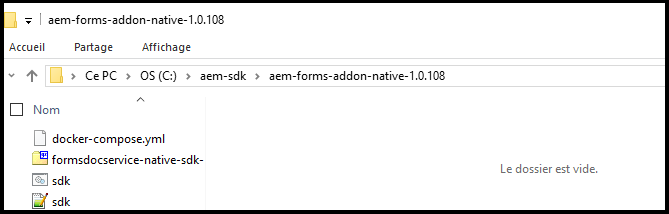

# Configuration d’un environnement de développement local pour AEM Forms {#overview}

Lorsque vous définissez et configurez un environnement [!DNL &#x200B; Adobe Experience Manager Forms] as a [!DNL &#x200B; Cloud Service], vous configurez des environnements de développement, d’évaluation et de production sur le cloud. Vous pouvez en outre également définir et configurer un environnement de développement local.

Vous pouvez utiliser l’environnement de développement local pour effectuer les actions suivantes sans vous connecter à l’environnement de développement cloud :

* [Créez des formulaires](creating-adaptive-form.md) et les ressources associées (thèmes, modèles, actions d’envoi personnalisées, etc.).
* [Convertissez des formulaires PDF en formulaires adaptatifs.](https://experienceleague.adobe.com/docs/aem-forms-automated-conversion-service/using/convert-existing-forms-to-adaptive-forms.html?lang=fr)
* Créez des applications pour générer des [communications client](aem-forms-cloud-service-communications-introduction.md) à la demande ou en mode batch.

Une fois qu’un formulaire adaptatif ou les ressources associées sont prêts sur l’instance de développement locale ou qu’une application pour générer des [communications client] est prête, vous pouvez exporter l’application de formulaire adaptatif ou de communications client de l’environnement de développement local vers un environnement de Cloud Service pour effectuer d’autres tests ou passer aux environnements de production.

Vous pouvez également développer et tester du code personnalisé (composants personnalisés, par exemple) et le service de préremplissage sur l’environnement de développement local. Lorsque le code personnalisé est testé et prêt, vous pouvez utiliser le référentiel Git de votre environnement de développement Cloud Service pour le déployer.

Pour configurer un nouvel environnement de développement local et l’utiliser pour développer des activités, effectuez les actions suivantes dans l’ordre indiqué :

* [Configuration des outils de développement](#setup-development-tools-for-AEM-projects)

* [Configuration des instances locales d’auteur et de publication](#set-up-local-experience-manager-environment-for-development)

* [Ajout de l’archive Forms aux instances de développement local et configuration des utilisateurs](#add-forms-archive-configure-users)

* [Configuration d’un environnement de développement local pour les microservices](#docker-microservices)

* [Configuration d’un projet de développement](#forms-cloud-service-local-development-environment)

* [Configuration des outils du Dispatcher local](#setup-local-dispatcher-tools)

<!--
You can use the local development environment to create and test Adaptive Forms without connecting to the Cloud Service. [!DNL AEM Forms] provides an SDK to help test all the cloud-ready functionalities on the local development environment. When your forms and related assets are ready and tested on the local development environment, you can import these forms and related assets to an [!DNL AEM Forms] as a Cloud Service instance for publishing. 

You can also develop and test custom code like custom components and prefill service on the local development environment. When the custom code is tested and ready, you can use the Git repository of your [!DNL AEM Forms] as a Cloud Service development environment to deploy the custom code. 

>[!NOTE]
>
> Pre-pilot release does not support using an [!DNL AEM Forms] as a Cloud Service development instance to create forms. You can create forms, related assets, and custom code only on a local development environment.-->

<!--
You configure two types of development environments:

* **[!DNL AEM Forms] as a Cloud Service development environment:** Use the [[!DNL AEM Forms] as a Cloud Service](setup-forms-cloud-service.md) environment to store, manage, and publish Adaptive Forms and related assets. Do not use an [!DNL AEM Forms] as a Cloud Service environment to create Adaptive Forms and related assets <!--, form-centric workflows, a form data model, or to generate a Document of Record. -->

<!--
* **Local development environment:** You can use the local development environment to create and test Adaptive Forms without connecting to the service. Adobe provides a SDK for the local development to help test all the cloud-ready functionalities. 
Use a local development environment:
    
    * To create forms and related assets (themes, templates, custom Submit Actions, and more) and convert PDF forms to Adaptive Forms. After an Adaptive Form or related assets are ready on the local development instance, you can export the Adaptive Form and related assets from the local development environment to an [!DNL AEM Forms] as a Cloud Service development environment for publishing.  
    
    * To update configuration settings and develop and test custom code like custom components and prefill service. When the custom code is tested and ready, you can use the Git repository of your [!DNL AEM Forms] as a Cloud Service development environment to deploy the custom code.  

You can use the local development environment to create and test Adaptive Forms without connecting to the service. Adobe provides a SDK for the local development to help test all the cloud-ready functionalities. When your forms and related assets are ready and tested on the local development environment, you can import these forms and related assets to an [!DNL AEM Forms] as a Cloud Service instance for publishing. 

You can use the [development tools](https://experienceleague.adobe.com/docs/experience-manager-65/developing/devtools/dev-tools.html?lang=fr) to write custom code, customize or create new Adaptive Forms components, create a custom prefill service, or modify default configurations of an [!DNL AEM Forms] as a Cloud Service instance. 

-->

## Conditions préalables

Pour configurer un environnement de développement local, vous avez besoin des logiciels ci-après. Téléchargez ces logiciels avant de commencer à configurer l’environnement de développement local :

| Logiciels | Description | Liens de téléchargement |
|---|---|---|
| SDK Adobe Experience Manager as a Cloud Service | Le SDK comprend les outils [!DNL Adobe Experience Manager] QuickStart et Dispatcher | Téléchargez le dernier SDK à partir de la [distribution logicielle](#software-distribution) |  |
| Archivage des fonctionnalités Adobe Experience Manager Forms (module complémentaire AEM Forms) | Outils de création, de mise en forme et d’optimisation des formulaires adaptatifs et autres fonctionnalités Adobe Experience Manager Forms | Téléchargement depuis la [distribution logicielle](#software-distribution) |
| (Facultatif) Contenu de référence Adobe Experience Manager Forms | Outils de création, de mise en forme et d’optimisation des formulaires adaptatifs et autres fonctionnalités Adobe Experience Manager Forms | Téléchargement depuis la [distribution logicielle](#software-distribution) |
| (Facultatif) Adobe Experience Manager Forms Designer | Outils de création, de mise en forme et d’optimisation des formulaires adaptatifs et autres fonctionnalités Adobe Experience Manager Forms | Téléchargement depuis la [distribution logicielle](#software-distribution) |

### Téléchargement de la dernière version du logiciel à partir de la distribution logicielle {#software-distribution}

Pour télécharger la dernière version du SDK Adobe Experience Manager as a Cloud Service, l’archive de fonctionnalités Experience Manager Forms (module complémentaire AEM Forms), les ressources de référence de formulaires ou Forms Designer depuis la [distribution logicielle](https://experience.adobe.com/#/downloads/content/software-distribution/en/aemcloud.html) :

1. Connectez-vous à <https://experience.adobe.com/#/downloads> avec votre Adobe ID.

   >[!NOTE]
   >
   > Votre organisation Adobe doit être configurée pour AEM as a Cloud Service afin de télécharger le SDK AEM as a Cloud Service.

1. Accédez à l’onglet **[!UICONTROL AEM as a Cloud Service]**.
1. Effectuez un tri par date de publication dans l’ordre décroissant.
1. Cliquez sur le dernier SDK Adobe Experience Manager as a Cloud Service, l’archive de fonctionnalités Experience Manager Forms (module complémentaire AEM Forms), les ressources de référence de formulaires ou Forms Designer.

   >[!NOTE]
   >
   > Il est recommandé de télécharger la dernière version de l’archive de fonctionnalités Experience Manager Forms (module complémentaire AEM Forms), les ressources de référence de formulaires ou Forms Designer pour une compatibilité transparente avec Adobe Experience Manager as a Cloud Service SDK.

1. Examinez et acceptez le contrat de licence de l’utilisateur final. Sélectionnez le bouton **[!UICONTROL Télécharger]**.

## Configuration des outils de développement pour les projets AEM {#setup-development-tools-for-AEM-projects}

Le projet Adobe Experience Manager Forms est une base de code personnalisé. Il contient le code, les configurations et le contenu qui est déployé via Cloud Manager sur [!DNL Adobe Experience Manager] as a Cloud Service. L’[archétype Maven de projet AEM](https://github.com/adobe/aem-project-archetype) fournit la structure de base du projet.

Configurez les outils de développement suivants à utiliser pour votre projet [!DNL Adobe Experience Manager] de développement :

* [Java™](https://experienceleague.adobe.com/docs/experience-manager-learn/cloud-service/local-development-environment-set-up/development-tools.html?lang=fr#local-development-environment-set-up)
* [Git](https://experienceleague.adobe.com/docs/experience-manager-learn/cloud-service/local-development-environment-set-up/development-tools.html?lang=fr#install-git)
* [Node.js (npm)](https://experienceleague.adobe.com/docs/experience-manager-learn/cloud-service/local-development-environment-set-up/development-tools.html?lang=fr#node-js)
* [Maven](https://experienceleague.adobe.com/docs/experience-manager-learn/cloud-service/local-development-environment-set-up/development-tools.html?lang=fr#install-maven)

Pour obtenir des instructions détaillées sur la configuration des outils de développement susmentionnés, voir [Configuration des outils de développement](https://experienceleague.adobe.com/docs/experience-manager-learn/cloud-service/local-development-environment-set-up/development-tools.html?lang=fr).

## Configuration d’un environnement Experience Manager local pour le développement

Le SDK Cloud Service fournit un fichier QuickStart. Il exécute une version locale d’Experience Manager. Vous pouvez exécuter les instances d’auteur ou de publication localement.

Bien que QuickStart fournisse un environnement de développement local, il ne dispose pas de toutes les fonctionnalités disponibles dans [!DNL Adobe Experience Manager] as a Cloud Service. Ainsi, testez toujours vos fonctionnalités et votre code avec l’environnement de développement [!DNL Adobe Experience Manager] as a Cloud Service avant de déplacer les fonctionnalités vers un environnement d’évaluation ou de production.

Pour installer et configurer l’environnement Experience Manager local, procédez comme suit :

* [Téléchargez et extrayez](https://experience.adobe.com/#/downloads/content/software-distribution/en/aemcloud.html) le SDK [!DNL Adobe Experience Manager] as a Cloud Service.
* [Configurez une instance d’auteur](https://experienceleague.adobe.com/docs/experience-manager-learn/cloud-service/local-development-environment-set-up/aem-runtime.html?lang=fr#set-up-local-aem-author-service).
* [Configurez une instance de publication](https://experienceleague.adobe.com/docs/experience-manager-learn/cloud-service/local-development-environment-set-up/aem-runtime.html?lang=fr#set-up-local-aem-publish-service).

## Ajout de l’archive Forms aux instances locales d’auteur et de publication et configurations des utilisateurs spécifiques à Forms {#add-forms-archive-configure-users}

Pour ajouter l’archive Forms aux instances d’Experience Manager et configurer les utilisateurs spécifiques à Forms, effectuez les étapes suivantes dans l’ordre indiqué :

### Installation de la dernière archive de fonctionnalités de module complémentaire de Forms {#add-forms-archive}

L’archive des fonctionnalités Adobe Experience Manager Forms as a Cloud Service fournit des outils pour créer, mettre en forme et optimiser les formulaires adaptatifs dans l’environnement de développement local. Installez le package pour créer un formulaire adaptatif et utiliser diverses autres fonctionnalités d’[!DNL AEM Forms]. Pour installer le package :

1. Téléchargez et extrayez la dernière archive [!DNL AEM Forms] pour votre système d’exploitation à partir de la [distribution logicielle](https://experience.adobe.com/#/downloads/content/software-distribution/en/aemcloud.html).

1. Accédez au répertoire crx-quickstart/install. Si le dossier n’existe pas, créez-le.

1. Arrêtez votre instance AEM, placez l’archive de fonctionnalités de module complémentaire [!DNL AEM Forms], `aem-forms-addon-<version>.far`, dans le dossier d’installation.
1. Accédez à la fenêtre de commande active et appuyez sur `Ctrl + C` commande pour redémarrer le SDK.

   >[!NOTE]
   >
   > Il est recommandé d’utiliser la commande « Ctrl+C » pour redémarrer le SDK. Le redémarrage du SDK AEM à l’aide de méthodes alternatives, par exemple l’arrêt des processus Java, peut entraîner des incohérences dans l’environnement de développement AEM.

<!--**Q**: I've set up a Aem as a Cloud Service environment and added the Forms Add-On for a project. After the .far file addition, the bundles are not in the active state and are in installed state only due to the missing dependencies. How to make the bundles in the active state?
**A**: To resolve the issue:
1. Start the AEM and wait for it to start completely (all bundles up)
1. Stop aem (ctrl + c). Place the forms far in the install folder.
1. Restart AEM.-->


### Configuration des utilisateurs et des autorisations {#configure-users-and-permissions}

Créez des utilisateurs comme Développeur de formulaires et Professionnel de formulaires et [ajoutez-les à des groupes de formulaires prédéfinis](https://experienceleague.adobe.com/docs/experience-manager-learn/cloud-service/accessing/aem-users-groups-and-permissions.html?lang=fr#accessing) pour leur fournir les autorisations requises. Le tableau suivant répertorie tous les types d’utilisateurs et les groupes prédéfinis pour chaque type d’utilisateur de formulaires :

| Type d’utilisateur | Groupe AEM |
|---|---|
| Professionnel de formulaires / | [!DNL forms-users] (Utilisateurs AEM Forms), [!DNL template-authors], [!DNL workflow-users], [!DNL workflow-editors] et [!DNL fdm-authors] |
| Développeur de formulaires | [!DNL forms-users] (Utilisateurs AEM Forms), [!DNL template-authors], [!DNL workflow-users], [!DNL workflow-editors] et [!DNL fdm-authors] |
| Responsable de l’expérience client ou designer de l’expérience utilisateur | [!DNL forms-users], [!DNL template-authors] |
| Administrateur AEM | [!DNL aem-administrators], [!DNL fd-administrators] |
| Utilisateur final | Lorsqu’un utilisateur doit se connecter pour afficher et envoyer un formulaire adaptatif, ajoutez ces utilisateurs au groupe [!DNL forms-users]. </br> Lorsqu’aucune authentification utilisateur n’est requise pour accéder aux formulaires adaptatifs, n’attribuez aucun groupe à ces utilisateurs. |

<!--  

## Set up a local AEM instance for development

Perform the following steps in the listed order to set up and configure your local development environment:

1. **Set up an AEM author instance:** You require an author instance to create Adaptive Forms. Download and extract the latest AEM SDK archive. Run the quick start file in author run mode to set up an author instance. For detailed instructions, see [default local instance](https://experienceleague.adobe.com/docs/experience-manager-learn/cloud-service/local-development-environment-set-up/aem-runtime.html?lang=fr).  

1. **Install the latest [!DNL AEM Forms] add-on feature archive:** [!DNL AEM Forms] add-on feature archive provides tools to create, style, and optimize Adaptive Forms on the local development environment. Install the package to create an Adaptive Form and use various other features of [!DNL AEM Forms]. To install the package:

    1. Download and extract the latest [!DNL AEM Forms] archive for your operating system from [Software Distribution](https://experience.adobe.com/#/downloads/content/software-distribution/en/aemcloud.html).

    1. Navigate to the crx-quickstart/install directory. If the folder does not exist, create it.

    1. Stop your Cloud ready AEM instance, place the [!DNL AEM Forms] add-on feature archive, `aem-forms-addon-<version>.far`,  in the install folder, and restart the instance.

1. **Configure users and permissions:** Create users like Form Developer and Form Practitioner a nd add these users to pre-defined forms group to provide them required permissions. The table below lists all types of users and pre-defined groups for each type of forms users:
  
    | User Type | AEM Group |
    |---|---|
    | Form Practitioner  | forms-users (AEM Forms Users), template-authors  |
    | Form Developer | forms-users (AEM Forms Users), template-authors |
    | End-User| everyone* |

    `*` When a user should log in to access or submit Adaptive Forms, add such users to the everyone group.  -->

<!--    
### Set up an AEM project for the development tasks related to local AEM 6.5.5 Forms instance

Use this project to update configurations, create overlays, develop custom Adaptive Form components, and custom code using the local development environment. To set up the project:

1. **Install and configure Maven and set up an AEM project based on Apache Maven:** Apache Maven is an open-source tool for managing software projects. It helps automate builds and provides quality project information. It is the recommended build management tool for AEM projects. For detailed instructions to set up an AEM project based on Apache Maven, see [How to Build AEM Projects using Apache Maven](https://experienceleague.adobe.com/docs/experience-manager-65/developing/devtools/ht-projects-maven.html?lang=fr).

1. Configure the project to use [uber-jar](https://experienceleague.adobe.com/docs/experience-manager-65/release-notes/release-notes.html?lang=fr#install-aem-forms-jee-installer) version 6.5.5 or later and [[!DNL AEM Forms] Client SDK](https://repo1.maven.org/maven2/com/adobe/aemfd/aemfd-client-sdk/) version 6.0.160 or later.  

1. **Set Up an Integrated Development Environment:**  Set up an IDE of your choice for development, see [Set Up an Integrated Development Environment](https://experienceleague.adobe.com/docs/experience-manager-learn/foundation/development/set-up-a-local-aem-development-environment.html?lang=fr#set-up-an-integrated-development-environment) for detailed instructions.
 -->

## Configuration de l’environnement de développement local pour le document d’enregistrement {#docker-microservices}

AEM Forms as a Cloud Services fournit un environnement SDK Docker qui facilite le développement d’un document d’enregistrement et l’utilisation d’autres microservices. Il vous libère de la configuration manuelle de fichiers binaires et d’adaptations spécifiques à la plateforme. Pour configurer l’environnement :

1. Installez et configurez Docker.

   * (Pour Microsoft® Windows) Installez [Docker Desktop](https://www.docker.com/products/docker-desktop). Il configure `Docker Engine` et `docker-compose` sur votre ordinateur.

   * (Apple macOS) Installez [Docker Desktop pour Mac](https://hub.docker.com/editions/community/docker-ce-desktop-mac). Il comprend Docker Engine, le client de ligne de commande Docker, Docker Composition, Docker Content Trust, Kubernetes et Credential Helper.

   * (Pour Linux®) Installez [Docker Engine](https://docs.docker.com/engine/install/#server) et [Docker Compose](https://docs.docker.com/compose/install/) sur votre ordinateur.

   >[!NOTE]
   >
   > * Pour Apple macOS, placez sur liste autorisée les dossiers contenant des instances d’auteur AEM locales.
   >
   > * Docker Desktop pour Windows prend en charge deux back-ends, Hyper-V
   > (hérité) et WSL2 (moderne). Le partage de fichiers est automatiquement
   > géré par Docker lors de l’utilisation de WSL2 (moderne). Vous devez
   > configurer explicitement le partage de fichiers lors de l’utilisation d’Hyper-V (hérité).

1. Créez un dossier, par exemple aem-sdk, parallèlement à vos instances d’auteur et de publication, comme C:\aem-sdk.

1. Extrayez le fichier `aem-forms-addon-<version>.zip\aem-forms-addon-native-<version>.zip`.

   

1. Créez une variable d’environnement AEM_HOME et pointez vers l’installation locale de l’auteur AEM, par exemple C:\aem\author\.

1. Ouvrez sdk.bat ou sdk.sh pour le modification. Définissez AEM_HOME pour pointer vers l’installation locale de l’auteur AEM, par exemple C:\aem\author\.

1. Ouvrez une invite de commandes et accédez au dossier `aem-forms-addon-native-<version>`.

1. Assurez-vous que votre instance d’auteur AEM locale est en cours d’exécution. Exécutez les commandes suivantes pour démarrer le SDK :

   * Sous Microsoft® Windows

     ```shell
     sdk.bat start
     ```


   * Linux® ou Apple macOS

     ```Shell
     % export AEM_HOME=[local AEM Author installation]
     % ./sdk.sh start
     ```


   >[!NOTE]
   >
   > Si vous avez défini la variable d’environnement dans le fichier sdk.sh, vous n’êtes pas obligé de la spécifier en ligne de commande. L’option permettant de définir la variable d’environnement sur la ligne de commande est fournie pour exécuter la commande sans mettre à jour le script shell.

   

Vous pouvez maintenant utiliser l’environnement de développement local pour générer un document d’enregistrement. Pour effectuer un test, chargez un fichier XDP dans votre environnement et effectuez son rendu, Par exemple : <http://localhost:4502/libs/xfaforms/profiles/default.print.pdf?template=crx:///content/dam/formsanddocuments/cheque-request.xdp> convertit le fichier XDP en document PDF.

## Configuration d’un projet de développement pour Forms basé sur l’archétype Experience Manager {#forms-cloud-service-local-development-environment}

Utilisez ce projet pour créer des formulaires adaptatifs, déployer des mises à jour de configuration et des superpositions, créer des composants de formulaire adaptatif personnalisés, effectuer des tests et créer du code personnalisé sur le SDK [!DNL Experience Manager Forms] local. Après avoir effectué des tests localement, vous pouvez déployer le projet sur les environnements [!DNL Experience Manager Forms] as a Cloud Service de production et hors production. Lorsque vous déployez le projet, les ressources AEM Forms suivantes sont également déployées :

| Thèmes | Modèles | Modèle de données de formulaire (FDM) |
---------|----------|---------
| Canvas 3.0 | De base | Microsoft® Dynamics 365 |
| Tranquil | Vide | Salesforce |
| Urbane |   |  |
| Ultramarine |  |  |
| Beryl |  |  |

>[!NOTE]
>
> Configurez un projet basé sur l’archétype AEM version 30 ou ultérieure pour obtenir et utiliser Microsoft® Dynamics 365 et le modèle de données de formulaire (FDM) Salesforce avec AEM Forms as a Cloud Service.
> &#x200B;> Configurez un projet basé sur l’archétype AEM version 32 ou ultérieure pour obtenir et utiliser les thèmes Tranquil, Urbane et Ultramarine avec AEM Forms as a Cloud Service.

Pour configurer le projet :

1. **Clonez le référentiel Git Cloud Manager sur votre instance de développement locale** : votre référentiel Git Cloud Manager contient un projet AEM par défaut. Il est basé sur l’[archétype AEM](https://github.com/adobe/aem-project-archetype/). Clonez votre référentiel Git Cloud Manager à l’aide de la gestion de compte Git en libre-service depuis l’interface utilisateur de Cloud Manager pour intégrer le projet à votre environnement de développement local. Pour plus d’informations sur l’accès au référentiel, consultez [Accès aux référentiels](https://experienceleague.adobe.com/docs/experience-manager-cloud-manager/using/managing-code/accessing-repos.html?lang=fr).

<!-- 1. 
After the repository is cloned, [integrate your Git repo with Cloud Manager](https://experienceleague.adobe.com/docs/experience-manager-cloud-manager/using/managing-code/setup-cloud-manager-git-integration.html?lang=fr)

**Make cloned AEM project compatible with [!DNL AEM Forms] as a Cloud Service:** Remove uber-jar and other non-cloud dependencies from the pom.xml files of the project. You can refer the pom.xml files of the [sample AEM project](assets/FaaCSample.zip) for the list of required dependencies and update your AEM project accordingly. You can also refer [AEM Project Structure](https://experienceleague.adobe.com/docs/experience-manager-cloud-service/content/implementing/developing/aem-project-content-package-structure.html?lang=fr) to learn changes required to make an AEM project compatible with AEM as a Cloud Service.  -->

1. **Créez un projet [!DNL Experience Manager Forms] as a [Cloud Service] :** créez un projet [!DNL Experience Manager Forms] as a [Cloud Service] basé sur le dernier [archétype AEM](https://github.com/adobe/aem-project-archetype). L’archétype permet aux développeurs de commencer facilement le développement pour [!DNL AEM Forms] as a Cloud Service. Il comprend également des exemples de thème et de modèle pour vous aider à démarrer rapidement.

   Ouvrez l’invite de commandes et exécutez la commande ci-après pour créer un projet [!DNL Experience Manager Forms] as a Cloud Service.

   ```shell
   mvn -B org.apache.maven.plugins:maven-archetype-plugin:3.2.1:generate -D archetypeGroupId=com.adobe.aem -D archetypeArtifactId=aem-project-archetype -D archetypeVersion="41" -D appTitle=mysite -D appId=mysite -D groupId=com.mysite -D includeFormsenrollment="y" -D aemVersion="cloud"
   ```

   Modifiez `appTitle`, `appId` et `groupId` dans la commande ci-dessus pour refléter votre environnement. En outre, définissez la valeur de includeFormsenrollment, includeFormscommunications et includeFormless sur `y` ou `n` en fonction de votre licence et de vos exigences. L’élément includeFormsheadless est obligatoire pour créer des formulaires adaptatifs basés sur les composants principaux.

   * Utilisez l’option `includeFormsenrollment=y` pour inclure des configurations, des thèmes, des modèles, des composants principaux et des dépendances spécifiques à Forms, nécessaires à la création de formulaires adaptatifs. Si vous utilisez Portail Formulaires, définissez l’option `includeExamples=y`. Vous ajoutez ainsi les composants principaux Portail Formulaires dans le projet.

   * Utilisez l’option `includeFormscommunications=y` afin d’ajouter les composants principaux Forms et les dépendances nécessaires pour inclure la fonctionnalité de communications client.

     >[!WARNING]
     >
     >* Lors de la création d’un projet d’archétype avec la version 45, le [dossier de projet d’archétype AEM]/pom.xml définit initialement la version des composants principaux de formulaires sur 2.0.64. Avant de créer ou de déployer le projet d’archétype, mettez à jour la version des composants principaux des formulaires vers la version 2.0.62.

1. Déployez le projet sur votre environnement de développement local. Vous pouvez utiliser la commande suivante pour effectuer un déploiement sur votre environnement de développement local :

   `mvn -PautoInstallPackage clean install`

   Pour obtenir la liste complète des commandes, voir [Création et installation](https://experienceleague.adobe.com/docs/experience-manager-core-components/using/developing/archetype/using.html?lang=fr#building-and-installing).

1. [Déployez le code dans votre environnement [!DNL AEM Forms] as a Cloud Service](https://experienceleague.adobe.com/docs/experience-manager-cloud-service/implementing/deploying/overview.html?lang=fr#customer-releases).

## Configuration des outils du Dispatcher local {#setup-local-dispatcher-tools}

Le Dispatcher est un module de serveur Web HTTP Apache qui fournit une couche de sécurité et de performances entre le CDN et le niveau AEM Publish. Il fait partie intégrante de l’architecture globale d’Experience Manager et doit faire partie de l’environnement de développement local.

Pour configurer le Dispatcher local et y ajouter ensuite des règles spécifiques à Forms, procédez comme suit :

### Configuration du Dispatcher local {#setup-local-dispatcher}

La version [!DNL Experience Manager] d’as a Cloud Service SDK comprend la version recommandée des outils Dispatcher qui facilite la configuration, la validation et la simulation locale de Dispatcher. Les outils du Dispatcher sont basés sur Docker et fournissent des outils en ligne de commandes pour transpiler les fichiers de configuration du serveur web HTTP Apache et du Dispatcher dans un format compatible et les déployer sur le Dispatcher s’exécutant dans le conteneur Docker.

La mise en cache sur le Dispatcher permet à [!DNL AEM Forms] de préremplir les formulaires adaptatifs sur un client. Elle améliore la vitesse de rendu des formulaires préremplis.

Pour obtenir des instructions détaillées sur la configuration du Dispatcher, voir [Configuration des outils du Dispatcher local](https://experienceleague.adobe.com/docs/experience-manager-learn/cloud-service/local-development-environment-set-up/dispatcher-tools.html?lang=fr#local-development-environment-set-up).

### Ajout de règles spécifiques à Forms au Dispatcher {#forms-specific-rules-to-dispatcher}

Pour configurer le cache du Dispatcher pour Experience Manager Forms en tant que Cloud Service, procédez comme suit :

1. Ouvrez votre projet AEM et accédez à `\src\conf.dispatcher.d\available_farms`
1. Créez une copie du fichier `default.farm`, par exemple, `forms.farm`.
1. Ouvrez le fichier `forms.farm` créé pour le modifier et remplacer le code suivant :

   ```json
   #/ignoreUrlParams {
   #/0001 { /glob "*" /type "deny" }
   #/0002 { /glob "q" /type "allow" }
   #}
   ```

   par

   ```json
   /ignoreUrlParams {
   /0001 { /glob "*" /type "deny" }
   /0002 { /glob "dataRef" /type "allow" }
   }
   ```

1. Enregistrez et fermez votre fichier.
1. Accédez à `conf.d/enabled_farms` et créez un lien symbolique vers le fichier `forms.farm`.
1. Compilez et déployez le projet sur l’environnement [!DNL AEM Forms] as a Cloud Service.

### Considérations relatives à la mise en cache {#considerations-about-caching}

* La mise en cache du Dispatcher permet à [!DNL AEM Forms] de préremplir les formulaires adaptatifs sur un client. Elle améliore la vitesse de rendu des formulaires préremplis.
* Par défaut, la mise en cache des fonctionnalités de contenu sécurisé est désactivée. Pour activer la fonctionnalité, vous pouvez exécuter les instructions fournies dans l’article [Mise en cache du contenu sécurisé](https://experienceleague.adobe.com/docs/experience-manager-dispatcher/using/configuring/permissions-cache.html?lang=fr).
* Le Dispatcher peut ne pas réussir à invalider certains formulaires adaptatifs et formulaires adaptatifs associés. Pour résoudre ces problèmes, consultez [[!DNL AEM Forms] Mise en cache](troubleshooting-caching-performance.md) dans la section de dépannage.
* Mise en cache de formulaires adaptatifs localisés :
   * Utilisez le format d’URL `http://host:port/content/forms/af/<afName>.<locale>.html` pour demander une version localisée d’un formulaire adaptatif au lieu de `http://host:port/content/forms/af/afName.html?afAcceptLang=<locale>`
   * L’option des paramètres régionaux du navigateur est désactivée par défaut. Pour modifier les paramètres régionaux du navigateur :
* Lorsque vous utilisez le format d’URL `http://host:port/content/forms/af/<adaptivefName>.html` et que l’option Utiliser les paramètres régionaux du navigateur située dans le gestionnaire de configuration est désactivée, la version non localisée du formulaire adaptatif est diffusée. La langue non localisée est celle utilisée lors du développement du formulaire adaptatif. Les paramètres régionaux configurés pour votre navigateur (paramètres régionaux du navigateur) ne sont pas pris en compte et une version non localisée du formulaire adaptatif est diffusée.
* Lorsque vous utilisez le format d’URL `http://host:port/content/forms/af/<adaptivefName>.html` et que l’option Utiliser les paramètres régionaux du navigateur située dans le gestionnaire de configuration est activée, la version localisée du formulaire adaptatif est diffusée. La langue du formulaire adaptatif localisé est basée sur les paramètres régionaux configurés pour votre navigateur (paramètres régionaux du navigateur). Elle peut conduire à la [mise en cache seulement de la première instance d’un formulaire adaptatif]. Pour éviter que le problème ne se produise sur votre instance, consultez [seule la première instance d’un formulaire adaptatif est mise en cache](troubleshooting-caching-performance.md) dans la section de dépannage.

Votre environnement de développement local est prêt.

## Activer les composants principaux des formulaires adaptatifs AEM Forms as a Cloud Service et dans l’environnement de développement local

L’activation des composants principaux de Forms adaptatif sur AEM Forms as a Cloud Service Forms vous permet de commencer à créer, publier et diffuser des Forms adaptatifs et découplés basés sur les composants principaux à l’aide de vos instances AEM Forms Cloud Service sur plusieurs canaux. L’environnement des composants principaux des formulaires adaptatifs doit être activé pour utiliser les formulaires adaptatifs découplés.

>[!NOTE]
>
> Installez la dernière version de pour activer les composants principaux de Forms adaptatif pour votre environnement AEM Cloud Service.

## Mise à niveau de votre environnement de développement local {#upgrade-your-local-development-environment}

La mise à niveau du SDK vers une nouvelle version nécessite le remplacement de l’ensemble de l’environnement de développement local, ce qui entraîne la perte de l’intégralité du code, de la configuration et du contenu dans les référentiels locaux. Assurez-vous que l’intégralité du code, de la configuration ou du contenu ne devant pas être détruit est validé en toute sécurité dans Git ou exporté depuis les instances Experience Manager locales en tant que packages CRX.

### Comment éviter la perte de contenu lors de la mise à niveau du SDK {#avoid-content-loss-when-upgrading--SDK}

La mise à niveau du SDK crée de manière efficace une toute nouvelle instance d’auteur et de publication, y compris un nouveau référentiel ([Configuration d’un projet AEM](#forms-cloud-service-local-development-environment)), ce qui signifie que toutes les modifications apportées au référentiel d’un SDK précédent sont perdues. Pour obtenir des stratégies viables afin de conserver le contenu entre les mises à niveau du SDK, voir [Comment éviter la perte de contenu lors de la mise à niveau du SDK AEM](https://experienceleague.adobe.com/docs/experience-manager-learn/cloud-service/local-development-environment-set-up/aem-runtime.html?lang=fr#optional-local-aem-runtime-set-up-tasks)

<!--When you update any  Forms-specifc configuration, create overlays, develop custom Adaptive Form components, or develop and test any custom code in AEM project for the development tasks related to local development instance, use the AEM project cloned from the Cloud Manager Git repository to [deploy the custom code and other changes to your [!DNL AEM Forms] as a Cloud Service's production or non-production environment](https://video.tv.adobe.com/v/30191?quality=9).

## Upgrade your local development environment {#update-local-setup}

Update the local AEM setup (AEM SDK) to latest version at least monthly on, or shortly after, the last Thursday of each month, which is the release cadence for AEM as a Cloud Service "feature releases". You can download local AEM SDK from [Software Distribution](https://experience.adobe.com/#/downloads/content/software-distribution/en/aemcloud.html).

Updating the AEM SDK to a new version requires replacing the entire local development environment, resulting in a loss of all code, configuration and content in the local AEM repositories. Ensure that any code, config or content that should not be destroyed is safely committed to Git, or exported from the local AEM instance as AEM Packages.

### How to avoid content loss when upgrading the AEM SDK {#avoid-content-loss-when-upgrading--AEM-SDK}

Upgrading the AEM SDK is effectively creating a brand new AEM runtime ([Set up a local AEM instance](setup-forms-cloud-service.md)), including a new repository ([Set up AEM project](#forms-cloud-service-local-development-environment)), meaning any changes made to a prior AEM SDK's repository are lost. The following are viable strategies for aiding in persisting content between AEM SDK upgrades, and can be used discretely or in concert:

1. Create a content package dedicated to containing the sample content to aid in development and maintain it in Git. Any content that should be persisted through AEM SDK upgrades would be persisted into this package and re-deployed after upgrading the AEM SDK.
1. Use [oak-upgrade](https://jackrabbit.apache.org/oak/docs/migration.html) with the `includepaths` directive, to copy content from the prior AEM SDK repository to the new AEM SDK repository.
1. Back up any content using AEM Package Manager and content packages on the prior AEM SDK and re-install them on the new AEM SDK.

Remember, using the above approaches to maintain code between AEM SDK upgrades, indicates a development anti-pattern. Non-disposable code should originate in your Development IDE and flow into AEM SDK via deployments.

For information about troubleshooting, stopping local AEM environment, run modes, and deployment, see [Set up local AEM Runtime](https://experienceleague.adobe.com/docs/experience-manager-learn/cloud-service/local-development-environment-set-up/aem-runtime.html?lang=fr#local-development-environment-set-up).-->

### Sauvegarde et importation de contenu spécifique à Forms dans un nouvel environnement de SDK {#backup-and-import-Forms-specific-content-to-new-SDK-environment}

Pour sauvegarder et déplacer des ressources du SDK existant vers un nouvel environnement de SDK :

* Créez une sauvegarde de votre contenu existant.

* Configurez un nouvel environnement de SDK.

* Importez la sauvegarde dans votre nouvel environnement de SDK.

### Création d’une sauvegarde de votre contenu existant {#create-backup-of-your-existing-content}

Sauvegardez votre Forms adaptative, les modèles, le modèle de données de formulaire (FDM), le thème, les configurations et le code personnalisé. Vous pouvez exécuter l’action suivante pour créer une sauvegarde :

1. [Téléchargez](import-export-forms-templates.md#manage-forms-and-related-assets) les formulaires adaptatifs, les thèmes et les formulaires PDF.
1. Exportez les modèles de formulaire adaptatif.

1. Téléchargez les modèles de données de formulaire.

1. Exportez les modèles modifiables, les configurations de cloud et le modèle de processus. Pour exporter tous les éléments susmentionnés à partir de votre SDK existant, créez un [package-CRX](https://experienceleague.adobe.com/docs/experience-manager-cloud-service/implementing/deploying/overview.html?lang=fr) avec les filtres suivants :

   * /conf/ReferenceEditableTemplates
   * /conf/global/settings/cloudconfigs
   * /conf/global/settings/wcm
   * /var/workflow/models
   * /conf/global/settings/workflow
1. Exportez les configurations de courrier électronique, le code d’envoi et d’actions de préremplissage à partir de votre environnement de développement local. Pour exporter ces paramètres et cette configuration, créez une copie des dossiers et fichiers suivants sur votre environnement de développement local :

   * `[Archetype Project in Cloud Service Git]/core/src/main/java/com/<program name>/core/service`
   * `[Archetype Project in Cloud Service Git] /core/src/main/java/com/<program name>/core/servlets/FileAttachmentServlet.java`
   * `[Archetype Project in Cloud Service Git]/ui.apps/src/main/content/jcr_root/apps/<program name>/config`

### Importation de la sauvegarde dans votre nouvel environnement de SDK {#import-the-backup-to-your-new-SDK-environment}

Importez les formulaires adaptatifs, les modèles, le modèle de données de formulaire, le thème, les configurations et le code personnalisé dans votre nouvel environnement. Vous pouvez effectuer l’action suivante pour importer la sauvegarde :

1. [Importez](import-export-forms-templates.md#manage-forms-and-related-assets) les formulaires adaptatifs, les thèmes et les formulaires PDF dans de nouveaux environnements de SDK.
1. Importez les modèles de formulaire adaptatif dans un nouvel environnement de SDK.

1. Chargez les modèles de données de formulaire dans un nouvel environnement SDK.

1. Importez les modèles modifiables, les configurations de cloud et le modèle de processus. Pour importer tous les éléments mentionnés précédemment dans votre nouvel environnement de SDK, importez le package CRX contenant ces éléments dans votre nouvel environnement SDK.

1. Importez les configurations de courrier électronique, le code d’envoi et d’actions de préremplissage à partir de votre environnement de développement local. Pour importer ces paramètres et cette configuration, importez les fichiers suivants de votre ancien projet d’archétype vers le nouveau :

   * `[Archetype Project in Cloud Service Git]/core/src/main/java/com/<program name>/core/service`
   * `[Archetype Project in Cloud Service Git] /core/src/main/java/com/<program name>/core/servlets/FileAttachmentServlet.java`
   * `[Archetype Project in Cloud Service Git]/ui.apps/src/main/content/jcr_root/apps/<program name>/config`

Votre nouvel environnement comporte maintenant des formulaires et des ressources connexes de l’ancien environnement.
