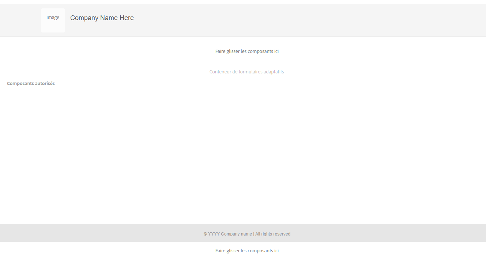

# Création d’un modèle de formulaire adaptatif avec des composants principaux {#adaptive-form-templates}

Lorsque vous concevez un formulaire, vous ajoutez des champs et des composants pour définir la structure, le contenu et les actions de formulaire dans l’éditeur. Vous ajoutez des champs et des composants dans le `guideRootPanel` du conteneur de formulaires. Avec l’éditeur de modèles, vous pouvez créer un modèle contenant la structure de base et le contenu initial que les auteurs et autrices peuvent utiliser pour créer des formulaires.

Par exemple, vous souhaitez que tous les auteurs de formulaire disposent de certaines zones de texte, de boutons de navigation, ainsi qu’un bouton permettant de soumettre un formulaire d’inscription. Vous pouvez créer un modèle avec les composants que les auteurs et autrices peuvent utiliser pour créer un formulaire qui soit cohérent avec d’autres formulaires d’inscription. Lorsque les auteurs utilisent le modèle pour créer un formulaire adaptatif, le nouveau formulaire hérite de la structure, des éléments et des composants que vous avez spécifiés dans le modèle. L’éditeur de modèles permet d’effectuer les opérations suivantes :

* Ajoutez les composants d’en-tête et de pied de page d’un formulaire dans le calque de structure.
* Fournissez le contenu initial pour le formulaire.
* Spécifiez un thème, des actions Envoyer.

<!--
You can download and install [!DNL AEM Forms] reference content package from [Software Distribution](https://experience.adobe.com/#/downloads/content/software-distribution/en/aemcloud.html) portal to import reference themes and templates to your environment.
-->

## Condition préalable

Lors du déploiement de l’environnement Forms as a Cloud Service basé sur l’archétype 45, les thèmes basés sur les composants principaux sont ajoutés à votre environnement.

## Utiliser un modèle {#working-with-templates}

Vous pouvez accéder à l’éditeur de modèles à partir du menu Outils en accédant à **[!UICONTROL Adobe Experience Manager]** > **[!UICONTROL Outils]** > **[!UICONTROL Général]** > **[!UICONTROL Modèles]**. Ici, les modèles sont organisés dans des dossiers activés pour les modèles modifiables.

>[!NOTE]
>
> Vous trouverez les modèles modifiables basés sur les composants principaux dans les dossiers spécifiques aux composants principaux.

Experience Manager met à disposition un dossier global pour organiser les modèles. Cependant, il n’est pas activé par défaut. Vous pouvez demander à votre administrateur d’activer le dossier global ou de créer un nouveau dossier pour les modèles. Pour plus d’informations sur la création de dossiers, voir [Dossiers de modèles](https://experienceleague.adobe.com/docs/experience-manager-cloud-service/sites/authoring/features/templates.html?lang=fr#editing-templates-template-authors).

## Création d’un modèle {#create-template}

Après avoir créé un dossier, ouvrez-le et suivez les étapes ci-après pour créer un modèle :

1. Sélectionnez **[!UICONTROL Créer]** à l’intérieur du dossier que vous avez créé.
1. Dans la section **[!UICONTROL Choisir un type de modèle]**, sélectionnez **[!UICONTROL Modèle de formulaire adaptatif (composant principal)]** puis sélectionnez **[!UICONTROL Suivant]**.

1. Dans la section **[!UICONTROL Détails du modèle]**, fournissez un **Titre du modèle** et sélectionnez **[!UICONTROL Créer]**.
Vous pouvez également fournir une description.

1. Sélectionnez **[!UICONTROL Terminé]** pour revenir à la console ou **[!UICONTROL Ouvrir]** pour ouvrir le modèle dans l’éditeur.

## Interface utilisateur de l’éditeur de modèles {#template-editor-ui}

Lorsque vous ouvrez un modèle à des fins d’édition, vous pouvez voir les composants suivants de l’Éditeur AEM :

* **Barre d’outils de la page**
Contient les options suivantes :

   * **Activer/désactiver le panneau latéral** : affiche ou masque la barre latérale.
   * **Informations sur la page** : permet de spécifier des informations telles que l’heure de publication/dépublication, les vignettes, les bibliothèques côté client, la politique de page et la bibliothèque côté client de conceptions de pages.
     <!-- * **Emulator**: Lets you simulate and customize the look for different devices.-->
   * **Sélecteur de mode :** permet de changer de mode. Vous pouvez choisir le mode **[!UICONTROL Structure]**, **[!UICONTROL Contenu initial]** ou **[!UICONTROL Contrôle de mise en page]**. Le mode Structure vous permet d’ajouter et de personnaliser l’en-tête et le pied de page. Le Mode Contenu initial vous permet de personnaliser le contenu du formulaire.
   * **Aperçu** : permet de prévisualiser le modèle avant de le publier. Vous pouvez utiliser le sélecteur de calques et l’aperçu pour activer/désactiver les modes de modification et d’aperçu.
* **Barre latérale** : fournit les navigateurs de contenu, de propriétés, de ressources et de composants.
* **Barre d’outils de composant** : quand vous choisissez un composant, vous voyez une barre d’outils qui vous permet de personnaliser le composant.
* **Page** : la zone dans laquelle vous ajoutez le contenu pour créer le modèle.

<!-- See [Introduction to authoring Adaptive Forms](introduction-forms-authoring.md) to understand the Touch UI editor. -->

## Modification d’un modèle {#editing-a-template}

Les différents modes de sélection et de modification de l’aspect approprié du modèle sont les suivants :

* [Structure](#structure)
* [Contenu initial](#initial-content)
* [Mise en page](#layout)

Le sélecteur de calques est disponible en regard de l’option Aperçu dans le coin supérieur droit de l’écran.

### Structure {#structure}

Lorsque vous sélectionnez le calque de structure dans l’éditeur de modèles, il permet de prédéfinir le contenu qui ne peut pas être modifié lors de la création du Forms adaptatif associé au modèle.

<!-- you can see the layout containers above and below the Adaptive Form Container. Authors can use these layout containers for header and footer. -->

<!--

**A. Layout container for Header component**
Drag-drop the Adaptive Form Header component in the layout container above the Adaptive Form Container. After you add the component, you can specify its properties that let you add a logo and provide its title.
**B. Adaptive Form Container component**
Drag-drop the Adaptive Form components in the Adaptive Form Container. You can specify the design and arrangement of fields and components in the template editor. After you add the components, you can specify its properties.
**C. Layout container for Footer component**
Similarly, when you drag-drop the footer component in the layout container below the Adaptive Form Container, you can provide the copyright information and company details. 
You can add, edit, or customize the header and footer. Drag-drop the Adaptive Form Header and Footer component to customize the template. Drag-drop the Adaptive Form components in the Adaptive Form Container. You can specify the design and arrangement of fields and components in the template editor. 

Header and footer are added in the Initial Content layer.
-->

#### Verrouillage/déverrouillage des composants dans le calque de structure {#locking-unlocking-components-in-the-structure-layer}

Lorsque vous modifiez le modèle avec le calque de structure sélectionné, vous pouvez déverrouiller l’en-tête et le pied de page du modèle. Si un composant est déverrouillé dans le modèle, les auteurs du formulaire peuvent modifier le composant dans le formulaire adaptatif qui utilise le modèle. Le verrouillage d’un composant empêche les auteurs du formulaire de le modifier dans le formulaire adaptatif. L’option de verrouillage est disponible dans la barre d’outils des composants.

Par exemple, vous pouvez ajouter le composant d’en-tête dans le modèle. Lorsque vous sélectionnez le composant, vous pouvez voir une option de verrouillage dans la barre d’outils de composant. En règle générale, l’en-tête comprend le nom et le logo de la société, et vous ne souhaitez pas que les auteurs et autrices du formulaire modifient ces informations dans un modèle. Dans un formulaire adaptatif créé à l’aide du modèle avec le composant d’en-tête verrouillé, les auteurs du formulaire ne peuvent pas changer le logo ni le nom de la société.

>[!NOTE]
>
>Le verrouillage ou déverrouillage de l’image ou du logo dans le composant d’en-tête, de manière individuelle, n’est pas recommandé. Vous pouvez déverrouiller le composant d’en-tête.

### Contenu initial {#initial-content}

Lorsque l’option Contenu initial est sélectionnée, le conteneur de formulaires adaptatifs du modèle s’affiche comme un formulaire adaptatif à des fins de modification. Il permet de créer un contenu prédéfini qui peut être modifié lors de la création du Forms adaptatif associé au modèle. Comme lors de la création d’un formulaire adaptatif, vous pouvez spécifier des paramètres initiaux, par exemple en sélectionnant un thème et des actions Envoyer.

Les auteurs et autrices de formulaires l’utilisent comme base pour créer un formulaire. La structure de flux de contenu est spécifiée dans le calque Contenu initial du modèle. Pour passer à la modification du contenu initial du modèle de formulaire, avant Aperçu dans la barre d’outils de la page, sélectionnez  **>** **[!UICONTROL Contenu initial]**.

Dans le calque Contenu initial, vous créez le modèle de formulaire adaptatif que les auteurs utilisent en tant que base. La création d’un modèle est semblable à la création d’un formulaire : vous utilisez les options disponibles dans la barre latérale. Celle-ci fournit les navigateurs de contenu, de propriétés, de ressources et de composants.

<!-- See [Sidebar](introduction-forms-authoring.md#sidebar). -->

>[!NOTE]
>
>Lorsque vous sélectionnez le stockage de contenu ou StorePDF en tant qu’action Envoyer, vous obtenez une option permettant de spécifier le chemin de stockage. Si vous spécifiez le chemin dans le modèle, tous les formulaires créés à partir de ce modèle ont le même chemin d’accès. Vous pouvez spécifier le chemin de stockage correct. Vous pouvez également veiller à ce que les auteurs et autrices de formulaires le mettent à jour pour empêcher que les données de chaque formulaire soient stockées au même emplacement.

### Disposition {#layout}

Lorsque vous modifiez un modèle, vous pouvez définir la mise en page et utiliser une mise en page réactive standard. La disposition permet de gérer la largeur d’un composant en fonction de la largeur de l’appareil afin de faciliter une conception de formulaire adaptatif réactive.

Reportez-vous à l’article [présentation de la mise en page réactive](https://experienceleague.adobe.com/docs/experience-manager-learn/sites/page-authoring/responsive-layout-feature-video-understand.html?lang=en) pour plus d’informations.

## Activation du modèle {#enabling-the-template}

Lorsque vous créez un modèle, il est ajouté en tant que brouillon. Activez le modèle afin de l’utiliser pour créer des formulaires adaptatifs. Pour activer un formulaire :

1. Accédez à **[!UICONTROL Adobe Experience Manager]** > **[!UICONTROL Outils]** > **[!UICONTROL Modèles]**, puis ouvrez le dossier dans lequel vous avez créé le modèle.
Le modèle que vous avez créé est marqué comme Brouillon.
1. Sélectionnez le modèle, puis cliquez sur **[!UICONTROL Activer]** dans la barre d’outils.
Lorsque vous créez un formulaire adaptatif, vous pouvez voir le modèle affiché lorsque vous êtes invité à choisir un modèle.

## Importation ou exportation d’un modèle {#importing-or-exporting-a-template}

Un formulaire fonctionne avec son modèle. Lorsque vous téléchargez un formulaire adaptatif créé à l’aide d’un modèle personnalisé, celui-ci n’est pas téléchargé. Lorsque vous importez le formulaire dans une autre instance [!DNL AEM Forms], il est importé sans son modèle. Si le modèle d’un formulaire importé n’est pas disponible, le formulaire n’est pas rendu. Vous pouvez compresser le modèle personnalisé à partir du nœud `/conf` dans `https://<server>:<port>/crx/packmgr` et le transférer dans l’instance dans laquelle vous souhaitez charger le formulaire. [!DNL AEM Forms]. Vous pouvez également [Créer un modèle à l’aide de l’archétype AEM et le déployer sur votre instance de Cloud Services](https://experienceleague.adobe.com/docs/experience-manager-learn/getting-started-wknd-tutorial-develop/pages-templates.html?lang=fr#prerequisites).

>[!NOTE]
>
> * Vous pouvez également configurer le modèle [!UICONTROL Document d’enregistrement] directement à partir du créateur de formulaires adaptatifs ou du créateur de modèles de formulaires adaptatifs. Pour de plus amples informations, voir [Générer un document d’enregistrement pour les formulaires adaptatifs](/help/forms/generate-document-of-record-for-non-xfa-based-adaptive-forms.md#document-of-record-support-in-adaptive-form-editor-dor-support-in-adaptiveform).

## Associer un schéma de modèle de données de formulaire à un modèle {#associating-form-data-model-schema-in-template}

Vous pouvez associer un [!UICONTROL Schéma de modèle de données de formulaire] à un modèle de formulaire adaptatif dans un éditeur de modèles. Il permet aux créateurs et aux créatrices de sélectionner un schéma dans l’éditeur de modèles. Lorsque vous associez un schéma à un modèle et qu’un créateur ou une créatrice de formulaire crée un formulaire basé sur le modèle, le schéma est présélectionné pour le formulaire. Cela permet aux créateurs et aux créatrices de formulaires de réglementer l’utilisation du schéma et de gagner du temps. Pour sélectionner un schéma de modèle de données de formulaire dans l’éditeur de modèles :

1. Sélectionnez **[!UICONTROL Explorateur de contenu]** sur le côté gauche.
1. Accédez au conteneur de formulaires **[!UICONTROL Paramètre]**.
1. Sélectionnez **[!UICONTROL Modèle de données]**.
1. Choisissez votre modèle de données de formulaire (FDM) via **[!UICONTROL Sélectionner un modèle de données de formulaire]** et enregistrez la configuration.

<!--

## Creating an Adaptive Form template with tabs and panels {#creating-an-adaptive-form-template-with-tabs-and-panels-nbs}

For example, you want to create a template with the following tabs:

* General Information
* Professional Information

You have added a logo, provided a title, and added a footer in the structure layer. Lock the header and footer to stop form authors from editing them when they use the template to create forms.

Change the layer from **Structure** to **Initial Content**, and start adding content to the form. To create a tabbed structure, add a child Panel in the guideRootPanel of the Adaptive Form container. To add a panel:

* You can add a panel by tapping the **[!UICONTROL +]** button when you select the **[!UICONTROL Drag components here]** option.

* You can drag-drop the panel component from the components browser in the sidebar.
* You can add child panel of the `guideRootPanel` from the component toolbar.

To create the General Information and Professional Information tabs, add two panels in the child panel of the `guideRootPanel`. Select the panels and select  to open the properties in the sidebar. Change the element names as `general-info` and `professional-info`, and titles as General Information and Professional Information respectively. In the sidebar, select content to open the content browser. In the Form Objects tab, select `guideRootPanel`. In the editor, the guideRootPanel is selected. Select  in the component toolbar to open its properties. In the Panel Layout field, select **[!UICONTROL Tabs on Top]** and select **[!UICONTROL Done]**. The tabbed template structure is applied.

### Adding content in tabs {#adding-content-in-tabs}

After you add panels and structure them as tabs, you can add fields inside the tabs. When you select a tab in the editor, you can see the **[!UICONTROL Drag components here]** option. You can drag-drop components such as text-boxes, list items, and buttons. You can drag-drop components from the components browser in the sidebar.

Each component has properties that enhance data capturing and manipulation. For example, you can enable the **[!UICONTROL Required field]** property of a component. Your authors can specify a message that your customers see when they skip filling a required field. Specify the message in **[!UICONTROL Required Field Message]** property.

In the example template, Name, Phone number, and Date of birth fields are added in the General Information tab. In the Professional Information tab, Currently employed, employment type, Educational qualification fields are added.

After you have added fields, you can add buttons such as Submit and Reset.
-->

### Ajout de propriétés personnalisées aux composants de formulaire adaptatif à l’aide de la stratégie de modèle

Les propriétés personnalisées vous permettent d’associer des attributs personnalisés (paires clé-valeur) à un composant principal de formulaire adaptatif à l’aide du modèle de formulaire. Les propriétés personnalisées sont reflétées dans la section **[!UICONTROL properties]** du rendu découplé du composant. Cela permet de créer un comportement de formulaire dynamique qui s’adapte en fonction des valeurs d’attributs personnalisés. Par exemple, les développeurs et développeuses peuvent concevoir plusieurs rendus d’un composant de formulaires découplés pour des plateformes mobiles, de bureau ou web, ce qui améliore considérablement l’expérience client sur un large éventail d’appareils.

Les étapes permettant d’ajouter des propriétés personnalisées aux champs des composants principaux des formulaires adaptatifs sont les suivantes :

1. [Ajout d’un nom de groupe personnalisé dans la politique d’un éditeur de modèles](#add-a-custom-group-name)
1. [Sélectionnez un nom de groupe personnalisé dans la boîte de dialogue de modification d’un composant de formulaire adaptatif](#select-a-custom-group-name)

#### Ajouter un nom de groupe personnalisé dans la politique de l’éditeur de modèles {#add-a-custom-group-name}

1. Accédez à **[!UICONTROL Adobe Experience Manager]** > **[!UICONTROL Outils]** > **[!UICONTROL Général]** > **[!UICONTROL Modèles]**.
1. Sélectionnez le modèle basé sur les composants principaux et ouvrez-le en mode d’édition.
1. Cliquez sur l’icône **[!UICONTROL Politique]**  d’un champ de composant principal de formulaire adaptatif sur lequel les propriétés personnalisées doivent être définies. La boîte de dialogue **[!UICONTROL Champ de formulaire adaptatif]** s’affiche.
1. Sélectionnez l’onglet **[!UICONTROL Propriétés personnalisées]**.
1. Spécifiez le **[!UICONTROL Titre de la politique]** sous la section **[!UICONTROL Politique]**.
1. Spécifiez le **[!UICONTROL nom du groupe]** et ajoutez une paire clé-valeur associée à un groupe spécifique. Le nom du groupe est visible pour les auteurs de formulaire dans la boîte de dialogue de modification d’un composant. Si vous sélectionnez le nom du groupe, chaque paire clé-valeur associée est applicable à un composant.
1. Cliquez sur **[Terminé]**.

Lorsque vous ajoutez au moins un groupe de propriétés personnalisé à l’aide de la stratégie de modèle, l’onglet **[!UICONTROL Avancé]** devient visible dans la boîte de dialogue Modifier d’un composant principal correspondant.

#### Sélectionnez un nom de groupe personnalisé dans la boîte de dialogue de modification d’un composant principal {#select-a-custom-group-name}

1. Ouvrez un formulaire adaptatif en mode d’édition.
1. Sélectionnez le composant pour lequel les propriétés personnalisées ont été définies dans l’éditeur de modèles, puis sélectionnez  pour ouvrir la boîte de dialogue de modification du composant.
1. Sélectionnez l’onglet **[!UICONTROL Avancé]**.
1. Sélectionnez le nom du groupe de propriétés personnalisées dans le menu déroulant **[!UICONTROL Sélection de propriété personnalisée]**. Tous les noms de groupes personnalisés définis sont automatiquement renseignés dans la liste déroulante.
1. Sélectionnez **[!UICONTROL Terminé]** pour enregistrer les propriétés.

>[!NOTE]
>
> * La case à cocher **[!UICONTROL Propriétés personnalisées supplémentaires]** vous permet d’ajouter dynamiquement des propriétés personnalisées spécifiques au composant en plus de celles fournies dans la stratégie du modèle. La propriété personnalisée du composant spécifique est prioritaire sur la propriété personnalisée définie dans la stratégie de modèle lorsque les valeurs de nom de clé correspondent.

## Création d’un formulaire adaptatif à l’aide du modèle {#creating-an-adaptive-form-using-the-template}

Une fois que vous avez créé et activé un modèle, il est disponible dans le gestionnaire de formulaires lorsque vous créez un formulaire adaptatif. Pour utiliser un modèle et créer un formulaire adaptatif, voir [ Création d’un formulaire adaptatif basé sur les composants principaux ](/help/forms/creating-adaptive-form-core-components.md).
<!--
## Change display option of out of the box templates  {#change-display-option-of-out-of-the-box-templates}

You can create custom templates for Adaptive Forms to define basic structure and initial content. [!DNL AEM Forms] also provides a set of out of the box template for Adaptive Forms. You can choose to show or hide the templates.

Perform the following steps to show and hide templates:

1. Log in to [!DNL AEM Forms] author instance and navigate to **[!UICONTROL Tools]** &gt; **[!UICONTROL Operations]** &gt; **[!UICONTROL Web Console]**.

   >[!NOTE]
   >
   >The URL of AEM web console is https://'[server]:[port]'/system/console/configMgr

1. Locate and open the **FormsManager Configuration** settings:

    * To show or hide out of the box Adaptive Forms template, check or uncheck the **Include Out of the box AF and AD Templates** option.
    * To show or hide out of the box Adaptive Form templates that were added in AEM 6.0 Forms or AEM 6.1 Forms releases but are now deprecated, check or uncheck the **Include AEM 6.0 AF Templates** option. If this option is checked, and you want it to take effect, it requires the **Include Out of the box AF and AD Templates** configuration to be enabled.

1. Click **Save**. The display options for the out of the box templates are changed. 

## Save an Adaptive Form as a template {#saving-adaptive-form-as-template}

You can also save an Adaptive Form as a template for future use. To save a Adaptive Form as a template:

1. Select an Adaptive Form to save it as a template.
1. Click **[!UICONTROL Save as Template]**. A dialog box appears.
1. Specify **[!UICONTROL Title]** (mandatory field), **[!UICONTROL Location]** (mandatory field) and **[!UICONTROL Description]** (optional field) for the template. 
1. Click **[!UICONTROL Create]**.

   

>[!NOTE]
>
>To use the same container policy as of the source Adaptive Form, it is recommended to save the template in the same folder as of the source Adaptive Form. In case, the template is saved in any other folder, than the created template uses a default container policy.
-->

## Bonnes pratiques {#best-practices}

* Créez des modèles à l’aide des composants basés sur les composants principaux, par exemple Texte de formulaire adaptatif, Conteneur de formulaires adaptatifs, etc. Pour plus d’informations sur les composants principaux de Forms adaptatif, [cliquez ici](https://experienceleague.adobe.com/docs/experience-manager-core-components/using/adaptive-forms/introduction.html?lang=fr).
* Limitez le nombre de modèles pour qu’ils correspondent aux différents types de formulaires fondamentalement disponibles sur les sites web
* Fournissez la flexibilité et les fonctionnalités de configuration nécessaires aux composants personnalisés utilisés dans un modèle.

<!--
## See next

* [Create style or themes for your forms](using-themes-in-core-components.md)
* [Create an Adaptive Form (core components)](/help/forms/creating-adaptive-form-core-components.md)

-->

## Voir également {#see-also}

{{see-also}}

* [Créer un style ou des thèmes pour vos formulaires](using-themes-in-core-components.md)
* [Création d’un formulaire adaptatif (composants principaux)](/help/forms/creating-adaptive-form-core-components.md)

